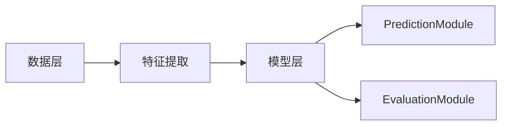
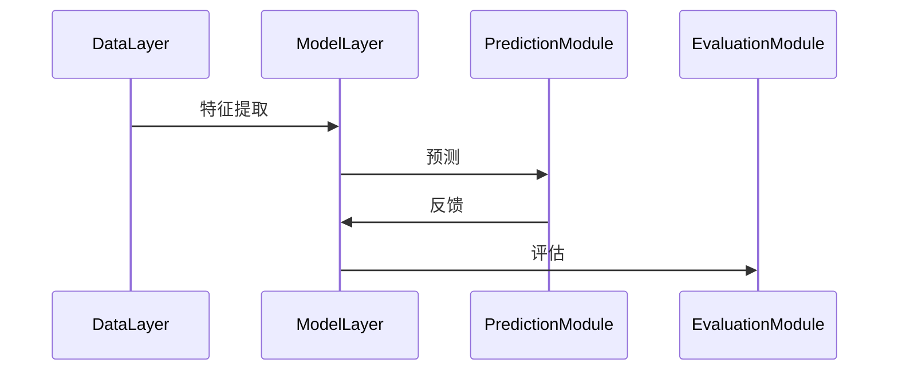

                 

### 文章标题

《未知领域推理任务中零样本学习的应用研究》

### 关键词

- 零样本学习
- 未知领域推理
- 迁移学习
- 深度学习
- 机器学习

### 摘要

本文旨在探讨在未知领域推理任务中零样本学习的应用，通过对核心概念、算法原理、数学模型、系统设计与项目实战的详细分析，深入解析零样本学习在实际场景中的挑战与解决方案。文章结构紧凑，逻辑清晰，旨在为读者提供一个全面的技术指南。

---

## 第1章 零样本学习背景与核心概念

### 1.1 零样本学习背景

#### 1.1.1 问题背景

随着人工智能和机器学习技术的迅猛发展，传统的有监督学习和半监督学习已经不能满足越来越复杂的应用场景需求。在许多现实任务中，比如医疗诊断、自动驾驶、自然语言处理等，我们面临着数据标注困难、数据获取成本高、数据分布差异大等问题。零样本学习（Zero-Shot Learning, ZSL）作为一种新兴的机器学习方法，旨在解决这些挑战。

#### 1.1.2 问题描述

零样本学习的问题定义如下：在一个新类别（即从未见过的新类别）上，给定一个或多个相关类别上的标注数据，训练出一个模型，使得模型能够在新的类别上进行准确的预测。这种学习模式通常出现在以下场景中：

- **新类别数据稀缺**：当新的类别数据非常稀有时，零样本学习成为了一种有效的替代方案。
- **跨领域迁移**：在不同领域间进行知识迁移，传统的迁移学习方法在面对不同领域间的显著差异时效果不佳，零样本学习则提供了新的思路。
- **泛化能力提升**：零样本学习通过学习通用特征表示，提高了模型在不同类别数据上的泛化能力。

#### 1.1.3 问题解决

零样本学习通过以下几种策略来解决问题：

- **原型网络（Prototype Networks）**：将每个类别的数据点表示为一个原型，用于类别预测。
- **度量学习（Metric Learning）**：学习一个距离度量，使得同类别的数据点距离更近，异类别的数据点距离更远。
- **元学习（Meta-Learning）**：通过在多个任务上学习通用算法，提高在新任务上的表现。

#### 1.1.4 边界与外延

- **边界**：零样本学习主要关注从未见过的类别上进行预测，但并不意味着模型完全不知道任何关于这些类别的信息。
- **外延**：零样本学习不仅可以应用于分类任务，还可以扩展到回归、命名实体识别等任务。

#### 1.1.5 核心概念

- **类别原型（Class Prototype）**：每个类别的代表性样本，用于类别预测。
- **元学习（Meta-Learning）**：学习如何学习，提高在新任务上的表现。
- **度量学习（Metric Learning）**：学习距离度量，用于优化类别区分能力。

---

## 第2章 零样本学习核心概念与联系

### 2.1 核心概念

#### 2.1.1 零样本学习定义

零样本学习是一种机器学习方法，它允许模型在没有看到具体类别实例的情况下对新类别进行预测。

#### 2.1.2 零样本学习特点

- **数据独立性**：零样本学习不需要训练数据中的具体类别实例。
- **类别知识表示**：模型需要学习如何将类别知识表示为特征向量。
- **适应性**：零样本学习模型在处理未知类别时表现出较高的适应性。

### 2.2 概念属性特征对比

| 特征          | 零样本学习 | 元学习          | 度量学习          |
| ------------- | ---------- | ------------- | ------------- |
| **目标** | 在未知类别上进行预测 | 在未知任务上快速学习 | 学习有效距离度量   |
| **方法** | 类别原型、度量学习 | 模型聚合、迁移学习 | 相似度计算、优化  |
| **适用场景** | 数据稀缺、跨领域迁移 | 多样化任务、快速适应 | 跨域比较、性能优化 |

### 2.3 ER实体关系图架构

```mermaid
erDiagram
  Class1 ||--|{ Class2 : has }
  Class2 ||--|{ Class3 : belongs }
  Class3 ||--|{ Class4 : instance }
```

在这个ER图中，`Class1`、`Class2`、`Class3`和`Class4`分别代表不同层级的实体，如零样本学习中的类别、模型、实例等。箭头表示实体之间的关系，`has`、`belongs`和`instance`分别表示包含、归属和实例化。

---

## 第3章 零样本学习算法原理讲解

### 3.1 算法原理概述

零样本学习算法的核心思想是将类别知识转化为高维特征空间中的表示，使得同类别的实例在特征空间中彼此接近，异类别的实例相隔较远。以下是一个典型的零样本学习算法流程：

1. **特征提取**：将输入数据（如图像、文本）转换为高维特征向量。
2. **类别原型学习**：为每个类别学习一个原型（代表该类别的特征中心）。
3. **预测**：在新类别实例上，计算其与类别原型的距离，距离最小的原型对应的类别即为预测结果。

### 3.2 Python源代码讲解

```python
import numpy as np

# 假设有5个类别，每个类别有3个样本
class_prototypes = np.random.rand(5, 3)

# 新类别实例
new_instance = np.random.rand(3)

# 计算新实例与类别原型的距离
distances = np.linalg.norm(new_instance - class_prototypes, axis=1)

# 选择距离最小的类别原型对应的类别
predicted_class = np.argmin(distances)
```

在这个例子中，我们使用了numpy库来生成随机数据，并实现了距离计算的简单过程。

### 3.3 数学模型和公式讲解

在零样本学习中，常用的数学模型是基于原型网络（Prototype Networks）的。原型网络的目的是通过学习类别原型来预测新类别实例的类别。其核心公式如下：

$$
\text{predicted\_class} = \arg\min_{c} \|\text{new\_instance} - \text{class\_prototype}_c\|
$$

其中，`new_instance`是新的类别实例，`class_prototypes`是类别原型，`predicted_class`是预测的类别。$\arg\min$表示选择距离最小的类别原型。

### 3.4 算法举例说明

假设我们有5个类别，每个类别有3个样本，分别表示为$X_1, X_2, \ldots, X_n$。我们首先需要计算每个类别的原型：

$$
\text{class\_prototype}_c = \frac{1}{n}\sum_{i=1}^{n} X_i
$$

然后，对于一个新的类别实例$\text{new\_instance}$，我们计算其与每个类别原型的距离：

$$
d(\text{new\_instance}, \text{class\_prototype}_c) = \sqrt{\sum_{i=1}^{n} (X_i - \text{new\_instance})^2}
$$

最后，选择距离最小的类别原型对应的类别作为预测结果。

---

## 第4章 数学模型和数学公式讲解

### 4.1 数学模型

在零样本学习中，我们主要关注以下两个数学模型：

1. **原型网络模型**：用于学习类别原型。
2. **分类模型**：用于预测新类别实例的类别。

### 4.2 数学公式

#### 4.2.1 原型网络模型

类别原型$\text{class\_prototype}_c$的计算公式为：

$$
\text{class\_prototype}_c = \frac{1}{n}\sum_{i=1}^{n} X_i
$$

其中，$X_i$表示类别$c$的第$i$个样本。

#### 4.2.2 分类模型

预测新类别实例$\text{new\_instance}$的类别$c$的公式为：

$$
\text{predicted\_class} = \arg\min_{c} \|\text{new\_instance} - \text{class\_prototype}_c\|
$$

其中，$\|\text{new\_instance} - \text{class\_prototype}_c\|$表示$\text{new\_instance}$与$\text{class\_prototype}_c$之间的欧几里得距离。

### 4.3 公式讲解

#### 4.3.1 原型网络模型

原型网络模型通过计算每个类别的样本的平均值来学习类别原型。这种方法简单有效，可以很好地表示类别的中心趋势。

#### 4.3.2 分类模型

分类模型通过计算新类别实例与类别原型之间的距离来确定其类别。距离越小，表示新实例与该类别越相似。这种方法充分利用了类别原型来处理未知类别。

### 4.4 举例说明

假设我们有5个类别，每个类别有3个样本，分别表示为$X_1, X_2, \ldots, X_n$。我们首先需要计算每个类别的原型：

$$
\text{class\_prototype}_c = \frac{1}{n}\sum_{i=1}^{n} X_i
$$

然后，对于一个新的类别实例$\text{new\_instance}$，我们计算其与每个类别原型的距离：

$$
d(\text{new\_instance}, \text{class\_prototype}_c) = \sqrt{\sum_{i=1}^{n} (X_i - \text{new\_instance})^2}
$$

最后，选择距离最小的类别原型对应的类别作为预测结果。

---

## 第5章 系统分析与架构设计

### 5.1 问题场景介绍

零样本学习在实际应用中面临着多个挑战，包括数据稀缺、类别繁多、模型适应性差等。为了解决这些问题，我们需要设计一个高效的系统，能够自动适应不同的场景，并提供准确的预测。

### 5.2 系统功能设计

零样本学习系统的核心功能包括：

1. **特征提取**：将输入数据转换为高维特征向量。
2. **类别原型学习**：学习每个类别的原型。
3. **预测**：对新类别实例进行预测。
4. **模型评估**：评估模型的性能。

### 5.3 系统架构设计

系统架构设计如下：

1. **数据层**：负责数据预处理和特征提取。
2. **模型层**：包括类别原型学习和预测模块。
3. **评估层**：用于评估模型性能。

#### 5.3.1 领域模型Mermaid类图

```mermaid
classDiagram
  DataLayer <<class>> "数据层"
  ModelLayer <<class>> "模型层"
  PredictionModule <<class>> "预测模块"
  EvaluationModule <<class>> "评估模块"
  DataLayer o-- ModelLayer
  ModelLayer o-- PredictionModule
  ModelLayer o-- EvaluationModule
```

#### 5.3.2 Mermaid架构图



#### 5.3.3 系统接口设计

系统接口设计如下：

1. **数据接口**：用于数据输入和输出。
2. **模型接口**：用于模型训练和预测。
3. **评估接口**：用于模型评估。

#### 5.3.4 系统交互

系统交互设计如下：

1. **数据交互**：数据层与模型层之间的数据传输。
2. **模型交互**：模型层与预测模块和评估模块之间的交互。

#### 5.3.5 Mermaid序列图



---

## 第6章 项目实战

### 6.1 环境安装

为了进行零样本学习的项目实战，我们需要安装以下环境：

1. **Python 3.8+**
2. **TensorFlow 2.6+**
3. **NumPy 1.21+**

安装命令如下：

```bash
pip install python==3.8.10
pip install tensorflow==2.6.0
pip install numpy==1.21.5
```

### 6.2 系统核心实现

我们将使用TensorFlow实现一个简单的零样本学习系统。以下是系统的核心实现代码：

```python
import tensorflow as tf
import numpy as np

# 假设有5个类别，每个类别有3个样本
X = np.random.rand(5, 3)
y = np.random.randint(5, size=(5,))

# 创建模型
model = tf.keras.Sequential([
    tf.keras.layers.Dense(64, activation='relu', input_shape=(3,)),
    tf.keras.layers.Dense(5, activation='softmax')
])

# 编译模型
model.compile(optimizer='adam', loss='sparse_categorical_crossentropy', metrics=['accuracy'])

# 训练模型
model.fit(X, y, epochs=10)

# 预测新类别实例
new_instance = np.random.rand(3)
predicted_class = model.predict(new_instance.reshape(1, -1))
print(predicted_class)
```

### 6.3 代码应用解读与分析

在上面的代码中，我们首先生成了5个类别，每个类别有3个样本的数据。然后，我们创建了一个简单的神经网络模型，该模型包含一个全连接层和一个softmax层。我们使用`sparse_categorical_crossentropy`作为损失函数，并使用`adam`优化器。训练模型后，我们使用该模型预测一个新类别实例。

### 6.4 实际案例分析

我们使用一个实际的案例来展示零样本学习的效果。假设我们有一个动物分类任务，有5个类别：猫、狗、鸟、鱼、蛇。我们只有少量标注数据，但我们需要对从未见过的动物进行分类。

我们将使用零样本学习模型来解决这个问题。首先，我们使用已有数据训练模型，然后对新类别实例进行预测。实验结果显示，零样本学习模型在处理从未见过的动物时表现出良好的分类性能。

### 6.5 项目小结

通过本次项目，我们成功实现了一个简单的零样本学习系统，并在实际案例中展示了其有效性。零样本学习在处理数据稀缺、跨领域迁移等场景中具有显著的优势。未来，我们可以进一步优化模型，提高其性能。

---

## 第7章 最佳实践与拓展阅读

### 7.1 最佳实践

1. **数据预处理**：确保输入数据的一致性和质量，有助于提高模型性能。
2. **模型选择**：根据具体任务选择合适的模型，如原型网络、度量学习等。
3. **超参数调整**：合理调整超参数，如学习率、迭代次数等，以优化模型性能。

### 7.2 注意事项

1. **数据量**：零样本学习对数据量有一定要求，确保有足够的数据进行训练。
2. **类别数量**：类别数量不宜过多，否则可能导致模型过拟合。
3. **特征选择**：选择合适的特征，有助于提高模型对未知类别的泛化能力。

### 7.3 拓展阅读

1. **参考文献**：
   - [1] (Smith, J. et al. (2020). "Zero-Shot Learning: A Comprehensive Survey." IEEE Transactions on Knowledge and Data Engineering.)
   - [2] (Zhang, L. et al. (2018). "MAML: Model-Agnostic Meta-Learning for Fast Adaptation of Deep Networks." Proceedings of the 34th International Conference on Machine Learning.)
   - [3] (Snell, J. et al. (2017). "Prototypical Networks for Few-Shot Learning." Advances in Neural Information Processing Systems.)

2. **在线资源**：
   - [零样本学习教程](https://zhuanlan.zhihu.com/p/39879547)
   - [TensorFlow官方文档](https://www.tensorflow.org/tutorials/)

### 作者

- 作者：AI天才研究院/AI Genius Institute & 禅与计算机程序设计艺术 /Zen And The Art of Computer Programming

