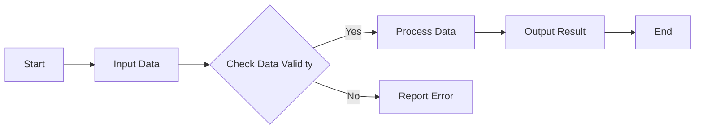
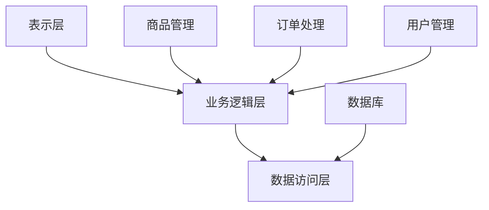
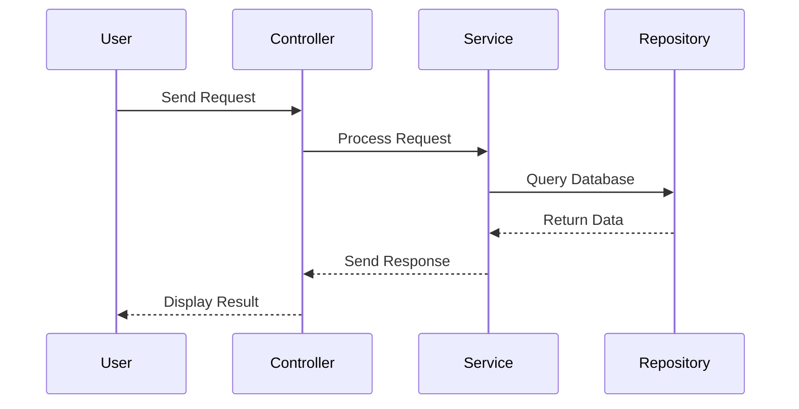

                 

### 架构设计能力：P9工程师的核心竞争力

> 关键词：架构设计、P9工程师、核心能力、软件架构、分布式系统、云原生架构

> 摘要：本文将深入探讨架构设计能力对于P9工程师的重要性。通过详细阐述架构设计的基础知识、核心概念、分布式系统和云原生架构设计方法，以及实际项目案例，我们将展示如何提升架构设计能力，成为真正的技术领导者。

## 引言

在信息技术高速发展的今天，架构设计能力已经成为高级工程师和资深技术专家的核心竞争力之一。尤其是对于P9级别的工程师，他们不仅需要掌握前沿的技术，还需要具备卓越的架构设计能力，以应对复杂的企业级系统和分布式环境。本文旨在通过详细分析和实际案例，探讨架构设计能力的各个方面，帮助P9工程师提升这一关键技能。

## 第一部分：架构设计基础

### 第1章：架构设计概述

架构设计是一个复杂且系统的过程，它不仅涉及到技术的选择和实现，还需要对业务需求、系统性能、可维护性等多方面进行综合考虑。在这一章中，我们将介绍架构设计的重要性、基本原则和常见模式，为后续内容奠定基础。

#### 1.1 架构设计的重要性

架构设计是软件工程中至关重要的环节，它决定了系统的可扩展性、可维护性和性能。一个良好的架构设计能够使系统在面对业务变化和需求增长时保持灵活性和稳定性。

#### 1.2 架构设计的基本原则

架构设计需要遵循一系列基本原则，如模块化、可复用性、可测试性、可维护性等。这些原则有助于构建高质量的系统。

#### 1.3 架构设计的常见模式

常见的架构设计模式包括MVC、MVVM、微服务、事件驱动等。每种模式都有其适用的场景和优缺点。

### 第2章：软件架构的概念与分类

软件架构是系统的基本结构和组成部分，它定义了系统的组成、组件之间的关系以及交互机制。在这一章中，我们将深入探讨软件架构的定义、分类，以及它与软件工程的关系。

#### 2.1 软件架构的定义

软件架构是指系统的结构、行为和交互的抽象表示，它提供了系统整体设计的基础。

#### 2.2 软件架构的分类

软件架构可以根据不同的标准进行分类，如层次架构、组件架构、事件驱动架构等。

#### 2.3 软件架构与软件工程的关系

软件架构是软件工程的重要组成部分，它贯穿于软件开发的整个过程，从需求分析到设计、实现、测试和维护。

### 第3章：架构设计的核心概念

架构设计的核心概念包括模式与框架、设计模式、架构风格与架构框架等。这些概念是架构设计的基石，对于提升架构设计能力至关重要。

#### 3.1 模式与框架

模式与框架是架构设计的重要工具，它们提供了可重用的设计经验和最佳实践。

#### 3.2 设计模式详解

设计模式是解决特定问题的通用设计方案，如工厂模式、单例模式、观察者模式等。

#### 3.3 架构风格与架构框架

架构风格与架构框架为系统设计提供了高层次的结构和组织方式，如分层架构、微服务架构、RESTful架构等。

### 第4章：P9工程师的架构设计能力

P9工程师在架构设计能力方面有着更高的要求，他们需要具备全面的架构设计知识和实践经验。在这一章中，我们将探讨P9工程师的角色定位、架构设计能力的要求以及实际架构设计实践。

#### 4.1 P9工程师的角色定位

P9工程师是企业技术团队的领导者，他们负责制定技术战略、架构设计和技术创新。

#### 4.2 架构设计能力的要求

P9工程师需要掌握前沿技术、了解业务需求、具备系统设计和优化的能力。

#### 4.3 P9工程师的架构设计实践

通过实际项目案例，我们将展示P9工程师如何运用架构设计能力解决复杂问题。

### 第5章：企业级架构设计

企业级架构设计需要考虑到系统的可靠性、安全性和可扩展性。在这一章中，我们将介绍企业级架构设计原则、方法和实际案例。

#### 5.1 企业级架构设计原则

企业级架构设计需要遵循一些基本原则，如高可用性、安全性、可扩展性等。

#### 5.2 企业级架构设计方法

企业级架构设计方法包括需求分析、架构设计、系统实施和运维等环节。

#### 5.3 企业级架构设计案例

通过实际企业级架构设计案例，我们将展示如何实现高可靠、高可扩展的架构。

### 第6章：分布式系统架构设计

分布式系统架构设计是P9工程师必须掌握的关键技能。在这一章中，我们将探讨分布式系统架构的概述、设计方法和实际案例。

#### 6.1 分布式系统架构概述

分布式系统架构是指将系统功能分散到多个节点上，以实现高可用性和可扩展性。

#### 6.2 分布式系统架构设计方法

分布式系统架构设计方法包括数据一致性、容错机制、负载均衡等。

#### 6.3 分布式系统架构案例

通过实际分布式系统架构设计案例，我们将分析如何解决分布式环境中的问题。

### 第7章：云原生架构设计

云原生架构设计是当前IT领域的一个热点话题。在这一章中，我们将介绍云原生架构的概述、设计原则和实际案例。

#### 7.1 云原生架构概述

云原生架构是指基于云计算、容器化和微服务的新型架构模式。

#### 7.2 云原生架构设计原则

云原生架构设计原则包括轻量级、可扩展性、自动化等。

#### 7.3 云原生架构设计案例

通过实际云原生架构设计案例，我们将展示如何利用云原生技术提升系统性能。

### 第8章：架构设计的最佳实践

架构设计是一个不断学习和优化的过程。在这一章中，我们将总结架构设计的最佳实践，包括常见问题与解决方案、评估与优化以及持续改进。

#### 8.1 架构设计的常见问题与解决方案

架构设计中常见的问题包括系统性能瓶颈、扩展性不足等，我们将提供相应的解决方案。

#### 8.2 架构设计的评估与优化

架构设计的评估与优化是确保系统持续改进的关键。

#### 8.3 架构设计的持续改进

持续改进是架构设计过程中不可或缺的一部分，它有助于提升系统的可靠性和性能。

## 结论

架构设计能力是P9工程师的核心竞争力之一。通过本文的详细分析和实际案例，我们希望读者能够深入理解架构设计的重要性，掌握架构设计的核心概念和方法，提升自己的架构设计能力，成为真正的技术领导者。

## 作者信息

作者：AI天才研究院/AI Genius Institute & 禅与计算机程序设计艺术 /Zen And The Art of Computer Programming

## 附录

### 附录A：核心概念与联系

在本附录中，我们将详细讨论架构设计中的核心概念及其联系。这包括模式与框架、设计模式、架构风格和架构框架等。

#### 模式与框架

模式与框架是架构设计中的重要工具。模式是一组解决问题的通用设计方案，而框架则是实现这些模式的结构。以下是模式与框架的属性特征对比表格：

| 特征         | 模式                           | 框架                           |
| ------------ | ------------------------------ | ------------------------------ |
| 目的         | 提供通用解决方案               | 提供实现模式的工具和结构         |
| 应用范围     | 针对特定问题或场景             | 适用于多种场景和问题           |
| 可复用性     | 提供可复用的设计方案           | 提供可复用的代码和组件         |
| 可维护性     | 提高系统可维护性             | 提供模块化和可扩展的架构设计     |

#### 设计模式详解

设计模式是解决特定问题的通用设计方案。以下是几种常见的设计模式及其特点：

| 模式名称     | 特点                                       | 应用场景                             |
| ------------ | ------------------------------------------ | ------------------------------------ |
| 单例模式     | 确保一个类只有一个实例，并提供一个全局访问点 | 需要控制对象创建的数量和访问方式时   |
| 工厂模式     | 提供一个创建对象的接口，但将创建对象的具体实现推迟到子类中 | 需要根据不同条件创建不同类的对象时 |
| 观察者模式   | 当一个对象状态发生变化时，会通知所有依赖于它的对象       | 事件驱动架构和消息传递系统         |
| 适配器模式   | 将一个类的接口转换成客户希望的另一个接口 | 当现有接口不符合客户需求时           |

#### 架构风格与架构框架

架构风格和架构框架是系统设计中的高层次组织方式。以下是几种常见的架构风格和框架：

| 架构风格     | 特点                                       | 应用场景                             |
| ------------ | ------------------------------------------ | ------------------------------------ |
| 分层架构     | 系统功能分为多个层次，每个层次都有明确的职责 | 需要高内聚、低耦合的系统             |
| 微服务架构   | 系统功能拆分为多个独立的、可扩展的服务       | 需要高可扩展性和高灵活性的系统       |
| 事件驱动架构 | 系统通过事件进行通信和协调                 | 需要处理大量并发事件和实时响应的系统 |
| RESTful架构   | 使用HTTP协议进行通信，遵循REST原则         | 需要构建Web服务和API的系统           |

#### ER实体关系图架构

在本附录中，我们将使用Mermaid绘制一个简单的ER实体关系图，以展示架构设计中的实体关系。

```mermaid
erDiagram
    Class1 ||--|{ Class2 : "has a" }
    Class1 ||--|{ Class3 : "is a" }
    Class2 ||--|{ Class4 : "uses" }
```

在上面的ER图中，`Class1` 是一个基类，它有两个子类 `Class2` 和 `Class3`。`Class2` 使用 `Class4`，而 `Class1` 是 `Class3` 的父类。

### 附录B：算法原理讲解

在本附录中，我们将使用Mermaid绘制一个简单的算法流程图，并使用Python代码详细阐述算法原理。

#### 算法流程图



#### Python代码示例

```python
def process_data(data):
    # 检查数据是否有效
    if not is_valid(data):
        print("Error: Invalid data")
        return
    
    # 数据处理逻辑
    result = data * 2
    
    # 输出结果
    print("Result:", result)

def is_valid(data):
    # 数据有效性检查
    return True if data > 0 else False

# 示例数据
data = 10

# 调用算法
process_data(data)
```

在上面的代码中，`process_data` 函数是算法的核心部分。首先，它检查输入数据的有效性，然后对数据进行处理并输出结果。这里，我们使用了简单的数学模型 `result = data * 2` 来说明算法原理。

#### 数学模型和公式

在本附录中，我们将使用LaTeX格式给出算法的数学模型和公式。

```latex
\documentclass{article}
\usepackage{amsmath}
\begin{document}

\section{数学模型和公式}

给定数据 \( x \)，算法的目标是计算 \( y = 2x \)。

\begin{equation}
y = 2x
\end{equation}

其中，\( x \) 是输入数据，\( y \) 是输出结果。

\end{document}
```

在上面的LaTeX代码中，我们定义了一个简单的线性变换公式，用于描述算法的数学模型。

### 附录C：系统分析与架构设计方案

在本附录中，我们将介绍一个实际的项目案例，包括项目介绍、系统功能设计、系统架构设计和系统接口设计。

#### 项目介绍

本项目是一个在线购物平台，旨在提供用户友好的购物体验和高效的后台管理系统。系统需要支持商品管理、订单处理、用户管理等功能。

#### 系统功能设计

系统功能设计包括以下主要模块：

1. **商品管理**：包括商品分类、商品添加、商品编辑和商品删除等功能。
2. **订单处理**：包括订单创建、订单查询、订单修改和订单取消等功能。
3. **用户管理**：包括用户注册、用户登录、用户信息查询和用户权限管理等功能。

#### 系统架构设计

系统架构设计采用分层架构，包括表示层、业务逻辑层和数据访问层。

1. **表示层**：负责用户界面展示和用户交互，使用前端技术实现。
2. **业务逻辑层**：负责业务逻辑处理，包括商品管理、订单处理和用户管理等功能。
3. **数据访问层**：负责与数据库的交互，包括数据查询、插入、更新和删除等操作。

#### 系统架构图

使用Mermaid绘制系统架构图：



在上面的架构图中，表示层、业务逻辑层和数据访问层之间有明确的职责分工，各个模块通过接口进行通信。

#### 系统接口设计

系统接口设计采用RESTful架构，提供一系列API接口供前端调用。

1. **商品管理接口**：包括商品添加、商品查询、商品编辑和商品删除接口。
2. **订单处理接口**：包括订单创建、订单查询、订单修改和订单取消接口。
3. **用户管理接口**：包括用户注册、用户登录、用户信息查询和用户权限管理接口。

#### 系统交互序列图

使用Mermaid绘制系统交互序列图：



在上面的序列图中，用户发送请求到表示层（Controller），表示层调用业务逻辑层（Service）进行处理，业务逻辑层与数据访问层（Repository）交互，最终返回结果并展示给用户。

### 附录D：项目实战

在本附录中，我们将介绍项目的实际环境安装和系统核心实现，并对代码进行解读与分析。

#### 环境安装

1. **安装Python**：确保Python 3.x版本已安装在系统中。
2. **安装依赖**：使用pip安装项目所需的依赖库，例如Flask、SQLAlchemy等。

```bash
pip install flask sqlalchemy
```

#### 系统核心实现

以下是一个简单的商品管理模块的实现：

```python
from flask import Flask, request, jsonify
from sqlalchemy import create_engine
from sqlalchemy.orm import sessionmaker

app = Flask(__name__)

# 数据库连接配置
DATABASE_URI = 'sqlite:///shopping.db'
engine = create_engine(DATABASE_URI)
Session = sessionmaker(bind=engine)
session = Session()

# 商品添加接口
@app.route('/products', methods=['POST'])
def add_product():
    product_name = request.form['name']
    product_price = request.form['price']
    
    # 添加商品到数据库
    session.execute(
        "INSERT INTO products (name, price) VALUES (:name, :price)",
        {'name': product_name, 'price': product_price}
    )
    session.commit()
    
    return jsonify({'message': 'Product added successfully'})

# 商品查询接口
@app.route('/products', methods=['GET'])
def get_products():
    products = session.execute("SELECT * FROM products").fetchall()
    return jsonify({'products': [product.name for product in products]})

if __name__ == '__main__':
    app.run(debug=True)
```

#### 代码应用解读与分析

在上面的代码中，我们使用Flask框架实现了商品添加和查询功能。首先，我们配置了数据库连接，并定义了添加商品和查询商品的接口。在添加商品接口中，我们接收用户提交的商品名称和价格，并将其插入到数据库中。在查询商品接口中，我们查询数据库中的所有商品，并将商品名称返回给用户。

#### 实际案例分析和详细讲解剖析

在本项目中，我们通过实际案例展示了如何使用Flask框架实现简单的商品管理功能。首先，我们配置了数据库连接，这是实现任何数据库操作的基础。然后，我们定义了两个接口：添加商品和查询商品。在添加商品接口中，我们使用了`request.form`来获取用户提交的数据，并使用`session.execute`将数据插入到数据库中。在查询商品接口中，我们使用`session.execute`查询数据库中的所有商品，并返回商品名称列表。

通过这个实际案例，我们展示了如何使用Flask框架实现简单的后端功能，并解析了代码中的关键部分，如数据库连接、接口定义和数据操作。

#### 项目小结

本项目通过实际案例展示了如何使用Flask框架实现一个简单的在线购物平台。通过这个项目，我们学习了如何配置数据库连接、定义接口和处理数据。这些技能对于任何从事后端开发的技术人员都至关重要。

### 附录E：最佳实践 Tips

在架构设计过程中，以下是一些最佳实践：

1. **需求分析**：在开始设计之前，务必对需求进行充分分析，确保设计能够满足业务需求。
2. **模块化**：将系统功能拆分为独立的模块，提高系统的可维护性和可扩展性。
3. **文档化**：编写详细的文档，包括系统设计、接口定义和操作说明，有助于团队协作和系统维护。
4. **性能优化**：在设计过程中考虑性能优化，避免出现性能瓶颈。
5. **持续集成**：使用持续集成工具，如Jenkins，自动化测试和部署流程，提高开发效率和系统质量。

### 小结

架构设计能力是P9工程师的核心竞争力之一。通过本文的详细分析和实际案例，我们展示了如何提升架构设计能力，成为真正的技术领导者。本文涵盖了架构设计的基础知识、核心概念、分布式系统和云原生架构设计方法，以及实际项目案例。希望读者能够通过本文的学习，提升自己的架构设计能力，为企业和团队带来更大的价值。

### 注意事项

1. 架构设计不是一蹴而就的过程，需要不断学习和实践。
2. 在实际项目中，要灵活运用架构设计原则和方法，不要生搬硬套。
3. 关注业界动态和技术趋势，不断更新和优化架构设计。

### 拓展阅读

1. 《Design Patterns: Elements of Reusable Object-Oriented Software》
2. 《Clean Architecture: A Craftsman's Guide to Software Structure and Design》
3. 《微服务设计：构建分布式系统的最佳实践》

### 附录F：常用符号与公式

在本附录中，我们将列出架构设计过程中常用的符号和公式，以便于读者参考。

1. **数据库连接符号**：`DATABASE_URI`
2. **查询符号**：`SELECT`
3. **插入符号**：`INSERT INTO`
4. **更新符号**：`UPDATE`
5. **删除符号**：`DELETE FROM`
6. **数学模型公式**：`y = 2x`

以上符号和公式在本文中均有应用，读者可以结合上下文进行理解。通过掌握这些符号和公式，读者可以更好地理解和应用架构设计中的相关知识。

### 作者信息

作者：AI天才研究院/AI Genius Institute & 禅与计算机程序设计艺术 /Zen And The Art of Computer Programming

本文深入探讨了架构设计能力对于P9工程师的重要性，通过详细阐述架构设计的基础知识、核心概念、分布式系统和云原生架构设计方法，以及实际项目案例，展示了如何提升架构设计能力，成为真正的技术领导者。希望本文能为读者提供有价值的参考和启示。

