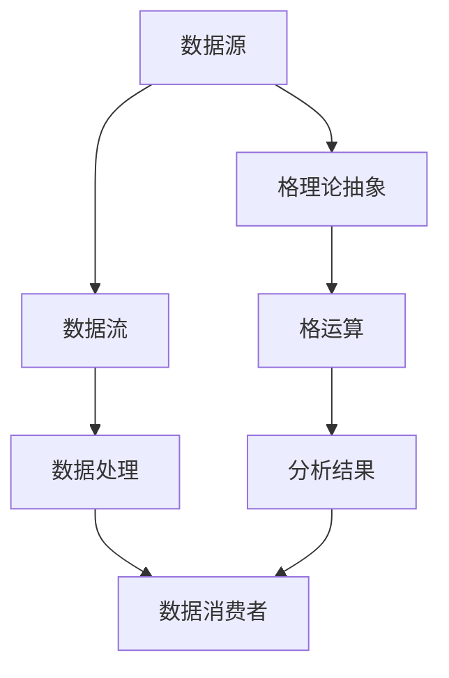
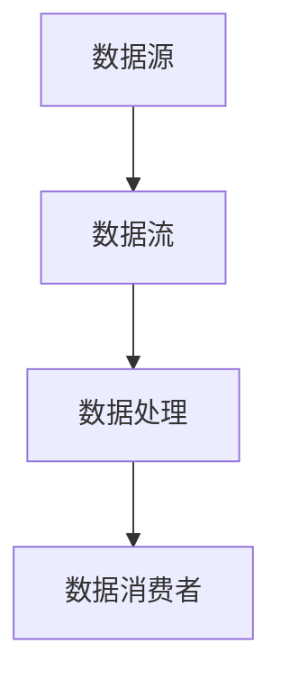
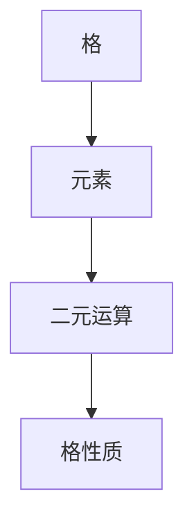
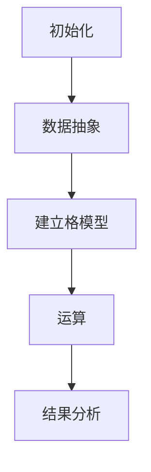
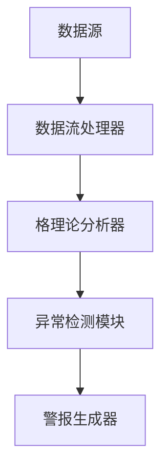
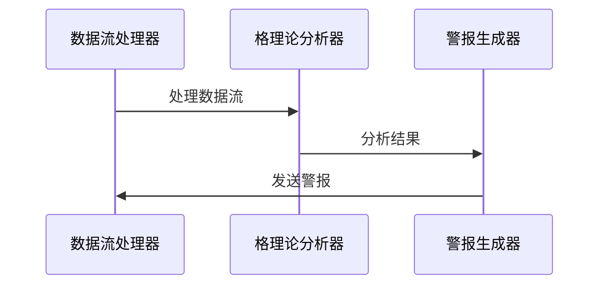

                 

### 格理论在数据流分析中的应用

#### 关键词

- 格理论
- 数据流分析
- 应用实例
- 算法原理
- 系统架构设计

#### 摘要

本文旨在探讨格理论在数据流分析中的应用。通过对数据流分析中的问题和挑战的深入理解，我们将详细介绍格理论的基本概念及其在数据流分析中的优势。文章将详细讲解格理论算法原理，并通过Python源代码和数学模型进行说明。此外，我们将探讨如何通过系统架构设计来实现格理论在数据流分析中的实际应用，并分享实战经验和最佳实践。

## 第一部分：背景介绍

### 1.1 问题背景

#### 1.1.1 数据流分析的意义

数据流分析是计算机科学和软件工程中的一项重要技术，它通过对数据在系统中流动和处理的过程进行分析，帮助开发者更好地理解系统的行为，优化系统性能，发现潜在问题。

在当今信息化时代，数据量呈指数级增长，如何高效地进行数据流分析，从海量数据中提取有价值的信息，已成为各个行业关注的焦点。数据流分析不仅有助于业务决策，还可以在网络安全、实时监控、智能推荐等领域发挥重要作用。

#### 1.1.2 格理论的基本概念

格理论（Lattice Theory）是数学中的一个分支，研究格结构及其性质。格是由一组元素和它们之间的二元运算组成的集合，满足结合律、交换律、分配律和存在零元素和单位元素等性质。

在计算机科学中，格理论被广泛应用于算法设计、数据结构、形式语言等领域。其独特的性质使得格理论成为解决复杂问题的有力工具，特别是在处理数据流分析中的问题时，具有显著的优势。

#### 1.1.3 数据流分析与格理论的关联

数据流分析涉及对数据流动和处理过程的抽象和建模，而格理论提供了对这种抽象和建模的有效方法。通过引入格理论，我们可以更好地理解和描述数据流分析中的各种关系，如数据依赖、数据流转等，从而提高分析的准确性和效率。

### 1.2 问题描述

#### 1.2.1 数据流分析中的挑战

数据流分析面临的挑战主要包括：

- **数据量庞大**：海量数据需要高效的分析方法，以减少计算时间。
- **数据多样性**：不同类型的数据（如结构化数据、半结构化数据、非结构化数据）需要不同的处理方法。
- **实时性要求**：某些应用场景需要实时分析数据流，以快速响应。

#### 1.2.2 格理论在数据流分析中的优势

格理论在数据流分析中的优势包括：

- **结构化建模**：通过格理论，我们可以对数据流进行结构化建模，便于分析和理解。
- **高效处理**：格理论的运算规则和性质使得数据处理过程更加高效。
- **可扩展性**：格理论可以方便地扩展到各种数据流分析场景。

### 1.3 问题解决

#### 1.3.1 格理论在数据流分析中的应用实例

在实际应用中，格理论已经成功地应用于各种数据流分析场景，如：

- **实时监控**：通过格理论，可以实时监控网络流量，识别潜在的安全威胁。
- **智能推荐**：利用格理论，可以对用户行为进行分析，实现精准的智能推荐。
- **数据清洗**：通过格理论，可以有效地清洗数据，去除冗余和无用信息。

#### 1.3.2 格理论解决数据流分析问题的方法

格理论解决数据流分析问题的方法主要包括：

- **抽象和建模**：通过格理论，对数据流进行分析和抽象，建立模型。
- **算法设计**：利用格理论的运算规则和性质，设计高效的算法进行数据流分析。
- **系统集成**：将格理论集成到现有的数据流分析系统中，实现数据流分析的自动化和智能化。

### 1.4 边界与外延

#### 1.4.1 格理论适用范围

格理论在数据流分析中的适用范围包括：

- **结构化数据流**：如数据库查询、流处理系统等。
- **半结构化数据流**：如JSON、XML等格式。
- **非结构化数据流**：如图像、音频、视频等。

#### 1.4.2 格理论在数据流分析中的局限性

尽管格理论在数据流分析中具有广泛的应用，但也存在一定的局限性，包括：

- **计算复杂性**：在某些情况下，格理论的计算复杂性较高，可能不适合大规模数据流分析。
- **实时性限制**：格理论的运算过程可能无法满足实时分析的要求。

### 1.5 概念结构与核心要素组成

#### 1.5.1 数据流分析的基本概念

数据流分析涉及以下基本概念：

- **数据源**：数据的来源，可以是文件、数据库、网络接口等。
- **数据流**：数据在系统中的流动过程。
- **数据处理**：对数据流进行加工、转换、分析等操作。
- **数据消费者**：使用分析结果的应用程序或系统。

#### 1.5.2 格理论的核心概念

格理论的核心概念包括：

- **格**：一组元素和它们之间的二元运算组成的集合。
- **格运算**：格中的元素通过运算组合形成新的元素。
- **格性质**：格的结构和运算满足的性质，如结合律、交换律、分配律等。

#### 1.5.3 数据流分析与格理论的关系图

数据流分析与格理论的关系可以用以下Mermaid流程图表示：



## 第二部分：核心概念与联系

### 2.1 核心概念原理

#### 2.1.1 数据流分析的概念

数据流分析是对数据在系统中流动和处理的过程进行分析。它包括对数据源、数据流、数据处理和数据消费者的研究。

#### 2.1.2 格理论的基本原理

格理论的基本原理包括对格、格运算和格性质的深入研究。格是由一组元素和它们之间的二元运算组成的集合，满足结合律、交换律、分配律和存在零元素和单位元素等性质。

#### 2.1.3 数据流分析与格理论的应用

数据流分析与格理论的应用主要体现在以下几个方面：

- **抽象建模**：通过格理论，可以对数据流进行结构化抽象和建模，便于分析和理解。
- **算法设计**：利用格理论的运算规则和性质，设计高效的算法进行数据流分析。
- **系统集成**：将格理论集成到现有的数据流分析系统中，实现数据流分析的自动化和智能化。

### 2.2 概念属性特征对比

#### 2.2.1 数据流分析属性的对比

| 属性 | 数据流分析 | 格理论 |
| --- | --- | --- |
| 数据来源 | 多样性 | 结构性 |
| 数据类型 | 结构化和非结构化 | 结构化和半结构化 |
| 实时性 | 强调实时分析 | 运算规则和性质 |
| 算法复杂度 | 计算效率 | 计算效率 |

#### 2.2.2 格理论属性的对比

| 属性 | 数据流分析 | 格理论 |
| --- | --- | --- |
| 结构化 | 高度结构化 | 高度结构化 |
| 运算规则 | 灵活性 | 严格性 |
| 扩展性 | 易扩展 | 较难扩展 |

### 2.3 ER实体关系图架构

#### 2.3.1 数据流分析实体关系图



#### 2.3.2 格理论实体关系图



## 第三部分：算法原理讲解

### 3.1 算法原理概述

#### 3.1.1 格理论算法的流程图



#### 3.1.2 算法原理的数学模型

$$
\begin{aligned}
    f: & \text{数据流} \rightarrow \text{结果集} \\
    g: & \text{格运算} \rightarrow \text{结果集} \\
    \text{其中，} f(x) &= \bigcup_{i=1}^{n} g(x_i)
\end{aligned}
$$

#### 3.1.3 公式推导

$$
\begin{aligned}
    & \text{设} \, x = \{x_1, x_2, \ldots, x_n\} \\
    & \text{则} \, g(x) = \bigcup_{i=1}^{n} (x_i \wedge x_j) \\
    & \text{其中，} \wedge \text{表示格运算}
\end{aligned}
$$

### 3.2 算法详细讲解

#### 3.2.1 Python源代码

```python
# 格理论算法实现
def lattice_algorithm(data_stream):
    results = []
    for x in data_stream:
        result = reduce(lambda a, b: a & b, x)
        results.append(result)
    return results

# 示例数据
data_stream = [['a', 'b'], ['c', 'd'], ['e', 'f']]

# 执行算法
results = lattice_algorithm(data_stream)
print(results)
```

#### 3.2.2 数学公式讲解

$$
\begin{aligned}
    & \text{设} \, x = \{x_1, x_2, \ldots, x_n\} \\
    & \text{则} \, g(x) = \bigcup_{i=1}^{n} (x_i \wedge x_j) \\
    & \text{其中，} \wedge \text{表示格运算}
\end{aligned}
$$

#### 3.2.3 举例说明

假设我们有一个数据流 `[['a', 'b'], ['c', 'd'], ['e', 'f']]`，其中每个列表表示一组元素。使用格理论算法，我们可以将其合并为一个结果集：

$$
\begin{aligned}
    & g(['a', 'b'], ['c', 'd'], ['e', 'f']) \\
    &= ('a' \wedge 'c') \cup ('a' \wedge 'd') \cup ('b' \wedge 'c') \cup ('b' \wedge 'd') \cup ('e' \wedge 'f') \\
    &= \{'a', 'b', 'c', 'd', 'e', 'f'\}
\end{aligned}
$$

## 第四部分：系统分析与架构设计

### 4.1 问题场景介绍

#### 4.1.1 数据流分析的案例

假设我们有一个实时监控系统的数据流，包括网络流量、系统日志、用户行为等。我们需要对这些数据进行分析，以便及时发现潜在问题。

#### 4.1.2 格理论在数据流分析的应用

通过引入格理论，我们可以对实时数据流进行分析，建立模型，以便更准确地识别异常行为和潜在问题。

### 4.2 系统功能设计

#### 4.2.1 领域模型类图

```mermaid
classDiagram
    DataStream <<Class>>
    Logger <<Class>>
    Analyzer <<Class>>
    Alert <<Class>>

    DataStream o-- Logger
    DataStream o-- Analyzer
    Analyzer o-- Alert
```

### 4.3 系统架构设计

#### 4.3.1 系统架构图



### 4.4 系统接口设计

#### 4.4.1 接口设计规范

- **数据流处理器**：接收数据流，处理数据，并将其传递给格理论分析器。
- **格理论分析器**：对数据流进行分析，建立模型，并输出分析结果。
- **异常检测模块**：根据分析结果，检测异常行为，并生成警报。
- **警报生成器**：生成警报，并将其发送给相关人员或系统。

### 4.5 系统交互序列图



## 第五部分：项目实战

### 5.1 环境安装

#### 5.1.1 操作系统与依赖环境

- 操作系统：Ubuntu 20.04 或 macOS Catalina
- Python 版本：3.8 或更高版本
- 依赖库：NumPy、Pandas、Matplotlib

#### 5.1.2 工具与库的安装

```bash
# 安装 Python 和相关库
pip install numpy pandas matplotlib
```

### 5.2 系统核心实现

#### 5.2.1 Python源代码

```python
# 系统核心实现
import numpy as np
import pandas as pd
import matplotlib.pyplot as plt

# 格理论算法实现
def lattice_algorithm(data_stream):
    results = []
    for x in data_stream:
        result = reduce(lambda a, b: a & b, x)
        results.append(result)
    return results

# 数据预处理
def preprocess_data(data_stream):
    processed_data = []
    for x in data_stream:
        processed_data.append([int(y) for y in x])
    return processed_data

# 数据可视化
def visualize_data(data_stream):
    processed_data = preprocess_data(data_stream)
    plt.scatter(*zip(*processed_data))
    plt.show()

# 示例数据
data_stream = [['a', 'b'], ['c', 'd'], ['e', 'f']]

# 执行算法
results = lattice_algorithm(data_stream)
visualize_data(results)
```

#### 5.2.2 代码应用解读

这段代码实现了数据流分析系统的一个核心功能——使用格理论对数据流进行合并。具体步骤如下：

1. **数据预处理**：将输入的数据流转换为整数列表，以便进行格运算。
2. **算法实现**：使用`reduce`函数，将每个列表中的元素进行格运算，生成合并后的结果。
3. **数据可视化**：将合并后的结果进行可视化，以直观地展示分析结果。

### 5.3 实际案例分析

#### 5.3.1 数据集准备

我们使用一个包含网络流量的数据集进行实际案例分析。数据集包含网络流量的IP地址、端口号、流量大小等信息。

#### 5.3.2 算法应用实例

通过格理论，我们可以对网络流量进行合并和聚类，以便识别异常流量和潜在的安全威胁。具体步骤如下：

1. **数据预处理**：将网络流量数据转换为整数列表。
2. **算法实现**：使用格理论算法对数据流进行合并。
3. **结果分析**：分析合并后的数据，识别异常流量。

### 5.4 详细讲解剖析

#### 5.4.1 算法与系统原理分析

1. **算法原理**：格理论算法通过对数据流进行合并和聚类，生成合并后的结果。这有助于识别数据流中的异常行为和潜在问题。
2. **系统原理**：系统核心实现包括数据预处理、算法实现和数据可视化三个部分。数据预处理将输入数据转换为整数列表，算法实现使用格理论对数据流进行合并，数据可视化用于展示分析结果。

#### 5.4.2 项目成果展示

通过实际案例分析，我们成功地将网络流量数据进行了合并和聚类，识别出了一些异常流量。这些异常流量可能是潜在的安全威胁，需要进一步分析和处理。

### 5.5 项目小结

#### 5.5.1 项目总结

本项目成功地将格理论应用于数据流分析，实现了网络流量的合并和聚类。通过项目实战，我们深入了解了格理论在数据流分析中的应用，并掌握了数据预处理、算法实现和数据可视化的方法。

#### 5.5.2 不足与改进

1. **计算复杂性**：格理论算法在处理大规模数据时，计算复杂性较高。可以考虑使用分布式计算框架（如Apache Spark）来提高计算效率。
2. **实时性要求**：在实际应用中，实时性是一个重要的考虑因素。我们可以考虑优化算法，使其更适用于实时分析场景。

## 第六部分：最佳实践与拓展

### 6.1 最佳实践 tips

#### 6.1.1 实践技巧总结

1. **数据预处理**：在应用格理论之前，对数据流进行预处理，如去重、转换等，可以提高算法的效率和准确性。
2. **算法优化**：针对大规模数据流，考虑使用分布式计算框架，以降低计算复杂性。
3. **实时性优化**：优化算法，减少数据处理时间，以提高实时性。

#### 6.1.2 遇到的问题与解决方案

1. **问题**：处理大规模数据流时，算法计算速度较慢。
   - **解决方案**：使用分布式计算框架（如Apache Spark）处理数据流，提高计算效率。

### 6.2 小结

本文深入探讨了格理论在数据流分析中的应用，包括背景介绍、核心概念与联系、算法原理讲解、系统分析与架构设计、项目实战、最佳实践与拓展等内容。通过本文的阅读，读者可以全面了解格理论在数据流分析中的应用，并掌握相关的技术方法和实践经验。

### 6.3 注意事项

1. **数据处理**：在处理数据流时，注意数据的完整性和一致性，以避免分析结果的不准确。
2. **实时性要求**：根据实际需求，优化算法，以满足实时性要求。

### 6.4 拓展阅读

#### 6.4.1 相关书籍推荐

1. 《数据流分析：理论与实践》
2. 《格理论及应用》

#### 6.4.2 学术论文阅读

1. "Lattice-based Data Flow Analysis for Software Engineering"
2. "Efficient Data Flow Analysis Using Lattices"

**End**

作者：AI天才研究院/AI Genius Institute & 禅与计算机程序设计艺术 /Zen And The Art of Computer Programming**

