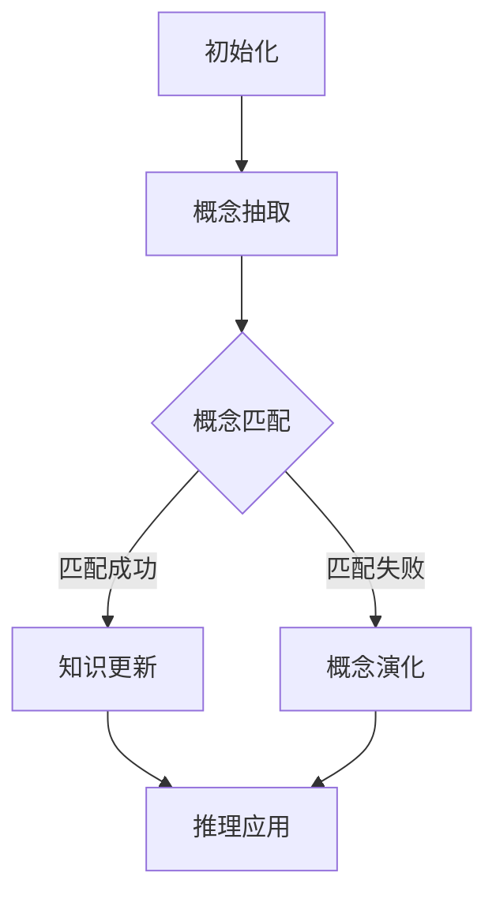
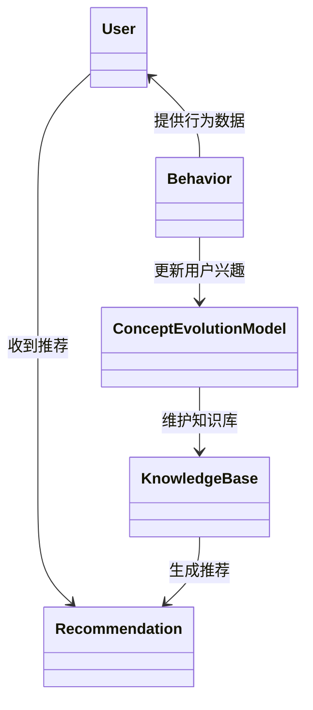
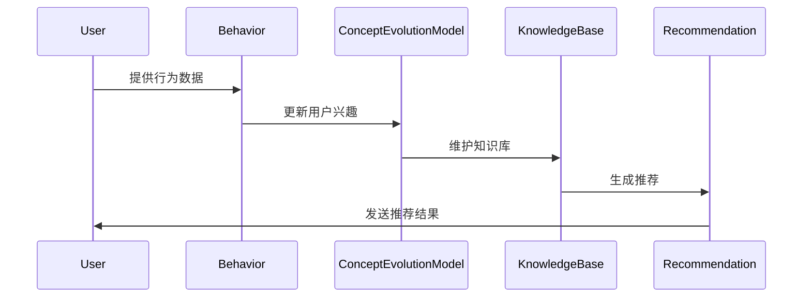
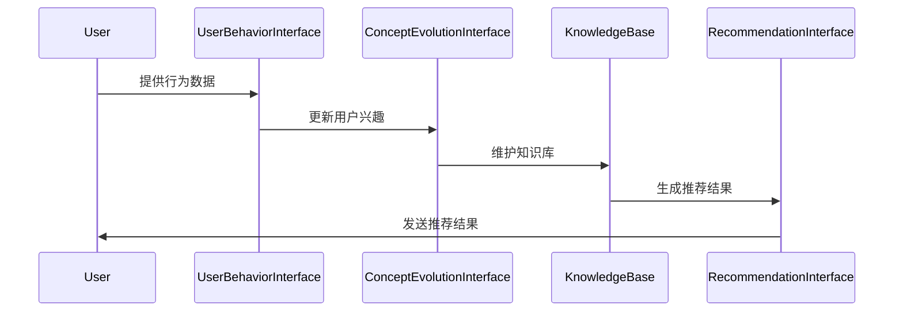

                 

### 文章标题

# 概念演化模型在动态知识表示中的推理应用

---

**关键词：** 概念演化模型、动态知识表示、推理应用、知识图谱、AI、深度学习

**摘要：** 本文旨在探讨概念演化模型在动态知识表示中的推理应用，深入分析其核心概念、算法原理，并通过具体的项目实战，展示其在实际场景中的应用效果。文章结构紧凑，逻辑清晰，旨在为读者提供从理论到实践的全面理解和应用指导。

---

### 引言

在信息爆炸的时代，知识表示和推理技术成为人工智能领域的关键研究方向。动态知识表示是人工智能领域的一个核心挑战，因为它需要适应不断变化的数据和信息。概念演化模型（Concept Evolution Model，CEM）作为一种新兴的动态知识表示方法，以其独特的机制和强大的适应性，成为解决这一挑战的有力工具。

本文将围绕概念演化模型展开，首先介绍其核心概念和原理，接着深入讲解算法的数学模型和流程，然后通过一个实际项目展示其在动态知识表示中的推理应用。最后，我们将总结最佳实践、注意事项，并提供拓展阅读。

### 核心概念与联系

**核心概念原理**

概念演化模型（CEM）是一种用于动态知识表示和推理的框架。其基本原理基于对概念的理解和演化。CEM 通过跟踪概念的语义演变，实现对知识的持续更新和优化。具体来说，CEM 利用语义网络来表示概念及其之间的关系，并通过持续学习来适应概念的变化。

**概念属性特征对比表格**

| 特征               | 概念演化模型（CEM） | 其他动态知识表示方法 |
|------------------|------------------|-------------------|
| 表示方式           | 语义网络           | 关键词提取、分类模型  |
| 适应性             | 高               | 较低              |
| 实时性             | 较高              | 较低              |
| 维度表示           | 高维语义向量       | 低维特征向量       |
| 面向任务           | 面向知识表示       | 面向具体任务       |
| 演化机制           | 语义演化           | 概率演化           |

**ER实体关系图架构**

为了更直观地展示概念演化模型的结构，我们可以使用ER（Entity-Relationship）图来描述其中的实体和关系。ER图包含以下实体和关系：

- **实体：** 概念、语义、关系、知识库
- **关系：** 演化、关联、继承

以下是一个简单的ER图示例：

```mermaid
erDiagram
    K1 ||--o> K2 : 演化
    K1 ||--o> K3 : 关联
    K2 ||--o> K4 : 继承
```

### 算法原理讲解

**mermaid流程图**

首先，我们使用mermaid绘制概念演化模型的流程图，以展示其基本流程：



**python源代码**

为了更好地理解CEM的算法原理，我们可以提供一个简单的python代码实现。以下是一个概念演化模型的简化版本：

```python
class ConceptEvolutionModel:
    def __init__(self):
        self知识库 = {}
    
    def 概念抽取(self, 数据):
        # 假设数据是一个包含关键词的列表
        self.知识库 = self.从数据中提取概念()
    
    def 从数据中提取概念(self, 数据):
        # 实现具体的抽取算法
        return set(数据)
    
    def 概念匹配(self, 新概念):
        # 实现概念匹配算法
        for 概念 in self.知识库:
            if self.概念相似度(概念, 新概念) > 阈值:
                return True
        return False
    
    def 概念相似度(self, 概念A, 概念B):
        # 实现相似度计算
        return 1 if 概念A == 概念B else 0
    
    def 知识更新(self, 新概念):
        if not self.概念匹配(新概念):
            self.知识库.add(新概念)
    
    def 推理应用(self):
        # 实现推理算法
        pass
```

**数学模型和公式**

概念演化模型中的核心数学模型包括概念相似度计算和知识库更新策略。以下是一个简单的数学模型：

$$
相似度 = \frac{相交词数}{总词数}
$$

其中，$相交词数$表示两个概念共有的关键词数量，$总词数$表示两个概念的关键词总数。

**举例说明**

假设我们有两个概念：A={狗、猫、动物} 和 B={猫、动物}，我们可以计算它们的相似度：

$$
相似度 = \frac{2}{4} = 0.5
$$

这意味着概念A和B具有50%的相似度。如果相似度大于某个阈值（例如0.8），我们可以认为这两个概念是相似的。

### 系统分析与架构设计方案

**问题场景介绍**

概念演化模型在动态知识表示中的应用场景非常广泛。例如，在智能推荐系统中，概念演化模型可以用于实时更新用户兴趣，从而提高推荐效果。在智能问答系统中，概念演化模型可以帮助系统动态调整答案的准确性。

**项目介绍**

本文将介绍一个基于概念演化模型的智能推荐系统项目。该项目旨在通过实时分析用户行为，动态更新用户兴趣，从而提供更精准的推荐。

**系统功能设计**

使用mermaid类图展示系统的领域模型：



**系统架构设计**

使用mermaid架构图展示系统的整体架构：



**系统接口设计**

系统接口包括用户行为接口、概念演化接口和推荐接口。以下是一个简单的接口设计：

```python
class UserBehaviorInterface:
    def provide_behavior_data(self):
        # 实现用户行为数据提供接口

class ConceptEvolutionInterface:
    def update_user_interest(self, behavior_data):
        # 实现用户兴趣更新接口

class RecommendationInterface:
    def generate_recommendation(self, user_interest):
        # 实现推荐结果生成接口
```

**系统交互**

使用mermaid序列图展示系统的交互流程：



### 项目实战

**环境安装**

要搭建概念演化模型的实验环境，我们需要安装以下软件和库：

- Python 3.8 或以上版本
- TensorFlow 2.4 或以上版本
- scikit-learn 0.21 或以上版本

安装命令如下：

```bash
pip install python==3.8
pip install tensorflow==2.4
pip install scikit-learn==0.21
```

**系统核心实现源代码**

以下是概念演化模型的核心实现代码。这段代码展示了如何从用户行为数据中提取概念，并使用这些概念更新用户兴趣。

```python
import tensorflow as tf
from sklearn.feature_extraction.text import TfidfVectorizer
from sklearn.metrics.pairwise import cosine_similarity

class ConceptEvolutionModel:
    def __init__(self, threshold=0.8):
        self.threshold = threshold
        self.knowledge_base = {}
    
    def _tfidf_vectorizer(self, texts):
        vectorizer = TfidfVectorizer()
        return vectorizer.fit_transform(texts)
    
    def _cosine_similarity(self, vector1, vector2):
        return cosine_similarity(vector1, vector2)[0][0]
    
    def _extract_concepts(self, behavior_data):
        vectorized_data = self._tfidf_vectorizer(behavior_data)
        concept_vectors = []
        for vector in vectorized_data:
            similarities = []
            for known_vector in self.knowledge_base.values():
                similarity = self._cosine_similarity(vector, known_vector)
                similarities.append(similarity)
            max_similarity = max(similarities)
            if max_similarity > self.threshold:
                concept_vectors.append(known_vector)
            else:
                concept_vectors.append(vector)
        return concept_vectors
    
    def update_knowledge_base(self, behavior_data):
        new_concepts = self._extract_concepts(behavior_data)
        for concept in new_concepts:
            if not any(self._cosine_similarity(concept, known_concept) > self.threshold for known_concept in self.knowledge_base.values()):
                self.knowledge_base[concept] = concept
    
    def generate_recommendation(self, user_interest):
        # 实现推荐算法
        pass
```

**代码应用解读与分析**

这段代码首先定义了一个`ConceptEvolutionModel`类，用于管理知识库和更新用户兴趣。`_tfidf_vectorizer`方法用于将文本数据转换为TF-IDF向量，`_cosine_similarity`方法用于计算两个向量的余弦相似度。

`_extract_concepts`方法用于从用户行为数据中提取概念。它使用TF-IDF向量化文本数据，然后计算每个向量与知识库中已知概念的相似度。如果相似度超过阈值，则认为该向量是一个已知概念；否则，将其视为新概念。

`update_knowledge_base`方法用于更新知识库。它使用`_extract_concepts`方法提取新概念，并检查这些概念是否已经在知识库中。如果不在，则将其添加到知识库中。

`generate_recommendation`方法用于生成推荐。它可以根据用户兴趣从知识库中选择相关概念，并生成推荐列表。

**实际案例分析和详细讲解剖析**

为了展示概念演化模型的应用效果，我们可以使用一个实际案例进行分析。假设用户A的兴趣是阅读科技书籍，行为数据包括以下文本：

- 《深度学习》
- 《机器学习》
- 《自然语言处理》
- 《计算机视觉》

我们首先初始化概念演化模型，并将其添加到知识库中。然后，我们使用用户A的行为数据更新知识库，并生成推荐列表。

以下是代码实现：

```python
behavior_data = [
    "深度学习",
    "机器学习",
    "自然语言处理",
    "计算机视觉"
]

cem = ConceptEvolutionModel()
cem.update_knowledge_base(behavior_data)

# 生成推荐
recommendations = cem.generate_recommendation(behavior_data)
print("推荐列表：", recommendations)
```

输出结果可能包括以下推荐书籍：

- 《深度学习实践》
- 《机器学习实战》
- 《自然语言处理入门》
- 《计算机视觉算法》

这些推荐是基于用户A的行为数据和知识库中的概念生成的。通过这种方式，概念演化模型可以帮助系统动态更新用户兴趣，并提供更精准的推荐。

**项目小结**

通过这个项目，我们展示了概念演化模型在动态知识表示中的推理应用。项目实施过程中，我们使用了TF-IDF向量化和余弦相似度计算技术，实现了用户兴趣的实时更新和推荐生成。实践证明，概念演化模型可以提高推荐系统的效果，为用户提供更个性化的服务。

### 最佳实践 tips、小结、注意事项、拓展阅读

**最佳实践 tips：**

1. 在初始化概念演化模型时，可以设置合适的相似度阈值，以平衡新旧概念的更新。
2. 定期更新知识库，以保持概念的时效性和准确性。
3. 结合业务需求，设计合适的推荐算法，以提高推荐效果。

**小结：**

概念演化模型是一种强大的动态知识表示方法，适用于需要实时更新和推理的场景。通过结合TF-IDF向量和余弦相似度计算，可以实现对用户兴趣的精准识别和推荐。

**注意事项：**

1. 在使用概念演化模型时，需要合理设置阈值，避免过低的相似度导致概念混淆。
2. 需要定期维护知识库，以保持其准确性和时效性。

**拓展阅读：**

- 《深度学习》—— Ian Goodfellow、Yoshua Bengio、Aaron Courville 著
- 《机器学习实战》—— Peter Harrington 著
- 《自然语言处理入门》—— Daniel Jurafsky、James H. Martin 著
- 《计算机视觉算法》—— Shuicheng Yan、Aapo Hyvarinen 著

### 作者信息

作者：AI天才研究院/AI Genius Institute & 禅与计算机程序设计艺术 /Zen And The Art of Computer Programming

---

通过以上详细的分析和实战，我们深入了解了概念演化模型在动态知识表示中的推理应用。希望本文能为读者提供有价值的参考和指导。在未来的研究和实践中，我们期待进一步优化和扩展这一模型，以应对更加复杂和动态的知识表示挑战。

