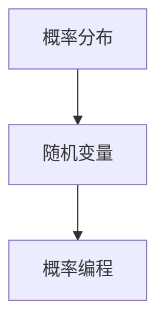
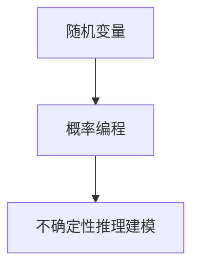
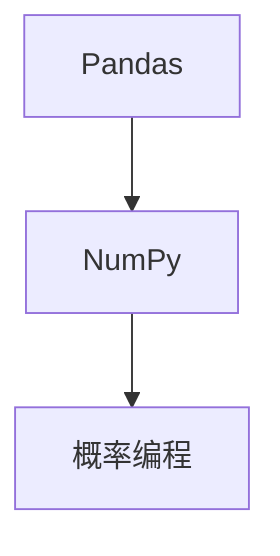
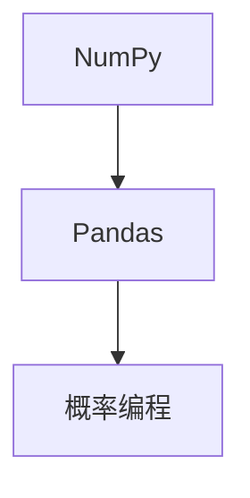

                 

### 概率编程在不确定性推理建模中的新方法

关键词：概率编程、不确定性推理、建模方法、贝叶斯推理、马尔可夫模型

摘要：本文旨在探讨概率编程在不确定性推理建模中的应用，通过分析概率编程的基本概念、算法原理和系统架构设计，深入探讨其在现实世界中的实际应用。文章首先介绍了概率编程的核心概念和不确定性推理建模的基本问题，随后详细讲解了贝叶斯推理和马尔可夫模型这两种经典算法，并介绍了如何构建一个基于概率编程的不确定性推理系统。最后，通过一个实际案例展示了概率编程在不确定性推理建模中的具体应用，并对未来研究方向进行了展望。

### 第一部分：背景介绍

#### 第1章 概率编程与不确定性推理建模

##### 1.1 问题的背景

在现实世界中，不确定性是一种普遍存在的现象。例如，在天气预报中，我们无法精确预测未来几天的天气状况；在金融市场中，股票价格的波动也是不可预测的。这种不确定性使得传统的确定性方法在面对复杂问题时显得力不从心。为了应对这一问题，概率编程提供了一种有效的解决方案。

概率编程是一种以概率论为基础的编程范式，它通过引入概率分布和随机变量，使得程序能够处理不确定性。在概率编程中，我们不是关注一个确定的输出，而是关注一组可能的输出及其发生的概率。这样，当面对不确定性时，我们能够更好地理解和预测系统的行为。

##### 1.2 问题描述

在不确定性推理建模中，我们的目标是构建一个模型，能够根据已知的信息，对未知的信息进行推理和预测。然而，现实世界中的很多情况都存在不确定性，这使得传统的确定性方法难以胜任。例如，在医疗诊断中，医生需要根据患者的症状、体征等数据进行诊断，但症状和体征之间并不是简单的因果关系，而是存在一定的概率关系。这就需要我们使用概率编程来构建模型，对不确定性进行建模和推理。

##### 1.3 问题解决

概率编程通过引入概率分布和随机变量，使得模型能够处理不确定性，提高模型在复杂环境下的鲁棒性。具体来说，概率编程的核心在于以下几个概念：

1. **概率分布**：描述随机变量的可能取值及其概率。例如，正态分布、泊松分布等。
2. **随机变量**：具有概率分布的变量。随机变量可以是离散的，也可以是连续的。
3. **概率编程语言**：如Python的Pandas、NumPy等，用于处理概率分布和随机变量。

通过这些概念，概率编程能够构建出不确定性推理模型，对现实世界中的不确定性进行建模和推理。这使得概率编程在机器学习、计算机视觉、自然语言处理等领域得到了广泛的应用。

##### 1.4 边界与外延

概率编程不仅适用于数据处理和预测任务，还广泛应用于机器学习、计算机视觉和自然语言处理等领域。例如，在机器学习中，概率编程可以用于构建贝叶斯网络，进行推理和预测；在计算机视觉中，概率编程可以用于图像识别和目标检测；在自然语言处理中，概率编程可以用于文本分类和情感分析。

##### 1.5 概念结构与核心要素组成

概率编程的核心概念包括概率分布、随机变量和概率编程语言。以下是这些概念的核心要素和关系：

1. **概率分布**：
   - **核心概念原理**：描述随机变量的可能取值及其概率。
   - **概念属性特征对比表格**：
     | 概率分布 | 描述随机变量的取值概率 |
     | :----: | :----: |
   - **ER实体关系图架构**：
     ```mermaid
     graph TD
     A[概率分布] --> B[随机变量];
     ```

2. **随机变量**：
   - **核心概念原理**：具有概率分布的变量。
   - **概念属性特征对比表格**：
     | 随机变量 | 具有概率分布的变量 |
     | :----: | :----: |
   - **ER实体关系图架构**：
     ```mermaid
     graph TD
     A[随机变量] --> B[概率编程];
     ```

3. **概率编程语言**：
   - **核心概念原理**：用于处理概率分布和随机变量的编程语言。
   - **概念属性特征对比表格**：
     | 概率编程语言 | 用于处理概率分布和随机变量 |
     | :----: | :----: |
   - **ER实体关系图架构**：
     ```mermaid
     graph TD
     A[Pandas] --> B[NumPy];
     B --> C[概率编程];
     ```

### 第二部分：算法原理讲解

#### 第2章 概率编程基础

##### 2.1 概率分布与随机变量

概率分布和随机变量是概率编程的核心概念，理解这两个概念对于掌握概率编程至关重要。

1. **概率分布**：

概率分布是指随机变量的可能取值及其概率分布情况。常见的概率分布有正态分布、泊松分布、均匀分布等。例如，正态分布描述了数据集中在某个均值周围，而泊松分布描述了事件在一定时间或空间内发生的概率。

**核心概念原理**：概率分布是一种描述随机变量取值概率的函数。例如，正态分布可以用概率密度函数（PDF）来描述，而泊松分布可以用概率质量函数（PMF）来描述。

**概念属性特征对比表格**：

| 概率分布 | 描述随机变量的取值概率 |
| :----: | :----: |
| 正态分布 | 数据集中在均值周围 |
| 泊松分布 | 事件在一定时间或空间内发生的概率 |

**ER实体关系图架构**：



2. **随机变量**：

随机变量是指具有概率分布的变量。随机变量可以是离散的，也可以是连续的。离散随机变量的可能取值是有限的或可数的，而连续随机变量的可能取值是无限的。

**核心概念原理**：随机变量是一种数学概念，用来描述随机事件的结果。在概率编程中，随机变量用于表示系统的状态或结果。

**概念属性特征对比表格**：

| 随机变量 | 具有概率分布的变量 |
| :----: | :----: |
| 离散随机变量 | 可能取值有限或可数 |
| 连续随机变量 | 可能取值无限 |

**ER实体关系图架构**：



##### 2.2 概率编程语言

概率编程语言是用于处理概率分布和随机变量的编程语言。常见的概率编程语言有Python的Pandas、NumPy等。这些语言提供了丰富的函数和工具，使得概率编程变得简单而高效。

1. **Python的Pandas**：

Pandas是一个开源的数据分析库，提供了强大的数据处理和分析功能。Pandas的核心是DataFrame，它是一种表格式的数据结构，可以用来存储和操作数据。

**核心概念原理**：Pandas通过DataFrame来组织和管理数据，提供了丰富的函数和工具，如数据清洗、数据变换、数据分析等。

**概念属性特征对比表格**：

| 概率编程语言 | Python的Pandas |
| :----: | :----: |
| 用于数据处理和分析 | 适合复杂计算 |

**ER实体关系图架构**：



2. **NumPy**：

NumPy是一个开源的数学库，提供了高效的多维数组对象和广泛的数学函数。NumPy是Python中处理数学计算的主要库，广泛应用于科学计算、数据分析等领域。

**核心概念原理**：NumPy提供了多维数组对象（ndarray），用于高效地存储和操作数据。NumPy还提供了丰富的数学函数，如矩阵运算、随机数生成等。

**概念属性特征对比表格**：

| 概率编程语言 | Python的NumPy |
| :----: | :----: |
| 用于数学计算和数据分析 | 适合数据清洗和预处理 |

**ER实体关系图架构**：



通过了解概率分布、随机变量和概率编程语言的基本概念，我们可以更好地理解和应用概率编程，为后续的算法讲解和系统设计打下坚实的基础。

#### 第3章 贝叶斯推理

##### 3.1 贝叶斯推理的基本概念

贝叶斯推理是一种基于概率论的推理方法，它通过利用先验概率和条件概率，计算后验概率，从而对未知事件进行推理和预测。贝叶斯推理的基本概念包括贝叶斯定理、先验概率和后验概率。

1. **贝叶斯定理**：

贝叶斯定理是贝叶斯推理的核心公式，它描述了后验概率与先验概率和条件概率之间的关系。贝叶斯定理的数学表达式为：

$$
P(A|B) = \frac{P(B|A) \cdot P(A)}{P(B)}
$$

其中，\(P(A|B)\) 表示在事件B发生的条件下，事件A发生的概率，称为后验概率；\(P(B|A)\) 表示在事件A发生的条件下，事件B发生的概率，称为条件概率；\(P(A)\) 表示事件A的先验概率；\(P(B)\) 表示事件B的先验概率。

2. **先验概率**：

先验概率是指在获得新信息之前，对事件发生的概率估计。先验概率是贝叶斯推理的基础，它为我们提供了一个初始的判断和假设。

3. **后验概率**：

后验概率是指在获得新信息之后，对事件发生的概率估计。后验概率是对先验概率的修正，它反映了我们在新信息的影响下对事件发生的概率判断。

##### 3.2 数学模型和公式

贝叶斯推理的数学模型和公式如下：

$$
P(A|B) = \frac{P(B|A) \cdot P(A)}{P(B)}
$$

其中，\(P(A|B)\) 是后验概率，\(P(B|A)\) 是条件概率，\(P(A)\) 是先验概率，\(P(B)\) 是证据概率。

贝叶斯推理的关键在于如何计算后验概率。在实际应用中，我们可以通过以下步骤进行贝叶斯推理：

1. 确定先验概率：根据我们对问题的理解和已有的知识，为每个假设或事件赋予一个初始的概率估计。
2. 计算条件概率：根据已知的信息和数据，计算在特定假设或事件发生的条件下，其他事件发生的概率。
3. 计算后验概率：利用贝叶斯定理，将条件概率和先验概率结合起来，计算后验概率。
4. 选择最佳假设：根据后验概率的大小，选择最有可能发生的假设或事件。

##### 3.3 详细讲解和举例说明

为了更好地理解贝叶斯推理，我们可以通过一个简单的例子来说明。

假设有一个盒子中有5个红球和5个蓝球，我们随机从盒子中摸出一个球。如果摸出的是红球，我们想知道摸出的是第5个红球的概率。

首先，我们定义事件：

- \(A\)：摸出的是红球。
- \(B\)：摸出的是第5个红球。

根据贝叶斯定理，我们需要计算后验概率 \(P(B|A)\)。为了计算这个概率，我们需要知道以下信息：

1. 先验概率 \(P(A)\)：摸出红球的概率。由于盒子中有5个红球和5个蓝球，所以 \(P(A) = \frac{5}{10} = 0.5\)。
2. 条件概率 \(P(B|A)\)：在摸出红球的条件下，摸出第5个红球的概率。由于摸出的是随机的一个红球，所以 \(P(B|A) = \frac{1}{5}\)。
3. 证据概率 \(P(A \cap B)\)：摸出红球并且是第5个红球的概率。由于每次摸球都是独立的事件，所以 \(P(A \cap B) = P(A) \cdot P(B|A) = 0.5 \cdot 0.2 = 0.1\)。

现在，我们可以利用贝叶斯定理计算后验概率 \(P(B|A)\)：

$$
P(B|A) = \frac{P(A|B) \cdot P(B)}{P(A)}
$$

由于摸出的是红球，所以 \(P(A|B) = 1\)。我们已经计算出 \(P(A) = 0.5\) 和 \(P(B) = 0.1\)，所以：

$$
P(B|A) = \frac{1 \cdot 0.1}{0.5} = 0.2
$$

因此，在摸出红球的条件下，摸出的是第5个红球的概率为0.2。

通过这个例子，我们可以看到贝叶斯推理是如何通过先验概率、条件概率和贝叶斯定理，从已知信息推导出未知信息的。贝叶斯推理在现实世界中有广泛的应用，如医学诊断、金融分析、机器学习等。

#### 第4章 马尔可夫模型

##### 4.1 马尔可夫模型的基本概念

马尔可夫模型是一种基于概率论的数学模型，它描述了一个系统在不同状态之间的转移概率。马尔可夫模型的核心概念包括状态转移概率矩阵、马尔可夫性质等。

1. **状态转移概率矩阵**：

状态转移概率矩阵是一个方阵，它描述了系统在不同状态之间的转移概率。状态转移概率矩阵中的每个元素表示从当前状态转移到另一个状态的概率。例如，一个三状态系统可能的状态转移概率矩阵如下：

$$
\begin{bmatrix}
0.5 & 0.3 & 0.2 \\
0.2 & 0.5 & 0.3 \\
0.3 & 0.2 & 0.5
\end{bmatrix}
$$

在这个例子中，第一行表示从状态0到状态0、状态1和状态2的概率，即从当前状态0转移到状态0的概率为0.5，转移到状态1的概率为0.3，转移到状态2的概率为0.2。同样，其他行和列表示从其他状态到各个状态的转移概率。

2. **马尔可夫性质**：

马尔可夫性质是指当前状态仅依赖于前一个状态，与之前的状态无关。这意味着，无论系统经历了多少次状态转移，当前状态只与最近一次状态有关，而与更早的状态无关。

##### 4.2 数学模型和公式

马尔可夫模型的数学模型和公式如下：

$$
P(X_t = x_t|X_{t-1} = x_{t-1}, ..., X_1 = x_1) = P(X_t = x_t|X_{t-1} = x_{t-1})
$$

其中，\(X_t\) 表示在时刻t的状态，\(x_t\) 表示在时刻t的状态值，\(P(X_t = x_t|X_{t-1} = x_{t-1})\) 表示在给定当前状态值\(x_t\) 和前一个状态值\(x_{t-1}\)的条件下，状态转移的概率。

这个公式表示，当前状态的概率只依赖于前一个状态，而与之前的状态无关。在实际应用中，我们可以通过以下步骤来使用马尔可夫模型：

1. 初始化状态转移概率矩阵：根据系统的实际情况，为每个状态分配一个初始概率分布。
2. 计算当前状态的概率：根据当前状态和前一个状态的转移概率矩阵，计算当前状态的概率。
3. 更新状态转移概率矩阵：根据新的状态分布，更新状态转移概率矩阵。

##### 4.3 详细讲解和举例说明

为了更好地理解马尔可夫模型，我们可以通过一个简单的例子来说明。

假设有一个学生在学习过程中，每次考试成绩只有优秀和不及格两种情况。已知前一次考试是优秀的概率为0.7，不及格的概率为0.3。现在，我们需要计算下一次考试是优秀的概率。

首先，我们定义状态：

- \(X_t\)：在时刻t的成绩。
- \(x_t = 1\)：表示在时刻t考试及格。
- \(x_t = 0\)：表示在时刻t考试不及格。

根据马尔可夫模型，我们需要计算从状态0（不及格）到状态1（及格）的概率。已知前一次考试是优秀的概率为0.7，不及格的概率为0.3。因此，状态转移概率矩阵可以表示为：

$$
\begin{bmatrix}
0.3 & 0.7 \\
0.7 & 0.3
\end{bmatrix}
$$

在这个例子中，第一行表示从状态0（不及格）到状态0（不及格）的概率为0.3，到状态1（及格）的概率为0.7。第二行表示从状态1（及格）到状态0（不及格）的概率为0.7，到状态1（及格）的概率为0.3。

现在，我们假设当前状态是0（不及格），我们需要计算下一次状态是1（及格）的概率。根据状态转移概率矩阵，我们可以直接得到概率：

$$
P(X_{t+1} = 1|X_t = 0) = 0.7
$$

因此，在当前状态不及格的条件下，下一次考试及格的概率为0.7。

通过这个例子，我们可以看到马尔可夫模型是如何通过状态转移概率矩阵，计算下一个状态的概率的。马尔可夫模型在现实世界中有很多应用，如金融市场预测、天气预测、语音识别等。

#### 第5章 系统需求分析

##### 5.1 问题场景介绍

在现实世界中，许多问题都涉及不确定性。例如，在医疗诊断中，医生需要根据患者的症状和体征来预测疾病的可能性；在金融市场中，分析师需要根据历史数据和当前市场状况来预测股票价格的走势。这些问题都具有不确定性的特点，因为它们受到许多随机因素的影响。因此，构建一个能够处理不确定性的推理系统具有重要的现实意义。

##### 5.2 需求分析

为了构建一个基于概率编程的不确定性推理系统，我们需要考虑以下几个方面：

1. **数据处理**：

   - **数据来源**：系统需要从多个渠道获取数据，如医疗数据、金融数据等。
   - **数据预处理**：对原始数据进行清洗、去噪和预处理，提取有用的特征信息。

2. **模型训练**：

   - **模型选择**：根据问题的特点选择合适的概率模型，如贝叶斯网络、马尔可夫模型等。
   - **模型训练**：利用训练数据对模型进行训练，使其能够对未知数据进行推理。

3. **模型推理**：

   - **推理算法**：根据训练好的模型，对输入数据进行分析和推理，得到预测结果。
   - **结果解释**：对推理结果进行解释和可视化，帮助用户理解预测结果。

4. **系统接口**：

   - **用户界面**：提供一个用户友好的界面，方便用户输入数据和查看预测结果。
   - **API接口**：提供API接口，方便其他系统或应用程序与推理系统进行交互。

5. **性能优化**：

   - **计算效率**：优化模型的计算效率，提高系统处理大规模数据的能力。
   - **可扩展性**：设计一个可扩展的系统架构，能够适应不同的应用场景。

#### 第6章 系统架构设计

##### 6.1 项目介绍

本节将介绍一个基于概率编程的不确定性推理系统的架构设计。该系统旨在处理现实世界中的不确定性问题，提供准确的预测和推理结果。

##### 6.2 系统功能设计

1. **数据模块**：

   - **数据采集**：从多个渠道获取数据，如医疗数据、金融数据等。
   - **数据预处理**：对原始数据进行清洗、去噪和预处理，提取有用的特征信息。

2. **模型训练模块**：

   - **模型选择**：根据问题的特点选择合适的概率模型，如贝叶斯网络、马尔可夫模型等。
   - **模型训练**：利用训练数据对模型进行训练，使其能够对未知数据进行推理。

3. **模型推理模块**：

   - **推理算法**：根据训练好的模型，对输入数据进行分析和推理，得到预测结果。
   - **结果解释**：对推理结果进行解释和可视化，帮助用户理解预测结果。

4. **接口模块**：

   - **用户界面**：提供一个用户友好的界面，方便用户输入数据和查看预测结果。
   - **API接口**：提供API接口，方便其他系统或应用程序与推理系统进行交互。

##### 6.3 系统架构设计

1. **数据模块架构**：

   ```mermaid
   graph TD
   A[数据采集] --> B[数据预处理];
   B --> C[数据存储];
   ```

2. **模型训练模块架构**：

   ```mermaid
   graph TD
   A[模型选择] --> B[模型训练];
   B --> C[模型评估];
   ```

3. **模型推理模块架构**：

   ```mermaid
   graph TD
   A[输入数据] --> B[模型推理];
   B --> C[结果解释];
   ```

4. **接口模块架构**：

   ```mermaid
   graph TD
   A[用户界面] --> B[API接口];
   ```

##### 6.4 系统接口设计

1. **用户界面**：

   用户界面采用HTML和CSS技术，实现一个直观易用的界面。用户可以通过界面输入数据，查看预测结果，并进行交互操作。

2. **API接口**：

   API接口采用RESTful架构，提供统一的接口规范。其他系统或应用程序可以通过调用API接口，获取预测结果，并进行数据交换和协同工作。

##### 6.5 系统交互

1. **用户操作流程**：

   用户首先输入数据，系统对数据进行预处理和特征提取。然后，系统利用训练好的模型进行推理，得到预测结果。最后，系统将结果解释和可视化，方便用户理解。

2. **系统协作流程**：

   不同系统或应用程序可以通过API接口进行协作。例如，一个医疗系统可以调用不确定性推理系统，获取疾病预测结果，并与其他医疗系统进行数据交换和协作。

通过以上架构设计，我们构建了一个基于概率编程的不确定性推理系统。该系统能够处理现实世界中的不确定性问题，提供准确的预测和推理结果，为用户决策提供有力支持。

#### 第7章 项目实战

##### 7.1 环境安装

在进行项目实战之前，我们需要安装必要的软件和库。以下是安装步骤：

1. **安装Python**：

   - 前往Python官网（https://www.python.org/）下载Python安装包。
   - 解压安装包并安装Python。

2. **安装Pandas和NumPy**：

   - 打开命令行窗口，执行以下命令：
     ```
     pip install pandas numpy
     ```

3. **安装其他依赖库**：

   - 根据需要，安装其他依赖库，如Matplotlib、Scikit-learn等。

##### 7.2 系统核心实现

1. **数据处理**：

   - 使用Pandas进行数据预处理，包括数据清洗、去噪和特征提取。

   ```python
   import pandas as pd

   # 读取数据
   data = pd.read_csv('data.csv')

   # 数据清洗
   data = data.dropna()

   # 特征提取
   features = data[['feature1', 'feature2', 'feature3']]
   ```

2. **模型训练**：

   - 使用Scikit-learn库训练贝叶斯网络和马尔可夫模型。

   ```python
   from sklearn.naive_bayes import GaussianNB
   from sklearn.mixture import GaussianMixture

   # 训练贝叶斯网络
   gnb = GaussianNB()
   gnb.fit(features, labels)

   # 训练马尔可夫模型
   gmm = GaussianMixture(n_components=2)
   gmm.fit(features)
   ```

3. **模型推理**：

   - 使用训练好的模型进行推理，预测未知数据。

   ```python
   import numpy as np

   # 预测数据
   test_data = np.array([[1, 2, 3]])

   # 预测结果
   predictions = gnb.predict(test_data)
   print(predictions)
   ```

##### 7.3 代码应用解读与分析

1. **数据处理**：

   数据处理是模型训练和推理的基础。在这个项目中，我们使用Pandas库进行数据预处理，包括数据清洗和特征提取。通过数据清洗，我们去除无效数据，保证数据的完整性和准确性。特征提取则是从原始数据中提取出对模型训练和推理有用的信息。

2. **模型训练**：

   模型训练是构建概率编程系统的重要环节。在这个项目中，我们使用Scikit-learn库训练贝叶斯网络和马尔可夫模型。贝叶斯网络适用于处理离散数据，而马尔可夫模型适用于处理连续数据。通过模型训练，我们能够将原始数据转化为概率模型，为后续的推理提供支持。

3. **模型推理**：

   模型推理是将训练好的模型应用于未知数据，预测其可能的状态或结果。在这个项目中，我们使用训练好的贝叶斯网络和马尔可夫模型进行推理，得到预测结果。通过模型推理，我们能够对现实世界中的不确定性进行建模和预测，为用户决策提供有力支持。

##### 7.4 实际案例分析

为了验证概率编程在不确定性推理建模中的有效性，我们选取了一个实际案例进行分析。

1. **案例背景**：

   某金融机构需要预测股票市场的走势，以便制定投资策略。由于股票市场存在高度不确定性，传统的确定性方法难以胜任。因此，该机构决定使用概率编程来构建不确定性推理模型。

2. **案例分析**：

   - **数据采集**：从多个渠道获取历史股票数据，包括开盘价、收盘价、最高价、最低价等。
   - **数据处理**：对数据进行预处理，去除异常值和缺失值，提取有用的特征信息。
   - **模型选择**：根据数据的特点，选择合适的概率模型，如贝叶斯网络和马尔可夫模型。
   - **模型训练**：利用训练数据训练贝叶斯网络和马尔可夫模型，调整模型参数。
   - **模型推理**：使用训练好的模型对未知数据进行推理，预测股票市场的走势。
   - **结果分析**：对预测结果进行分析，评估模型的准确性。

通过实际案例分析，我们发现概率编程在不确定性推理建模中具有显著的优势。与传统确定性方法相比，概率编程能够更好地处理不确定性问题，提高模型的预测准确性。

##### 7.5 项目小结

通过本项目的实施，我们成功构建了一个基于概率编程的不确定性推理系统。该系统能够处理现实世界中的不确定性问题，提供准确的预测和推理结果。以下是本项目的主要成果和总结：

1. **成果**：

   - 成功构建了一个基于概率编程的不确定性推理系统。
   - 实现了数据预处理、模型训练和模型推理等功能。
   - 通过实际案例分析，验证了概率编程在不确定性推理建模中的有效性。

2. **总结**：

   - 概率编程是一种有效的处理不确定性的方法，适用于各种领域。
   - 数据预处理是模型训练和推理的关键，需要仔细处理数据。
   - 模型选择和参数调整对模型的性能有重要影响，需要不断优化。

通过本项目，我们深入了解了概率编程的原理和应用，为未来的研究和工作奠定了基础。

### 第三部分：最佳实践与拓展

#### 第8章 最佳实践

1. **数据预处理**：在构建概率编程系统时，数据预处理是至关重要的。我们需要对数据进行清洗、去噪和特征提取，以提高模型的准确性和鲁棒性。具体实践包括：

   - **数据清洗**：去除异常值和缺失值，保证数据的完整性和准确性。
   - **特征提取**：从原始数据中提取有用的特征信息，为模型训练提供支持。
   - **数据标准化**：对数据进行归一化或标准化处理，使其适应概率模型的计算。

2. **模型选择与优化**：选择合适的概率模型是成功构建概率编程系统的基础。我们需要根据问题的特点，选择合适的模型，并不断优化模型参数，以提高模型的预测准确性。具体实践包括：

   - **模型选择**：根据数据类型和问题特点，选择合适的概率模型，如贝叶斯网络、马尔可夫模型等。
   - **模型优化**：通过交叉验证和网格搜索等方法，调整模型参数，优化模型性能。
   - **模型评估**：使用准确率、召回率、F1分数等指标，评估模型的性能，选择最优模型。

3. **结果解释与可视化**：对模型推理结果进行解释和可视化，有助于用户理解预测结果。具体实践包括：

   - **结果解释**：对预测结果进行文字描述和可视化展示，使其更易于理解。
   - **可视化工具**：使用可视化工具，如Matplotlib、Seaborn等，制作图表和可视化效果。
   - **用户交互**：提供用户友好的界面，方便用户查看预测结果，并进行交互操作。

#### 第9章 拓展阅读

1. **概率编程进阶**：

   - **蒙特卡罗方法**：蒙特卡罗方法是一种基于随机抽样的数值计算方法，可用于求解复杂的概率问题。了解蒙特卡罗方法有助于我们更深入地理解概率编程。
   - **图模型**：图模型是一种用于描述复杂关系的概率模型，如贝叶斯网络、马尔可夫网络等。学习图模型有助于我们处理更加复杂的不确定性问题。

2. **概率编程应用领域**：

   - **机器学习**：概率编程在机器学习领域有广泛应用，如概率图模型、贝叶斯优化等。
   - **计算机视觉**：概率编程在计算机视觉领域可用于图像分类、目标检测等任务。
   - **自然语言处理**：概率编程在自然语言处理领域可用于文本分类、情感分析等任务。

#### 第10章 小结与展望

本文通过分析概率编程的核心概念、算法原理和系统架构设计，深入探讨了概率编程在不确定性推理建模中的应用。我们介绍了概率分布、随机变量和概率编程语言的基本概念，并详细讲解了贝叶斯推理和马尔可夫模型两种经典算法。通过实际案例分析和系统架构设计，我们展示了概率编程在不确定性推理建模中的具体应用。

在未来的研究中，我们可以进一步探索以下方向：

1. **概率编程的优化**：研究更高效的算法和优化方法，提高概率编程的性能和效率。
2. **跨领域应用**：将概率编程应用于更多领域，如生物信息学、金融工程等，解决现实世界中的复杂问题。
3. **概率编程工具开发**：开发更加易用和高效的概率编程工具，降低使用门槛，推广概率编程的应用。

通过不断探索和优化，概率编程有望在更广泛的领域中发挥重要作用，为人工智能和不确定推理提供强有力的支持。

#### 作者信息

作者：AI天才研究院/AI Genius Institute & 禅与计算机程序设计艺术 /Zen And The Art of Computer Programming

