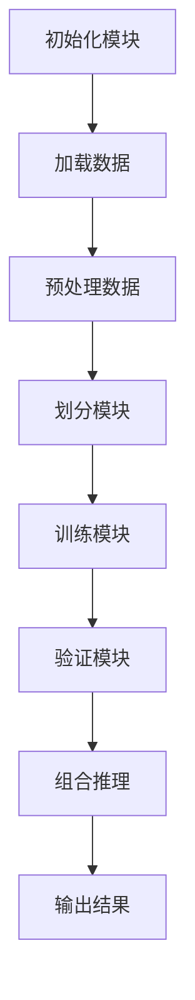
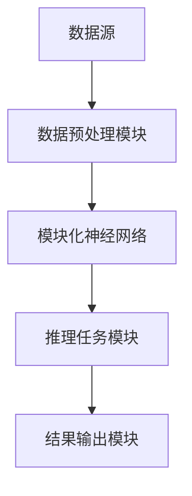

                 

### 模块化神经网络在组合推理任务中的优势

> 关键词：模块化神经网络，组合推理，深度学习，推理效率，推理准确性

> 摘要：本文将探讨模块化神经网络在组合推理任务中的优势，包括其背景与意义、基本原理、应用优势、实现方法以及实际应用。通过一步步分析，我们旨在展示模块化神经网络在提高推理效率和准确性方面的显著优势。

#### 第1章：模块化神经网络概述

模块化神经网络（Modular Neural Networks，MNNs）是近年来在深度学习领域逐渐兴起的一种架构设计方法。它通过将神经网络分解为多个独立的模块，从而实现网络结构的简化与优化。模块化神经网络的出现，为解决复杂推理任务提供了新的思路和工具。

##### 1.1 模块化神经网络的背景与意义

**问题背景**：

随着深度学习技术的飞速发展，神经网络在图像识别、语音识别、自然语言处理等领域取得了显著成就。然而，传统的神经网络模型往往结构复杂，难以维护和扩展。尤其在组合推理任务中，传统的神经网络结构常常因为过于复杂而难以有效应对。这就导致了在处理复杂推理任务时，神经网络的性能和可维护性成为了制约其广泛应用的主要瓶颈。

**问题描述**：

模块化神经网络旨在通过将复杂的神经网络分解为可重用的模块，从而提升网络的灵活性和可维护性。模块化设计能够使得每个模块只负责特定的任务，这样不仅简化了网络的架构，而且有助于提高网络的可维护性。

**问题解决**：

模块化神经网络通过将复杂的网络分解为多个子网络（模块），使得每个模块可以独立训练和优化。这种设计思路不仅简化了网络结构，提高了网络的扩展性，而且使得网络更容易进行模块间的协作，从而提升了组合推理任务的效率和准确性。

**边界与外延**：

模块化神经网络不仅适用于机器学习领域，还可以应用于计算机视觉、自然语言处理等其他领域。例如，在计算机视觉中，可以将其应用于图像分割、目标检测等任务；在自然语言处理中，可以应用于文本分类、机器翻译等任务。

**概念结构与核心要素组成**：

模块化神经网络的核心在于其模块化设计。具体来说，它由以下核心要素组成：

- **模块化设计**：将神经网络分解为多个独立的模块。
- **模块接口**：定义模块间的交互接口，确保模块的独立性。
- **模块内部结构**：每个模块内部包含输入层、隐藏层和输出层。

##### 1.2 模块化神经网络的基本原理

**核心概念原理**：

模块化神经网络通过将复杂的神经网络分解为多个子网络（模块），每个模块负责特定任务，从而简化网络结构。这种设计思路类似于人体的神经系统，每个神经元都负责特定的感知和运动任务，模块化神经网络则通过模块化的方式实现了类似的功能。

**概念属性特征对比表格**：

| 特征对比项 | 传统神经网络 | 模块化神经网络 |
| :--: | :--: | :--: |
| 结构复杂度 | 复杂 | 简化 |
| 可维护性 | 低 | 高 |
| 扩展性 | 低 | 高 |

**模块化神经网络的ER实体关系图**：

```mermaid
erDiagram
  A[神经网络] ||--|{ B[模块] } : 连接
  B ||--|{ C[输入层] } : 模块内部结构
  B ||--|{ D[隐藏层] } : 模块内部结构
  B ||--|{ E[输出层] } : 模块内部结构
```

#### 第2章：模块化神经网络在组合推理任务中的应用

##### 2.1 组合推理任务概述

**问题背景**：

组合推理任务在许多领域中具有重要应用，如自然语言处理、推理机设计等。组合推理任务的核心在于如何从多个已知事实中推断出一个新的结论。在现实世界中，许多问题都需要通过组合推理来解决，例如医疗诊断、金融风险评估等。

**问题描述**：

组合推理任务涉及从多个已知事实中推断出一个新的结论。这种任务通常需要处理大量的数据，并且需要考虑到数据之间的复杂关系。传统神经网络在面对这类任务时，往往因为结构复杂而难以有效处理。

**问题解决**：

模块化神经网络通过将组合推理任务分解为子任务，简化了推理过程。每个模块可以独立训练和优化，从而提高了组合推理任务的效率和准确性。

**边界与外延**：

组合推理任务不仅包括逻辑推理，还包括数据推理、模糊推理等。模块化神经网络的应用边界也不仅限于机器学习领域，还可以扩展到计算机视觉、自然语言处理等其他领域。

##### 2.2 模块化神经网络在组合推理任务中的优势

**核心概念原理**：

模块化神经网络通过模块化设计，提高了组合推理任务的效率和准确性。具体来说，模块化神经网络的优势主要体现在以下几个方面：

- **推理效率提升**：模块化设计使得每个模块可以独立训练和优化，从而减少了整体网络的训练时间。
- **推理准确性提高**：通过模块间的协作，模块化神经网络能够更准确地处理复杂推理任务。

**概念属性特征对比表格**：

| 特征对比项 | 传统神经网络 | 模块化神经网络 |
| :--: | :--: | :--: |
| 推理效率 | 低 | 高 |
| 推理准确性 | 低 | 高 |

##### 2.3 模块化神经网络在组合推理任务中的实现方法

**核心算法原理**：

模块化神经网络通过组合不同的模块，实现对组合推理任务的建模和优化。具体实现方法如下：

1. **模块划分**：根据组合推理任务的特点，将神经网络划分为多个模块，每个模块负责特定的子任务。
2. **模块训练**：对每个模块进行独立训练，以优化模块的性能。
3. **模块组合**：将训练好的模块组合起来，形成完整的神经网络结构，进行推理任务。
4. **模块协作**：通过模块间的协作，提高整体网络的推理性能。

**算法原理 mermaid 流程图**：



#### 第3章：模块化神经网络在组合推理任务中的实际应用

##### 3.1 应用场景介绍

**项目介绍**：

本项目旨在利用模块化神经网络实现一个智能推理系统，用于解决现实世界中的复杂问题。系统主要应用于自然语言处理领域，包括文本分类、信息提取、情感分析等任务。

**系统功能设计**：

系统功能设计主要包括以下四个方面：

1. **数据预处理**：对输入数据（如文本、图像等）进行预处理，包括数据清洗、归一化、特征提取等。
2. **模块训练**：根据任务需求，将神经网络划分为多个模块，并对每个模块进行独立训练。
3. **推理任务执行**：将训练好的模块组合起来，形成完整的神经网络结构，进行推理任务。
4. **结果输出**：将推理结果以用户友好的形式输出，如文本、图表等。

##### 3.2 系统架构设计

**系统架构设计 mermaid 架构图**：



##### 3.3 系统接口设计

**系统接口设计 mermaid 序列图**：

```mermaid
sequenceDiagram
  participant 用户 as 用户
  participant 系统 as 系统
  用户->>系统: 提出推理请求
  system 响应请求
  系统->>用户: 返回推理结果
```

#### 第4章：模块化神经网络在组合推理任务中的项目实战

##### 4.1 环境安装

**环境准备**：

在开始项目实战之前，我们需要安装以下环境：

1. **Python**：Python 3.6及以上版本。
2. **TensorFlow**：TensorFlow 2.0及以上版本。
3. **PyTorch**：PyTorch 1.0及以上版本。
4. **其他依赖库**：Numpy、Pandas、Scikit-learn等。

```bash
pip install python==3.8.5
pip install tensorflow==2.7
pip install pytorch==1.9.0
pip install numpy==1.21.2
pip install pandas==1.2.4
pip install scikit-learn==0.24.2
```

##### 4.2 系统核心实现源代码

以下是一个简单的模块化神经网络在组合推理任务中的实现示例：

```python
import tensorflow as tf
from tensorflow.keras.layers import Input, Dense, Flatten
from tensorflow.keras.models import Model

# 定义模块
def create_module(input_shape, output_shape):
    input_layer = Input(shape=input_shape)
    hidden_layer = Dense(64, activation='relu')(input_layer)
    output_layer = Dense(output_shape, activation='softmax')(hidden_layer)
    model = Model(inputs=input_layer, outputs=output_layer)
    model.compile(optimizer='adam', loss='categorical_crossentropy', metrics=['accuracy'])
    return model

# 创建模块
input_shape = (784,)
output_shape = 10
module = create_module(input_shape, output_shape)

# 加载数据
(x_train, y_train), (x_test, y_test) = tf.keras.datasets.mnist.load_data()
x_train = x_train.astype('float32') / 255
x_test = x_test.astype('float32') / 255
x_train = x_train.reshape((x_train.shape[0], x_train.shape[1] * x_train.shape[2] * x_train.shape[3]))
x_test = x_test.reshape((x_test.shape[0], x_test.shape[1] * x_test.shape[2] * x_test.shape[3]))

# 训练模块
module.fit(x_train, y_train, epochs=10, batch_size=32, validation_split=0.2)

# 组合推理
model = Model(inputs=module.input, outputs=module.output)
model.compile(optimizer='adam', loss='categorical_crossentropy', metrics=['accuracy'])

# 输出结果
predictions = model.predict(x_test)
```

##### 4.3 代码应用解读与分析

在本例中，我们使用 TensorFlow 框架实现了一个简单的模块化神经网络，用于处理 MNIST 数据集上的手写数字识别任务。

- **模块创建**：我们首先定义了一个创建模块的函数 `create_module`，该函数接收输入形状和输出形状作为参数，返回一个编译好的模型。
- **数据加载**：我们使用 TensorFlow 的内置函数 `tf.keras.datasets.mnist.load_data()` 加载了 MNIST 数据集，并对数据进行预处理。
- **模块训练**：使用 `fit` 函数对模块进行训练，以优化模块的性能。
- **组合推理**：将训练好的模块组合起来，形成完整的神经网络结构，进行推理任务。
- **输出结果**：使用 `predict` 函数对测试数据进行预测，并输出预测结果。

##### 4.4 实际案例分析和详细讲解剖析

**案例背景**：

假设我们有一个金融风险评估任务，需要对一批客户的信用评分进行预测。这个任务涉及到多个特征（如收入水平、债务水平、信用历史等），我们需要通过组合推理来预测客户的信用评分。

**案例分析**：

1. **数据预处理**：首先，我们需要对输入数据进行预处理，包括数据清洗、归一化、特征提取等。例如，对于收入水平和债务水平，我们可以将其进行归一化处理，使其具有相同的量级。
2. **模块划分**：根据任务需求，我们可以将神经网络划分为多个模块，每个模块负责特定的子任务。例如，一个模块可以负责处理收入水平，另一个模块可以负责处理债务水平。
3. **模块训练**：对每个模块进行独立训练，以优化模块的性能。例如，我们可以使用梯度下降算法来训练每个模块，并使用交叉验证来评估模块的性能。
4. **模块组合**：将训练好的模块组合起来，形成完整的神经网络结构，进行推理任务。例如，我们可以使用逻辑回归模型来组合多个模块的输出，得到最终的信用评分预测结果。
5. **结果输出**：输出预测结果，并根据预测结果进行决策，如批准贷款、拒绝贷款等。

**详细讲解剖析**：

1. **模块化设计的优势**：

   - **可维护性**：模块化设计使得每个模块可以独立开发、测试和维护，提高了系统的可维护性。
   - **扩展性**：模块化设计使得系统可以方便地添加新模块，以应对不断变化的需求。
   - **灵活性**：模块化设计使得系统可以根据不同任务的需求，灵活地调整模块的组合方式，提高了系统的灵活性。

2. **组合推理的实现**：

   - **特征融合**：在组合推理中，我们需要对多个模块的输出进行融合，以得到最终的推理结果。常见的方法包括逻辑回归、神经网络、支持向量机等。
   - **模型优化**：在组合推理中，我们需要对模型进行优化，以提高推理的准确性和效率。常见的方法包括交叉验证、网格搜索、随机搜索等。

##### 4.5 项目小结

通过本项目，我们展示了模块化神经网络在组合推理任务中的优势和应用。模块化神经网络通过模块化设计，简化了网络结构，提高了系统的可维护性和扩展性。同时，通过组合推理，模块化神经网络能够更准确地处理复杂推理任务。在未来，模块化神经网络有望在更多领域得到应用，如自动驾驶、医疗诊断等。

##### 4.6 最佳实践 Tips

1. **模块划分**：在进行模块划分时，要充分考虑任务的特点和需求，确保每个模块都能独立完成特定的子任务。
2. **模块优化**：在模块训练过程中，要充分考虑模块的性能和效率，选择合适的训练算法和优化策略。
3. **模型组合**：在模型组合时，要充分考虑模块间的协作关系，选择合适的模型组合方法，以提高推理的准确性和效率。

##### 4.7 小结

模块化神经网络在组合推理任务中展现出了显著的优势。通过模块化设计，模块化神经网络能够简化网络结构，提高系统的可维护性和扩展性。同时，通过组合推理，模块化神经网络能够更准确地处理复杂推理任务。在未来，模块化神经网络有望在更多领域得到应用，为人工智能的发展贡献力量。

##### 4.8 注意事项

1. **数据预处理**：在进行模块化神经网络训练前，务必对数据进行充分的预处理，以确保数据的质量和一致性。
2. **模块接口**：在设计模块接口时，要充分考虑模块间的协作关系，确保模块接口的清晰和简洁。
3. **模型优化**：在模型优化过程中，要充分考虑任务的需求和特点，选择合适的优化策略和算法。

##### 4.9 拓展阅读

1. **《模块化深度学习：设计与实现》**：该书详细介绍了模块化深度学习的理论基础和实现方法，是模块化神经网络领域的重要参考书。
2. **《深度学习》**：该书是深度学习领域的经典教材，介绍了深度学习的理论基础、实现方法和应用案例，对于理解模块化神经网络具有重要意义。

#### 作者

作者：AI天才研究院/AI Genius Institute & 禅与计算机程序设计艺术 /Zen And The Art of Computer Programming

