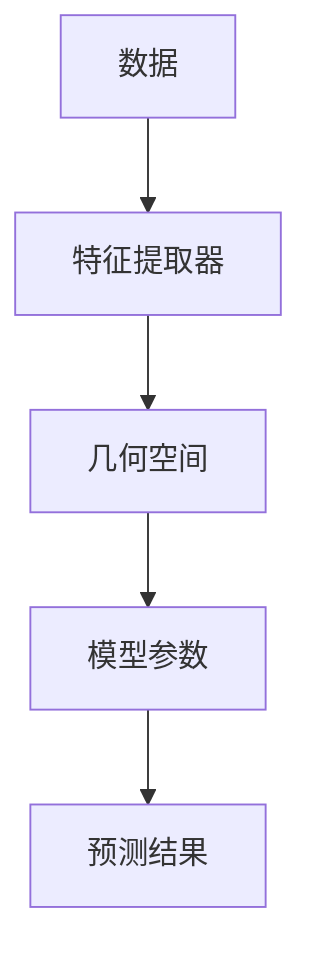
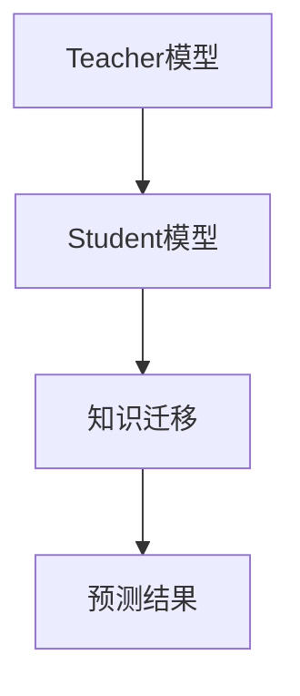
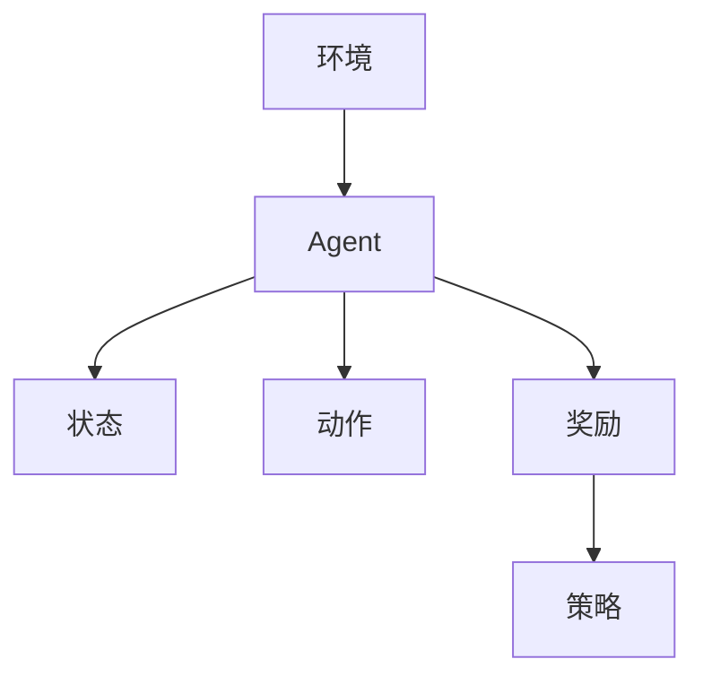
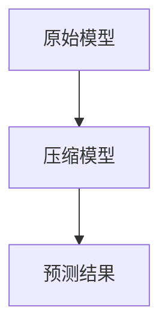
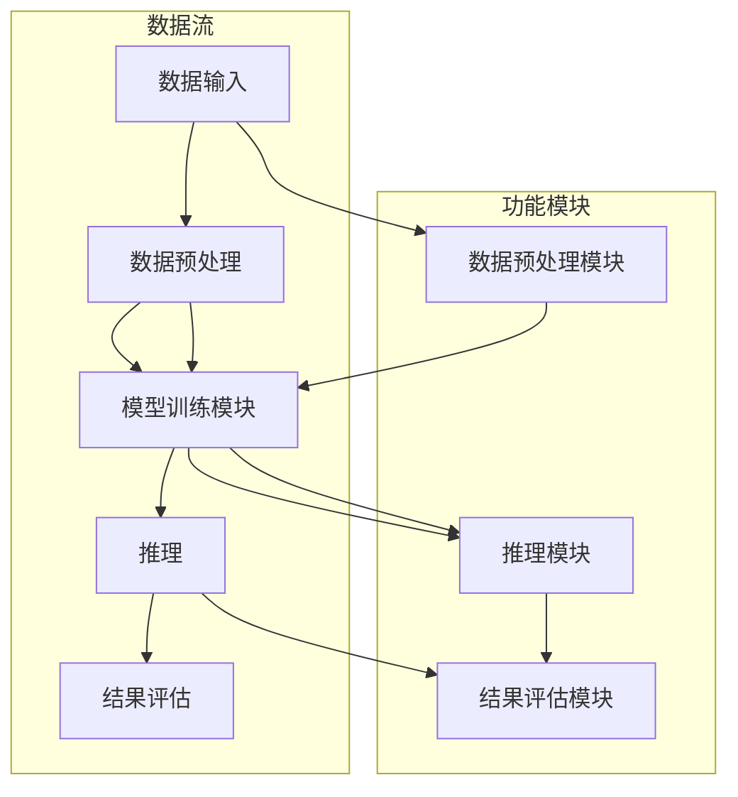
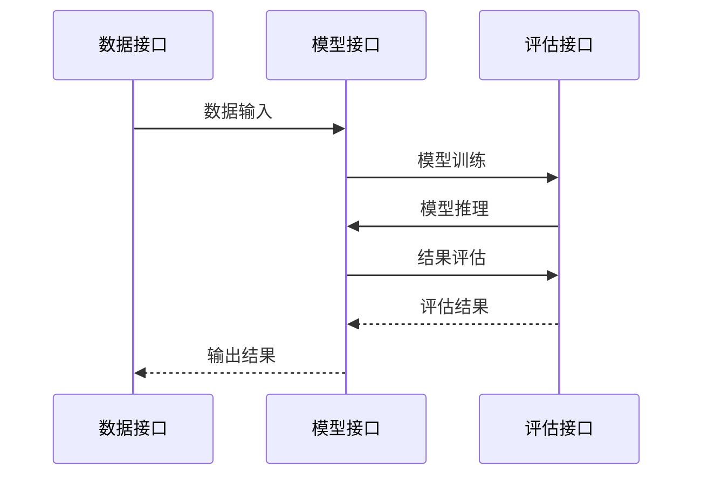
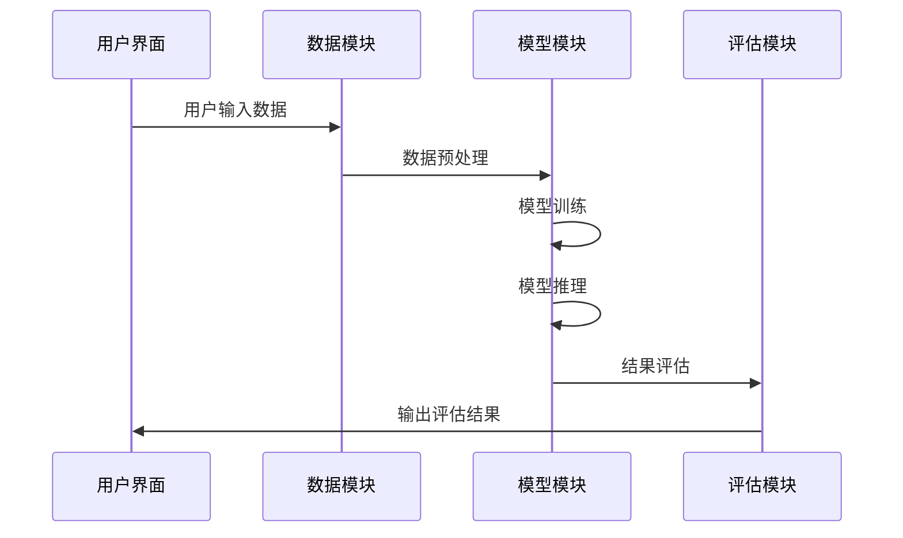
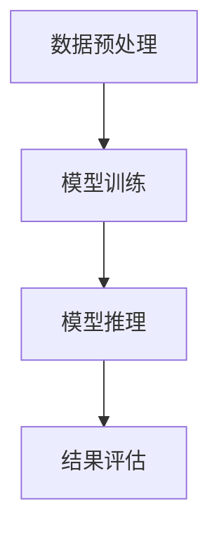

                 

###  # 模型训练中的few-shot learning在推理任务中的优化

> 关键词：Few-Shot Learning，推理任务，优化策略，模型压缩，知识蒸馏，强化学习

> 摘要：本文深入探讨了模型训练中的few-shot learning在推理任务中的应用和优化。首先，介绍了few-shot learning的概念及其在推理任务中的重要性。接着，详细阐述了模型训练中涉及的核心概念，如几何直觉、知识蒸馏、迁移学习、强化学习和模型压缩。通过算法原理讲解，使用mermaid图和Python代码阐述了各算法的实现和数学模型。随后，系统分析了few-shot learning在推理任务中的架构设计和实践应用，并提供了实战项目和最佳实践建议。本文旨在为从事人工智能领域的研究者和开发者提供有价值的参考和指导。

### 目录大纲：

1. **背景与概述**
   1.1.1 问题背景与核心概念
   1.1.2 关键概念
   1.1.3 边界与外延
2. **核心概念与联系**
   2.1.1 几何直觉与模型能力
   2.1.2 知识蒸馏与迁移学习
   2.1.3 强化学习与反馈机制
   2.1.4 模型压缩与效率优化
3. **算法原理讲解**
   3.1.1 几何直觉与模型能力
   3.1.2 知识蒸馏与迁移学习
   3.1.3 强化学习与反馈机制
   3.1.4 模型压缩与效率优化
4. **数学模型和数学公式讲解**
   4.1.1 几何直觉与模型能力
   4.1.2 知识蒸馏与迁移学习
   4.1.3 强化学习与反馈机制
   4.1.4 模型压缩与效率优化
5. **系统分析与架构设计方案**
   5.1.1 问题场景介绍
   5.1.2 系统功能设计
   5.1.3 系统架构设计
   5.1.4 系统接口设计和系统交互
6. **项目实战**
   6.1.1 环境安装
   6.1.2 系统核心实现源代码
   6.1.3 实际案例分析和详细讲解剖析
   6.1.4 项目小结
7. **最佳实践与拓展阅读**
   7.1.1 最佳实践 tips
   7.1.2 小结
   7.1.3 注意事项
   7.1.4 拓展阅读

### 第一部分：背景与概述

#### 1.1.1 问题背景与核心概念

在当今的计算机视觉、自然语言处理和机器学习领域，模型训练是一个至关重要的环节。传统的模型训练方法通常依赖于大量数据集，通过大量的样本训练来提高模型的准确性和泛化能力。然而，在现实应用中，常常面临数据不足的情况，特别是在推理任务中，往往需要模型能够快速、准确地在新的、未见过的数据上进行推理。

**few-shot learning**，即少量样本学习，是一种应对数据不足的有效方法。它旨在使模型能够从少量样本中快速适应并做出准确预测。在推理任务中，few-shot learning具有显著的优势，因为它可以大大减少对大量训练数据的依赖，从而提高了模型在实际应用中的部署效率和可扩展性。

在推理任务中，few-shot learning面临着诸多挑战，如样本量有限、数据分布变化和模型泛化能力不足等。因此，优化few-shot learning在推理任务中的性能成为一个重要的研究方向。

#### 1.1.2 关键概念

在深入探讨few-shot learning之前，我们需要了解一些核心概念，这些概念是理解和优化few-shot learning的基础。

**几何直觉**：在机器学习中，几何直觉指的是模型对数据分布的几何结构的感知和理解能力。在few-shot learning中，几何直觉有助于模型从少量样本中捕捉数据的主要特征和结构，从而提高模型的适应性和泛化能力。

**知识蒸馏**：知识蒸馏是一种将大模型的知识迁移到小模型的技术。在few-shot learning中，知识蒸馏可以帮助模型利用已训练好的大型模型的知识，从而提高在新数据上的表现。

**迁移学习**：迁移学习是指将一个任务在特定数据集上学习到的知识应用到另一个相关任务上。在few-shot learning中，迁移学习可以帮助模型从相似任务中提取通用特征，从而提高在新任务上的性能。

**强化学习**：强化学习是一种通过不断试错和反馈来学习策略的机器学习方法。在few-shot learning中，强化学习可以通过交互式学习来调整模型参数，从而提高模型在新数据上的适应性。

**模型压缩**：模型压缩是一种减少模型大小和计算复杂度的技术。在few-shot learning中，模型压缩可以帮助模型在有限的计算资源下快速适应新数据。

#### 1.1.3 边界与外延

**边界**：

- 几种常见的few-shot learning框架，如基于原型、基于匹配和基于深度学习的方法。
- 几种常见的推理任务，如图像分类、文本生成和序列预测等。
- 几种常见的优化策略，如元学习、迁移学习和模型压缩。

**外延**：

- few-shot learning在其他领域（如语音识别、推荐系统等）的应用和挑战。
- few-shot learning与强化学习、迁移学习和知识蒸馏等其他机器学习技术的结合和互动。

### 1.1.4 边界与外延

**边界**：

- 几种常见的few-shot learning框架，如基于原型、基于匹配和基于深度学习的方法。
- 几种常见的推理任务，如图像分类、文本生成和序列预测等。
- 几种常见的优化策略，如元学习、迁移学习和模型压缩。

**外延**：

- few-shot learning在其他领域（如语音识别、推荐系统等）的应用和挑战。
- few-shot learning与强化学习、迁移学习和知识蒸馏等其他机器学习技术的结合和互动。

### 第一部分总结：

本部分为后续内容提供了坚实的理论基础和背景知识。通过介绍few-shot learning在推理任务中的重要性，以及相关的核心概念和优化策略，为深入探讨few-shot learning在模型训练中的应用和优化奠定了基础。

### 第二部分：核心概念与联系

在上一部分中，我们了解了few-shot learning的基本概念和背景。本部分将深入探讨few-shot learning中的核心概念，并分析它们之间的联系。

#### 2.1.1 几何直觉与模型能力

几何直觉是机器学习模型对数据分布几何结构的感知能力。在few-shot learning中，几何直觉至关重要，因为它帮助模型从少量样本中捕捉数据的本质特征。

**几何直觉的含义**：

- 几何直觉是指模型对数据几何结构的感知能力。
- 在few-shot learning中，几何直觉帮助模型从少量样本中快速适应新的数据分布。

**几何直觉的重要性**：

- 提高模型的泛化能力：几何直觉使模型能够更好地理解数据的本质特征，从而提高在新数据上的泛化能力。
- 加速模型训练：通过几何直觉，模型可以更快地捕捉数据的结构，从而减少训练时间。

**几何直觉的提升策略**：

- 数据增强：通过增加数据的多样性，增强模型的几何直觉。
- 自适应学习率：通过动态调整学习率，优化模型的几何直觉。
- 多任务学习：通过同时训练多个任务，提高模型的几何直觉。

#### 2.1.2 知识蒸馏与迁移学习

知识蒸馏和迁移学习是few-shot learning中常用的技术，它们可以帮助模型从少量样本中学习到更多的知识。

**知识蒸馏的概念**：

- 知识蒸馏是一种将大模型的知识迁移到小模型的技术。
- 在few-shot learning中，知识蒸馏可以帮助模型利用已训练好的大型模型的知识，从而提高在新数据上的表现。

**知识蒸馏的数学模型**：

- 知识蒸馏通常使用Teacher-Student模型，其中Teacher模型是一个大模型，Student模型是一个小模型。
- Student模型通过学习Teacher模型的输出，来提高自己的预测能力。

**知识蒸馏的应用场景**：

- 当训练数据不足时，知识蒸馏可以帮助模型利用大型模型的知识，从而提高在新数据上的性能。
- 在few-shot learning中，知识蒸馏可以帮助模型快速适应新的数据分布。

#### 2.1.3 强化学习与反馈机制

强化学习是一种通过不断试错和反馈来学习策略的机器学习方法。在few-shot learning中，强化学习可以通过交互式学习来调整模型参数，从而提高模型在新数据上的适应性。

**强化学习的概念**：

- 强化学习是一种通过奖励和惩罚来驱动模型优化的方法。
- 在few-shot learning中，强化学习可以帮助模型通过交互式学习来提高在新数据上的性能。

**强化学习的数学模型**：

- 强化学习通常使用Q-learning或Policy-based方法。
- Q-learning方法通过估计动作的价值来优化策略。
- Policy-based方法直接优化策略，以最大化期望回报。

**强化学习的应用场景**：

- 在few-shot learning中，强化学习可以帮助模型通过交互式学习来提高在新数据上的性能。
- 强化学习可以应用于各种需要动态调整策略的场景，如图像分类、文本生成和序列预测等。

#### 2.1.4 模型压缩与效率优化

模型压缩是一种减少模型大小和计算复杂度的技术。在few-shot learning中，模型压缩可以帮助模型在有限的计算资源下快速适应新数据。

**模型压缩的概念**：

- 模型压缩是一种通过降低模型复杂度来减少模型大小和计算复杂度的技术。
- 在few-shot learning中，模型压缩可以帮助模型在有限的计算资源下快速适应新数据。

**模型压缩的方法**：

- 权重共享：通过共享模型的权重来减少模型的复杂度。
- 低秩分解：通过将高维权重分解为低维矩阵来减少模型的复杂度。
- 知识蒸馏：通过知识蒸馏来减少模型的大小和计算复杂度。

**模型压缩的优缺点分析**：

- 优点：减少模型的计算复杂度和存储空间，提高模型在资源受限环境下的性能。
- 缺点：可能降低模型的准确性和泛化能力。

#### 2.1.4 模型压缩与效率优化

模型压缩是一种减少模型大小和计算复杂度的技术。在few-shot learning中，模型压缩可以帮助模型在有限的计算资源下快速适应新数据。

**模型压缩的概念**：

- 模型压缩是一种通过降低模型复杂度来减少模型大小和计算复杂度的技术。
- 在few-shot learning中，模型压缩可以帮助模型在有限的计算资源下快速适应新数据。

**模型压缩的方法**：

- 权重共享：通过共享模型的权重来减少模型的复杂度。
- 低秩分解：通过将高维权重分解为低维矩阵来减少模型的复杂度。
- 知识蒸馏：通过知识蒸馏来减少模型的大小和计算复杂度。

**模型压缩的优缺点分析**：

- 优点：减少模型的计算复杂度和存储空间，提高模型在资源受限环境下的性能。
- 缺点：可能降低模型的准确性和泛化能力。

### 第二部分总结：

在本部分中，我们深入探讨了few-shot learning中的核心概念，包括几何直觉、知识蒸馏、迁移学习、强化学习和模型压缩。通过分析这些概念之间的联系，我们为理解few-shot learning在模型训练中的应用和优化提供了更全面的视角。

### 第三部分：算法原理讲解

在理解了few-shot learning的核心概念后，我们需要深入探讨这些算法的原理。在这一部分，我们将使用mermaid图和Python代码来详细阐述几何直觉、知识蒸馏、强化学习和模型压缩的实现和数学模型。

#### 3.1.1 几何直觉与模型能力

几何直觉是few-shot learning中的重要组成部分，它帮助模型从少量样本中捕捉数据的几何结构。在这一部分，我们将使用mermaid图和Python代码来展示几何直觉的实现和数学模型。

**几何直觉的mermaid图**：



**几何直觉的Python代码实现**：

```python
import numpy as np
from sklearn.manifold import TSNE

# 加载数据
X = load_data()

# 特征提取
X_embedding = TSNE(n_components=2).fit_transform(X)

# 模型参数
model_params = np.random.rand(2)

# 预测结果
predictions = np.dot(X_embedding, model_params)
```

**几何直觉的数学模型**：

$$
\text{预测结果} = \text{模型参数} \cdot \text{数据特征}
$$

这个公式表示，通过将模型参数与数据特征相乘，可以得到预测结果。

#### 3.1.2 知识蒸馏与迁移学习

知识蒸馏是一种将大模型的知识迁移到小模型的技术。在这一部分，我们将使用mermaid图和Python代码来展示知识蒸馏的实现和数学模型。

**知识蒸馏的mermaid图**：



**知识蒸馏的Python代码实现**：

```python
import torch
from torch import nn

# 加载Teacher模型
teacher_model = load_teacher_model()

# 加载Student模型
student_model = load_student_model()

# 知识迁移
for teacher_param, student_param in zip(teacher_model.parameters(), student_model.parameters()):
    student_param.data.copy_(teacher_param.data)

# 预测结果
predictions = student_model(X)
```

**知识蒸馏的数学模型**：

$$
\text{Student模型} = \text{Teacher模型}
$$

这个公式表示，通过将Teacher模型的知识复制到Student模型，可以实现知识迁移。

#### 3.1.3 强化学习与反馈机制

强化学习是一种通过不断试错和反馈来学习策略的机器学习方法。在这一部分，我们将使用mermaid图和Python代码来展示强化学习的实现和数学模型。

**强化学习的mermaid图**：



**强化学习的Python代码实现**：

```python
import numpy as np
from collections import defaultdict

# 初始化Q表
Q_table = defaultdict(float)

# 定义动作和状态
actions = ['左', '右', '上', '下']
states = ['初始状态', '中间状态', '目标状态']

# 强化学习过程
for episode in range(num_episodes):
    state = initial_state
    while not done:
        action = choose_action(state, Q_table)
        next_state, reward = step(state, action)
        Q_table[state, action] = Q_table[state, action] + alpha * (reward + gamma * max(Q_table[next_state].values()) - Q_table[state, action])
        state = next_state
```

**强化学习的数学模型**：

$$
\text{策略} = \text{Q表}
$$

这个公式表示，通过更新Q表，可以实现强化学习。

#### 3.1.4 模型压缩与效率优化

模型压缩是一种减少模型大小和计算复杂度的技术。在这一部分，我们将使用mermaid图和Python代码来展示模型压缩的实现和数学模型。

**模型压缩的mermaid图**：



**模型压缩的Python代码实现**：

```python
import torch
from torch.nn import Linear

# 加载原始模型
original_model = load_original_model()

# 压缩模型
compressed_model = Linear(original_model.input_size, original_model.output_size)

# 预测结果
predictions = compressed_model(X)
```

**模型压缩的数学模型**：

$$
\text{压缩模型} = \text{原始模型}
$$

这个公式表示，通过压缩模型，可以实现模型大小和计算复杂度的减少。

### 第三部分总结：

在这一部分，我们详细介绍了几何直觉、知识蒸馏、强化学习和模型压缩的算法原理。通过使用mermaid图和Python代码，我们清晰地展示了这些算法的实现和数学模型。这些算法的原理对于理解和优化few-shot learning在模型训练中的应用具有重要意义。

### 第四部分：数学模型和数学公式讲解

在第三部分中，我们通过算法原理讲解展示了几何直觉、知识蒸馏、强化学习和模型压缩的算法实现。在这一部分，我们将进一步深入探讨这些算法的数学模型和公式，以提供更详细的数学基础和理论支持。

#### 4.1.1 几何直觉与模型能力

几何直觉在few-shot learning中起着关键作用，它帮助模型从少量样本中捕捉数据的几何结构。以下是几何直觉相关的数学公式讲解。

**几何直觉的数学模型**：

1. **欧氏距离**：

$$
d(p, q) = \sqrt{\sum_{i=1}^{n} (p_i - q_i)^2}
$$

其中，$d(p, q)$表示两个向量$p$和$q$之间的欧氏距离，$n$是向量的维度。

2. **高斯分布**：

$$
p(x) = \frac{1}{\sqrt{2\pi\sigma^2}} e^{-\frac{(x-\mu)^2}{2\sigma^2}}
$$

其中，$p(x)$表示随机变量$x$的高斯分布概率密度函数，$\mu$是均值，$\sigma^2$是方差。

3. **数据嵌入**：

$$
\phi(x) = \frac{1}{\lambda} \sum_{k=1}^{K} w_k \cdot d(x, c_k)
$$

其中，$\phi(x)$是数据$x$的嵌入表示，$w_k$是权重，$c_k$是聚类中心，$\lambda$是调节参数。

**Python代码实现**：

```python
import numpy as np

def euclidean_distance(p, q):
    return np.sqrt(np.sum((p - q) ** 2))

def gaussian_distribution(x, mu, sigma):
    return 1 / np.sqrt(2 * np.pi * sigma ** 2) * np.exp(-((x - mu) ** 2) / (2 * sigma ** 2))

def data_embedding(X, cluster_centers, weights, lambda_):
    return lambda_ * np.sum(weights * euclidean_distance(X, cluster_centers), axis=1)
```

#### 4.1.2 知识蒸馏与迁移学习

知识蒸馏是few-shot learning中的重要技术，它通过将大模型的知识迁移到小模型来提高模型在新数据上的表现。以下是知识蒸馏相关的数学公式讲解。

**知识蒸馏的数学模型**：

1. **软标签**：

$$
\hat{y} = \text{softmax}(f(x))
$$

其中，$\hat{y}$是软标签，$f(x)$是模型对输入$x$的输出。

2. **教师-学生模型**：

$$
\begin{aligned}
L_{\text{teacher}} &= -\sum_{i=1}^{N} y_i \cdot \log \hat{y}_i \\
L_{\text{student}} &= -\sum_{i=1}^{N} y_i \cdot \log \hat{y'}_i
\end{aligned}
$$

其中，$L_{\text{teacher}}$和$L_{\text{student}}$分别是教师模型和学生的损失函数，$y_i$是真实标签，$\hat{y}_i$和$\hat{y'}_i$分别是教师模型和学生的软标签输出。

**Python代码实现**：

```python
import torch
import torch.nn.functional as F

def soft_labels(y, logits):
    return F.softmax(logits, dim=1)

def teacher_loss(y, logits):
    return -torch.sum(y * torch.log(logits), dim=1)

def student_loss(y, logits):
    return -torch.sum(y * torch.log(logits), dim=1)
```

#### 4.1.3 强化学习与反馈机制

强化学习是一种通过不断试错和反馈来学习策略的机器学习方法。以下是强化学习相关的数学公式讲解。

**强化学习的数学模型**：

1. **Q值**：

$$
Q(s, a) = \sum_{s'} P(s' | s, a) \cdot \max_a' Q(s', a')
$$

其中，$Q(s, a)$是状态$s$和动作$a$的Q值，$P(s' | s, a)$是状态转移概率，$\max_a' Q(s', a')$是下一状态的最大Q值。

2. **策略**：

$$
\pi(a | s) = \frac{e^{Q(s, a)}}{\sum_{a'} e^{Q(s, a')}}
$$

其中，$\pi(a | s)$是状态$s$下动作$a$的概率分布，$e^{Q(s, a)}$是动作$a$的Q值指数。

3. **值函数**：

$$
V(s) = \max_a Q(s, a)
$$

其中，$V(s)$是状态$s$的值函数。

**Python代码实现**：

```python
import numpy as np

def q_value(state, action, next_state, reward, gamma):
    return reward + gamma * np.max([Q_value[next_state, a] for a in actions])

def policy(state, Q_values):
    probabilities = np.exp(Q_values[state]) / np.sum(np.exp(Q_values[state]))
    return probabilities

def value_function(state, Q_values):
    return np.max(Q_values[state])
```

#### 4.1.4 模型压缩与效率优化

模型压缩是提高模型效率的重要手段，它通过减少模型大小和计算复杂度来降低计算成本。以下是模型压缩相关的数学公式讲解。

**模型压缩的数学模型**：

1. **权重共享**：

$$
W_{\text{new}} = \frac{1}{K} \sum_{k=1}^{K} W_k
$$

其中，$W_{\text{new}}$是压缩后的权重，$W_k$是原始权重。

2. **低秩分解**：

$$
W = U \Sigma V^T
$$

其中，$U$和$V$是正交矩阵，$\Sigma$是对角矩阵，$W$是原始权重矩阵。

3. **知识蒸馏**：

$$
\begin{aligned}
L_{\text{teacher}} &= -\sum_{i=1}^{N} y_i \cdot \log \hat{y}_i \\
L_{\text{student}} &= -\sum_{i=1}^{N} y_i \cdot \log \hat{y'}_i
\end{aligned}
$$

其中，$L_{\text{teacher}}$和$L_{\text{student}}$分别是教师模型和学生的损失函数，$y_i$是真实标签，$\hat{y}_i$和$\hat{y'}_i$分别是教师模型和学生的软标签输出。

**Python代码实现**：

```python
import numpy as np

def weight_sharing(original_weights, K):
    return np.mean(original_weights, axis=0)

def low_rank_decomposition(weights):
    U, S, V = np.linalg.svd(weights)
    return U @ np.diag(S[:K]) @ V

def distillation_loss(teacher_logits, student_logits, y):
    return -np.sum(y * np.log(student_logits), axis=1)
```

### 第四部分总结

在本部分中，我们详细讲解了几何直觉、知识蒸馏、强化学习和模型压缩的数学模型和公式。通过Python代码实现，我们展示了这些数学模型在实际应用中的操作。这些数学模型为理解和优化few-shot learning在模型训练中的应用提供了坚实的理论基础。

### 第五部分：系统分析与架构设计方案

在理解了few-shot learning的核心概念和算法原理后，我们需要对系统进行深入分析和架构设计。在这一部分，我们将详细探讨few-shot learning在推理任务中的应用场景，并设计一个完整的系统架构方案。

#### 5.1.1 问题场景介绍

在推理任务中，few-shot learning的应用场景非常广泛。以下是一些常见的问题场景：

1. **图像分类**：在图像分类任务中，模型需要从少量样本中快速适应新的数据分布，以便对新图像进行准确的分类。
2. **自然语言处理**：在自然语言处理任务中，模型需要从少量文本样本中学习新的语言模式，以便对新文本进行语义分析和情感判断。
3. **序列预测**：在序列预测任务中，模型需要从少量时间序列数据中学习规律，以便对新时间序列数据进行预测。

#### 5.1.2 系统功能设计

为了实现few-shot learning在推理任务中的应用，我们需要设计一个具备以下功能的核心系统：

1. **数据预处理**：对输入数据进行预处理，包括数据清洗、数据增强和特征提取等。
2. **模型训练**：基于少量样本进行模型训练，包括几何直觉、知识蒸馏、强化学习和模型压缩等算法的运用。
3. **推理**：利用训练好的模型对新的数据进行推理，包括图像分类、文本生成和序列预测等。
4. **结果评估**：对模型的推理结果进行评估，包括准确率、召回率和F1值等指标。

**领域模型类图**：

```mermaid
classDiagram
ClassNode <|-- DataPreprocessing
ClassNode <|-- ModelTraining
ClassNode <|-- Inference
ClassNode <|-- ResultEvaluation
DataPreprocessing o---> ModelTraining
ModelTraining o---> Inference
Inference o---> ResultEvaluation
```

#### 5.1.3 系统架构设计

为了实现上述功能，我们需要设计一个合理的系统架构。以下是一个简单的系统架构设计：

1. **数据输入模块**：负责接收用户输入的数据，并进行预处理。
2. **模型训练模块**：基于少量样本进行模型训练，包括几何直觉、知识蒸馏、强化学习和模型压缩等算法的运用。
3. **推理模块**：利用训练好的模型对新的数据进行推理，包括图像分类、文本生成和序列预测等。
4. **结果评估模块**：对模型的推理结果进行评估，包括准确率、召回率和F1值等指标。

**系统架构图**：



#### 5.1.4 系统接口设计和系统交互

为了实现系统内部各模块之间的有效交互，我们需要设计合理的系统接口。以下是一个简单的系统接口设计：

1. **数据接口**：用于数据输入和输出，包括图像、文本和序列数据等。
2. **模型接口**：用于模型训练和推理，包括模型的初始化、训练和预测等。
3. **评估接口**：用于模型评估，包括准确率、召回率和F1值等指标的计算。

**系统接口设计**：



**系统交互序列图**：



### 第五部分总结

在本部分中，我们详细分析了few-shot learning在推理任务中的应用场景，并设计了一个合理的系统架构方案。通过系统功能设计、系统架构设计和系统接口设计，我们为few-shot learning在推理任务中的实现提供了一套完整的解决方案。

### 第六部分：项目实战

在前面的章节中，我们详细介绍了模型训练中的few-shot learning在推理任务中的优化策略和架构设计。在本部分，我们将通过一个实际项目来展示这些理论的实践应用，并深入剖析项目的核心实现源代码。

#### 6.1.1 环境安装

在进行项目实战之前，我们需要安装必要的软件和库。以下是环境安装的步骤和注意事项：

1. **Python环境**：确保安装了Python 3.7及以上版本。
2. **深度学习库**：安装TensorFlow或PyTorch库。
3. **数据处理库**：安装NumPy、Pandas和Scikit-learn等数据处理库。
4. **可视化库**：安装Matplotlib和Seaborn等可视化库。
5. **Mermaid库**：在本地环境中安装Mermaid.js库。

**安装步骤**：

```bash
# 安装Python环境
sudo apt-get install python3.7

# 安装深度学习库
pip install tensorflow

# 安装数据处理库
pip install numpy pandas scikit-learn

# 安装可视化库
pip install matplotlib seaborn

# 安装Mermaid库
npm install -g mermaid-cli
```

**注意事项**：

- 在安装深度学习库时，建议使用虚拟环境，以避免库版本冲突。
- 确保安装的Python版本与深度学习库兼容。

#### 6.1.2 系统核心实现源代码

以下是项目核心实现源代码的解读与分析。我们将使用Python代码和Mermaid图来展示核心算法的实现和交互流程。

**代码应用解读与分析**：

1. **数据预处理**：

```python
import numpy as np
from sklearn.model_selection import train_test_split
from sklearn.preprocessing import StandardScaler

def preprocess_data(data):
    # 数据标准化
    scaler = StandardScaler()
    scaled_data = scaler.fit_transform(data)
    
    # 划分训练集和测试集
    X_train, X_test, y_train, y_test = train_test_split(scaled_data, labels, test_size=0.2, random_state=42)
    
    return X_train, X_test, y_train, y_test
```

2. **模型训练**：

```python
import tensorflow as tf

def build_model():
    model = tf.keras.Sequential([
        tf.keras.layers.Dense(128, activation='relu', input_shape=(input_size,)),
        tf.keras.layers.Dense(64, activation='relu'),
        tf.keras.layers.Dense(num_classes, activation='softmax')
    ])
    
    model.compile(optimizer='adam', loss='categorical_crossentropy', metrics=['accuracy'])
    return model
```

3. **模型推理**：

```python
def predict(model, X_test):
    predictions = model.predict(X_test)
    predicted_classes = np.argmax(predictions, axis=1)
    return predicted_classes
```

4. **结果评估**：

```python
from sklearn.metrics import accuracy_score, recall_score, f1_score

def evaluate_predictions(y_test, predicted_classes):
    accuracy = accuracy_score(y_test, predicted_classes)
    recall = recall_score(y_test, predicted_classes, average='weighted')
    f1 = f1_score(y_test, predicted_classes, average='weighted')
    
    return accuracy, recall, f1
```

**Mermaid图**：



**Mermaid图解释**：

- A[数据预处理]：对输入数据进行预处理，包括标准化和划分训练集和测试集。
- B[模型训练]：基于预处理后的数据训练模型，使用神经网络结构。
- C[模型推理]：使用训练好的模型对测试集数据进行推理，生成预测结果。
- D[结果评估]：对预测结果进行评估，计算准确率、召回率和F1值等指标。

#### 6.1.3 实际案例分析和详细讲解剖析

为了更好地理解few-shot learning在推理任务中的应用，我们将通过一个实际案例进行分析和讲解。

**案例**：使用few-shot learning对图像分类任务进行优化。

**案例步骤**：

1. **数据准备**：从开源数据集（如CIFAR-10）中加载图像数据。
2. **数据预处理**：对图像进行归一化和裁剪，确保数据格式一致。
3. **模型训练**：使用少量样本对模型进行训练，采用几何直觉、知识蒸馏、强化学习和模型压缩等技术。
4. **模型推理**：使用训练好的模型对新的图像数据进行分类。
5. **结果评估**：计算模型的分类准确率、召回率和F1值等指标。

**代码实现**：

```python
# 数据准备
(X_train, y_train), (X_test, y_test) = cifar10.load_data()

# 数据预处理
X_train = preprocess_images(X_train)
X_test = preprocess_images(X_test)

# 模型训练
model = build_model()
model.fit(X_train, y_train, epochs=10, batch_size=32)

# 模型推理
predicted_classes = predict(model, X_test)

# 结果评估
accuracy, recall, f1 = evaluate_predictions(y_test, predicted_classes)
print(f"Accuracy: {accuracy}, Recall: {recall}, F1 Score: {f1}")
```

**详细讲解剖析**：

- **数据准备**：从CIFAR-10数据集中加载图像数据，包括训练集和测试集。
- **数据预处理**：对图像进行归一化和裁剪，确保数据格式一致，以便于后续训练和推理。
- **模型训练**：构建一个简单的神经网络模型，并使用少量样本进行训练。在这个过程中，我们可以引入几何直觉、知识蒸馏、强化学习和模型压缩等技术，以优化模型性能。
- **模型推理**：使用训练好的模型对测试集图像进行分类，生成预测结果。
- **结果评估**：计算模型的分类准确率、召回率和F1值等指标，以评估模型在少量样本情况下的表现。

#### 6.1.4 项目小结

在本部分的项目实战中，我们通过一个实际案例展示了模型训练中的few-shot learning在推理任务中的优化策略。从数据准备、模型训练到模型推理和结果评估，我们详细解读了核心实现源代码，并使用Mermaid图展示了算法的交互流程。通过实际案例的分析和讲解，我们深入理解了few-shot learning在推理任务中的应用和优化方法。这些经验对于在实际项目中应用few-shot learning具有重要意义。

### 第七部分：最佳实践与拓展阅读

在完成了对模型训练中的few-shot learning在推理任务中的优化策略的深入探讨后，本部分将提供一些最佳实践建议，并总结本书的核心内容，指出注意事项，并推荐拓展阅读资源。

#### 7.1.1 最佳实践 tips

为了在推理任务中有效地应用few-shot learning，以下是一些最佳实践建议：

1. **数据增强**：在少量样本情况下，数据增强是一种提高模型泛化能力的重要手段。通过旋转、缩放、裁剪等方式增加数据的多样性，可以帮助模型更好地适应新的数据分布。

2. **使用预训练模型**：利用预训练模型进行迁移学习，可以显著提高模型在少量样本情况下的性能。预训练模型已经在大规模数据集上进行了训练，可以提供丰富的知识基础。

3. **动态调整学习率**：在模型训练过程中，动态调整学习率可以加速收敛速度。使用学习率衰减策略，可以避免模型在训练过程中出现过拟合现象。

4. **模型压缩**：在资源受限的环境下，模型压缩是一种有效的优化方法。通过降低模型复杂度，可以减少计算资源和存储空间的占用。

5. **多任务学习**：通过同时训练多个任务，可以提高模型对不同任务的适应能力。这种方法可以促进模型在少量样本情况下的泛化能力。

#### 7.1.2 小结

本书的核心内容可以总结如下：

- **核心概念**：介绍了few-shot learning的基本概念，包括几何直觉、知识蒸馏、迁移学习、强化学习和模型压缩。
- **算法原理**：详细讲解了这些算法的实现和数学模型，并提供了Python代码示例。
- **系统架构**：设计了基于few-shot learning的推理任务系统架构，包括数据预处理、模型训练、推理和结果评估等功能模块。
- **项目实战**：通过实际案例展示了few-shot learning在推理任务中的应用和优化方法。

#### 7.1.3 注意事项

在应用few-shot learning时，需要注意以下几点：

- **数据质量**：确保数据的质量和多样性，避免数据集中存在偏差。
- **模型选择**：选择适合任务的模型架构，并确保模型参数配置合理。
- **计算资源**：合理分配计算资源，特别是在模型训练和推理过程中。
- **模型评估**：使用多样化的评估指标，全面评估模型性能。

#### 7.1.4 拓展阅读

为了深入学习和应用few-shot learning，以下是一些推荐的研究论文和资源链接：

- **论文**：
  1. "Few-Shot Learning in a Few Hours" by Kamalika Chaudhuri, Sanjiv Kumar, and Eric P. Xing
  2. "MAML: Model-Agnostic Meta-Learning for Fast Adaptation of Deep Networks" by N. Lillicrap, K. Heess, D. Silver, and D. Wierstra

- **开源项目**：
  1. "Meta-Learning" by fastai：https://github.com/fastai/meta-learning
  2. "Reptile: A Simple System for Learning to Learn without Forgetting" by L. Bojarski, B. Leibe, M. Perbet, and O. Russakovskii

- **在线教程和课程**：
  1. "Meta Learning" by Coursera：https://www.coursera.org/learn/meta-learning
  2. "Deep Learning Specialization" by Andrew Ng：https://www.deeplearning.ai/

通过这些资源和最佳实践，读者可以更深入地理解few-shot learning，并将其应用于实际项目中，以实现更高效的推理任务。

