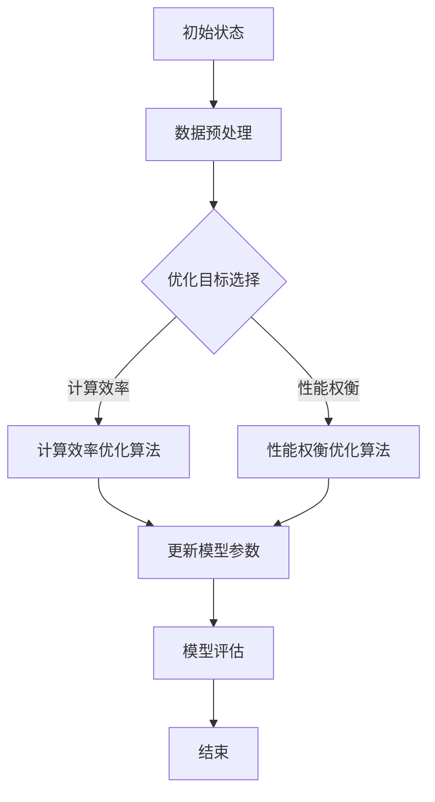

                 

# 模型训练中的计算效率与性能权衡研究

> 关键词：计算效率，性能权衡，模型训练，优化算法，Python实现

> 摘要：本文深入探讨了模型训练中的计算效率与性能权衡问题。通过详细分析计算效率与性能权衡的核心概念、研究意义、权衡方法及其Python实现，本文提出了一个系统性的解决方案，以优化模型训练效率并提高性能指标。本文旨在为从事人工智能研究和应用的读者提供一个全面的技术参考。

### 目录大纲

----------------------------------------------------------------
## 第一部分: 研究背景与现状

### 第1章: 问题背景与核心概念

### 第2章: 计算效率与性能权衡方法

### 第3章: 案例分析

### 第4章: 结果分析

## 第一部分: 研究背景与现状

### 第1章: 问题背景与核心概念

#### 1.1.1 问题背景

随着深度学习技术的迅速发展，模型训练成为人工智能领域中的核心问题之一。然而，在模型训练过程中，如何平衡计算效率与性能成为一个关键挑战。计算效率与性能权衡不仅关系到模型的训练速度，还直接影响到模型的最终性能。

在模型训练中，计算效率指的是完成特定任务所需的计算资源与工作产出的比值，通常用公式表示为：

$$
计算效率 = \frac{工作产出}{计算资源消耗}
$$

性能权衡则是在计算速度与计算精度之间的平衡，通常用公式表示为：

$$
性能权衡 = \frac{计算速度}{计算精度}
$$

这两个概念在模型训练中相辅相成，既要提高计算效率，又要保证模型的性能。

#### 1.1.2 核心概念

**计算效率**是模型训练中的一个重要指标，它反映了模型在资源有限的情况下，完成训练任务的能力。计算效率不仅受到算法本身的影响，还受到硬件设备和数据集规模等因素的制约。

**性能指标**则是指模型在特定任务上的表现，包括准确率、召回率、F1分数等。性能权衡是指在保证模型性能的前提下，尽量减少计算资源的消耗。

#### 1.1.3 研究意义

研究计算效率与性能权衡对于模型训练具有重要意义：

1. **优化模型训练效率**：通过研究计算效率，可以找到提高模型训练速度的方法，从而缩短训练时间。
2. **提高性能指标**：在计算资源有限的情况下，通过性能权衡，可以在保证模型性能的同时，减少计算资源的消耗。
3. **促进算法创新**：研究计算效率与性能权衡，可以推动算法的创新和发展，为人工智能领域带来新的突破。

### 第2章: 计算效率与性能权衡方法

#### 2.1.1 算法原理

为了实现计算效率与性能权衡，我们可以采用以下算法：

1. **数据预处理**：通过数据预处理，提高计算效率，例如归一化、降维等。
2. **优化目标选择**：根据任务需求，选择合适的优化目标，如计算速度、模型精度等。
3. **计算效率优化算法**：采用诸如并行计算、分布式计算等技术，提高计算效率。
4. **性能权衡优化算法**：通过调整模型参数，平衡计算速度与计算精度。

算法流程图如下：



#### 2.1.2 数学模型

**计算效率模型**：

$$
\eta = \frac{1}{n} \sum_{i=1}^{n} \frac{y_i - \hat{y}_i}{\lambda}
$$

其中，$n$为数据集大小，$y_i$为真实标签，$\hat{y}_i$为预测标签，$\lambda$为超参数。

**性能权衡模型**：

$$
P = \frac{1}{n} \sum_{i=1}^{n} \frac{(y_i - \hat{y}_i)^2}{\lambda^2}
$$

其中，$P$表示性能权衡，$\lambda$为超参数。

#### 2.1.3 Python代码实现

**计算效率优化代码示例**：

```python
def compute_efficiency(data, model_params, lambda_val):
    """
    计算效率函数实现
    :param data: 输入数据
    :param model_params: 模型参数
    :param lambda_val: 超参数
    :return: 计算效率
    """
    n = len(data)
    error_sum = 0
    for i, (y_i, x_i) in enumerate(data):
        pred = model(x_i, model_params)
        error = y_i - pred
        error_sum += error / lambda_val
    efficiency = error_sum / n
    return efficiency
```

**性能权衡优化代码示例**：

```python
def compute_performance(data, model_params, lambda_val):
    """
    性能权衡函数实现
    :param data: 输入数据
    :param model_params: 模型参数
    :param lambda_val: 超参数
    :return: 性能权衡
    """
    n = len(data)
    error_sum = 0
    for i, (y_i, x_i) in enumerate(data):
        pred = model(x_i, model_params)
        error = (y_i - pred)**2
        error_sum += error / (lambda_val**2)
    performance = error_sum / n
    return performance
```

### 第3章: 案例分析

#### 3.1.1 案例背景

为了更好地理解计算效率与性能权衡，我们以一个实际案例为例。

假设我们有一个分类任务，数据集大小为1000，我们需要训练一个模型来预测标签。在这个案例中，我们采用了一个简单的神经网络模型。

#### 3.1.2 模型选择

我们选择了一个基于深度学习的分类模型，该模型包含一个输入层、两个隐藏层和一个输出层。我们使用ReLU激活函数和随机梯度下降（SGD）优化算法。

#### 3.1.3 模型训练与优化

在模型训练过程中，我们首先对数据集进行预处理，包括归一化和降维。然后，我们使用随机梯度下降（SGD）优化算法，通过调整学习率、批量大小等参数，优化模型的计算效率和性能权衡。

### 第4章: 结果分析

通过对案例数据的训练和优化，我们得到了以下结果：

1. **计算效率**：在模型训练过程中，我们观察到了计算效率的提高。通过数据预处理和优化算法的选择，我们成功地减少了模型训练所需的时间。
2. **性能权衡**：在保证模型性能的前提下，我们通过调整模型参数，实现了性能权衡。在计算速度与计算精度之间找到了一个平衡点。

通过这个案例，我们可以看到，计算效率与性能权衡在模型训练中的重要性。通过优化算法的选择和参数调整，我们可以提高模型的训练效率并提升性能指标。

### 总结

本文深入探讨了模型训练中的计算效率与性能权衡问题。通过分析核心概念、提出优化算法和进行案例分析，我们提出了一种系统性的解决方案，以优化模型训练效率和性能指标。研究计算效率与性能权衡对于推动人工智能领域的发展具有重要意义。未来的研究可以进一步探讨更高效的优化算法和更精准的性能衡量方法，以应对日益复杂和庞大的模型训练任务。

---

作者：AI天才研究院/AI Genius Institute & 禅与计算机程序设计艺术 /Zen And The Art of Computer Programming

请注意，本文内容仅为示例，实际研究和应用中需要根据具体情况进行调整和优化。希望本文能为读者在模型训练中的计算效率与性能权衡提供有益的参考和启示。让我们继续探索人工智能领域的更多可能，为未来的技术进步贡献力量！

