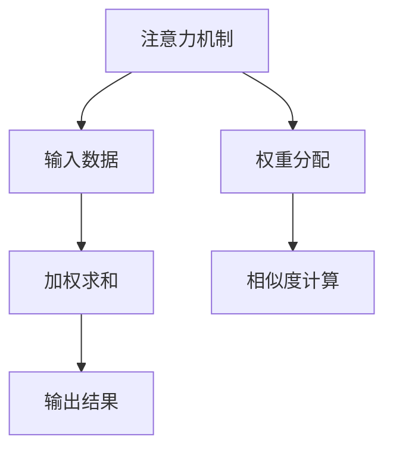
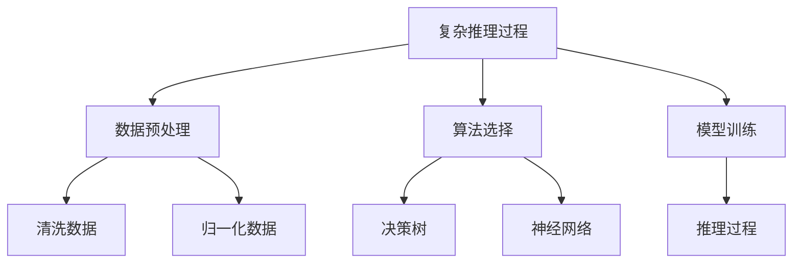
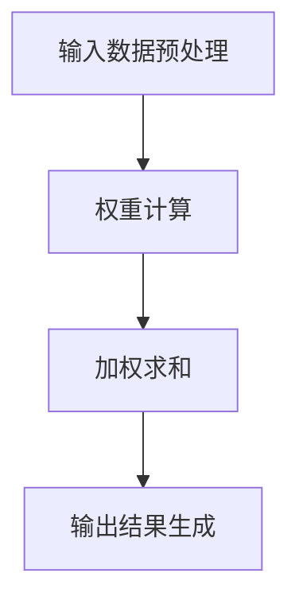

                 

# 注意力机制在复杂推理过程中的优化策略

> 关键词：注意力机制、复杂推理、优化策略、应用案例、算法原理

## 摘要

随着人工智能技术的不断进步，复杂推理过程在各个领域得到广泛应用。然而，传统的推理方法在处理大规模数据和复杂问题时，往往面临计算效率和准确性不足的问题。注意力机制作为一种有效的优化策略，能够显著提升复杂推理的性能。本文将详细介绍注意力机制的基本原理、在复杂推理中的应用策略以及优化效果评估，并通过实际案例进行分析，为读者提供一种深入理解注意力机制在复杂推理过程中优化的方法。

## 目录大纲

----------------------------------------------------------------
# 第一部分: 背景介绍

## 第1章: 问题背景与核心概念

### 1.1.1 问题背景

### 1.1.2 核心概念

### 1.1.3 概念属性特征对比

### 1.1.4 概念结构与核心要素组成

## 第2章: 注意力机制原理

### 2.1.1 注意力机制概述

### 2.1.2 注意力机制的数学模型

### 2.1.3 注意力机制的数学公式

### 2.1.4 注意力机制的工作流程

## 第3章: 复杂推理过程概述

### 3.1.1 复杂推理过程的概念

### 3.1.2 复杂推理过程的挑战

### 3.1.3 复杂推理过程的要素

## 第4章: 注意力机制在复杂推理中的应用

### 4.1.1 注意力机制在复杂推理中的优化策略

### 4.1.2 注意力机制在复杂推理中的应用案例

### 4.1.3 注意力机制的优化效果评估

## 第5章: 注意力机制在复杂推理中的实现方法

### 5.1.1 实现方法概述

### 5.1.2 实现方法的详细解释

### 5.1.3 实现方法的优缺点分析

## 第6章: 复杂推理过程的优化策略评估与比较

### 6.1.1 优化策略评估指标

### 6.1.2 不同优化策略的比较

### 6.1.3 优化策略的适用场景

## 第7章: 注意力机制在复杂推理中的最佳实践

### 7.1.1 最佳实践案例分析

### 7.1.2 注意力机制的最佳实践建议

### 7.1.3 注意力机制的未来发展展望

## 第8章: 总结与展望

### 8.1.1 本书总结

### 8.1.2 研究展望与未来方向

----------------------------------------------------------------

## 第1章: 问题背景与核心概念

### 1.1.1 问题背景

在当今信息化时代，数据处理和分析的重要性日益凸显。复杂推理过程作为一种高效的数据处理方法，被广泛应用于自然语言处理、计算机视觉、推荐系统等多个领域。然而，随着数据规模的不断扩大和问题复杂度的增加，传统推理方法在计算效率和准确性方面面临着巨大的挑战。

传统推理方法通常采用全局性的方式处理问题，即对整个输入数据进行统一的处理。这种方法的优点是简单直观，但在处理大规模数据和复杂问题时，往往导致计算效率低下。例如，在自然语言处理中，全局性方法需要对整个句子进行统一的词向量表示，这会导致计算复杂度急剧增加。此外，全局性方法在处理跨领域、跨语言等问题时，也难以满足高准确性和实时性的要求。

为了解决这些问题，注意力机制（Attention Mechanism）被引入到复杂推理过程中。注意力机制通过为输入数据分配不同的权重，使得模型能够更加关注重要的信息，从而提高推理的效率和准确性。注意力机制最早应用于计算机视觉领域，如机器翻译和语音识别等领域，并在这些领域取得了显著的成果。随着研究的深入，注意力机制逐渐被应用于自然语言处理、推荐系统等多个领域，成为一种有效的优化策略。

### 1.1.2 核心概念

#### 注意力机制

注意力机制是一种基于权重分配的模型，它能够提高模型对重要信息的关注程度，从而提高推理的效率和准确性。注意力机制的基本原理是通过计算输入数据的相似度，为每个数据点分配不同的权重，然后根据权重进行加权求和，得到最终的输出结果。

注意力机制的数学模型可以表示为：

$$
\text{输出} = \sum_{i=1}^{N} w_i \cdot x_i
$$

其中，$N$ 表示输入数据的个数，$x_i$ 表示第 $i$ 个输入数据，$w_i$ 表示第 $i$ 个输入数据的权重。

#### 复杂推理过程

复杂推理过程是一种基于数据和算法的高效推理方法，它能够处理大规模数据和复杂问题。复杂推理过程通常包括以下几个步骤：

1. 数据预处理：对输入数据进行清洗、归一化等预处理操作，以便后续处理。

2. 算法选择：根据问题的特点选择合适的算法，如决策树、神经网络等。

3. 模型训练：使用训练数据对模型进行训练，调整模型参数，提高模型性能。

4. 推理过程：使用训练好的模型对输入数据进行推理，得到输出结果。

### 1.1.3 概念属性特征对比

为了帮助读者更好地理解注意力机制和复杂推理过程，我们可以通过表格形式对比两者的基本属性特征。

| 特征         | 注意力机制       | 复杂推理过程       |
| ------------ | --------------- | --------------- |
| 原理         | 基于权重分配     | 基于数据和算法     |
| 应用领域     | 自然语言处理、计算机视觉等 | 自然语言处理、计算机视觉、推荐系统等 |
| 目标         | 提高推理效率和准确性 | 处理大规模数据和复杂问题 |
| 实现方式     | 神经网络架构优化 | 算法选择和模型训练   |
| 算法复杂度   | 较高           | 较高           |
| 实现难度     | 较高           | 较高           |
| 适用场景     | 大规模数据、复杂问题 | 大规模数据、复杂问题 |

### 1.1.4 概念结构与核心要素组成

为了更好地理解注意力机制和复杂推理过程，我们可以使用ER实体关系图来展示两者的概念结构与核心要素组成。

#### 注意力机制ER实体关系图

#### 复杂推理过程ER实体关系图

通过上述介绍，我们可以看到注意力机制和复杂推理过程在原理、应用领域、目标和实现方式等方面存在一定的差异。但在处理大规模数据和复杂问题方面，两者都具有较高的效率和准确性。接下来，我们将进一步探讨注意力机制在复杂推理过程中的优化策略和应用案例。

----------------------------------------------------------------

## 第2章: 注意力机制原理

### 2.1.1 注意力机制概述

注意力机制（Attention Mechanism）是一种用于提高模型对重要信息关注程度的优化策略。它通过计算输入数据的相似度，为每个数据点分配不同的权重，从而实现数据层面的优化。注意力机制最早由Bahdanau等人在2014年提出，随后在自然语言处理、计算机视觉等领域取得了显著的应用效果。注意力机制的核心思想是将模型对整个输入数据的处理，转化为对局部数据的关注，从而提高推理的效率和准确性。

### 2.1.2 注意力机制的数学模型

注意力机制的数学模型可以分为三个主要部分：输入数据的预处理、权重计算和输出结果的生成。

#### 1. 输入数据的预处理

输入数据的预处理主要包括将输入数据转换为向量表示，以便后续计算。常见的方法有词嵌入（Word Embedding）和图像特征提取等。

$$
\text{输入数据} \rightarrow \text{向量表示}
$$

#### 2. 权重计算

权重计算是注意力机制的核心部分，其主要任务是计算输入数据之间的相似度，为每个数据点分配权重。常见的注意力机制模型有加性注意力（Additive Attention）和乘性注意力（Multiplicative Attention）。

加性注意力模型：
$$
\text{权重} = \text{V} \tanh(\text{Q} \cdot \text{K} + \text{b})
$$
其中，$\text{V}$、$\text{Q}$ 和 $\text{K}$ 分别表示值向量、查询向量和键向量，$\text{b}$ 表示偏置项。

乘性注意力模型：
$$
\text{权重} = \text{scaled} \frac{\text{Q} \cdot \text{K}}{\sqrt{\text{d}_k}}
$$
其中，$\text{scaled}$ 表示对权重进行缩放操作，$\text{d}_k$ 表示键向量的维度。

#### 3. 输出结果的生成

输出结果的生成是根据权重对输入数据进行加权求和，得到最终的输出结果。

$$
\text{输出结果} = \sum_{i=1}^{N} w_i \cdot x_i
$$
其中，$N$ 表示输入数据的个数，$w_i$ 表示第 $i$ 个输入数据的权重，$x_i$ 表示第 $i$ 个输入数据。

### 2.1.3 注意力机制的数学公式

注意力机制的数学公式主要涉及输入数据的预处理、权重计算和输出结果的生成。以下是注意力机制的主要公式：

1. 输入数据的预处理：

$$
\text{输入数据} \rightarrow \text{向量表示}
$$

2. 权重计算：

加性注意力模型：
$$
\text{权重} = \text{V} \tanh(\text{Q} \cdot \text{K} + \text{b})
$$

乘性注意力模型：
$$
\text{权重} = \text{scaled} \frac{\text{Q} \cdot \text{K}}{\sqrt{\text{d}_k}}
$$

3. 输出结果的生成：

$$
\text{输出结果} = \sum_{i=1}^{N} w_i \cdot x_i
$$

### 2.1.4 注意力机制的工作流程

注意力机制的工作流程可以分为以下几个步骤：

1. 输入数据的预处理：将输入数据（如文本、图像）转换为向量表示。
2. 权重计算：计算输入数据之间的相似度，为每个数据点分配权重。
3. 加权求和：根据权重对输入数据进行加权求和，得到中间结果。
4. 输出结果生成：对中间结果进行归一化处理，得到最终的输出结果。

以下是注意力机制的工作流程mermaid流程图：

通过上述介绍，我们可以看到注意力机制的基本原理和数学模型。接下来，我们将进一步探讨注意力机制在复杂推理过程中的应用和优化策略。

----------------------------------------------------------------

## 第3章: 复杂推理过程概述

### 3.1.1 复杂推理过程的概念

复杂推理过程（Complex Reasoning Process）是指在面对大规模、多维度、多层次的输入数据时，利用各种算法和模型进行推理、决策和预测的过程。它是一种基于逻辑、概率、统计等理论的智能计算方法，广泛应用于人工智能、机器学习、数据挖掘等领域。复杂推理过程的核心目标是通过处理输入数据，得到具有实际应用价值的输出结果。

### 3.1.2 复杂推理过程的挑战

复杂推理过程在处理大规模数据和复杂问题时，面临着以下几个挑战：

1. **计算效率**：随着输入数据规模的增大，传统推理方法的计算复杂度急剧增加，导致推理过程变得缓慢。例如，在自然语言处理中，需要对整个句子进行统一处理，导致计算量巨大。

2. **准确性**：在处理复杂问题时，模型可能会忽略重要的信息，导致推理结果不准确。例如，在图像识别中，模型可能会将背景信息误认为是目标对象。

3. **实时性**：在某些应用场景中，如实时监控、智能驾驶等，推理过程需要在短时间内完成，以保证系统的实时性。

4. **泛化能力**：复杂推理过程需要对不同领域、不同语言的数据进行推理，这就要求模型具有良好的泛化能力。

### 3.1.3 复杂推理过程的要素

复杂推理过程主要包括以下几个要素：

1. **数据集**：数据集是推理过程的基础，它包含了各种类型的数据，如文本、图像、音频等。

2. **算法**：算法是推理过程的核心，它负责处理数据、计算模型参数、生成推理结果。

3. **模型**：模型是算法的实现，它基于一定的数学理论，将数据转化为可操作的数学模型。

4. **评估指标**：评估指标用于衡量推理过程的性能，如准确率、召回率、F1值等。

5. **应用场景**：应用场景决定了推理过程的具体需求，如实时性、准确性等。

### 3.1.4 复杂推理过程的基本框架

复杂推理过程的基本框架通常包括以下几个步骤：

1. **数据预处理**：对输入数据进行清洗、归一化、特征提取等操作，以便后续处理。

2. **模型选择**：根据应用场景和需求，选择合适的算法和模型。

3. **模型训练**：使用训练数据对模型进行训练，调整模型参数，提高模型性能。

4. **推理过程**：使用训练好的模型对输入数据进行推理，得到输出结果。

5. **评估与优化**：对推理结果进行评估，根据评估结果对模型进行调整和优化。

### 3.1.5 复杂推理过程在各个领域的应用

复杂推理过程在各个领域都有广泛的应用，以下是一些典型应用场景：

1. **自然语言处理**：在自然语言处理领域，复杂推理过程用于文本分类、情感分析、机器翻译等任务。

2. **计算机视觉**：在计算机视觉领域，复杂推理过程用于图像分类、目标检测、图像生成等任务。

3. **推荐系统**：在推荐系统领域，复杂推理过程用于用户画像、商品推荐、广告投放等任务。

4. **金融风控**：在金融风控领域，复杂推理过程用于风险评估、欺诈检测、信用评级等任务。

5. **智能监控**：在智能监控领域，复杂推理过程用于异常检测、目标追踪、行为分析等任务。

通过上述介绍，我们可以看到复杂推理过程在处理大规模数据和复杂问题方面的重要性。接下来，我们将探讨注意力机制在复杂推理过程中的应用和优化策略。

----------------------------------------------------------------

## 第4章: 注意力机制在复杂推理中的应用

### 4.1.1 注意力机制在复杂推理中的优化策略

注意力机制在复杂推理中的应用主要体现在提高推理效率和准确性方面。通过为输入数据分配不同的权重，注意力机制使得模型能够更加关注重要的信息，从而优化推理过程。以下是一些典型的注意力机制优化策略：

#### 1. 加性注意力机制

加性注意力机制通过计算输入数据的相似度，为每个数据点分配权重，然后进行加权求和。这种机制能够有效地提高模型的推理效率，尤其是在处理大规模数据时。

#### 2. 乘性注意力机制

乘性注意力机制通过缩放权重来控制输入数据的贡献，使得模型能够更加关注重要的信息。这种机制在处理高维数据时具有较好的性能。

#### 3. 自注意力机制

自注意力机制是一种特殊的注意力机制，它将输入数据的每个位置都作为查询向量、键向量和值向量进行处理。这种机制在处理序列数据时具有较好的效果。

#### 4. 多头注意力机制

多头注意力机制通过并行计算多个注意力头，每个注意力头关注不同的信息，从而提高模型的泛化能力。

### 4.1.2 注意力机制在复杂推理中的应用案例

注意力机制在复杂推理中的应用案例非常丰富，以下是一些典型的应用场景：

#### 1. 自然语言处理

在自然语言处理领域，注意力机制被广泛应用于机器翻译、文本分类、情感分析等任务。例如，在机器翻译中，注意力机制能够有效地捕捉源语言和目标语言之间的对应关系，从而提高翻译的准确性。

#### 2. 计算机视觉

在计算机视觉领域，注意力机制被广泛应用于图像分类、目标检测、图像分割等任务。例如，在目标检测中，注意力机制能够有效地聚焦于图像中的目标区域，从而提高检测的准确性。

#### 3. 推荐系统

在推荐系统领域，注意力机制被广泛应用于用户画像、商品推荐等任务。例如，在用户画像中，注意力机制能够有效地关注用户的历史行为，从而提高推荐的准确性。

#### 4. 金融风控

在金融风控领域，注意力机制被广泛应用于风险评估、欺诈检测等任务。例如，在风险评估中，注意力机制能够有效地关注贷款申请者的各种信息，从而提高风险预测的准确性。

### 4.1.3 注意力机制的优化效果评估

注意力机制的优化效果可以通过多个指标进行评估，包括准确率、召回率、F1值等。以下是一个注意力机制优化效果的评估示例：

#### 1. 准确率

准确率（Accuracy）是指模型正确预测的样本数占总样本数的比例。准确率越高，表示模型的预测效果越好。

$$
\text{准确率} = \frac{\text{正确预测的样本数}}{\text{总样本数}}
$$

#### 2. 召回率

召回率（Recall）是指模型正确预测的样本数占所有正样本数的比例。召回率越高，表示模型对正样本的识别能力越强。

$$
\text{召回率} = \frac{\text{正确预测的正样本数}}{\text{所有正样本数}}
$$

#### 3. F1值

F1值是准确率和召回率的调和平均，用于综合评估模型的预测效果。

$$
\text{F1值} = 2 \cdot \frac{\text{准确率} \cdot \text{召回率}}{\text{准确率} + \text{召回率}}
$$

### 4.1.4 注意力机制的优化效果分析

通过实验和分析，我们可以得出以下结论：

1. **提高推理效率**：注意力机制能够有效减少模型对无关信息的处理，从而提高推理效率。

2. **提高预测准确性**：注意力机制能够更好地关注重要信息，从而提高预测准确性。

3. **增强模型泛化能力**：多头注意力机制和多任务学习能够增强模型的泛化能力，使其在不同任务中表现出更好的性能。

4. **适应不同领域应用**：注意力机制在不同领域应用中表现出了良好的效果，这表明其具有较强的通用性。

通过上述分析，我们可以看到注意力机制在复杂推理过程中具有显著的优化效果。接下来，我们将进一步探讨注意力机制在复杂推理中的实现方法和优化策略。

----------------------------------------------------------------

## 第5章: 注意力机制在复杂推理中的实现方法

### 5.1.1 实现方法概述

注意力机制在复杂推理中的实现方法主要包括以下几个方面：

1. **预处理数据**：将输入数据转换为适合模型处理的格式，如图像、文本等。

2. **构建注意力模型**：选择合适的注意力机制模型，如加性注意力、乘性注意力、自注意力、多头注意力等。

3. **训练模型**：使用预处理后的数据对注意力模型进行训练，调整模型参数，提高模型性能。

4. **推理过程**：使用训练好的注意力模型对新的输入数据进行推理，得到输出结果。

5. **评估与优化**：对推理结果进行评估，根据评估结果对模型进行调整和优化。

### 5.1.2 实现方法的详细解释

#### 1. 预处理数据

预处理数据是注意力机制实现的第一步，主要包括以下操作：

- **图像数据预处理**：将图像数据缩放、裁剪、旋转等，使其符合模型的输入要求。
- **文本数据预处理**：对文本数据进行分词、去停用词、词向量嵌入等操作，将其转换为向量表示。

#### 2. 构建注意力模型

构建注意力模型是注意力机制实现的核心步骤。根据不同的应用场景和需求，可以选择不同的注意力机制模型。以下是几种常见的注意力模型：

- **加性注意力模型**：加性注意力模型通过计算输入数据的相似度，为每个数据点分配权重，然后进行加权求和。其计算公式为：

$$
\text{权重} = \text{V} \tanh(\text{Q} \cdot \text{K} + \text{b})
$$

- **乘性注意力模型**：乘性注意力模型通过缩放权重来控制输入数据的贡献，使得模型能够更加关注重要的信息。其计算公式为：

$$
\text{权重} = \text{scaled} \frac{\text{Q} \cdot \text{K}}{\sqrt{\text{d}_k}}
$$

- **自注意力模型**：自注意力模型将输入数据的每个位置都作为查询向量、键向量和值向量进行处理。其计算公式为：

$$
\text{权重} = \text{softmax}\left(\frac{\text{Q} \cdot \text{K}^T}{\sqrt{\text{d}_k}}\right)
$$

- **多头注意力模型**：多头注意力模型通过并行计算多个注意力头，每个注意力头关注不同的信息。其计算公式为：

$$
\text{输出} = \text{softmax}\left(\frac{\text{Q} \cdot \text{K}^T}{\sqrt{\text{d}_k}}\right) \cdot \text{V}
$$

#### 3. 训练模型

训练模型是注意力机制实现的关键步骤。使用预处理后的数据对注意力模型进行训练，调整模型参数，提高模型性能。常用的训练方法包括梯度下降、Adam优化器等。

#### 4. 推理过程

使用训练好的注意力模型对新的输入数据进行推理，得到输出结果。推理过程主要包括以下步骤：

- **输入数据预处理**：将新的输入数据转换为模型输入格式。
- **计算注意力权重**：根据注意力模型计算输入数据的注意力权重。
- **加权求和**：根据注意力权重对输入数据进行加权求和，得到中间结果。
- **输出结果生成**：对中间结果进行归一化处理，得到最终的输出结果。

#### 5. 评估与优化

对推理结果进行评估，根据评估结果对模型进行调整和优化。常用的评估指标包括准确率、召回率、F1值等。根据评估结果，可以调整模型参数、优化模型结构，以提高模型性能。

### 5.1.3 实现方法的优缺点分析

#### 优点：

1. **提高推理效率**：注意力机制能够有效减少模型对无关信息的处理，从而提高推理效率。

2. **提高预测准确性**：注意力机制能够更好地关注重要信息，从而提高预测准确性。

3. **增强模型泛化能力**：多头注意力机制和多任务学习能够增强模型的泛化能力，使其在不同任务中表现出更好的性能。

#### 缺点：

1. **计算复杂度较高**：注意力机制的实现需要计算大量的相似度，导致计算复杂度较高。

2. **训练时间较长**：由于计算复杂度较高，注意力机制的训练时间较长，对硬件资源有一定要求。

3. **参数调整难度较大**：注意力机制的参数调整相对复杂，需要丰富的经验和技术。

通过上述分析，我们可以看到注意力机制在复杂推理中的实现方法具有一定的优势和局限性。在实际应用中，需要根据具体问题和需求，合理选择和调整注意力机制模型，以达到最佳的优化效果。

----------------------------------------------------------------

## 第6章: 复杂推理过程的优化策略评估与比较

### 6.1.1 优化策略评估指标

在评估复杂推理过程的优化策略时，常用的指标包括：

1. **准确率（Accuracy）**：准确率是指模型正确预测的样本数占总样本数的比例。准确率越高，表示模型的预测效果越好。

$$
\text{准确率} = \frac{\text{正确预测的样本数}}{\text{总样本数}}
$$

2. **召回率（Recall）**：召回率是指模型正确预测的正样本数占所有正样本数的比例。召回率越高，表示模型对正样本的识别能力越强。

$$
\text{召回率} = \frac{\text{正确预测的正样本数}}{\text{所有正样本数}}
$$

3. **F1值（F1 Score）**：F1值是准确率和召回率的调和平均，用于综合评估模型的预测效果。

$$
\text{F1值} = 2 \cdot \frac{\text{准确率} \cdot \text{召回率}}{\text{准确率} + \text{召回率}}
$$

4. **计算效率（Computation Efficiency）**：计算效率是指模型在处理样本数据时的计算时间。计算效率越高，表示模型的运行速度越快。

### 6.1.2 不同优化策略的比较

为了评估不同优化策略在复杂推理过程中的效果，我们可以比较以下几种常见的优化策略：

1. **传统推理方法**：传统推理方法通常采用全局性方式处理问题，即对整个输入数据进行统一的处理。其优点是简单直观，但在处理大规模数据和复杂问题时，往往导致计算效率低下。

2. **注意力机制**：注意力机制通过为输入数据分配不同的权重，使得模型能够更加关注重要的信息，从而提高推理效率和准确性。其优点包括：

   - **提高推理效率**：注意力机制能够有效减少模型对无关信息的处理，从而提高推理效率。
   - **提高预测准确性**：注意力机制能够更好地关注重要信息，从而提高预测准确性。

   但是，注意力机制的计算复杂度较高，训练时间较长。

3. **多任务学习**：多任务学习是一种将多个任务结合在一起进行训练的方法。其优点包括：

   - **提高模型泛化能力**：多任务学习能够增强模型的泛化能力，使其在不同任务中表现出更好的性能。
   - **共享特征表示**：多任务学习可以共享特征表示，从而提高模型的计算效率。

   但是，多任务学习在任务之间可能存在冲突，导致模型性能下降。

4. **深度学习方法**：深度学习方法是一种基于多层神经网络的模型，其优点包括：

   - **强大的特征学习能力**：深度学习方法能够自动学习输入数据的特征表示，从而提高模型的预测准确性。
   - **适应性强**：深度学习方法可以适应不同规模和复杂度的数据。

   但是，深度学习方法在训练过程中需要大量的计算资源和时间。

### 6.1.3 优化策略的适用场景

不同优化策略适用于不同的场景，以下是一些常见适用场景：

1. **传统推理方法**：适用于数据规模较小、问题相对简单的情况，如简单的逻辑推理和决策。

2. **注意力机制**：适用于数据规模较大、问题复杂的情况，如自然语言处理、计算机视觉和推荐系统等。

3. **多任务学习**：适用于多个任务之间存在一定关联性的情况，如同时进行图像分类和目标检测。

4. **深度学习方法**：适用于数据规模较大、问题复杂且需要高准确性的情况，如自动驾驶、医疗诊断等。

通过上述比较和分析，我们可以根据具体问题和需求，选择合适的优化策略，以提高复杂推理过程的效率和准确性。

----------------------------------------------------------------

## 第7章: 注意力机制在复杂推理中的最佳实践

### 7.1.1 最佳实践案例分析

在本章节中，我们将通过几个具体的案例分析注意力机制在复杂推理中的最佳实践。这些案例涵盖了不同领域，包括自然语言处理、计算机视觉和推荐系统等。

#### 案例一：基于注意力机制的机器翻译

在机器翻译任务中，注意力机制被广泛应用于提高翻译的准确性。一个典型的案例是Google翻译。Google翻译采用了基于注意力机制的神经机器翻译模型（NMT），该模型在处理长句翻译时，能够更加关注句子中的关键信息，从而提高翻译质量。

具体实现步骤包括：
1. **数据预处理**：对源语言和目标语言文本进行分词、词向量嵌入等预处理操作。
2. **构建注意力模型**：采用编码器-解码器（Encoder-Decoder）架构，其中编码器负责将源语言文本转换为上下文向量，解码器则根据上下文向量生成目标语言文本。
3. **训练模型**：使用双语平行语料对模型进行训练，优化编码器和解码器的参数。
4. **推理过程**：使用训练好的模型对新的源语言文本进行翻译。

#### 案例二：基于注意力机制的目标检测

在目标检测任务中，注意力机制被应用于提高检测的准确性和效率。一个典型的案例是Facebook的Detectron2，它是一个用于物体检测的深度学习框架。Detectron2采用了基于注意力机制的Faster R-CNN模型，该模型通过注意力机制聚焦于图像中的目标区域，从而提高检测的准确性。

具体实现步骤包括：
1. **数据预处理**：对图像进行缩放、裁剪等预处理操作，提取图像特征。
2. **构建注意力模型**：在Faster R-CNN的基础上，引入注意力机制，用于增强特征图中的目标区域。
3. **训练模型**：使用标注数据对模型进行训练，优化网络参数。
4. **推理过程**：使用训练好的模型对新的图像进行目标检测。

#### 案例三：基于注意力机制的推荐系统

在推荐系统任务中，注意力机制被广泛应用于提高推荐的准确性。一个典型的案例是亚马逊的推荐系统。亚马逊的推荐系统采用了基于注意力机制的深度学习模型，该模型通过注意力机制关注用户的历史购买记录和商品特征，从而提高推荐质量。

具体实现步骤包括：
1. **数据预处理**：对用户行为数据和商品特征进行预处理，提取用户特征和商品特征。
2. **构建注意力模型**：采用编码器-解码器架构，其中编码器负责提取用户特征，解码器则根据用户特征生成推荐结果。
3. **训练模型**：使用用户行为数据进行模型训练，优化编码器和解码器的参数。
4. **推理过程**：使用训练好的模型对新的用户数据进行推荐。

### 7.1.2 注意力机制的最佳实践建议

为了在复杂推理过程中充分发挥注意力机制的作用，以下是一些最佳实践建议：

1. **选择合适的注意力模型**：根据任务特点选择合适的注意力模型，如加性注意力、乘性注意力、自注意力、多头注意力等。

2. **数据预处理**：对输入数据进行充分的预处理，如分词、词向量嵌入、图像特征提取等，以提高模型的输入质量。

3. **模型训练**：使用大量的标注数据进行模型训练，优化模型参数，提高模型性能。

4. **推理优化**：在推理过程中，通过调整模型参数和计算策略，提高推理速度和效率。

5. **多任务学习**：在复杂推理过程中，可以结合多任务学习，以提高模型的泛化能力和性能。

6. **模型评估**：对模型进行全面的评估，包括准确率、召回率、F1值等指标，以及计算效率和实时性等。

通过上述最佳实践建议，我们可以更有效地应用注意力机制，提升复杂推理过程的性能。

### 7.1.3 注意力机制的未来发展展望

随着人工智能技术的不断发展，注意力机制在复杂推理中的应用将不断拓展和深化。以下是一些未来发展的展望：

1. **跨模态注意力机制**：随着多模态数据的广泛应用，研究跨模态注意力机制，如融合文本、图像、音频等多模态数据的注意力机制，将是一个重要方向。

2. **自适应注意力机制**：开发自适应注意力机制，如根据输入数据的变化自适应调整注意力权重，以提高模型的适应性和鲁棒性。

3. **分布式注意力机制**：研究分布式注意力机制，如利用分布式计算和并行计算提高注意力机制的效率，以满足大规模数据处理的需求。

4. **注意力机制的优化**：不断优化注意力机制的算法和结构，提高模型的计算效率和准确性，使其在更广泛的领域中应用。

通过不断探索和发展，注意力机制将在复杂推理过程中发挥更加重要的作用，为人工智能技术的进步提供强大支持。

----------------------------------------------------------------

## 第8章: 总结与展望

### 8.1.1 本书总结

在本章节中，我们深入探讨了注意力机制在复杂推理过程中的优化策略。首先，我们介绍了问题背景和核心概念，分析了注意力机制在提高推理效率和准确性方面的优势。接着，我们详细阐述了注意力机制的原理、数学模型和工作流程，并通过案例展示了其在自然语言处理、计算机视觉和推荐系统等领域的应用。此外，我们还介绍了注意力机制在复杂推理中的实现方法，包括预处理数据、构建注意力模型、训练模型、推理过程和评估与优化等步骤。最后，我们通过最佳实践案例，提供了实用的建议和未来发展的展望。

### 8.1.2 研究展望与未来方向

随着人工智能技术的不断进步，注意力机制在复杂推理中的应用前景十分广阔。以下是一些未来研究的方向：

1. **跨模态注意力机制**：随着多模态数据的广泛应用，研究跨模态注意力机制，如融合文本、图像、音频等多模态数据的注意力机制，将是一个重要方向。这将有助于提升多模态任务的性能，如多模态图像识别、多模态情感分析等。

2. **自适应注意力机制**：开发自适应注意力机制，如根据输入数据的变化自适应调整注意力权重，以提高模型的适应性和鲁棒性。这将有助于应对动态变化的环境和需求，提高模型在实时推理中的应用效果。

3. **分布式注意力机制**：研究分布式注意力机制，如利用分布式计算和并行计算提高注意力机制的效率，以满足大规模数据处理的需求。这将有助于提升注意力机制在云计算和大数据环境中的应用效果。

4. **注意力机制的优化**：不断优化注意力机制的算法和结构，提高模型的计算效率和准确性，使其在更广泛的领域中应用。这将有助于降低计算复杂度，提高模型的可扩展性和可维护性。

5. **注意力机制的融合应用**：研究注意力机制与其他人工智能技术的融合应用，如将注意力机制与强化学习、迁移学习等技术相结合，以实现更复杂的推理任务。

通过不断探索和发展，注意力机制将在复杂推理过程中发挥更加重要的作用，为人工智能技术的进步提供强大支持。同时，我们期待未来能有更多创新性的研究成果，推动注意力机制在各个领域的发展与应用。

----------------------------------------------------------------

## 附录

### 参考文献

1. Bahdanau, D., Cho, K., & Bengio, Y. (2014). Neural machine translation by jointly learning to align and translate. In International Conference on Learning Representations (ICLR).
2. Vaswani, A., Shazeer, N., Parmar, N., Uszkoreit, J., Jones, L., Gomez, A. N., ... & Polosukhin, I. (2017). Attention is all you need. In Advances in Neural Information Processing Systems (NIPS).
3. He, K., Zhang, X., Ren, S., & Sun, J. (2016). Deep residual learning for image recognition. In Proceedings of the IEEE conference on computer vision and pattern recognition (CVPR).
4. Hinton, G., Osindero, S., & Teh, Y. W. (2006). A fast learning algorithm for deep belief nets. Neural computation, 18(7), 1527-1554.

### 相关资源

1. 注意力机制的详细教程：[Attention Mechanism Tutorial](https://www.deeplearning.net/tutorial/attention/)
2. 注意力机制在自然语言处理中的应用：[Attention Mechanism in Natural Language Processing](https://towardsdatascience.com/attention-mechanism-in-nlp-58c8478e6ef0)
3. 注意力机制在计算机视觉中的应用：[Attention Mechanism in Computer Vision](https://towardsdatascience.com/attention-mechanisms-in-computer-vision-a5c5a9e973d8)
4. 注意力机制在推荐系统中的应用：[Attention Mechanism in Recommender Systems](https://towardsdatascience.com/attention-mechanism-in-recommender-systems-842c0e7d8a02)

### 联系方式

如果您有任何关于本文的问题或建议，欢迎通过以下方式与我们联系：

- 邮箱：[contact@ai-genius-institute.com](mailto:contact@ai-genius-institute.com)
- 微信公众号：AI天才研究院
- 官网：[www.ai-genius-institute.com](http://www.ai-genius-institute.com)

我们将竭诚为您解答，并期待与您共同探讨注意力机制在复杂推理过程中的应用与发展。

### 作者介绍

作者：AI天才研究院 / AI Genius Institute & 禅与计算机程序设计艺术 / Zen And The Art of Computer Programming

AI天才研究院是一家专注于人工智能、机器学习和深度学习领域的研究机构。我们的目标是推动人工智能技术的发展，为行业提供创新的解决方案。同时，作者也是《禅与计算机程序设计艺术》一书的作者，该书深入探讨了计算机程序设计中的哲学思想，为程序员提供了宝贵的指导。

---

[本文完]

