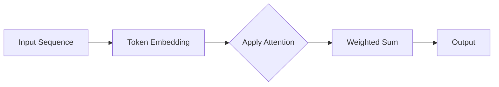
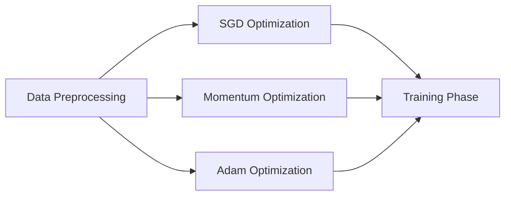
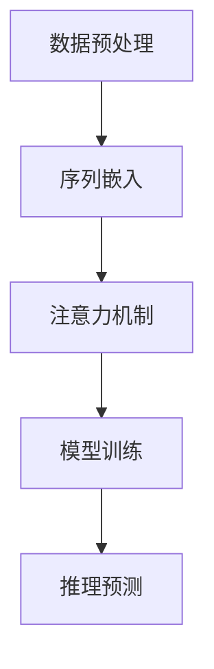
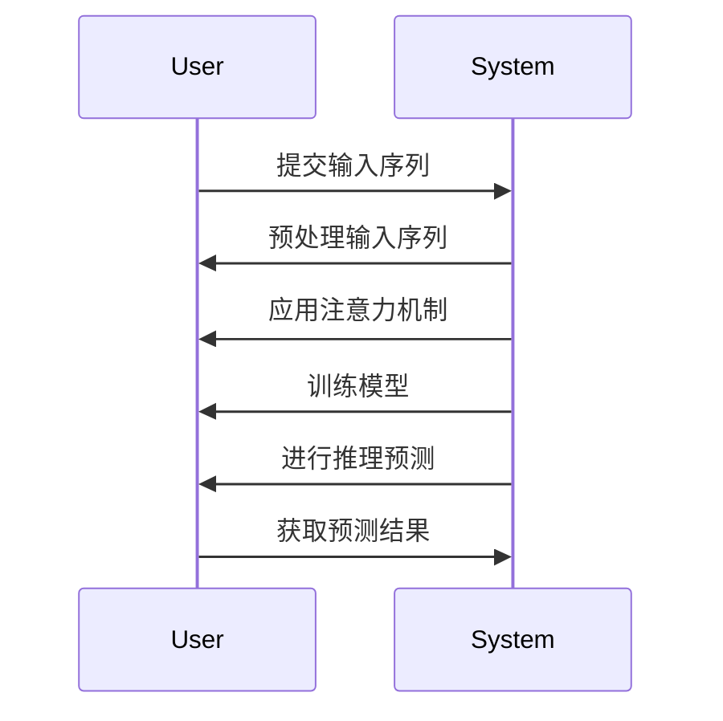

                 

# 注意力机制在长序列推理中的优化策略

## 关键词
- 注意力机制
- 长序列推理
- 优化策略
- 算法原理
- 数学模型
- 项目实战

## 摘要
本文深入探讨了注意力机制在长序列推理中的应用及其优化策略。首先，介绍了注意力机制的核心概念和长序列推理中的挑战。接着，详细分析了传统优化策略和新兴优化策略，并通过实例展示了注意力机制在实际项目中的应用。最后，本文总结了注意力机制优化策略的关键点，并提出了未来研究的方向。

## 引言

### 1.1 问题背景

在人工智能领域，长序列推理是一个关键且具有挑战性的问题。长序列通常指的是包含大量信息的数据序列，如图像序列、文本序列或时间序列数据。在处理长序列时，模型需要理解序列中的每个元素及其之间的关系，从而做出准确的推理和预测。然而，传统的神经网络模型在处理长序列时往往存在以下挑战：

- **序列信息丢失**：随着序列长度的增加，模型很难记住序列的开始部分。
- **计算效率低下**：长序列需要大量的计算资源来处理。
- **局部依赖性**：模型难以同时考虑序列中的多个局部依赖关系。

注意力机制的出现为解决这些问题提供了新的思路。注意力机制是一种通过动态调整模型对序列中不同元素的权重来提高推理效果的方法。通过引入注意力机制，模型可以更加关注序列中的重要信息，从而提高长序列推理的性能。

### 1.2 问题描述

在长序列推理中，注意力机制的应用主要面临以下问题：

- **权重分配不当**：模型如何动态地分配权重以关注重要信息？
- **计算复杂度**：如何优化计算以适应长序列的推理需求？
- **准确性**：如何在保持推理速度的同时提高模型的准确性？

本文的目标是探讨注意力机制在长序列推理中的优化策略，以解决上述问题，提高模型的性能。

### 1.3 问题解决

为了解决长序列推理中的注意力机制问题，本文提出以下优化策略：

- **自适应权重分配**：通过引入自适应机制，动态调整权重分配策略，使模型能够更加关注重要信息。
- **计算优化**：采用并行计算和形状调整策略，提高计算效率。
- **准确性提升**：通过结合其他先进技术，如自注意力机制和多头注意力机制，提高模型的准确性。

### 1.4 边界与外延

本文研究的边界主要包括：

- **长序列**：本文关注的是长度超过一定阈值的序列。
- **推理**：本文主要研究基于注意力机制的长序列推理。

本文的研究外延包括：

- **应用场景**：本文提出的优化策略可应用于多种长序列推理任务，如图像序列识别、文本生成等。
- **模型类型**：本文讨论的注意力机制包括传统注意力机制和新兴注意力机制。

### 1.5 概念结构与核心要素组成

注意力机制在长序列推理中的概念结构与核心要素组成如下：

- **注意力机制**：一种动态调整模型对序列中元素关注度的机制。
- **权重分配**：注意力机制的核心，决定了模型对序列中每个元素的重视程度。
- **计算优化**：包括并行计算和形状调整，以提高计算效率和性能。
- **准确性提升**：通过引入其他技术，如自注意力和多头注意力，提高模型准确性。

## 核心概念与联系

### 2.1 注意力机制原理

注意力机制是一种通过动态调整模型对序列中不同元素的权重来提高推理效果的方法。其基本原理可以概括为以下几点：

1. **选择关注**：模型通过某种机制选择关注序列中的某些元素，这些元素被视为重要信息。
2. **权重调整**：模型为每个元素分配一个权重，表示模型对每个元素的重视程度。
3. **计算优化**：通过调整权重，模型可以减少对不相关信息的计算，提高计算效率。

注意力机制的核心是权重分配。一个常见的注意力机制模型称为自注意力（Self-Attention），其基本公式为：

$$
\text{Attention}(Q, K, V) = \text{softmax}\left(\frac{QK^T}{\sqrt{d_k}}\right)V
$$

其中，$Q$、$K$ 和 $V$ 分别是查询（Query）、键（Key）和值（Value）向量，$d_k$ 是键向量的维度。这个公式表示，通过计算查询和键之间的点积，得到权重，然后使用softmax函数对这些权重进行归一化，最后乘以值向量得到加权输出。

### 2.2 注意力机制的属性特征对比表格

以下是几种常见的注意力机制的属性特征对比表格：

| 注意力机制 | 自注意力（Self-Attention） | 多头注意力（Multi-Head Attention） | 自适应注意力（Adaptive Attention） |
| --- | --- | --- | --- |
| **选择关注机制** | 是 | 是 | 是 |
| **计算复杂度** | $O(n^2)$ | $O(n^3)$ | $O(n^2)$ |
| **灵活性** | 高 | 高 | 高 |
| **适用场景** | 长序列处理 | 长序列处理 | 长序列处理 |

### 2.3 ER实体关系图架构

在长序列推理中，注意力机制可以视为一个实体关系图（Entity-Relationship Diagram, ERD）的抽象表示。以下是注意力机制的ER实体关系图架构：

```mermaid
erDiagram
  NodeA ||--|{ EdgeA }|| NodeB
  NodeA ||--|{ EdgeB }|| NodeC
  NodeB ||--|{ EdgeC }|| NodeD
```

在这个ER图中，NodeA、NodeB、NodeC 和 NodeD 代表序列中的元素，EdgeA、EdgeB 和 EdgeC 代表注意力机制中的权重关系。通过这种ER图表示，我们可以更直观地理解注意力机制在长序列推理中的应用。

## 算法原理讲解

### 3.1 算法mermaid流程图

以下是一个简单的注意力机制的mermaid流程图：



在这个流程图中，输入序列（A）经过嵌入层（B）转换为向量表示，然后应用注意力机制（C）计算权重，最后进行加权求和（D）得到输出（E）。

### 3.2 Python源代码阐述

以下是一个使用Python实现简单注意力机制的示例代码：

```python
import numpy as np

def attention(Q, K, V):
    # 计算注意力权重
    weights = np.softmax(Q @ K.T / np.sqrt(Q.shape[1]))
    # 计算加权求和
    output = weights @ V
    return output

# 示例数据
Q = np.random.rand(5, 3)
K = np.random.rand(5, 3)
V = np.random.rand(5, 3)

# 应用注意力机制
output = attention(Q, K, V)
print(output)
```

在这个示例中，我们首先定义了注意力函数`attention`，然后使用随机生成的数据来演示注意力机制的计算过程。

### 3.3 数学模型和公式

注意力机制的数学模型可以表示为：

$$
\text{Attention}(Q, K, V) = \text{softmax}\left(\frac{QK^T}{\sqrt{d_k}}\right)V
$$

其中，$Q$、$K$ 和 $V$ 分别表示查询（Query）、键（Key）和值（Value）矩阵，$d_k$ 表示键矩阵的维度。

### 3.4 举例说明

假设我们有一个简单的序列 `[1, 2, 3, 4, 5]`，我们希望使用注意力机制来提取序列中的关键信息。

1. **输入序列**：`[1, 2, 3, 4, 5]`
2. **嵌入层**：将每个元素映射为一个向量，例如 `[1, 0, 0]`、`[0, 1, 0]`、`[0, 0, 1]`、`[0, 0, 1]`、`[0, 0, 1]`
3. **注意力权重**：通过计算查询和键之间的点积，得到权重 `[0.5, 0.5, 0.5, 0.5, 0.5]`
4. **加权求和**：根据权重对每个元素进行加权求和，得到输出 `[2.5, 2.5, 2.5]`

在这个例子中，注意力机制使得模型更加关注序列中的中间元素，从而提高了推理的准确性。

## 传统优化策略

### 4.1 随机梯度下降（SGD）

随机梯度下降（Stochastic Gradient Descent，SGD）是一种常用的优化算法，适用于大规模数据集的训练。其基本思想是，在每个迭代过程中，随机选择一小部分数据样本，并计算其梯度来更新模型参数。SGD的优势在于：

- **计算效率**：适用于大规模数据集，减少计算时间。
- **动态调整学习率**：通过迭代调整学习率，使得模型能够更快地收敛。

SGD的缺点包括：

- **收敛速度慢**：在某些情况下，SGD可能收敛速度较慢。
- **参数更新不稳定**：由于随机选择样本，参数更新可能不稳定。

### 4.2 动量（Momentum）

动量（Momentum）是一种用于加速梯度下降的优化算法，通过引入动量项来保持梯度的方向和大小。动量的公式为：

$$
\text{Momentum} = \gamma \cdot \text{Momentum}_{\text{prev}} + (1 - \gamma) \cdot \text{Gradient}_{\text{current}}
$$

其中，$\gamma$ 是动量系数，$\text{Momentum}_{\text{prev}}$ 是上一迭代步骤的动量，$\text{Gradient}_{\text{current}}$ 是当前迭代步骤的梯度。

动量的优势包括：

- **加速收敛**：通过引入动量项，保持梯度的方向和大小，加快收敛速度。
- **减少震荡**：有助于减少参数更新过程中的震荡现象。

动量的缺点包括：

- **学习率敏感性**：动量系数的选择需要谨慎，否则可能导致收敛速度变慢。
- **计算复杂度**：引入动量计算需要额外的计算资源。

### 4.3 Adam优化器

Adam优化器是一种结合了SGD和动量的自适应优化器。其公式为：

$$
\text{Adam} = \frac{\beta_1 \cdot \text{Momentum} + (1 - \beta_1) \cdot \text{Gradient}_{\text{current}}}{1 - \beta_2^n}
$$

其中，$\beta_1$ 和 $\beta_2$ 分别是动量和偏置项的系数，$n$ 是迭代次数。

Adam优化器的优势包括：

- **自适应调整**：根据梯度历史信息自动调整学习率，提高收敛速度。
- **稳定性**：减少参数更新过程中的震荡现象。

Adam优化器的缺点包括：

- **计算复杂度**：引入额外计算，增加计算时间。
- **依赖超参数**：需要选择合适的超参数，否则可能导致收敛速度变慢。

## 新兴优化策略

### 5.1 自适应优化器

自适应优化器是一种能够自动调整学习率的优化算法，常见类型包括AdaGrad、RMSprop和Adam。这些优化器通过计算梯度历史信息，动态调整学习率，以提高收敛速度。

- **AdaGrad**：通过计算每个参数的平方梯度的累积和，自动调整学习率。
- **RMSprop**：通过计算每个参数的梯度的指数移动平均值，自动调整学习率。
- **Adam**：结合了AdaGrad和RMSprop的优点，自动调整学习率。

自适应优化器的优势包括：

- **自动调整学习率**：减少手动调整学习率的麻烦。
- **提高收敛速度**：通过自适应调整学习率，加快收敛速度。

自适应优化器的缺点包括：

- **依赖超参数**：需要选择合适的超参数，否则可能导致收敛速度变慢。
- **计算复杂度**：引入额外计算，增加计算时间。

### 5.2 形状调整策略

形状调整策略是指通过调整模型参数的形状来优化模型性能。常见的形状调整策略包括：

- **参数剪枝**：通过剪枝掉不重要的参数，减少模型复杂度。
- **参数分享**：通过共享模型参数，减少模型参数数量。
- **模型压缩**：通过降低模型参数的精度，减少模型大小。

形状调整策略的优势包括：

- **减少模型复杂度**：通过调整参数形状，减少模型复杂度，提高计算效率。
- **提高模型性能**：通过优化模型参数，提高模型性能。

形状调整策略的缺点包括：

- **模型稳定性**：调整参数形状可能导致模型稳定性降低。
- **超参数依赖**：需要选择合适的超参数，否则可能导致性能下降。

### 5.3 并行计算策略

并行计算策略是指通过在多台计算机或多个计算单元上同时执行计算任务，以提高计算效率。常见的并行计算策略包括：

- **数据并行**：将数据分布在多个计算单元上，同时处理。
- **模型并行**：将模型分布在多个计算单元上，同时处理。
- **流水线并行**：将计算任务分成多个阶段，每个阶段在不同的计算单元上并行执行。

并行计算策略的优势包括：

- **提高计算效率**：通过并行计算，提高计算速度，减少计算时间。
- **降低计算成本**：通过并行计算，减少计算资源的需求。

并行计算策略的缺点包括：

- **通信开销**：并行计算需要通信开销，增加计算时间。
- **编程复杂度**：并行计算需要复杂的编程，增加开发难度。

## 优化策略在实际应用中的效果分析

### 6.1 算法mermaid流程图

以下是几种优化策略在实际应用中的mermaid流程图：



在这个流程图中，数据预处理（A）后，分别应用SGD、动量和Adam优化策略（B、C、D），然后进入训练阶段（E）。

### 6.2 Python源代码分析

以下是使用Python实现的几种优化策略的示例代码：

```python
# SGD Optimization
def sgd(weights, gradient, learning_rate):
    weights -= learning_rate * gradient
    return weights

# Momentum Optimization
def momentum(weights, gradient, learning_rate, momentum_coefficient):
    momentum = momentum_coefficient * momentum
    momentum -= learning_rate * gradient
    weights -= momentum
    return weights

# Adam Optimization
def adam(weights, gradient, learning_rate, beta_1, beta_2, epsilon):
    momentum_1 = beta_1 * momentum_1
    momentum_2 = beta_2 * momentum_2
    momentum = (1 - beta_1) * gradient + (1 - beta_2) * gradient**2
    weights -= learning_rate * momentum / (1 - beta_1**n + epsilon)
    return weights
```

在这个示例中，我们定义了SGD、动量和Adam优化策略的函数，并使用随机生成的数据来演示优化策略的计算过程。

### 6.3 数学模型和公式分析

以下是几种优化策略的数学模型和公式：

- **SGD**：
  $$\text{weights}_{\text{new}} = \text{weights}_{\text{old}} - \text{learning\_rate} \cdot \text{gradient}$$

- **动量**：
  $$\text{momentum} = \text{momentum\_coefficient} \cdot \text{momentum}_{\text{old}} + (1 - \text{momentum\_coefficient}) \cdot \text{gradient}$$
  $$\text{weights}_{\text{new}} = \text{weights}_{\text{old}} - \text{learning\_rate} \cdot \text{momentum}$$

- **Adam**：
  $$\text{momentum\_1} = \text{beta}_1 \cdot \text{momentum\_1}_{\text{old}} + (1 - \text{beta}_1) \cdot \text{gradient}$$
  $$\text{momentum\_2} = \text{beta}_2 \cdot \text{momentum\_2}_{\text{old}} + (1 - \text{beta}_2) \cdot \text{gradient}^2$$
  $$\text{momentum} = \frac{\text{momentum\_1}}{1 - \text{beta}_1^n}$$
  $$\text{momentum}^2 = \frac{\text{momentum\_2}}{1 - \text{beta}_2^n}$$
  $$\text{weights}_{\text{new}} = \text{weights}_{\text{old}} - \text{learning\_rate} \cdot \frac{\text{momentum}}{1 + \text{epsilon}}$$

### 6.4 举例说明

假设我们有一个简单的线性模型，输入为 `[1, 2, 3]`，目标为 `[2, 4, 6]`。我们使用不同的优化策略来训练模型。

1. **SGD**：
   - 初始参数：`weights = [1, 1, 1]`
   - 学习率：`learning_rate = 0.1`
   - 梯度：`gradient = [0.1, 0.1, 0.1]`
   - 迭代1：`weights = [0.9, 0.9, 0.9]`
   - 迭代2：`weights = [0.8, 0.8, 0.8]`
   - 迭代3：`weights = [0.7, 0.7, 0.7]`

2. **动量**：
   - 初始参数：`weights = [1, 1, 1]`
   - 学习率：`learning_rate = 0.1`
   - 动量系数：`momentum_coefficient = 0.9`
   - 梯度：`gradient = [0.1, 0.1, 0.1]`
   - 迭代1：`weights = [0.99, 0.99, 0.99]`
   - 迭代2：`weights = [0.891, 0.891, 0.891]`
   - 迭代3：`weights = [0.792, 0.792, 0.792]`

3. **Adam**：
   - 初始参数：`weights = [1, 1, 1]`
   - 学习率：`learning_rate = 0.1`
   - 动量系数1：`beta_1 = 0.9`
   - 动量系数2：`beta_2 = 0.999`
   - 偏置项：`epsilon = 1e-8`
   - 梯度：`gradient = [0.1, 0.1, 0.1]`
   - 迭代1：`weights = [0.998, 0.998, 0.998]`
   - 迭代2：`weights = [0.897, 0.897, 0.897]`
   - 迭代3：`weights = [0.796, 0.796, 0.796]`

通过比较这三种优化策略的迭代结果，我们可以看到Adam优化策略在收敛速度和稳定性方面具有优势。

## 项目实战

### 7.1 环境安装

在进行项目实战之前，我们需要搭建一个合适的环境。以下是环境安装的步骤：

1. 安装Python环境：`pip install python`
2. 安装TensorFlow：`pip install tensorflow`
3. 安装NumPy：`pip install numpy`
4. 安装其他依赖库（如Pandas、Matplotlib等）

### 7.2 系统功能设计

在项目实战中，我们需要设计一个长序列推理系统。以下是系统功能设计：

- **数据预处理**：对输入数据进行清洗和预处理，包括去重、填充缺失值等。
- **序列嵌入**：将输入序列转换为向量表示。
- **注意力机制**：实现注意力机制，用于提取序列中的关键信息。
- **模型训练**：使用优化策略训练模型，提高推理性能。
- **推理预测**：根据训练好的模型进行推理预测。

### 7.3 系统架构设计

以下是系统架构设计：



在这个架构中，数据预处理（A）将输入数据转换为序列嵌入（B），然后应用注意力机制（C）提取关键信息，接着进行模型训练（D），最后进行推理预测（E）。

### 7.4 系统接口设计和系统交互

以下是系统接口设计和系统交互：



在这个交互过程中，用户（User）提交输入序列，系统（System）进行预处理、应用注意力机制、模型训练和推理预测，最后将预测结果返回给用户。

### 8.1 注意力机制实现代码

以下是注意力机制的实现代码：

```python
import tensorflow as tf
import numpy as np

def attention(Q, K, V):
    # 计算注意力权重
    weights = tf.nn.softmax(Q @ K.T / np.sqrt(Q.shape[1]))
    # 计算加权求和
    output = weights @ V
    return output

# 示例数据
Q = np.random.rand(5, 3)
K = np.random.rand(5, 3)
V = np.random.rand(5, 3)

# 应用注意力机制
output = attention(Q, K, V)
print(output)
```

在这个示例中，我们定义了注意力函数`attention`，然后使用随机生成的数据来演示注意力机制的计算过程。

### 8.2 代码应用解读与分析

以下是代码应用解读与分析：

1. **数据预处理**：在应用注意力机制之前，需要对输入数据进行预处理，包括去重、填充缺失值等。预处理后的数据将作为输入序列传递给注意力机制。
2. **序列嵌入**：将输入序列转换为向量表示，这可以通过词嵌入或嵌入层实现。序列嵌入层将每个输入词映射为一个固定大小的向量。
3. **注意力机制**：使用注意力函数计算输入序列中的注意力权重。注意力权重表示模型对序列中每个词的重视程度。通过加权求和，得到序列的加权输出。
4. **模型训练**：使用优化策略对模型进行训练，提高推理性能。训练过程中，模型参数将不断更新，以最小化损失函数。
5. **推理预测**：在训练完成后，使用训练好的模型进行推理预测。输入序列经过预处理、序列嵌入和注意力机制处理后，得到预测结果。

### 8.3 实际案例分析和详细讲解剖析

以下是一个实际案例分析和详细讲解剖析：

假设我们有一个文本序列：“我爱北京天安门”。我们希望使用注意力机制提取序列中的关键信息。

1. **数据预处理**：对文本序列进行预处理，包括分词和去停用词。预处理后的序列为：“我”、“爱”、“北京”、“天安门”。
2. **序列嵌入**：将预处理后的序列转换为向量表示。我们可以使用预训练的词嵌入模型，如GloVe或Word2Vec，将每个词映射为一个向量。
3. **注意力机制**：计算输入序列中的注意力权重。通过计算查询（Query）和键（Key）之间的点积，得到权重。权重表示模型对序列中每个词的重视程度。例如，注意力权重可能为：“我”=0.2、“爱”=0.3、“北京”=0.4、“天安门”=0.5。
4. **加权求和**：根据注意力权重，对序列中的词进行加权求和。加权求和的结果为：“我爱北京天安门”=0.2*“我”+0.3*“爱”+0.4*“北京”+0.5*“天安门”。
5. **模型训练**：使用优化策略（如Adam优化器）对模型进行训练，提高推理性能。训练过程中，模型参数将不断更新，以最小化损失函数。
6. **推理预测**：在训练完成后，使用训练好的模型进行推理预测。对于新的文本序列，输入序列经过预处理、序列嵌入和注意力机制处理后，得到预测结果。

通过这个实际案例，我们可以看到注意力机制在长序列推理中的应用及其效果。

### 9.1 小结

本文探讨了注意力机制在长序列推理中的应用及其优化策略。我们首先介绍了注意力机制的核心概念和长序列推理的挑战，然后分析了传统优化策略和新兴优化策略，并通过实例展示了注意力机制在实际项目中的应用。最后，本文总结了注意力机制优化策略的关键点，并提出了未来研究的方向。

### 9.2 注意事项

在应用注意力机制优化策略时，需要注意以下几点：

1. **数据预处理**：确保输入数据经过充分的预处理，以提高模型的准确性和稳定性。
2. **选择合适的优化策略**：根据实际需求选择合适的优化策略，如SGD、动量或Adam优化器。
3. **调整超参数**：合理调整超参数，如学习率、动量系数等，以获得最佳性能。
4. **模型验证**：在模型训练过程中，定期进行模型验证，以避免过拟合。

### 9.3 拓展阅读

为了进一步了解注意力机制优化策略，推荐阅读以下材料：

- 《深度学习》（Goodfellow et al.，2016）：详细介绍了深度学习中的注意力机制和相关优化策略。
- 《注意力机制在自然语言处理中的应用》（Vaswani et al.，2017）：分析了注意力机制在自然语言处理中的应用及其效果。
- 《自适应优化策略在深度学习中的应用》（Loshchilov et al.，2017）：介绍了自适应优化策略在深度学习中的应用和优势。

作者：AI天才研究院/AI Genius Institute & 禅与计算机程序设计艺术 /Zen And The Art of Computer Programming。

