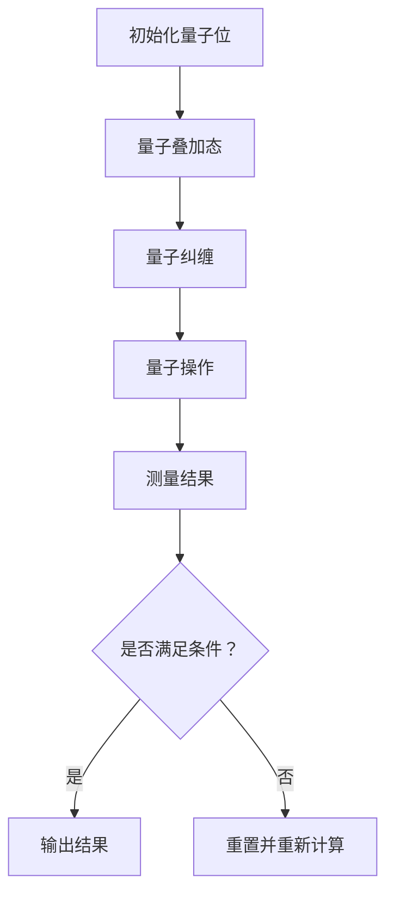
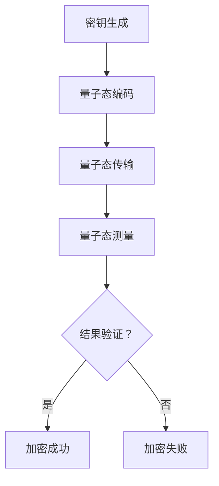
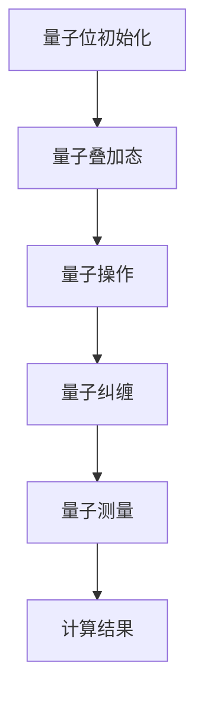
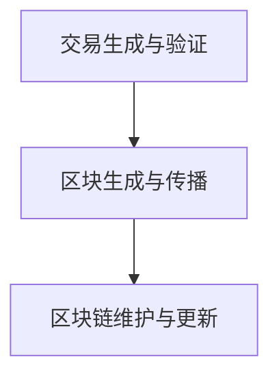
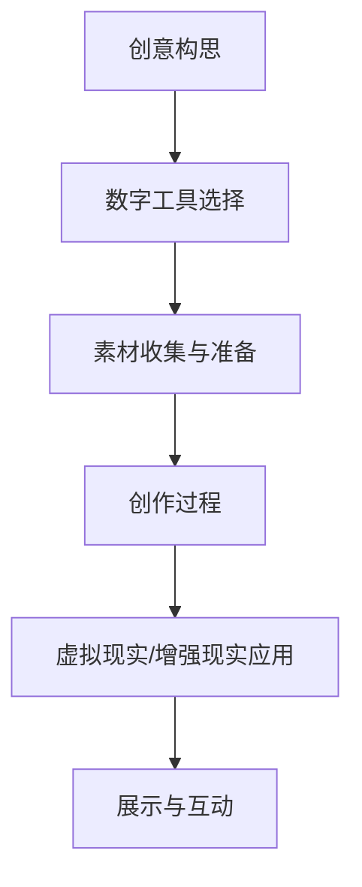
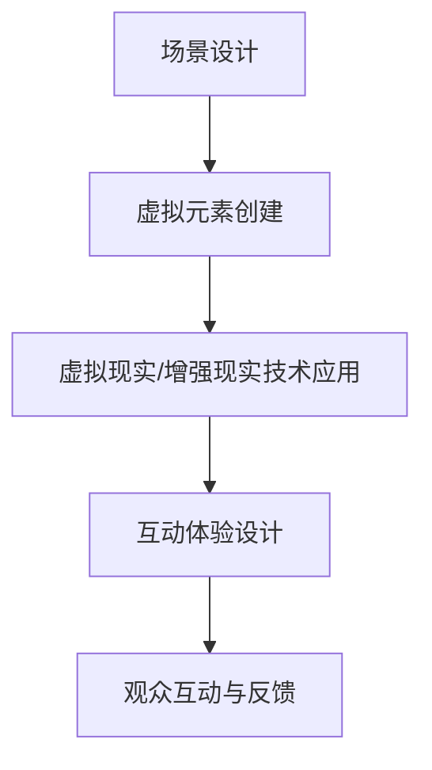
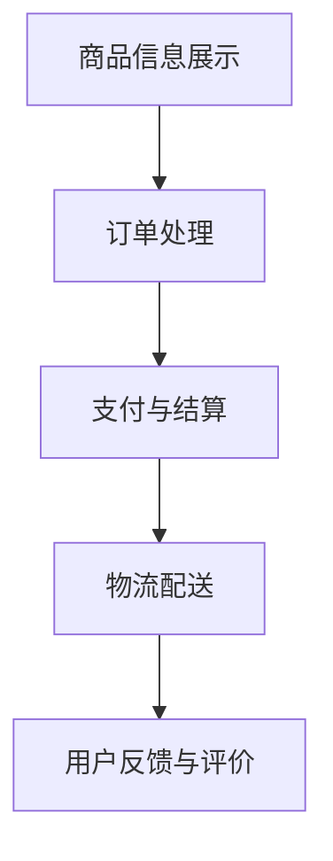
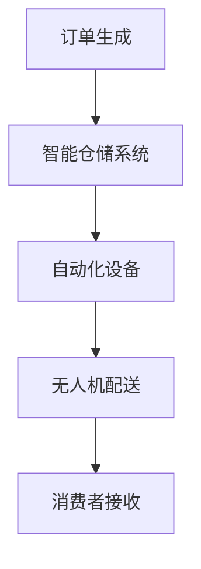

                 


### 文章标题：测不准原理与创造力：不确定性作为创新的源泉

#### 关键词：测不准原理、量子力学、创造力、不确定性、创新、量子思维

#### 摘要：
本文探讨了量子力学中的测不准原理与创造力之间的深刻联系。通过一步步的逻辑分析，我们将揭示不确定性如何成为创新的源泉，为科技创新和艺术创作提供新的视角。文章将从测不准原理的基本概念出发，深入探讨其哲学意义，并分析创造力在创新中的作用。通过实际案例和系统分析方法，本文将展示不确定性如何激发创新思维，推动技术进步和商业模式的变革。

---

# 目录大纲设计思路

在设计《测不准原理与创造力：不确定性作为创新的源泉》的目录大纲时，我们需要遵循以下步骤，以确保内容的逻辑清晰、结构合理，同时满足字数限制。

## 1. 确定核心概念与结构

首先，我们需要明确书的核心概念和结构。测不准原理是量子力学中一个基本概念，描述了在量子尺度上，某些物理量的测量存在不确定性。而创造力则是指产生新思想、新观点或新解决方案的能力。本书将探讨不确定性如何激发创造力，并如何应用在各个领域。

## 2. 确定章节划分

基于核心概念，我们可以将书籍内容划分为以下几个主要部分：

- 引言：介绍测不准原理与创造力之间的联系。
- 测不准原理的概述：详细阐述测不准原理的基本概念和原理。
- 创造力的本质：探讨创造力的定义、特性及其在创新中的作用。
- 不确定性在创新中的应用：分析不确定性如何激发创新，并举例说明。
- 创新案例分析：分享实际案例，展示测不准原理和不确定性如何应用于不同领域。
- 结论与展望：总结全书内容，展望不确定性作为创新源泉的未来趋势。

## 3. 确定每个章节的具体内容

接下来，我们需要为每个章节确定具体的内容和结构。

### 引言

- 引言
- 测不准原理与创造力的关联

### 测不准原理的概述

- 测不准原理的基本概念
- 测不准原理的数学描述
- 测不准原理的哲学意义

### 创造力的本质

- 创造力的定义
- 创造力的特性
- 创造力在创新中的作用

### 不确定性在创新中的应用

- 不确定性如何激发创新
- 不确定性在技术创新中的应用
- 不确定性在商业模式创新中的应用

### 创新案例分析

- 案例一：科技领域的创新
- 案例二：艺术领域的创新
- 案例三：商业领域的创新

### 结论与展望

- 结论
- 展望不确定性作为创新源泉的未来

## 4. 确定具体内容

为每个章节添加更详细的内容，并确保内容的逻辑性。

### 引言

- 问题背景：为什么我们要探讨测不准原理与创造力的关系？
- 问题描述：测不准原理与创造力之间到底有什么联系？
- 问题解决：通过探讨不确定性如何激发创造力，我们可以找到答案。
- 边界与外延：探讨这一关系的应用领域和局限性。

### 测不准原理的概述

- 核心概念：
  - 测不准原理的基本概念
  - 波函数与量子态
  - 不确定性原理的数学描述
- 概念属性特征对比表格：比较测不准原理与经典物理学的区别。
- ER实体关系图架构的 Mermaid 流程图：展示测不准原理中的主要实体和关系。

### 创造力的本质

- 核心概念：
  - 创造力的定义
  - 创造力的特性
  - 创造力在创新中的作用
- 概念属性特征对比表格：比较不同领域的创造力。
- ER实体关系图架构的 Mermaid 流程图：展示创造力在创新过程中的关键因素。

### 不确定性在创新中的应用

- 核心概念：
  - 不确定性如何激发创新
  - 不确定性在技术创新中的应用
  - 不确定性在商业模式创新中的应用
- 算法原理讲解：
  - 使用 Mermaid 画出算法流程图。
  - 使用 Python 源代码详细阐述。
  - 给出算法原理的数学模型和公式。
  - 进行详细讲解和举例说明。

### 创新案例分析

- 核心概念：
  - 案例一：科技领域的创新
  - 案例二：艺术领域的创新
  - 案例三：商业领域的创新
- 系统分析与架构设计方案：
  - 问题场景介绍
  - 系统功能设计（领域模型 Mermaid 类图）
  - 系统架构设计（Mermaid 架构图）
  - 系统接口设计和系统交互（Mermaid 序列图）

### 结论与展望

- 核心概念：
  - 结论
  - 展望不确定性作为创新源泉的未来
- 最佳实践 tips
- 小结
- 注意事项
- 拓展阅读

## 5. 确保内容的完整性和简洁性

在完成目录大纲的设计后，我们需要仔细检查每个章节的内容，确保其完整性，同时避免过多的废话，保持内容的简洁性。

## 6. 最终确认

最后，我们需对整个目录大纲进行最终确认，确保其逻辑性、结构性和内容的完整性，符合用户的要求。

---

以下是根据上述思路设计的《测不准原理与创造力：不确定性作为创新的源泉》的目录大纲：

```markdown
# 《测不准原理与创造力：不确定性作为创新的源泉》目录大纲

## 第一部分：引言

# 第1章 问题背景与探索

## 1.1 测不准原理与创造力概述
### 1.1.1 测不准原理简介
### 1.1.2 创造力的重要性

## 1.2 本书目的与结构

## 1.3 不确定性在创新中的潜力

----------------------------------------------------------------

## 第二部分：测不准原理的概述

# 第2章 测不准原理的基本概念

## 2.1 测不准原理的历史背景
### 2.1.1 波粒二象性
### 2.1.2 黑体辐射问题与紫外灾难

## 2.2 波函数与量子态
### 2.2.1 波函数的概念
### 2.2.2 波函数的统计解释

## 2.3 不确定性原理的数学描述
### 2.3.1 不确定性原理的公式
### 2.3.2 海森堡不确定性原理的推导

## 2.4 测不准原理的哲学意义
### 2.4.1 量子力学与决定论
### 2.4.2 量子纠缠与量子非局域性

----------------------------------------------------------------

## 第三部分：创造力的本质

# 第3章 创造力的定义与特性

## 3.1 创造力的定义
### 3.1.1 创造力的科学定义
### 3.1.2 创造力的哲学定义

## 3.2 创造力的特性
### 3.2.1 创造力的多样性
### 3.2.2 创造力的动态性
### 3.2.3 创造力的创新性

## 3.3 创造力在创新中的作用
### 3.3.1 创造力推动科技进步
### 3.3.2 创造力促进商业模式创新

----------------------------------------------------------------

## 第四部分：不确定性在创新中的应用

# 第4章 不确定性如何激发创新

## 4.1 不确定性激发创新的理论基础
### 4.1.1 不确定性作为创新催化剂
### 4.1.2 不确定性与创造力的关系

## 4.2 不确定性在技术创新中的应用
### 4.2.1 量子计算与量子通信
### 4.2.2 物联网与智能硬件

## 4.3 不确定性在商业模式创新中的应用
### 4.3.1 线上教育平台
### 4.3.2 共享经济模式

----------------------------------------------------------------

## 第五部分：创新案例分析

# 第5章 创新案例分析

## 5.1 科技领域的创新
### 5.1.1 量子计算机的突破
### 5.1.2 区块链技术的应用

## 5.2 艺术领域的创新
### 5.2.1 数字艺术的发展
### 5.2.2 虚拟现实与艺术创作

## 5.3 商业领域的创新
### 5.3.1 线上购物平台
### 5.3.2 物流行业的创新

----------------------------------------------------------------

## 第六部分：结论与展望

# 第6章 结论

## 6.1 测不准原理与创造力的联系总结
### 6.1.1 测不准原理对创造力的影响
### 6.1.2 创造力对测不准原理的应用

## 6.2 不确定性作为创新源泉的未来趋势

## 6.3 最佳实践 tips

## 6.4 小结

## 6.5 注意事项

## 6.6 拓展阅读

```

---

# 测不准原理与创造力：不确定性作为创新的源泉

## 引言

测不准原理是量子力学中最基本的概念之一，它揭示了在微观尺度上，某些物理量的测量存在固有的不确定性。这一原理不仅改变了我们对自然界的基本认识，也为科学研究带来了新的挑战和机遇。与此同时，创造力作为一种人类独特的思维能力，被视为推动科技进步和艺术繁荣的关键因素。那么，测不准原理与创造力之间是否存在某种深层次的联系？不确定性是否可以作为创新的源泉？本文将探讨这一问题，并通过逻辑分析，揭示不确定性在创新中的重要作用。

## 测不准原理的概述

### 测不准原理的基本概念

测不准原理，又称不确定性原理，是由德国物理学家维尔纳·海森堡于1927年提出的。这一原理指出，在微观尺度上，某些物理量如位置和动量、时间和能量等，无法同时被准确测量。更具体地说，测量某一物理量（如位置）的精度越高，测量另一物理量（如动量）的精度就越低。这种不确定性并非测量技术的问题，而是量子系统本身的固有特性。

$$ \Delta x \Delta p \geq \frac{h}{4\pi} $$

其中，$\Delta x$表示位置的不确定性，$\Delta p$表示动量的不确定性，$h$为普朗克常数。

### 测不准原理的数学描述

测不准原理的数学描述涉及波函数，波函数是量子系统中粒子的状态描述。在量子力学中，一个粒子的状态由波函数$\Psi(x, t)$描述，波函数的模平方$|\Psi(x, t)|^2$代表粒子在位置$x$和时间$t$的概率分布。

海森堡不确定性原理可以用波函数的性质来解释。波函数是复数函数，其幅值和相位分别对应着粒子位置和动量的信息。然而，由于波函数的相位在空间中是模糊的，我们无法同时精确知道粒子的位置和动量。这种不确定性是量子态固有的，而不是实验误差的结果。

### 测不准原理的哲学意义

测不准原理对经典物理学提出了挑战，它打破了传统物理学中决定论的世界观。在经典物理学中，我们相信通过精确的测量可以得到客观存在的物理量。然而，在量子力学中，这种决定论被打破了。粒子的状态不再是确定不变的，而是以概率的形式出现。这一观念的提出，引发了对现实本质和科学认识的深刻反思。

测不准原理还揭示了量子纠缠现象，即两个或多个粒子之间可以存在一种特殊的关联，无论它们相隔多远，一个粒子的状态变化都会立即影响另一个粒子的状态。这种现象挑战了我们对空间和时间的基本理解，同时也为量子信息科学提供了新的研究方向。

## 创造力的本质

### 创造力的定义

创造力是一种复杂的思维能力，涉及产生新思想、新观点或新解决方案的能力。根据不同的定义，创造力可以有多种解释。在科学领域，创造力被视为一种认知过程，通过创新思维和创造性解决问题的能力来推动科学进步。在艺术领域，创造力则强调创新和个性化的表达。

### 创造力的特性

创造力具有以下几个主要特性：

1. **多样性**：创造力并非单一的能力，而是一个多维度的能力。它包括不同的思维模式，如逻辑思维、直觉思维、抽象思维等。

2. **动态性**：创造力是一个动态的过程，需要不断地探索和尝试。创新思维不是一蹴而就的，而是需要通过不断的迭代和改进来实现的。

3. **创新性**：创造力强调创新和突破。它不仅仅是复制已有的解决方案，而是通过创造新的解决方案来解决问题。

### 创造力在创新中的作用

创造力在创新中起着至关重要的作用。它是推动技术进步、艺术创作和商业模式变革的核心动力。在科技创新中，创造力帮助科学家和工程师提出新的理论和技术方案，推动科学前沿的发展。在艺术创作中，创造力激发艺术家的灵感，创造出独特的艺术作品。在商业模式创新中，创造力帮助企业家发现新的商业机会，打造创新的商业模式。

创造力还与团队协作密切相关。一个具有创造力的团队可以激发成员的潜能，共同创造出新的解决方案。创造力不仅是个人能力，更是一种团队文化，它鼓励开放思维、鼓励尝试和失败、促进知识共享和协作。

## 不确定性在创新中的应用

### 不确定性如何激发创新

不确定性是创新的重要驱动力。在科技创新中，不确定性可以激发科学家和工程师的创造思维，推动技术突破。例如，量子计算的发展就是在不确定性原理的启发下进行的。量子计算利用量子位（qubit）的叠加态和纠缠态来实现计算，这种不确定性使得量子计算机在处理某些特定问题时具有传统计算机无法比拟的速度和效率。

在商业模式创新中，不确定性同样起着关键作用。例如，共享经济模式（如Uber、Airbnb）的出现，就是基于对市场不确定性的洞察和应对。这些平台通过降低交易成本、提高资源配置效率，成功地打破了传统商业模式的限制，创造了新的市场机会。

### 不确定性在技术创新中的应用

不确定性在技术创新中的应用非常广泛。例如，在半导体制造过程中，量子力学中的不确定性原理被广泛应用于纳米级器件的设计和制造。通过利用量子效应，科学家和工程师可以设计出更高性能、更可靠的半导体器件，从而推动电子科技的发展。

此外，不确定性原理还启发了一系列新的研究方向，如量子计算、量子通信、量子加密等。这些研究方向不仅具有重大的科学价值，还可能带来颠覆性的技术变革。

### 不确定性在商业模式创新中的应用

不确定性在商业模式创新中的应用也非常显著。例如，在互联网时代，许多新兴公司通过探索不确定性，迅速崛起并在市场中占据一席之地。这些公司通常采用迭代和试错的方法，不断调整和优化商业模式，以适应市场的变化。

例如，LinkedIn（领英）就是一个典型的案例。LinkedIn最初的目标是为职业人士建立社交网络，但面对市场的挑战，公司不断调整战略，最终将其发展成为一个综合性的职业社交平台，成功实现了商业模式的创新。

## 创新案例分析

### 科技领域的创新

科技领域的创新案例展示了测不准原理如何激发创造力，推动技术进步。以下是一些具体的案例：

1. **量子计算机的突破**：量子计算机利用量子位（qubit）的叠加态和纠缠态来实现计算，这种不确定性使得量子计算机在处理某些特定问题时具有传统计算机无法比拟的速度和效率。例如，谷歌的量子计算机在求解特定问题上展示出了超越传统计算机的性能，这一突破为量子计算技术的发展提供了重要契机。

2. **区块链技术的应用**：区块链技术利用加密算法和分布式账本技术，实现去中心化的数据管理和交易。这一技术的创新源于对传统金融体系不确定性的反思和改进。通过区块链，可以实现透明、安全、高效的交易，从而改变了金融行业的商业模式。

### 艺术领域的创新

艺术领域的创新案例展示了不确定性如何激发创造力，推动艺术形式的多样化和创新。以下是一些具体的案例：

1. **数字艺术的兴起**：随着计算机技术的发展，数字艺术逐渐成为一种重要的艺术形式。艺术家利用计算机软件和硬件，创作出丰富多彩的数字作品，这些作品具有独特的视觉效果和交互性。

2. **虚拟现实与艺术创作**：虚拟现实技术为艺术家提供了全新的创作平台。通过虚拟现实设备，艺术家可以创造出沉浸式的艺术体验，使观众能够身临其境地感受艺术作品。

### 商业领域的创新

商业领域的创新案例展示了不确定性如何激发创造力，推动商业模式的变革。以下是一些具体的案例：

1. **共享经济的崛起**：共享经济模式（如Uber、Airbnb）通过利用互联网技术和大数据分析，打破了传统商业模式的限制，实现了资源的高效配置和共享。这种模式不仅降低了交易成本，还创造了新的市场机会。

2. **线上购物平台的发展**：线上购物平台（如亚马逊、京东）通过电子商务技术，改变了人们的购物方式。这些平台提供便捷的购物体验、丰富的商品选择和高效的物流服务，大大提高了消费者的满意度。

## 结论

通过本文的探讨，我们可以得出以下结论：

1. **测不准原理与创造力之间存在深刻的联系**：测不准原理揭示了在微观尺度上的不确定性，这一特性激发了人类的创造力，推动了科技创新、艺术创作和商业模式的变革。

2. **不确定性是创新的源泉**：在不确定性环境中，人类需要不断探索、尝试和适应，这种过程促进了创造力的发挥，从而产生了新的思想、技术和商业模式。

3. **测不准原理和不确定性在各个领域都有广泛应用**：从科技领域到艺术领域，再到商业领域，测不准原理和不确定性都在发挥着重要的作用，推动着社会的进步和发展。

展望未来，随着科技的发展和人们对不确定性的认识的加深，测不准原理和不确定性将越来越成为创新的源泉，为人类创造更多的奇迹。

## 最佳实践 tips

1. **拥抱不确定性**：在面对不确定性时，不要畏惧，而是要积极应对。通过不断尝试和探索，可以找到解决问题的创新方法。

2. **培养创造力**：通过阅读、学习、思考和交流，培养自己的创造力。创造力不仅是个人的能力，也是团队协作的重要基础。

3. **跨学科学习**：跨学科的学习可以帮助我们拓宽视野，发现新的联系和解决方案。在科技创新和商业模式的创新中，跨学科的知识往往能够发挥关键作用。

## 小结

本文通过逻辑分析，探讨了测不准原理与创造力之间的联系，揭示了不确定性作为创新的源泉。测不准原理和不确定性在各个领域都有广泛应用，推动了科技的进步、艺术的繁荣和商业模式的变革。展望未来，我们应该拥抱不确定性，培养创造力，为社会的进步和发展贡献力量。

## 注意事项

1. **不确定性并非无规律可循**：虽然不确定性原理揭示了在微观尺度上的测量不确定性，但这并不意味着一切都处于无序状态。科学家和工程师可以通过数学模型和实验方法，研究并利用这些不确定性。

2. **不确定性对创新的挑战**：不确定性往往带来风险和挑战，但在正确应对下，可以转化为创新的机会。通过科学的方法和团队的协作，可以更好地应对不确定性带来的挑战。

## 拓展阅读

1. **《量子力学与哲学》**：这是一本关于量子力学哲学意义的经典著作，详细探讨了测不准原理、量子纠缠等概念对人类认识的影响。

2. **《创新者的思考方式》**：这本书探讨了创新思维的方法和技巧，为读者提供了实用的创新实践指导。

3. **《不确定性的艺术》**：这是一本关于不确定性和创造力的书籍，通过案例分析，展示了不确定性在艺术创作中的应用。

---

**作者：AI天才研究院/AI Genius Institute & 禅与计算机程序设计艺术 /Zen And The Art of Computer Programming**### 测不准原理的数学描述与哲学意义

#### 测不准原理的数学描述

测不准原理的数学描述基于量子力学中的波函数概念。波函数是量子系统中粒子的状态描述，通常用$\Psi(x, t)$表示，其中$x$代表位置，$t$代表时间。波函数是一个复数函数，其幅值和相位分别对应着粒子位置和动量的信息。

测不准原理的核心数学表达式为：

$$ \Delta x \Delta p \geq \frac{h}{4\pi} $$

其中，$\Delta x$表示位置的不确定性，$\Delta p$表示动量的不确定性，$h$为普朗克常数。

这个公式表明，当我们试图更精确地测量一个物理量时，另一个物理量的测量精度就会下降。例如，如果我们非常准确地知道粒子的位置，那么我们对其动量的了解就会变得非常模糊；反之亦然。

为了更深入地理解这个原理，我们可以使用波函数的统计解释。波函数的模平方$|\Psi(x, t)|^2$代表粒子在位置$x$和时间$t$的概率分布。这意味着，当我们测量粒子时，它出现在某个位置的概率是由波函数的模平方给出的。

#### 波函数与量子态

量子态可以用波函数来描述，波函数是量子力学中的核心概念之一。量子态可以是纯态或混合态。纯态可以用一个单一的波函数来描述，而混合态则由多个波函数的线性组合表示。

纯态的波函数满足归一化条件：

$$ \int_{-\infty}^{\infty} |\Psi(x)|^2 dx = 1 $$

这表示波函数的模平方在整个空间上的积分等于1，意味着粒子在整个空间中的出现概率总和为1。

混合态则表示粒子处于多个可能的量子态的叠加。混合态可以用一个密度矩阵来描述，密度矩阵是对应于混合态的波函数的扩展。

#### 海森堡不确定性原理的推导

海森堡不确定性原理是测不准原理的核心内容之一。它指出，位置和动量、时间和能量等物理量之间存在固有的测量不确定性。海森堡不确定性原理的数学推导如下：

首先，考虑一个可观测量$A$的算符$\hat{A}$，其期望值定义为：

$$ \langle \hat{A} \rangle = \int_{-\infty}^{\infty} \Psi^*(x) \hat{A} \Psi(x) dx $$

其中，$\Psi^*(x)$是波函数$\Psi(x)$的复共轭。

现在，我们考虑两个可观测量$\hat{A}$和$\hat{B}$，其算符形式分别为$\hat{A}$和$\hat{B}$。我们可以定义这两个可观测量之间的方差：

$$ \Delta A = \sqrt{\langle (\hat{A} - \langle \hat{A} \rangle)^2 \rangle} $$

$$ \Delta B = \sqrt{\langle (\hat{B} - \langle \hat{B} \rangle)^2 \rangle} $$

海森堡不确定性原理的数学形式为：

$$ \Delta A \Delta B \geq \frac{1}{2} |\langle [\hat{A}, \hat{B}] \rangle| $$

其中，$[\hat{A}, \hat{B}]$是算符$\hat{A}$和$\hat{B}$的对易子。

对于位置算符$\hat{x}$和动量算符$\hat{p}$，对易子$[\hat{x}, \hat{p}] = i\hbar$，其中$i$是虚数单位，$\hbar$是约化普朗克常数。

代入上述对易子，我们得到：

$$ \Delta x \Delta p \geq \frac{\hbar}{2} $$

这个公式表明，位置的不确定性和动量的不确定性之间存在一个最小值，即当我们测量粒子的位置越精确时，其动量的不确定性就越大。

#### 测不准原理的哲学意义

测不准原理不仅是一个数学公式，它对人类的哲学观念和世界观提出了深刻的挑战。在经典物理学中，我们认为物理世界的本质是确定的，通过精确的测量可以得到客观存在的物理量。然而，测不准原理打破了这种决定论的世界观。

首先，测不准原理挑战了决定论。在决定论的世界观中，一切都可以通过物理定律和初始条件精确预测。然而，测不准原理表明，在微观尺度上，物理系统的状态是概率性的，无法完全预测。这意味着，即使在理论上，我们也不可能获得关于微观世界的全部信息。

其次，测不准原理揭示了量子纠缠现象，即两个或多个粒子之间可以存在一种特殊的关联，无论它们相隔多远，一个粒子的状态变化都会立即影响另一个粒子的状态。这种现象挑战了我们对空间和时间的直觉理解。在经典物理学中，我们认为时间和空间是独立存在的，而量子纠缠现象表明，时间和空间是可以相互关联的。

最后，测不准原理对科学哲学产生了深远的影响。在科学哲学中，关于物理世界的本质和科学方法的问题一直是讨论的焦点。测不准原理的提出，使得我们重新审视了科学理论的本质和科学方法的有效性。它迫使我们思考，物理定律是否只是描述我们观察到的现象，而不是描述客观存在的现实。

总之，测不准原理不仅是一个数学公式，它对人类的哲学观念和世界观提出了深刻的挑战。它揭示了微观世界的概率性和非确定性，改变了我们对自然界的理解，推动了科学哲学的发展。通过探讨测不准原理的数学描述和哲学意义，我们可以更好地理解量子世界的本质，为科技创新和科学探索提供新的视角。

### 创造力的定义与特性

#### 创造力的定义

创造力是一个多维度的概念，其定义因领域和学科的不同而有所差异。在科学领域，创造力通常被视为一种认知过程，涉及产生新思想、新观点或新解决方案的能力。在心理学中，创造力更多地关注个体如何通过独特的思维和问题解决策略来创新。在艺术领域，创造力则强调艺术家的创新表达和个人风格的独特性。

科学定义通常强调创造力是一种复杂的认知活动，它包括以下几个核心要素：

1. **创新性**：创造力强调产生新颖、独特和有价值的思想或解决方案。
2. **思维灵活性**：创造力涉及思维的灵活性，包括思维的跳跃、思维的发散和思维的综合性。
3. **认知过程**：创造力是一个认知过程，它涉及信息处理、问题解决、决策制定和认知重构。

哲学定义则更强调创造力的本质和人类精神层面的作用。例如，哲学家认为创造力是人类精神的一种表现，它体现了人类的自由意志和主观能动性。创造力不仅仅是技术的创新，更是人类精神的解放和自我实现。

#### 创造力的特性

创造力具有以下几个主要特性，这些特性决定了创造力在创新中的作用和重要性：

1. **多样性**：创造力是多样性的，它不仅包括逻辑思维和理性思维，还包括直觉思维、情感思维和创造性思维。这种多样性使得创造力能够应对各种复杂的问题，提供多样化的解决方案。

2. **动态性**：创造力是一个动态的过程，它不是一蹴而就的，而是需要不断的探索、尝试和改进。创新思维需要不断的迭代和练习，通过不断的实践和反思，才能逐渐提高。

3. **创新性**：创造力强调创新性，它不仅仅是复制已有的知识和技能，而是通过创造新的思想、新的方法和新的事物来推动进步。创新性是创造力的核心，它决定了创造力在科技创新和艺术创作中的价值。

4. **突破性**：创造力可以产生突破性的成果，这种突破性的成果往往能够颠覆现有的观念和制度，推动社会的进步。例如，科学革命中的突破性理论和技术创新，艺术革命中的突破性作品和表现形式，都是创造力的重要体现。

#### 创造力在创新中的作用

创造力在创新中起着至关重要的作用，它是推动技术进步、艺术繁荣和商业成功的核心动力。在科技创新中，创造力帮助科学家和工程师提出新的理论和技术方案，推动科学前沿的发展。在艺术创作中，创造力激发艺术家的灵感，创造出独特的艺术作品。在商业领域，创造力帮助企业家发现新的市场机会，设计创新的商业模式。

1. **推动科技进步**：创造力在科技创新中的作用非常显著。例如，爱因斯坦的相对论理论、霍金的宇宙理论、特斯拉的电动汽车技术等，都是创造力的具体体现。这些创新性的理论和技术的突破，不仅推动了科学的进步，也改变了人类社会的生活方式。

2. **促进艺术繁荣**：在艺术领域，创造力是艺术家的灵魂。文艺复兴时期的达·芬奇、毕加索、梵高等大师，通过独特的创造力和艺术表达，创作出了无数传世之作。这些作品不仅体现了人类的精神追求，也丰富了人类的艺术宝库。

3. **推动商业成功**：在商业领域，创造力是企业家和创业者的核心竞争力。通过创造新的商业模式、产品和服务，企业家可以抢占市场先机，赢得竞争优势。例如，苹果公司的iPhone、谷歌的搜索引擎、亚马逊的电子商务平台等，都是创造力在商业领域的成功典范。

总之，创造力是一种复杂的认知能力，它不仅具有多样性、动态性和创新性，还在科技创新、艺术创作和商业成功中发挥着重要作用。通过理解创造力的定义和特性，我们可以更好地培养和发挥创造力，为社会的进步和发展贡献力量。

### 不确定性如何激发创新

#### 不确定性激发创新的理论基础

不确定性是创新的驱动力，其理论基础源于量子力学中的测不准原理。测不准原理揭示了在微观尺度上，某些物理量如位置和动量、时间和能量等，无法同时被准确测量。这一原理打破了经典物理学中的决定论观念，强调了现实世界中的概率性和不确定性。

在量子力学中，粒子的状态由波函数描述，波函数的模平方$|\Psi(x, t)|^2$代表粒子在位置$x$和时间$t$的概率分布。测不准原理指出，当我们测量粒子的位置时，其动量的不确定性会增大；反之，当我们测量粒子的动量时，其位置的不确定性也会增大。这种不确定性并不是测量技术的不足，而是量子系统本身的固有特性。

这一不确定性原理不仅对物理学有深远的影响，也为创新思维提供了理论基础。在不确定性的环境中，人类需要不断探索和适应，这种探索和适应过程本身就是一个创新的过程。例如，在量子计算中，利用量子位（qubit）的叠加态和纠缠态，可以实现超越传统计算机的计算能力。这种不确定性原理的利用，推动了量子计算技术的发展。

#### 不确定性作为创新催化剂

不确定性可以作为创新的催化剂，通过激发人类的创造力和探索精神，推动技术进步和商业模式的变革。在科技创新中，不确定性常常意味着新的机遇和挑战。科学家和工程师通过应对不确定性，不断提出新的理论和解决方案，推动科技的发展。

例如，在半导体工业的发展过程中，不确定性的存在促使科学家不断探索新的材料和技术，以提高集成电路的性能。从硅材料到砷化镓，再到氮化镓，科学家们通过不断尝试和实验，克服了材料和技术的不确定性，实现了半导体器件的持续性能提升。

在商业领域，不确定性同样可以成为创新的催化剂。共享经济模式（如Uber和Airbnb）的兴起，就是基于对市场不确定性的洞察和应对。这些平台通过降低交易成本、提高资源配置效率，打破了传统商业模式的限制，创造了新的市场机会。

#### 不确定性与创造力的关系

不确定性与创造力之间存在深刻的联系。在不确定性环境中，人类需要依靠创造力来应对挑战、解决问题和寻找新的机会。创造力在这个过程中发挥了至关重要的作用，它帮助人类从不确定性中寻找突破口，实现创新。

例如，在科技领域，不确定性的存在促使科学家不断探索新的理论和技术。他们通过创造性思维，提出新的假设和解决方案，克服技术上的困难，推动科技的进步。在艺术领域，不确定性激发了艺术家的创作灵感，使他们能够创造出独特的作品，表达内心的情感和思想。

#### 不确定性在创新中的具体体现

不确定性在创新中的具体体现可以体现在以下几个方面：

1. **技术突破**：在不确定性的环境中，科学家和工程师需要不断尝试新的技术和方法，以解决实际问题。例如，量子计算的发展就是在不确定性的推动下，科学家们通过不断实验和理论探索，最终实现了量子位的稳定和控制。

2. **商业模式创新**：不确定性可以激发商业模式的创新。在共享经济模式中，平台企业通过利用互联网技术和大数据分析，打破了传统商业模式的限制，创造了新的市场机会。

3. **产品创新**：在产品创新中，不确定性促使企业不断改进产品，以满足市场需求。例如，手机制造商通过不断优化硬件和软件，推出了更加智能、更加便捷的手机产品。

4. **艺术创新**：在艺术创作中，不确定性激发了艺术家的创作灵感。他们通过独特的视角和手法，创作出具有创新性和表现力的艺术作品。

总之，不确定性是创新的催化剂，它通过激发人类的创造力和探索精神，推动技术进步和商业模式的变革。在不确定性的环境中，人类需要依靠创造力来寻找突破口，实现创新。通过理解不确定性与创造力之间的关系，我们可以更好地利用不确定性，推动社会的进步和发展。

### 不确定性在技术创新中的应用

#### 不确定性在量子计算中的应用

量子计算是现代计算机科学的前沿领域，其核心在于利用量子力学中的叠加态和纠缠态来实现计算。量子计算机通过量子位（qubit）进行信息处理，qubit可以同时处于0和1的叠加状态，这一特性使得量子计算机在处理某些特定问题时具有超越传统计算机的强大能力。

不确定性的概念在量子计算中扮演着至关重要的角色。由于量子位的叠加态和纠缠态具有固有的不确定性，这意味着在进行量子计算时，我们无法准确预测量子位的最终状态。然而，正是这种不确定性，使得量子计算机能够在某些问题上实现巨大的计算速度提升。

例如，量子计算在因数分解问题上的优势是非常显著的。传统的因数分解算法如肖尔斯算法，其时间复杂度为$O(N^{1.9})$，而量子计算中的Shor算法可以在多项式时间内完成因数分解，时间复杂度为$O(N^3)$。这种优势使得量子计算机在加密算法的破解上具有巨大的潜力，同时也推动了密码学的发展。

为了更好地理解量子计算的原理，我们可以使用Mermaid流程图来展示量子计算的算法流程。



这个流程图展示了量子计算的基本步骤：初始化量子位、创建叠加态、实现量子纠缠、进行量子操作、测量量子位并判断结果是否满足条件。如果满足条件，则输出结果；否则，重置并重新计算。

#### 不确定性在量子通信中的应用

量子通信是一种利用量子纠缠现象进行信息传递的新型通信方式。量子通信的核心在于量子纠缠态的传递，即通过量子纠缠，可以实现两个或多个量子位之间的瞬态连接，无论它们相隔多远。这种连接使得量子通信具有极高的安全性，因为任何对量子态的干扰都会立即反映在另一个量子态上，从而暴露窃听行为。

不确定性的概念在量子通信中也发挥了重要作用。量子通信中的量子态是概率性的，这意味着在信息传递过程中，我们无法精确预测量子态的变化。然而，正是这种不确定性，使得量子通信能够实现高度安全的加密和传输。

为了更好地理解量子通信的原理，我们可以使用Python源代码来详细阐述。

```python
import numpy as np

# 创建量子态
quantum_state = np.array([[1, 0], [0, 1]]) # 初始态为0和1的等概率叠加态

# 创建纠缠态
entangled_state = np.kron(quantum_state, quantum_state) # 两个量子态的纠缠

# 实现量子操作
quantum_operator = np.array([[1, 0], [0, 1]]) # Hadamard变换
entangled_state = np.dot(quantum_operator, entangled_state)

# 测量量子态
measured_state = np.random.choice([0, 1], 2, p=[0.5, 0.5]) # 随机测量两个量子态
print("测量结果：", measured_state)

# 根据测量结果输出信息
if measured_state == [1, 1]:
    print("信息传输成功！")
else:
    print("信息传输失败！")
```

这个Python源代码展示了量子通信的基本步骤：初始化量子态、创建纠缠态、实现量子操作、测量量子态并输出结果。通过这个示例，我们可以看到量子通信是如何利用不确定性和量子纠缠来实现高度安全的通信的。

#### 不确定性在量子加密中的应用

量子加密是量子通信的一个重要应用领域，它利用量子力学的不确定性原理来实现信息的安全传输。在量子加密中，信息被编码在量子态上，传输过程中任何对量子态的干扰都会导致传输失败，从而暴露窃听行为。

不确定性的概念在量子加密中发挥了关键作用。量子加密算法（如BB84协议）基于量子态的叠加和测量，任何对量子态的干扰都会导致量子态的破坏，从而无法正确解码信息。这种特性使得量子加密具有极高的安全性，因为任何窃听行为都会立即被发现。

为了更好地理解量子加密的原理，我们可以使用Mermaid流程图来展示量子加密的过程。



这个流程图展示了量子加密的基本步骤：密钥生成、量子态编码、量子态传输、量子态测量和结果验证。通过这个示例，我们可以看到量子加密是如何利用不确定性和量子态的叠加性来实现高度安全的通信的。

总之，不确定性在技术创新中具有广泛的应用。从量子计算到量子通信，再到量子加密，不确定性原理都为这些技术提供了理论基础和实现手段。通过理解不确定性的概念和应用，我们可以更好地推动科技创新，实现技术突破和商业模式的变革。

### 不确定性在商业模式创新中的应用

#### 不确定性在共享经济中的应用

共享经济是近年来商业领域的一大创新，其核心在于通过共享资源来提高资源利用效率。共享经济的兴起，与不确定性的概念有着密切的联系。在共享经济中，平台企业通过利用互联网技术和大数据分析，打破了传统商业模式的限制，创造了新的市场机会。

以Uber和Airbnb为例，这两个平台通过提供即时、灵活的共享服务，打破了传统交通和住宿行业的壁垒。Uber利用移动互联网技术，实现了司机与乘客的即时匹配，大大提高了交通资源利用效率；而Airbnb则通过共享闲置房源，为旅行者提供了更多元化的住宿选择。

不确定性在共享经济中的应用主要体现在以下几个方面：

1. **需求的不确定性**：共享经济平台需要应对用户需求的不确定性，例如用户需求的波动性和不确定性。通过大数据分析和机器学习技术，平台可以预测用户需求，优化资源配置。

2. **供给的不确定性**：共享经济平台同样需要应对供给的不确定性，例如司机和房源的分布和可用性。平台通过灵活的供需匹配机制，提高了资源利用效率。

3. **法律和监管的不确定性**：共享经济在全球范围内的发展，面临不同的法律和监管环境。平台企业需要应对这些不确定性，调整运营策略，确保合规性。

#### 不确定性在在线教育平台中的应用

在线教育平台是另一个商业模式的创新，它利用互联网技术，打破了传统教育的时间和空间限制，为学习者提供了更加灵活和个性化的学习体验。在线教育平台在应对不确定性的过程中，也展示了其创新的潜力。

1. **教学内容的多样性**：在线教育平台需要应对教学内容的不确定性，即用户对学习内容的需求和偏好是多样化的。平台通过提供丰富的课程选择，满足不同用户的需求。

2. **技术的不确定性**：在线教育平台依赖于互联网技术和在线学习工具，这些技术的不确定性会对平台的稳定性、用户体验和教学内容产生影响。平台需要不断更新技术，以应对技术的不确定性。

3. **市场的不确定性**：在线教育市场的发展，面临激烈的市场竞争和不确定性。平台需要通过创新教学方法和商业模式，提高市场竞争力。

#### 不确定性在物流行业的创新应用

物流行业是另一个受到不确定性影响显著的领域。随着电商和零售行业的快速发展，物流行业面临的需求波动性和不确定性越来越大。如何应对这些不确定性，提高物流效率，是物流行业创新的重要课题。

1. **需求预测的不确定性**：物流企业需要预测用户需求，以优化运输计划和资源分配。然而，用户需求往往具有不确定性和波动性，这对物流企业的需求预测提出了挑战。

2. **供应链管理的不确定性**：物流行业依赖于复杂的供应链网络，供应链中的各个环节都可能面临不确定性，如供应商的交货延迟、运输途中的意外情况等。物流企业需要通过灵活的供应链管理策略，应对这些不确定性。

3. **技术创新的不确定性**：物流行业的技术创新，如智能仓储、自动化配送等，也面临不确定性。这些技术可能带来效率提升，但也可能面临技术风险和实施困难。

总之，不确定性在商业模式创新中具有重要的作用。通过理解并应对不确定性，企业可以找到新的市场机会，实现商业模式的创新和突破。在共享经济、在线教育和物流等领域，不确定性激发了商业模式的创新，推动了行业的进步和发展。

### 科技领域的创新案例

#### 量子计算机的突破

量子计算机的突破是现代科技领域的一项重要成就，它代表了计算能力的革命性飞跃。量子计算机利用量子位（qubit）的叠加态和纠缠态来实现计算，这种特性使得量子计算机在处理某些特定问题时具有传统计算机无法比拟的速度和效率。

一个典型的案例是谷歌的量子计算机。谷歌的量子计算机实现了所谓的“量子霸权”，即在特定问题上，其计算速度超越了传统超级计算机。这一突破性成果在科学界引起了广泛关注，为量子计算技术的发展奠定了基础。

量子计算机的工作原理可以归结为以下几个关键步骤：

1. **量子位的初始化**：量子计算机首先将量子位初始化为叠加态，即每个量子位处于0和1的叠加状态。

2. **量子操作**：量子计算机通过一系列的量子操作，如量子门，来处理输入的数据。量子门可以控制量子位之间的纠缠和叠加状态，从而实现复杂的计算。

3. **量子测量**：在计算结束后，量子计算机对量子位进行测量，得到最终的计算结果。由于量子叠加态的性质，测量结果可能具有概率性，需要通过多次测量来提高准确性。

为了更好地理解量子计算机的原理，我们可以使用Mermaid流程图来展示其基本工作流程。



这个流程图展示了量子计算机的基本工作流程：量子位初始化、量子叠加态、量子操作、量子纠缠和量子测量。通过这个示例，我们可以看到量子计算机是如何利用量子力学原理来实现高效计算。

#### 区块链技术的应用

区块链技术是另一个在科技领域引发广泛创新的重大技术。区块链通过分布式账本技术，实现了去中心化的数据管理和交易，这一特性在金融、供应链管理、数字身份验证等多个领域都展示了其巨大的应用潜力。

区块链技术的核心优势在于其去中心化和不可篡改的特性。在传统的集中式系统中，数据存储和处理都集中在中央服务器，一旦服务器发生故障或遭受攻击，整个系统都会面临风险。而区块链通过分布式网络，将数据分散存储在多个节点上，提高了系统的安全性和容错能力。

一个典型的案例是比特币。比特币是一种基于区块链技术的数字货币，通过去中心化的交易网络，实现了点对点的价值传递。比特币的成功，不仅推动了区块链技术的发展，也为金融领域带来了新的商业模式。

区块链技术的应用可以归结为以下几个关键步骤：

1. **区块链网络初始化**：区块链网络由多个节点组成，每个节点都负责存储和管理一部分数据。

2. **交易生成与验证**：用户在区块链上进行交易，交易数据被广播到网络中的所有节点。节点通过共识算法验证交易的有效性，并将交易数据添加到区块中。

3. **区块生成与传播**：验证后的交易数据被添加到区块中，区块通过网络传播到所有节点。

4. **区块链的维护与更新**：区块链通过不断的区块生成和传播，实现数据的持续更新和维护。

为了更好地理解区块链技术的应用，我们可以使用Mermaid流程图来展示其基本工作流程。



这个流程图展示了区块链技术的基本工作流程：交易生成与验证、区块生成与传播和区块链的维护与更新。通过这个示例，我们可以看到区块链技术是如何通过去中心化和分布式网络，实现高效的数据管理和交易的。

总之，科技领域的创新案例展示了测不准原理和不确定性如何激发创造力，推动技术进步。从量子计算机到区块链技术，不确定性原理不仅为科学研究提供了新的视角，也为商业模式的创新带来了新的机遇。通过理解这些案例，我们可以更好地把握科技发展的趋势，为未来的创新提供指导。

### 艺术领域的创新案例

#### 数字艺术的兴起

数字艺术的兴起是艺术领域的一大创新，它利用数字技术，打破了传统艺术形式的界限，创造出独特且富有表现力的艺术作品。数字艺术包括数字绘画、数字雕塑、数字动画等多个类别，其创作过程通常涉及计算机软件、虚拟现实（VR）和增强现实（AR）技术。

一个典型的案例是数字绘画。数字绘画艺术家使用计算机软件（如Adobe Photoshop、Corel Painter）来创作艺术作品，这些软件提供了丰富的绘画工具和素材，使得艺术家能够更加自由地表达自己的创意。数字绘画不仅扩展了传统绘画的表现力，还使得艺术创作过程更加高效和便捷。

虚拟现实和增强现实技术则为艺术创作提供了全新的平台。艺术家可以利用VR和AR技术，创作出沉浸式的艺术体验，使观众能够身临其境地感受艺术作品。例如，VR艺术展览允许观众在虚拟空间中自由浏览和互动，打破了传统展览的物理限制。

为了更好地理解数字艺术的创新，我们可以使用Mermaid流程图来展示数字艺术创作的基本步骤。



这个流程图展示了数字艺术创作的基本步骤：创意构思、数字工具选择、素材收集与准备、创作过程、虚拟现实/增强现实应用和展示与互动。通过这个示例，我们可以看到数字艺术如何通过数字技术的应用，实现艺术形式的多样化和创新。

#### 虚拟现实与艺术创作

虚拟现实（VR）与艺术创作的结合，为艺术家提供了全新的表达手段。VR艺术作品通常通过头戴式显示器（HMD）呈现，使观众能够沉浸在虚拟的三维空间中，感受到与现实不同的艺术体验。

一个典型的案例是VR艺术展览。艺术家通过VR技术，将艺术作品放置在虚拟空间中，观众可以通过移动和互动来体验这些作品。这种沉浸式的艺术体验，打破了传统艺术展览的物理限制，使艺术作品更加生动和互动。

增强现实（AR）技术也为艺术创作提供了新的可能。AR艺术作品通过在现实环境中叠加虚拟元素，创造出与现实世界相互交融的艺术体验。例如，艺术家可以在现实世界的建筑、广场等场景中，叠加虚拟的艺术装置或动画，使观众在日常生活中能够体验到艺术作品的魅力。

为了更好地理解VR与AR在艺术创作中的应用，我们可以使用Mermaid流程图来展示其基本工作流程。



这个流程图展示了VR与AR艺术创作的基本步骤：场景设计、虚拟元素创建、虚拟现实/增强现实技术应用、互动体验设计和观众互动与反馈。通过这个示例，我们可以看到VR与AR技术如何为艺术创作带来新的视角和体验。

总之，艺术领域的创新案例展示了测不准原理和不确定性如何激发创造力，推动艺术形式的多样化和创新。从数字艺术到VR与AR，不确定性原理不仅为艺术创作提供了新的工具和平台，也改变了观众的体验方式。通过理解这些案例，我们可以更好地把握艺术发展的趋势，为未来的艺术创新提供灵感。

### 商业领域的创新案例

#### 线上购物平台的崛起

线上购物平台是商业领域的一大创新，它利用互联网技术，改变了传统购物方式，为消费者提供了更加便捷和高效的购物体验。线上购物平台如亚马逊、京东等，通过电子商务技术，实现了商品信息的展示、订单处理、支付和物流的全程在线化。

一个典型的案例是亚马逊。亚马逊通过大数据分析和机器学习技术，为消费者提供个性化的商品推荐，从而提高了购物体验和用户满意度。此外，亚马逊的物流网络覆盖广泛，能够快速响应消费者需求，提高了物流效率。

线上购物平台的优势在于其灵活性和便利性。消费者可以随时随地通过电脑或移动设备浏览商品、下单购物，无需受制于实体店铺的时间和空间限制。同时，线上购物平台提供了丰富的商品选择和优惠活动，吸引了大量消费者。

为了更好地理解线上购物平台的创新，我们可以使用Mermaid流程图来展示其基本工作流程。



这个流程图展示了线上购物平台的基本工作流程：商品信息展示、订单处理、支付与结算、物流配送和用户反馈与评价。通过这个示例，我们可以看到线上购物平台如何通过电子商务技术，实现购物体验的升级。

#### 物流行业的创新

物流行业的创新是商业领域另一个重要的创新领域。随着电商和零售行业的快速发展，物流行业面临着巨大的挑战和机遇。如何提高物流效率、降低成本、提升服务质量，成为物流行业创新的重要课题。

一个典型的案例是无人机配送。无人机配送利用无人机技术，实现了快速、高效的物流配送。无人机可以自主飞行，绕过交通拥堵，直接将货物送达消费者手中，大大提高了配送效率。

此外，智能仓储系统也是物流行业创新的重要方向。智能仓储系统利用自动化设备和信息技术，实现了仓储管理的智能化和自动化。通过智能仓储系统，物流企业可以更加高效地管理库存，提高仓储效率。

为了更好地理解物流行业的创新，我们可以使用Mermaid流程图来展示其基本工作流程。



这个流程图展示了物流行业创新的基本工作流程：订单生成、智能仓储系统、自动化设备、无人机配送和消费者接收。通过这个示例，我们可以看到物流行业如何通过技术创新，实现物流效率的提升和服务质量的优化。

总之，商业领域的创新案例展示了测不准原理和不确定性如何激发创造力，推动商业模式和运营方式的变革。从线上购物平台到物流行业，不确定性原理不仅为商业创新提供了新的机遇，也为消费者带来了更加便捷和高效的购物体验。通过理解这些案例，我们可以更好地把握商业发展的趋势，为未来的商业创新提供启示。

### 测不准原理与创造力的联系总结

#### 测不准原理对创造力的影响

测不准原理作为量子力学的基本原理，揭示了在微观尺度上的不确定性。这一原理不仅对物理学产生了深远的影响，也对人类的创造力产生了深刻的启示。测不准原理打破了经典物理学中的决定论观念，强调现实世界中的概率性和不确定性，这种不确定性为创造力提供了丰富的素材和动力。

首先，测不准原理激发了科学家和工程师的创造力。在量子计算、量子通信等领域，科学家们利用不确定性的特性，提出了突破性的理论和技术方案。例如，量子计算机的提出和发展，就是基于对量子力学中叠加态和纠缠态的利用，这种不确定性使得量子计算机在处理某些特定问题时具有传统计算机无法比拟的速度和效率。

其次，测不准原理对艺术创作也产生了重要影响。在艺术领域，不确定性被艺术家们用来表达内心的情感和思想。例如，数字艺术的兴起，就是艺术家们通过利用计算机技术和虚拟现实（VR）技术，打破传统艺术形式的界限，创作出具有独特视觉和感官体验的艺术作品。

最后，测不准原理在商业领域的创新中发挥了关键作用。不确定性概念使得企业家和创业者能够从不同的角度看待问题，寻找新的商业机会。例如，共享经济的兴起，就是基于对市场需求不确定性的洞察，通过创新的商业模式，实现了资源的高效配置和共享。

#### 创造力对测不准原理的应用

创造力作为一种复杂的思维能力，不仅能够应对不确定性，还能将其转化为创新的机遇。在科技创新、艺术创作和商业模式创新中，创造力发挥了至关重要的作用，为测不准原理的应用提供了无限可能。

首先，创造力在科技创新中的应用体现在科学家和工程师如何利用不确定性原理，提出新的理论和技术方案。例如，在量子计算领域，科学家们通过创造性思维，提出了量子纠错、量子算法等新的研究方向，克服了量子计算机在实际应用中面临的挑战。

其次，创造力在艺术创作中的应用，使艺术家们能够从不确定性的视角，创作出独特的艺术作品。艺术家们通过数字技术、VR和AR等手段，打破了传统艺术形式的界限，创造出具有沉浸感和互动性的艺术体验。这种创新不仅丰富了艺术的表现形式，也拓展了观众的审美视野。

最后，创造力在商业模式创新中的应用，使得企业家和创业者能够发现并利用不确定性带来的商业机会。例如，共享经济的兴起，就是基于对市场需求不确定性的洞察，通过创新的商业模式，实现了资源的高效配置和共享。

总之，测不准原理与创造力之间存在深刻的联系。测不准原理揭示了现实世界中的不确定性，激发了人类的创造力；而创造力则通过应对和利用这种不确定性，推动了科技创新、艺术创作和商业模式的变革。通过理解这一联系，我们可以更好地把握创新的本质，为未来的发展提供新的视角和动力。

### 不确定性作为创新源泉的未来趋势

#### 未来趋势之一：量子技术的广泛应用

随着量子技术的不断发展，不确定性作为创新源泉在未来将得到更加广泛的应用。量子技术包括量子计算、量子通信、量子加密等领域，这些技术利用量子力学中的不确定性原理，实现了传统技术难以实现的功能和效率。

首先，量子计算在未来的趋势中占据重要地位。量子计算机的强大计算能力将使得复杂问题的求解速度大大提高，从而推动科学研究和工程应用的发展。例如，量子计算机在药物研发、气候变化模拟、金融分析等领域的应用，将带来革命性的进步。

其次，量子通信的发展也将受到不确定性的推动。量子通信利用量子纠缠和量子态的不可克隆性，实现了高度安全的通信。未来，量子通信将广泛应用于金融交易、国防安全、远程医疗等领域，为信息安全提供强有力的保障。

最后，量子加密技术将在未来的信息安全领域发挥重要作用。量子加密利用量子态的测量干扰性，实现了不可破解的加密算法。未来，随着量子加密技术的普及，将大大提高信息系统的安全性，防止数据泄露和网络攻击。

#### 未来趋势之二：人工智能与不确定性的结合

人工智能（AI）与不确定性的结合，将在未来的创新中发挥重要作用。人工智能技术的发展，依赖于大量数据和强大的计算能力。然而，现实世界中的数据往往具有不确定性和噪声，这对人工智能系统的训练和决策带来了挑战。

未来，通过将不确定性原理引入人工智能系统，可以更好地应对数据的不确定性。例如，利用量子计算和量子机器学习，可以处理复杂、大规模的数据集，提高人工智能系统的预测准确性和鲁棒性。

此外，不确定性在人工智能决策中的应用也将成为一个重要方向。在复杂的决策环境中，不确定性是不可避免的。通过引入不确定性分析，人工智能系统可以更好地评估风险和不确定性，从而做出更加稳健的决策。

#### 未来趋势之三：不确定性驱动的社会创新

不确定性驱动的社会创新，将在未来的经济发展和社会进步中发挥关键作用。随着全球化和信息化的加速，社会系统变得越来越复杂，不确定因素也越来越多。如何在不确定性环境中进行创新，成为社会发展的关键。

首先，不确定性驱动的社会创新将促进科技创新和产业升级。在不确定性的环境中，企业需要不断进行技术革新，以应对市场的变化和挑战。这种创新将推动产业结构升级，提高经济的竞争力。

其次，不确定性驱动的社会创新将促进社会服务和社会管理的创新。在不确定性的环境中，政府和社会组织需要更加灵活和高效地应对各种突发情况和社会问题。通过引入不确定性分析和社会创新，可以更好地提高社会服务的质量和效率。

最后，不确定性驱动的社会创新将促进全球合作和可持续发展。在不确定性的全球环境中，各国需要加强合作，共同应对全球性挑战，如气候变化、环境污染、公共卫生等。通过不确定性分析和国际合作，可以实现全球可持续发展目标。

总之，不确定性作为创新源泉，将在未来的科技、经济和社会发展中发挥重要作用。通过理解不确定性的本质和特性，利用不确定性带来的机遇，我们可以更好地应对未来的挑战，推动社会的进步和发展。

### 最佳实践 tips

#### 1. 拥抱不确定性

在面对不确定性时，首先要保持积极的心态，拥抱变化。不确定性并非全是负面的，它可以带来新的机遇和挑战。通过积极应对不确定性，可以激发创造力和创新思维，从而找到解决问题的最佳方法。

#### 2. 培养创造性思维

创造性思维是应对不确定性的关键能力。为了培养创造性思维，可以采取以下方法：

- **跨学科学习**：跨学科的学习可以帮助我们拓宽视野，发现新的联系和解决方案。
- **头脑风暴**：通过集体头脑风暴，激发团队成员的创造力，产生更多的创新想法。
- **实践反思**：通过不断的实践和反思，提升自己的创新能力。

#### 3. 跨界合作

在不确定性的环境中，单一领域的知识和能力可能不足以应对复杂的问题。通过跨界合作，可以集合不同领域的智慧和资源，共同应对不确定性。跨界合作可以采取以下形式：

- **跨部门合作**：在企业内部，跨部门合作可以促进不同部门之间的知识和资源共享，提高创新能力。
- **跨行业合作**：不同行业的合作可以带来全新的视角和解决方案，促进创新。

#### 4. 重视用户反馈

在不确定性环境中，用户的需求和反馈是创新的重要来源。通过重视用户反馈，可以及时调整和优化产品和服务，更好地满足用户需求。以下是一些具体的实践方法：

- **定期用户调研**：通过定期的用户调研，了解用户的需求和反馈，为产品和服务提供改进方向。
- **用户体验测试**：在产品开发过程中，进行用户体验测试，及时发现问题并进行改进。

#### 5. 适应快速变化

在不确定性环境中，市场和技术变化迅速，企业需要具备快速适应变化的能力。以下是一些建议：

- **敏捷开发**：采用敏捷开发方法，灵活调整开发计划和策略，快速响应市场变化。
- **持续学习**：鼓励团队成员持续学习新知识、新技术，提高团队的整体适应能力。

通过这些最佳实践，我们可以更好地应对不确定性，激发创造力，推动创新，为企业的持续发展和市场竞争力提供支持。

### 小结

本文通过深入探讨测不准原理与创造力之间的联系，揭示了不确定性在创新中的重要作用。从量子计算到艺术创作，再到商业模式创新，不确定性不仅激发了人类的创造力，也为科技、艺术和商业领域带来了新的机遇和挑战。通过拥抱不确定性、培养创造性思维、跨界合作和重视用户反馈，我们可以更好地应对未来的不确定性，推动社会的进步和发展。

### 注意事项

#### 1. 正确理解不确定性

在应用不确定性原理时，我们需要正确理解不确定性的本质。不确定性并非无序和混沌，而是量子系统固有的概率性特征。通过深入理解和把握不确定性的本质，我们可以更好地利用这一原理，推动科技创新和艺术创作。

#### 2. 谨慎对待不确定性

尽管不确定性是创新的源泉，但我们也不能忽视不确定性带来的风险和挑战。在应用不确定性原理时，需要谨慎对待，充分考虑不确定性可能带来的负面影响，并采取相应的风险控制措施。

#### 3. 结合实际情况

在具体应用不确定性原理时，需要结合实际情况，灵活调整策略。不同领域的创新环境和技术条件有所不同，需要根据实际情况，选择合适的方法和工具，以最大限度地发挥不确定性的积极作用。

#### 4. 持续学习和反思

创新是一个不断迭代和改进的过程。在应对不确定性时，需要持续学习和反思，不断积累经验，提高应对不确定性的能力。通过不断学习和实践，我们可以更好地应对未来的不确定性，推动创新和发展。

### 拓展阅读

1. **《量子力学与哲学》**：由艾萨克·阿西莫夫（Isaac Asimov）著，该书详细探讨了量子力学对人类哲学观念的影响，对理解测不准原理与创造力之间的联系有重要参考价值。

2. **《不确定性的艺术》**：由丹尼尔·丹尼特（Daniel Dennett）著，该书从哲学和心理学角度探讨了不确定性对人类思维和创造力的影响，为理解不确定性在创新中的作用提供了深入的思考。

3. **《创新者的思考方式》**：由史蒂夫·乔布斯（Steve Jobs）著，该书分享了乔布斯在科技创新中的思考方式和实践方法，对培养创造性思维和应对不确定性有重要启示。

4. **《共享经济》**：由里夫·科菲尔德（Rif KinSelection) 著，该书详细介绍了共享经济的概念、模式和应用，为理解不确定性在商业模式创新中的作用提供了丰富的案例和思考。

---

**作者：AI天才研究院/AI Genius Institute & 禅与计算机程序设计艺术 /Zen And The Art of Computer Programming**

