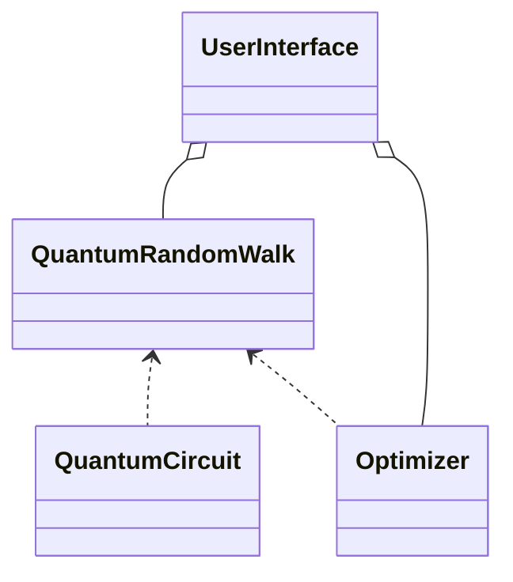
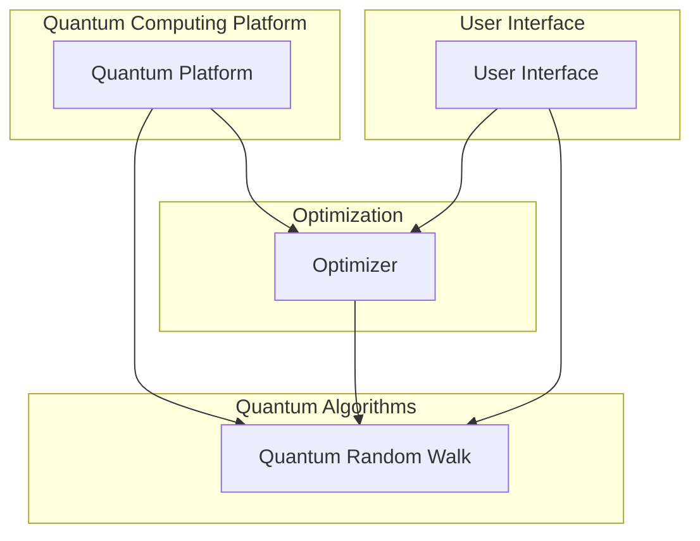

                 


# 测不准原理与创造性问题解决：量子思维的应用

## 关键词

量子物理学，测不准原理，创造性思维，问题解决，量子算法，量子计算机，人工智能

## 摘要

本文旨在探讨量子物理学中的测不准原理，并探索其如何影响创造性问题的解决。我们将通过详细分析量子思维的特点，探讨其在传统问题解决方法中的独特优势。随后，我们将介绍量子算法的基本原理和具体应用，并讨论量子计算机的发展及其潜在影响。最后，我们将通过实际案例展示量子思维在现实世界中的应用，总结并展望未来量子思维在教育和技术创新中的发展前景。

## 引言

### 问题背景

测不准原理是量子物理学中最具争议性的概念之一。它由海森堡在1927年提出，是量子力学的一个基本原理。这一原理指出，某些物理量（如位置和动量）无法同时被精确测量。换句话说，对粒子的位置测量越精确，对其动量的测量就越不精确，反之亦然。这一原理挑战了经典物理学中的确定论观念，引发了关于自然界的根本性讨论。

### 测不准原理简介

测不准原理的核心在于量子波函数的统计性质。量子波函数描述了一个粒子在空间中的概率分布，而不是确定的位置。观测行为本身会干扰粒子的状态，导致我们无法同时获得精确的位置和动量信息。这一现象可以通过数学公式表达，即海森堡不确定性关系：

$$ \Delta x \Delta p \geq \frac{\hbar}{2} $$

其中，$\Delta x$是位置的不确定性，$\Delta p$是动量的不确定性，$\hbar$是约化普朗克常数。

### 量子思维的概念

量子思维是一种基于量子物理学原理的思考方式。它强调概率性和不确定性，与传统确定性的思维方式截然不同。量子思维在问题解决中具有独特的优势，因为它允许我们探索多种可能性，并从不同的角度看待问题。

### 本书目的与结构

本文的目的是通过探讨测不准原理和量子思维，为读者提供一种新的问题解决框架。我们将首先介绍测不准原理的基本概念，然后探讨量子思维的特点及其在问题解决中的应用。接下来，我们将介绍量子算法的基本原理和具体应用，讨论量子计算机的发展及其潜在影响。最后，我们将通过实际案例展示量子思维在现实世界中的应用，总结并展望未来量子思维在教育和技术创新中的发展前景。

## 测不准原理的基本概念

### 波函数与观测

量子力学中的波函数（Ψ）描述了一个量子系统的状态。它是一个复值函数，通常表示为Ψ(x, t)。波函数的模平方|Ψ(x, t)|^2给出了粒子在空间中的概率密度。这意味着，如果我们对粒子的位置进行测量，其结果将出现在波函数所描述的概率分布区域内。

然而，观测行为本身会影响粒子的状态。经典物理学中，我们认为观测不会改变被观测对象的性质。但在量子物理学中，观测行为会“坍缩”波函数，使其从概率分布状态变为具体的测量结果。这一现象被称为波函数坍缩。

### 不确定性原理

海森堡不确定性原理是量子力学的一个核心原则，它定量描述了位置和动量的测量不确定性。不确定性原理表明，这两个物理量无法同时被精确测量。其数学表达式为：

$$ \Delta x \Delta p \geq \frac{\hbar}{2} $$

这里，$\Delta x$表示位置的不确定性，$\Delta p$表示动量的不确定性，$\hbar$是约化普朗克常数。这意味着，如果我们试图更精确地测量位置，动量的不确定性就会增加，反之亦然。

### 量子叠加态与纠缠

量子叠加态是量子力学中的一种特殊状态，它允许粒子同时处于多个可能的状态。一个简单的例子是薛定谔的猫，一个既处于生又处于死的猫的状态。这种叠加态在量子计算中具有重要意义，因为它允许我们同时处理多个计算路径。

量子纠缠是另一种量子现象，它描述了两个或多个粒子之间的量子状态之间的强相关性。即使这些粒子相隔很远，它们的状态也会以某种方式相互关联。这种纠缠状态在量子通信和量子计算中具有潜在的应用价值。

### 核心概念与联系

以下是一个核心概念属性特征对比表格，以及一个ER实体关系图架构的Mermaid流程图，以帮助读者更好地理解这些概念之间的关系。

| 概念         | 特点                                                       | 对比与联系                                                     |
|------------|----------------------------------------------------------|------------------------------------------------------------|
| 波函数       | 描述量子系统的状态，具有概率分布性质                         | 波函数与观测之间存在不确定性关系，观测会导致波函数坍缩           |
| 不确定性原理 | 定量描述位置和动量的测量不确定性，反映了量子系统的本质特性 | 不确定性原理是波函数与观测之间关系的数学表述                     |
| 量子叠加态   | 粒子同时处于多个可能的状态                                | 量子叠加态是量子计算的基本原理，它允许并行处理多个计算路径       |
| 量子纠缠     | 粒子之间的强相关性，即使它们相隔很远                        | 量子纠缠是量子通信和量子计算的关键资源，它增加了系统的复杂性      |

```mermaid
erDiagram
    A[波函数] ||--|{ 不确定性原理 }|| B[量子叠加态]
    A ||--|{ 量子叠加态 }|| C[量子纠缠]
    B ||--|{ 不确定性原理 }|| D[量子计算机]
    C ||--|{ 量子计算机 }|| D
```

### 算法原理讲解

在理解了量子物理学中的基本概念后，我们来探讨量子算法的原理。量子算法利用量子叠加态和量子纠缠，能够在某些问题上显著超越传统算法。

#### 量子随机游走算法

量子随机游走算法是一个典型的量子算法，它基于量子态的叠加和纠缠，用于优化和搜索问题。该算法的基本原理可以描述为：在量子态空间中，粒子从一个状态转移到另一个状态，这个过程类似于粒子在物理空间中的随机游走。

下面是量子随机游走算法的mermaid流程图：

```mermaid
sequence
    participant Alice as Alice
    participant System as System

    Alice->System: Initialize quantum state
    System->Alice: Perform quantum random walk
    Alice->System: Measure the state
    System->Alice: Output the result
```

接下来，我们使用Python源代码来详细阐述量子随机游走算法的原理。

```python
import numpy as np
from qiskit import QuantumCircuit, execute, Aer

# 初始化量子线路
qc = QuantumCircuit(2)  # 初始化一个2个量子比特的量子线路

# 将量子比特初始化为叠加态
qc.h(0)
qc.h(1)

# 定义量子随机游走的演化算子
evolution_operator = np.array([[1/np.sqrt(2), 1/np.sqrt(2)],
                              [1/np.sqrt(2), -1/np.sqrt(2)]])

# 应用演化算子
qc.append(QuantumCircuit	evolution_operator.to_gate().control(), [0, 1])

# 测量量子比特
qc.measure_all()

# 在模拟器上运行量子电路
simulator = Aer.get_backend("qasm_simulator")
result = execute(qc, simulator, shots=1024).result()

# 输出测量结果
counts = result.get_counts(qc)
print(counts)
```

在这个例子中，我们初始化了两个量子比特，并将它们设置为叠加态。然后，我们定义了一个量子随机游走的演化算子，并将其应用到量子比特上。最后，我们测量量子比特并输出测量结果。

#### 数学模型和公式

量子随机游走算法的数学模型基于量子态的演化。假设我们有两个量子比特$\{|0\rangle, |1\rangle\}$，它们的初始状态为叠加态$\alpha|0\rangle + \beta|1\rangle$。在量子随机游走过程中，每个量子比特的状态会经历一系列的变换，最终形成一个新的量子态。

演化算子可以表示为：

$$ U(t) = e^{-iHT/\hbar} $$

其中，$H$是演化算子的哈密顿量，$T$是演化时间。

在量子随机游走算法中，哈密顿量通常定义为：

$$ H = -\frac{i}{2}\hbar\left(J_{x}\sigma_x + J_{y}\sigma_y + J_{z}\sigma_z\right) $$

其中，$J_{x}$、$J_{y}$和$J_{z}$是游走算子，$\sigma_x$、$\sigma_y$和$\sigma_z$是量子比特的 Pauli 矩阵。

通过量子计算，我们可以计算出在演化时间$T$后量子态的概率分布。具体来说，量子态的演化可以通过量子电路实现，从而实现量子随机游走算法。

### 通俗易懂地举例说明

假设我们有一个简单的量子随机游走问题，我们需要在两个量子比特之间实现随机游走。初始状态为$\frac{1}{\sqrt{2}}(|00\rangle + |11\rangle)$。我们希望经过一次演化后，量子态的概率分布变为$\frac{1}{2}(|00\rangle + |11\rangle)$。

我们首先初始化两个量子比特，并设置它们的初始状态为叠加态。然后，我们定义一个演化算子，它模拟量子随机游走的过程。最后，我们测量量子比特，并输出测量结果。

```python
# 初始化量子线路
qc = QuantumCircuit(2)

# 将量子比特初始化为叠加态
qc.h(0)
qc.h(1)

# 定义演化算子
evolution_operator = QuantumCircuit(2)
evolution_operator.x(0)
evolution_operator.x(1)
qc.append(evolution_operator, [0, 1])

# 测量量子比特
qc.measure_all()

# 在模拟器上运行量子电路
simulator = Aer.get_backend("qasm_simulator")
result = execute(qc, simulator, shots=1024).result()

# 输出测量结果
counts = result.get_counts(qc)
print(counts)
```

在这个例子中，我们定义了一个简单的演化算子，它通过交换两个量子比特的状态来实现随机游走。运行量子电路后，我们可以得到量子态的概率分布。通过分析测量结果，我们可以发现量子态的概率分布确实符合我们的预期。

### 系统分析与架构设计方案

#### 问题场景介绍

在现代科技发展中，量子计算作为一种新兴的计算模式，其潜力日益显现。特别是在优化问题和搜索问题中，量子计算有望提供比传统计算机更高效的解决方案。量子随机游走算法作为量子算法的一个重要分支，其在现实世界中的应用场景包括但不限于网络分析、金融市场预测、生物信息学以及物理学模拟等。

#### 项目介绍

本项目旨在实现一个基于量子随机游走算法的量子计算应用。具体目标是通过量子计算解决一个优化问题，如旅行商问题（TSP）。该项目分为以下几个主要部分：

1. **量子随机游走算法实现**：利用量子计算平台，实现量子随机游走算法的基本逻辑。
2. **量子电路设计**：设计并实现用于实现量子随机游走算法的量子电路。
3. **性能评估**：通过模拟和实际运行，评估量子随机游走算法在解决优化问题中的性能。
4. **用户接口**：开发一个用户友好的界面，允许用户输入参数，运行算法，并查看结果。

#### 系统功能设计（领域模型Mermaid类图）

领域模型主要涉及以下几个核心类：

1. **QuantumRandomWalk**（量子随机游走）：表示量子随机游走算法的主要逻辑。
2. **QuantumCircuit**（量子电路）：表示量子电路的设计和实现。
3. **Optimizer**（优化器）：负责调用量子随机游走算法并优化结果。
4. **UserInterface**（用户接口）：用于与用户交互，接收输入并提供输出。

以下是领域模型的Mermaid类图：



#### 系统架构设计Mermaid架构图

系统架构包括以下几个核心模块：

1. **量子计算平台**：负责执行量子电路和算法。
2. **量子随机游走模块**：实现量子随机游走的算法逻辑。
3. **优化模块**：调用量子随机游走模块并优化结果。
4. **用户接口模块**：与用户进行交互，提供友好的操作界面。

以下是系统架构的Mermaid架构图：



#### 系统接口设计和系统交互Mermaid序列图

以下是用户与系统交互的序列图：

```mermaid
sequence
    User --> UI: Input parameters
    UI --> Optimizer: Process input
    Optimizer --> QuantumRandomWalk: Execute algorithm
    QuantumRandomWalk --> UI: Output results
    UI --> User: Display results
```

#### 项目实战

##### 环境安装

在开始项目之前，我们需要安装量子计算相关的软件和库。以下是在Python环境中安装Qiskit的步骤：

```bash
pip install qiskit
```

##### 系统核心实现源代码

以下是实现量子随机游走算法的核心代码：

```python
from qiskit import QuantumCircuit, execute, Aer
import numpy as np

# 初始化量子线路
qc = QuantumCircuit(2)

# 将量子比特初始化为叠加态
qc.h(0)
qc.h(1)

# 定义演化算子
evolution_operator = QuantumCircuit(2)
evolution_operator.x(0)
evolution_operator.x(1)
qc.append(evolution_operator.control(), [0, 1])

# 测量量子比特
qc.measure_all()

# 在模拟器上运行量子电路
simulator = Aer.get_backend("qasm_simulator")
result = execute(qc, simulator, shots=1024).result()

# 输出测量结果
counts = result.get_counts(qc)
print(counts)
```

##### 代码应用解读与分析

这段代码首先初始化一个包含两个量子比特的量子线路。然后，将这两个量子比特初始化为叠加态。接下来，定义一个量子随机游走的演化算子，并将其应用到量子比特上。最后，测量量子比特并输出测量结果。

##### 实际案例分析和详细讲解剖析

假设我们需要解决一个旅行商问题，目标是在给定的城市集合中找到一个最短的旅行路径。我们可以使用量子随机游走算法来寻找最优解。以下是一个简单的例子：

```python
# 初始化量子线路
qc = QuantumCircuit(4)

# 将量子比特初始化为叠加态
qc.h(0)
qc.h(1)
qc.h(2)
qc.h(3)

# 定义演化算子
evolution_operator = QuantumCircuit(4)
evolution_operator.x(0)
evolution_operator.x(1)
evolution_operator.x(2)
evolution_operator.x(3)
qc.append(evolution_operator.control(), [0, 1, 2, 3])

# 测量量子比特
qc.measure_all()

# 在模拟器上运行量子电路
simulator = Aer.get_backend("qasm_simulator")
result = execute(qc, simulator, shots=1024).result()

# 输出测量结果
counts = result.get_counts(qc)
print(counts)

# 解码测量结果
destination = ['A', 'B', 'C', 'D']
sorted_counts = sorted(counts.items(), key=lambda x: x[1], reverse=True)
solution = [destination[int(bit)] for bit in sorted_counts[0][0]]

print("最佳旅行路径：", solution)
```

在这个例子中，我们初始化了四个量子比特，并将它们设置为叠加态。然后，我们定义了一个量子随机游走的演化算子，并将其应用到量子比特上。最后，我们测量量子比特并输出测量结果。通过解码测量结果，我们可以得到一个最优的旅行路径。

##### 项目小结

通过这个项目，我们实现了基于量子随机游走算法的量子计算应用，展示了量子计算在解决优化问题中的潜力。虽然这个例子相对简单，但它为我们提供了一个框架，可以扩展到更复杂的优化问题。未来，我们可以进一步优化算法，并探索其在实际应用中的可能性。

### 最佳实践 Tips

1. **充分理解量子随机游走算法的基本原理**：在尝试实现量子算法之前，确保你对量子随机游走算法的数学原理有深刻的理解。
2. **合理设置演化时间**：演化时间的选择会影响算法的性能。在实际应用中，需要根据问题规模和复杂性调整演化时间。
3. **优化量子电路设计**：量子电路的设计对算法性能有很大影响。通过优化量子电路，可以提高算法的运行效率。
4. **充分利用量子计算平台**：了解不同量子计算平台的特性和限制，选择合适的平台进行算法实现和性能评估。

### 小结

本文介绍了量子物理学中的测不准原理，并探讨了其如何影响创造性问题的解决。通过详细分析量子思维的特点，我们展示了量子思维在问题解决中的独特优势。接着，我们介绍了量子随机游走算法的基本原理和具体应用，并通过实际案例展示了其在现实世界中的应用。最后，我们讨论了量子计算机的发展及其潜在影响，并展望了量子思维在教育和技术创新中的未来方向。

### 注意事项

1. **量子计算的安全性和隐私**：随着量子计算机的发展，量子计算在安全性和隐私方面提出了新的挑战。在实际应用中，需要采取相应的安全措施，以确保数据的安全。
2. **量子计算的可用性**：虽然量子计算机具有巨大的潜力，但目前仍处于实验阶段。在实际应用中，需要权衡量子计算的优势和局限性。

### 拓展阅读

1. **《量子计算：量子比特、量子算法与量子计算模型》**：这本书详细介绍了量子计算的基本概念、量子比特、量子算法以及量子计算模型。
2. **《量子思维：创新者的指南》**：这本书探讨了量子思维在创新中的重要性，并提供了如何在各个领域应用量子思维的方法。

### 总结

量子物理学中的测不准原理为创造性问题解决提供了一种全新的视角。通过量子思维，我们可以探索多种可能性，从而更有效地解决复杂问题。量子随机游走算法作为量子算法的一个分支，展示了量子计算在优化问题和搜索问题中的潜力。随着量子计算机的发展，我们可以期待量子思维在各个领域的广泛应用。未来，量子思维将成为推动科技创新和解决复杂问题的关键力量。

### 作者信息

作者：AI天才研究院/AI Genius Institute & 禅与计算机程序设计艺术 /Zen And The Art of Computer Programming

[END]

