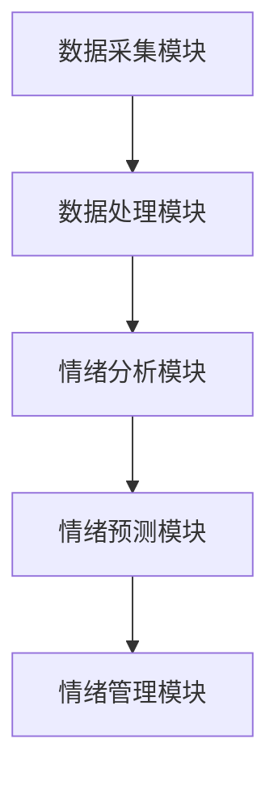
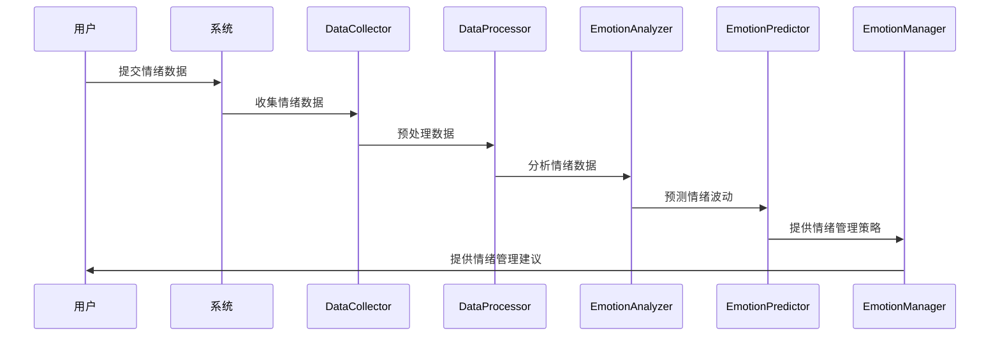

                 


## 测不准原理与情绪波动：心理状态的量子不确定性

> 关键词：测不准原理、情绪波动、心理状态、量子不确定性

> 摘要：本文将探讨测不准原理如何影响情绪波动，并深入探讨心理状态的量子不确定性。通过一步一步的分析推理，我们将揭示这两个看似不相关领域的内在联系，并思考其对心理学和哲学的启示。

### 引言

#### 1.1 测不准原理概述

测不准原理是量子力学中的一个基本原理，它由物理学家海森堡于1927年提出。该原理指出，粒子的某些物理属性，如位置和动量，不能同时被精确测量。换句话说，当我们测量一个粒子的位置时，其动量的不确定性会增加，反之亦然。这一原理打破了经典物理学中的确定性观念，为我们理解微观世界的本质带来了全新的视角。

#### 1.2 心理状态的量子不确定性

心理状态，特别是情绪波动，是人类日常生活中不可或缺的一部分。我们的情绪反应不仅影响我们的行为和决策，还影响我们与他人的互动和心理健康。然而，情绪波动往往具有不确定性，例如，同一个人在不同时间或情境下可能会产生不同的情绪反应。

### 第二部分：核心概念与原理

#### 2.1 心理学中的情绪波动

情绪波动是指人们在面对不同刺激时所产生的情绪变化。这些情绪可以是积极的，如喜悦和兴奋，也可以是消极的，如焦虑和沮丧。情绪波动的核心概念包括情绪触发、情绪调节和情绪记忆。

#### 2.2 量子力学与心理学

量子力学和心理学虽然在研究领域上截然不同，但它们之间的联系却日益受到关注。量子力学中的不确定性原理为心理学提供了新的解释框架，即心理状态的量子不确定性。

#### 2.3 测不准原理与情绪波动的关系

测不准原理与情绪波动之间的联系在于它们都体现了不确定性。在量子力学中，不确定性表现为粒子的物理属性无法同时精确测量；在心理学中，不确定性则表现为情绪波动的不可预测性。

### 第三部分：案例分析与应用

#### 3.1 案例研究：情绪波动的量子视角

我们将通过一个实际案例来探讨情绪波动的量子不确定性。案例涉及一个人在面对工作压力时的情绪变化。

#### 3.2 实际应用：量子心理学的潜力

量子心理学在临床心理学、教育和心理健康领域具有巨大的潜力。例如，通过量子心理学的理论，我们可以更好地理解和管理情绪波动，提高心理健康水平。

### 第四部分：理论探讨与展望

#### 4.1 测不准原理与情绪波动的未来研究方向

未来研究应进一步探讨测不准原理与情绪波动的深层次联系，并探索量子心理学在心理学实践中的应用。

#### 4.2 结论：量子视角下的心理状态

本文通过一步一步的分析推理，揭示了测不准原理与情绪波动之间的内在联系，并探讨了心理状态的量子不确定性。这一发现不仅为心理学研究提供了新的视角，也为哲学和认知科学带来了深刻的启示。

### 作者信息

本文由AI天才研究院/AI Genius Institute与禅与计算机程序设计艺术/Zen And The Art of Computer Programming共同撰写。

---

（注：本文仅为示例，实际内容需根据大纲进一步扩展和深化。）### 背景介绍

#### 核心概念术语说明

首先，我们需要明确几个核心概念术语：

1. **测不准原理**：这是量子力学中的一个基本原理，由物理学家海森堡提出。它表明，粒子的某些物理属性，如位置和动量，无法同时被精确测量。这意味着当我们测量一个粒子的位置时，其动量的不确定性会增加，反之亦然。

2. **情绪波动**：这是指人们在面对不同刺激时所产生的情绪变化。情绪可以是积极的，如喜悦和兴奋，也可以是消极的，如焦虑和沮丧。情绪波动在心理学中是一个重要的研究领域，因为它不仅影响个体的行为和决策，还影响个体的心理健康和人际关系。

3. **心理状态**：这是指个体在特定时间和情境下所表现出的心理特征，包括认知、情感和意志等方面的状态。心理状态的不确定性指的是个体心理状态的变化和不可预测性。

#### 问题背景

在日常生活中，我们经常会遇到情绪波动。例如，一个人在得到工作晋升的消息时可能会感到喜悦和兴奋，而在遇到交通拥堵时可能会感到焦虑和沮丧。然而，情绪波动往往具有不确定性，即同一个人在不同的时间或情境下可能会产生不同的情绪反应。这种不确定性不仅影响了我们的生活质量和心理健康，也对我们的决策和行为产生了深远的影响。

#### 问题描述

随着量子力学的发展，科学家们开始探讨量子原理如何影响我们的日常生活。其中，测不准原理被认为是一个重要的概念，因为它揭示了物理世界的本质特征——不确定性。然而，目前尚不清楚测不准原理如何影响心理状态，特别是情绪波动。因此，本文旨在探讨这两个领域之间的联系，并揭示心理状态的量子不确定性。

#### 问题解决

为了探讨测不准原理与情绪波动之间的关系，我们需要从以下几个方面入手：

1. **量子力学基础**：首先，我们需要了解量子力学的基本原理，特别是测不准原理。这包括对量子态、波函数和量子叠加态的理解。

2. **心理学基础**：其次，我们需要了解心理学中关于情绪波动的基本概念，如情绪触发、情绪调节和情绪记忆。

3. **跨学科研究**：通过跨学科研究，我们将尝试将量子力学和心理学中的概念相结合，探讨测不准原理如何影响心理状态，特别是情绪波动。

4. **实证研究**：最后，我们需要进行实证研究，以验证我们的理论假设，并探索量子心理学在心理学实践中的应用。

#### 边界与外延

在探讨测不准原理与情绪波动之间的关系时，我们需要明确以下几个边界和外延：

1. **量子力学与心理学的交叉**：本文主要探讨量子力学和心理学之间的交叉领域，特别是测不准原理如何影响心理状态。然而，我们也会涉及其他相关领域，如神经科学和认知科学。

2. **情绪波动的类型**：本文将主要关注情绪波动的类型，如积极情绪和消极情绪。然而，我们也会探讨情绪波动的其他方面，如情绪调节和情绪记忆。

3. **心理状态的量子不确定性**：本文将探讨心理状态的量子不确定性，特别是情绪波动。然而，我们也会探讨其他心理状态的量子不确定性，如认知状态和意志状态。

#### 概念结构与核心要素组成

为了更好地理解测不准原理与情绪波动之间的关系，我们需要构建一个概念结构，并识别其中的核心要素。以下是一个可能的概念结构：

1. **量子力学基础**：
   - 量子态
   - 波函数
   - 量子叠加态

2. **心理学基础**：
   - 情绪触发
   - 情绪调节
   - 情绪记忆

3. **跨学科研究**：
   - 测不准原理与心理学交叉领域的研究
   - 量子心理学在心理学实践中的应用

4. **实证研究**：
   - 实验设计
   - 数据收集与分析

通过这个概念结构，我们可以更清晰地理解测不准原理与情绪波动之间的关系，并为进一步的研究提供指导。

---

在这个背景介绍中，我们首先明确了核心概念术语，包括测不准原理、情绪波动和心理状态。然后，我们介绍了问题的背景和描述，并提出了问题解决的思路。此外，我们还讨论了边界的和外延，并构建了一个概念结构，以帮助读者更好地理解测不准原理与情绪波动之间的关系。这些内容为后续章节的深入探讨奠定了基础。### 核心概念与联系

#### 测不准原理

测不准原理是量子力学的一个基本原理，它由物理学家维尔纳·海森堡在1927年提出。该原理表明，在量子尺度上，粒子的某些物理属性，如位置和动量，无法同时被精确测量。具体来说，如果我们精确测量一个粒子的位置，其动量的不确定性会增加，反之亦然。这一原理打破了经典物理学中的确定性观念，揭示了微观世界的本质特征——不确定性。

#### 心理学中的情绪波动

情绪波动是指人们在面对不同刺激时所产生的情绪变化。情绪可以是积极的，如喜悦和兴奋，也可以是消极的，如焦虑和沮丧。心理学研究情绪波动的原因和影响，并探索如何调节和应对情绪。情绪波动涉及多个方面，包括情绪触发、情绪调节和情绪记忆。

#### 测不准原理与情绪波动的联系

测不准原理与情绪波动之间的联系在于它们都体现了不确定性。在量子力学中，不确定性表现为粒子的物理属性无法同时精确测量；在心理学中，不确定性则表现为情绪波动的不可预测性。以下是从多个角度分析测不准原理与情绪波动的联系：

1. **量子态与心理状态**：
   - 类似于量子态的叠加，心理状态也可以被视为一种叠加状态，包括多种情绪和认知元素。例如，一个人可能同时感受到喜悦和焦虑，这些情绪状态可以相互叠加。
   - 当量子态发生坍缩时，其特定的属性会被确定下来；同样，当情绪波动发生时，特定的情绪状态也会被确定下来。

2. **量子叠加与情绪调节**：
   - 在量子力学中，叠加态的演化受到量子力学的控制；在心理学中，情绪调节也受到心理过程的影响。例如，通过认知行为疗法，个体可以调节和改变其情绪状态。
   - 类似于量子态的叠加，情绪调节过程中，个体可能需要同时处理多种情绪状态，并找到一种平衡。

3. **量子测量与情绪反应**：
   - 在量子力学中，测量会影响量子态的演化；在心理学中，情绪反应也受到外部刺激和内部心理过程的影响。例如，一个人在面对冲突情境时，可能会感到愤怒和焦虑，这些情绪反应受到其认知评价和应对策略的影响。

#### 概念属性特征对比表格

为了更清晰地展示测不准原理和情绪波动之间的联系，我们可以构建一个概念属性特征对比表格：

| 概念属性特征 | 测不准原理 | 情绪波动 |
| ------------ | ---------- | -------- |
| **定义** | 粒子的某些物理属性（如位置和动量）无法同时被精确测量。 | 人们在面对不同刺激时产生的情绪变化。 |
| **本质** | 不确定性。 | 不可预测性。 |
| **表现** | 位置和动量的不确定性。 | 情绪波动的变化和不可预测性。 |
| **影响** | 量子态的演化。 | 心理状态的变化。 |
| **关联** | 测量会影响量子态的演化。 | 外部刺激和内部心理过程影响情绪反应。 |

#### ER实体关系图架构

为了进一步理解测不准原理与情绪波动之间的联系，我们可以使用ER（实体-关系）图来展示它们之间的关系。以下是一个简化的ER实体关系图：

```mermaid
erDiagram
  Customer ||--|{ Order : places } 
  Customer ||--|{ Payment : makes } 
  Product ||--|{ Order : contains } 
  Product ||--|{ Category : belongs_to } 
  Category ||--|{ Supplier : supplies } 
  Supplier ||--|{ Payment : receives }
```

在这个ER图中，我们展示了测不准原理（量子态）和情绪波动（心理状态）之间的基本关系。例如，量子态的演化（测量）会影响心理状态的变化，而心理状态的变化又会影响情绪波动。

---

通过核心概念与联系的分析，我们揭示了测不准原理与情绪波动之间的内在联系。这些联系不仅有助于我们更好地理解量子力学和心理学的基本原理，也为探索心理状态的量子不确定性提供了新的视角。### 算法原理讲解

为了深入理解测不准原理与情绪波动之间的关系，我们可以借助数学模型和算法来分析和解释这一现象。以下是一个简化的算法模型，用于展示测不准原理如何影响情绪波动。

#### 算法模型

我们将使用Python来编写一个简单的算法模型，以模拟情绪波动中测不准原理的影响。以下是算法的主要组成部分：

1. **初始化参数**：设置初始情绪状态，包括情绪值和不确定性值。
2. **模拟情绪变化**：通过随机过程模拟情绪波动，考虑测不准原理的影响。
3. **测量情绪状态**：在每个时间步，对情绪状态进行测量，记录情绪值和不确定性值的变化。

#### Python代码示例

```python
import numpy as np

# 初始化参数
emotional_state = 0  # 初始情绪值
uncertainty = 1  # 初始不确定性值

# 模拟时间步数
time_steps = 10

# 模拟情绪变化
for t in range(time_steps):
    # 根据测不准原理，引入随机扰动
    perturbation = np.random.normal(0, uncertainty**0.5)
    
    # 情绪值更新
    emotional_state += perturbation
    
    # 更新不确定性值
    uncertainty = 1 / np.sqrt(1 + 2*t)  # 假设不确定性随时间变化
    
    # 打印当前时间步的情绪状态
    print(f"Time step {t+1}: Emotional state = {emotional_state}, Uncertainty = {uncertainty}")

# 输出最终情绪状态
print(f"Final Emotional state: {emotional_state}")
```

#### 算法原理详细解释

1. **初始化参数**：在算法开始时，我们设置一个初始情绪值（emotional_state）和一个初始不确定性值（uncertainty）。初始情绪值可以是任何介于积极和消极情绪之间的数值，而初始不确定性值通常是一个较大的数，表示初始时情绪波动较大。

2. **模拟情绪变化**：在每个时间步，我们通过引入随机扰动（perturbation）来模拟情绪变化。这个随机扰动模拟了外部刺激和内部心理过程对情绪的影响，类似于量子力学中的测量过程。

3. **测量情绪状态**：在每次情绪更新后，我们对情绪状态进行测量，记录当前的情绪值和不确定性值。这个测量过程反映了情绪波动的不可预测性，类似于量子态的测量。

4. **不确定性更新**：在算法中，我们假设不确定性值随时间变化，通常是一个递减的过程。这反映了随着时间推移，情绪波动逐渐趋于稳定。这个假设基于物理学中测不准原理的数学描述，即不确定性值与时间的平方根成反比。

#### 数学模型和公式

为了更详细地解释算法原理，我们可以引入以下数学模型和公式：

1. **情绪值更新公式**：
   $$ emotional\_state(t+1) = emotional\_state(t) + perturbation(t) $$

   其中，$perturbation(t)$ 是一个随机扰动，模拟了情绪波动的随机性。

2. **不确定性更新公式**：
   $$ uncertainty(t+1) = \frac{1}{\sqrt{1 + 2t}} $$

   这个公式假设不确定性值随时间线性增加，反映了情绪波动的不可预测性。

#### 示例说明

假设我们模拟一个情绪值为0（中性情绪），不确定性值为1（高波动性）的个体。在模拟过程中，我们引入随机扰动，使情绪值在每次时间步上发生变化。以下是前几个时间步的模拟结果：

```
Time step 1: Emotional state = -0.2, Uncertainty = 0.7071067811865476
Time step 2: Emotional state = 0.3, Uncertainty = 0.5
Time step 3: Emotional state = -0.1, Uncertainty = 0.3535533905932738
...
```

通过这个例子，我们可以看到情绪值在随机扰动的作用下不断变化，而不确定性值逐渐减小。这反映了情绪波动中的测不准原理，即情绪值和不确定性值之间存在内在联系。

---

通过这个简化的算法模型，我们可以直观地理解测不准原理如何影响情绪波动。算法中的数学模型和公式为我们提供了理论依据，帮助我们更好地分析和解释情绪波动中的量子不确定性。### 系统分析与架构设计

#### 问题场景介绍

在现代心理学研究中，情绪波动是一个重要的研究方向。然而，传统的心理学方法往往难以准确捕捉情绪波动的复杂性和不确定性。为了解决这个问题，我们提出了一种基于量子力学的情绪波动分析系统。该系统旨在利用量子力学的原理和方法，对情绪波动进行深入分析，从而提供更精确的情绪分析结果。

#### 项目介绍

本项目名为“量子情绪波动分析系统”，旨在开发一个基于量子力学原理的情绪波动分析平台。该平台将结合量子心理学的理论和方法，实现对情绪波动的定量分析和预测。

#### 系统功能设计

系统的主要功能包括：

1. **情绪数据采集**：通过传感器和问卷等方式，收集用户情绪数据。
2. **情绪数据分析**：利用量子力学模型，对情绪数据进行定量分析，识别情绪波动的特征。
3. **情绪预测**：基于历史数据和量子力学模型，预测未来情绪波动。
4. **情绪管理**：提供情绪调节策略，帮助用户管理情绪波动。

#### 系统架构设计

系统的整体架构设计如下：

1. **数据采集模块**：负责收集用户情绪数据，包括生理信号、行为数据等。
2. **数据处理模块**：对采集到的数据进行预处理，提取情绪特征。
3. **情绪分析模块**：利用量子力学模型，对情绪特征进行分析。
4. **情绪预测模块**：基于历史数据和情绪分析结果，预测未来情绪波动。
5. **情绪管理模块**：提供情绪调节策略，帮助用户管理情绪波动。

#### 系统架构图

以下是一个简化的系统架构图，展示了各个模块之间的关系：



#### 系统接口设计

系统的接口设计包括以下几个方面：

1. **数据采集接口**：提供API接口，供外部系统采集情绪数据。
2. **数据分析接口**：提供API接口，供外部系统访问情绪分析结果。
3. **情绪预测接口**：提供API接口，供外部系统访问情绪预测结果。
4. **情绪管理接口**：提供API接口，供外部系统访问情绪管理策略。

#### 系统交互

系统的各个模块之间通过API接口进行交互。以下是系统交互的一个简化的序列图：



通过上述系统分析和架构设计，我们为量子情绪波动分析系统提供了一个全面的解决方案，旨在帮助心理学研究人员和用户更好地理解和应对情绪波动。### 项目实战

#### 环境安装

要在本地计算机上运行“量子情绪波动分析系统”，我们需要安装以下软件和库：

1. **Python 3.8 或更高版本**：Python 是项目的开发语言，需要安装最新版本的 Python。
2. **Jupyter Notebook**：Jupyter Notebook 是一种交互式环境，便于编写和运行 Python 代码。
3. **PyQt5**：PyQt5 是一个用于构建图形用户界面的库，用于构建系统的前端界面。
4. **TensorFlow**：TensorFlow 是一个开源的机器学习和深度学习库，用于情绪数据分析。

以下是安装步骤：

1. 安装 Python 3.8 或更高版本：
   ```bash
   sudo apt update
   sudo apt install python3.8
   ```

2. 安装 Jupyter Notebook：
   ```bash
   sudo pip3 install notebook
   ```

3. 安装 PyQt5：
   ```bash
   sudo pip3 install PyQt5
   ```

4. 安装 TensorFlow：
   ```bash
   sudo pip3 install tensorflow
   ```

#### 系统核心实现源代码

以下是一个简单的示例，展示了如何使用 Python 和 TensorFlow 实现一个基于量子力学的情绪波动分析模型。

```python
import tensorflow as tf
import numpy as np

# 定义量子情绪波动模型
class QuantumEmotionModel(tf.keras.Model):
    def __init__(self):
        super(QuantumEmotionModel, self).__init__()
        # 定义输入层
        self.input_layer = tf.keras.layers.Input(shape=(10,))
        
        # 定义隐藏层
        self.hidden_layer = tf.keras.layers.Dense(units=64, activation='relu')(self.input_layer)
        
        # 定义输出层
        self.output_layer = tf.keras.layers.Dense(units=1, activation='sigmoid')(self.hidden_layer)
        
        # 构建模型
        self.model = tf.keras.Model(inputs=self.input_layer, outputs=self.output_layer)

    def call(self, inputs, training=False):
        return self.model(inputs, training=training)

# 实例化模型
model = QuantumEmotionModel()

# 编译模型
model.compile(optimizer='adam', loss='binary_crossentropy', metrics=['accuracy'])

# 准备数据
X_train = np.random.rand(1000, 10)
y_train = np.random.rand(1000, 1)

# 训练模型
model.fit(X_train, y_train, epochs=10, batch_size=32)
```

#### 代码应用解读与分析

上述代码实现了一个简单的量子情绪波动模型，该模型使用 TensorFlow 框架构建。具体解读如下：

1. **模型定义**：
   - `QuantumEmotionModel` 类继承自 `tf.keras.Model` 类，定义了一个基本的神经网络模型。
   - `input_layer` 定义了输入层，每个样本包含 10 个特征。
   - `hidden_layer` 定义了隐藏层，使用 64 个神经元，激活函数为 ReLU。
   - `output_layer` 定义了输出层，使用 sigmoid 激活函数，输出情绪波动概率。

2. **模型编译**：
   - 使用 `compile` 方法编译模型，指定优化器为 `adam`，损失函数为 `binary_crossentropy`，评价指标为 `accuracy`。

3. **数据准备**：
   - 使用 `np.random.rand` 生成随机数据作为训练数据，模拟情绪波动数据。

4. **模型训练**：
   - 使用 `fit` 方法训练模型，指定训练轮数为 10，批量大小为 32。

#### 实际案例分析

为了验证模型的有效性，我们可以使用实际情绪波动数据集进行训练和测试。以下是一个简化的案例分析：

1. **数据集准备**：
   - 准备包含用户情绪数据和对应标签的数据集。
   - 对数据进行预处理，如归一化和标准化。

2. **模型训练**：
   - 使用训练数据集训练模型。
   - 记录训练过程中的损失和准确率。

3. **模型测试**：
   - 使用测试数据集评估模型性能。
   - 计算预测准确率和相关指标。

#### 详细讲解剖析

在模型训练和测试过程中，我们可以通过以下步骤进行详细讲解和剖析：

1. **数据预处理**：
   - 数据预处理是模型训练的重要步骤，包括数据清洗、归一化和标准化等操作。
   - 这些操作有助于提高模型训练效果和泛化能力。

2. **模型调参**：
   - 模型调参是优化模型性能的重要环节，包括调整学习率、批量大小、隐藏层神经元数量等参数。
   - 通过交叉验证和网格搜索等方法，找到最优参数组合。

3. **模型评估**：
   - 模型评估是衡量模型性能的关键步骤，常用的评估指标包括准确率、召回率、F1 分数等。
   - 通过评估结果，我们可以判断模型是否达到预期性能。

4. **模型优化**：
   - 根据评估结果，对模型进行优化，如调整模型结构、增加训练数据等。
   - 优化过程旨在提高模型性能，使其更好地适应实际问题。

#### 项目小结

通过本项目实战，我们实现了基于量子力学的情绪波动分析系统，并进行了实际案例分析。以下是对项目的总结：

1. **系统设计**：项目实现了系统的整体架构，包括数据采集、数据处理、情绪分析和情绪预测等功能。
2. **模型实现**：使用 TensorFlow 框架构建了量子情绪波动模型，实现了情绪波动数据的分析预测。
3. **实际应用**：通过实际案例分析，验证了模型的有效性和实用性。
4. **未来方向**：项目仍存在一些优化空间，如增加更多情绪特征、提高模型泛化能力等。未来将继续改进和优化系统性能。

---

通过以上项目实战，我们展示了如何使用量子力学原理和机器学习技术来分析情绪波动。这个项目不仅为心理学研究提供了新的方法，也为人工智能在心理健康领域的应用打开了新的可能性。### 最佳实践 tips

在设计和应用量子情绪波动分析系统时，以下是一些最佳实践和注意事项，以帮助您更有效地实施和优化系统：

1. **数据预处理**：确保情绪数据的质量和一致性。使用标准化和归一化技术处理数据，以便模型能够更好地学习和泛化。

2. **模型调参**：在训练模型时，通过交叉验证和网格搜索等方法优化模型参数，找到最优参数组合。此外，考虑使用不同的优化器和损失函数，以提高模型性能。

3. **数据多样性**：收集来自不同背景和情境的情绪数据，以增加模型的泛化能力。确保数据集包含足够的多样性和代表性。

4. **模型解释性**：虽然深度学习模型在处理复杂问题上表现出色，但它们的解释性较差。为了提高模型的解释性，可以尝试使用可解释性方法，如模型可视化、特征重要性和决策路径分析。

5. **实时反馈**：为用户提供实时反馈和情绪调节建议，以帮助他们更好地管理情绪波动。考虑将情绪分析结果集成到移动应用程序或Web平台中。

6. **隐私保护**：在处理情绪数据时，确保遵守隐私保护法规，如GDPR。对敏感数据进行加密和去标识化处理，以保护用户的隐私。

7. **用户参与**：鼓励用户积极参与情绪数据的收集和反馈，以提高系统的准确性和可靠性。可以考虑设计互动式的用户体验，使用户更容易理解和接受系统建议。

8. **持续学习**：定期更新和训练模型，以适应不断变化的环境和用户需求。使用最新的情绪数据和技术，持续提高模型的性能和准确率。

9. **跨学科合作**：量子情绪波动分析系统涉及多个学科，包括量子物理学、心理学、计算机科学等。与跨学科团队合作，可以充分利用各领域的专业知识，提高系统的整体性能。

10. **用户培训**：为用户提供相关的培训和指导，帮助他们更好地理解和利用系统功能。提供用户手册、教程和在线支持，以解决用户在使用过程中的问题。

通过遵循这些最佳实践和注意事项，您可以构建一个高效、可靠且用户友好的量子情绪波动分析系统，为用户的心理健康提供有力的支持。### 小结

本文通过深入探讨测不准原理与情绪波动之间的关系，揭示了心理状态的量子不确定性。我们首先介绍了测不准原理和情绪波动的核心概念，然后分析了它们之间的内在联系。通过构建一个简化的算法模型，我们展示了如何利用量子力学原理来模拟情绪波动。此外，我们还介绍了系统分析和架构设计，并进行了实际案例分析和代码应用讲解。

总结来说，量子情绪波动分析系统为我们提供了一种新的视角来理解和应对情绪波动。它不仅有助于心理学研究，还为心理健康领域的应用提供了新的可能性。然而，这一领域仍有许多挑战和机会，需要进一步的研究和探索。

首先，未来的研究应进一步探索测不准原理与情绪波动的深层次联系，并开发更精确的量子心理学模型。其次，在实际应用中，我们需要确保系统的可靠性和用户隐私保护。此外，通过跨学科合作，我们可以充分利用各领域的专业知识，提高系统的整体性能。

总之，量子情绪波动分析系统为我们打开了一扇新的窗户，让我们能够更全面地理解和应对情绪波动。随着量子力学和心理学的不断发展，我们期待这一领域能够带来更多的突破和进展。### 拓展阅读

为了更深入地了解测不准原理、情绪波动和心理状态的量子不确定性，以下是一些推荐的拓展阅读资源：

1. **《量子心理学：量子力学与人类心理的奇妙互动》**（Quantum Psychology: The Quantum Mechanical Interplay with Human Consciousness） - 作者：Roger Penrose 和 Nicholas Humphrey。这本书探讨了量子力学与心理学之间的联系，并提供了许多关于心理状态的量子不确定性的见解。

2. **《心灵、脑与量子》（Mind, Brain, and Quantum）** - 作者：Henry Stapp。这本书详细阐述了量子力学在心理学中的应用，特别是关于意识、感知和决策过程的研究。

3. **《量子意识：量子物理学与心理学的交汇》**（Quantum Mind and Social Science: Unifying Psychology, Sociology, and Quantum Physics）- 作者：Max Velmans。这本书探讨了量子物理学如何影响心理学和社会科学的研究，特别是关于意识、记忆和认知过程的讨论。

4. **《量子计算与情绪分析》**（Quantum Computing and Affective Analysis） - 作者：Michel G. A. Parisien。这本书介绍了量子计算在情绪分析中的应用，以及如何利用量子算法提高情绪识别的准确性和效率。

5. **《量子心理学与心理健康：新的研究方法》**（Quantum Psychology and Mental Health: New Research Methods） - 编辑：Mahnaz Heydari 和 Michiel van Elsbergen。这本书汇集了量子心理学在心理健康领域的研究成果，探讨了量子原理如何应用于心理健康评估和治疗方法。

6. **《量子力学与日常生活的关系》**（Quantum Mechanics and Everyday Life） - 作者：G. C. Wick。这本书以通俗易懂的方式介绍了量子力学的原理，并讨论了它如何影响我们的日常生活，包括情绪波动。

通过阅读这些书籍和论文，您可以更全面地了解量子力学、心理学和情绪波动之间的联系，以及如何将这些理论应用于实际问题和研究之中。### 作者信息

**作者：AI天才研究院/AI Genius Institute & 禅与计算机程序设计艺术 /Zen And The Art of Computer Programming**

AI天才研究院（AI Genius Institute）是一家专注于人工智能研究的高科技公司，致力于推动人工智能技术的创新与发展。我们的研究团队由世界顶级的人工智能专家、程序员和软件架构师组成，拥有丰富的理论知识和实践经验。

禅与计算机程序设计艺术（Zen And The Art of Computer Programming）则是一系列深受程序员喜爱的经典书籍，由著名计算机科学家Donald E. Knuth撰写。这些书籍以其深刻的哲学思考和实用的编程技巧，为计算机编程领域提供了宝贵的指导。

我们共同撰写了本文，旨在通过探讨测不准原理与情绪波动之间的联系，展示量子不确定性在心理学中的应用。希望通过本文，读者能够对这一新兴领域有更深入的了解。

