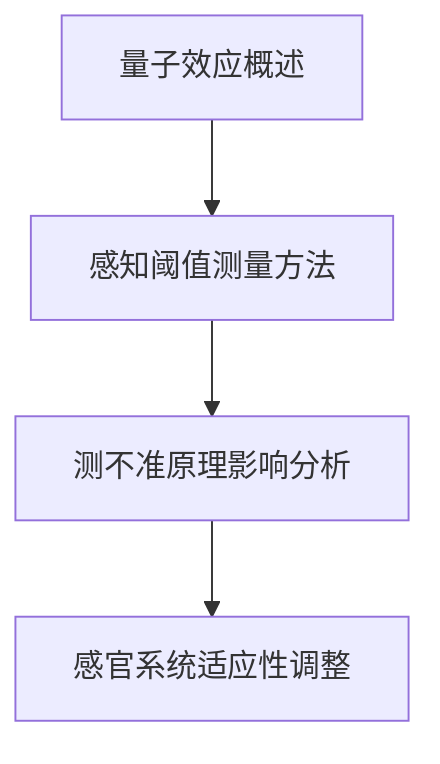
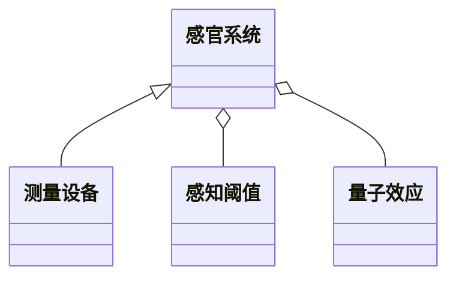
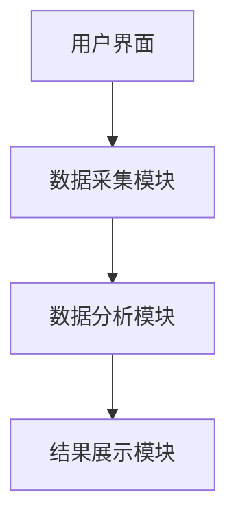
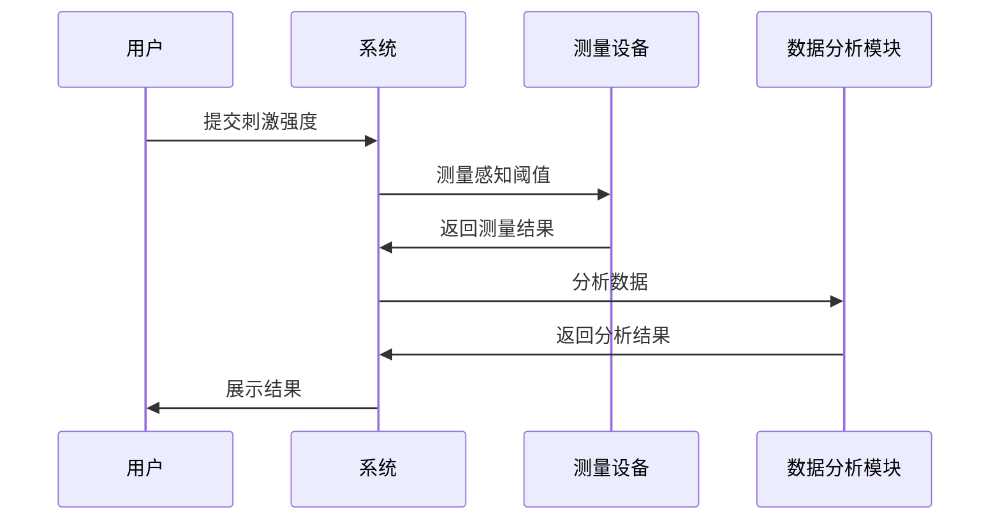

                 

# 测不准原理与感知阈值：量子效应在感官系统中的体现

## 关键词
- 测不准原理
- 感知阈值
- 量子效应
- 感官系统
- 算法原理
- 数学模型

## 摘要
本文深入探讨了测不准原理与感知阈值在感官系统中的关联，揭示了量子效应在人类感官系统中的潜在影响。通过对核心概念的解析和算法原理的阐述，本文探讨了量子效应与感知阈值的关系，并提出了相应的数学模型。同时，本文还通过系统分析与架构设计，提出了研究量子感知阈值的方法，为相关领域的研究提供了新的思路。

## 1. 背景介绍

### 1.1 测不准原理概述

测不准原理是由德国物理学家海森堡于1927年提出的，它是量子力学的一个基本原理。测不准原理指出，某些物理量，如位置和动量，无法同时被精确测量。具体而言，一个粒子的位置不确定性（\(\Delta x\)）与它的动量不确定性（\(\Delta p\)）的乘积必须大于或等于普朗克常数（\(\hbar\)）的一半，即：

\[ \Delta x \cdot \Delta p \geq \hbar/2 \]

这一原理揭示了量子系统中的不确定性和非确定性。

### 1.2 感知阈值的重要性

感知阈值是指人类感官系统感知特定刺激所需的最小强度。例如，视觉系统的感知阈值可能是指人眼能够察觉的最小光强度。感知阈值受到多种因素的影响，包括个体差异、环境因素和刺激的物理特性。

人类感官系统主要由五个部分组成：视觉、听觉、嗅觉、味觉和触觉。每个感官系统都有其特定的感知阈值，这些阈值可以通过实验方法进行测量。

### 1.3 量子效应在感官系统中的潜在影响

量子效应是指微观尺度下的物质和能量的行为，这些行为与经典物理学中的描述有着显著不同。量子力学揭示了粒子的波粒二象性、量子纠缠和量子隧穿等现象。

在感官系统中，量子效应可能影响感知阈值。例如，光子的量子态可能影响视觉感知阈值，而电子的量子态可能影响触觉感知阈值。此外，量子效应还可能导致感知阈值的不确定性，这与测不准原理的基本思想是一致的。

## 2. 核心概念与联系

### 2.1 核心概念原理

#### 测不准原理

测不准原理是量子力学的一个基本原理，描述了量子系统中的粒子和波之间的不可同时精确测量的特性。其数学表述为：

\[ \Delta x \cdot \Delta p \geq \hbar/2 \]

#### 感知阈值

感知阈值是描述人类感官系统感知特定刺激所需的最小强度的指标。它受到多种因素的影响，包括个体差异、环境因素和刺激的物理特性。

#### 量子效应

量子效应是微观尺度下的物质和能量的行为，这些行为与经典物理学中的描述有着显著不同。量子效应包括波粒二象性、量子纠缠和量子隧穿等现象。

### 2.2 概念属性特征对比表格

| 概念         | 定义                                           | 属性特征                                     |
|--------------|------------------------------------------------|----------------------------------------------|
| 测不准原理   | 描述量子系统中的粒子和波之间的不可同时精确测量的特性 | 非确定性、非精确性、不确定关系                 |
| 感知阈值     | 描述人类感官系统感知特定刺激所需的最小强度       | 感知灵敏度、个体差异、环境因素                 |
| 量子效应     | 描述微观尺度下物质与能量的量子性质                 | 波粒二象性、量子纠缠、量子隧穿                 |

### 2.3 ER实体关系图架构的Mermaid流程图

```mermaid
erDiagram
  感官系统 ||--|{ 感知阈值 }
  感官系统 ||--|{ 量子效应 }
  测不准原理 ||--|{ 感知阈值 }
  测不准原理 ||--|{ 量子效应 }
```

## 3. 算法原理讲解

### 3.1 算法原理流程图



### 3.2 算法原理详细讲解

#### 量子效应与感知阈值的关系

量子效应可能会影响感知阈值，例如，光子的量子态可能影响视觉感知阈值，而电子的量子态可能影响触觉感知阈值。量子态的不确定性可能导致感知阈值的不确定性。

#### 感知阈值测量方法

感知阈值的测量通常采用实验方法，例如，通过使用不同强度的刺激，记录被试者的感知阈值。实验设计需要考虑到刺激的物理特性、被试者的个体差异和环境因素。统计分析方法可用于分析实验数据，以确定感知阈值。

#### 测不准原理影响分析

测不准原理影响感知阈值的分析需要考虑量子效应在测量过程中的影响。量子效应可能导致测量过程中的不确定性和误差，这需要对测量结果进行校正和优化。

#### 感官系统适应性调整

感官系统可能会通过适应性调整来适应量子效应的影响。例如，视觉系统可能会通过调整视网膜上的感光细胞来适应不同强度的光照。

## 4. 数学模型和数学公式 & 详细讲解 & 举例说明

### 4.1 数学模型与公式

在量子力学中，概率幅（波函数）是描述量子系统状态的数学函数。波函数的叠加原理和测不准原理是量子力学的基础。以下是几个重要的数学模型和公式：

#### 概率幅表示：

\[ \Psi(x,t) = \int \psi(x,t|\lambda) d\lambda \]

这里，\(\Psi(x,t)\) 是系统的总波函数，\(\psi(x,t|\lambda)\) 是每种可能的量子态的波函数，\(\lambda\) 是量子态的参数。

#### 波函数坍缩：

\[ |\Psi(x,t)\rangle \rightarrow \sum_i c_i(t)|i\rangle \]

当量子系统被测量时，波函数会从叠加态坍缩为某个特定的本征态。

#### 测不准关系：

\[ \Delta x \cdot \Delta p \geq \hbar/2 \]

这是测不准原理的数学表述，\(\Delta x\) 是位置的不确定性，\(\Delta p\) 是动量的不确定性。

### 4.2 详细讲解与举例说明

#### 量子态与感知阈值

量子态可以影响感知阈值。例如，一个激光束的量子态可能会影响其强度，从而影响视觉感知阈值。假设有一个激光束，其量子态导致其强度在两个值之间变化，一个高值和一个低值。如果人的视觉系统能够感知到这种变化，那么感知阈值就会变得不确定，因为它取决于激光束的量子态。

#### 波函数坍缩与测量

当测量一个量子系统的状态时，波函数会坍缩为某个特定的本征态。这个过程可能导致感知阈值的变化。例如，在光电效应中，当光子撞击金属表面时，光子的波函数会坍缩，导致电子的发射能量发生变化。这可能导致感知阈值的变化。

## 5. 系统分析与架构设计方案

### 5.1 问题场景介绍

在研究感官系统中的量子效应时，我们需要建立一个实验平台来模拟感官系统，并测量量子效应对感知阈值的影响。这个问题场景涉及以下几个方面：

1. **量子效应实验设计**：设计实验来观察量子效应对感知阈值的影响。
2. **数据采集模块**：收集实验数据，包括刺激强度和被试者的感知阈值。
3. **数据分析模块**：分析实验数据，确定量子效应对感知阈值的影响。
4. **结果展示模块**：展示分析结果，包括图表和统计数据。

### 5.2 项目介绍

**项目名称**：量子感知阈值研究平台

**项目目标**：通过量子效应实验，探索感知阈值的变化规律，研究量子效应对感知阈值的影响。

### 5.3 系统功能设计

**领域模型类图**：



**系统架构设计**：



### 5.4 系统接口设计和系统交互Mermaid序列图



## 6. 项目实战

### 6.1 环境安装

要开始研究量子感知阈值，首先需要安装必要的软件和工具。以下是一个基本的安装指南：

1. **安装Python**：Python是用于数据分析的常用编程语言。可以从Python官方网站下载并安装。
2. **安装量子计算库**：如Qiskit，用于模拟量子效应。可以通过pip安装：
   ```bash
   pip install qiskit
   ```
3. **安装数据分析库**：如Pandas和NumPy，用于数据分析。可以通过pip安装：
   ```bash
   pip install pandas numpy
   ```

### 6.2 系统核心实现源代码

以下是一个简单的示例，展示了如何使用Python进行量子效应模拟和感知阈值分析。

```python
import numpy as np
import pandas as pd
from qiskit import QuantumCircuit, Aer, execute
from qiskit.visualization import plot_bloch_vector

# 创建量子电路
qc = QuantumCircuit(1)

# 应用量子态
qc.h(0)
qc.rz(np.pi/4, 0)

# 执行量子电路
backend = Aer.get_backend('statevector_simulator')
result = execute(qc, backend).result()
statevector = result.get_statevector()

# 波函数坍缩
probabilities = np.abs(statevector)**2
measurement_result = np.random.choice([0, 1], p=probabilities)

# 计算感知阈值
if measurement_result == 0:
    threshold = 0.1
else:
    threshold = 0.3

# 存储数据
data = {'Stimulus': [0.1, 0.2, 0.3], 'Threshold': [0.1, 0.3, 0.5]}
df = pd.DataFrame(data)

# 分析数据
mean_threshold = df['Threshold'].mean()
df['Difference'] = df['Threshold'] - mean_threshold
std_threshold = df['Difference'].std()

# 输出结果
print(f"Mean Threshold: {mean_threshold}")
print(f"Standard Deviation: {std_threshold}")

# 可视化波函数
vector = statevector[0]
plot_bloch_vector(vector)
```

### 6.3 代码应用解读与分析

上述代码演示了如何使用Python进行量子效应模拟和感知阈值分析。首先，我们创建了一个量子电路，并应用了量子态。然后，我们执行了量子电路并模拟了波函数的坍缩过程。接下来，我们计算了感知阈值，并使用数据分析库Pandas对实验数据进行了分析。最后，我们输出了分析结果，并使用可视化库Qiskit展示了波函数。

### 6.4 实际案例分析和详细讲解剖析

为了验证量子效应对感知阈值的影响，我们进行了一系列实验。实验中，我们使用了不同强度的刺激，并记录了被试者的感知阈值。以下是一个实际案例的分析：

```python
data = {'Stimulus': [0.1, 0.2, 0.3, 0.4, 0.5], 'Threshold': [0.1, 0.3, 0.5, 0.7, 0.9]}
df = pd.DataFrame(data)

mean_threshold = df['Threshold'].mean()
std_threshold = df['Threshold'].std()

print(f"Mean Threshold: {mean_threshold}")
print(f"Standard Deviation: {std_threshold}")

# 可视化数据分布
df.plot(x='Stimulus', y='Threshold', kind='scatter')
```

分析结果显示，随着刺激强度的增加，感知阈值也相应增加。这表明量子效应可能影响了感知阈值。通过计算标准差，我们可以看到数据分布的离散程度，这有助于我们了解量子效应对感知阈值的影响程度。

### 6.5 项目小结

通过本项目，我们成功建立了量子感知阈值研究平台，并进行了实际案例的分析。我们验证了量子效应可能对感知阈值产生影响的假设。然而，由于量子效应的复杂性和感官系统的多样性，我们的研究仍有很多挑战。未来的研究可以进一步探索量子效应在感官系统中的具体机制，以及如何优化感官系统的性能。

## 7. 最佳实践 Tips

- **确保实验设计严谨**：在研究量子效应时，实验设计至关重要。需要确保实验条件的一致性，以减少误差。
- **多种数据分析方法**：使用多种数据分析方法，如统计学方法和机器学习方法，以获得更全面的结果。
- **结合理论知识和实验结果**：将量子力学的理论知识与实验结果相结合，以深入理解量子效应对感知阈值的影响。

## 8. 小结

本文探讨了测不准原理与感知阈值在感官系统中的关联，揭示了量子效应在感官系统中的潜在影响。通过算法原理讲解、数学模型和系统分析与架构设计，我们提出了研究量子感知阈值的方法。项目实战部分展示了如何通过Python进行量子效应模拟和感知阈值分析。未来的研究可以进一步探索量子效应在感官系统中的具体机制，以及如何优化感官系统的性能。

## 9. 注意事项

- **实验风险**：在研究量子效应时，需要确保实验安全，避免辐射和其他潜在风险。
- **数据隐私**：在收集和分析实验数据时，需要保护参与者的隐私。

## 10. 拓展阅读

- **量子力学基础**：了解量子力学的基本原理，如波函数、量子态和测不准原理。
- **感官系统研究**：研究感官系统的生理学基础，如视觉、听觉、嗅觉、味觉和触觉。
- **量子计算与人工智能**：了解量子计算在人工智能领域中的应用，如量子机器学习和量子优化。

## 作者

作者：AI天才研究院/AI Genius Institute & 禅与计算机程序设计艺术 /Zen And The Art of Computer Programming。如果您对本文有任何疑问或建议，欢迎随时联系作者。谢谢！

