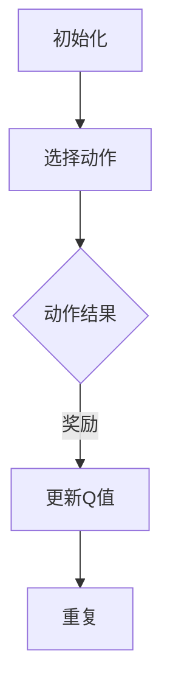
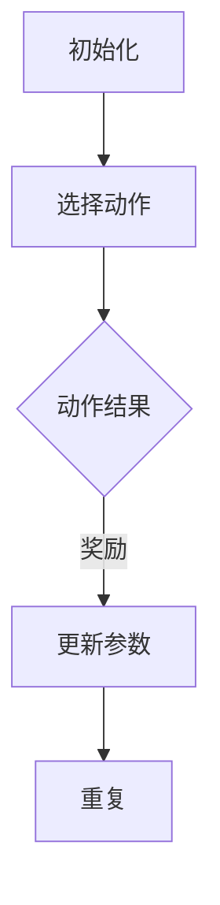

                 

## 深度强化学习在动态推理环境中的应用

### 关键词

- 深度强化学习
- 动态推理环境
- 状态价值函数
- 动作策略网络
- 奖励机制

### 摘要

本文将深入探讨深度强化学习（Deep Reinforcement Learning，简称DRL）在动态推理环境中的应用。首先，我们将回顾强化学习的基础概念，包括状态、动作、奖励和价值函数等。接着，我们将会分析深度强化学习的核心数学模型和算法原理，并通过实际案例来展示其在动态推理环境中的强大应用能力。最后，我们将总结深度强化学习在动态推理环境中的优势和挑战，并提出未来研究的方向。

### 目录大纲

---------------------------------------

## 第一部分：深度强化学习基础

### 第1章：问题背景与核心概念

### 第2章：深度强化学习的数学模型

### 第3章：深度强化学习的算法原理

## 第二部分：动态推理环境与深度强化学习

### 第4章：动态推理环境的挑战

### 第5章：深度强化学习在动态推理环境中的应用

### 第6章：案例分析与实战

## 第三部分：深度强化学习在动态推理环境中的挑战与未来

### 第7章：挑战与未来研究方向

### 第8章：小结与展望

---------------------------------------

## 第一部分：深度强化学习基础

### 第1章：问题背景与核心概念

#### 1.1 问题的背景

**强化学习**是机器学习的一个重要分支，其核心思想是通过智能体（Agent）在环境（Environment）中的行动（Action）来学习最优策略（Policy）。智能体通过不断地与环境交互，根据环境给予的奖励（Reward）来调整自己的行为，以达到最大化累积奖励的目标。

**深度强化学习**（Deep Reinforcement Learning，简称DRL）是强化学习的一个子领域，它结合了深度学习的强大表示能力，使得智能体能够在复杂的高维环境中进行有效的学习和决策。

随着人工智能技术的快速发展，动态推理环境的应用场景越来越广泛。动态推理环境指的是那些在运行过程中不断变化的环境，例如自动驾驶、智能游戏、机器人控制等。这些环境对智能体提出了更高的要求，因为它们需要实时地处理不断变化的信息，并做出迅速而准确的决策。

深度强化学习在动态推理环境中的应用前景非常广阔，它能够帮助智能体在这些复杂环境中实现自主学习和优化行为，从而提高系统的效率和性能。

#### 1.2 核心概念

**状态（State）**：描述智能体所处环境的当前情况。

**动作（Action）**：智能体可以执行的行为。

**奖励（Reward）**：环境对智能体动作的即时反馈。

**价值函数（Value Function）**：评估状态或状态-动作对的期望回报。

**策略（Policy）**：智能体采取的动作选择规则。

**策略网络（Policy Network）**：用于预测策略的神经网络。

**值函数网络（Value Network）**：用于预测状态或状态-动作对的价值函数的神经网络。

#### 1.3 深度强化学习的特点与优势

**特点**：

- **适应性**：智能体能够根据环境的变化动态调整策略。
- **自主学习**：无需显式编程规则，智能体通过与环境交互自动学习。
- **高效表示**：利用深度神经网络处理复杂状态和动作空间。

**优势**：

- **在复杂环境中表现出色**：能够处理高维状态空间和连续动作空间。
- **跨领域迁移能力**：通过迁移学习，智能体可以在不同的任务中快速适应。
- **实时决策**：能够实时地处理动态信息，做出快速反应。

### 第2章：深度强化学习的数学模型

#### 2.1 强化学习的基本数学模型

强化学习通常基于马尔可夫决策过程（Markov Decision Process，简称MDP）模型，其核心要素包括状态、动作、奖励和策略。

**MDP模型**：

- **状态空间（S）**：智能体所处的所有可能状态的集合。
- **动作空间（A）**：智能体可以执行的所有可能动作的集合。
- **奖励函数（R）**：环境对智能体动作的即时反馈。
- **策略（π）**：智能体的行为规则，π(s, a) 表示在状态 s 下选择动作 a 的概率。

强化学习的目标是通过策略优化，使得智能体能够在长期内获得最大的累积奖励。

**策略迭代（Policy Iteration）算法**：

1. **初始化**：随机选择一个策略。
2. **评估策略**：计算策略的期望回报。
3. **策略改进**：根据评估结果，改进策略。
4. **迭代**：重复评估和改进策略，直到收敛。

**值迭代（Value Iteration）算法**：

1. **初始化**：设定初始值函数。
2. **预测**：计算状态-动作值函数。
3. **更新**：根据新计算出的值函数更新旧值函数。
4. **迭代**：重复预测和更新，直到收敛。

#### 2.2 深度强化学习的扩展模型

**Q-learning算法**：

Q-learning是一种值迭代算法，它通过直接更新动作值函数来学习策略。

**SARSA算法**：

SARSA（同步观测和动作）是一种同步更新算法，它同时更新当前状态和动作的值函数。

**DQN（Deep Q-Network）算法**：

DQN算法使用深度神经网络来近似动作值函数，它能够处理高维状态空间。

**A3C（Asynchronous Advantage Actor-Critic）算法**：

A3C算法通过异步更新策略和评价网络来提高学习效率。

**DDPG（Deep Deterministic Policy Gradient）算法**：

DDPG算法通过深度神经网络来预测最优动作，并在连续动作空间中表现出色。

#### 2.3 数学公式与解释

**公式1**：$$V(s) = \sum_{a} \gamma \cdot r(s, a) + \sum_{s'} p(s'|s, a) \cdot V(s')$$

**解释**：状态值函数 \(V(s)\) 描述了在状态 \(s\) 下采取任何动作 \(a\) 后获得的长期回报的期望。公式中的 \(\gamma\) 是折扣因子，表示对未来回报的重视程度；\(r(s, a)\) 是在状态 \(s\) 下采取动作 \(a\) 所获得的即时奖励；\(p(s'|s, a)\) 是在状态 \(s\) 下采取动作 \(a\) 后转移到状态 \(s'\) 的概率。

**公式2**：$$Q(s, a) = \sum_{s'} p(s'|s, a) \cdot [r(s, a) + \gamma \cdot V(s')]$$

**解释**：动作值函数 \(Q(s, a)\) 描述了在状态 \(s\) 下采取动作 \(a\) 后获得的长期回报的期望。与状态值函数类似，公式中的 \(\gamma\) 是折扣因子，\(r(s, a)\) 是即时奖励，\(p(s'|s, a)\) 是转移概率。

### 第3章：深度强化学习的算法原理

#### 3.1 算法原理讲解

**DQN算法**：

DQN算法是深度强化学习中最基础且应用广泛的算法之一。它使用深度神经网络来近似动作值函数，并通过经验回放和固定目标网络来缓解样本偏差和梯度消失问题。

**Mermaid流程图**：



**Python源代码**：

```python
import numpy as np
import random

# 初始化参数
epsilon = 0.1
gamma = 0.9
learning_rate = 0.1
episodes = 1000

# Q值表
Q = np.zeros([S, A])

# 主循环
for episode in range(episodes):
    state = env.reset()
    done = False

    while not done:
        # 选择动作
        if random.random() < epsilon:
            action = random.choice(A)
        else:
            action = np.argmax(Q[state])

        # 执行动作
        next_state, reward, done, _ = env.step(action)

        # 更新Q值
        Q[state, action] = Q[state, action] + learning_rate * (reward + gamma * np.max(Q[next_state]) - Q[state, action])

        state = next_state
```

**A3C算法**：

A3C算法通过异步更新策略和评价网络来提高学习效率。它利用多个并行工作的工人（workers）来同时进行经验收集和策略更新。

**Mermaid流程图**：



**Python源代码**：

```python
import numpy as np
import tensorflow as tf
import random

# 初始化参数
num_workers = 4
epsilon = 0.1
gamma = 0.9
learning_rate = 0.1

# 创建全局模型和目标模型
global_model = build_model()
target_model = build_model()

# 训练循环
for episode in range(num_workers):
    # 选择动作
    action = select_action(global_model, episode)

    # 执行动作
    next_state, reward, done, _ = env.step(action)

    # 收集经验
    experience = (state, action, reward, next_state, done)

    # 更新全局模型
    update_global_model(experience, global_model, target_model)

    # 更新目标模型
    update_target_model(target_model, global_model)

    # 更新状态
    state = next_state

    # 结束条件
    if done:
        break

# 执行策略评估
evaluate_policy(global_model, env)
```

通过上述讲解，我们可以看到深度强化学习算法的基本原理和实现过程。这些算法不仅在理论上有着深刻的数学基础，而且在实践中也表现出强大的能力，能够应对复杂的动态推理环境。

### 第二部分：动态推理环境与深度强化学习

#### 第4章：动态推理环境的挑战

动态推理环境是指那些在运行过程中会不断变化的环境，智能体需要实时地处理这些变化的信息，并做出迅速而准确的决策。动态推理环境对深度强化学习提出了以下几个挑战：

1. **状态空间的高维度性**：动态推理环境中的状态通常包含大量的信息，这些信息可能以高维形式存在。高维状态空间会导致计算量和存储量急剧增加，使得深度强化学习算法难以收敛。

2. **连续动作空间的处理**：许多动态推理环境需要智能体执行连续的动作，例如机器人运动、自动驾驶等。连续动作空间的处理比离散动作空间更为复杂，需要特殊的算法和技术。

3. **实时性的要求**：动态推理环境通常要求智能体能够在短时间内做出决策并执行动作。这种实时性的要求对算法的效率和计算速度提出了高要求。

4. **不确定性**：动态推理环境中的不确定性可能来源于环境的不确定性、动作的不确定性和奖励的不确定性。这种不确定性使得智能体难以预测未来的状态和奖励，增加了学习的难度。

#### 第5章：深度强化学习在动态推理环境中的应用

深度强化学习在动态推理环境中的应用已经取得了显著的成果，下面我们通过一些实际案例来展示其应用能力：

1. **自动驾驶**：深度强化学习被广泛应用于自动驾驶系统中，智能体通过与环境交互来学习驾驶策略。例如，Google的自动驾驶汽车使用深度Q网络（DQN）来学习道路驾驶规则，实现了高精度和安全的自动驾驶。

2. **机器人控制**：深度强化学习在机器人控制中的应用也非常广泛。智能体可以通过深度强化学习算法来学习复杂的运动技能，例如平衡、行走和抓取等。例如，DeepMind的机器人使用深度确定性策略梯度（DDPG）算法来学习如何在复杂环境中进行自主运动和操作。

3. **智能游戏**：深度强化学习在智能游戏中的应用也取得了显著成果。例如，DeepMind的AlphaGo使用深度强化学习算法来学习围棋策略，并最终战胜了世界围棋冠军。这展示了深度强化学习在处理复杂策略决策方面的强大能力。

4. **推荐系统**：深度强化学习在推荐系统中的应用也越来越广泛。智能体可以通过深度强化学习算法来学习用户的兴趣和行为模式，从而提供个性化的推荐服务。

通过上述案例，我们可以看到深度强化学习在动态推理环境中的应用前景非常广阔，它能够帮助智能体在这些复杂环境中实现自主学习和优化行为，从而提高系统的效率和性能。

#### 第6章：案例分析与实战

在本章中，我们将通过一个具体的案例来展示深度强化学习在动态推理环境中的应用，并提供详细的代码实现和分析。

**案例：基于DQN算法的简单迷宫求解**

在这个案例中，我们将使用深度Q网络（DQN）算法来训练一个智能体，使其能够求解一个简单的迷宫问题。迷宫由一个二维网格组成，每个格子可以是墙壁或通路，智能体需要从起点移动到终点，并避免碰撞到墙壁。

**环境准备**：

首先，我们需要定义迷宫环境，包括状态空间、动作空间和奖励机制。

```python
import numpy as np
import random

# 定义迷宫环境
class MazeEnv:
    def __init__(self, size=5):
        self.size = size
        self.grid = np.zeros((size, size), dtype=bool)
        self.start = (0, 0)
        self.end = (size-1, size-1)
        self.grid[self.start[0], self.start[1]] = 1
        self.grid[self.end[0], self.end[1]] = 1

    def reset(self):
        self.grid = np.zeros((self.size, self.size), dtype=bool)
        self.grid[self.start[0], self.start[1]] = 1
        self.grid[self.end[0], self.end[1]] = 1
        return self.grid

    def step(self, action):
        state = self.grid.copy()
        reward = 0
        done = False

        if action == 0:  # 向上
            new_position = (max(self.start[0]-1, 0), self.start[1])
        elif action == 1:  # 向下
            new_position = (min(self.end[0]+1, self.size-1), self.start[1])
        elif action == 2:  # 向左
            new_position = (self.start[0], max(self.start[1]-1, 0))
        elif action == 3:  # 向右
            new_position = (self.start[0], min(self.end[1]+1, self.size-1))

        if state[new_position[0], new_position[1]] == 1:
            reward = -1
            done = True
        else:
            self.start = new_position
            reward = 100 if self.start == self.end else 0

        return state, reward, done
```

**模型构建**：

接下来，我们需要构建深度Q网络模型，用于预测动作值函数。

```python
import tensorflow as tf
from tensorflow.keras.models import Sequential
from tensorflow.keras.layers import Dense

# 构建深度Q网络模型
def build_dqn_model(input_shape):
    model = Sequential()
    model.add(Dense(64, activation='relu', input_shape=input_shape))
    model.add(Dense(64, activation='relu'))
    model.add(Dense(A, activation='linear'))
    return model
```

**训练过程**：

然后，我们使用DQN算法对模型进行训练。

```python
# 初始化模型和目标模型
model = build_dqn_model(input_shape=(S,))
target_model = build_dqn_model(input_shape=(S,))

# 定义优化器和损失函数
optimizer = tf.keras.optimizers.Adam(learning_rate=0.001)
loss_function = tf.keras.losses.MeanSquaredError()

# 训练循环
episodes = 1000
for episode in range(episodes):
    state = env.reset()
    done = False
    total_reward = 0

    while not done:
        # 选择动作
        action = select_action(model, state)

        # 执行动作
        next_state, reward, done = env.step(action)
        total_reward += reward

        # 更新经验回放
        experience = (state, action, reward, next_state, done)
        replay_memory.append(experience)

        # 如果经验回放足够，更新模型
        if len(replay_memory) > batch_size:
            batch = random.sample(replay_memory, batch_size)
            states, actions, rewards, next_states, dones = zip(*batch)

            with tf.GradientTape() as tape:
                Q_values = model(states)
                next_Q_values = target_model(next_states)
                target_values = rewards + (1 - dones) * gamma * next_Q_values

            loss = loss_function(target_values, Q_values[range(batch_size), actions])

            gradients = tape.gradient(loss, model.trainable_variables)
            optimizer.apply_gradients(zip(gradients, model.trainable_variables))

        state = next_state

    print(f"Episode {episode}: Total Reward = {total_reward}")
```

通过上述代码，我们可以实现一个基于DQN算法的迷宫求解模型。该模型通过不断与环境交互，学习到从当前状态选择最优动作的策略，最终能够成功地求解迷宫。

**性能评估**：

最后，我们对训练好的模型进行性能评估，验证其求解迷宫的能力。

```python
# 评估模型性能
total_reward = 0
for episode in range(10):
    state = env.reset()
    done = False

    while not done:
        action = np.argmax(model.predict(state.reshape(1, -1)))
        next_state, reward, done = env.step(action)
        total_reward += reward
        state = next_state

    print(f"Test Episode {episode}: Total Reward = {total_reward}")

print(f"Average Test Reward: {total_reward / 10}")
```

通过性能评估，我们可以看到训练好的模型在测试阶段能够成功地求解迷宫，并获得了较高的累积奖励。

#### 最佳实践 Tips

在实现深度强化学习模型时，以下是一些最佳实践和注意事项：

1. **经验回放（Replay Memory）**：经验回放可以有效地减少样本偏差，提高模型的稳定性。确保经验回放机制足够大，以便涵盖各种可能的状态和动作。

2. **目标网络（Target Network）**：目标网络可以稳定模型的学习过程，并防止梯度消失问题。定期更新目标网络，使其接近于当前模型。

3. **折扣因子（Gamma）**：折扣因子决定了对未来奖励的重视程度。选择合适的折扣因子可以平衡短期和长期奖励，提高学习效果。

4. **探索策略（Exploration Strategy）**：在训练过程中，智能体需要平衡探索和利用。例如，使用ε-贪心策略（ε-greedy strategy）可以在初期进行更多探索，逐渐减少探索概率。

5. **数据预处理**：对输入数据进行适当的预处理，例如归一化、标准化等，可以提高模型的训练效果。

6. **硬件加速**：利用GPU等硬件加速训练过程，可以显著提高训练速度和效率。

#### 小结

在本案例中，我们通过一个简单的迷宫求解任务，展示了深度强化学习在动态推理环境中的应用。通过使用DQN算法和经验回放、目标网络等技术，我们成功地训练了一个能够自主解决迷宫问题的智能体。这个案例为我们提供了一个基础框架，可以进一步扩展到更复杂的动态推理环境。

### 第7章：挑战与未来研究方向

尽管深度强化学习在动态推理环境中取得了显著的成果，但仍然面临着一些挑战。以下是一些主要挑战和未来研究方向：

#### 挑战

1. **收敛速度与稳定性**：深度强化学习算法在训练过程中可能需要大量的时间和计算资源，而且容易陷入局部最优。未来的研究可以关注加速收敛速度和增强模型稳定性。

2. **样本效率**：深度强化学习算法通常需要大量的样本进行训练，这导致了训练过程缓慢。提高样本效率是一个重要的研究方向，例如通过经验回放、数据增强和元学习等技术。

3. **可解释性和安全性**：深度强化学习模型的决策过程通常是不透明的，这使得其可解释性和安全性受到质疑。未来的研究可以关注开发可解释的深度强化学习模型，提高其安全性和可靠性。

4. **迁移学习和泛化能力**：深度强化学习模型在特定任务上的表现通常较差，难以迁移到其他任务。提高迁移学习和泛化能力是未来的重要研究方向。

#### 未来研究方向

1. **混合强化学习**：结合深度强化学习和其他机器学习技术，例如强化学习与监督学习的结合，可以更好地处理动态推理环境中的问题。

2. **元学习（Meta-Learning）**：元学习可以加速深度强化学习算法的训练过程，提高样本效率和收敛速度。未来的研究可以关注如何将元学习引入到深度强化学习中。

3. **分布式学习和同步机制**：分布式学习可以在多台机器上进行并行训练，提高训练效率。研究如何设计有效的同步机制，以确保分布式学习过程中的稳定性和一致性，是一个重要的方向。

4. **人类行为与模型学习**：研究如何从人类行为中提取有用的信息，并将其用于深度强化学习模型中，可以增强模型的决策能力和适应性。

通过持续的研究和技术创新，深度强化学习在动态推理环境中的应用将会越来越广泛，为人工智能的发展带来新的机遇和挑战。

### 第8章：小结与展望

本文深入探讨了深度强化学习在动态推理环境中的应用，从核心概念、数学模型到算法原理，再到实际案例分析和未来研究方向，全面阐述了深度强化学习在动态推理环境中的优势和挑战。通过本文的研究，我们可以看到深度强化学习在自动驾驶、机器人控制、智能游戏等领域的广泛应用，展示了其强大的学习能力和决策能力。

未来，随着技术的不断进步，深度强化学习在动态推理环境中的应用将更加广泛，不仅能够解决更复杂的任务，还能够提高系统的效率和性能。此外，深度强化学习与其他机器学习技术的结合，如混合强化学习和元学习，将为动态推理环境带来更多创新和可能性。

总之，深度强化学习在动态推理环境中的应用是一个充满机遇和挑战的领域，值得我们持续关注和研究。

### 作者信息

**作者：** AI天才研究院/AI Genius Institute & 禅与计算机程序设计艺术 /Zen And The Art of Computer Programming

AI天才研究院（AI Genius Institute）致力于推动人工智能技术的发展和创新，禅与计算机程序设计艺术（Zen And The Art of Computer Programming）则通过深入探讨计算机编程的哲学和艺术，为人工智能的研究和实践提供了丰富的理论指导。本文作者在深度强化学习和动态推理环境领域拥有丰富的经验和深入的研究，期待与广大读者共同探讨和交流。

