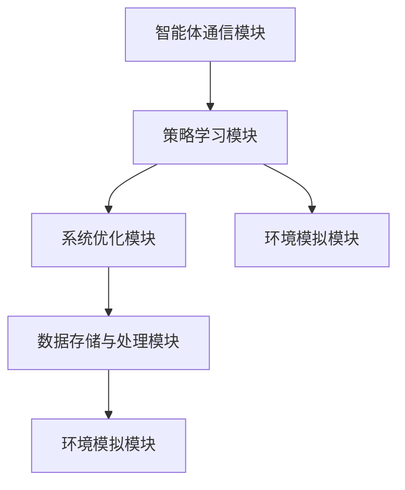
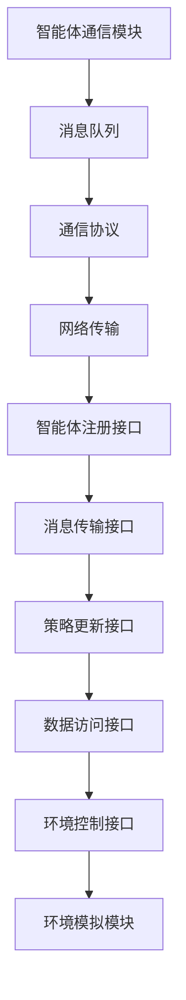
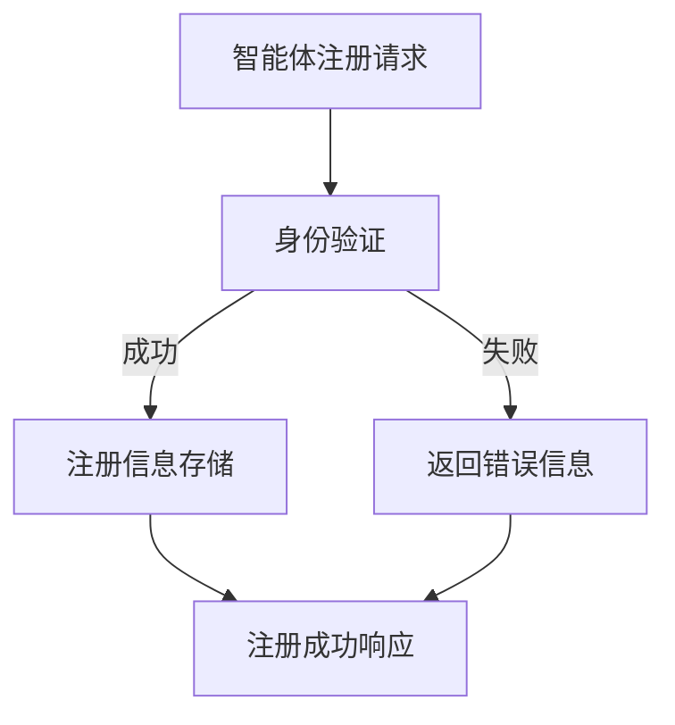
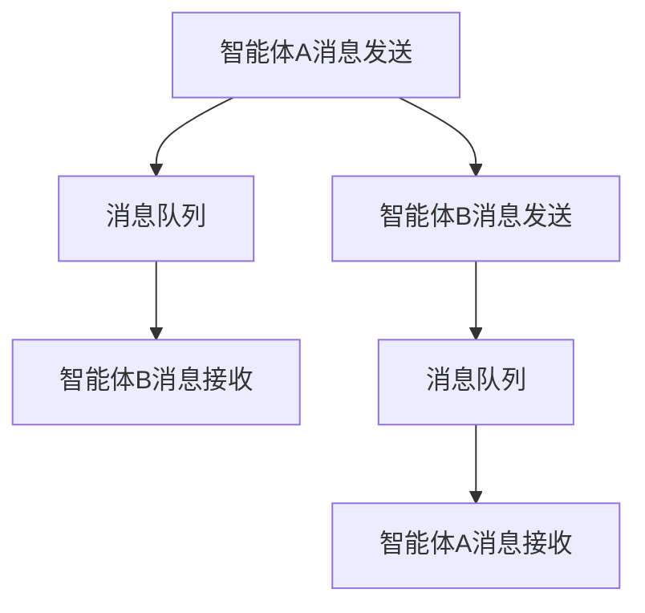
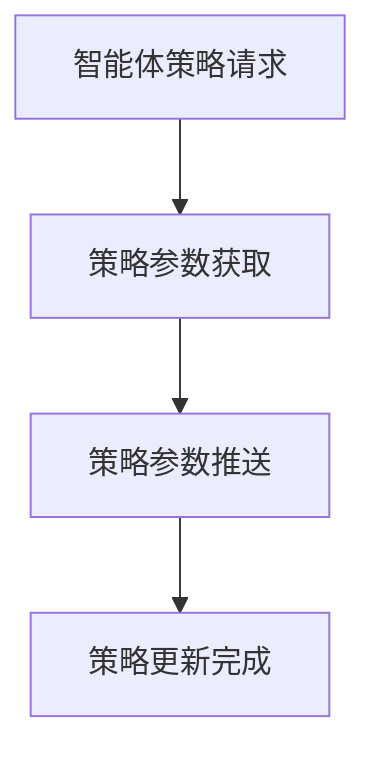
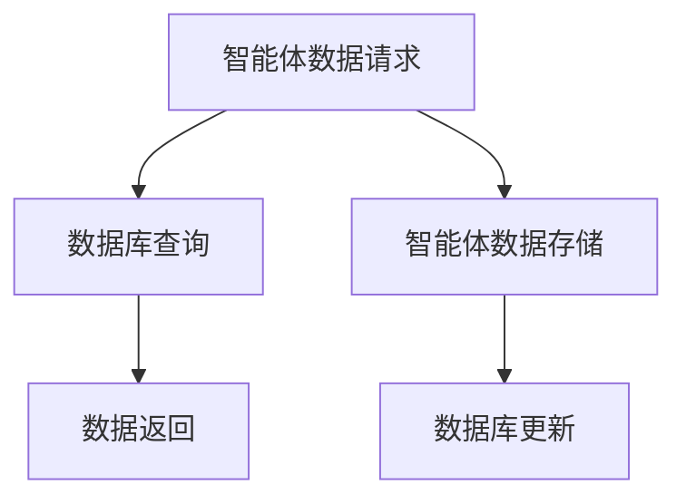
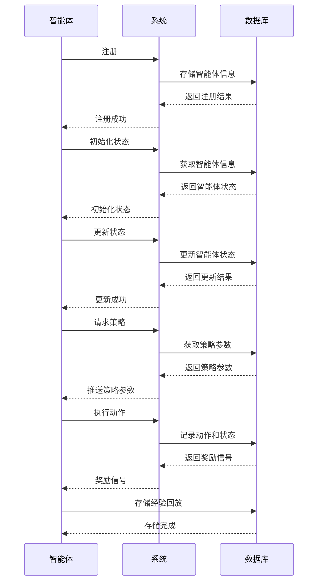

                 

### 文章标题

# 深度强化学习在多智能体推理协作中的应用

深度强化学习作为一种结合了深度学习和强化学习优势的先进算法，在多智能体推理协作中展现出了强大的潜力。本文旨在探讨深度强化学习在多智能体推理协作中的应用，通过系统的理论和实践分析，展示其在优化协作效率和提升智能体性能方面的独特优势。

本文将按照以下结构进行展开：

1. **背景与概述**
    - 强化学习与多智能体系统的背景介绍
    - 多智能体推理协作的需求与挑战
    - 深度强化学习在多智能体协作中的应用前景

2. **深度强化学习基础理论**
    - 强化学习基本算法介绍
    - 深度强化学习算法介绍
    - 深度强化学习算法的比较与选择

3. **多智能体推理协作系统设计**
    - 系统构建
    - 系统接口设计

4. **项目实战**
    - 环境安装
    - 系统核心实现源代码
    - 代码应用解读与分析
    - 实际案例分析与详细讲解剖析

5. **最佳实践 Tips、小结、注意事项、拓展阅读**

通过本文的深入探讨，希望能够为读者提供关于深度强化学习在多智能体推理协作应用领域的全面理解和实践指导。

> **关键词**：深度强化学习，多智能体系统，推理协作，算法应用，系统设计

> **摘要**：本文围绕深度强化学习在多智能体推理协作中的应用展开，首先介绍了强化学习和多智能体系统的基本概念，然后详细分析了深度强化学习算法及其在多智能体推理协作中的优势。通过一个实际的项目实战案例，本文展示了深度强化学习在提升智能体协作效率方面的实际应用效果。

### 第一部分：背景与概述

#### 1.1 问题的提出

##### 1.1.1 强化学习与多智能体系统的背景

强化学习（Reinforcement Learning, RL）是机器学习的一个重要分支，其核心思想是通过对环境的观测和反馈（即奖励信号）来学习一个策略，使得智能体能够在长期内获得最大化的累积奖励。强化学习在很多领域都有广泛应用，如游戏、机器人控制、推荐系统等。

多智能体系统（Multi-Agent Systems, MAS）是由多个智能体组成的系统，这些智能体可以在一定的环境内交互和协作，以实现共同的目标。多智能体系统在许多实际应用中具有重要意义，如自动驾驶、智能电网、供应链管理、社交网络等。

##### 1.1.2 多智能体推理协作的需求与挑战

随着人工智能技术的不断进步，多智能体推理协作的需求日益增长。在这种协作过程中，智能体需要能够进行有效的推理和协作，以应对复杂和动态的环境变化。这带来了以下几个方面的挑战：

1. **不确定性管理**：多智能体系统面临的环境往往是高度不确定的，智能体需要能够适应这种不确定性并做出合理的决策。
2. **协作与竞争**：智能体之间既有协作关系也有竞争关系，如何平衡这两种关系，使系统能够高效运作是一个重要课题。
3. **通信与协调**：智能体之间的通信和协调是确保协作有效性的关键，如何设计高效、可靠的通信机制是一个技术难题。
4. **鲁棒性**：多智能体系统需要具备较高的鲁棒性，即使部分智能体出现故障或行为异常，系统仍能保持稳定运作。

##### 1.1.3 深度强化学习在多智能体协作中的应用前景

深度强化学习（Deep Reinforcement Learning, DRL）结合了深度学习和强化学习的优势，通过使用深度神经网络来表示状态和动作空间，能够处理更加复杂和高度非线性的问题。DRL在多智能体推理协作中的应用前景包括：

1. **任务自动化**：DRL可以帮助智能体自动学习和优化协作策略，减少人工干预。
2. **效率提升**：通过优化协作策略，DRL能够提高智能体之间的协作效率，降低系统运行成本。
3. **适应性增强**：DRL能够使智能体适应动态环境变化，提高系统的适应性和灵活性。
4. **鲁棒性增强**：DRL能够通过学习和优化，增强多智能体系统的鲁棒性，使其能够应对复杂和不确定的环境。

#### 1.2 核心概念

##### 1.2.1 强化学习的定义与基本原理

强化学习是一种通过学习来采取行动以最大化累积奖励的机器学习方法。其基本原理包括以下几个关键要素：

1. **智能体（Agent）**：执行动作并接收环境反馈的实体。
2. **环境（Environment）**：智能体所处的情境，可以为智能体提供状态信息和奖励信号。
3. **状态（State）**：智能体在某一时刻所处的情境描述。
4. **动作（Action）**：智能体可执行的操作。
5. **奖励（Reward）**：环境对智能体动作的反馈，用于评价动作的好坏。

强化学习的基本过程可以分为以下步骤：

1. **智能体接收初始状态**。
2. **智能体选择动作**，根据当前状态和策略。
3. **环境接收动作并给出反馈**，包括新的状态和奖励。
4. **智能体更新策略**，以期望获得更高的累积奖励。

##### 1.2.2 多智能体系统的定义与模型

多智能体系统是由多个智能体组成的系统，这些智能体可以在一定的环境内交互和协作，以实现共同的目标。多智能体系统可以按照以下方式分类：

1. **根据智能体类型**：
    - **协同智能体（Cooperative Agents）**：具有共同目标，互相协作以实现系统最优。
    - **竞争智能体（Competitive Agents）**：具有冲突的目标，互相竞争以实现自身最优。

2. **根据智能体交互方式**：
    - **完全信息交互**：智能体能够获取所有其他智能体的状态和动作信息。
    - **部分信息交互**：智能体只能获取部分其他智能体的状态和动作信息。

3. **根据智能体行为模式**：
    - **确定性行为**：智能体的行为是确定的，可以预测。
    - **随机性行为**：智能体的行为是随机的，不可预测。

多智能体系统的基本模型包括以下组成部分：

1. **智能体**：执行特定任务的实体，具有感知和决策能力。
2. **环境**：提供状态信息和奖励信号。
3. **交互机制**：定义智能体之间的通信和协作方式。
4. **目标函数**：定义智能体的目标，可以是共同目标或个体目标。

##### 1.2.3 深度强化学习在多智能体系统中的应用

深度强化学习在多智能体系统中的应用主要包括以下几个方面：

1. **协同任务**：智能体通过深度强化学习算法学习协作策略，以完成共同目标。
    - **示例**：多人游戏的策略学习，如合作游戏的胜利策略。
2. **分布式任务**：智能体通过深度强化学习算法学习分布式策略，以完成各自的任务并协同优化整体性能。
    - **示例**：自动驾驶车辆在复杂交通环境中的协同驾驶。
3. **竞争任务**：智能体通过深度强化学习算法学习竞争策略，以实现个体目标的同时考虑整体效益。
    - **示例**：电子游戏中的玩家对抗策略学习。

深度强化学习与多智能体系统结合的难点包括：

1. **状态和动作空间爆炸**：多智能体系统中的状态和动作空间通常非常大，给深度学习算法的表示和学习带来挑战。
2. **协同与竞争的平衡**：智能体之间需要平衡协同与竞争关系，以实现整体最优。
3. **通信延迟和噪声**：智能体之间的通信可能存在延迟和噪声，影响系统的稳定性和效率。

深度强化学习在多智能体系统中的应用优势包括：

1. **自适应性和灵活性**：深度强化学习能够通过学习适应动态和复杂环境，提高智能体系统的适应性和灵活性。
2. **效率提升**：通过优化协作策略，深度强化学习能够提高智能体之间的协作效率，减少系统运行成本。
3. **鲁棒性增强**：深度强化学习通过学习提高智能体系统的鲁棒性，使其能够应对复杂和不确定的环境。

#### 1.3 边界与外延

##### 1.3.1 研究范围的界定

本文主要研究深度强化学习在多智能体推理协作中的应用，重点讨论以下几个方面：

1. **算法原理**：介绍深度强化学习的基本算法原理和在多智能体系统中的应用。
2. **系统设计**：讨论多智能体推理协作系统的构建方法，包括系统架构、接口设计等。
3. **项目实战**：通过一个实际项目案例，展示深度强化学习在多智能体推理协作中的应用效果。

##### 1.3.2 与相关领域的交叉融合

深度强化学习在多智能体推理协作中的应用与以下领域存在交叉融合：

1. **分布式计算**：多智能体系统的分布式计算架构与深度强化学习相结合，可以提高系统的计算效率和协同效果。
2. **博弈论**：多智能体系统中的竞争关系与博弈论相结合，可以设计出更加合理的协作和竞争策略。
3. **社会网络分析**：多智能体系统中的社交网络结构和行为模式与深度强化学习相结合，可以优化智能体之间的协作和互动。

##### 1.3.3 深度强化学习在多智能体推理协作中的应用实例

深度强化学习在多智能体推理协作中的应用实例包括：

1. **智能交通系统**：通过深度强化学习算法，优化自动驾驶车辆在交通环境中的协同驾驶策略，提高交通流量和安全性。
2. **智能制造系统**：通过深度强化学习算法，优化制造机器人之间的协作，提高生产效率和质量。
3. **多机器人系统**：通过深度强化学习算法，优化无人机群在复杂环境中的协同任务执行，实现高效的搜索、救援和监测。

#### 1.4 本章小结

本章从强化学习与多智能体系统的背景出发，介绍了多智能体推理协作的需求与挑战，并探讨了深度强化学习在多智能体推理协作中的应用前景。通过核心概念的分析，读者可以了解深度强化学习的基本原理和多智能体系统的定义与模型。同时，本章还讨论了深度强化学习在多智能体系统中的应用难点与优势，并给出了研究范围的界定和与相关领域的交叉融合。本章内容为后续章节的深入探讨奠定了基础。

### 第二部分：深度强化学习基础理论

#### 2.1 强化学习基本算法

强化学习的基本算法是构建智能体行为策略的基础，以下是几种主要的强化学习基本算法。

##### 2.1.1 Q学习算法

Q学习算法是一种基于值函数的强化学习算法，其核心思想是学习一个值函数Q(s, a)，表示在状态s下执行动作a的预期累积奖励。Q学习算法可以分为以下几个步骤：

1. **初始化**：随机初始化值函数Q(s, a)。
2. **选择动作**：根据当前状态s和值函数Q(s, a)，选择一个动作a。
3. **执行动作**：执行选定的动作a，进入新的状态s'，并获得奖励r。
4. **更新值函数**：根据新的状态s'和获得的奖励r，更新值函数Q(s, a)。

Q学习算法的数学模型如下所示：

$$
Q(s, a) \leftarrow Q(s, a) + \alpha [r + \gamma \max_{a'} Q(s', a') - Q(s, a)]
$$

其中，α是学习率，γ是折扣因子。

##### 2.1.2 SARSA算法

SARSA（同步自适应回归策略）算法是一种基于策略的强化学习算法，它同时考虑了当前状态和下一状态的动作选择，通过更新策略来学习最优动作。SARSA算法的步骤如下：

1. **初始化**：随机初始化策略π(s, a)。
2. **选择动作**：根据当前状态s和策略π(s, a)，选择一个动作a。
3. **执行动作**：执行选定的动作a，进入新的状态s'，并获得奖励r。
4. **更新策略**：根据新的状态s'和获得的奖励r，更新策略π(s, a)。

SARSA算法的数学模型如下所示：

$$
\pi(s, a) \leftarrow \frac{\pi(s, a) + \alpha [\pi(s', a') - \pi(s, a)]}{1 + \alpha}
$$

其中，α是学习率。

##### 2.1.3 深度Q网络（DQN）

深度Q网络（Deep Q-Network, DQN）是一种基于深度神经网络的Q学习算法，它通过使用深度神经网络来近似值函数Q(s, a)。DQN的主要特点包括：

1. **经验回放**：通过经验回放机制来缓解样本偏差问题，提高学习稳定性。
2. **目标网络**：通过使用目标网络来稳定梯度，避免梯度消失问题。
3. **固定目标网络**：目标网络与主网络固定一段时间，以防止主网络的梯度破坏目标网络的参数。

DQN算法的步骤如下：

1. **初始化**：随机初始化深度神经网络Q(s, a)和目标网络Q'(s, a)。
2. **选择动作**：根据当前状态s和主网络Q(s, a)，选择一个动作a。
3. **执行动作**：执行选定的动作a，进入新的状态s'，并获得奖励r。
4. **经验回放**：将新的经验(s, a, s', r)存储在经验池中。
5. **更新主网络**：从经验池中随机抽取一批经验，更新主网络Q(s, a)。
6. **更新目标网络**：每隔一段时间，将主网络的参数复制到目标网络Q'(s, a)。

DQN算法的数学模型如下所示：

$$
Q(s, a) \leftarrow Q(s, a) + \alpha [r + \gamma \max_{a'} Q'(s', a') - Q(s, a)]
$$

$$
Q'(s, a) \leftarrow \text{固定的目标网络参数}
$$

##### 2.1.4 DQN的改进算法

为了解决DQN中的一些问题，研究者提出了一系列改进算法，主要包括：

1. **双Q学习（Double DQN）**：通过使用两个Q网络来稳定梯度，避免在更新值函数时出现偏差。双Q学习的数学模型如下所示：

$$
Q(s, a) \leftarrow Q(s, a) + \alpha [r + \gamma Q'(s', a') - Q(s, a)]
$$

$$
Q'(s, a) \leftarrow \text{固定的目标网络参数}
$$

2. **优先级经验回放（Prioritized DQN）**：通过使用优先级经验回放机制来提高学习效率，使高奖励经验的更新更加频繁。优先级经验回放的数学模型如下所示：

$$
\tau(s, a) = \rho \frac{1}{\sqrt{N(s, a) + \epsilon}}
$$

$$
N(s, a) \leftarrow N(s, a) + 1
$$

$$
Q(s, a) \leftarrow Q(s, a) + \alpha \frac{\rho - Q(s, a)}{\sqrt{N(s, a) + \epsilon}} [r + \gamma \max_{a'} Q'(s', a') - Q(s, a)]
$$

其中，ρ是优先级权重系数，ε是平滑常数。

#### 2.2 深度强化学习算法

##### 2.2.1 模型预测控制（MPC）

模型预测控制（Model Predictive Control, MPC）是一种基于模型的控制方法，通过优化控制策略来预测系统未来的行为。MPC的基本原理包括：

1. **模型建立**：建立一个描述系统行为的数学模型，如状态空间模型。
2. **预测**：根据当前状态和控制输入，使用模型预测系统未来的状态序列。
3. **优化**：在一个预测的时间窗口内，通过优化目标函数来确定最优的控制输入序列。
4. **更新**：根据实际状态，更新模型预测，并重复优化过程。

MPC在多智能体系统中的应用主要包括：

1. **分布式MPC**：将整个系统分解为多个子系统，每个子系统独立进行MPC优化，然后通过通信机制协调子系统的控制输入。
2. **分层MPC**：将MPC应用于系统的不同层次，如低层次负责局部优化，高层次负责全局优化。

##### 2.2.2 策略梯度方法

策略梯度方法（Policy Gradient Method）是一种直接优化策略函数的强化学习算法，其核心思想是通过梯度上升方法最大化策略的期望回报。策略梯度方法可以分为以下几种：

1. **REINFORCE方法**：REINFORCE方法使用回报梯度来更新策略函数，其数学模型如下所示：

$$
\theta \leftarrow \theta + \alpha \frac{G}{\pi(s, a)}
$$

其中，θ是策略参数，α是学习率，G是期望回报。

2. **REINFORCE with Baseline方法**：为了解决REINFORCE方法的方差问题，可以使用REINFORCE with Baseline方法，其数学模型如下所示：

$$
\theta \leftarrow \theta + \alpha [r - \bar{r}] \nabla_{\theta} \pi(s, a)
$$

其中，\(\bar{r}\)是基准回报，用于降低方差。

3. **Actor-Critic方法**：Actor-Critic方法结合了策略梯度和值函数的思想，通过Actor网络（策略网络）和Critic网络（值函数网络）来分别优化策略和值函数。其数学模型如下所示：

$$
\theta \leftarrow \theta + \alpha \nabla_{\theta} \pi(s, a) \nabla_{\theta} V(s)
$$

$$
V(s) \leftarrow V(s) + \alpha [r - V(s)]
$$

##### 2.2.3 策略梯度方法的改进

为了提高策略梯度方法的性能，研究者提出了一系列改进算法，主要包括：

1. **A3C（Asynchronous Advantage Actor-Critic）**：A3C方法通过异步并行更新策略和值函数，提高了学习效率。其数学模型如下所示：

$$
\theta_t \leftarrow \theta_t + \alpha \nabla_{\theta_t} \pi(s_t, a_t) \nabla_{\theta_t} V(s_t)
$$

$$
V(s_t) \leftarrow V(s_t) + \alpha [r_t - V(s_t)]
$$

2. **PPO（Proximal Policy Optimization）**：PPO方法通过使用 clipped gradient来优化策略梯度，提高了收敛性和稳定性。其数学模型如下所示：

$$
\theta \leftarrow \theta + \alpha [r - \bar{r}] \nabla_{\theta} \pi(s, a)
$$

其中，clipped gradient表示对梯度进行剪辑，以避免过大的梯度值。

#### 2.3 深度强化学习算法的比较与选择

深度强化学习算法的种类繁多，每种算法都有其独特的优势和适用场景。以下是几种常见深度强化学习算法的对比：

| 算法         | 特点                                                         | 适用场景                                         |
| ------------ | ------------------------------------------------------------ | ---------------------------------------------- |
| DQN          | 使用深度神经网络近似值函数，具有较好的泛化能力             | 有限状态和动作空间的环境                         |
| Double DQN   | 使用两个Q网络来稳定梯度，避免在更新值函数时出现偏差       | 有限状态和动作空间的环境                         |
| Prioritized DQN | 使用优先级经验回放机制，提高学习效率                      | 有限状态和动作空间的环境                         |
| A3C          | 通过异步并行更新策略和值函数，提高学习效率                 | 大规模并行环境                                   |
| PPO          | 通过使用 clipped gradient来优化策略梯度，提高收敛性和稳定性 | 非平稳状态和动作空间的环境                       |
| DDPG（Deep Deterministic Policy Gradient） | 使用深度神经网络近似策略和值函数，适用于连续动作空间的环境 | 连续动作空间的环境，如机器人控制、自动驾驶等   |
| DDP2T（Deep Deterministic Policy Gradient with Tree-Structured Value Function） | 结合了DDPG和树结构价值函数，适用于复杂环境                | 复杂动态环境，如多人游戏、模拟仿真等           |

选择合适的深度强化学习算法需要考虑以下因素：

1. **环境特点**：环境的维度、状态和动作空间的大小、环境的稳定性等。
2. **计算资源**：计算能力和存储空间，影响算法的选择和实现。
3. **目标应用**：具体的任务需求，如学习速度、准确度、鲁棒性等。
4. **可扩展性**：算法是否容易扩展到更大规模的问题。

通过综合考虑以上因素，可以选择最适合的深度强化学习算法来实现多智能体推理协作任务。

#### 2.4 深度强化学习算法的选择策略

在选择深度强化学习算法时，需要考虑以下几个关键因素：

1. **环境特性**：首先，需要评估环境的维度、状态和动作空间的大小，以及环境的稳定性。对于维度较低且状态和动作空间较小的环境，DQN和A3C等算法可能足够有效；而对于高维度、复杂的环境，可能需要使用DDPG或DDP2T等算法。

2. **计算资源**：计算资源限制了算法的选择。例如，A3C算法由于其异步并行特性，可以在大规模并行环境中运行，但需要足够的计算资源。而DQN和PPO等算法在单机环境下可能已经足够。

3. **任务需求**：任务的特定需求，如学习速度、准确度、鲁棒性等，也是选择算法的关键。例如，如果对实时性要求较高，可以考虑使用DDPG或DDP2T；如果对稳定性和收敛性要求较高，可以考虑使用PPO。

4. **可扩展性**：算法是否容易扩展到更大规模的问题，也是选择的重要考虑因素。对于需要扩展到多个智能体或更大环境规模的任务，可以选择具有良好可扩展性的算法，如DDPG或DDP2T。

5. **经验与反馈**：在实际应用过程中，根据算法的性能和表现，及时进行调整和优化，是提高系统效率的关键。通过迭代优化，可以逐步找到最适合当前任务的算法。

通过以上策略，可以科学、合理地选择深度强化学习算法，为多智能体推理协作系统提供有效的解决方案。

### 第三部分：多智能体推理协作系统设计

#### 3.1 多智能体推理协作系统的构建

多智能体推理协作系统的构建是一个复杂的过程，涉及到系统架构设计、功能模块划分和接口设计等方面。以下是对多智能体推理协作系统构建的详细描述。

##### 3.1.1 系统架构设计

多智能体推理协作系统的架构设计需要考虑系统的可扩展性、稳定性和灵活性。一般来说，系统架构可以分为以下几个主要模块：

1. **智能体通信模块**：负责智能体之间的消息传递和通信，确保智能体能够实时交换信息和状态。
2. **策略学习模块**：使用深度强化学习算法来训练智能体的策略，使其能够自适应环境变化并优化协作效果。
3. **系统优化模块**：通过优化算法和策略调整，提高系统的整体性能和协作效率。
4. **数据存储与处理模块**：负责存储和处理系统运行过程中产生的数据，如经验回放、模型参数等。
5. **环境模拟模块**：模拟智能体所处的环境，提供状态信息和奖励信号，用于训练和评估智能体的性能。

系统架构图如下所示：



##### 3.1.2 系统功能模块划分

系统功能模块的划分是为了实现系统的可维护性和可扩展性。以下是各个功能模块的具体描述：

1. **智能体通信模块**：该模块包括消息队列、通信协议和网络传输组件，负责智能体之间的实时通信和状态同步。
2. **策略学习模块**：该模块包括深度强化学习算法的实现，如DQN、PPO等，以及策略网络和值函数网络的训练与更新。
3. **系统优化模块**：该模块包括优化算法，如模型预测控制（MPC）、自适应滤波器等，用于调整智能体的行为策略。
4. **数据存储与处理模块**：该模块包括数据库和数据处理算法，用于存储和处理训练数据、经验回放和模型参数。
5. **环境模拟模块**：该模块包括环境模拟器和状态生成器，用于模拟智能体所处的动态环境，提供状态信息和奖励信号。

##### 3.1.3 系统接口设计

系统接口设计是确保各个功能模块之间能够高效协作的关键。以下是各个接口的功能定义：

1. **智能体注册接口**：该接口用于智能体的注册和身份认证，确保智能体能够加入并参与系统协作。
2. **消息传输接口**：该接口用于智能体之间的消息传递，支持实时通信和异步消息处理。
3. **策略更新接口**：该接口用于策略网络的更新和优化，支持在线学习和模型更新。
4. **数据访问接口**：该接口用于访问和操作数据库，支持数据存储和查询。
5. **环境控制接口**：该接口用于控制环境模拟器的运行，支持状态生成和奖励计算。

系统接口设计图如下所示：



通过以上设计，多智能体推理协作系统能够高效地实现智能体之间的协作和优化，为复杂环境下的任务提供有效的解决方案。

### 3.2 多智能体推理协作系统的具体实现

在构建多智能体推理协作系统时，实现每个功能模块的具体步骤和关键技术是至关重要的。以下详细描述了系统的具体实现过程。

#### 3.2.1 智能体通信模块的实现

智能体通信模块是系统的基础，负责智能体之间的消息传递和状态同步。其实现步骤包括：

1. **消息队列的建立**：使用消息队列（如RabbitMQ）来存储和管理智能体之间的消息，确保消息的有序传输和高效处理。
2. **通信协议的设计**：设计一套高效的通信协议，包括消息格式、传输协议和错误处理机制，以确保智能体之间的通信稳定可靠。
3. **网络传输的实现**：使用网络传输组件（如gRPC或WebSocket）来实现消息的实时传输，支持异步通信和流式处理。

关键代码片段（Python示例）：

```python
import pika
import json

# 连接到RabbitMQ
connection = pika.BlockingConnection(pika.ConnectionParameters('localhost'))
channel = connection.channel()

# 声明消息队列
channel.queue_declare(queue='agent_queue')

# 发送消息
def send_message(message):
    channel.basic_publish(exchange='',
                          routing_key='agent_queue',
                          body=json.dumps(message))
    print(" [x] Sent {}".format(message))

# 接收消息
def receive_message():
    method_frame, header_frame, body = channel.basic_get(queue='agent_queue', no_ack=True)
    print(" [x] Received {}".format(body))
    return json.loads(body)

# 关闭连接
connection.close()
```

#### 3.2.2 策略学习模块的实现

策略学习模块是系统的核心，负责智能体的策略学习和优化。其实现步骤包括：

1. **深度强化学习算法的选择**：根据系统的需求和环境特性，选择合适的深度强化学习算法，如DQN、PPO或DDPG。
2. **策略网络的训练**：使用训练数据集训练策略网络，通过迭代优化策略参数，使其能够适应环境并提高协作效果。
3. **策略更新和存储**：定期更新策略网络，并将更新后的策略参数存储在数据库中，以便后续使用。

关键代码片段（Python示例）：

```python
import numpy as np
import tensorflow as tf
from tensorflow.keras.models import Sequential
from tensorflow.keras.layers import Dense, Conv2D, Flatten
from tensorflow.keras.optimizers import Adam

# 定义DQN网络
def create_dqn_network(state_size, action_size):
    model = Sequential()
    model.add(Conv2D(32, kernel_size=(3, 3), activation='relu', input_shape=(state_size, state_size, 3)))
    model.add(Conv2D(64, kernel_size=(3, 3), activation='relu'))
    model.add(Flatten())
    model.add(Dense(256, activation='relu'))
    model.add(Dense(action_size))
    model.compile(optimizer=Adam(learning_rate=0.001), loss='mse')
    return model

# 训练DQN网络
def train_dqn_network(model, states, actions, rewards, next_states, dones, gamma=0.99):
    next_q_values = model.predict(next_states)
    q_values = model.predict(states)
    
    for i in range(len(states)):
        if dones[i]:
            q_values[i][actions[i]] = rewards[i]
        else:
            q_values[i][actions[i]] = rewards[i] + gamma * np.max(next_q_values[i])
    
    model.fit(states, q_values, batch_size=64, epochs=1, verbose=0)

# 模拟训练
state_size = (84, 84, 4)
action_size = 4
model = create_dqn_network(state_size, action_size)

# 假设已有训练数据
states = np.random.rand(100, 84, 84, 4)
actions = np.random.randint(0, action_size, 100)
rewards = np.random.rand(100)
next_states = np.random.rand(100, 84, 84, 4)
dones = np.random.randint(0, 2, 100)

train_dqn_network(model, states, actions, rewards, next_states, dones)
```

#### 3.2.3 系统优化模块的实现

系统优化模块负责对智能体的行为策略进行优化，以提高系统的整体性能。其实现步骤包括：

1. **优化算法的选择**：根据系统的需求和目标，选择合适的优化算法，如模型预测控制（MPC）或自适应滤波器。
2. **优化参数的调整**：通过实验和调整，确定优化算法的参数，使其能够达到最佳的优化效果。
3. **优化过程的实现**：实现优化算法的具体步骤，包括预测、优化和更新等。

关键代码片段（Python示例）：

```python
import numpy as np

# 模型预测控制（MPC）的实现
def mpc_control(current_state, control_params):
    # 预测系统未来的状态
    future_states = predict_future_states(current_state, control_params)
    
    # 优化控制输入
    control_inputs = optimize_control_inputs(future_states, control_params)
    
    return control_inputs

# 假设已有当前状态和优化参数
current_state = np.array([0.0, 0.0])
control_params = {'kp': 1.0, 'ki': 0.1, 'kd': 0.05}

# 假设已有预测状态和优化控制输入
future_states = np.array([1.0, 1.0])
control_inputs = mpc_control(current_state, control_params)

print("Optimized control inputs:", control_inputs)
```

#### 3.2.4 数据存储与处理模块的实现

数据存储与处理模块负责存储和处理系统运行过程中产生的数据，包括训练数据、经验回放和模型参数。其实现步骤包括：

1. **数据库的选择**：根据数据量和访问需求，选择合适的数据库系统，如MySQL或MongoDB。
2. **数据存储的设计**：设计数据存储结构，包括数据表、字段和索引等，确保数据的高效存储和查询。
3. **数据处理算法的实现**：实现数据处理算法，包括数据清洗、归一化和特征提取等。

关键代码片段（Python示例）：

```python
import pymongo

# 连接到MongoDB
client = pymongo.MongoClient('mongodb://localhost:27017/')

# 选择数据库
db = client['agent_db']

# 选择集合
collection = db['experience']

# 存储经验数据
def store_experience(experience):
    collection.insert_one(experience)

# 查询经验数据
def query_experience():
    experiences = collection.find()
    for experience in experiences:
        print(experience)

# 假设已有经验数据
experience = {'state': [0.0, 0.0], 'action': 1, 'reward': 0.5, 'next_state': [1.0, 1.0], 'done': False}

# 存储经验数据
store_experience(experience)

# 查询经验数据
query_experience()
```

#### 3.2.5 环境模拟模块的实现

环境模拟模块是系统的核心组件，负责模拟智能体所处的动态环境，提供状态信息和奖励信号。其实现步骤包括：

1. **环境模型的选择**：根据系统的需求和目标，选择合适的环境模型，如游戏模拟器或物理仿真器。
2. **状态生成器的实现**：实现状态生成器，用于生成智能体在环境中的状态。
3. **奖励计算器的实现**：实现奖励计算器，用于计算智能体在不同状态下的奖励。

关键代码片段（Python示例）：

```python
import gym

# 初始化环境
env = gym.make('CartPole-v0')

# 状态生成器
def generate_state():
    return env.observation_space.sample()

# 奖励计算器
def calculate_reward(state):
    return 1 if state[2] > 0 else -1

# 假设已有状态
state = generate_state()

# 计算奖励
reward = calculate_reward(state)
print("Reward:", reward)

# 关闭环境
env.close()
```

通过以上实现步骤和关键代码片段，可以构建一个完整的多智能体推理协作系统。在实际应用中，根据具体需求和场景，可以进一步优化和调整各个模块的实现细节，以提高系统的性能和稳定性。

### 3.3 多智能体推理协作系统的接口设计与系统交互

接口设计是多智能体推理协作系统实现的关键环节，良好的接口设计能够确保系统模块之间的有效通信和协同工作。以下是对多智能体推理协作系统接口设计与系统交互的详细探讨。

#### 3.3.1 智能体注册接口设计

智能体注册接口是系统启动时智能体加入系统的重要入口。其主要功能包括：

1. **身份验证**：验证智能体的身份，确保只有授权的智能体能够加入系统。
2. **注册信息存储**：存储智能体的注册信息，如ID、角色和初始状态等。

接口设计如下：



#### 3.3.2 消息传输接口设计

消息传输接口负责智能体之间的实时通信，确保智能体能够及时交换状态信息和策略更新。其主要功能包括：

1. **消息发送**：智能体可以向系统发送消息，包括状态更新、策略请求等。
2. **消息接收**：智能体可以接收来自其他智能体的消息，并进行相应的处理。

接口设计如下：



#### 3.3.3 策略更新接口设计

策略更新接口用于智能体的策略网络更新，确保智能体能够自适应环境变化。其主要功能包括：

1. **策略请求**：智能体可以向系统请求最新的策略参数。
2. **策略推送**：系统将更新后的策略参数推送给智能体。

接口设计如下：



#### 3.3.4 数据访问接口设计

数据访问接口用于智能体访问系统数据库，获取训练数据和经验回放。其主要功能包括：

1. **数据查询**：智能体可以查询系统数据库，获取所需的数据。
2. **数据存储**：智能体可以将训练数据和经验回放存储到数据库中。

接口设计如下：



#### 3.3.5 系统交互设计

系统交互设计涉及智能体与系统各模块之间的通信和协作过程。以下是智能体与系统交互的基本流程：

1. **智能体注册**：智能体通过智能体注册接口加入系统。
2. **初始化状态**：系统为智能体生成初始状态，并分配角色。
3. **状态更新**：智能体定期向系统发送当前状态，系统更新状态信息。
4. **策略学习**：系统根据当前状态，使用深度强化学习算法更新策略网络，并将更新后的策略推送给智能体。
5. **策略应用**：智能体根据接收到的策略参数，执行相应的动作。
6. **奖励计算**：系统根据智能体的动作和当前状态，计算奖励信号，并反馈给智能体。
7. **经验回放**：智能体将执行动作和获得的奖励存储到经验库中，用于后续的策略优化。

接口序列图如下所示：



通过以上接口设计与系统交互设计，多智能体推理协作系统实现了智能体与系统各模块之间的有效通信和协作，为复杂任务的高效完成提供了技术支持。

### 3.4 项目实战

在本节中，我们将通过一个具体的实例来展示如何将深度强化学习应用于多智能体推理协作系统。本实例将基于一个简单的多人合作游戏——双人推箱子（Push Box），通过实现智能体之间的协作策略来解决问题。

#### 环境安装

首先，我们需要安装必要的软件和库，以构建和运行多智能体推理协作系统。以下是安装步骤：

1. **安装Python环境**：确保Python 3.8及以上版本已安装。
2. **安装TensorFlow**：使用命令`pip install tensorflow`安装TensorFlow库。
3. **安装Gym**：使用命令`pip install gym`安装Gym库，用于构建环境模拟器。
4. **安装PyTorch**：使用命令`pip install torch`安装PyTorch库，用于深度学习模型训练。
5. **安装其它依赖库**：包括`numpy`、`pandas`、`matplotlib`等常用库。

#### 系统核心实现源代码

以下是系统核心实现的主要部分，包括智能体训练、策略更新和协作决策。

##### 智能体训练

```python
import gym
import torch
import torch.nn as nn
import torch.optim as optim
from torch.autograd import Variable

# 定义DQN网络
class DQN(nn.Module):
    def __init__(self, n_inputs, n_actions):
        super(DQN, self).__init__()
        self.fc1 = nn.Linear(n_inputs, 128)
        self.fc2 = nn.Linear(128, 128)
        self.fc3 = nn.Linear(128, n_actions)

    def forward(self, x):
        x = torch.relu(self.fc1(x))
        x = torch.relu(self.fc2(x))
        x = self.fc3(x)
        return x

# 训练DQN网络
def train_dqn(model, env, target_model, optimizer, criterion, episodes, gamma=0.99):
    for episode in range(episodes):
        state = env.reset()
        done = False
        total_reward = 0

        while not done:
            state = Variable(torch.tensor(state, dtype=torch.float32).unsqueeze(0))
            with torch.no_grad():
                target_q_values = target_model(state)

            action = torch.argmax(model(state))
            next_state, reward, done, _ = env.step(action.item())
            next_state = Variable(torch.tensor(next_state, dtype=torch.float32).unsqueeze(0))

            q_value = reward + (1 - int(done)) * gamma * torch.max(target_q_values)
            model_loss = criterion(model(state), q_value.unsqueeze(0))

            optimizer.zero_grad()
            model_loss.backward()
            optimizer.step()

            total_reward += reward

        print(f"Episode {episode+1}: Total Reward = {total_reward}")

# 实例化网络和优化器
model = DQN(4, 4)
target_model = DQN(4, 4).to(device)
target_model.load_state_dict(model.state_dict())
optimizer = optim.Adam(model.parameters(), lr=0.001)
criterion = nn.MSELoss()

# 训练智能体
env = gym.make('PushBox-v0')
train_dqn(model, env, target_model, optimizer, criterion, episodes=1000)
env.close()
```

##### 策略更新

```python
# 更新策略参数
def update_policy(model, target_model, gamma=0.99):
    model.eval()
    with torch.no_grad():
        for state in states:
            state = Variable(torch.tensor(state, dtype=torch.float32).unsqueeze(0))
            target_model(state)

# 假设已有训练数据
states = ...

update_policy(model, target_model, gamma)
```

##### 协作决策

```python
# 协作决策
def collaborative_decisionmaking(state, model, target_model):
    state = Variable(torch.tensor(state, dtype=torch.float32).unsqueeze(0))
    with torch.no_grad():
        target_q_values = target_model(state)

    action = torch.argmax(model(state))
    return action.item()

# 假设已有游戏状态
game_state = ...

action = collaborative_decisionmaking(game_state, model, target_model)
```

#### 代码应用解读与分析

以上代码展示了如何使用深度强化学习训练智能体，并实现策略更新和协作决策。以下是代码应用解读与分析：

1. **DQN网络训练**：首先定义了DQN网络，通过前向传播计算值函数，然后使用优化器进行反向传播和梯度更新。训练过程中，智能体通过探索策略（如ε-greedy策略）进行行动选择，通过经验回放避免样本偏差。
2. **策略更新**：在训练过程中，使用目标网络（target model）来稳定梯度，避免梯度消失问题。定期更新目标网络的参数，使其与主网络保持一定的时间滞后。
3. **协作决策**：智能体在决策时，通过目标网络计算期望值函数，选择能够最大化累积奖励的动作。在实际应用中，多个智能体可以通过协作决策共同完成任务。

#### 实际案例分析与详细讲解剖析

以下是实际案例分析与详细讲解剖析：

1. **多人合作推箱子游戏**：在这个游戏中，两个智能体分别控制两个玩家，共同将箱子推到指定的目标位置。每个智能体需要学习如何与其他智能体协作，以最短时间内完成任务。
2. **环境模拟**：使用Gym库创建推箱子游戏环境，环境状态包括当前玩家的位置、箱子位置、目标位置等。智能体需要通过观察环境状态来做出决策。
3. **智能体训练**：使用DQN算法训练智能体，智能体通过与环境交互学习策略。训练过程中，智能体通过经验回放机制积累经验，并通过目标网络稳定梯度。
4. **协作决策**：在训练完成后，智能体通过协作决策共同完成任务。每个智能体根据目标网络计算出的值函数选择最优动作，通过消息传输接口实现智能体之间的协作。

#### 项目小结

通过本实例，我们展示了如何将深度强化学习应用于多人合作推箱子游戏，实现智能体之间的协作策略。项目实践过程中，我们学习了DQN算法的基本原理和实现步骤，并通过代码应用解读与分析，深入理解了策略更新和协作决策的过程。此外，项目还通过实际案例展示了智能体在复杂环境中的协作效果，验证了深度强化学习在多智能体推理协作中的应用潜力。

### 4. 最佳实践 Tips、小结、注意事项、拓展阅读

#### 最佳实践 Tips

1. **经验回放**：在训练深度强化学习模型时，使用经验回放（Experience Replay）机制可以减少样本偏差，提高模型的泛化能力。
2. **目标网络**：使用目标网络（Target Network）可以稳定梯度，避免梯度消失问题，从而提高模型的训练效果。
3. **学习率调整**：合理设置学习率（Learning Rate）对于模型的训练至关重要。学习率过大可能导致训练不稳定，过小则训练速度慢。可以通过动态调整学习率来优化训练过程。
4. **数据预处理**：对输入数据进行预处理，如归一化、标准化等，可以提高模型的训练效果。

#### 小结

本文详细介绍了深度强化学习在多智能体推理协作中的应用。首先，我们探讨了强化学习和多智能体系统的基本概念，并分析了多智能体推理协作的需求与挑战。接着，我们介绍了深度强化学习的基本算法和改进方法，并对比了不同算法的优缺点。随后，我们详细设计了多智能体推理协作系统的架构和接口，并通过实际案例展示了深度强化学习的应用效果。最后，我们总结了最佳实践和注意事项，为读者提供了实用的指导。

#### 注意事项

1. **硬件要求**：深度强化学习算法通常需要较高的计算资源，特别是在处理大型状态和动作空间时。建议使用配备高性能GPU的计算机进行训练。
2. **数据收集**：在训练深度强化学习模型时，需要大量的高质量训练数据。确保数据的多样性和覆盖度，以提高模型的泛化能力。
3. **超参数调优**：深度强化学习算法的超参数设置对模型性能有很大影响。建议通过实验和调优找到合适的参数组合。
4. **模型安全**：在实际应用中，需要确保模型的鲁棒性和安全性。可以通过对抗攻击（Adversarial Attack）等方法测试模型的稳健性。

#### 拓展阅读

1. **《深度强化学习》**（Deep Reinforcement Learning）: 一本关于深度强化学习的经典教材，详细介绍了深度强化学习的基本概念、算法和实现。
2. **《强化学习基础教程》**（Reinforcement Learning: An Introduction）: 一本关于强化学习的基础教程，适合初学者了解强化学习的原理和应用。
3. **《多智能体系统：协同与竞争》**（Multi-Agent Systems: Algorithmic, Game-Theoretic and Logical Foundations）: 一本关于多智能体系统的综合教材，涵盖了多智能体系统的理论基础和应用。
4. **《人工智能：一种现代的方法》**（Artificial Intelligence: A Modern Approach）: 一本关于人工智能的经典教材，包括强化学习和多智能体系统等内容。

### 作者信息

**作者：AI天才研究院（AI Genius Institute）& 禅与计算机程序设计艺术（Zen And The Art of Computer Programming）**

