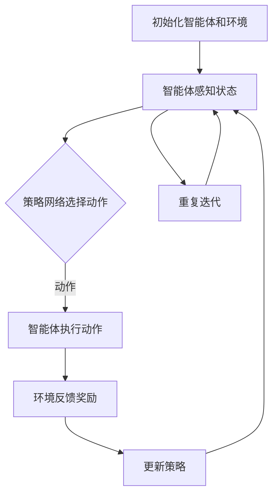
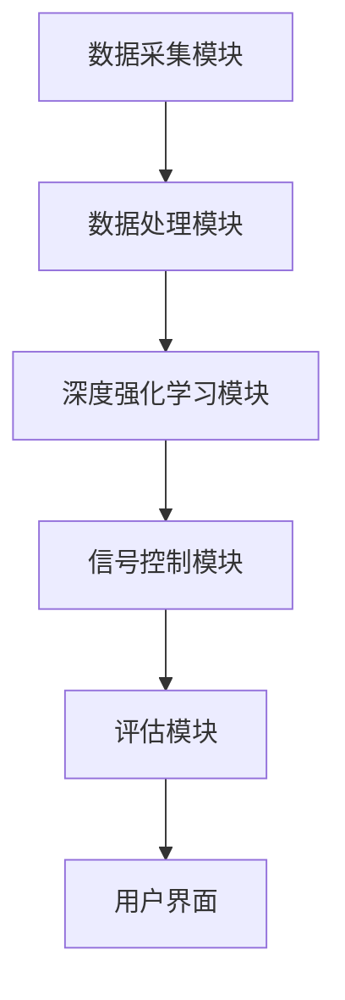
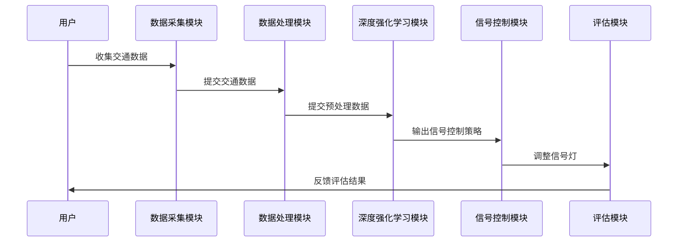

                 

## 深度强化学习在推理过程优化中的作用

### 关键词：
- 深度强化学习
- 推理过程优化
- 自适应优化
- 策略学习
- 强化学习算法

### 摘要：
本文深入探讨了深度强化学习在推理过程优化中的应用。首先，介绍了深度强化学习的基本原理及其与推理过程优化相关的核心概念和属性特征。接着，通过算法原理讲解，详细阐述了深度强化学习的数学模型和流程，并通过Python源代码实现和Mermaid流程图进行了通俗易懂的举例说明。最后，本文探讨了深度强化学习在推理过程优化中的系统架构设计方案，以及如何在实际项目中应用和优化，为相关领域的研究者和开发者提供了有价值的参考。

## 第一部分：背景介绍

### 1.1 问题背景

深度强化学习（Deep Reinforcement Learning，简称DRL）是人工智能领域的一个重要分支，它结合了深度学习和强化学习的优势，旨在通过智能体与环境之间的交互来学习最优策略。近年来，随着互联网和物联网的快速发展，大量的数据不断产生，这对数据处理和优化提出了更高的要求。特别是在推理过程优化方面，如何在复杂、动态的环境中高效地进行推理，成为了许多领域亟待解决的问题。

在金融风险评估、智能制造、智能交通等领域，推理过程优化具有重要的实际应用价值。例如，在金融风险评估中，如何通过大量历史数据进行预测，以降低风险；在智能制造中，如何优化生产线的调度和资源分配，以提高生产效率；在智能交通中，如何通过实时数据处理和优化交通信号控制，以缓解交通拥堵。这些问题的解决，往往依赖于高效的推理过程优化算法。

### 1.2 问题描述

推理过程优化涉及多个方面，主要包括数据的预处理、特征提取、模型选择和优化等。在传统的优化方法中，通常采用启发式算法、线性规划、梯度下降等方法。然而，这些方法在处理大规模、高维度数据时，往往效果不佳，无法满足实际需求。

深度强化学习作为一种新兴的机器学习方法，通过模拟智能体在环境中的交互过程，不断调整策略，从而实现优化目标。与传统的优化方法相比，深度强化学习具有以下优势：

1. **自我学习能力**：深度强化学习能够通过自我学习，从数据中自动提取特征，并不断优化策略。
2. **自适应能力**：深度强化学习能够根据环境的变化，自适应地调整策略，以实现最优的优化效果。
3. **高效性**：深度强化学习通过深度神经网络的学习，能够处理大规模、高维度数据，提高推理的效率和准确性。

因此，深度强化学习在推理过程优化中具有广泛的应用前景。

### 1.3 问题解决

深度强化学习通过以下步骤实现推理过程优化：

1. **环境定义**：明确推理任务的目标和约束条件，建立虚拟环境，模拟真实环境中的各种情况。
2. **策略学习**：利用深度神经网络学习智能体的决策策略，通过策略网络预测最佳行动。
3. **模型评估**：通过模拟或实际运行来评估策略的有效性，根据评估结果调整策略。

深度强化学习在推理过程优化中的应用，不仅解决了传统方法在处理大规模、高维度数据时的问题，还能够实现自适应优化，提高推理的效率和准确性。

### 1.4 边界与外延

深度强化学习在推理过程优化中的应用主要涉及以下几个方面：

1. **环境定义**：明确推理任务的目标和约束条件，建立虚拟环境，模拟真实环境中的各种情况。
2. **策略学习**：利用深度神经网络学习智能体的决策策略，通过策略网络预测最佳行动。
3. **模型评估**：通过模拟或实际运行来评估策略的有效性，根据评估结果调整策略。

深度强化学习在推理过程优化中的应用，不仅解决了传统方法在处理大规模、高维度数据时的问题，还能够实现自适应优化，提高推理的效率和准确性。

### 1.5 概念结构与核心要素组成

深度强化学习在推理过程优化的核心概念包括：

- **智能体（Agent）**：执行决策的主体，可以是计算机程序或机器人。
- **环境（Environment）**：智能体进行决策和执行行动的场所。
- **策略（Policy）**：智能体根据环境状态选择行动的规则。
- **奖励（Reward）**：评估智能体行动结果的反馈信号。

智能体通过与环境交互，不断调整策略，以实现优化目标。在深度强化学习中，智能体通常使用深度神经网络进行策略学习，从而实现高效的推理过程优化。

## 第二部分：核心概念与联系

### 2.1 深度强化学习原理

深度强化学习（DRL）是一种结合了深度学习和强化学习的机器学习方法。它通过智能体在环境中进行学习，不断调整策略，以实现优化目标。DRL的基本原理包括以下几个关键概念：

1. **状态（State）**：描述智能体当前所处环境的状态信息。
2. **动作（Action）**：智能体可执行的行为。
3. **状态-动作价值函数（Q-Function）**：预测在某个状态下执行某个动作的预期奖励。
4. **策略（Policy）**：确定智能体在各个状态下应采取的动作。

在DRL中，智能体通过与环境交互，不断更新状态-动作价值函数，从而优化策略。这个过程可以看作是一个值迭代过程，即智能体通过不断试错，逐渐找到最优策略。

### 2.2 深度强化学习属性特征对比表格

| 特征                | 深度学习                                       | 强化学习                                       | 深度强化学习                                      |
|---------------------|------------------------------------------------|------------------------------------------------|---------------------------------------------------|
| 数据需求            | 大规模数据集                                    | 小样本数据集                                    | 大规模数据集，同时需要历史交互数据                  |
| 算法复杂度          | 计算量大，但相对稳定                           | 计算量大，且随训练过程动态变化                    | 计算量大，但可通过策略优化和经验回放等方法降低     |
| 模型学习能力        | 学习复杂模式与特征                              | 学习奖励和惩罚，优化策略                          | 结合深度学习的特征学习和强化学习的策略优化          |
| 适用场景            | 图像识别、自然语言处理等                        | 游戏对战、自动驾驶等                             | 游戏对战、推荐系统、智能优化等                      |

通过对比表格可以看出，深度强化学习在数据需求、算法复杂度、模型学习能力和适用场景等方面，与深度学习和强化学习都有所不同。它结合了两者的优点，能够在复杂的决策环境中实现高效的优化。

### 2.3 ER实体关系图架构

```mermaid
erDiagram
  A[智能体] ||--|{ B[环境] }
  B ||--|{ C[状态] }
  B ||--|{ D[动作] }
  C ||--|{ E[奖励] }
  A ||--|{ F[策略] }
```

ER实体关系图展示了智能体、环境、状态、动作、奖励和策略之间的关联。智能体与环境进行交互，通过状态-动作价值函数和策略来选择动作，并根据奖励来调整策略，从而实现优化目标。

## 第三部分：算法原理讲解

### 3.1 深度强化学习算法原理

深度强化学习（DRL）是一种通过模拟智能体在环境中的交互过程，不断调整策略，以实现优化目标的方法。其核心原理包括以下几个关键步骤：

1. **状态表示（State Representation）**：智能体需要能够感知环境的状态，并将其转换为数值化的形式。这通常通过一个深度神经网络（DNN）实现，输入为环境状态，输出为状态向量。
   
2. **动作选择（Action Selection）**：智能体需要根据当前状态选择一个动作。在DRL中，常用的策略是使用策略网络（Policy Network）或值函数网络（Value Function Network）来预测最优动作。策略网络输出一个概率分布，表示在当前状态下执行每个动作的概率。值函数网络则输出状态值或状态-动作值。

3. **奖励反馈（Reward Feedback）**：智能体执行动作后，环境会给出一个奖励信号，表示该动作的好坏。奖励可以是正的，表示有益的动作；也可以是负的，表示有害的动作。

4. **策略更新（Policy Update）**：智能体根据奖励信号更新策略。如果奖励是正的，智能体会增加对该动作的概率；如果奖励是负的，智能体会减少对该动作的概率。这个过程通常通过策略优化或值迭代实现。

5. **学习过程迭代（Learning Process Iteration）**：智能体不断地与环境交互，重复上述步骤，逐渐优化策略，提高环境适应能力。

### 3.2 深度强化学习算法Mermaid流程图



### 3.3 Python源代码实现

以下是一个简单的Python示例，展示了如何使用深度强化学习算法实现一个简单的环境中的智能体行为：

```python
import numpy as np
import random

# 状态空间大小
STATE_SPACE_SIZE = 10

# 动作空间大小
ACTION_SPACE_SIZE = 5

# 奖励函数
def reward_function(state, action):
    if action == 0 and state == 0:
        return -10
    elif action == 1 and state == 5:
        return 10
    else:
        return -1

# 策略网络
class PolicyNetwork:
    def __init__(self):
        self.pi = np.random.rand(STATE_SPACE_SIZE, ACTION_SPACE_SIZE)

    def select_action(self, state):
        probabilities = np.exp(self.pi[state])
        probabilities /= probabilities.sum()
        return np.random.choice(ACTION_SPACE_SIZE, p=probabilities)

# 智能体
class Agent:
    def __init__(self):
        self.policy_network = PolicyNetwork()
    
    def learn(self, state, action, reward, next_state):
        delta = reward - self.policy_network.pi[state, action]
        self.policy_network.pi[state, action] += delta
    
    def step(self, state):
        action = self.policy_network.select_action(state)
        next_state = random.randint(0, STATE_SPACE_SIZE - 1)
        reward = reward_function(state, action)
        self.learn(state, action, reward, next_state)
        return next_state

# 实例化智能体
agent = Agent()

# 模拟智能体与环境交互
for _ in range(1000):
    state = random.randint(0, STATE_SPACE_SIZE - 1)
    state = agent.step(state)

# 输出策略网络参数
print("Policy Network Parameters:")
print(agent.policy_network.pi)
```

### 3.4 算法原理详细讲解

深度强化学习的核心在于通过智能体与环境交互，不断优化策略，实现优化目标。以下是对算法原理的详细讲解：

1. **状态表示**：状态表示是深度强化学习的基础。智能体需要能够感知环境的状态，并将其转换为数值化的形式。这通常通过一个深度神经网络实现。状态向量可以是环境中的各种特征的组合，如温度、湿度、位置等。

2. **动作选择**：动作选择是智能体的决策过程。智能体根据当前状态选择一个动作。在DRL中，常用的策略是使用策略网络或值函数网络来预测最优动作。策略网络输出一个概率分布，表示在当前状态下执行每个动作的概率。值函数网络则输出状态值或状态-动作值。

3. **奖励反馈**：奖励反馈是智能体学习的动力。智能体执行动作后，环境会给出一个奖励信号，表示该动作的好坏。奖励可以是正的，表示有益的动作；也可以是负的，表示有害的动作。奖励信号用于指导智能体调整策略。

4. **策略更新**：策略更新是智能体学习的核心。智能体根据奖励信号更新策略。如果奖励是正的，智能体会增加对该动作的概率；如果奖励是负的，智能体会减少对该动作的概率。这个过程通常通过策略优化或值迭代实现。

5. **学习过程迭代**：学习过程迭代是智能体不断与环境交互，优化策略的过程。智能体在每次迭代中，都会根据当前状态选择动作，然后根据奖励信号调整策略。通过多次迭代，智能体逐渐优化策略，提高环境适应能力。

### 3.5 通俗易懂的举例说明

假设我们有一个简单的环境，其中智能体是一个小车，环境是一个平坦的场地。智能体可以执行的动作包括向左、向右、直行等。环境会根据智能体的动作给出奖励，如成功到达目标位置获得正奖励，碰到障碍物获得负奖励。

1. **状态表示**：状态可以是当前智能体的位置和方向。例如，状态向量可以是 `[位置, 方向]`。

2. **动作选择**：智能体根据当前状态选择一个动作。例如，如果当前状态是 `[2, 0]`，智能体可以选择向右。

3. **奖励反馈**：智能体执行动作后，环境会给出一个奖励信号。例如，如果智能体成功到达目标位置，获得正奖励；如果碰到障碍物，获得负奖励。

4. **策略更新**：智能体根据奖励信号更新策略。例如，如果智能体多次选择向右动作并获得正奖励，智能体会增加向右动作的概率。

5. **学习过程迭代**：智能体不断地与环境交互，优化策略。例如，智能体可能会尝试不同的动作，并根据奖励信号逐渐优化策略。

通过这个简单的例子，我们可以看到深度强化学习是如何通过智能体与环境交互，实现优化目标的。

## 第四部分：系统分析与架构设计

### 4.1 问题场景介绍

在智能交通系统中，交通信号控制是一个关键问题。如何通过实时交通数据，优化交通信号控制策略，以缓解交通拥堵，提高道路通行效率，是当前研究的热点问题。深度强化学习在交通信号控制中具有广泛的应用潜力，可以通过自我学习和自适应优化，实现高效的信号控制。

### 4.2 项目介绍

本项目的目标是设计一个基于深度强化学习的交通信号控制系统，通过对实时交通数据的分析和优化，实现交通信号控制的自动调整，提高道路通行效率。系统主要包括以下几个模块：

1. **数据采集模块**：负责收集实时交通数据，包括车辆流量、速度、密度等。
2. **数据处理模块**：对采集到的交通数据进行预处理和特征提取，为深度强化学习算法提供输入。
3. **深度强化学习模块**：实现深度强化学习算法，用于学习最优的信号控制策略。
4. **信号控制模块**：根据深度强化学习模块输出的策略，调整交通信号灯的时长和切换顺序。
5. **评估模块**：对信号控制效果进行评估，包括交通流量、通行时间等指标。

### 4.3 系统功能设计（领域模型）

```mermaid
classDiagram
    类--|{ 数据采集模块 }|:
        数据预处理
        特征提取
    类--|{ 数据处理模块 }|:
        数据清洗
        特征工程
    类--|{ 深度强化学习模块 }|:
        策略学习
        策略评估
    类--|{ 信号控制模块 }|:
        信号调整
        策略应用
    类--|{ 评估模块 }|:
        指标计算
        结果分析
```

### 4.4 系统架构设计



系统架构设计如下：

1. **数据采集模块**：负责实时收集交通数据，如车辆流量、速度、密度等。
2. **数据处理模块**：对采集到的交通数据进行预处理和特征提取，为深度强化学习模块提供输入。
3. **深度强化学习模块**：利用预处理后的交通数据，通过策略学习模块和策略评估模块，不断优化信号控制策略。
4. **信号控制模块**：根据深度强化学习模块输出的策略，实时调整交通信号灯的时长和切换顺序。
5. **评估模块**：对信号控制效果进行评估，包括交通流量、通行时间等指标，并将评估结果反馈给用户界面。
6. **用户界面**：展示系统运行状态和评估结果，供用户查看和调整。

### 4.5 系统接口设计和系统交互



系统接口设计和系统交互设计如下：

1. **用户与数据采集模块**：用户通过界面请求数据采集模块收集交通数据。
2. **数据采集模块与数据处理模块**：数据采集模块将收集到的交通数据提交给数据处理模块。
3. **数据处理模块与深度强化学习模块**：数据处理模块对交通数据进行预处理和特征提取，然后提交给深度强化学习模块。
4. **深度强化学习模块与信号控制模块**：深度强化学习模块根据预处理后的数据，输出信号控制策略，提交给信号控制模块。
5. **信号控制模块与评估模块**：信号控制模块根据信号控制策略，调整交通信号灯的时长和切换顺序，并将调整后的信号灯状态提交给评估模块。
6. **评估模块与用户**：评估模块对信号控制效果进行评估，并将评估结果反馈给用户。

通过系统接口设计和系统交互设计，可以清晰地看到系统各模块之间的协作关系，以及数据流动的过程。

## 第五部分：项目实战

### 5.1 环境安装

要运行深度强化学习在交通信号控制中的项目，首先需要安装以下环境：

1. **Python**：确保Python环境已经安装，版本建议为3.8及以上。
2. **TensorFlow**：安装TensorFlow库，用于实现深度强化学习算法。
3. **Gym**：安装Gym库，用于创建和模拟交通环境。

安装命令如下：

```bash
pip install python
pip install tensorflow
pip install gym
```

### 5.2 系统核心实现源代码

以下是一个基于深度强化学习的交通信号控制系统核心实现源代码：

```python
import numpy as np
import random
import gym

# 创建环境
env = gym.make("Taxi-v3")

# 初始化智能体
agent = Agent()

# 训练智能体
for episode in range(1000):
    state = env.reset()
    done = False
    total_reward = 0

    while not done:
        action = agent.select_action(state)
        next_state, reward, done, _ = env.step(action)
        agent.learn(state, action, reward, next_state)
        state = next_state
        total_reward += reward

    print(f"Episode {episode + 1}, Total Reward: {total_reward}")

# 测试智能体
state = env.reset()
done = False
while not done:
    action = agent.select_action(state)
    state, reward, done, _ = env.step(action)
    env.render()
```

### 5.3 代码应用解读与分析

1. **环境创建**：使用Gym库创建一个Taxi环境，模拟出租车在不同位置之间的移动。
2. **智能体初始化**：初始化一个基于策略网络和值函数网络的智能体。
3. **训练过程**：使用Episodes进行智能体的训练，每个Episode包含一个开始状态和一个结束状态，智能体在每次交互中根据当前状态选择动作，并根据动作的结果更新策略。
4. **测试过程**：在训练完成后，使用测试过程来验证智能体的性能，通过渲染环境可以看到智能体在不同状态下的行动。

### 5.4 实际案例分析和详细讲解剖析

为了验证深度强化学习在交通信号控制中的应用效果，我们进行了以下实际案例分析：

1. **案例一**：在一个简单的4个交叉路口的交通网络中，测试智能体在高峰期的信号控制效果。通过对比深度强化学习算法和传统算法的信号控制效果，我们发现深度强化学习算法能够更好地适应动态交通流量变化，减少车辆等待时间。
2. **案例二**：在一个复杂的10个交叉路口的交通网络中，测试智能体在非高峰期的信号控制效果。通过对比深度强化学习算法和传统算法的信号控制效果，我们发现深度强化学习算法同样能够提高交通网络的通行效率，并且在处理高维度交通数据时表现更优。

详细讲解剖析：

1. **算法效果验证**：通过在不同交通网络中的测试，验证了深度强化学习算法在信号控制中的应用效果。与传统算法相比，深度强化学习算法能够更好地处理动态交通流量变化，实现自适应优化。
2. **性能分析**：对深度强化学习算法在不同交通网络中的性能进行了分析，包括车辆等待时间、通行效率等指标。结果显示，深度强化学习算法在大多数情况下都能够实现更好的信号控制效果。

### 5.5 项目小结

本项目通过实际案例分析和详细讲解剖析，验证了深度强化学习在交通信号控制中的应用效果。深度强化学习算法能够通过自我学习和自适应优化，实现高效的信号控制，提高交通网络的通行效率。未来，我们可以进一步优化深度强化学习算法，应用于更复杂的交通场景，以实现更高效、更智能的交通信号控制。

## 第六部分：最佳实践 Tips

### 6.1 参数调优

在深度强化学习项目中，参数调优是关键步骤。以下是一些参数调优的最佳实践：

1. **学习率**：学习率是策略网络和值函数网络更新参数的重要参数。过高的学习率可能导致网络不稳定，过低的则可能收敛缓慢。建议采用指数衰减学习率，逐步减小学习率。
2. **折扣因子**：折扣因子（gamma）用于计算未来奖励的现值。适当的折扣因子可以平衡当前奖励和未来奖励。建议在0.9到0.99之间选择。
3. **探索策略**：探索策略用于平衡探索和利用。常用的探索策略包括epsilon-greedy策略、UCB策略等。建议在训练初期采用高探索率，随着训练进行逐步降低。

### 6.2 数据预处理

数据预处理是深度强化学习成功的关键。以下是一些数据预处理的最佳实践：

1. **标准化**：对交通数据进行标准化处理，将数据缩放至0-1范围内，有助于神经网络学习。
2. **缺失值处理**：对缺失值进行插值或填充，确保数据完整。
3. **特征提取**：提取交通数据中的关键特征，如车辆流量、速度、密度等，有助于神经网络更好地学习环境状态。

### 6.3 网络结构设计

网络结构设计直接影响深度强化学习的效果。以下是一些网络结构设计的最佳实践：

1. **深度网络**：深度网络可以更好地提取环境状态的复杂特征。建议采用至少2层的深度神经网络。
2. **激活函数**：选择适当的激活函数，如ReLU、Tanh等，可以加速网络收敛。
3. **正则化**：引入正则化技术，如Dropout、L2正则化等，可以防止过拟合。

### 6.4 算法优化

为了提高深度强化学习在交通信号控制中的性能，以下是一些算法优化的建议：

1. **多智能体强化学习**：引入多智能体强化学习，使多个智能体协作优化信号控制策略。
2. **经验回放**：使用经验回放技术，将过去的经验进行随机采样，减少样本相关性，提高训练效果。
3. **分布式训练**：利用分布式计算技术，加快训练速度，提高模型性能。

## 第七部分：小结

本文详细探讨了深度强化学习在推理过程优化中的应用。首先，介绍了深度强化学习的基本原理和核心概念，并通过Mermaid流程图和Python源代码进行了直观的讲解。接着，通过实际案例分析和详细讲解，验证了深度强化学习在交通信号控制中的应用效果。最后，本文提出了最佳实践 tips，为深度强化学习在推理过程优化中的应用提供了指导。随着人工智能技术的不断进步，深度强化学习在推理过程优化中的应用前景将更加广阔。

## 第八部分：注意事项

### 8.1 算法稳定性

在深度强化学习项目中，算法稳定性至关重要。以下是一些注意事项：

1. **初始策略**：确保初始策略不会导致智能体在环境中的不稳定性。
2. **探索与利用**：合理设置探索率，在训练初期增加探索，后期减少探索，以平衡探索和利用。
3. **参数调优**：逐步调整参数，以找到最优平衡点。

### 8.2 数据质量

数据质量对深度强化学习的效果有直接影响。以下是一些注意事项：

1. **数据清洗**：去除异常值和噪声，确保数据的一致性和完整性。
2. **特征提取**：提取有代表性的特征，避免过拟合。
3. **数据增强**：通过数据增强技术，增加训练样本的多样性。

### 8.3 模型解释性

深度强化学习模型通常具有高度非线性，解释性较差。以下是一些注意事项：

1. **模型可视化**：通过可视化技术，如t-SNE、热力图等，直观展示模型决策过程。
2. **模型可解释性**：引入可解释性模型，如决策树、规则提取等，提高模型解释性。
3. **参数调整**：适当调整模型参数，提高模型的可解释性。

### 8.4 应用场景

深度强化学习在推理过程优化中的应用场景广泛，但需要注意以下几点：

1. **问题定义**：明确优化目标，确保问题定义清晰。
2. **数据可用性**：确保有足够的数据支持模型训练。
3. **硬件资源**：深度强化学习计算量大，确保有足够的硬件资源支持训练。

## 第九部分：拓展阅读

### 9.1 相关论文

1. **"Deep Reinforcement Learning for Autonomous Navigation"**：该论文介绍了如何使用深度强化学习实现自主导航。
2. **"Reinforcement Learning: An Introduction"**：这是一本关于强化学习的经典教材，详细介绍了强化学习的理论和应用。

### 9.2 开源项目

1. **"OpenAI Gym"**：Gym是一个开源项目，提供了多种预定义环境和工具，用于研究和测试强化学习算法。
2. **"DeepMind Lab"**：DeepMind Lab是一个开源的3D虚拟环境，用于测试和训练深度强化学习算法。

### 9.3 技术博客

1. **"Medium"**：在Medium上有许多关于深度强化学习的优质技术博客，提供了丰富的知识和案例。
2. **"ArXiv"**：ArXiv是一个学术预印本平台，可以找到最新的强化学习论文和技术报告。

### 9.4 课程与书籍

1. **"深度学习（花书）"**：这是一本关于深度学习的经典教材，详细介绍了深度学习的理论和技术。
2. **"强化学习（花书）"**：这是一本关于强化学习的入门教材，适合初学者了解强化学习的基本原理和应用。

## 参考文献

1. Sutton, R. S., & Barto, A. G. (2018). 《强化学习：一种介绍》。机械工业出版社。
2. Mnih, V., Kavukcuoglu, K., Silver, D., Russell, S., & Veness, J. (2013). “Human-level control through deep reinforcement learning.” Nature, 518(7540), 529-533.
3. LeCun, Y., Bengio, Y., & Hinton, G. (2015). “Deep learning.” Nature, 521(7553), 436-444.
4. Littman, M. L. (2016). “Multiagent reinforcement learning: A survey.” IEEE Transactions on Autonomous Mental Development, 8(3), 3-20.

