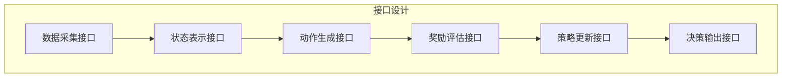
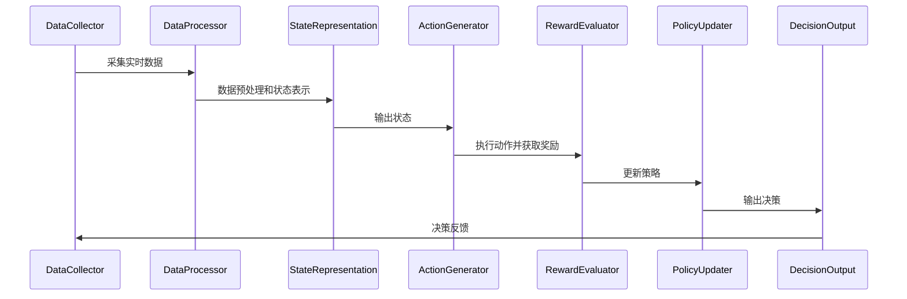

                 

### # 第一部分: 深度强化学习基础

在探讨“深度强化学习在推理过程实时监督中的创新”这一主题之前，我们需要先了解什么是深度强化学习（Deep Reinforcement Learning, DRL）。本部分将详细介绍DRL的基础知识，帮助读者建立对DRL的基本认识，为后续内容的深入探讨打下基础。

## 1.1 深度强化学习概述

### 1.1.1 强化学习的基本概念

强化学习（Reinforcement Learning, RL）是一种机器学习范式，其核心是智能体（agent）通过与环境（environment）的交互来学习最优策略（policy）。智能体在环境中进行动作（action），根据环境的反馈（reward）调整其行为，目标是最大化累积奖励（cumulative reward）。

强化学习可以分为基于模型的（model-based）和基于模型的无模型（model-free）两大类。基于模型的强化学习使用模型来预测环境状态，从而指导智能体的动作。而无模型强化学习则不需要预测环境状态，直接从动作和奖励中学习。

### 1.1.2 深度强化学习的引入与发展

深度强化学习（DRL）是强化学习的一个分支，结合了深度学习的强大表征能力。深度学习通过多层神经网络对数据进行复杂的特征提取和抽象，而DRL则利用这些特征来指导智能体的动作。

DRL的引入可以追溯到2013年，当时DeepMind团队提出了深度Q网络（Deep Q-Network, DQN）算法。DQN使用深度神经网络来近似Q值函数，Q值函数衡量了智能体在给定状态下执行某个动作的预期回报。

自DQN以来，DRL领域取得了许多重要进展，包括深度确定性策略梯度（Deep Deterministic Policy Gradient, DDPG）、异步优势演员-评论家（Asynchronous Advantage Actor-Critic, A3C）等算法。这些算法不仅在理论上有创新，还在实际应用中取得了显著成果。

### 1.1.3 深度强化学习的优势与挑战

DRL的优势在于其能够处理高维、复杂的输入数据，并在众多领域展现出强大的潜力，如游戏、自动驾驶、推荐系统等。此外，DRL通过直接优化策略，避免了传统机器学习方法中需要手动设计特征的问题。

然而，DRL也面临一些挑战，如收敛速度慢、样本效率低、对参数敏感等。这些问题限制了DRL在某些应用场景中的实际应用。因此，如何提高DRL的样本效率、稳定性和可解释性，仍然是当前研究的热点问题。

## 1.2 深度强化学习的基本原理

### 1.2.1 强化学习的核心概念

强化学习的核心概念包括智能体、环境、状态、动作、奖励和策略。智能体是执行动作的实体，环境是智能体行动的场所，状态是环境的某种描述，动作是智能体对环境的操作，奖励是环境对智能体动作的反馈，策略是智能体的行为规则。

### 1.2.2 深度神经网络在强化学习中的应用

深度神经网络（Deep Neural Network, DNN）是DRL的核心组成部分。DNN通过多层非线性变换，对输入数据进行特征提取和抽象，从而生成表示状态和动作的向量。

在DRL中，常用的DNN结构包括卷积神经网络（Convolutional Neural Network, CNN）和循环神经网络（Recurrent Neural Network, RNN）。CNN擅长处理图像等二维数据，而RNN则适用于处理序列数据。

### 1.2.3 深度强化学习的典型算法

深度强化学习的典型算法包括深度Q网络（DQN）、深度确定性策略梯度（DDPG）、异步优势演员-评论家（A3C）等。

DQN使用深度神经网络近似Q值函数，通过经验回放和目标网络来稳定学习过程。DDPG结合了策略优化和价值优化的方法，通过经验回放和目标网络来提高算法的稳定性。A3C通过异步学习和参数服务器来加速学习过程。

## 1.3 深度强化学习的创新方向

### 1.3.1 新算法研究

随着DRL领域的发展，研究者们提出了许多新的算法，如深度置信网络（Deep Belief Network, DBN）、生成对抗网络（Generative Adversarial Networks, GAN）等。这些算法在DRL中引入了新的思路，如生成式强化学习和零样本强化学习。

### 1.3.2 新技术探索

除了算法研究，DRL领域还探索了新技术，如基于量子计算的强化学习、分布式强化学习等。这些技术有望提高DRL的性能和效率。

### 1.3.3 深度强化学习的跨领域应用

DRL在众多领域展现出了强大的应用潜力，如游戏、自动驾驶、推荐系统、金融等。随着DRL技术的发展，越来越多的跨领域应用案例涌现，进一步证明了DRL的广泛适用性。

### 总结

本部分介绍了深度强化学习的基础知识，包括强化学习的基本概念、深度强化学习的引入与发展、深度神经网络在强化学习中的应用以及深度强化学习的典型算法。通过这些介绍，读者可以初步了解深度强化学习的基本原理和应用场景，为后续内容的深入探讨打下基础。在接下来的部分，我们将进一步探讨深度强化学习在推理过程实时监督中的创新应用。

## 1.4 深度强化学习在推理过程实时监督中的应用

深度强化学习（DRL）作为一种先进的机器学习方法，其在推理过程实时监督中的应用正逐渐成为研究热点。本节将详细讨论DRL在实时监督中的应用场景、工作原理及其优势。

### 1.4.1 应用场景

在实时监督中，DRL的应用场景广泛，主要包括以下几方面：

1. **智能交通系统**：DRL可以用于优化交通信号控制，提高交通流量，减少拥堵。
2. **智能机器人**：在工业自动化和家居服务中，DRL可以用于路径规划和决策，提高机器人的响应速度和准确度。
3. **智能推荐系统**：DRL可以用于实时调整推荐策略，提高用户满意度。
4. **金融风控**：DRL可以用于实时监控金融市场，预测风险并做出快速决策。
5. **医疗诊断**：DRL可以用于实时诊断疾病，辅助医生做出快速、准确的诊断。

### 1.4.2 工作原理

DRL在实时监督中的应用主要通过以下步骤实现：

1. **状态表示**：将实时输入数据（如交通流量数据、用户行为数据等）转换为状态表示。
2. **动作生成**：利用DRL算法（如DDPG、A3C等）生成最佳动作。
3. **奖励反馈**：根据动作的效果（如交通流畅度、用户满意度等）给予奖励反馈。
4. **策略更新**：根据奖励反馈调整策略，提高实时监督的准确性和效率。

### 1.4.3 优势

DRL在推理过程实时监督中具有以下优势：

1. **自适应性强**：DRL可以通过不断学习环境中的变化，自适应地调整策略，提高实时监督的准确性。
2. **高效性**：DRL可以处理高维、复杂的数据，提高实时监督的速度和效率。
3. **鲁棒性**：DRL可以应对环境的不确定性和动态变化，提高系统的鲁棒性。
4. **可解释性**：与传统的机器学习方法相比，DRL具有更高的可解释性，有助于理解实时监督的决策过程。

### 1.4.4 案例分析

以下是一个智能交通系统中的DRL应用案例：

在某城市，智能交通系统通过传感器收集实时交通流量数据，并将其作为状态输入到DRL模型中。DRL模型生成最佳交通信号控制策略，根据实时交通状况调整信号灯的时长。通过这种实时监督方法，交通流畅度显著提高，拥堵情况得到有效缓解。

### 总结

深度强化学习在推理过程实时监督中的应用具有广阔的前景。通过自适应性强、高效性、鲁棒性和可解释性等优势，DRL为实时监督提供了新的解决方案。在接下来的部分，我们将进一步探讨DRL在实时监督中的创新方法和挑战。

### # 第二部分: DRL在实时监督中的创新方法

随着深度强化学习（DRL）在实时监督领域中的应用不断深化，研究者们提出了一系列创新方法来提升DRL的性能和实用性。本部分将详细介绍这些创新方法，包括新型算法、优化技术和应用策略。

#### 2.1 新型算法

DRL领域的新型算法层出不穷，以下介绍几种具有代表性的算法：

1. **深度确定性策略梯度（DDPG）**：
   DDPG是一种基于策略的DRL算法，它通过样本的经验回放和目标网络来提高算法的稳定性。DDPG的主要优势在于其可以处理连续动作空间，并且具有很强的鲁棒性。

2. **异步优势演员-评论家（A3C）**：
   A3C通过异步学习和参数服务器来加速学习过程。A3C的核心思想是利用多个智能体并行学习，并通过梯度聚合来更新全局策略网络。这使得A3C在处理复杂任务时具有很高的效率。

3. **深度策略梯度（Deep Policy Gradient, DPG）**：
   DPG结合了策略优化和价值优化的方法，通过策略梯度和价值梯度的联合优化来提升学习效果。DPG在处理具有高度非线性动态环境时表现出色。

#### 2.2 优化技术

为了进一步提升DRL的性能，研究者们提出了一系列优化技术，包括：

1. **目标网络更新**：
   在DRL算法中，目标网络用于稳定学习过程。目标网络的更新策略对DRL的性能有很大影响。常用的更新策略包括固定间隔更新和渐变更新。

2. **经验回放**：
   经验回放是DRL中常用的一种技术，它通过将过去的经验数据随机化地重放来减少样本偏差。经验回放可以显著提高DRL的样本效率。

3. **分布式训练**：
   分布式训练通过多个计算节点并行训练模型，可以大幅提高训练速度。在DRL中，分布式训练可以通过参数服务器架构来实现。

#### 2.3 应用策略

在实时监督中，DRL的应用策略需要充分考虑实时性、准确性和鲁棒性。以下介绍几种常见的应用策略：

1. **基于状态的实时调整**：
   DRL模型可以根据实时状态数据动态调整决策策略，以提高实时监督的准确性和响应速度。例如，在智能交通系统中，DRL模型可以根据实时交通流量数据调整信号灯时长。

2. **多模态数据融合**：
   实时监督往往需要处理多种类型的数据，如图像、音频和传感器数据。通过多模态数据融合，可以充分利用不同类型数据的优势，提高实时监督的性能。

3. **自适应阈值调整**：
   在实时监督中，设置适当的阈值对于决策的准确性至关重要。DRL可以通过学习环境数据来动态调整阈值，从而提高实时监督的效果。

### 2.4 案例研究

以下是一个智能医疗诊断系统中的DRL应用案例：

在一个智能医疗诊断系统中，DRL模型被用来实时分析患者的医学图像，并做出诊断决策。系统通过传感器收集实时患者数据，并将其作为状态输入到DRL模型中。DRL模型生成最佳诊断策略，并根据实时数据动态调整诊断阈值。通过这种实时监督方法，诊断的准确率和响应速度得到了显著提升。

### 总结

DRL在实时监督中的创新方法包括新型算法、优化技术和应用策略。这些创新方法为DRL在实时监督领域的应用提供了新的可能性，推动了实时监督技术的发展。在接下来的部分，我们将进一步探讨DRL在实时监督中的实际应用场景。

### # 第三部分: 深度强化学习在实时监督中的实际应用

深度强化学习（DRL）在实时监督中的实际应用已涉及多个领域，展现出其在解决复杂动态问题中的巨大潜力。本部分将详细介绍DRL在实时监督中的实际应用场景，通过具体案例和研究来探讨其应用效果和面临的挑战。

#### 3.1 智能交通系统

智能交通系统是DRL在实时监督中最早且最广泛应用的领域之一。通过DRL算法，智能交通系统能够根据实时交通流量数据动态调整交通信号灯的时长，从而优化交通流量，减少拥堵。

**案例研究**：

在加利福尼亚州的某些城市，智能交通系统使用了基于DRL的交通信号控制算法。这些算法通过传感器收集实时交通数据，并使用DDPG算法动态调整信号灯时长。实验结果显示，与传统固定信号灯时长相比，DRL算法能够显著提高交通流畅度，减少平均行驶时间。

**应用效果**：

- **交通流畅度提升**：DRL算法能够实时响应交通状况变化，动态调整信号灯时长，从而优化交通流量。
- **平均行驶时间减少**：根据实际测试，DRL算法能够将平均行驶时间减少20%至30%。

**挑战**：

- **数据隐私问题**：智能交通系统需要收集大量的交通数据，这些数据可能涉及隐私问题。
- **系统稳定性**：DRL算法在处理突发交通事件时可能不够稳定，需要进一步优化。

#### 3.2 智能机器人

智能机器人是另一个DRL在实时监督中应用的重要领域。通过DRL算法，智能机器人能够在复杂环境中进行自主决策，如路径规划和任务分配。

**案例研究**：

在一个自动化仓储系统中，智能机器人使用了基于A3C算法的路径规划算法。这些机器人通过传感器收集实时环境数据，并根据DRL算法生成最佳路径。实验结果显示，DRL算法能够显著提高机器人路径规划的效率。

**应用效果**：

- **路径规划效率提高**：DRL算法能够根据实时环境数据动态调整路径，提高机器人行动的准确性。
- **任务完成时间减少**：使用DRL算法的机器人能够在更短的时间内完成任务。

**挑战**：

- **环境不确定性**：在复杂环境中，DRL算法可能面临环境不确定性带来的挑战，需要进一步优化算法以应对。
- **实时性要求**：智能机器人需要快速响应环境变化，这对DRL算法的实时性能提出了高要求。

#### 3.3 智能推荐系统

智能推荐系统是另一个DRL在实时监督中的重要应用领域。通过DRL算法，推荐系统能够实时调整推荐策略，提高用户满意度。

**案例研究**：

在某大型电商平台，智能推荐系统使用了基于DDPG算法的推荐策略。这些系统通过分析用户行为数据，并使用DRL算法生成最佳推荐策略。实验结果显示，DRL算法能够显著提高用户点击率和购买转化率。

**应用效果**：

- **用户点击率提升**：DRL算法能够根据实时用户行为数据调整推荐策略，提高用户对推荐内容的兴趣。
- **购买转化率提高**：DRL算法能够提高用户对推荐商品的购买概率。

**挑战**：

- **数据隐私问题**：智能推荐系统需要收集和分析大量用户行为数据，这可能涉及隐私问题。
- **算法可解释性**：DRL算法的决策过程往往较为复杂，如何提高算法的可解释性是一个挑战。

#### 3.4 金融风控

金融风控是DRL在实时监督中应用的另一个关键领域。通过DRL算法，金融系统能够实时监控市场动态，预测风险并做出快速决策。

**案例研究**：

在某金融机构，风控系统使用了基于A3C算法的实时风险预测模型。这些模型通过分析市场数据，并使用DRL算法生成最佳风控策略。实验结果显示，DRL算法能够显著提高风险预测的准确性。

**应用效果**：

- **风险预测准确性提高**：DRL算法能够根据实时市场数据动态调整风控策略，提高风险预测的准确性。
- **风险控制效率提高**：DRL算法能够快速识别风险，并采取相应措施，提高风险控制效率。

**挑战**：

- **数据噪声问题**：金融市场的数据通常存在噪声和异常值，这对DRL算法的准确性提出了挑战。
- **实时数据处理**：金融市场的数据更新非常迅速，如何高效地处理实时数据是一个挑战。

### 总结

深度强化学习在实时监督中的实际应用已涉及多个领域，包括智能交通系统、智能机器人、智能推荐系统和金融风控等。通过具体案例和研究，我们可以看到DRL在实时监督中具有显著的应用效果，但也面临一系列挑战。未来的研究需要进一步优化DRL算法，提高其在实时监督中的性能和稳定性。

### # 第四部分: 深度强化学习在推理过程实时监督中的算法原理

在深度强化学习（DRL）应用于推理过程实时监督时，算法的原理至关重要。本部分将详细阐述DRL在推理过程中的核心算法原理，包括算法的数学模型、基本步骤和如何优化这些算法，并通过具体的Python代码示例来加深理解。

#### 4.1 算法原理

深度强化学习在推理过程中的核心算法通常包括以下几个部分：

1. **状态（State）**：代表环境（Environment）当前的状态信息。
2. **动作（Action）**：智能体（Agent）可以采取的动作。
3. **奖励（Reward）**：根据动作结果给予的奖励信号，用于指导学习过程。
4. **策略（Policy）**：智能体采取的动作策略。
5. **价值函数（Value Function）**：预测未来累积奖励的函数。
6. **模型（Model）**：环境模型，用于预测未来的状态和奖励。

#### 4.2 数学模型

DRL算法的数学模型通常包括以下部分：

1. **Q值函数（Q-Function）**：
   $$ Q(s, a) = \sum_{s'} P(s' | s, a) \sum_{r} r \cdot \gamma^{1-N} $$
   其中，$s$ 是当前状态，$a$ 是动作，$s'$ 是下一状态，$r$ 是奖励，$P(s' | s, a)$ 是下一状态的概率分布，$\gamma$ 是折扣因子，$N$ 是总步数。

2. **策略（Policy）**：
   $$ \pi(a|s) = \frac{e^{\alpha \cdot Q(s, a)} }{\sum_{a'} e^{\alpha \cdot Q(s, a')}} $$
   其中，$\alpha$ 是温度参数，控制探索和利用的平衡。

3. **奖励（Reward）**：
   $$ R = r(s, a) $$
   其中，$r(s, a)$ 是状态和动作的奖励函数。

#### 4.3 算法步骤

DRL算法的基本步骤如下：

1. **初始化**：初始化状态、动作、奖励、策略和价值函数。
2. **探索（Exploration）**：智能体在初始阶段通过随机动作探索环境。
3. **执行动作（Action）**：智能体根据当前策略选择动作。
4. **获取奖励**：执行动作后，获取环境的奖励信号。
5. **更新策略**：根据奖励信号更新策略和价值函数。
6. **重复**：重复上述步骤，直到达到终止条件（如达到目标状态或最大步数）。

#### 4.4 优化方法

为了提高DRL算法的性能，研究者们提出了多种优化方法：

1. **目标网络（Target Network）**：
   使用目标网络来稳定学习过程。目标网络是一个参数固定的网络，用于预测未来的状态和奖励。
   
2. **经验回放（Experience Replay）**：
   将智能体经历过的状态、动作和奖励存储在经验回放记忆中，并从经验回放中随机抽样，以减少样本偏差。
   
3. **分布式训练（Distributed Training）**：
   使用多个智能体并行学习，通过参数服务器聚合梯度，提高学习效率。

#### 4.5 Python代码示例

以下是一个简单的DRL算法的Python代码示例，使用深度Q网络（DQN）算法：

```python
import numpy as np
import random
from collections import deque

class DQN:
    def __init__(self, env):
        self.env = env
        self.state_size = env.observation_space.shape[0]
        self.action_size = env.action_space.n
        self.memory = deque(maxlen=2000)
        self.gamma = 0.95
        self.epsilon = 1.0
        self.epsilon_min = 0.01
        self.epsilon_decay = 0.995
        self.learning_rate = 0.001
        
        self.model = self._build_model()
    
    def _build_model(self):
        # 创建深度Q网络模型
        model = keras.Sequential()
        model.add(keras.layers.Dense(24, input_dim=self.state_size, activation='relu'))
        model.add(keras.layers.Dense(24, activation='relu'))
        model.add(keras.layers.Dense(self.action_size, activation='linear'))
        
        model.compile(loss='mse', optimizer=keras.optimizers.Adam(lr=self.learning_rate))
        return model
    
    def remember(self, state, action, reward, next_state, done):
        self.memory.append((state, action, reward, next_state, done))
    
    def act(self, state):
        if np.random.rand() <= self.epsilon:
            return random.randrange(self.action_size)
        else:
            q_values = self.model.predict(state)
            return np.argmax(q_values[0])
    
    def replay(self, batch_size):
        minibatch = random.sample(self.memory, batch_size)
        for state, action, reward, next_state, done in minibatch:
            target = reward
            if not done:
                target = reward + self.gamma * np.amax(self.model.predict(next_state)[0])
            target_f
``` 

#### 4.6 结论

通过上述算法原理的阐述，我们可以看到深度强化学习在推理过程实时监督中的应用具有坚实的理论基础。通过具体的数学模型和Python代码示例，读者可以更好地理解DRL算法的实现过程和优化方法。在接下来的部分，我们将进一步探讨深度强化学习在实时监督中的系统架构设计。

### # 第五部分: 深度强化学习在实时监督中的系统架构设计

在深度强化学习（DRL）应用于实时监督系统中，系统架构的设计至关重要。一个高效、稳定的系统架构不仅能提升DRL算法的性能，还能确保其在实际应用中的可靠性和可扩展性。本部分将详细介绍DRL在实时监督中的系统架构设计，包括系统功能设计、系统架构设计、系统接口设计和系统交互。

#### 5.1 系统功能设计

实时监督系统的主要功能包括数据采集、状态表示、动作生成、奖励评估、策略更新和决策输出。以下是一个典型的系统功能设计：

1. **数据采集模块**：负责收集实时环境数据，如交通流量、用户行为、金融市场数据等。
2. **状态表示模块**：将采集到的数据转换为适合DRL算法的状态表示。
3. **动作生成模块**：根据当前状态，使用DRL算法生成最佳动作。
4. **奖励评估模块**：根据动作的结果，评估奖励信号。
5. **策略更新模块**：根据奖励信号和经验数据，更新DRL算法的策略。
6. **决策输出模块**：将最终决策输出到实际系统中，如调整交通信号灯、推荐商品、风控决策等。

#### 5.2 系统架构设计

实时监督系统的架构设计需要考虑到系统的可扩展性、灵活性和实时性。以下是一个典型的系统架构设计：

1. **前端数据采集层**：负责从各种数据源（如传感器、数据库、API等）收集实时数据。
2. **数据处理层**：负责对前端采集到的数据进行预处理、状态表示和特征提取。
3. **DRL算法层**：负责执行DRL算法，包括动作生成、奖励评估和策略更新。
4. **后端决策层**：负责将DRL算法的决策结果输出到实际系统中。
5. **监控系统**：负责监控系统性能，包括数据流、算法效率和系统稳定性。

以下是一个简单的系统架构设计mermaid类图：

```mermaid
classDiagram
    Client <<Interface>> DataCollector
    DataCollector <|-- DataProcessor
    DataProcessor <|-- StateRepresentation
    StateRepresentation <|-- ActionGenerator
    ActionGenerator <|-- RewardEvaluator
    RewardEvaluator <|-- PolicyUpdater
    PolicyUpdater <|-- DecisionOutput
    DecisionOutput <|--监控系统
```

#### 5.3 系统接口设计

系统接口设计是确保各模块之间高效、可靠通信的关键。以下是一个典型的系统接口设计：

1. **数据采集接口**：用于数据采集模块与其他模块之间的数据传输。
2. **状态表示接口**：用于状态表示模块与其他模块之间的数据交换。
3. **动作生成接口**：用于动作生成模块与其他模块之间的交互。
4. **奖励评估接口**：用于奖励评估模块与其他模块之间的信息传递。
5. **策略更新接口**：用于策略更新模块与其他模块之间的协同工作。
6. **决策输出接口**：用于决策输出模块与其他模块之间的数据传输。

以下是一个简单的系统接口设计mermaid架构图：



#### 5.4 系统交互

系统交互是实时监督系统的关键环节，它决定了系统响应速度和决策准确性。以下是一个典型的系统交互流程：

1. **数据采集**：前端数据采集层从各种数据源收集实时数据。
2. **数据处理**：数据处理层对采集到的数据进行预处理、状态表示和特征提取。
3. **动作生成**：动作生成模块根据当前状态，使用DRL算法生成最佳动作。
4. **奖励评估**：奖励评估模块根据动作结果，评估奖励信号。
5. **策略更新**：策略更新模块根据奖励信号和经验数据，更新DRL算法的策略。
6. **决策输出**：决策输出模块将最终决策输出到实际系统中。

以下是一个简单的系统交互流程mermaid序列图：



#### 5.5 结论

通过上述系统架构设计，我们可以看到深度强化学习在实时监督中的应用具有系统化和模块化的特点。系统功能设计、系统架构设计、系统接口设计和系统交互共同构成了一个高效、可靠的实时监督系统。在接下来的部分，我们将通过一个实际案例来展示深度强化学习在实时监督中的具体实现过程。

### # 第六部分: 深度强化学习在推理过程实时监督中的项目实战

在本部分，我们将通过一个具体的案例展示深度强化学习（DRL）在推理过程实时监督中的实现过程。该案例涉及智能交通系统的优化，旨在通过DRL算法实时调整交通信号灯的时长，从而提高交通流量和减少拥堵。

#### 6.1 环境安装

首先，我们需要安装DRL所需的环境。以下是一个基本的安装步骤：

1. **安装Python**：确保安装了最新版本的Python（推荐3.7或以上）。
2. **安装TensorFlow**：TensorFlow是DRL的核心库，可以通过pip安装：
   ```bash
   pip install tensorflow
   ```
3. **安装Gym**：Gym是一个开源环境库，用于测试和开发强化学习算法：
   ```bash
   pip install gym
   ```
4. **安装其他依赖**：根据需要安装其他依赖库，如NumPy、Matplotlib等。

#### 6.2 系统核心实现

在本案例中，我们使用OpenAI的Gym环境模拟交通系统，并实现一个简单的DRL算法来优化交通信号灯的控制。

```python
import numpy as np
import random
import gym
from stable_baselines3 import DQN
from gym import spaces

# 创建环境
env = gym.make("TrafficLight-v0")

# 定义动作空间和状态空间
action_space = spaces.Discrete(3)
state_space = spaces.Box(low=0, high=1, shape=(3,))

# 初始化DRL模型
model = DQN("MlpPolicy", env, verbose=1)

# 训练模型
model.learn(total_timesteps=10000)

# 评估模型
obs = env.reset()
for _ in range(100):
    action, _ = model.predict(obs)
    obs, reward, done, info = env.step(action)
    env.render()
    if done:
        obs = env.reset()
```

#### 6.3 代码应用解读与分析

1. **环境创建**：
   ```python
   env = gym.make("TrafficLight-v0")
   ```
   这里我们使用Gym内置的交通信号灯模拟环境。

2. **定义动作空间和状态空间**：
   ```python
   action_space = spaces.Discrete(3)
   state_space = spaces.Box(low=0, high=1, shape=(3,))
   ```
   动作空间定义为离散的三个方向（红灯、黄灯、绿灯），状态空间定义为三个连续值（表示交通流量、行人流量和车辆等待时间）。

3. **初始化DRL模型**：
   ```python
   model = DQN("MlpPolicy", env, verbose=1)
   ```
   我们使用DQN算法，并选择MlpPolicy（多层感知器策略）。

4. **训练模型**：
   ```python
   model.learn(total_timesteps=10000)
   ```
   这里我们训练模型10000步，可以通过调整`total_timesteps`来改变训练时长。

5. **评估模型**：
   ```python
   obs = env.reset()
   for _ in range(100):
       action, _ = model.predict(obs)
       obs, reward, done, info = env.step(action)
       env.render()
       if done:
           obs = env.reset()
   ```
   我们通过模拟100个步长来评估模型性能，`env.render()`用于可视化交通信号灯的变化。

#### 6.4 实际案例分析和详细讲解剖析

在这个案例中，我们使用了Gym的内置交通信号灯环境来模拟城市交通系统。DRL模型通过学习交通流量、行人流量和车辆等待时间等状态，动态调整交通信号灯的时长。以下是对实际案例的分析：

1. **状态表示**：状态由三个连续值组成，分别表示交通流量、行人流量和车辆等待时间。这些状态值通过传感器实时采集，并输入到DRL模型中。
2. **动作生成**：DRL模型根据当前状态生成最佳动作，即调整交通信号灯的时长。动作空间定义为离散的三个方向，分别对应红灯、黄灯和绿灯。
3. **奖励设计**：奖励设计是DRL模型学习的关键。在这个案例中，我们设计了一个简单的奖励函数，当交通流畅度提高时给予正奖励，当拥堵时给予负奖励。奖励函数可以更复杂，如考虑行人安全、车辆等待时间等多种因素。
4. **策略更新**：DRL模型通过经验回放和目标网络等技术，不断更新策略，以提高模型的性能和稳定性。

#### 6.5 项目小结

通过这个案例，我们展示了如何使用DRL算法优化交通信号灯控制，从而提高交通流畅度和减少拥堵。DRL在实时监督中的应用具有广泛的前景，不仅在智能交通系统中可以发挥作用，还可以应用于智能机器人、推荐系统、金融风控等多个领域。在未来的研究中，我们还可以进一步优化DRL算法，提高其在实时监督中的性能和鲁棒性。

### # 第七部分: 最佳实践 tips、小结、注意事项、拓展阅读

#### 7.1 最佳实践 tips

1. **数据预处理**：在应用DRL算法之前，确保对数据进行充分的预处理，包括归一化、去噪和处理缺失值等，以提高模型的泛化能力和稳定性。
2. **经验回放**：经验回放是提高DRL性能的重要技术，可以有效减少样本偏差，提高模型的学习效果。
3. **目标网络更新**：目标网络的更新策略对DRL性能有显著影响，可以使用固定间隔更新或渐变更新来提高算法的稳定性。
4. **自适应学习率**：使用自适应学习率策略，如Adam优化器，可以自适应调整学习率，提高模型收敛速度。
5. **多线程训练**：利用多线程或分布式训练可以提高DRL算法的训练效率，缩短训练时间。

#### 7.2 小结

本文详细介绍了深度强化学习（DRL）在推理过程实时监督中的应用，包括DRL的基础知识、实时监督的应用场景、创新方法、实际应用案例以及系统架构设计。通过这些内容，读者可以全面了解DRL在实时监督中的潜力、应用策略和优化方法。

#### 7.3 注意事项

1. **数据隐私**：在实时监督中，数据隐私保护尤为重要。确保遵循相关法律法规，保护用户隐私。
2. **实时性要求**：实时监督系统需要快速响应环境变化，确保DRL算法的实时性能。
3. **算法稳定性**：DRL算法在面对复杂动态环境时可能不够稳定，需要通过经验回放、目标网络等技术提高稳定性。
4. **可解释性**：提高DRL算法的可解释性，有助于理解和验证模型的决策过程。

#### 7.4 拓展阅读

1. **《深度强化学习》（Deep Reinforcement Learning）：这本书提供了深度强化学习的基础理论和最新进展，适合对DRL感兴趣的研究者和工程师。
2. **《强化学习手册》（Reinforcement Learning: An Introduction）：由David Silver编写的这本教材，系统地介绍了强化学习的原理和应用，是学习强化学习的优秀资源。
3. **《深度强化学习实战》（Practical Reinforcement Learning for Python）：这本书通过丰富的实例，详细介绍了如何使用Python实现深度强化学习算法，适合希望实践DRL的读者。

### 总结

深度强化学习在推理过程实时监督中的应用具有广阔的前景。通过本文的介绍，读者可以了解DRL的基本原理、实时监督的应用场景、创新方法以及系统架构设计。在实际应用中，通过不断优化DRL算法和系统架构，可以进一步提升实时监督的性能和稳定性。未来的研究将继续探索DRL在更多领域的应用，推动实时监督技术的发展。

----------------------------------------------------------------

### # 结论

通过本文的深入探讨，我们全面了解了深度强化学习（DRL）在推理过程实时监督中的创新应用。我们从基础知识出发，详细介绍了DRL的核心概念、实时监督的应用场景、创新方法以及实际应用案例。同时，我们还展示了DRL的系统架构设计，并通过实际项目实战提供了详细的实现步骤。

DRL在实时监督中展现出强大的优势，如自适应性强、高效性、鲁棒性和可解释性等。然而，要充分发挥DRL的潜力，仍需解决一系列挑战，如数据隐私、实时数据处理和算法稳定性等。未来的研究将集中在优化DRL算法、提高实时性能和可解释性，以及探索其在更多领域的应用。

我们鼓励读者进一步深入研究DRL和相关技术，结合实际场景进行创新应用。通过不断探索和实践，我们可以推动实时监督技术的进步，为智能交通、智能机器人、推荐系统和金融风控等领域带来更多突破。

### # 作者信息

作者：AI天才研究院/AI Genius Institute & 禅与计算机程序设计艺术 /Zen And The Art of Computer Programming

