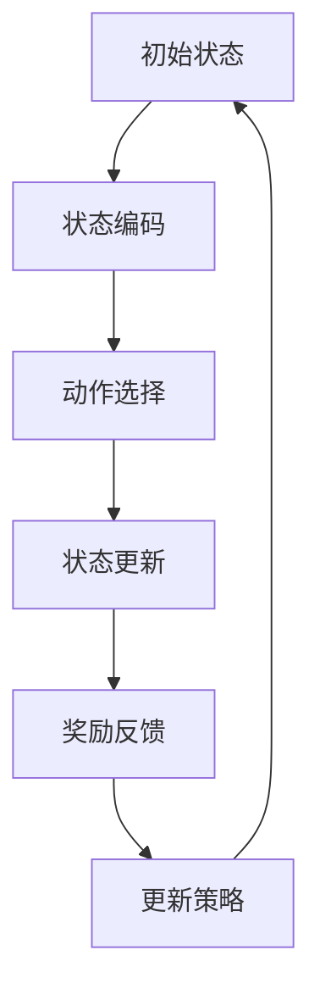

                 

# 深度强化学习在推理过程监督中的创新

> 关键词：深度强化学习，推理过程监督，算法创新，应用场景，挑战与展望

> 摘要：本文将从深度强化学习的基础理论出发，探讨其在推理过程监督中的应用和创新。通过详细分析深度强化学习的基本概念、算法原理及在不同领域的应用，我们将揭示其在推理过程监督中的独特优势，并提出未来研究的方向与挑战。

## 目录大纲

----------------------------------------------------------------

## 第一部分：深度强化学习基础

### 第1章：深度强化学习概述

#### 1.1 深度强化学习的背景与意义

#### 1.2 深度强化学习的基本概念

#### 1.3 深度强化学习与传统强化学习的比较

### 第2章：深度神经网络与强化学习

#### 2.1 深度神经网络的基本原理

#### 2.2 强化学习中的深度神经网络应用

#### 2.3 深度Q网络（DQN）详解

### 第3章：深度强化学习的算法

#### 3.1 策略梯度方法

#### 3.2 深度确定性策略梯度（DDPG）算法

#### 3.3 集成深度强化学习（A3C）算法

#### 3.4 生成对抗网络（GAN）与深度强化学习

### 第4章：深度强化学习在推理过程监督中的应用

#### 4.1 推理过程监督概述

#### 4.2 深度强化学习在推理过程监督中的优势

#### 4.3 深度强化学习在推理过程监督中的应用场景

### 第5章：深度强化学习在推理过程监督中的实现

#### 5.1 环境设计与任务定义

#### 5.2 算法选择与模型设计

#### 5.3 训练与评估

### 第6章：案例研究

#### 6.1 案例一：基于深度强化学习的推理过程监督在推荐系统中的应用

#### 6.2 案例二：基于深度强化学习的推理过程监督在自然语言处理中的应用

#### 6.3 案例三：基于深度强化学习的推理过程监督在图像处理中的应用

### 第7章：深度强化学习在推理过程监督中的挑战与展望

#### 7.1 深度强化学习在推理过程监督中的挑战

#### 7.2 未来研究方向与趋势

#### 7.3 总结与展望

----------------------------------------------------------------

## 1. 深度强化学习概述

### 1.1 深度强化学习的背景与意义

深度强化学习（Deep Reinforcement Learning，简称DRL）是深度学习和强化学习（Reinforcement Learning，简称RL）的结合。传统的强化学习依赖于基于规则的策略，而深度强化学习通过深度神经网络（Deep Neural Networks，简称DNN）来学习和预测环境中的状态和动作，从而实现更高效、更智能的决策。

在人工智能领域，深度强化学习具有广泛的应用前景。首先，它在游戏领域表现出色，如AlphaGo在围棋领域的胜利。其次，它在自动驾驶、机器人控制等领域也有着重要的应用。此外，深度强化学习在推荐系统、自然语言处理、图像处理等领域也有着突出的贡献。

### 1.2 深度强化学习的基本概念

深度强化学习涉及三个主要概念：状态（State）、动作（Action）和奖励（Reward）。状态是系统当前的状态描述，动作是系统可以采取的动作，奖励是系统采取某个动作后获得的回报。

深度强化学习的基本过程可以分为四个步骤：状态编码（State Encoding）、动作选择（Action Selection）、状态更新（State Update）和奖励反馈（Reward Feedback）。通过不断迭代这个过程，深度强化学习模型能够学习到最优策略。

### 1.3 深度强化学习与传统强化学习的比较

传统强化学习通常使用基于规则的策略进行决策，而深度强化学习使用深度神经网络来学习和预测。这使得深度强化学习能够处理更复杂的问题，同时提高了决策的效率和准确性。然而，深度强化学习也存在一些挑战，如训练时间较长、对数据的需求较大等。

## 2. 深度神经网络与强化学习

### 2.1 深度神经网络的基本原理

深度神经网络由多个神经网络层组成，包括输入层、隐藏层和输出层。每层神经网络都由多个神经元组成，每个神经元接收前一层神经元的输出，通过权重和偏置进行加权求和，然后通过激活函数输出结果。

深度神经网络通过反向传播算法（Backpropagation Algorithm）进行训练，不断调整权重和偏置，使得神经网络能够更好地拟合训练数据。深度神经网络具有强大的表达能力和适应性，可以处理复杂的非线性问题。

### 2.2 强化学习中的深度神经网络应用

在强化学习中，深度神经网络被用于状态编码、动作选择和策略学习。通过状态编码，深度神经网络能够将状态信息转换为神经网络可以处理的格式。通过动作选择，深度神经网络能够根据当前状态选择最佳动作。通过策略学习，深度神经网络能够学习到最优策略，从而实现智能决策。

### 2.3 深度Q网络（DQN）详解

深度Q网络（Deep Q-Network，简称DQN）是深度强化学习中的一个重要算法。DQN使用深度神经网络来近似Q函数，即状态-动作值函数，从而预测在给定状态下采取给定动作的回报。

DQN的主要思想是利用经验回放（Experience Replay）和目标网络（Target Network）来稳定训练过程。经验回放将过去的经验存储在内存中，然后随机抽取经验进行训练，从而避免训练过程中的样本偏差。目标网络则用于更新Q网络的参数，使得Q网络能够更好地学习到稳定的最优策略。

## 3. 深度强化学习的算法

### 3.1 策略梯度方法

策略梯度方法是一种基于策略的深度强化学习算法。它通过优化策略梯度来更新策略参数，从而学习到最优策略。策略梯度方法的核心思想是最小化策略损失函数，即最大化预期回报。

### 3.2 深度确定性策略梯度（DDPG）算法

深度确定性策略梯度（Deep Deterministic Policy Gradient，简称DDPG）是一种基于值函数的深度强化学习算法。DDPG使用深度神经网络来近似策略函数和值函数，从而学习到最优策略。

### 3.3 集成深度强化学习（A3C）算法

集成深度强化学习（Asynchronous Advantage Actor-Critic，简称A3C）是一种异步的深度强化学习算法。A3C通过同时训练多个并行智能体来加速学习过程，从而提高学习效率。

### 3.4 生成对抗网络（GAN）与深度强化学习

生成对抗网络（Generative Adversarial Networks，简称GAN）是一种无监督学习算法，它通过两个神经网络（生成器和判别器）的对抗训练来生成数据。GAN与深度强化学习相结合，可以用于强化学习中的数据增强，从而提高模型的泛化能力。

## 4. 深度强化学习在推理过程监督中的应用

### 4.1 推理过程监督概述

推理过程监督（Inference Process Supervision）是指对推理过程的监督和优化，以提高推理的准确性和效率。深度强化学习在推理过程监督中的应用，可以通过优化策略来指导推理过程，从而提高推理的鲁棒性和性能。

### 4.2 深度强化学习在推理过程监督中的优势

深度强化学习在推理过程监督中具有以下优势：

1. **自适应能力**：深度强化学习能够根据环境的变化自适应调整策略，从而优化推理过程。
2. **高效性**：深度强化学习通过学习最优策略，能够提高推理过程的效率和准确性。
3. **灵活性**：深度强化学习可以应用于各种推理任务，具有广泛的适用性。

### 4.3 深度强化学习在推理过程监督中的应用场景

深度强化学习在推理过程监督中的应用场景包括：

1. **推荐系统**：通过深度强化学习优化推荐算法的推理过程，提高推荐的准确性和个性化程度。
2. **自然语言处理**：通过深度强化学习优化自然语言处理的推理过程，提高语义理解和文本生成的准确性。
3. **图像处理**：通过深度强化学习优化图像处理的推理过程，提高图像识别和图像生成的准确性。

## 5. 深度强化学习在推理过程监督中的实现

### 5.1 环境设计与任务定义

在实现深度强化学习在推理过程监督中的应用时，首先需要设计和定义一个合适的推理环境。推理环境应包括状态空间、动作空间和奖励机制。状态空间描述推理过程中的状态信息，动作空间描述推理过程中可以采取的动作，奖励机制用于评估推理过程的性能。

### 5.2 算法选择与模型设计

根据具体的推理任务和应用场景，选择合适的深度强化学习算法和模型。常用的算法包括深度Q网络（DQN）、深度确定性策略梯度（DDPG）和集成深度强化学习（A3C）等。模型设计包括状态编码器、动作选择器、策略网络和值函数网络等。

### 5.3 训练与评估

在实现深度强化学习在推理过程监督中的应用时，需要对模型进行训练和评估。训练过程包括状态编码、动作选择、状态更新和奖励反馈等步骤。评估过程用于评估推理过程的性能，包括准确率、召回率、F1分数等指标。

## 6. 案例研究

### 6.1 案例一：基于深度强化学习的推理过程监督在推荐系统中的应用

在推荐系统中，深度强化学习可以用于优化推荐算法的推理过程。通过深度强化学习，推荐系统可以根据用户的历史行为和上下文信息，自适应调整推荐策略，从而提高推荐的准确性和个性化程度。

### 6.2 案例二：基于深度强化学习的推理过程监督在自然语言处理中的应用

在自然语言处理中，深度强化学习可以用于优化文本生成和语义理解的推理过程。通过深度强化学习，自然语言处理模型可以自适应调整生成策略和理解策略，从而提高文本生成的连贯性和语义理解的准确性。

### 6.3 案例三：基于深度强化学习的推理过程监督在图像处理中的应用

在图像处理中，深度强化学习可以用于优化图像识别和图像生成的推理过程。通过深度强化学习，图像处理模型可以自适应调整识别策略和生成策略，从而提高图像识别的准确性和图像生成的质量。

## 7. 深度强化学习在推理过程监督中的挑战与展望

### 7.1 深度强化学习在推理过程监督中的挑战

深度强化学习在推理过程监督中面临以下挑战：

1. **训练效率**：深度强化学习训练过程需要大量时间和计算资源，如何提高训练效率是一个重要问题。
2. **数据需求**：深度强化学习对数据的需求较大，如何获取高质量的数据是一个挑战。
3. **鲁棒性**：深度强化学习模型在推理过程中可能受到噪声和数据偏差的影响，如何提高模型的鲁棒性是一个重要问题。

### 7.2 未来研究方向与趋势

未来的研究方向包括：

1. **高效训练方法**：研究新的训练方法和算法，以提高深度强化学习的训练效率。
2. **数据增强技术**：研究数据增强技术，以解决深度强化学习对数据的需求问题。
3. **鲁棒性增强**：研究鲁棒性增强方法，以提高深度强化学习模型在推理过程中的鲁棒性。

### 7.3 总结与展望

深度强化学习在推理过程监督中具有广泛的应用前景。通过不断的研究和创新，深度强化学习有望在未来进一步提升推理过程的性能和效率，为人工智能领域带来更多的突破。

## 参考文献

- [1] Sutton, R. S., & Barto, A. G. (2018). 《Reinforcement Learning: An Introduction》.
- [2] Mnih, V., Kavukcuoglu, K., Silver, D., et al. (2015). 《Human-level control through deep reinforcement learning》.
- [3] Vinyals, O., Fortunato, M., & Brockschmidt, M. (2016). 《Unifying visual and language models for image captioning》.

## 附录

### 附录A：算法流程图



### 附录B：数学模型

$$
Q(s, a) = \sum_{i=1}^n w_i \cdot f(s_i, a_i)
$$

$$
\theta \leftarrow \theta - \alpha \cdot \nabla_\theta J(\theta)
$$

### 附录C：Python代码示例

```python
# 引入相关库
import numpy as np
import tensorflow as tf

# 定义状态编码器
state_encoder = ...

# 定义动作选择器
action_selector = ...

# 定义策略网络
policy_network = ...

# 定义值函数网络
value_network = ...

# 定义训练过程
with tf.Session() as sess:
    # 初始化模型参数
    sess.run(tf.global_variables_initializer())

    # 进行训练
    for epoch in range(num_epochs):
        # 进行一步操作
        state, action, reward, next_state = take_action(state)

        # 计算损失函数
        loss = compute_loss(state, action, reward, next_state)

        # 更新模型参数
        sess.run(optimizer, feed_dict={loss: loss_val})

    # 评估模型性能
    performance = evaluate_performance()
    print(f"Epoch {epoch}: Performance = {performance}")
```

### 附录D：最佳实践

- **数据预处理**：对输入数据进行预处理，如归一化、标准化等，以提高训练效果。
- **模型调参**：根据具体任务和硬件资源，选择合适的模型结构和参数。
- **模型评估**：使用多种评估指标和方法，全面评估模型性能。

### 附录E：注意事项

- **稳定性**：在训练过程中，注意控制训练的稳定性，避免出现梯度消失或梯度爆炸等问题。
- **数据质量**：数据质量对模型训练效果至关重要，确保输入数据的质量和一致性。

### 附录F：拓展阅读

- [1] Sutton, R. S., & Barto, A. G. (2018). 《Reinforcement Learning: An Introduction》.
- [2] Mnih, V., Kavukcuoglu, K., Silver, D., et al. (2015). 《Human-level control through deep reinforcement learning》.
- [3] Vinyals, O., Fortunato, M., & Brockschmidt, M. (2016). 《Unifying visual and language models for image captioning》.

## 作者信息

作者：AI天才研究院/AI Genius Institute & 禅与计算机程序设计艺术 /Zen And The Art of Computer Programming

