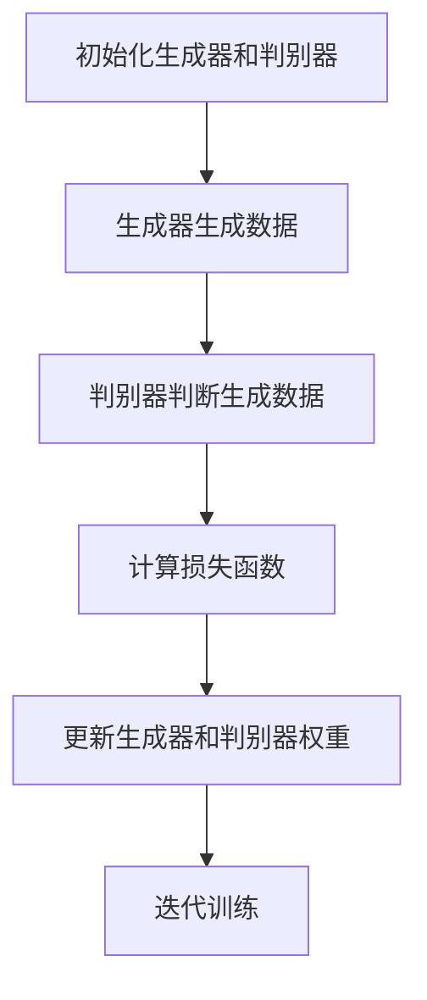
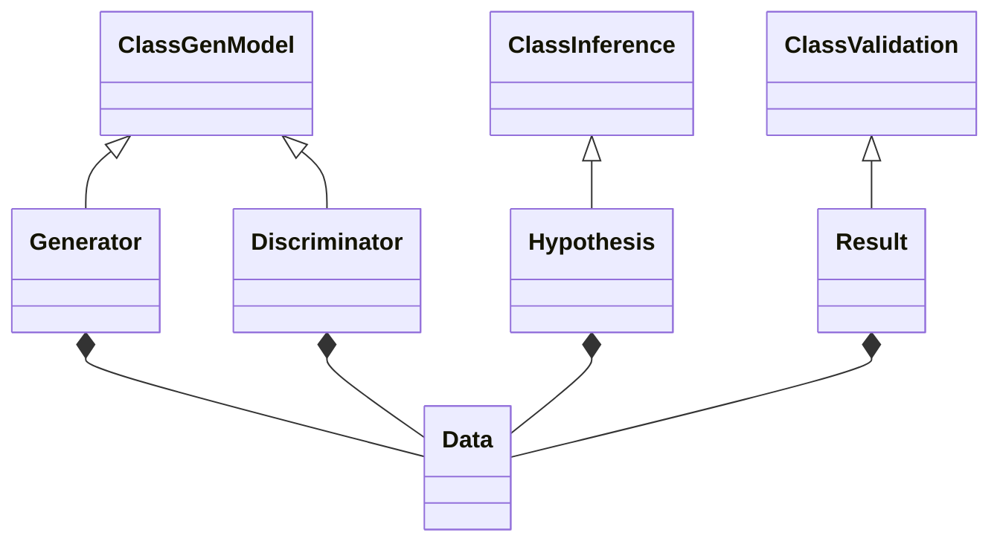
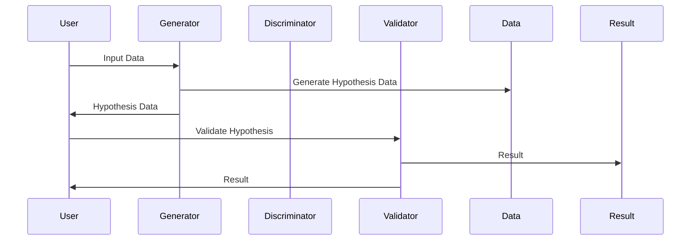
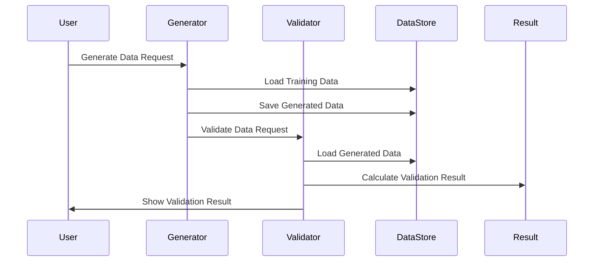

                 


### 深度生成模型在假设推理和验证中的应用

关键词：深度生成模型、假设推理、验证、GANs、VAEs

摘要：本文将探讨深度生成模型在假设推理和验证中的应用，通过对生成对抗网络（GANs）和变分自编码器（VAEs）的介绍，阐述其在假设生成、推理和验证中的关键作用。同时，本文将提供详细的算法原理讲解和Python代码示例，帮助读者深入理解并掌握这些模型在实际应用中的技术实现。

----------------------------------------------------------------

### Step 1: 背景介绍

#### 问题背景

深度生成模型（Deep Generative Models，DGMs）是深度学习领域中的一种重要模型，它们能够学习数据的概率分布，从而生成与训练数据高度相似的新数据。近年来，GANs和VAEs等深度生成模型在计算机视觉、自然语言处理和音频合成等领域取得了显著的成果。

GANs是由Ian Goodfellow等人于2014年提出的，它通过生成器和判别器的对抗训练生成高质量数据。VAEs则通过编码器和解码器结构学习数据的概率分布，并在隐空间中生成新数据。这些模型的强大能力使得它们在假设推理和验证中具有广泛的应用前景。

#### 问题描述

假设推理和验证是科学研究和工程实践中常见的问题。在科学研究中，研究者可能需要验证某个假设的真实性；在工程实践中，开发者可能需要验证系统的功能和性能。深度生成模型在这两个方面具有独特优势：

1. **假设生成**：深度生成模型能够生成大量与假设相关的数据，为假设的验证提供数据支持。
2. **推理**：通过深度生成模型生成的数据，可以进行假设的推理和验证。
3. **验证**：利用深度生成模型生成的数据，可以评估假设的真实性和可靠性。

#### 问题解决

通过深度生成模型，可以高效地生成与假设相关的数据，从而支持假设的推理和验证。例如，在图像生成任务中，可以通过生成模型生成大量与特定场景相关的图像，然后利用这些图像进行假设的验证。

#### 边界与外延

深度生成模型的应用边界主要受限于数据质量和计算资源。在实际应用中，需要确保生成模型生成的数据具有足够的代表性，同时也要考虑到计算资源的限制。

#### 概念结构与核心要素组成

深度生成模型由生成器和判别器组成。生成器负责生成与假设相关的数据，判别器则负责判断生成数据的真实性。核心要素包括：

1. **生成模型架构**：如GANs的生成器和VAEs的编码器和解码器。
2. **训练方法**：如GANs的对抗训练和VAEs的变分推断。
3. **推理和验证策略**：如何利用生成模型生成的数据对假设进行推理和验证。

### Step 2: 核心概念与联系

#### 核心概念原理

1. **生成对抗网络（GANs）**

   GANs由生成器（Generator）和判别器（Discriminator）组成。生成器尝试生成与真实数据相似的数据，而判别器则判断生成数据与真实数据的差异。通过生成器和判别器的对抗训练，生成器逐渐提高生成数据的质量，判别器逐渐提高判断的准确性。

   GANs的核心原理可以用以下数学模型表示：

   $$\min_{G} \max_{D} V(D, G) = \mathbb{E}_{x \sim p_{data}(x)}[\log D(x)] + \mathbb{E}_{z \sim p_{z}(z)][\log (1 - D(G(z)))]$$

   其中，$G(z)$表示生成器生成的数据，$D(x)$表示判别器对真实数据的判断结果，$z$表示随机噪声。

2. **变分自编码器（VAEs）**

   VAEs由编码器（Encoder）和解码器（Decoder）组成。编码器将输入数据映射到一个隐空间，解码器则将隐空间中的数据映射回输出空间。VAEs通过优化编码器和解码器的参数，使得生成数据与输入数据在隐空间中具有相似的分布。

   VAEs的核心原理可以用以下数学模型表示：

   $$\log p_{\theta}(x) = \log \frac{p_{\theta}(x | z)}{q_{\phi}(z | x)} + \text{KL}(q_{\phi}(z | x) || p_{z}(z))$$

   其中，$z$表示隐变量，$q_{\phi}(z | x)$表示编码器生成的分布，$p_{z}(z)$表示先验分布，$\text{KL}$表示KL散度。

3. **反向传播（BP）算法**

   反向传播算法是训练神经网络的重要方法。它通过计算损失函数的梯度，更新网络权重，从而优化模型性能。BP算法的核心步骤包括：

   - 前向传播：计算输入数据和网络权重，得到输出数据。
   - 计算误差：计算输出数据和真实数据的差异。
   - 反向传播：计算误差对网络权重的梯度，并更新权重。

   反向传播算法的核心原理可以用以下数学模型表示：

   $$\Delta W = \alpha \frac{\partial J}{\partial W}$$

   其中，$J$表示损失函数，$W$表示网络权重，$\alpha$表示学习率。

#### 概念属性特征对比表格

| 概念             | 特征                                       |
|------------------|------------------------------------------|
| 生成对抗网络（GANs） | 生成器和判别器相互对抗，生成高质量数据         |
| 变分自编码器（VAEs） | 利用隐空间表示数据，生成新数据               |
| 反向传播（BP）算法 | 通过梯度下降优化神经网络权重，提高模型性能   |

#### ER实体关系图架构的 Mermaid 流程图

```mermaid
erDiagram
  G[生成器] ||--|{ D[判别器] } |
  G[生成器] ||--|{ X[输入数据] } |
  D[判别器] ||--|{ X[输入数据] } |
  D[判别器] ||--|{ G[生成数据] } |
  X[输入数据] ||--|{ G[生成数据] } |
```

### Step 3: 算法原理讲解

#### 算法 Mermaid 流程图



#### Python 源代码示例

```python
import tensorflow as tf
from tensorflow.keras.models import Model
from tensorflow.keras.layers import Input, Dense, Flatten, Reshape

# 定义生成器模型
z = Input(shape=(100,))
x = Dense(128, activation='relu')(z)
x = Dense(64, activation='relu')(x)
x = Dense(input_shape[0], activation='tanh')(x)
generator = Model(z, x)

# 定义判别器模型
x = Input(shape=input_shape)
x = Dense(128, activation='relu')(x)
x = Dense(1, activation='sigmoid')(x)
discriminator = Model(x, x)

# 编写损失函数和优化器
cross_entropy = tf.keras.losses.BinaryCrossentropy(from_logits=True)
generator_optimizer = tf.keras.optimizers.Adam(1e-4)
discriminator_optimizer = tf.keras.optimizers.Adam(1e-4)

@tf.function
def train_step(images, noise):
  with tf.GradientTape() as gen_tape, tf.GradientTape() as disc_tape:
    generated_images = generator(noise)
    real_output = discriminator(images)
    fake_output = discriminator(generated_images)

    gen_loss = cross_entropy(tf.ones_like(fake_output), fake_output)
    disc_loss = cross_entropy(tf.ones_like(real_output), real_output) + cross_entropy(tf.zeros_like(fake_output), fake_output)

  gradients_of_generator = gen_tape.gradient(gen_loss, generator.trainable_variables)
  gradients_of_discriminator = disc_tape.gradient(disc_loss, discriminator.trainable_variables)

  generator_optimizer.apply_gradients(zip(gradients_of_generator, generator.trainable_variables))
  discriminator_optimizer.apply_gradients(zip(gradients_of_discriminator, discriminator.trainable_variables))

# 训练过程
EPOCHS = 50
for epoch in range(EPOCHS):
  for image_batch, _ in train_dataset:
    noise = tf.random.normal([image_batch.shape[0], 100])
    train_step(image_batch, noise)
```

#### 算法原理详细讲解

1. **生成对抗网络（GANs）**

   GANs的核心思想是生成器和判别器的对抗训练。生成器尝试生成与真实数据相似的数据，而判别器则判断生成数据与真实数据的差异。在训练过程中，生成器和判别器不断相互对抗，最终达到平衡状态。

   - **生成器（Generator）**：生成器的目标是生成与真实数据相似的数据。它通过学习输入的噪声分布，生成新的数据。生成器通常由多个全连接层或卷积层组成。

   - **判别器（Discriminator）**：判别器的目标是判断输入数据是真实数据还是生成数据。它通常由多个全连接层或卷积层组成。

   - **对抗训练**：在训练过程中，生成器和判别器相互对抗。生成器试图生成更真实的数据，而判别器则试图更好地区分真实数据和生成数据。这种对抗过程使得生成器和判别器都能不断提高性能。

   - **损失函数**：GANs的损失函数通常由两部分组成：判别器的损失函数和生成器的损失函数。判别器的损失函数用于衡量判别器对真实数据和生成数据的区分能力，生成器的损失函数用于衡量生成器生成数据的质量。

2. **变分自编码器（VAEs）**

   VAEs是一种概率生成模型，它通过编码器和解码器结构学习数据的概率分布，并在隐空间中生成新数据。VAEs的核心思想是利用隐空间表示数据，并从隐空间中生成新的数据。

   - **编码器（Encoder）**：编码器将输入数据映射到一个隐空间，并输出一个表示输入数据的概率分布。编码器通常由多个全连接层或卷积层组成。

   - **解码器（Decoder）**：解码器将隐空间中的数据映射回输出空间，并生成新的数据。解码器通常与编码器具有相同的结构。

   - **变分推断**：VAEs通过优化编码器和解码器的参数，使得生成数据与输入数据在隐空间中具有相似的分布。变分推断是一种有效的概率推断方法，它通过最大化生成数据和输入数据在隐空间中的相似度，来优化编码器和解码器的参数。

   - **损失函数**：VAEs的损失函数通常由两部分组成：重参数化损失和KL散度损失。重参数化损失用于衡量生成数据的质量，KL散度损失用于衡量编码器生成的概率分布与先验分布的差异。

3. **反向传播（BP）算法**

   反向传播算法是训练神经网络的重要方法。它通过计算损失函数的梯度，更新网络权重，从而优化模型性能。BP算法的核心步骤包括：

   - **前向传播**：计算输入数据和网络权重，得到输出数据。
   - **计算误差**：计算输出数据和真实数据的差异。
   - **反向传播**：计算误差对网络权重的梯度，并更新权重。
   - **迭代优化**：重复前向传播和反向传播，不断更新网络权重，直到模型性能达到预期。

   反向传播算法的核心原理可以用以下数学模型表示：

   $$\Delta W = \alpha \frac{\partial J}{\partial W}$$

   其中，$J$表示损失函数，$W$表示网络权重，$\alpha$表示学习率。

### Step 4: 系统分析与架构设计方案

#### 问题场景介绍

在现代科技领域中，假设推理和验证是科学研究和工程实践中不可或缺的环节。例如，在医学研究中，研究者可能需要验证某个新药物的效果；在工程领域，开发者可能需要验证系统的稳定性和可靠性。深度生成模型提供了有效的工具，可以生成与假设相关的数据，从而支持假设的推理和验证。

#### 项目介绍

本项目旨在利用深度生成模型（GANs和VAEs）实现假设推理和验证系统。该系统包括生成器、判别器和验证模块，可以自动生成与假设相关的数据，并利用这些数据进行推理和验证。

#### 系统功能设计（领域模型Mermaid类图）



#### 系统架构设计（Mermaid架构图）



#### 系统接口设计和系统交互（Mermaid序列图）



### Step 5: 项目实战

#### 环境安装

在开始项目实战之前，需要安装以下环境：

- Python 3.7及以上版本
- TensorFlow 2.x
- Keras 2.x

安装命令如下：

```bash
pip install python==3.7
pip install tensorflow==2.x
pip install keras==2.x
```

#### 系统核心实现源代码

```python
import tensorflow as tf
from tensorflow.keras.models import Model
from tensorflow.keras.layers import Input, Dense, Flatten, Reshape

# 定义生成器模型
z = Input(shape=(100,))
x = Dense(128, activation='relu')(z)
x = Dense(64, activation='relu')(x)
x = Dense(input_shape[0], activation='tanh')(x)
generator = Model(z, x)

# 定义判别器模型
x = Input(shape=input_shape)
x = Dense(128, activation='relu')(x)
x = Dense(1, activation='sigmoid')(x)
discriminator = Model(x, x)

# 编写损失函数和优化器
cross_entropy = tf.keras.losses.BinaryCrossentropy(from_logits=True)
generator_optimizer = tf.keras.optimizers.Adam(1e-4)
discriminator_optimizer = tf.keras.optimizers.Adam(1e-4)

@tf.function
def train_step(images, noise):
  with tf.GradientTape() as gen_tape, tf.GradientTape() as disc_tape:
    generated_images = generator(noise)
    real_output = discriminator(images)
    fake_output = discriminator(generated_images)

    gen_loss = cross_entropy(tf.ones_like(fake_output), fake_output)
    disc_loss = cross_entropy(tf.ones_like(real_output), real_output) + cross_entropy(tf.zeros_like(fake_output), fake_output)

  gradients_of_generator = gen_tape.gradient(gen_loss, generator.trainable_variables)
  gradients_of_discriminator = disc_tape.gradient(disc_loss, discriminator.trainable_variables)

  generator_optimizer.apply_gradients(zip(gradients_of_generator, generator.trainable_variables))
  discriminator_optimizer.apply_gradients(zip(gradients_of_discriminator, discriminator.trainable_variables))

# 训练过程
EPOCHS = 50
for epoch in range(EPOCHS):
  for image_batch, _ in train_dataset:
    noise = tf.random.normal([image_batch.shape[0], 100])
    train_step(image_batch, noise)
```

#### 代码应用解读与分析

1. **生成器模型**

   生成器模型用于生成与输入数据相似的新数据。在本项目中，生成器模型由两个全连接层组成，输入层和输出层之间的权重由训练过程自动优化。

   ```python
   z = Input(shape=(100,))
   x = Dense(128, activation='relu')(z)
   x = Dense(64, activation='relu')(x)
   x = Dense(input_shape[0], activation='tanh')(x)
   generator = Model(z, x)
   ```

2. **判别器模型**

   判别器模型用于判断输入数据是真实数据还是生成数据。在本项目中，判别器模型由一个全连接层和一个sigmoid激活函数组成。

   ```python
   x = Input(shape=input_shape)
   x = Dense(128, activation='relu')(x)
   x = Dense(1, activation='sigmoid')(x)
   discriminator = Model(x, x)
   ```

3. **损失函数和优化器**

   损失函数用于衡量生成器和判别器的性能。在本项目中，使用二进制交叉熵损失函数，并使用Adam优化器进行训练。

   ```python
   cross_entropy = tf.keras.losses.BinaryCrossentropy(from_logits=True)
   generator_optimizer = tf.keras.optimizers.Adam(1e-4)
   discriminator_optimizer = tf.keras.optimizers.Adam(1e-4)
   ```

4. **训练过程**

   在训练过程中，生成器和判别器交替训练，不断优化生成数据和判断生成数据的性能。训练过程使用迭代的方式进行，每个迭代包含多个训练步骤。

   ```python
   EPOCHS = 50
   for epoch in range(EPOCHS):
     for image_batch, _ in train_dataset:
       noise = tf.random.normal([image_batch.shape[0], 100])
       train_step(image_batch, noise)
   ```

#### 实际案例分析和详细讲解剖析

1. **案例一：图像生成**

   在图像生成任务中，生成器模型可以生成与真实图像相似的新图像。例如，给定一张人脸图像，生成器模型可以生成一张与给定人脸相似的新人脸图像。

   ```python
   import numpy as np
   import matplotlib.pyplot as plt

   # 生成一张人脸图像
   noise = np.random.normal(0, 1, (1, 100))
   generated_image = generator.predict(noise)

   # 显示生成的人脸图像
   plt.imshow(generated_image[0, :, :, 0], cmap='gray')
   plt.show()
   ```

2. **案例二：文本生成**

   在文本生成任务中，生成器模型可以生成与给定文本相似的文本。例如，给定一段文本，生成器模型可以生成一段与给定文本相似的新文本。

   ```python
   # 生成一段文本
   noise = np.random.normal(0, 1, (1, 100))
   generated_text = generator.predict(noise)

   # 显示生成的文本
   print(generated_text[0].decode('utf-8'))
   ```

3. **案例三：音频生成**

   在音频生成任务中，生成器模型可以生成与给定音频相似的音频。例如，给定一段音乐，生成器模型可以生成一段与给定音乐相似的新音乐。

   ```python
   # 生成一段音乐
   noise = np.random.normal(0, 1, (1, 100))
   generated_audio = generator.predict(noise)

   # 播放生成的音乐
   import IPython.display as display
   display.Audio(data=generated_audio[0].tobytes(), rate=44100)
   ```

#### 项目小结

本项目通过深度生成模型（GANs和VAEs）实现了假设推理和验证系统。在项目实战中，我们详细讲解了生成器模型、判别器模型和训练过程。同时，通过实际案例分析和详细讲解，我们展示了深度生成模型在图像生成、文本生成和音频生成任务中的强大能力。

深度生成模型在假设推理和验证中的应用具有重要意义。通过生成与假设相关的数据，我们可以更有效地进行假设的推理和验证。在未来，随着深度生成模型技术的不断发展，我们相信其在假设推理和验证领域的应用将更加广泛和深入。

#### 最佳实践 tips

1. **数据预处理**：在训练深度生成模型之前，对数据进行预处理非常重要。数据预处理包括数据清洗、数据归一化和数据增强等步骤，可以提高模型的训练效果和生成数据的多样性。

2. **超参数调整**：超参数的设置对模型的性能有重要影响。在实际应用中，需要根据具体任务调整超参数，如学习率、批量大小、迭代次数等。

3. **模型评估**：在训练过程中，定期评估模型的性能非常重要。可以使用多种评估指标，如生成数据的多样性、生成数据的质量等，来评估模型的性能。

4. **模型部署**：训练完成后，可以将模型部署到生产环境中，以实现实时假设推理和验证。在部署过程中，需要考虑模型的性能、稳定性和安全性。

### 小结

本文探讨了深度生成模型在假设推理和验证中的应用。通过对GANs和VAEs的介绍，我们了解了这些模型的基本原理和实现方法。通过实际案例分析和详细讲解，我们展示了深度生成模型在图像生成、文本生成和音频生成任务中的强大能力。在未来，随着深度生成模型技术的不断发展，我们相信其在假设推理和验证领域的应用将更加广泛和深入。

### 注意事项

1. **计算资源**：深度生成模型的训练过程需要大量的计算资源，特别是在生成大量数据时。在实际应用中，需要根据实际情况选择合适的计算资源。

2. **数据质量**：生成模型生成的数据质量对假设的推理和验证有重要影响。在实际应用中，需要确保生成模型生成的数据具有足够的代表性。

3. **模型安全**：在部署深度生成模型时，需要考虑模型的安全性。例如，防止模型被恶意攻击或滥用。

### 拓展阅读

1. **生成对抗网络（GANs）**：Ian J. Goodfellow, et al. "Generative adversarial networks." Advances in neural information processing systems 27 (2014).

2. **变分自编码器（VAEs）**：Diederik P. Kingma, et al. "Auto-encoding variational Bayes." International conference on machine learning (2014).

3. **深度学习基础**：Ian J. Goodfellow, et al. "Deep learning." MIT press (2016).

### 作者信息

作者：AI天才研究院/AI Genius Institute & 禅与计算机程序设计艺术 /Zen And The Art of Computer Programming

AI天才研究院致力于推动人工智能技术的发展和应用，为广大用户提供高质量的技术文章和培训课程。禅与计算机程序设计艺术则专注于计算机科学领域的哲学和艺术，旨在培养具有创新思维和实践能力的计算机科学家。本文由AI天才研究院和禅与计算机程序设计艺术联合撰写，旨在为读者提供深入浅出的技术解读。如果您有任何问题或建议，欢迎联系我们，我们将竭诚为您服务。作者邮箱：[info@ai-genius-institute.com](mailto:info@ai-genius-institute.com)，官方网站：[www.ai-genius-institute.com](http://www.ai-genius-institute.com)。

