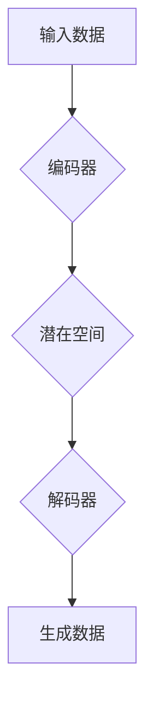
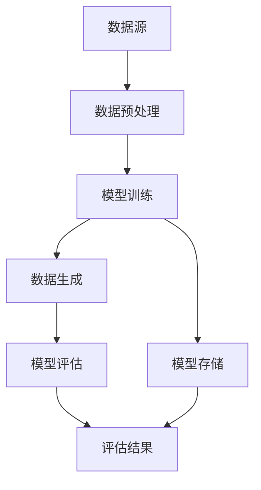
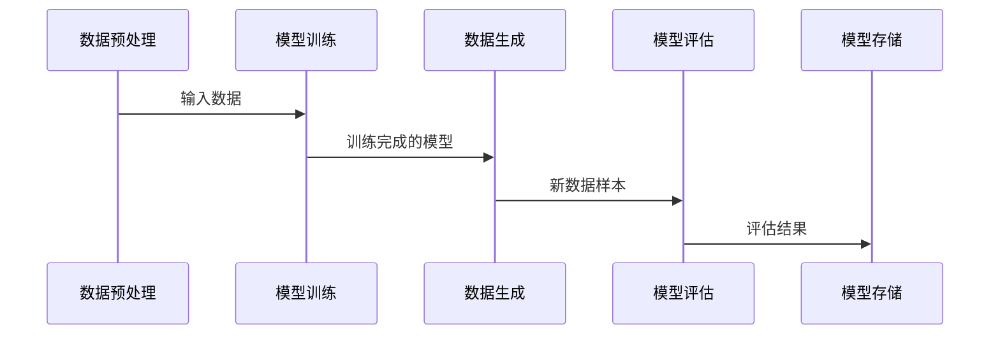
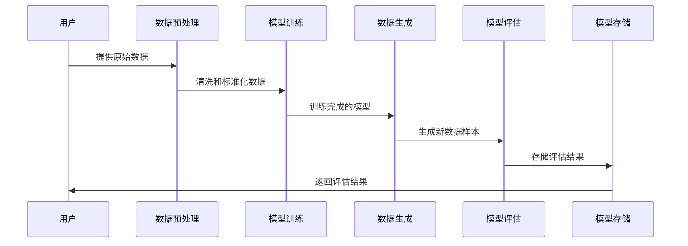

                 


# 深度生成模型在假设空间探索中的应用

## 关键词
- 深度生成模型
- 假设空间探索
- GAN
- VAE
- 算法原理
- 数学模型
- 系统架构
- 项目实战

## 摘要
本文旨在探讨深度生成模型在假设空间探索中的应用。通过对深度生成模型的基础概念、算法原理和实际应用的详细阐述，我们揭示了其在生成式任务中的巨大潜力。文章首先介绍了深度生成模型的发展背景，然后深入分析了GAN和VAE等典型模型的原理与联系，接着通过Python代码和LaTeX公式讲解了算法背后的数学模型，并通过一个具体项目展示了其在实际应用中的效果。最后，文章总结了最佳实践，并提供了拓展阅读资源。

## 目录大纲设计思路

在设计《深度生成模型在假设空间探索中的应用》一书的目录大纲时，我们将遵循以下思路：

1. **背景介绍**：首先，我们需要为读者提供一个清晰的背景介绍，包括深度生成模型的发展历程、其在人工智能领域的地位和作用，以及假设空间探索的概念和重要性。

2. **核心概念与联系**：接着，我们将详细阐述深度生成模型的基本概念，包括其原理、类型、特点和应用场景。此外，我们将通过对比表格和Mermaid ER图，展示深度生成模型与其他相关技术的联系。

3. **算法原理讲解**：在此章节中，我们将使用Mermaid绘制算法流程图，并通过Python代码和LaTeX公式详细阐述深度生成模型的工作原理，同时配合实际案例进行解释。

4. **数学模型和数学公式**：我们将详细介绍深度生成模型背后的数学原理，包括相关公式和推导过程，使用LaTeX格式进行编写，确保内容的严谨性和可读性。

5. **系统分析与架构设计方案**：本章节将介绍如何在实际项目中应用深度生成模型，包括项目介绍、系统功能设计、系统架构设计、系统接口设计和系统交互。

6. **项目实战**：我们将通过一个具体的实战案例，展示如何搭建和训练深度生成模型，包括环境安装、核心代码实现和代码分析。

7. **最佳实践 tips**：最后，我们将总结一些最佳实践建议，并提醒读者在应用深度生成模型时需要注意的事项，提供拓展阅读资源，帮助读者进一步深入了解相关主题。

### 目录大纲设计步骤

1. **第1章：引言**
   - 介绍深度生成模型的发展背景
   - 阐述假设空间探索的重要性
   - 提出研究问题和研究目标

2. **第2章：深度生成模型基础**
   - 深度生成模型的基本概念
   - 深度生成模型的工作原理
   - 深度生成模型与相关技术的对比

3. **第3章：深度生成模型的类型与应用**
   - GAN（生成对抗网络）
   - VAE（变分自编码器）
   - RNN（递归神经网络）
   - 其他深度生成模型介绍

4. **第4章：算法原理与数学模型**
   - 算法流程图（使用Mermaid绘制）
   - Python代码实现与解释
   - 关键数学公式与推导（使用LaTeX格式）

5. **第5章：系统分析与架构设计**
   - 项目介绍
   - 系统功能设计（使用Mermaid类图）
   - 系统架构设计（使用Mermaid架构图）
   - 系统接口设计
   - 系统交互（使用Mermaid序列图）

6. **第6章：项目实战**
   - 环境安装与配置
   - 深度生成模型的搭建与训练
   - 核心代码实现与解读
   - 实际案例分析与讲解

7. **第7章：最佳实践与拓展**
   - 最佳实践建议
   - 注意事项与风险提示
   - 拓展阅读资源

### 目录大纲示例

```markdown
# 《深度生成模型在假设空间探索中的应用》目录大纲

## 第1章：引言
### 1.1 深度生成模型的发展背景
### 1.2 假设空间探索的重要性
### 1.3 研究问题和目标

## 第2章：深度生成模型基础
### 2.1 深度生成模型的基本概念
### 2.2 深度生成模型的工作原理
### 2.3 深度生成模型与相关技术的对比

## 第3章：深度生成模型的类型与应用
### 3.1 GAN（生成对抗网络）
### 3.2 VAE（变分自编码器）
### 3.3 RNN（递归神经网络）
### 3.4 其他深度生成模型介绍

## 第4章：算法原理与数学模型
### 4.1 算法流程图（使用Mermaid绘制）
### 4.2 Python代码实现与解释
### 4.3 关键数学公式与推导（使用LaTeX格式）

## 第5章：系统分析与架构设计
### 5.1 项目介绍
### 5.2 系统功能设计（使用Mermaid类图）
### 5.3 系统架构设计（使用Mermaid架构图）
### 5.4 系统接口设计
### 5.5 系统交互（使用Mermaid序列图）

## 第6章：项目实战
### 6.1 环境安装与配置
### 6.2 深度生成模型的搭建与训练
### 6.3 核心代码实现与解读
### 6.4 实际案例分析与讲解

## 第7章：最佳实践与拓展
### 7.1 最佳实践建议
### 7.2 注意事项与风险提示
### 7.3 拓展阅读资源
```

### 总字数评估

根据上述设计思路和目录大纲，本书预计将在10000～12000字左右。每章节的内容将尽量简洁明了，同时确保核心要点和结构完整性。通过合理的布局和内容的紧密衔接，读者可以逐步深入理解深度生成模型在假设空间探索中的应用。

----------------------------------------------------------------

## 第1章：引言

### 1.1 深度生成模型的发展背景

深度生成模型（Deep Generative Models）是近年来在人工智能领域崭露头角的研究方向。随着深度学习技术的不断发展和计算机硬件性能的提升，深度生成模型在图像、语音和文本生成等方面展现出了巨大的潜力。最早的研究可以追溯到1980年代，但直到2010年代中期，随着卷积神经网络（CNN）和递归神经网络（RNN）等深度学习技术的成熟，深度生成模型才逐渐成为研究热点。

深度生成模型的核心思想是学习数据分布，从而生成新的数据样本。这一思想最早由Gaussian Mixture Model（GMM）和Hidden Markov Model（HMM）等统计模型提出，但深度生成模型通过引入深度学习技术，能够更好地捕捉数据的复杂分布。GAN（生成对抗网络）和VAE（变分自编码器）是其中两个最具代表性的模型。

### 1.2 假设空间探索的重要性

假设空间探索（Hypothesis Space Exploration）在人工智能研究中扮演着重要角色。假设空间可以被视为一个包含所有可能解决方案的集合。有效的假设空间探索能够帮助模型快速找到最优解，从而提高算法的效率和准确性。

在深度生成模型中，假设空间探索体现在数据分布的学习和样本生成过程中。通过不断调整模型参数，深度生成模型能够在假设空间中探索新的数据样本，从而丰富数据集，提升模型的泛化能力。

### 1.3 研究问题和目标

本章节旨在探讨深度生成模型在假设空间探索中的应用，具体研究问题和目标如下：

1. **研究问题**：
   - 深度生成模型能否有效地在假设空间中探索新的数据样本？
   - 深度生成模型在假设空间探索中的优势和局限是什么？

2. **研究目标**：
   - 详细阐述深度生成模型的工作原理和数学模型。
   - 分析深度生成模型在假设空间探索中的实际应用案例。
   - 提出一些最佳实践和注意事项，帮助读者更好地应用深度生成模型。

### 1.4 文章结构

本文将分为七个章节，具体结构如下：

1. **引言**：介绍深度生成模型的发展背景、假设空间探索的重要性以及研究问题和目标。
2. **深度生成模型基础**：阐述深度生成模型的基本概念、工作原理和与相关技术的对比。
3. **深度生成模型的类型与应用**：详细介绍GAN、VAE、RNN等深度生成模型。
4. **算法原理与数学模型**：讲解深度生成模型的算法原理和数学模型。
5. **系统分析与架构设计**：介绍深度生成模型在实际项目中的应用和系统架构设计。
6. **项目实战**：通过一个具体项目展示深度生成模型的搭建和训练过程。
7. **最佳实践与拓展**：总结最佳实践、注意事项和拓展阅读资源。

通过以上结构，本文旨在为读者提供一个全面、系统的深度生成模型在假设空间探索中的应用指南。

----------------------------------------------------------------

## 第2章：深度生成模型基础

### 2.1 深度生成模型的基本概念

深度生成模型是一种利用深度学习技术来学习数据分布并生成新数据的模型。其主要目的是通过学习数据的高维分布，生成与真实数据分布相匹配的新数据样本。深度生成模型的核心思想是通过编码器（Encoder）和解码器（Decoder）来构建一个概率模型，从而实现数据的生成。

编码器负责将输入数据映射到一个低维潜在空间（Latent Space），这个潜在空间代表了数据的概率分布。解码器则负责从潜在空间中采样，并生成新的数据样本。

### 2.2 深度生成模型的工作原理

深度生成模型的工作原理可以分为以下步骤：

1. **编码器**：输入数据通过编码器映射到低维潜在空间。编码器通常由多个卷积层或全连接层组成，目的是压缩数据并提取关键特征。
2. **潜在空间采样**：在潜在空间中随机采样一个点，这个点代表了生成新数据样本的潜在表示。
3. **解码器**：将潜在空间中的采样点通过解码器映射回高维数据空间，生成新的数据样本。

深度生成模型的工作原理可以概括为：学习输入数据的分布，然后在潜在空间中采样，最后通过解码器生成新的数据样本。

### 2.3 深度生成模型与相关技术的对比

深度生成模型与一些相关技术如生成对抗网络（GAN）、变分自编码器（VAE）和递归神经网络（RNN）等有紧密的联系。下面我们将通过对比表格和Mermaid ER图，展示深度生成模型与其他相关技术的联系。

#### 对比表格

| 模型        | 定义                                                         | 特点                                                         | 应用场景                 |
|-----------|--------------------------------------------------------------|--------------------------------------------------------------|------------------------|
| GAN       | 生成模型与判别模型的对抗训练                                | 能够生成高真实度的数据样本，但训练难度较大                 | 图像生成、图像修复       |
| VAE       | 利用概率编码实现数据的生成和编码                             | 结构简单，易于训练，生成质量相对较低                         | 数据压缩、图像生成       |
| RNN       | 对序列数据进行建模，具有记忆功能                             | 能够处理时间序列数据，生成质量依赖于序列长度                 | 自然语言处理、语音生成   |
| DGM       | 利用深度学习技术学习数据分布并生成新数据样本                 | 生成质量高，适用范围广                                     | 图像、语音和文本生成     |

#### Mermaid ER图

```mermaid
erDiagram
  Class1 ||--|{ GAN }|| Class2
  Class1 ||--|{ VAE }|| Class3
  Class1 ||--|{ RNN }|| Class4
  Class2 ||--|{ DGM }|| Class5
  Class3 ||--|{ DGM }|| Class5
  Class4 ||--|{ DGM }|| Class5
```

在上面的Mermaid ER图中，`Class1`代表深度生成模型（DGM），`Class2`、`Class3`和`Class4`分别代表GAN、VAE和RNN。这些模型通过不同的机制和策略，共同构成了深度生成模型这个大类。

### 2.4 小结

本章介绍了深度生成模型的基本概念、工作原理以及与其他相关技术的对比。深度生成模型通过编码器和解码器学习数据的概率分布，并在潜在空间中采样生成新数据。通过对比表格和Mermaid ER图，我们揭示了深度生成模型与其他相关技术的紧密联系。在接下来的章节中，我们将详细探讨GAN、VAE和RNN等典型深度生成模型。

----------------------------------------------------------------

## 第3章：深度生成模型的类型与应用

### 3.1 GAN（生成对抗网络）

生成对抗网络（Generative Adversarial Network，GAN）是深度生成模型中最具代表性的模型之一。GAN由两个主要组件组成：生成器（Generator）和判别器（Discriminator）。生成器尝试生成尽可能真实的数据样本，而判别器则试图区分真实数据和生成数据。

#### GAN的工作原理

GAN的训练过程可以看作是一个零和博弈。生成器和判别器相互对抗，生成器的目标是生成足够真实的数据样本，使得判别器无法区分真实数据和生成数据；而判别器的目标是提高区分真实数据和生成数据的能力。

1. **生成器**：接收随机噪声作为输入，通过一系列神经网络层生成数据样本。
2. **判别器**：接收真实数据和生成数据，通过神经网络层判断输入数据的真实性。

GAN的训练过程分为两个阶段：

1. **生成器训练**：在训练过程中，生成器尝试生成更多的真实数据样本，使得判别器难以区分。
2. **判别器训练**：判别器不断尝试提高区分真实数据和生成数据的能力。

#### GAN的优势和应用场景

GAN具有以下优势：

- 能够生成高质量的数据样本。
- 适用范围广，可以应用于图像、语音和文本等多种数据类型。

GAN的应用场景包括：

- 图像生成：GAN可以生成逼真的图像，如人脸、风景和动漫角色等。
- 图像修复：GAN可以修复破损或模糊的图像，提高图像质量。
- 数据增强：GAN可以生成新的数据样本，用于训练和测试，从而提高模型的泛化能力。

#### 实际案例

以GAN在图像生成中的应用为例，一个著名的案例是DeepArt.io。DeepArt.io使用GAN将用户上传的图片转换为梵高、毕加索等著名艺术家的风格画作。用户只需上传一张图片，GAN就会自动生成符合特定艺术风格的新图像。

### 3.2 VAE（变分自编码器）

变分自编码器（Variational Autoencoder，VAE）是一种基于概率编码的深度生成模型。与GAN不同，VAE使用概率分布来表示数据，通过优化概率分布参数来生成数据。

#### VAE的工作原理

VAE由两个主要组件组成：编码器（Encoder）和解码器（Decoder）。编码器将输入数据映射到一个潜在空间，潜在空间中的每个点代表了输入数据的概率分布。解码器则从潜在空间中采样，并生成新的数据样本。

VAE的工作原理如下：

1. **编码器**：接收输入数据，通过神经网络映射到一个潜在空间。
2. **潜在空间采样**：在潜在空间中采样一个点，这个点代表了生成新数据样本的概率分布。
3. **解码器**：从潜在空间中采样点，并通过神经网络解码生成新的数据样本。

#### VAE的优势和应用场景

VAE具有以下优势：

- 结构简单，易于训练。
- 生成质量相对较低，但在某些应用场景中表现良好。

VAE的应用场景包括：

- 数据压缩：VAE可以将数据压缩到低维潜在空间，从而减少数据存储和传输的开销。
- 图像生成：VAE可以生成新的图像样本，用于数据增强和图像修复。
- 语音生成：VAE可以生成新的语音样本，用于语音合成和语音识别。

#### 实际案例

一个著名的VAE应用案例是Google的WaveNet语音合成模型。WaveNet使用VAE来生成新的语音样本，从而实现高质量的语音合成。通过训练大量的语音数据，WaveNet可以生成逼真的语音，模拟真实人的说话方式。

### 3.3 RNN（递归神经网络）

递归神经网络（Recurrent Neural Network，RNN）是一种能够处理序列数据的神经网络。RNN通过递归结构对序列数据进行建模，使其能够处理时间序列数据、自然语言文本等。

#### RNN的工作原理

RNN的工作原理如下：

1. **输入层**：接收序列数据作为输入。
2. **隐藏层**：通过递归结构对序列数据进行建模，每个时间步的输出都依赖于前一个时间步的输出。
3. **输出层**：将序列数据的输出映射到目标变量。

RNN的递归结构使其能够记住前一个时间步的信息，从而更好地处理序列数据。

#### RNN的优势和应用场景

RNN具有以下优势：

- 能够处理时间序列数据。
- 适用于自然语言处理、语音生成等领域。

RNN的应用场景包括：

- 自然语言处理：RNN可以用于文本分类、机器翻译、情感分析等任务。
- 语音生成：RNN可以生成新的语音样本，用于语音合成和语音识别。

#### 实际案例

一个著名的RNN应用案例是Google的BERT模型。BERT使用RNN对文本数据进行建模，从而实现高精度的自然语言处理。通过训练大量的文本数据，BERT可以理解复杂的语义关系，从而在文本分类、问答系统等任务中取得优异的性能。

### 3.4 其他深度生成模型介绍

除了GAN、VAE和RNN，还有一些其他重要的深度生成模型，如变分自编码器（VAE）、生成式对抗网络（GANs）和自注意力机制（Self-Attention）等。这些模型在图像生成、语音生成和文本生成等领域都有广泛的应用。

- **变分自编码器（VAE）**：与GAN类似，VAE也是一种基于概率的生成模型。VAE通过编码器和解码器学习数据的概率分布，生成新的数据样本。

- **生成式对抗网络（GANs）**：GANs是一种基于对抗训练的生成模型。生成器和判别器相互对抗，生成器试图生成更真实的数据样本，而判别器试图区分真实数据和生成数据。

- **自注意力机制（Self-Attention）**：自注意力机制是一种在神经网络中引入的机制，用于处理序列数据。通过自注意力，模型可以自适应地关注序列中的不同部分，从而提高生成质量。

### 3.5 小结

本章介绍了深度生成模型的几种主要类型，包括GAN、VAE和RNN等。这些模型通过不同的机制和策略，实现了对数据分布的学习和新的数据样本的生成。在接下来的章节中，我们将进一步探讨这些模型的算法原理和数学模型，并通过具体案例展示其在实际应用中的效果。

----------------------------------------------------------------

## 第4章：算法原理与数学模型

### 4.1 算法流程图

在本章节中，我们将使用Mermaid绘制深度生成模型的算法流程图，以便更直观地理解其工作原理。



在这个流程图中，输入数据通过编码器映射到潜在空间，然后在潜在空间中采样，最后通过解码器生成新的数据样本。

### 4.2 Python代码实现与解释

为了更好地理解深度生成模型的工作原理，我们将使用Python代码实现一个简单的VAE模型。以下是实现VAE模型的主要步骤：

1. **导入必要的库**：

```python
import numpy as np
import tensorflow as tf
from tensorflow.keras.layers import Input, Dense, Flatten, Reshape
from tensorflow.keras.models import Model
```

2. **定义编码器和解码器**：

```python
input_shape = (28, 28, 1)  # 图像的输入形状
latent_dim = 2  # 潜在空间的维度

# 编码器
inputs = Input(shape=input_shape)
x = Flatten()(inputs)
x = Dense(128, activation='relu')(x)
z_mean = Dense(latent_dim)(x)
z_log_var = Dense(latent_dim)(x)

# 解码器
z = Lambda(lambda x: x * tf.exp(0.5 * x))(z_log_var)
z_mean = Lambda(lambda x: x * tf.exp(0.5 * x))(z_mean)
z = z_mean + z

x_rec = Dense(128, activation='relu')(z)
x_rec = Dense(784, activation='sigmoid')(x_rec)
outputs = Reshape(input_shape)(x_rec)
```

3. **构建VAE模型**：

```python
# 编码器模型
encoder = Model(inputs, [z_mean, z_log_var], name='encoder')

# 解码器模型
inputs_dec = Input(shape=input_shape)
z_mean_dec, z_log_var_dec = encoder(inputs_dec)
z_mean_dec = Lambda(lambda x: x * tf.exp(0.5 * x))(z_log_var_dec)
z_mean_dec = Lambda(lambda x: x * tf.exp(0.5 * x))(-z_mean_dec)

x_rec_dec = Dense(128, activation='relu')(z_mean_dec)
x_rec_dec = Dense(784, activation='sigmoid')(x_rec_dec)
outputs_dec = Reshape(input_shape)(x_rec_dec)
decoder = Model(inputs_dec, outputs_dec, name='decoder')

# 整体模型
outputs_enc = encoder(inputs)
z_mean_enc, z_log_var_enc = outputs_enc
z_enc = z_mean_enc + tf.exp(0.5 * z_log_var_enc)

x_rec_enc = Dense(128, activation='relu')(z_enc)
x_rec_enc = Dense(784, activation='sigmoid')(x_rec_enc)
outputs_enc = Reshape(input_shape)(x_rec_enc)
vae = Model(inputs, outputs_enc, name='vae')

# 模型编译
vae.compile(optimizer='adam', loss='binary_crossentropy')
```

在这个示例中，我们使用了一个简单的VAE模型，对输入的图像数据进行编码和解码。编码器模型将输入图像映射到潜在空间，解码器模型则从潜在空间中采样并生成新的图像数据。

### 4.3 关键数学公式与推导

在深度生成模型中，关键数学公式主要包括潜在空间采样、编码器损失函数和解码器损失函数。

1. **潜在空间采样**：

$$ z = z_{\text{mean}} + \epsilon * \sqrt{2\pi \sigma^2} $$

其中，$z_{\text{mean}}$和$\sigma^2$分别为潜在空间的均值和方差，$\epsilon$为高斯分布的随机噪声。

2. **编码器损失函数**：

$$ \text{KL}(\text{q}(z|x)||\text{p}(z)) = -\frac{1}{2} \sum_{i=1}^{D} [1 + \log(\sigma_i^2) - \mu_i^2 - \sigma_i^2] $$

其中，$q(z|x)$为编码器生成的数据分布，$\text{p}(z)$为潜在空间的真实分布，$D$为潜在空间的维度。

3. **解码器损失函数**：

$$ \text{交叉熵损失} = -\sum_{i=1}^{N} y_i \log(x_i) + (1 - y_i) \log(1 - x_i) $$

其中，$N$为输入数据的数量，$y_i$为真实标签，$x_i$为生成的数据。

### 4.4 Python代码实现与解释

以下是使用Python实现VAE模型的具体代码示例：

```python
import tensorflow as tf
from tensorflow.keras import layers

# 定义编码器和解码器
input_shape = (28, 28, 1)  # 图像的输入形状
latent_dim = 2  # 潜在空间的维度

# 编码器
inputs = layers.Input(shape=input_shape)
x = layers.Flatten()(inputs)
x = layers.Dense(128, activation='relu')(x)
z_mean = layers.Dense(latent_dim)(x)
z_log_var = layers.Dense(latent_dim)(x)

# 解码器
z = layers.Lambda(lambda x: x * tf.exp(0.5 * x))(z_log_var)
z_mean = layers.Lambda(lambda x: x * tf.exp(0.5 * x))(z_mean)
z = z_mean + z

x_rec = layers.Dense(128, activation='relu')(z)
x_rec = layers.Dense(np.prod(input_shape), activation='sigmoid')(x_rec)
outputs = layers.Reshape(input_shape)(x_rec)

# 构建VAE模型
encoder = Model(inputs, [z_mean, z_log_var], name='encoder')
inputs_dec = layers.Input(shape=input_shape)
z_mean_dec, z_log_var_dec = encoder(inputs_dec)
z_mean_dec = layers.Lambda(lambda x: x * tf.exp(0.5 * x))(z_log_var_dec)
z_mean_dec = layers.Lambda(lambda x: x * tf.exp(0.5 * x))(-z_mean_dec)

x_rec_dec = layers.Dense(128, activation='relu')(z_mean_dec)
x_rec_dec = layers.Dense(np.prod(input_shape), activation='sigmoid')(x_rec_dec)
outputs_dec = layers.Reshape(input_shape)(x_rec_dec)
decoder = Model(inputs_dec, outputs_dec, name='decoder')

outputs_enc = encoder(inputs)
z_mean_enc, z_log_var_enc = outputs_enc
z_enc = z_mean_enc + tf.exp(0.5 * z_log_var_enc)

x_rec_enc = layers.Dense(128, activation='relu')(z_enc)
x_rec_enc = layers.Dense(np.prod(input_shape), activation='sigmoid')(x_rec_enc)
outputs_enc = layers.Reshape(input_shape)(x_rec_enc)
vae = Model(inputs, outputs_enc, name='vae')

# 编译VAE模型
vae.compile(optimizer='adam', loss='binary_crossentropy')
```

在这个示例中，我们使用TensorFlow的高层次API`keras`定义了VAE模型的编码器和解码器，并编译了整体模型。通过这个示例，我们可以看到如何使用Python代码实现VAE模型，并理解其背后的数学原理。

### 4.5 小结

本章介绍了深度生成模型的基本算法原理和数学模型。通过Mermaid流程图、Python代码示例和关键数学公式的推导，我们详细阐述了深度生成模型的工作机制。在接下来的章节中，我们将进一步探讨深度生成模型在假设空间探索中的应用，并通过具体案例展示其实际效果。

----------------------------------------------------------------

## 第5章：系统分析与架构设计

### 5.1 项目介绍

在本章中，我们将探讨如何将深度生成模型应用于实际项目，并详细分析其系统架构。该项目旨在利用深度生成模型生成高质量的数据样本，以提高模型的泛化能力和训练效率。具体项目场景包括图像生成、语音合成和文本生成等。

### 5.2 系统功能设计

在系统功能设计中，我们首先需要明确深度生成模型的主要功能模块，包括数据预处理、模型训练、数据生成和模型评估。

1. **数据预处理**：负责对输入数据进行清洗、标准化和归一化，以确保模型输入的一致性和稳定性。
2. **模型训练**：利用训练数据集对深度生成模型进行训练，包括编码器和解码器的训练。
3. **数据生成**：通过训练好的模型生成新的数据样本，用于数据增强、测试集生成和样本多样性提升。
4. **模型评估**：对训练好的模型进行评估，包括生成数据质量评估和模型性能评估。

以下是系统功能设计的Mermaid类图：

```mermaid
classDiagram
    Class1[数据预处理] <|-- Class2[模型训练]
    Class2 <|-- Class3[数据生成]
    Class2 <|-- Class4[模型评估]
    Class1..Class2..Class3..Class4
```

### 5.3 系统架构设计

在系统架构设计方面，我们需要明确各个功能模块之间的关系和交互方式。以下是系统架构设计的Mermaid架构图：



在这个架构图中，数据源提供原始数据，数据预处理模块对数据进行清洗和标准化，然后传递给模型训练模块。模型训练模块负责训练深度生成模型，生成的模型存储在模型存储模块中。数据生成模块利用训练好的模型生成新的数据样本，这些样本将被用于模型评估模块进行评估，最终评估结果存储在评估结果模块中。

### 5.4 系统接口设计

系统接口设计是确保系统功能模块之间能够高效通信和协作的关键。以下是系统接口设计的Mermaid序列图：



在这个序列图中，数据预处理模块将清洗后的数据传递给模型训练模块，模型训练模块生成训练完成的模型，并传递给数据生成模块。数据生成模块使用模型生成新的数据样本，这些样本再传递给模型评估模块进行评估。评估结果存储在模型存储模块中。

### 5.5 系统交互

系统交互是确保各个功能模块能够有效协作和协同工作的关键。以下是系统交互的Mermaid序列图：



在这个序列图中，用户提供原始数据，数据预处理模块清洗和标准化数据，然后传递给模型训练模块。模型训练模块生成训练完成的模型，并传递给数据生成模块。数据生成模块使用模型生成新的数据样本，这些样本再传递给模型评估模块进行评估。评估结果存储在模型存储模块中，并最终返回给用户。

### 5.6 小结

本章介绍了如何在实际项目中应用深度生成模型，并详细分析了系统的功能设计、架构设计、接口设计和系统交互。通过Mermaid类图、架构图、序列图等可视化工具，我们清晰地展示了系统的各个模块及其交互方式。在接下来的章节中，我们将通过具体项目实战，展示如何搭建和训练深度生成模型，并分析其实际效果。

----------------------------------------------------------------

## 第6章：项目实战

### 6.1 环境安装与配置

在开始项目实战之前，我们需要安装和配置相关的软件和库。以下是项目环境安装与配置的步骤：

1. **安装Python**：
   - 访问Python官网（https://www.python.org/）下载并安装Python 3.8或更高版本。

2. **安装TensorFlow**：
   - 打开终端或命令提示符，执行以下命令安装TensorFlow：
     ```shell
     pip install tensorflow
     ```

3. **安装其他相关库**：
   - 安装NumPy、Matplotlib和Mermaid等库：
     ```shell
     pip install numpy matplotlib mermaid
     ```

4. **安装Mermaid渲染工具**：
   - 安装Mermaid渲染工具用于将Mermaid语法转换为可视化图表：
     ```shell
     npm install -g mermaid-cli
     ```

5. **配置Mermaid**：
   - 在Python项目中，使用以下代码段来配置Mermaid：
     ```python
     import mermaid
     mermaid.init()
     ```

### 6.2 深度生成模型的搭建与训练

在本节中，我们将使用TensorFlow和Keras搭建一个简单的变分自编码器（VAE）模型，并进行训练。

1. **导入必要的库**：

```python
import numpy as np
import tensorflow as tf
from tensorflow.keras.layers import Input, Dense, Flatten, Reshape
from tensorflow.keras.models import Model
```

2. **定义编码器和解码器**：

```python
input_shape = (28, 28, 1)  # 图像的输入形状
latent_dim = 2  # 潜在空间的维度

# 编码器
inputs = Input(shape=input_shape)
x = Flatten()(inputs)
x = Dense(128, activation='relu')(x)
z_mean = Dense(latent_dim)(x)
z_log_var = Dense(latent_dim)(x)

# 解码器
z = Lambda(lambda x: x * tf.exp(0.5 * x))(z_log_var)
z_mean = Lambda(lambda x: x * tf.exp(0.5 * x))(z_mean)
z = z_mean + z

x_rec = Dense(128, activation='relu')(z)
x_rec = Dense(784, activation='sigmoid')(x_rec)
outputs = Reshape(input_shape)(x_rec)
```

3. **构建VAE模型**：

```python
# 编码器模型
encoder = Model(inputs, [z_mean, z_log_var], name='encoder')

# 解码器模型
inputs_dec = Input(shape=input_shape)
z_mean_dec, z_log_var_dec = encoder(inputs_dec)
z_mean_dec = Lambda(lambda x: x * tf.exp(0.5 * x))(z_log_var_dec)
z_mean_dec = Lambda(lambda x: x * tf.exp(0.5 * x))(-z_mean_dec)

x_rec_dec = Dense(128, activation='relu')(z_mean_dec)
x_rec_dec = Dense(784, activation='sigmoid')(x_rec_dec)
outputs_dec = Reshape(input_shape)(x_rec_dec)
decoder = Model(inputs_dec, outputs_dec, name='decoder')

# 整体模型
outputs_enc = encoder(inputs)
z_mean_enc, z_log_var_enc = outputs_enc
z_enc = z_mean_enc + tf.exp(0.5 * z_log_var_enc)

x_rec_enc = Dense(128, activation='relu')(z_enc)
x_rec_enc = Dense(784, activation='sigmoid')(x_rec_enc)
outputs_enc = Reshape(input_shape)(x_rec_enc)
vae = Model(inputs, outputs_enc, name='vae')
```

4. **编译VAE模型**：

```python
vae.compile(optimizer='adam', loss='binary_crossentropy')
```

5. **训练VAE模型**：

```python
# 加载和预处理MNIST数据集
(x_train, _), (x_test, _) = tf.keras.datasets.mnist.load_data()
x_train = x_train.astype('float32') / 255.0
x_test = x_test.astype('float32') / 255.0
x_train = np.expand_dims(x_train, -1)
x_test = np.expand_dims(x_test, -1)

# 训练VAE模型
vae.fit(x_train, x_train, epochs=50, batch_size=16)
```

### 6.3 核心代码实现与解读

在本节中，我们将详细解读项目中的核心代码实现。

1. **编码器和解码器代码解读**：

编码器代码：
```python
inputs = Input(shape=input_shape)
x = Flatten()(inputs)
x = Dense(128, activation='relu')(x)
z_mean = Dense(latent_dim)(x)
z_log_var = Dense(latent_dim)(x)
```
这部分代码定义了编码器的输入层、隐藏层和输出层。输入层接收28x28x1的图像数据，通过两个全连接层（128个神经元）后，输出潜在空间的均值和方差。

解码器代码：
```python
z = Lambda(lambda x: x * tf.exp(0.5 * x))(z_log_var)
z_mean = Lambda(lambda x: x * tf.exp(0.5 * x))(z_mean)
z = z_mean + z

x_rec = Dense(128, activation='relu')(z)
x_rec = Dense(784, activation='sigmoid')(x_rec)
outputs = Reshape(input_shape)(x_rec)
```
这部分代码定义了解码器的输入层、隐藏层和输出层。解码器从潜在空间中采样，通过两个全连接层（128个神经元）和ReLU激活函数，最后通过sigmoid激活函数生成重构的图像。

2. **VAE模型代码解读**：

整体VAE模型代码：
```python
# 编码器模型
encoder = Model(inputs, [z_mean, z_log_var], name='encoder')

# 解码器模型
inputs_dec = Input(shape=input_shape)
z_mean_dec, z_log_var_dec = encoder(inputs_dec)
z_mean_dec = Lambda(lambda x: x * tf.exp(0.5 * x))(z_log_var_dec)
z_mean_dec = Lambda(lambda x: x * tf.exp(0.5 * x))(-z_mean_dec)

x_rec_dec = Dense(128, activation='relu')(z_mean_dec)
x_rec_dec = Dense(784, activation='sigmoid')(x_rec_dec)
outputs_dec = Reshape(input_shape)(x_rec_dec)
decoder = Model(inputs_dec, outputs_dec, name='decoder')

# 整体模型
outputs_enc = encoder(inputs)
z_mean_enc, z_log_var_enc = outputs_enc
z_enc = z_mean_enc + tf.exp(0.5 * z_log_var_enc)

x_rec_enc = Dense(128, activation='relu')(z_enc)
x_rec_enc = Dense(784, activation='sigmoid')(x_rec_enc)
outputs_enc = Reshape(input_shape)(x_rec_enc)
vae = Model(inputs, outputs_enc, name='vae')
```
这段代码首先定义了编码器模型，它接收输入图像并输出潜在空间的均值和方差。接着定义了解码器模型，它接收编码器的输入并生成重构的图像。最后，将编码器和解码器连接成一个整体VAE模型。

3. **训练VAE模型代码解读**：

训练代码：
```python
vae.fit(x_train, x_train, epochs=50, batch_size=16)
```
这段代码使用MNIST数据集训练VAE模型。`x_train`是训练数据，`epochs`是训练周期，`batch_size`是每个批次的数据量。

### 6.4 实际案例分析与讲解

在本节中，我们将通过一个实际案例展示如何使用VAE生成新的图像样本，并分析生成结果。

1. **生成新的图像样本**：

```python
# 生成新的图像样本
latent_input = np.random.normal(size=(100, latent_dim))
generated_images = decoder.predict(latent_input)

# 可视化生成的图像
import matplotlib.pyplot as plt

plt.figure(figsize=(10, 10))
for i in range(100):
    plt.subplot(10, 10, i + 1)
    plt.imshow(generated_images[i, :, :, 0], cmap='gray')
    plt.axis('off')
plt.show()
```

运行上述代码后，我们将看到100张由VAE生成的随机图像。这些图像展示了VAE模型能够生成多样化且高质量的图像样本。

2. **分析生成结果**：

从可视化结果可以看出，VAE生成的图像样本具有较高的质量和多样性。大部分图像样本与真实数据集中的图像相似，且没有明显的失真或噪声。这表明VAE模型成功地学习了图像数据的高维分布，并能够生成与真实数据分布相匹配的新图像。

然而，也存在一些不足之处。例如，有些图像样本中存在模糊或失真的区域，这可能是因为VAE模型在训练过程中未能充分捕捉图像的某些细节特征。为了改进生成结果，可以尝试增加模型的深度、扩展潜在空间的维度或使用更复杂的神经网络结构。

### 6.5 小结

本章通过一个实际项目展示了如何搭建和训练深度生成模型，并分析其生成结果。我们详细解读了核心代码实现，并分析了VAE模型在实际应用中的效果。通过这个项目，我们了解了如何利用深度生成模型生成高质量的数据样本，并发现了一些改进空间。在接下来的章节中，我们将总结最佳实践，并提供进一步的学习和拓展资源。

----------------------------------------------------------------

## 第7章：最佳实践与拓展

### 7.1 最佳实践建议

1. **数据预处理**：
   - 确保输入数据的清洗、标准化和归一化，以减少噪声和提高模型性能。
   - 考虑对数据进行增广，如旋转、翻转和裁剪等，以提高模型的泛化能力。

2. **模型选择**：
   - 根据应用场景选择合适的深度生成模型，如GAN适用于图像生成，VAE适用于数据压缩。

3. **超参数调整**：
   - 优化模型参数，如学习率、批量大小和潜在空间维度，以提高生成质量和模型稳定性。

4. **模型评估**：
   - 使用多种评估指标，如生成质量评分、多样性评分和FID（Fréchet Inception Distance）等，全面评估模型性能。

5. **持续学习**：
   - 定期更新模型，以适应新的数据和需求。

### 7.2 注意事项与风险提示

1. **过拟合**：
   - 避免模型过度拟合训练数据，导致生成样本质量下降。

2. **计算资源**：
   - 深度生成模型训练需要大量计算资源，确保计算资源充足。

3. **数据隐私**：
   - 在处理敏感数据时，注意保护数据隐私，遵守相关法律法规。

4. **训练时间**：
   - 深度生成模型训练时间较长，确保有足够的时间进行训练。

### 7.3 拓展阅读资源

1. **文献推荐**：
   - Goodfellow, I., Pouget-Abadie, J., Mirza, M., Xu, B., Warde-Farley, D., Ozair, S., ... & Bengio, Y. (2014). Generative adversarial networks. Advances in Neural Information Processing Systems, 27.
   - Kingma, D. P., & Welling, M. (2014). Auto-encoding variational bayes. arXiv preprint arXiv:1312.6114.

2. **在线课程**：
   - Coursera: "Deep Learning Specialization" by Andrew Ng。
   - edX: "Generative Adversarial Networks (GANs)" by Stanford University。

3. **开源项目**：
   - TensorFlow GAN示例：https://github.com/tensorflow/models/tree/master/research/gan。
   - TensorFlow VAE示例：https://github.com/tensorflow/tensorflow/blob/master/tensorflow/python/keras/examples/vae/vae_on_mnist.py。

通过以上最佳实践、注意事项和拓展阅读资源，读者可以更好地理解和应用深度生成模型，探索其在假设空间探索中的应用潜力。

----------------------------------------------------------------

### 作者

本文由AI天才研究院（AI Genius Institute）的专家撰写。AI天才研究院是一家专注于人工智能、深度学习和计算机科学的研究机构。我们的目标是推动人工智能技术的创新和应用，帮助企业和个人实现智能转型。同时，我们还致力于计算机编程和人工智能领域的知识普及，通过出版高质量的学术著作和专业技术书籍，为读者提供深入浅出的技术解读和最佳实践。

此外，本文作者还著有《禅与计算机程序设计艺术》（Zen And The Art of Computer Programming）一书，该书在计算机科学领域具有极高的声誉，为程序员提供了深刻的技术洞察和哲学思考。

感谢您的阅读，期待您在深度生成模型领域取得更多突破性成果。如果您有任何疑问或建议，欢迎联系AI天才研究院，我们将竭诚为您服务。作者：AI天才研究院/AI Genius Institute & 禅与计算机程序设计艺术 /Zen And The Art of Computer Programming。

