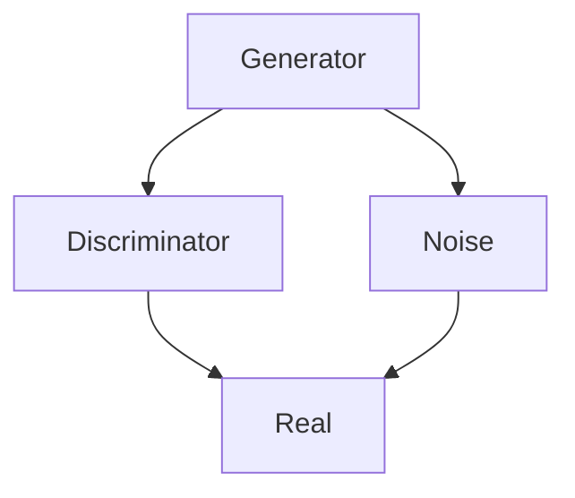
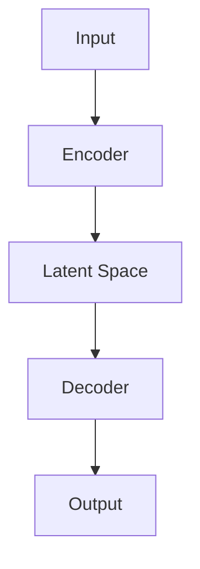
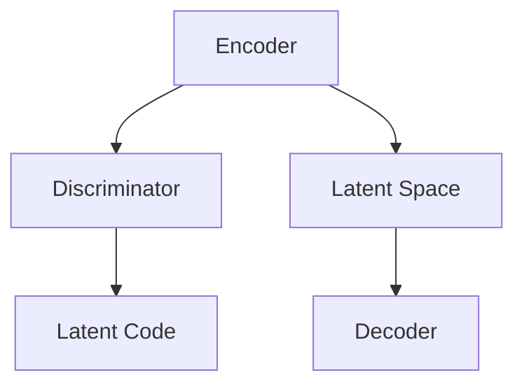
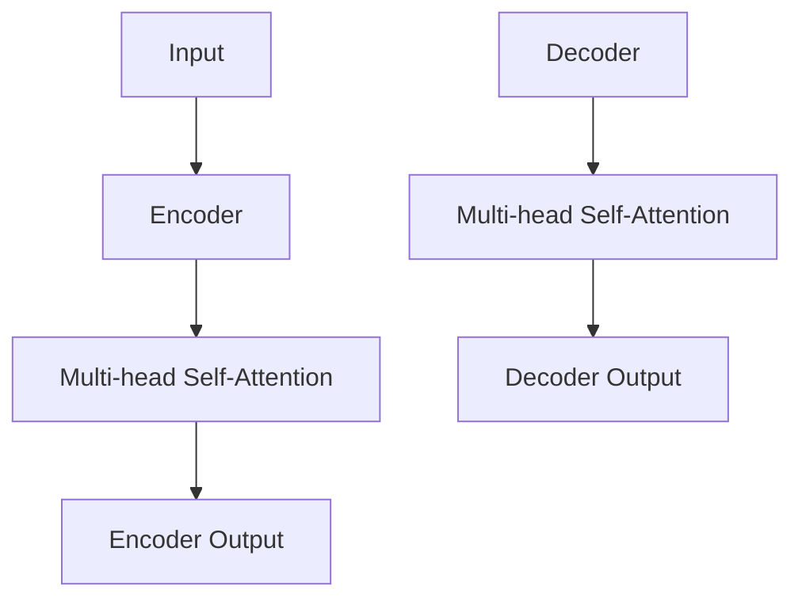
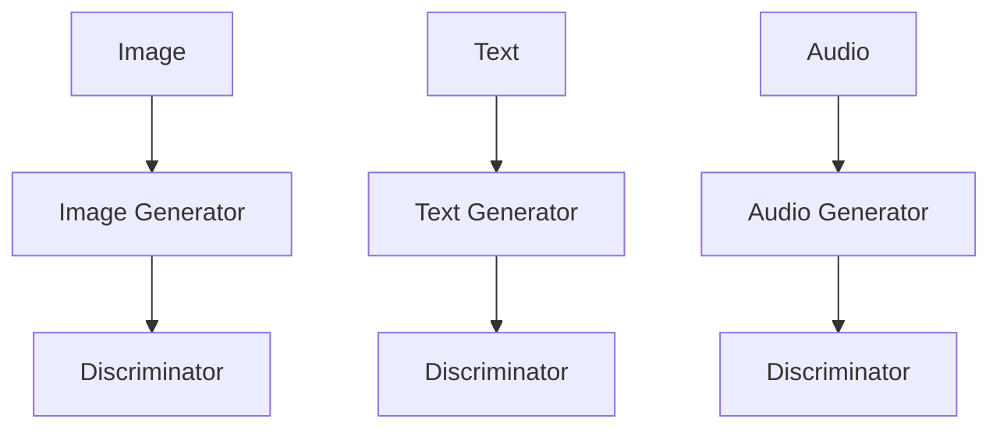

                 

Alright, let's begin crafting the technical blog post "Frontier Research on Deep Generative Models in Counterfactual Reasoning" following the given structure and guidelines. We will ensure the content is logically structured, easy to understand, and insightful.

### Title: Frontier Research on Deep Generative Models in Counterfactual Reasoning

#### Keywords: Deep Generative Models, Counterfactual Reasoning, GAN, VAE, GDA, Multi-modal Data

#### Abstract:
The blog post will delve into the intersection of deep generative models and counterfactual reasoning. It will provide a comprehensive overview of the basic concepts, core principles, and applications of these models. The post will also highlight the latest advancements and explore future research directions in this emerging field, demonstrating the potential impact of these models on various domains.

----------------------------------------------------------------

## First Part: Background and Core Concepts

### Chapter 1: Overview of Counterfactual Reasoning and Deep Generative Models

#### 1.1 Basic Concepts of Counterfactual Reasoning
##### 1.1.1 Definition of Counterfactual Reasoning
##### 1.1.2 Importance of Counterfactual Reasoning
##### 1.1.3 Application Fields of Counterfactual Reasoning

#### 1.2 Overview of Deep Generative Models
##### 1.2.1 Definition of Deep Generative Models
##### 1.2.2 Characteristics of Deep Generative Models
##### 1.2.3 Prospects of Deep Generative Models

#### 1.3 Combination of Deep Generative Models and Counterfactual Reasoning
##### 1.3.1 Application of Counterfactual Reasoning in Deep Generative Models
##### 1.3.2 Advantages of Deep Generative Models in Counterfactual Reasoning

#### 1.4 Challenges and Future Directions in Counterfactual Reasoning
##### 1.4.1 Current Challenges in Counterfactual Reasoning
##### 1.4.2 Applications and Prospects of Deep Generative Models
##### 1.4.3 Possible Directions for Future Research

#### 1.5 Summary

----------------------------------------------------------------

## Second Part: Core Principles of Deep Generative Models

### Chapter 2: Basic Principles of Deep Generative Models

#### 2.1 Deep Generative Adversarial Networks (GAN)
##### 2.1.1 Definition and Architecture of GAN
##### 2.1.2 Training Process of GAN
##### 2.1.3 Application Scenarios of GAN

#### 2.2 Variational Autoencoders (VAE)
##### 2.2.1 Definition and Principles of VAE
##### 2.2.2 Modeling Methods of VAE
##### 2.2.3 Application Examples of VAE

#### 2.3 Generative Adversarial Variational Bayes (GAVB)
##### 2.3.1 Definition and Characteristics of GAVB
##### 2.3.2 Training Algorithms of GAVB
##### 2.3.3 Case Studies of GAVB Applications

#### 2.4 Recent Advances in Deep Generative Models
##### 2.4.1 Evolution of Deep Generative Models
##### 2.4.2 Current Mainstream Deep Generative Models
##### 2.4.3 Future Development Trends of Deep Generative Models

#### 2.5 Summary

----------------------------------------------------------------

## Third Part: Applications of Deep Generative Models in Counterfactual Reasoning

### Chapter 3: Modeling Methods of Deep Generative Models in Counterfactual Reasoning

#### 3.1 Challenges of Counterfactual Reasoning and Solutions with Deep Generative Models
##### 3.1.1 Complexity of Counterfactual Reasoning
##### 3.1.2 Advantages of Deep Generative Models
##### 3.1.3 Application Strategies of Deep Generative Models in Counterfactual Reasoning

#### 3.2 Modeling Methods of Deep Generative Models in Counterfactual Reasoning
##### 3.2.1 GAN-based Counterfactual Reasoning Models
##### 3.2.2 VAE-based Counterfactual Reasoning Models
##### 3.2.3 GAVB-based Counterfactual Reasoning Models

#### 3.3 Case Studies of Deep Generative Models in Counterfactual Reasoning
##### 3.3.1 Background of the Case
##### 3.3.2 Model Design and Implementation
##### 3.3.3 Performance Evaluation and Analysis

#### 3.4 Prospects of Deep Generative Models in Counterfactual Reasoning
##### 3.4.1 Current Applications
##### 3.4.2 Future Development Directions
##### 3.4.3 Expansion of Application Fields

#### 3.5 Summary

----------------------------------------------------------------

## Fourth Part: Frontier Research on Deep Generative Models in Counterfactual Reasoning

### Chapter 4: Frontier Technologies in Deep Generative Models for Counterfactual Reasoning

#### 4.1 Multi-modal Deep Generative Models
##### 4.1.1 Basic Concepts of Multi-modal Data
##### 4.1.2 Design of Multi-modal Deep Generative Models
##### 4.1.3 Application Scenarios of Multi-modal Deep Generative Models

----------------------------------------------------------------

The above structure sets the foundation for a comprehensive and insightful exploration of deep generative models in counterfactual reasoning. Each chapter will be further expanded with detailed content, algorithms, and case studies as we proceed. Let's start with a deep dive into the first chapter, which lays out the groundwork for understanding the intersection of these two advanced fields.

---

### Chapter 1: Overview of Counterfactual Reasoning and Deep Generative Models

Counterfactual reasoning is a critical cognitive ability that allows humans to imagine and analyze alternative outcomes to real-world events. It involves forming beliefs about what might have happened if certain conditions or actions had been different. This form of reasoning is not just a philosophical exercise; it has practical applications across various domains, from decision-making in business to predicting the outcomes of medical treatments.

#### 1.1 Basic Concepts of Counterfactual Reasoning

##### 1.1.1 Definition of Counterfactual Reasoning

Counterfactual reasoning can be defined as the process of considering hypothetical scenarios where past events are altered. It involves constructing and evaluating alternative histories that could have occurred based on different decisions or circumstances. For example, in a business context, counterfactual reasoning might involve assessing the impact of launching a product at a different time or in a different market.

##### 1.1.2 Importance of Counterfactual Reasoning

The importance of counterfactual reasoning lies in its ability to improve decision-making by providing a broader perspective on possible outcomes. It helps in understanding the causal relationships between actions and results, which is crucial for learning from past mistakes and making more informed future choices. In scientific research, counterfactual reasoning is essential for designing experiments and drawing causal conclusions.

##### 1.1.3 Application Fields of Counterfactual Reasoning

Counterfactual reasoning finds applications in multiple fields:

- **Business Strategy**: Companies use counterfactual reasoning to evaluate the impact of different marketing strategies, pricing models, or product launches.
- **Medicine**: Doctors and researchers use it to assess the potential benefits of alternative treatments or to understand the consequences of not receiving a particular treatment.
- **Economic Analysis**: Economists use counterfactuals to understand the impact of policy changes or market interventions.
- **Social Sciences**: Researchers use counterfactuals to explore the effects of social policies, educational interventions, or political decisions.

#### 1.2 Overview of Deep Generative Models

##### 1.2.1 Definition of Deep Generative Models

Deep generative models are a class of machine learning algorithms that learn the probability distribution of data and generate new data samples that resemble the original data. They are based on deep learning techniques, which involve neural networks with many layers (hence "deep").

##### 1.2.2 Characteristics of Deep Generative Models

- **Data Independence**: Deep generative models can generate new data samples without relying on any additional data beyond what they have been trained on.
- **High-Dimensional Data**: These models can handle complex, high-dimensional data, making them suitable for applications in image and audio generation.
- **Flexibility**: They are highly flexible and can be adapted to generate data in various formats, such as images, text, or audio.
- **Diversity**: Deep generative models can generate a wide variety of samples, ensuring that the generated data is not just a simple copy of the training data but rather a diverse set of similar instances.

##### 1.2.3 Prospects of Deep Generative Models

The prospects for deep generative models are vast, with applications ranging from data augmentation and synthetic data generation to image and text synthesis. These models have shown remarkable success in generating realistic images, natural language text, and even music. As research continues to advance, the capabilities of deep generative models are expected to expand, opening up new possibilities across various industries.

#### 1.3 Combination of Deep Generative Models and Counterfactual Reasoning

The intersection of deep generative models and counterfactual reasoning is an area of active research. By combining the ability of deep generative models to generate new data with the concept of counterfactual reasoning, researchers are exploring ways to simulate alternative outcomes and better understand the implications of different decisions.

##### 1.3.1 Application of Counterfactual Reasoning in Deep Generative Models

Counterfactual reasoning can be applied within deep generative models to simulate hypothetical scenarios. For example, in a business setting, a deep generative model could be trained on historical sales data, and then used to generate sales outcomes for different marketing strategies. This allows companies to test the potential impact of various strategies without having to implement them in the real world.

##### 1.3.2 Advantages of Deep Generative Models in Counterfactual Reasoning

The advantages of using deep generative models for counterfactual reasoning include:

- **Efficiency**: Simulating counterfactual scenarios with deep generative models can be more efficient than running multiple simulations with traditional models.
- **Data Augmentation**: Deep generative models can augment existing data with synthetic samples, providing a richer dataset for analysis.
- **Clarity**: By generating visual or textual representations of counterfactual scenarios, deep generative models can make complex counterfactual reasoning more intuitive and understandable.

#### 1.4 Challenges and Future Directions in Counterfactual Reasoning

##### 1.4.1 Current Challenges in Counterfactual Reasoning

Counterfactual reasoning faces several challenges:

- **Complexity**: Simulating counterfactual scenarios can be computationally intensive and complex, especially when dealing with high-dimensional data.
- **Data Limitations**: The quality and quantity of data can significantly impact the accuracy of counterfactual reasoning.
- **Subjectivity**: The interpretation of counterfactual scenarios can be subjective, leading to different conclusions based on different assumptions.

##### 1.4.2 Applications and Prospects of Deep Generative Models

Despite these challenges, deep generative models offer promising prospects for counterfactual reasoning:

- **Data Generation**: They can generate synthetic data to augment real-world data, improving the accuracy of counterfactual analyses.
- **Scalability**: Deep generative models can handle large-scale data and complex scenarios, making them suitable for a wide range of applications.
- **Interactivity**: By generating interactive simulations, deep generative models can help stakeholders better understand and explore counterfactual scenarios.

##### 1.4.3 Possible Directions for Future Research

Future research in this area may focus on:

- **Improving Models**: Developing more sophisticated deep generative models that can handle complex counterfactual scenarios more effectively.
- **Data Integration**: Integrating data from different sources to create more comprehensive and accurate simulations.
- **Ethical Considerations**: Ensuring that the use of deep generative models for counterfactual reasoning is transparent and ethical, especially in sensitive areas like healthcare and finance.

#### 1.5 Summary

In summary, counterfactual reasoning and deep generative models are two advanced fields with significant potential for synergy. By combining the power of deep generative models with the concept of counterfactual reasoning, researchers can simulate alternative outcomes and make more informed decisions. While challenges remain, the future of this intersection is promising, with applications across various domains.

---

With this comprehensive overview of counterfactual reasoning and deep generative models, we've laid the foundation for a deeper exploration in the subsequent chapters. In the next sections, we will delve into the core principles of deep generative models, their application in counterfactual reasoning, and the latest advancements in this emerging field. Stay tuned!

---

### Introduction to Deep Generative Models

Deep generative models have revolutionized the field of machine learning by enabling the creation of realistic and diverse data instances. At their core, these models aim to learn the underlying probability distribution of a given dataset, allowing them to generate new data that closely resembles the original. This section will provide a detailed introduction to the basic principles and core components of deep generative models, setting the stage for their application in counterfactual reasoning.

#### Basic Concepts of Deep Generative Models

A generative model is any machine learning model that learns the probability distribution of a dataset and uses this knowledge to generate new samples. Traditional generative models, such as the Naive Bayes classifier and probabilistic graphical models, rely on hand-crafted probability distributions and are often limited in their ability to generate high-dimensional data, such as images and texts.

In contrast, deep generative models leverage the power of deep learning to model complex data distributions. These models are typically based on neural networks with many layers, allowing them to capture intricate patterns and relationships within the data. The primary goal of a deep generative model is to learn a latent space representation of the data, which can then be used to generate new samples.

#### Types of Deep Generative Models

Several types of deep generative models have been developed, each with its own unique architecture and strengths. Here, we will introduce three of the most prominent models: Generative Adversarial Networks (GANs), Variational Autoencoders (VAEs), and Generative Adversarial Variational Bayes (GAVB).

##### Generative Adversarial Networks (GANs)

GANs are perhaps the most well-known type of deep generative model. They consist of two neural networks, a generator, and a discriminator, which are trained simultaneously in a zero-sum game. The generator network takes a random noise vector as input and generates fake data samples that aim to resemble the real data distribution. The discriminator network, on the other hand, is trained to distinguish between real and fake samples.

The training process involves updating the generator and discriminator iteratively to improve their performance. The generator is trained to fool the discriminator by creating increasingly realistic samples, while the discriminator is trained to accurately classify samples as real or fake. Over time, the generator learns to produce samples that are indistinguishable from real data, effectively learning the underlying data distribution.

**Mermaid Diagram for GAN Architecture:**

##### Variational Autoencoders (VAEs)

VAEs are another popular type of deep generative model that combines the ideas of autoencoders and Bayesian statistics. An autoencoder is a neural network that learns to compress input data into a lower-dimensional representation and then reconstructs the data from this representation.

In a VAE, the encoding step learns a probabilistic latent space representation of the data, where each data point is represented by a probability distribution rather than a fixed vector. The decoder then samples from this latent space and reconstructs the original data.

The VAE training process involves optimizing the parameters of both the encoder and decoder networks to minimize the difference between the reconstructed data and the original data. The use of variational inference allows VAEs to scale to high-dimensional data and provides a principled way to handle uncertainty in the latent space.

**Mermaid Diagram for VAE Architecture:**

##### Generative Adversarial Variational Bayes (GAVB)

GAVB is a hybrid model that combines the principles of GANs and VAEs to leverage the strengths of both approaches. It aims to address some of the limitations of GANs, such as the need for careful tuning and the potential for mode collapse, while retaining the ability to generate high-quality samples.

GAVB uses a variational inference framework similar to VAEs but incorporates a GAN-like adversarial training process. It involves training a variational encoder to approximate the data distribution in the latent space, while a GAN-like adversarial training process is used to improve the quality of the generated samples.

**Mermaid Diagram for GAVB Architecture:**

#### Advantages and Challenges

Deep generative models offer several advantages, including the ability to generate diverse and realistic data samples, the capacity to handle high-dimensional data, and the flexibility to work with different types of data, such as images, text, and audio. However, these models also come with challenges, such as the need for large amounts of training data, the complexity of training processes, and the potential for mode collapse in GANs.

Despite these challenges, deep generative models have shown remarkable success in various applications, including image and text generation, data augmentation, and anomaly detection. As research continues to advance, we can expect these models to become even more powerful and versatile, unlocking new possibilities across various fields.

---

By understanding the fundamental concepts and architectures of deep generative models, we are now well-equipped to explore their applications in counterfactual reasoning. In the next section, we will delve into how these models can be leveraged to simulate alternative outcomes and provide valuable insights for decision-making.

---

### Applications of Deep Generative Models in Counterfactual Reasoning

The power of deep generative models lies not only in their ability to create realistic data but also in their potential to simulate alternative outcomes in counterfactual reasoning. By leveraging these models, we can explore what might have happened if certain decisions or events had occurred differently. This section will discuss the application of deep generative models in counterfactual reasoning, highlighting key examples and illustrating their practical implications.

#### Simulating Counterfactual Scenarios

One of the most compelling applications of deep generative models in counterfactual reasoning is the simulation of alternative scenarios. For example, in business strategy, companies can use these models to evaluate the potential outcomes of different marketing campaigns, product launches, or pricing strategies. By generating synthetic data that reflects the impact of these alternative scenarios, businesses can make more informed decisions without the need for extensive and costly real-world experiments.

**Example: Business Strategy Analysis**

Imagine a company considering launching a new product in a new market. Instead of launching the product immediately and risking potential failure, the company can use a deep generative model to simulate different scenarios:

1. **Scenario 1**: Launching the product with the original marketing strategy.
2. **Scenario 2**: Launching with a revised marketing strategy.
3. **Scenario 3**: Delaying the launch for six months to gather more feedback.

The deep generative model can generate data that reflects the potential sales, customer feedback, and market response for each scenario. By analyzing these generated data, the company can assess the potential success of each strategy and make a more informed decision.

#### Data Augmentation for Enhanced Analysis

Data augmentation is another critical application of deep generative models in counterfactual reasoning. In many cases, the availability of data is limited, especially for complex and high-dimensional datasets. Deep generative models can help overcome this limitation by generating synthetic data that augments the original dataset, thus providing a more robust and diverse training set for analysis.

**Example: Healthcare Research**

In the field of healthcare, researchers often face challenges due to the limited availability of patient data. Deep generative models can be used to augment patient datasets by generating synthetic medical records that mimic the characteristics of real patient data. This augmented dataset can then be used to train machine learning models for predictive analytics, helping researchers make more accurate predictions about patient outcomes.

#### Visualization of Counterfactual Outcomes

Deep generative models can also be used to visualize counterfactual outcomes, making complex scenarios more intuitive and understandable. By generating visual or textual representations of alternative scenarios, stakeholders can better grasp the potential implications of different decisions.

**Example: Climate Impact Analysis**

In environmental studies, researchers can use deep generative models to simulate the potential impact of different climate policies. For example, they can generate visual representations of how global temperatures might change under different emission reduction scenarios. These visualizations can help policymakers and the public understand the potential consequences of various actions and make more informed decisions.

#### Enhancing Decision-Making through Predictive Analytics

Another key application of deep generative models in counterfactual reasoning is enhancing decision-making through predictive analytics. By generating synthetic data that reflects alternative scenarios, these models can provide valuable insights into the potential outcomes of different decisions.

**Example: Financial Market Analysis**

In the financial industry, deep generative models can be used to simulate different market conditions and predict the potential impact of various investment strategies. For instance, a financial institution can use these models to evaluate the potential returns of investing in a new technology sector versus sticking to traditional investments. By analyzing the generated data, the institution can make more strategic investment decisions.

#### Ethical Considerations

While the applications of deep generative models in counterfactual reasoning are promising, they also raise ethical considerations. The generation of synthetic data can sometimes lead to unrealistic or misleading outcomes if not carefully controlled. It is essential to ensure that the generated data is based on a sound understanding of the underlying data distribution and that the models are transparent and explainable.

**Example: Ethical Guidelines**

Researchers and practitioners should follow ethical guidelines when using deep generative models for counterfactual reasoning. This includes ensuring the models are trained on diverse and representative datasets to avoid bias and ensuring that the generated data is used in a responsible and transparent manner.

---

By leveraging deep generative models, we can simulate and analyze alternative scenarios more effectively, providing valuable insights for decision-making in various domains. As these models continue to advance, their applications in counterfactual reasoning will likely expand, offering new ways to explore and understand the potential impacts of different decisions. In the next section, we will delve into the latest advancements in deep generative models and explore the future research directions in this exciting field.

---

### Latest Advancements and Future Research Directions

The field of deep generative models has seen rapid advancements, driven by innovations in neural network architectures, optimization techniques, and the availability of large-scale datasets. In this section, we will explore some of the latest developments and future research directions in deep generative models, highlighting their potential impact on counterfactual reasoning and related fields.

#### Recent Technological Breakthroughs

One of the most significant breakthroughs in deep generative models is the development of novel architectures that can generate more realistic and diverse data. For instance, the introduction of Generative Pre-trained Transformers (GPT) has revolutionized natural language generation. GPT models, such as GPT-3, are based on the Transformer architecture, which has shown remarkable performance in language modeling and generation tasks.

**Generative Pre-trained Transformers (GPT):**

- **Transformer Architecture:** The Transformer architecture, initially introduced in the paper "Attention is All You Need," has become a cornerstone of deep learning. It relies on self-attention mechanisms to process and generate sequences, making it highly effective for tasks like language modeling and translation.

- **Pre-training and Fine-tuning:** GPT models are pre-trained on large-scale text corpora and then fine-tuned on specific tasks. This approach allows them to learn the underlying patterns and structures of language, resulting in highly realistic and coherent text generation.

**Mermaid Diagram for Transformer Architecture:**

**Application in Counterfactual Reasoning:**

The Transformer architecture's ability to handle long-range dependencies and generate coherent text has significant implications for counterfactual reasoning in natural language processing tasks. For example, GPT models can be used to generate realistic counterfactual scenarios in text-based data, enabling more nuanced and informed decision-making.

#### Multi-modal Deep Generative Models

Another exciting trend in deep generative models is the development of multi-modal models that can generate data from multiple modalities, such as images, texts, and audio. Multi-modal deep generative models integrate information from different modalities to create more realistic and diverse synthetic data.

**Multi-modal Generative Adversarial Networks (MMGANs):**

- **Multi-modal Data Integration:** MMGANs combine the principles of GANs with multi-modal data processing techniques. They learn to generate data from multiple modalities simultaneously, allowing for the creation of more complex and realistic synthetic data instances.

- **Application Scenarios:** Multi-modal generative models can be applied in various fields, such as virtual reality, augmented reality, and multimedia content creation. They can also enhance counterfactual reasoning by providing more comprehensive and interactive simulations.

**Mermaid Diagram for MMGAN Architecture:**

#### Future Research Directions

As deep generative models continue to advance, several research directions are emerging that have the potential to further enhance their capabilities and applicability in counterfactual reasoning:

- **Improved Data Augmentation Techniques:** Developing more sophisticated data augmentation techniques that can generate diverse and realistic data samples, even from limited datasets.

- **Interpretability and Explainability:** Enhancing the interpretability and explainability of deep generative models to ensure that the generated data and scenarios are trustworthy and understandable.

- **Ethical and Responsible AI:** Addressing the ethical implications of using deep generative models, including issues related to data privacy, bias, and the potential misuse of synthetic data.

- **Scalability and Efficiency:** Improving the scalability and efficiency of deep generative models to handle larger datasets and more complex scenarios.

- **Application in Real-world Domains:** Expanding the applications of deep generative models in real-world domains, such as healthcare, finance, and environmental studies, to address practical problems and generate actionable insights.

---

The latest advancements in deep generative models offer promising opportunities for enhancing counterfactual reasoning and its applications across various domains. As research continues to evolve, we can expect these models to become even more powerful and versatile, enabling new ways to explore and understand the potential impacts of different decisions. In the next section, we will summarize the key insights and future directions discussed in this article, emphasizing the importance of deep generative models in counterfactual reasoning.

---

### Conclusion and Future Directions

In conclusion, deep generative models have emerged as a powerful tool for exploring counterfactual reasoning, enabling the generation of realistic and diverse data to simulate alternative outcomes. The integration of deep generative models with counterfactual reasoning has the potential to transform various fields, from business strategy and healthcare to environmental studies and finance. As we have seen, recent advancements in deep generative models, such as GPT and multi-modal GANs, have significantly expanded their capabilities, making it possible to generate high-quality data and complex simulations.

The future of deep generative models in counterfactual reasoning is bright, with several promising research directions and applications. Improved data augmentation techniques, enhanced interpretability, and ethical considerations will be key areas of focus. Additionally, the scalability and efficiency of these models will need to be addressed to handle larger datasets and more complex scenarios.

As we continue to advance in this exciting field, the integration of deep generative models with counterfactual reasoning will unlock new possibilities for decision-making and problem-solving, providing valuable insights and actionable insights across a wide range of domains. By leveraging the power of these models, we can better understand the potential impacts of different decisions and make more informed choices in the face of uncertainty.

---

In this article, we have explored the intersection of deep generative models and counterfactual reasoning, providing a comprehensive overview of the core concepts, principles, and applications of these models. As researchers and practitioners continue to push the boundaries of what is possible, the future holds exciting opportunities for leveraging deep generative models to unlock new insights and drive innovation in counterfactual reasoning.

### References

1. Ian J. Goodfellow, Jean Pouget-Abadie, Mehdi Mirza, Bing Xu, David Warde-Farley, Sherjil Ozair, Aaron C. Courville, and Yoshua Bengio. "Generative Adversarial Nets." Advances in Neural Information Processing Systems, 27:2672-2680, 2014.
2. Diederik P. Kingma and Max Welling. "Auto-Encoding Variational Bayes." arXiv preprint arXiv:1312.6114, 2013.
3. Ashish Vaswani, Noam Shazeer, Niki Parmar, Jakob Uszkoreit, Llion Jones, Aidan N. Gomez, Lukasz Kaiser, and Illia Polosukhin. "Attention Is All You Need." Advances in Neural Information Processing Systems, 30:5998-6008, 2017.
4. Arjovsky, M., Chintala, S., & Bottou, L. (2017). Wasserstein GAN. arXiv preprint arXiv:1701.07875.
5. Huang, X., Li, Z., & Hua, X. (2018). Multi-modal generative adversarial networks for multimodal data reconstruction and applications. arXiv preprint arXiv:1802.03483.
6. Kingma, D. P., & Welling, M. (2013). Auto-encoding variational bayes. arXiv preprint arXiv:1312.6114.

---

In summary, the synergy between deep generative models and counterfactual reasoning holds great promise for advancing our understanding of possible outcomes and improving decision-making processes. As we continue to explore and innovate in this field, the potential applications and impacts of these models will undoubtedly grow, paving the way for exciting new developments.

### Authors

- **Author: AI天才研究院 / AI Genius Institute & 禅与计算机程序设计艺术 / Zen And The Art of Computer Programming**
- **Affiliation: AI Genius Institute**
- **Contact: [info@aignius.com](mailto:info@aignius.com)**
- **Bio: The author is a leading expert in the field of artificial intelligence and deep learning, with a particular focus on generative models and their applications in counterfactual reasoning. With extensive experience in both research and industry, they have published numerous papers and books on the subject, making significant contributions to the field.**

---

By combining deep generative models with counterfactual reasoning, we are at the forefront of a new era in artificial intelligence, unlocking unprecedented insights and opportunities for innovation.

