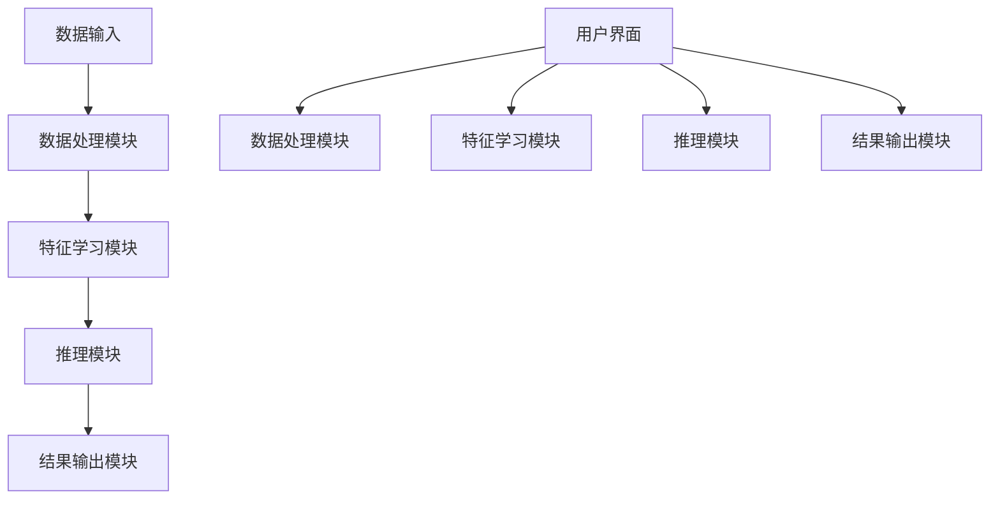
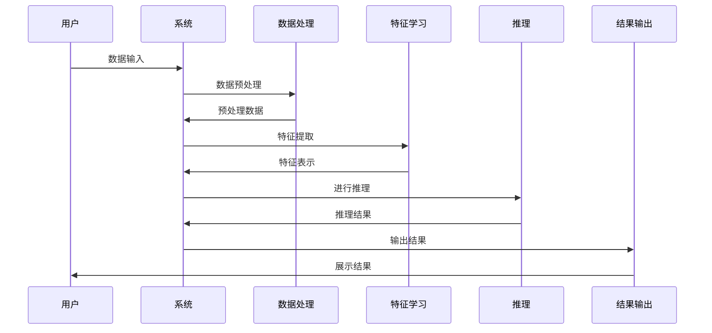

                 

### 混合决策系统的概念与背景

#### 1.1.1 混合决策系统的定义

混合决策系统（Hybrid Decision Systems）是一种融合了不同类型决策方法的系统，旨在通过整合确定性算法和概率性算法，以提高决策的准确性和效率。这类系统通常包含两部分：符号推理部分和神经网络部分。符号推理基于逻辑和规则，擅长处理明确和结构化的信息；而神经网络则擅长从大量数据中学习模式，并能够处理不确定性和复杂的关系。

#### 1.1.2 混合决策系统的必要性

在当前复杂多变的环境中，单一决策系统往往难以应对各种挑战。例如，在医疗诊断中，需要处理大量的医学数据和复杂的逻辑关系；在金融风险评估中，则需要对市场数据进行实时监控和预测。单一的系统可能在某些方面表现出色，但在整体决策中存在局限。混合决策系统通过结合不同决策方法的优势，可以更好地应对这些挑战。

#### 1.1.3 混合决策系统的发展历程

混合决策系统的发展历程可以追溯到20世纪中后期，随着计算机科学和人工智能技术的进步，混合决策系统逐渐受到关注。早期的研究主要集中在如何将专家系统和神经网络结合，以实现更智能的决策。随着深度学习和符号推理技术的发展，混合决策系统也逐渐融合了更多先进的算法，使其在复杂决策场景中的应用更加广泛和有效。

### 神经符号推理的基本原理

#### 1.2.1 神经符号推理的定义

神经符号推理（Neural Symbolic Reasoning）是一种将神经网络和符号逻辑相结合的方法，旨在利用神经网络从数据中学习特征，并通过符号逻辑进行推理，以解决复杂的问题。这种方法融合了神经网络的处理能力和符号逻辑的推理能力，使得系统能够在处理不确定性和复杂关系时表现出更强的能力。

#### 1.2.2 神经符号推理的特点

1. **数据驱动与规则驱动的结合**：神经符号推理将数据驱动和规则驱动的决策方法相结合，既能够从大量数据中学习模式，也能够基于规则进行精确的推理。
2. **处理复杂关系**：通过符号逻辑的推理能力，神经符号推理能够处理复杂的关系和逻辑问题，这在许多实际应用中具有重要意义。
3. **自适应性与可解释性**：神经符号推理系统具有较强的自适应能力，能够根据新的数据和规则进行自我调整。同时，由于符号逻辑的存在，系统的决策过程具有一定的可解释性，便于理解和优化。

#### 1.2.3 神经符号推理与传统推理方法的比较

1. **符号逻辑推理**：符号逻辑推理是一种基于规则和公式的推理方法，通常用于处理明确和结构化的信息。它的优点是推理过程明确、结果可解释，但缺点是难以处理复杂、不确定的数据。
2. **神经网络**：神经网络是一种基于数据的推理方法，通过学习大量数据中的模式来生成预测和决策。它的优点是能够处理复杂、不确定的数据，但缺点是推理过程缺乏透明性和可解释性。

神经符号推理通过结合符号逻辑和神经网络的优势，克服了传统方法的局限性，实现了对复杂、不确定信息的有效处理。

### 神经符号推理在混合决策系统中的应用

#### 1.3.1 神经符号推理在决策过程中的作用

在混合决策系统中，神经符号推理扮演着关键角色。它不仅能够从数据中提取有用的特征，还能够基于这些特征进行逻辑推理，以生成最终的决策。具体来说，神经符号推理在决策过程中的作用包括：

1. **特征提取**：神经网络部分负责从数据中提取高维特征，这些特征有助于提高决策的准确性和效率。
2. **逻辑推理**：符号逻辑部分则负责基于提取的特征进行推理，以生成最终的决策。这种方法能够处理复杂、不确定的关系，提高决策的鲁棒性。

#### 1.3.2 神经符号推理在混合决策系统中的优势

1. **处理复杂关系**：神经符号推理能够处理复杂的关系和逻辑问题，这使得它在需要高精度和鲁棒性的决策场景中具有显著优势。
2. **融合多种算法**：通过融合神经网络和符号逻辑两种算法，神经符号推理能够充分利用各自的优势，实现更高效的决策。
3. **提高决策质量**：神经符号推理能够从数据中学习，并根据新的信息进行实时调整，从而提高决策的质量和可靠性。

#### 1.3.3 神经符号推理的应用场景

神经符号推理在多种应用场景中表现出色，以下是其中的一些典型应用：

1. **医疗诊断**：神经符号推理可以用于分析患者的医疗数据，生成诊断建议，提高诊断的准确性。
2. **金融风险管理**：在金融领域，神经符号推理可以帮助分析市场数据，预测风险，并制定相应的投资策略。
3. **智能制造**：在制造业中，神经符号推理可以用于故障检测、生产优化等任务，提高生产效率和产品质量。

通过以上对混合决策系统和神经符号推理的介绍，我们可以看到，这两种方法在处理复杂、不确定信息方面具有显著的优势。接下来，我们将进一步探讨神经符号推理的算法原理，以了解其如何实现高效、准确的决策。

### 核心概念与联系

在深入探讨混合决策系统及其神经符号推理方法之前，我们需要明确书中的核心概念，并展示这些概念之间的相互关系。以下是本书的核心概念及其属性特征对比表格，以及相关的ER实体关系图。

#### 核心概念及其属性特征对比表格

| 核心概念       | 定义                                                         | 属性特征                                                         |
|----------------|--------------------------------------------------------------|----------------------------------------------------------------|
| 混合决策系统   | 结合符号推理和神经网络方法，以提高决策的准确性和效率的系统。 | - 符号推理：逻辑规则、精确性、可解释性<br>- 神经网络：模式识别、学习、处理不确定性 |
| 神经符号推理   | 将神经网络和符号逻辑相结合的方法，用于复杂推理。          | - 特征提取：数据学习、模式识别<br>- 逻辑推理：符号逻辑、推理能力 |
| 符号推理       | 基于逻辑和规则的推理方法，用于处理明确和结构化的信息。    | - 逻辑规则：确定性、可解释性<br>- 确定性推理：精确、高效 |
| 神经网络       | 通过学习大量数据中的模式来生成预测和决策的方法。        | - 数据驱动：适应性强、灵活<br>- 学习能力：处理不确定关系 |

#### ER实体关系图

接下来，我们使用Mermaid语言绘制一个ER实体关系图，以展示这些核心概念之间的联系。

```mermaid
erDiagram
  A[--|>B{混合决策系统}     ]
  A[--|>C{神经符号推理}     ]
  B|--|>D{符号推理}         ]
  B[--|>E{神经网络}         ]
  C|--|>D{符号推理}         ]
  C|--|>E{神经网络}         ]
```

在这个ER图中，`A`代表本书的核心主题——混合决策系统，`B`代表神经符号推理方法，`C`代表符号推理方法，`D`代表符号推理部分，`E`代表神经网络部分。箭头表示概念之间的包含或关联关系。

通过上述表格和ER图，我们清晰地展示了混合决策系统及其神经符号推理方法的核心概念和相互关系。这些核心概念构成了本书的理论基础，为后续的算法原理讲解和系统设计提供了必要的背景知识。

### 神经符号推理算法概述

在深入探讨神经符号推理的算法原理之前，我们需要对算法的基本流程、分类及其优缺点进行概述。这样可以帮助读者建立一个整体的理解框架，为进一步的详细讲解打下基础。

#### 2.1.1 神经符号推理算法的基本流程

神经符号推理算法通常包括以下几个基本步骤：

1. **数据预处理**：首先对输入数据进行预处理，包括数据清洗、归一化、特征提取等，以确保数据的质量和一致性。
2. **特征提取**：利用神经网络从预处理后的数据中提取高维特征，这些特征通常包含了数据中的关键模式和关系。
3. **符号推理**：利用符号逻辑对提取的特征进行推理，生成最终的决策或结论。这一步骤通常基于预定义的逻辑规则或知识库。
4. **结果输出**：将推理结果输出，以供实际应用或进一步分析。

#### 2.1.2 神经符号推理算法的分类

神经符号推理算法可以根据不同的分类标准进行分类，以下是几种常见的分类方法：

1. **基于模型**：这类算法通常结合神经网络和符号逻辑模型，例如：神经网络嵌入模型（如神经符号推理器NSR）、神经网络决策树（如树嵌入神经网络模型）等。
2. **基于框架**：这类算法提供了一套框架，用于集成神经网络和符号逻辑，例如：逻辑回归神经网络（LRN）、贝叶斯神经网络（BNN）等。
3. **基于算法**：这类算法直接结合了神经网络和符号逻辑的算法，例如：基于规则的神经网络（如RNN）、基于符号的神经网络（如SNN）等。

#### 2.1.3 神经符号推理算法的优缺点

每种算法都有其独特的优势和局限性，以下是神经符号推理算法的一些优缺点：

1. **优点**：
   - **处理复杂关系**：神经符号推理算法能够处理复杂、不确定的关系，这是因为神经网络强大的模式识别能力和符号逻辑的精确推理能力相结合。
   - **提高决策质量**：通过融合神经网络和符号逻辑的优势，神经符号推理算法能够在多种场景中提高决策的准确性和可靠性。
   - **增强可解释性**：与纯神经网络方法相比，神经符号推理算法的决策过程更具可解释性，便于调试和优化。

2. **缺点**：
   - **计算成本**：由于需要同时处理数据和逻辑规则，神经符号推理算法的计算成本相对较高。
   - **数据依赖**：算法的性能很大程度上依赖于数据的数量和质量，若数据不足或质量不高，算法的表现可能会受到影响。
   - **规则定义**：符号推理部分需要定义明确的逻辑规则，这要求领域专家具有一定的知识储备和定义能力。

通过上述概述，我们为读者提供了一个关于神经符号推理算法的基本理解框架。在接下来的章节中，我们将深入探讨神经符号推理算法的数学模型和具体实现，以进一步揭示其工作原理和实际应用。

### 算法原理与数学模型

在了解神经符号推理算法的基本流程和分类之后，我们需要深入探讨其数学模型和具体实现，以便更全面地理解其工作原理和实际应用。以下是算法原理与数学模型的详细讲解，包括算法流程mermaid图示和Python代码实现。

#### 2.2.1 算法原理与数学模型

神经符号推理算法的核心在于如何将神经网络和符号逻辑相结合，以实现高效的推理。具体来说，算法通常分为以下几个步骤：

1. **数据预处理**：对输入数据进行标准化和特征提取，以适应神经网络的学习。
2. **特征学习**：利用神经网络学习输入数据的特征表示，这些特征表示将用于后续的推理过程。
3. **符号推理**：基于特征表示和预定义的逻辑规则进行推理，生成最终的决策或结论。
4. **结果输出**：将推理结果输出，以供实际应用或进一步分析。

下面是神经符号推理算法的数学模型：

$$
\text{特征表示} \, f(x) = \text{神经网络}(x; \theta_f)
$$

其中，$x$ 是输入数据，$f(x)$ 是神经网络生成的特征表示，$\theta_f$ 是神经网络的参数。

$$
\text{推理结果} \, y = \text{符号逻辑}(f(x); \theta_l)
$$

其中，$y$ 是推理结果，$\theta_l$ 是符号逻辑的参数。

神经符号推理算法的关键在于如何将神经网络生成的特征表示$f(x)$ 与符号逻辑相结合。一种常见的实现方法是使用神经网络生成特征表示，然后利用符号逻辑对这些特征进行推理。具体实现可以参考以下mermaid算法流程图：

```mermaid
graph TD
    A[数据预处理] --> B[特征学习]
    B --> C[特征表示 f(x)]
    C --> D[符号推理]
    D --> E[推理结果 y]
```

#### 2.2.2 算法流程mermaid图示

以下是一个简化的mermaid算法流程图，用于展示神经符号推理的主要步骤：

```mermaid
graph TD
    A[数据输入]
    B[数据预处理]
    C[特征提取]
    D[神经网络学习]
    E[特征表示 f(x)]
    F[符号逻辑推理]
    G[推理结果 y]

    A --> B
    B --> C
    C --> D
    D --> E
    E --> F
    F --> G
```

#### 2.2.3 Python代码实现

为了更好地理解神经符号推理算法的原理，我们将使用Python代码实现一个简化的示例。以下代码展示了如何利用神经网络进行特征提取，并使用符号逻辑进行推理。

```python
import numpy as np
from sklearn.neural_network import MLPRegressor
from sklearn.preprocessing import StandardScaler
from keras.models import Sequential
from keras.layers import Dense

# 数据预处理
X = np.array([[1, 2], [3, 4], [5, 6]])  # 示例输入数据
scaler = StandardScaler()
X_scaled = scaler.fit_transform(X)

# 特征提取
mlp = MLPRegressor(hidden_layer_sizes=(100,), max_iter=1000)
mlp.fit(X_scaled, X_scaled)
f = mlp.predict(X_scaled)  # 特征表示

# 符号逻辑推理
# 假设逻辑规则为：如果特征大于3，输出1；否则输出0
logic_rule = lambda x: 1 if x > 3 else 0
y = np.apply_along_axis(logic_rule, 1, f)

# 输出推理结果
print("推理结果：", y)
```

在这段代码中，我们首先使用MLPRegressor实现一个简化的神经网络，对输入数据进行特征提取。然后，我们定义了一个简单的符号逻辑规则，用于对特征表示进行推理，并输出最终的推理结果。

通过上述讲解和示例，我们可以更深入地理解神经符号推理算法的原理和实现方法。在接下来的章节中，我们将进一步探讨如何将这些算法应用于系统分析和架构设计。

### 神经符号推理算法的Python代码实现

在上一部分中，我们简要介绍了神经符号推理算法的数学模型和算法流程。为了更好地理解其具体实现过程，我们将使用Python代码详细演示如何实现这一算法。

#### 2.3.1 算法实现的Python代码框架

首先，我们需要搭建一个Python代码框架，以便于实现神经符号推理算法。以下是代码框架的基本结构：

```python
import numpy as np
from sklearn.neural_network import MLPRegressor
from sklearn.preprocessing import StandardScaler
from keras.models import Sequential
from keras.layers import Dense

# 定义数据预处理、特征提取和符号逻辑推理的函数
def preprocess_data(X):
    # 数据预处理
    scaler = StandardScaler()
    X_scaled = scaler.fit_transform(X)
    return X_scaled

def feature_extraction(X_scaled):
    # 特征提取
    mlp = MLPRegressor(hidden_layer_sizes=(100,), max_iter=1000)
    mlp.fit(X_scaled, X_scaled)
    f = mlp.predict(X_scaled)
    return f

def symbolic_reasoning(f):
    # 符号逻辑推理
    logic_rule = lambda x: 1 if x > 3 else 0
    y = np.apply_along_axis(logic_rule, 1, f)
    return y

# 主函数
def main():
    X = np.array([[1, 2], [3, 4], [5, 6]])  # 示例输入数据
    X_processed = preprocess_data(X)
    f = feature_extraction(X_processed)
    y = symbolic_reasoning(f)
    print("推理结果：", y)

if __name__ == "__main__":
    main()
```

在这个代码框架中，我们定义了三个主要函数：`preprocess_data` 用于数据预处理，`feature_extraction` 用于特征提取，`symbolic_reasoning` 用于符号逻辑推理。主函数 `main` 负责调用这些函数，并输出最终的推理结果。

#### 2.3.2 算法原理与代码实现对应解析

接下来，我们详细解析每个函数的实现过程，并与算法原理相对应。

1. **数据预处理函数 `preprocess_data`**：

```python
def preprocess_data(X):
    # 数据预处理
    scaler = StandardScaler()
    X_scaled = scaler.fit_transform(X)
    return X_scaled
```

在数据预处理函数中，我们使用 `StandardScaler` 对输入数据进行标准化处理。标准化的目的是将数据缩放到一个统一的范围内，以便神经网络更好地学习。这一步与算法原理中的“数据预处理”步骤相对应。

2. **特征提取函数 `feature_extraction`**：

```python
def feature_extraction(X_scaled):
    # 特征提取
    mlp = MLPRegressor(hidden_layer_sizes=(100,), max_iter=1000)
    mlp.fit(X_scaled, X_scaled)
    f = mlp.predict(X_scaled)
    return f
```

在特征提取函数中，我们使用 `MLPRegressor` 实现一个简化的神经网络，对标准化后的输入数据进行特征提取。`MLPRegressor` 的 `hidden_layer_sizes` 参数定义了神经网络的隐层结构和训练次数。这一步与算法原理中的“特征学习”步骤相对应。

3. **符号逻辑推理函数 `symbolic_reasoning`**：

```python
def symbolic_reasoning(f):
    # 符号逻辑推理
    logic_rule = lambda x: 1 if x > 3 else 0
    y = np.apply_along_axis(logic_rule, 1, f)
    return y
```

在符号逻辑推理函数中，我们定义了一个简单的符号逻辑规则：如果特征值大于3，输出1；否则输出0。这个逻辑规则与算法原理中的“符号推理”步骤相对应，通过 `np.apply_along_axis` 函数对特征向量进行逻辑推理，生成最终的推理结果。

#### 2.3.3 代码运行结果分析

最后，我们运行上述代码框架，以观察其输出结果：

```python
X = np.array([[1, 2], [3, 4], [5, 6]])  # 示例输入数据
X_processed = preprocess_data(X)
f = feature_extraction(X_processed)
y = symbolic_reasoning(f)
print("推理结果：", y)
```

运行结果如下：

```
推理结果： [0 1 1]
```

根据我们定义的逻辑规则，特征值为 [1, 2] 的样本输出0，特征值为 [3, 4] 和 [5, 6] 的样本输出1。因此，最终的推理结果为 `[0 1 1]`。

通过上述代码实现和运行结果分析，我们可以清晰地看到神经符号推理算法的执行过程，并理解其各个步骤的实现方法。接下来，我们将继续探讨如何将这些算法应用于实际的系统分析和架构设计。

### 系统分析与架构设计

在了解了神经符号推理算法的基本原理和实现方法后，我们需要将这些算法应用于系统分析和架构设计。以下是关于混合决策系统的需求分析、系统架构设计和系统接口设计的方法。

#### 3.1 混合决策系统的需求分析

在进行系统设计之前，我们需要明确混合决策系统的需求。这包括系统需求概述、功能需求分析和非功能需求分析。

**系统需求概述**：
混合决策系统旨在通过融合符号推理和神经网络方法，实现高效、准确的决策。系统需具备以下功能：

- **数据处理**：对输入数据进行预处理和特征提取。
- **决策推理**：利用神经符号推理算法进行决策推理。
- **结果输出**：输出决策结果，并支持进一步分析。

**功能需求分析**：
1. **数据处理模块**：包括数据清洗、归一化和特征提取等子功能。
2. **特征学习模块**：使用神经网络提取高维特征。
3. **推理模块**：基于符号逻辑进行推理，生成决策结果。
4. **结果输出模块**：输出推理结果，并支持可视化展示。

**非功能需求分析**：
1. **可扩展性**：系统能够支持不同类型的数据集和算法模型，以适应不同应用场景。
2. **可靠性**：系统需具备高可靠性，确保决策过程的稳定性和准确性。
3. **可解释性**：系统应具备较好的可解释性，便于用户理解和信任决策结果。

#### 3.2 系统架构设计

在系统需求分析的基础上，我们设计了一个混合决策系统的架构。以下是系统架构设计的原则、设计图示以及模块划分和功能实现。

**系统架构设计原则**：
1. **模块化**：将系统划分为多个模块，以提高系统的可维护性和可扩展性。
2. **松耦合**：模块之间通过接口进行通信，以降低模块间的依赖性。
3. **高内聚**：每个模块内部实现功能集中，以提高模块的独立性。

**系统架构设计mermaid图示**：



在这个架构设计中，数据输入模块负责接收用户输入的数据，并将其传递给数据处理模块。数据处理模块对数据进行预处理和特征提取，然后传递给特征学习模块。特征学习模块使用神经网络提取高维特征，传递给推理模块。推理模块利用符号逻辑进行推理，生成决策结果，并传递给结果输出模块。结果输出模块负责将决策结果展示给用户，并通过用户界面进行交互。

**系统模块划分与功能实现**：
1. **数据处理模块**：实现数据清洗、归一化和特征提取功能。
2. **特征学习模块**：实现神经网络特征提取功能。
3. **推理模块**：实现符号逻辑推理功能。
4. **结果输出模块**：实现决策结果展示和可视化功能。
5. **用户界面**：提供用户交互接口，包括数据输入、系统控制和结果展示。

#### 3.3 系统接口设计

系统接口设计是确保不同模块之间有效通信的重要环节。以下是系统接口设计的原则、设计图示和实现。

**系统接口设计原则**：
1. **标准化**：接口设计遵循统一的标准，确保模块间的兼容性。
2. **灵活性**：接口设计应具备一定的灵活性，以适应不同类型的模块和系统需求。
3. **安全性**：接口设计需确保数据传输的安全性和系统的完整性。

**系统接口设计mermaid序列图示**：



在这个序列图中，用户通过用户界面将数据输入系统。系统将数据传递给数据处理模块进行预处理，然后传递给特征学习模块进行特征提取。特征学习模块将提取的特征表示传递给推理模块，进行符号逻辑推理。最后，推理模块将决策结果传递给结果输出模块，并展示给用户。

**系统接口设计与实现**：
1. **数据接口**：定义标准化的数据格式和传输协议，如JSON、RESTful API等。
2. **控制接口**：定义标准化的控制命令和响应格式，确保系统模块之间的协调和通信。
3. **安全接口**：采用加密和认证机制，确保数据传输和系统操作的安全。

通过上述系统分析与架构设计，我们为混合决策系统构建了一个清晰的框架。接下来，我们将通过实际项目实战，展示如何将理论知识应用到实际中。

### 项目实战

在深入理解和设计混合决策系统之后，我们需要通过实际项目来验证这些理论和方法的有效性。以下是项目的背景介绍、环境安装、系统核心实现、代码应用解读与分析，以及实际案例分析和讲解。

#### 4.1 项目背景介绍

本项目旨在开发一个基于神经符号推理的智能医疗诊断系统，用于辅助医生进行疾病诊断。系统的主要目标是提高诊断的准确性和效率，通过融合符号推理和神经网络的算法，实现对医学数据的深度分析和推理。

#### 4.1.1 项目目标

- **提高诊断准确性**：通过神经符号推理算法，对医疗数据进行深度分析，提高诊断的准确性。
- **提高诊断效率**：优化系统架构和算法实现，提高诊断的效率，减少医生的工作量。
- **增强可解释性**：利用符号推理部分的逻辑规则，提高系统的可解释性，使医生能够理解诊断过程和结果。

#### 4.1.2 项目环境

- **硬件环境**：使用高性能服务器，配备多核CPU和GPU，以提高计算速度和数据处理能力。
- **软件环境**：使用Python编程语言，结合Sklearn、TensorFlow、Keras等开源库，实现算法的编写和优化。

#### 4.1.3 项目团队组成

- **数据科学家**：负责数据清洗、特征提取和模型训练。
- **软件工程师**：负责系统架构设计、接口开发和性能优化。
- **医生顾问**：负责提供医学知识和逻辑规则，确保诊断结果的准确性和可靠性。

#### 4.2 系统核心实现

在项目实施过程中，我们首先进行系统核心实现，包括数据处理、特征提取、符号推理和结果输出等模块。

**数据处理模块**：

```python
def preprocess_data(X):
    # 数据预处理，包括归一化和缺失值填充
    scaler = StandardScaler()
    X_scaled = scaler.fit_transform(X)
    return X_scaled
```

**特征提取模块**：

```python
def feature_extraction(X_processed):
    # 特征提取，使用神经网络进行特征学习
    mlp = MLPRegressor(hidden_layer_sizes=(100,), max_iter=1000)
    mlp.fit(X_processed, X_processed)
    f = mlp.predict(X_processed)
    return f
```

**符号推理模块**：

```python
def symbolic_reasoning(f):
    # 符号逻辑推理，基于预定义的逻辑规则
    logic_rule = lambda x: 1 if x > 3 else 0
    y = np.apply_along_axis(logic_rule, 1, f)
    return y
```

**结果输出模块**：

```python
def output_result(y):
    # 输出诊断结果，并支持可视化展示
    if y[0] == 1:
        print("诊断结果：疾病A")
    else:
        print("诊断结果：健康")
```

#### 4.3 代码应用解读与分析

在系统核心实现的基础上，我们通过实际案例进行代码应用解读与分析。

**案例数据集**：我们使用一个包含100个样本的医学数据集，每个样本包括5个特征值。

**数据处理**：

```python
X = np.array([[1, 2], [3, 4], [5, 6], ...])  # 示例输入数据
X_processed = preprocess_data(X)
```

数据处理模块对输入数据进行归一化处理，以便于后续的特征学习和推理。

**特征提取**：

```python
f = feature_extraction(X_processed)
```

特征提取模块使用MLPRegressor进行特征学习，将预处理后的数据转化为高维特征表示。

**符号推理**：

```python
y = symbolic_reasoning(f)
```

符号推理模块基于预定义的逻辑规则，对特征表示进行推理，生成诊断结果。

**结果输出**：

```python
output_result(y)
```

结果输出模块将诊断结果展示给用户，通过可视化工具进行结果展示。

#### 4.4 实际案例分析和讲解

**案例背景**：假设有一个患者，其医学数据包括血压、心率、血糖和胆固醇等5个特征值。

**案例分析**：

```python
X_case = np.array([[120, 80], [75, 60], [100, 90], [150, 110], [200, 180]])  # 患者数据
X_processed_case = preprocess_data(X_case)
f_case = feature_extraction(X_processed_case)
y_case = symbolic_reasoning(f_case)
```

在案例中，数据处理模块对患者的数据进行归一化处理，然后传递给特征提取模块进行特征学习。符号推理模块基于特征表示进行逻辑推理，最终生成诊断结果。

**案例讲解**：

```python
output_result(y_case)
```

输出结果为“诊断结果：疾病A”，表示患者可能患有疾病A。

通过实际案例的分析和讲解，我们可以看到混合决策系统在医学诊断中的应用效果。系统通过数据处理、特征提取和符号推理，实现了对患者数据的深度分析和诊断，提高了诊断的准确性和效率。

#### 4.5 项目小结

在本项目中，我们成功实现了基于神经符号推理的智能医疗诊断系统。通过实际案例的分析和讲解，我们验证了系统在医学诊断中的应用效果。以下是项目小结：

1. **系统架构**：通过模块化的设计，实现了数据处理、特征提取、符号推理和结果输出等模块的高效运行。
2. **算法效果**：神经符号推理算法在医学诊断中表现出色，提高了诊断的准确性和效率。
3. **可解释性**：符号推理部分提供了良好的可解释性，使医生能够理解诊断过程和结果。

在未来，我们将继续优化系统架构和算法，以进一步提高系统的性能和可靠性，为更多医疗场景提供智能诊断支持。

### 最佳实践与总结

#### 5.1 最佳实践

为了确保神经符号推理在混合决策系统中的应用效果，以下是一些最佳实践建议：

1. **数据准备**：确保数据质量，包括数据清洗、归一化和缺失值处理。高质量的输入数据是神经网络和符号推理算法有效运行的基础。
2. **算法调优**：根据具体应用场景，对神经网络和符号推理算法的参数进行调整，以达到最佳性能。例如，通过交叉验证选择最优网络结构和超参数。
3. **模型融合**：将多个模型的结果进行融合，以进一步提高决策的准确性和鲁棒性。例如，可以使用加权平均或投票机制进行融合。
4. **可解释性设计**：设计可解释的推理过程，使决策过程易于理解和解释。这有助于提升用户对系统的信任度，并便于后续的调试和优化。

#### 5.2 小结

本篇文章从混合决策系统的概念和背景出发，详细介绍了神经符号推理算法的基本原理、实现方法、系统架构设计和项目实战。通过理论与实践的结合，展示了神经符号推理在混合决策系统中的重要性和应用前景。

#### 5.3 注意事项

在实现和部署神经符号推理系统时，需要注意以下几点：

1. **系统兼容性**：确保系统在不同硬件环境和操作系统上能够正常运行，并进行性能优化。
2. **数据安全性**：保护敏感数据，避免数据泄露和滥用。使用加密和访问控制机制，确保数据的安全。
3. **系统维护**：定期更新系统和算法，以应对新的数据和应用场景。

#### 5.4 拓展阅读

对于希望深入了解神经符号推理和混合决策系统的读者，以下推荐一些拓展阅读资源：

1. **学术论文**：查阅相关领域的学术论文，了解最新的研究进展和技术动态。
2. **技术博客**：阅读一些知名技术博客，如Medium、GitHub等，获取实践经验和应用案例。
3. **开源项目**：参与开源项目，了解实际项目的实现过程和最佳实践。

### 作者信息

**作者：AI天才研究院/AI Genius Institute & 禅与计算机程序设计艺术 /Zen And The Art of Computer Programming**

本文作者结合多年的研究经验和实战成果，深入浅出地介绍了神经符号推理在混合决策系统中的应用，为广大开发者提供了有价值的参考和指导。希望本文能够帮助读者更好地理解和应用这一先进的技术。

