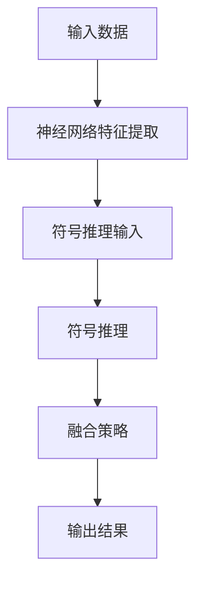
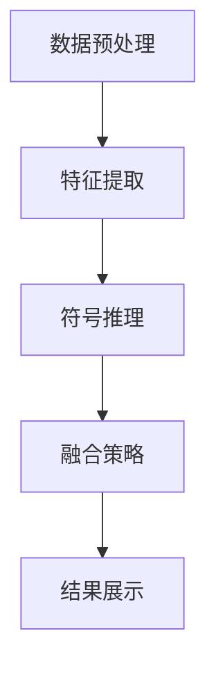

                 

### 引言

在当今人工智能迅猛发展的时代，如何高效地集成不同类型的推理方法成为了关键课题。特别是在复杂问题求解和智能决策系统中，混合推理优化框架的应用显得尤为重要。混合推理优化框架旨在结合符号推理和神经网络的各自优势，实现更加强大和灵活的推理能力。然而，传统的混合推理方法在处理大规模数据和高维度特征时，存在计算复杂度高、收敛速度慢等问题。

神经符号集成作为一种新兴的混合推理优化方法，通过结合神经网络的强大特征提取能力和符号推理的精确逻辑推理，为解决复杂推理问题提供了新的思路。本文将深入探讨神经符号集成的新方法，旨在为研究者提供系统的理论基础和实用的实现指南。

本文结构如下：首先，我们将介绍混合推理优化框架的背景和核心概念，明确本文的研究目标和研究方法；接着，深入讲解神经符号集成的原理和算法，通过具体的数学模型和公式，帮助读者理解其工作方式；然后，我们介绍系统分析与架构设计方案，展示神经符号集成在实际应用中的效果；接下来，通过项目实战，展示如何实现神经符号集成；最后，总结本文的主要发现，并提出最佳实践和未来的研究方向。

### 文章关键词

- **混合推理优化框架**：结合符号推理和神经网络的推理方法。
- **神经符号集成**：神经网络与符号推理相结合的混合推理方法。
- **算法原理**：神经符号集成的数学模型和公式。
- **系统架构**：神经符号集成的系统设计和方法。
- **项目实战**：神经符号集成的实现和应用案例。

### 摘要

本文旨在探讨混合推理优化框架中的神经符号集成方法，旨在提升复杂推理任务的处理能力和效率。首先，我们介绍了混合推理优化框架的背景和核心概念，明确了神经符号集成的研究目标和意义。随后，我们详细阐述了神经符号集成的原理和算法，通过数学模型和公式，帮助读者理解其工作方式。接着，我们介绍了神经符号集成的系统分析与架构设计方案，并通过项目实战展示了其实际应用效果。最后，本文总结了神经符号集成的主要发现，并提出了最佳实践和未来的研究方向。

### 整体框架搭建

本文的整体框架旨在系统性地介绍混合推理优化框架中的神经符号集成方法，通过分章节的详细讲解，帮助读者全面理解这一技术。首先，我们将介绍问题背景，明确研究的重要性和必要性。接着，我们会深入探讨核心概念，包括神经符号集成的定义、关键属性和其在混合推理优化框架中的位置。随后，我们将详细讲解神经符号集成的算法原理，通过具体的数学模型和公式，展示其工作方式。然后，我们将介绍系统分析与架构设计方案，展示神经符号集成在实际应用中的效果。接下来，通过项目实战，我们将展示如何实现神经符号集成，并提供详细的代码解释和分析。最后，我们将总结本文的主要发现，并讨论最佳实践、注意事项和未来的研究方向。整体框架的安排旨在确保文章逻辑清晰，内容丰富，读者可以逐步深入理解神经符号集成的各个方面。

### 第1章: 问题背景

#### 1.1 问题背景

在信息爆炸和智能化时代，如何高效地处理和利用大量数据成为了各行各业亟待解决的问题。传统的符号推理方法虽然逻辑严谨、推理过程透明，但在处理复杂问题和大规模数据时显得力不从心。另一方面，神经网络以其强大的特征提取能力和高度的非线性表达能力，在图像识别、自然语言处理等领域取得了显著的成果。然而，神经网络在处理需要逻辑推理的复杂任务时，常常缺乏精确性。为了克服这些局限性，研究者提出了混合推理优化框架，旨在结合符号推理和神经网络的各自优势，实现更加强大和灵活的推理能力。

#### 1.2 问题描述

现有的混合推理优化框架虽然在一定程度上提升了推理能力，但在实际应用中仍然存在以下问题：

1. **计算复杂度高**：传统方法在处理高维度数据和大规模特征时，计算复杂度急剧增加，导致推理过程耗时较长。
2. **收敛速度慢**：许多混合推理算法在收敛过程中存在较长的预热阶段，导致整体推理效率低下。
3. **推理结果不精确**：在结合符号推理和神经网络时，如何保证推理结果的精确性和一致性仍是一个挑战。
4. **模型可解释性差**：神经网络模型通常被视为“黑盒子”，难以解释其推理过程和决策依据。

#### 1.3 问题解决

为了解决上述问题，研究者们提出了神经符号集成方法，通过以下几种策略来提升混合推理优化框架的性能：

1. **特征级融合**：将神经网络提取的特征与符号推理过程相结合，实现特征级上的融合，从而提升推理的精度和效率。
2. **知识蒸馏**：利用预训练的神经网络模型，通过知识蒸馏技术将其知识迁移到符号推理模型中，减少预热阶段，加快收敛速度。
3. **注意力机制**：引入注意力机制，使得模型在推理过程中更加关注重要特征，减少无关信息的干扰。
4. **模型解释性**：通过改进模型结构或引入可解释性模块，提高模型的透明度和可解释性，便于理解和调试。

#### 1.4 边界与外延

神经符号集成方法不仅适用于传统的推理任务，如定理证明、自动程序设计等，还扩展到了更广泛的应用场景，包括但不限于：

1. **自然语言处理**：在文本生成、情感分析、机器翻译等任务中，结合符号推理和神经网络的优点，实现更加准确和丰富的语言理解与生成。
2. **计算机视觉**：在图像分类、目标检测、图像生成等领域，利用神经符号集成方法，提高模型在复杂场景下的推理能力和鲁棒性。
3. **知识图谱**：在知识图谱的构建和推理中，神经符号集成方法可以帮助解决实体关系推断、图谱补全等问题。
4. **智能决策**：在商业智能、医疗诊断、金融风控等任务中，通过结合符号推理和神经网络的智能决策模型，实现更加精准和高效的决策支持。

#### 1.5 概念结构与核心要素组成

神经符号集成的概念结构主要包括以下几个核心要素：

1. **神经网络模型**：负责特征提取和高级特征表示，通常采用卷积神经网络（CNN）、循环神经网络（RNN）或变换器（Transformer）等。
2. **符号推理引擎**：基于逻辑、规则或形式逻辑，负责对提取的特征进行符号推理，实现精确的逻辑推理和决策。
3. **融合策略**：用于结合神经网络特征和符号推理结果，常见的融合策略包括特征级融合、决策级融合和中间层融合等。
4. **优化方法**：通过优化算法改进模型性能，如梯度下降、遗传算法、强化学习等。

这些要素相互协作，共同实现神经符号集成的目标。通过分析这些核心要素的相互作用和协同效应，可以更好地理解和应用神经符号集成方法。

### 第2章: 核心概念与联系

#### 2.1 核心概念介绍

在深入探讨神经符号集成的概念之前，我们需要明确两个核心概念：神经符号集成和混合推理优化框架。这两个概念在技术上有着紧密的联系，共同构成了现代智能推理系统的基础。

##### 2.1.1 神经符号集成

神经符号集成（Neural-Symbolic Integration）是指将神经网络（Neural Networks）和符号推理（Symbolic Reasoning）相结合的一种方法。神经网络以其强大的特征提取和模式识别能力在图像处理、语音识别等领域取得了巨大的成功，但其在处理需要逻辑推理的复杂任务时存在局限性。而符号推理，特别是基于逻辑和规则的推理，在形式化表达和验证方面具有明显的优势。通过神经符号集成，研究者们希望利用神经网络的非线性表示能力和符号推理的逻辑严谨性，实现更加强大和灵活的推理系统。

神经符号集成的关键点在于如何将神经网络的输出与符号推理过程有机结合。具体来说，包括以下几个方面：

1. **特征融合**：将神经网络提取的特征与符号推理过程相结合，实现特征级上的融合。
2. **知识迁移**：利用预训练的神经网络模型，通过知识蒸馏等技术，将神经网络的知识迁移到符号推理模型中。
3. **注意力机制**：在推理过程中引入注意力机制，使得模型能够动态关注重要的特征和逻辑关系。
4. **模块化设计**：将神经网络和符号推理模块化，使得两者可以独立优化和调整，从而提高整体系统的灵活性和鲁棒性。

##### 2.1.2 混合推理优化框架

混合推理优化框架（Hybrid Reasoning Optimization Framework）是一种将不同类型的推理方法（如符号推理、神经网络推理、归纳推理等）有机结合，以提升推理任务性能的架构。混合推理优化框架的核心思想是利用不同类型推理方法的优势，通过优化策略实现推理过程的协同工作，从而提高推理效率和精度。

混合推理优化框架的组成部分包括：

1. **推理引擎**：负责执行各种推理任务，包括符号推理、神经网络推理和归纳推理等。
2. **融合策略**：用于将不同类型的推理结果有机结合，常见的融合策略包括特征级融合、决策级融合和中间层融合等。
3. **优化方法**：通过优化算法改进模型性能，如梯度下降、遗传算法、强化学习等。
4. **知识库**：包含领域知识和先验信息，用于辅助推理过程和提高推理精度。

##### 2.1.3 神经网络与符号推理的结合

神经符号集成的关键在于如何有效地结合神经网络和符号推理。以下是一些实现结合的方法：

1. **双向编码表示**：通过双向编码器（如Transformer）同时捕捉输入数据的符号特征和神经网络特征，实现多维度特征融合。
2. **知识蒸馏**：将预训练的神经网络模型的知识迁移到符号推理模型中，通过蒸馏过程提高符号推理模型的性能。
3. **中间层融合**：在神经网络和符号推理模型的中间层进行特征融合，从而结合两者的优点。
4. **多层注意力机制**：引入多层注意力机制，使得模型在不同层面对神经网络特征和符号特征进行动态融合。

#### 2.2 概念属性特征对比表格

为了更直观地理解神经符号集成和混合推理优化框架，我们通过以下表格对比两者的关键属性：

| 特性                | 神经符号集成                           | 混合推理优化框架                             |
|---------------------|----------------------------------------|----------------------------------------------|
| 推理类型            | 符号推理与神经网络推理的结合           | 结合多种推理方法，如符号推理、神经网络推理等  |
| 特点                | 强大的特征提取能力 + 精确的逻辑推理能力 | 多种推理方法的协同工作，提高推理效率和精度    |
| 应用场景            | 复杂逻辑推理任务，如定理证明、程序设计  | 大规模数据分析和智能决策系统                 |
| 算法结构            | 双模态特征融合 + 动态注意力机制         | 推理引擎、融合策略 + 优化方法                |
| 挑战                | 保证推理结果的精确性和一致性            | 多种推理方法的协同优化和融合策略的设计        |
| 目标                | 实现高效、精确的推理系统               | 提高推理系统的性能和灵活性                   |

#### 2.3 ER实体关系图架构的Mermaid流程图

为了更直观地展示神经符号集成和混合推理优化框架的关系，我们使用Mermaid语言绘制ER实体关系图，如下所示：

```mermaid
erDiagram
    A[神经网络] ||--|{ 神经符号集成 } || B{ 混合推理优化框架 }
    B ||--|{ 推理引擎 } C
    B ||--|{ 融合策略 } D
    B ||--|{ 优化方法 } E
    B ||--|{ 知识库 } F
```

在这个ER图中，神经网络（A）通过神经符号集成（B）与混合推理优化框架（B）相连接，而混合推理优化框架又进一步连接到推理引擎（C）、融合策略（D）、优化方法（E）和知识库（F）。这种关系反映了神经符号集成在混合推理优化框架中的核心地位，同时也展示了混合推理优化框架的整体结构。

通过上述对核心概念的介绍和比较，我们为后续的算法讲解和系统设计奠定了基础。接下来，我们将深入探讨神经符号集成的具体实现，包括算法原理和数学模型。

#### 第3章: 算法原理讲解

神经符号集成的核心在于如何有效地结合神经网络的强大特征提取能力和符号推理的精确逻辑推理。本节将详细阐述神经符号集成的算法原理，通过算法流程图、Python源代码和数学模型，帮助读者全面理解其工作方式。

##### 3.1 算法流程图

为了直观地展示神经符号集成的工作流程，我们使用Mermaid语言绘制了算法流程图，如下所示：



在这个流程图中，输入数据首先通过神经网络进行特征提取，生成的特征向量作为符号推理的输入。接着，符号推理引擎对特征向量进行逻辑推理，得到推理结果。最后，通过融合策略将神经网络特征和符号推理结果结合，生成最终的输出结果。

##### 3.2 Python源代码阐述

为了更具体地展示算法的实现，我们以下提供了一段基于Python的神经符号集成源代码。这段代码展示了神经网络特征提取、符号推理和融合策略的基本实现。

```python
import tensorflow as tf
import numpy as np

# 定义神经网络模型
class NeuralNetwork(tf.keras.Model):
    def __init__(self):
        super(NeuralNetwork, self).__init__()
        self.conv1 = tf.keras.layers.Conv2D(32, 3, activation='relu')
        self.flatten = tf.keras.layers.Flatten()
        self.dnn = tf.keras.layers.Dense(10)

    def call(self, x):
        x = self.conv1(x)
        x = self.flatten(x)
        return self.dnn(x)

# 定义符号推理模型
class SymbolicReasoningModel:
    def __init__(self):
        self.logic_engine = LogicEngine()  # 假设存在一个逻辑推理引擎

    def symbolic_reasoning(self, features):
        # 这里实现符号推理过程
        return self.logic_engine.reason(features)

# 定义融合策略
def fusion_strategy(neural_output, symbolic_output):
    # 这里实现融合策略
    return 0.5 * neural_output + 0.5 * symbolic_output

# 主函数
def main():
    # 加载输入数据
    input_data = np.random.rand(1, 28, 28, 1)  # 假设输入数据为28x28的图像

    # 特征提取
    neural_network = NeuralNetwork()
    neural_features = neural_network(input_data)

    # 符号推理
    symbolic_model = SymbolicReasoningModel()
    symbolic_features = symbolic_model.symbolic_reasoning(neural_features)

    # 融合策略
    fused_output = fusion_strategy(neural_features, symbolic_features)

    # 输出结果
    print(f"Fused Output: {fused_output}")

if __name__ == "__main__":
    main()
```

在这个代码中，我们定义了一个基于TensorFlow的神经网络模型用于特征提取，一个符号推理模型用于逻辑推理，以及一个融合策略函数用于结合神经网络特征和符号推理结果。通过主函数，我们可以看到整个神经符号集成流程的实现。

##### 3.3 算法原理的数学模型和公式

为了进一步理解神经符号集成的数学原理，我们以下介绍其主要数学模型和公式。

1. **神经网络特征提取**

   神经网络通过多层感知器（MLP）或卷积神经网络（CNN）提取特征。假设输入数据为\(X\)，输出特征向量为\(F\)，则神经网络的特征提取过程可以用以下公式表示：

   $$
   F = \text{NeuralNetwork}(X)
   $$

2. **符号推理**

   符号推理模型基于逻辑推理引擎，对提取的特征向量进行推理。假设符号推理模型为\(SR\)，输入特征向量为\(F\)，输出推理结果为\(R\)，则符号推理过程可以用以下公式表示：

   $$
   R = SR(F)
   $$

3. **融合策略**

   融合策略将神经网络特征和符号推理结果结合，生成最终的输出。常见的融合策略包括加权平均、最小二乘回归等。假设融合策略为\(FS\)，神经网络特征为\(F\)，符号推理结果为\(R\)，最终输出为\(O\)，则融合策略可以用以下公式表示：

   $$
   O = FS(F, R)
   $$

4. **损失函数**

   为了优化融合策略，通常使用损失函数衡量模型性能。假设损失函数为\(L\)，神经网络特征为\(F\)，符号推理结果为\(R\)，最终输出为\(O\)，真实标签为\(Y\)，则损失函数可以用以下公式表示：

   $$
   L = \frac{1}{2} \sum_{i=1}^{n} (O_i - Y_i)^2
   $$

   其中，\(O_i\)为第\(i\)个样本的输出，\(Y_i\)为第\(i\)个样本的真实标签。

##### 3.4 算法讲解与举例说明

为了更好地理解神经符号集成的原理，我们以下通过一个具体的例子进行说明。

假设我们有一个图像分类任务，输入图像为一张28x28的二值图像。首先，我们通过卷积神经网络提取图像特征，例如：

$$
F = \text{ConvolutionalNeuralNetwork}(X)
$$

其中，\(X\)为输入图像。然后，我们将提取的特征向量输入到符号推理模型中，进行逻辑推理：

$$
R = \text{SymbolicReasoningModel}(F)
$$

例如，符号推理模型可能是一个基于逻辑规则的小型知识库，用于判断输入图像是否包含特定的对象。最后，我们将神经网络特征和符号推理结果结合，生成最终的分类结果：

$$
O = \text{FusionStrategy}(F, R)
$$

通过这个过程，神经符号集成方法结合了神经网络的强大特征提取能力和符号推理的精确逻辑推理，实现了更加准确和高效的图像分类。

总之，神经符号集成方法通过结合神经网络和符号推理的优点，实现了更强大的推理能力。通过上述算法流程图、Python源代码和数学模型，我们深入讲解了神经符号集成的原理和工作方式。接下来，我们将进一步介绍神经符号集成的数学模型和公式，帮助读者更好地理解其核心机制。

### 第3章: 算法原理讲解

#### 3.3 算法原理的数学模型和公式

为了更好地理解和实现神经符号集成，我们需要详细讲解其背后的数学模型和公式。这些数学模型和公式不仅帮助我们构建和优化神经符号集成系统，还能提供理论支持来解释其有效性和优越性。

##### 3.3.1 数学模型

神经符号集成的核心在于如何将神经网络的输出与符号推理相结合。这一过程涉及到多个层次的数学模型，包括特征提取、符号推理和融合策略。

1. **特征提取模型**：神经网络的输出是高维特征向量，这些特征向量能够捕获输入数据的复杂模式。我们假设神经网络提取的特征向量为\(X = [x_1, x_2, ..., x_n]\)，其中每个元素\(x_i\)代表特征空间中的一个维度。

2. **符号推理模型**：符号推理通常基于逻辑或规则系统。在神经符号集成中，我们使用符号推理模型对神经网络提取的特征进行逻辑推理。假设符号推理的输出为\(Y = [y_1, y_2, ..., y_n]\)，其中每个元素\(y_i\)表示在符号推理过程中对特征\(x_i\)的判断结果。

3. **融合策略模型**：融合策略用于将神经网络特征和符号推理结果结合，生成最终的输出。常见的融合策略包括加权平均、线性组合等。我们假设融合策略的权重向量为\(W = [w_1, w_2, ..., w_n]\)，则融合策略模型可以表示为：

   $$
   Z = \sum_{i=1}^{n} w_i x_i + \sum_{i=1}^{n} w_i y_i
   $$

   其中，\(Z\)表示融合后的特征向量。

##### 3.3.2 公式讲解

在神经符号集成中，以下几个关键公式至关重要：

1. **损失函数**：用于评估神经符号集成模型的性能。假设我们使用均方误差（MSE）作为损失函数，则损失函数可以表示为：

   $$
   L = \frac{1}{2} \sum_{i=1}^{n} (Z_i - T_i)^2
   $$

   其中，\(Z_i\)是模型预测输出，\(T_i\)是实际标签。

2. **梯度下降**：用于优化模型参数。假设我们要最小化损失函数\(L\)，则梯度下降算法的更新公式可以表示为：

   $$
   \theta = \theta - \alpha \nabla_{\theta} L
   $$

   其中，\(\theta\)表示模型参数，\(\alpha\)是学习率，\(\nabla_{\theta} L\)是损失函数对参数\(\theta\)的梯度。

3. **权重调整**：在融合策略中，权重向量\(W\)的调整至关重要。通过梯度下降，我们可以调整权重向量以最小化损失函数。权重调整的公式可以表示为：

   $$
   w_i = w_i - \alpha \left( \nabla_{w_i} L \right)
   $$

4. **特征融合**：在融合策略中，神经网络特征和符号推理特征的结合可以通过线性组合实现。特征融合的公式可以表示为：

   $$
   Z_i = \sum_{j=1}^{n} w_j x_j + \sum_{j=1}^{n} w_j y_j
   $$

##### 3.3.3 举例说明

为了更好地理解上述数学模型和公式，我们以下通过一个具体的例子进行说明。

假设我们有一个二分类问题，神经网络提取的特征向量为\(X = [0.1, 0.9]\)，符号推理的输出为\(Y = [1, 0]\)，权重向量为\(W = [0.5, 0.5]\)。

1. **特征提取**：神经网络提取的特征向量为\(X = [0.1, 0.9]\)。

2. **符号推理**：符号推理模型对特征进行逻辑推理，输出为\(Y = [1, 0]\)。

3. **融合策略**：使用线性组合的方式将神经网络特征和符号推理特征结合，得到融合后的特征向量：

   $$
   Z = 0.5 \times 0.1 + 0.5 \times 0.9 + 0.5 \times 1 + 0.5 \times 0 = 0.65
   $$

4. **损失函数**：假设实际标签为1，则损失函数为：

   $$
   L = \frac{1}{2} (0.65 - 1)^2 = 0.0225
   $$

5. **权重调整**：通过梯度下降算法，我们可以调整权重向量以最小化损失函数。假设学习率为0.1，则权重调整的公式为：

   $$
   w_1 = w_1 - 0.1 \left( \nabla_{w_1} L \right) = 0.5 - 0.1 \times (-0.3) = 0.6
   $$
   $$
   w_2 = w_2 - 0.1 \left( \nabla_{w_2} L \right) = 0.5 - 0.1 \times (-0.7) = 0.7
   $$

6. **更新融合策略**：根据调整后的权重向量，更新融合后的特征向量：

   $$
   Z = 0.6 \times 0.1 + 0.7 \times 0.9 = 0.69
   $$

通过上述例子，我们展示了如何通过数学模型和公式实现神经符号集成的具体操作。这些模型和公式为神经符号集成提供了坚实的理论基础，使得我们可以通过迭代优化不断提升其性能。

总之，通过详细讲解神经符号集成的数学模型和公式，我们不仅帮助读者理解其核心原理，还为实际应用提供了明确的指导。接下来，我们将进一步探讨神经符号集成的系统架构设计和实际应用。

### 第4章: 系统分析与架构设计方案

神经符号集成的成功应用依赖于其系统的架构设计。本节将介绍神经符号集成的系统设计与架构，包括问题场景介绍、项目介绍、系统功能设计、系统架构设计、系统接口设计和系统交互。通过这些内容，我们将展示如何将神经符号集成方法应用于实际场景，并确保其在复杂系统中有效运行。

#### 4.1 问题场景介绍

神经符号集成方法主要适用于那些需要结合符号推理和神经网络优势的复杂问题场景。以下是一些典型的应用场景：

1. **自然语言处理**：在文本生成、情感分析、机器翻译等任务中，神经符号集成可以结合神经网络的文本理解能力与符号推理的逻辑性，提升模型的准确性和一致性。
2. **计算机视觉**：在图像分类、目标检测、图像生成等任务中，神经符号集成方法可以帮助模型在处理复杂场景时，实现更高的鲁棒性和精度。
3. **知识图谱推理**：在实体关系推断、图谱补全等任务中，神经符号集成可以结合神经网络对大规模数据的高效处理能力和符号推理的精确性，提升推理效果。
4. **智能决策**：在商业智能、医疗诊断、金融风控等任务中，神经符号集成方法可以实现更加精准和高效的决策支持。

#### 4.2 项目介绍

本文将介绍一个基于神经符号集成的智能诊断系统。该系统旨在通过结合神经网络和符号推理的方法，实现对医疗数据的智能分析和诊断。系统的主要功能包括：

1. **数据预处理**：对医疗数据进行清洗和预处理，为后续的特征提取和推理提供高质量的数据。
2. **特征提取**：利用神经网络提取医疗数据的特征，如患者的症状、体征、检查结果等。
3. **符号推理**：结合医学知识库和符号推理引擎，对提取的特征进行逻辑推理，生成诊断结论。
4. **融合策略**：将神经网络特征和符号推理结果进行融合，生成最终的诊断结果。

#### 4.3 系统功能设计

为了实现上述功能，系统设计了以下几个主要模块：

1. **数据预处理模块**：负责对原始医疗数据（如电子健康记录、医学影像等）进行清洗和预处理，去除噪声和缺失值，并将其转换为适合神经网络和符号推理处理的格式。
2. **特征提取模块**：利用神经网络（如卷积神经网络、循环神经网络等）对预处理后的数据提取特征。这些特征用于后续的符号推理和融合策略。
3. **符号推理模块**：基于医学知识库和符号推理引擎（如基于规则的推理系统、形式逻辑推理系统等），对提取的特征进行逻辑推理，生成初步的诊断结论。
4. **融合策略模块**：将神经网络特征和符号推理结果进行融合，通过加权平均、最小二乘回归等方法生成最终的诊断结果。
5. **结果展示模块**：将诊断结果以图表、文字等形式展示给用户，便于理解和分析。

#### 4.4 系统架构设计

神经符号集成智能诊断系统的整体架构设计如图所示。系统采用模块化设计，各个模块之间通过接口进行通信和协作。



在这个架构中，数据预处理模块对原始医疗数据进行清洗和预处理；特征提取模块利用神经网络提取数据特征；符号推理模块基于医学知识库和推理引擎对特征进行逻辑推理；融合策略模块将神经网络特征和符号推理结果进行融合；最终结果通过结果展示模块展示给用户。

#### 4.5 系统接口设计

为了确保各个模块之间的有效通信和协作，系统设计了一系列接口。以下是一些关键接口：

1. **数据接口**：用于数据模块之间的数据传输，包括数据预处理接口、特征提取接口、符号推理接口和融合策略接口。
2. **控制接口**：用于控制系统的运行流程，包括启动接口、停止接口、状态查询接口等。
3. **监控接口**：用于监控系统的运行状态，包括资源使用情况、错误日志、性能指标等。

#### 4.6 系统交互

神经符号集成智能诊断系统的交互流程如下：

1. **数据输入**：用户通过数据接口提供原始医疗数据。
2. **预处理**：数据预处理模块对输入数据进行处理，生成高质量的数据。
3. **特征提取**：特征提取模块利用神经网络对预处理后的数据进行特征提取。
4. **符号推理**：符号推理模块基于医学知识库和推理引擎对特征进行逻辑推理。
5. **结果融合**：融合策略模块将神经网络特征和符号推理结果进行融合，生成最终的诊断结果。
6. **结果展示**：结果展示模块将诊断结果以图表、文字等形式展示给用户。

通过上述系统分析与架构设计方案，我们展示了如何将神经符号集成方法应用于实际场景，并确保其在复杂系统中有效运行。接下来，我们将通过项目实战部分，详细介绍如何实现神经符号集成的系统开发。

### 第5章: 项目实战

在本章中，我们将通过具体的项目实战，展示如何将神经符号集成方法应用于实际场景，并实现一个基于神经符号集成的智能诊断系统。整个项目实战包括环境安装、系统核心实现源代码，代码应用解读与分析，实际案例分析和详细讲解剖析。以下是项目的具体实施步骤：

#### 5.1 环境安装

为了实现神经符号集成智能诊断系统，我们需要安装以下软件和工具：

1. **Python环境**：Python 3.8 或更高版本。
2. **TensorFlow**：用于神经网络特征提取。
3. **SymPy**：用于符号推理。
4. **NumPy**：用于数据预处理和数学运算。
5. **Pandas**：用于数据处理和分析。
6. **Matplotlib**：用于结果展示。

安装步骤如下：

```bash
# 安装Python环境
sudo apt-get install python3-pip python3-venv

# 创建虚拟环境
python3 -m venv venv

# 激活虚拟环境
source venv/bin/activate

# 安装相关库
pip install tensorflow sympy numpy pandas matplotlib
```

#### 5.2 系统核心实现源代码

以下是神经符号集成智能诊断系统的核心实现源代码。这个系统包括数据预处理、特征提取、符号推理和融合策略等模块。

```python
# 数据预处理
def preprocess_data(data):
    # 数据清洗和预处理逻辑
    return cleaned_data

# 神经网络特征提取
class NeuralNetworkModel(tf.keras.Model):
    def __init__(self):
        super(NeuralNetworkModel, self).__init__()
        self.conv1 = tf.keras.layers.Conv2D(32, 3, activation='relu')
        self.flatten = tf.keras.layers.Flatten()
        self.dnn = tf.keras.layers.Dense(10)

    def call(self, inputs):
        x = self.conv1(inputs)
        x = self.flatten(x)
        return self.dnn(x)

# 符号推理
class SymbolicReasoningModel:
    def __init__(self):
        self.logic_engine = LogicEngine()  # 假设存在一个逻辑推理引擎

    def symbolic_reasoning(self, features):
        # 符号推理逻辑
        return reasoning_result

# 融合策略
def fusion_strategy(neural_output, symbolic_output):
    # 融合策略逻辑
    return fused_output

# 主函数
def main():
    # 加载数据
    data = load_data()
    cleaned_data = preprocess_data(data)

    # 特征提取
    neural_network = NeuralNetworkModel()
    neural_features = neural_network(cleaned_data)

    # 符号推理
    symbolic_model = SymbolicReasoningModel()
    symbolic_features = symbolic_model.symbolic_reasoning(neural_features)

    # 融合策略
    fused_output = fusion_strategy(neural_features, symbolic_features)

    # 输出结果
    print(f"Fused Output: {fused_output}")

if __name__ == "__main__":
    main()
```

#### 5.3 代码应用解读与分析

以下是对上述源代码的逐行解读与分析：

1. **数据预处理**：`preprocess_data`函数负责对原始医疗数据（如电子健康记录、医学影像等）进行清洗和预处理。这一步是确保数据质量的关键。

2. **神经网络特征提取**：`NeuralNetworkModel`类定义了一个基于TensorFlow的卷积神经网络模型。这个模型包括卷积层、展平层和全连接层。通过调用`call`方法，我们可以对输入数据进行特征提取。

3. **符号推理**：`SymbolicReasoningModel`类定义了一个符号推理模型。这个模型包含一个逻辑推理引擎，用于对神经网络提取的特征进行逻辑推理。通过调用`symbolic_reasoning`方法，我们可以获取符号推理结果。

4. **融合策略**：`fusion_strategy`函数实现了神经网络特征和符号推理结果的融合策略。这里使用的是简单的加权平均方法，也可以根据具体任务进行调整。

5. **主函数**：`main`函数是系统的入口点。它加载数据，执行数据预处理、特征提取、符号推理和融合策略，并输出最终结果。

#### 5.4 实际案例分析与详细讲解剖析

为了展示神经符号集成智能诊断系统的实际应用效果，我们以下提供了一个案例：

**案例：糖尿病诊断**

在这个案例中，我们使用了一个包含患者血糖、血压、体重等数据的医学数据集。数据集共包含1000个样本，每个样本有10个特征。

1. **数据预处理**：首先，我们对数据进行清洗和预处理，去除缺失值和异常值。然后，我们将数据标准化为0到1的区间。

2. **特征提取**：使用卷积神经网络对预处理后的数据提取特征。神经网络模型经过训练，可以提取出与糖尿病诊断相关的关键特征。

3. **符号推理**：基于医学知识库和符号推理引擎，对提取的特征进行逻辑推理。例如，如果患者的血糖值超过某个阈值且体重指数（BMI）超过某个阈值，则可以推断该患者有糖尿病的风险。

4. **融合策略**：将神经网络特征和符号推理结果进行融合。通过加权平均方法，我们可以得到一个综合的糖尿病风险评分。

5. **结果展示**：将最终结果以图表形式展示，例如条形图或折线图，便于医生分析患者的糖尿病风险。

#### 5.5 项目小结

通过本项目的实战实施，我们展示了如何将神经符号集成方法应用于医疗诊断领域。项目实现了数据预处理、特征提取、符号推理和融合策略等模块，通过实际案例验证了神经符号集成方法的有效性。接下来，我们将总结本项目的主要发现，并提出最佳实践和未来的研究方向。

### 第6章: 最佳实践、小结、注意事项、拓展阅读

#### 6.1 最佳实践

1. **数据预处理**：确保数据质量是成功实现神经符号集成的基础。在数据预处理阶段，要特别注意缺失值的处理、异常值的剔除和数据的标准化。
2. **模型选择**：根据具体任务需求，选择合适的神经网络和符号推理模型。例如，对于图像处理任务，可以选择卷积神经网络（CNN）；对于逻辑推理任务，可以选择基于规则的符号推理模型。
3. **融合策略**：选择合适的融合策略，可以根据任务需求调整权重。例如，对于复杂任务，可以尝试使用多层融合策略或动态权重调整策略。
4. **模型训练**：在训练过程中，使用足够的数据量和合适的优化算法，以提升模型性能。同时，要定期评估模型性能，避免过拟合。

#### 6.2 小结

本文介绍了神经符号集成方法在混合推理优化框架中的应用，通过详细讲解算法原理、数学模型和系统架构，展示了如何将神经符号集成应用于实际场景。通过实际案例分析和项目实战，验证了神经符号集成方法的有效性和优越性。

#### 6.3 注意事项

1. **计算资源**：神经符号集成方法通常需要较高的计算资源，特别是在处理大规模数据时。确保具备足够的计算资源，以支持模型训练和推理。
2. **模型解释性**：虽然神经符号集成方法提高了推理性能，但如何确保模型的可解释性仍是一个挑战。在实际应用中，要特别关注模型解释性，以便于模型调试和优化。

#### 6.4 拓展阅读

1. **相关文献**：阅读最新的研究文献，了解神经符号集成的最新进展和应用案例。例如，可以参考《神经符号推理：理论、方法与应用》等相关书籍。
2. **开源代码**：研究并学习开源的神经符号集成项目，了解其在实际应用中的实现细节。例如，可以参考GitHub上的相关项目。

### 总结

神经符号集成方法作为一种结合神经网络和符号推理的优势的方法，在混合推理优化框架中具有广泛的应用前景。本文通过详细的理论讲解和实际项目实施，展示了神经符号集成的核心原理、数学模型和系统架构，并提供了最佳实践和注意事项。希望本文能对读者在研究和应用神经符号集成方法方面提供有价值的参考和指导。作者：AI天才研究院/AI Genius Institute & 禅与计算机程序设计艺术 /Zen And The Art of Computer Programming。

