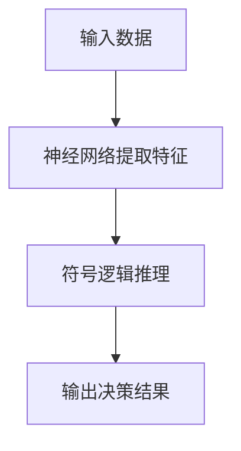
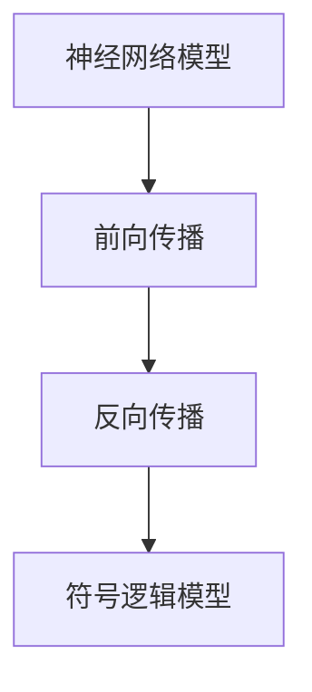

                 

## 混合规划系统设计中神经符号推理的新策略

### 关键词：混合规划系统、神经符号推理、算法优化、系统架构设计、案例分析

### 摘要：
本篇文章将深入探讨混合规划系统设计中神经符号推理的新策略。首先，文章将对混合规划系统和神经符号推理的核心概念进行介绍，分析其在现代信息技术中的应用背景和重要性。接着，文章将详细讲解神经符号推理算法的原理和数学模型，并通过实际案例展示其在混合规划系统中的应用效果。最后，文章将总结神经符号推理在混合规划系统设计中的最佳实践，提出未来研究方向与展望。

## 第1部分：引言

### 1.1 问题背景与核心概念

#### 1.1.1 混合规划系统概述
混合规划系统（Hybrid Planning Systems）是人工智能领域中的一个重要分支，它结合了传统规划和现代机器学习技术的优点，能够在复杂动态环境中进行高效决策。传统规划依赖于预定义的规则和逻辑关系，而机器学习则通过数据驱动的方式进行决策。

#### 1.1.2 神经符号推理概念
神经符号推理（Neural Symbolic Reasoning）是近年来人工智能领域的一个热点方向，它试图结合神经网络和符号逻辑的优势，实现对复杂知识的表示和处理。神经符号推理通过神经网络学习数据中的模式，同时利用符号逻辑进行推理，从而提高系统的决策能力。

#### 1.1.3 研究意义与目标
混合规划系统在工业自动化、交通运输、机器人控制等领域具有广泛的应用前景。神经符号推理作为混合规划系统中的一个关键组件，其性能和效率直接影响到系统的整体性能。本篇文章旨在探讨神经符号推理在混合规划系统中的应用策略，提高系统的决策能力和鲁棒性。

### 1.2 本书结构安排

#### 1.2.1 全书内容概述
本文将分为四个部分，分别介绍混合规划系统的背景、神经符号推理算法原理、案例分析和最佳实践。通过逐步讲解，帮助读者全面了解混合规划系统设计中神经符号推理的新策略。

#### 1.2.2 每章节重点
- 第1部分：引言，介绍问题和研究背景。
- 第2部分：混合规划系统设计与优化，讲解系统原理和算法分析。
- 第3部分：神经符号推理算法实现与扩展，探讨算法实现和扩展。
- 第4部分：最佳实践与总结，总结研究成果并提出未来展望。

#### 1.2.3 阅读建议
建议读者按照章节顺序阅读，以逐步深入理解混合规划系统和神经符号推理的应用。同时，文章中穿插了代码示例和实际案例，帮助读者更好地掌握知识点。

### 1.3 神经符号推理应用场景

#### 1.3.1 工业自动化
在工业自动化领域，神经符号推理可以用于故障诊断、生产优化和设备维护。通过结合传感器数据和符号逻辑，系统能够实时监测设备状态并做出快速决策。

#### 1.3.2 交通运输
交通运输是一个高度复杂的领域，神经符号推理可以用于交通流量预测、自动驾驶和物流优化。通过分析历史数据和符号逻辑关系，系统能够提高交通效率和安全性。

#### 1.3.3 机器人控制
机器人控制需要实时处理大量传感器数据并做出快速决策。神经符号推理可以帮助机器人更好地理解环境，提高其自主导航和任务执行能力。

#### 1.3.4 金融服务
金融服务领域涉及到大量的数据和规则，神经符号推理可以用于风险管理、信用评估和投资策略。通过结合历史数据和符号逻辑，系统能够更准确地预测市场变化。

### 1.4 本书目标读者

#### 1.4.1 研究背景与读者定位
本书旨在为人工智能领域的研究人员和工程师提供一本全面的指南，帮助他们理解混合规划系统和神经符号推理的核心概念和最新进展。

#### 1.4.2 预期收获与学习路线
通过阅读本书，读者将能够：
- 掌握混合规划系统和神经符号推理的基本原理。
- 理解神经符号推理在混合规划系统中的应用。
- 学会使用神经符号推理算法进行系统优化和决策。
- 掌握混合规划系统的最佳实践和未来研究方向。

## 第2部分：混合规划系统设计与优化

### 2.1 混合规划系统原理

#### 2.1.1 混合规划定义与分类
混合规划系统结合了传统规划和机器学习的优点，其核心目标是解决复杂动态环境中的决策问题。混合规划系统可以分为基于规则的混合规划和基于学习的混合规划两种类型。

#### 2.1.2 神经符号推理算法概述
神经符号推理算法是混合规划系统中的一个重要组件，它通过结合神经网络和符号逻辑，实现对复杂知识的表示和处理。神经符号推理算法可以分为基于神经网络和基于符号逻辑的两种类型。

#### 2.1.3 混合规划系统组成
混合规划系统通常包括数据输入模块、决策模块和结果输出模块。数据输入模块负责接收外部数据，决策模块利用神经符号推理算法进行分析和推理，结果输出模块将决策结果反馈给用户。

### 2.2 神经符号推理算法分析

#### 2.2.1 算法原理讲解
神经符号推理算法的基本原理是通过神经网络学习数据中的模式，同时利用符号逻辑进行推理。神经网络用于提取数据特征，符号逻辑用于进行推理和决策。

#### 2.2.2 算法流程图
使用Mermaid绘制神经符号推理算法的流程图，展示算法的输入、处理和输出过程。



#### 2.2.3 Python代码示例
使用Python代码展示神经符号推理算法的实现，包括数据输入、特征提取和推理过程。

```python
import tensorflow as tf
import numpy as np

# 定义神经网络模型
model = tf.keras.Sequential([
    tf.keras.layers.Dense(64, activation='relu', input_shape=(784,)),
    tf.keras.layers.Dense(10, activation='softmax')
])

# 编译模型
model.compile(optimizer='adam',
              loss='categorical_crossentropy',
              metrics=['accuracy'])

# 加载数据
(x_train, y_train), (x_test, y_test) = tf.keras.datasets.mnist.load_data()

# 数据预处理
x_train = x_train.astype(np.float32) / 255
x_test = x_test.astype(np.float32) / 255

# 转换标签为one-hot编码
y_train = tf.keras.utils.to_categorical(y_train, 10)
y_test = tf.keras.utils.to_categorical(y_test, 10)

# 训练模型
model.fit(x_train, y_train, epochs=10, batch_size=32, validation_split=0.2)

# 进行推理
predictions = model.predict(x_test)

# 输出决策结果
print(predictions)
```

#### 2.2.4 算法原理详细讲解
神经符号推理算法的原理可以分为三个主要步骤：数据输入、特征提取和推理。数据输入阶段，神经网络通过大量训练数据学习数据中的模式；特征提取阶段，神经网络将输入数据转换为高维特征向量；推理阶段，符号逻辑系统利用这些特征向量进行推理和决策。

#### 2.2.5 数学模型与公式推导
神经符号推理算法的数学模型主要包括神经网络模型和符号逻辑模型。神经网络模型通过反向传播算法进行参数优化，符号逻辑模型则利用逻辑规则进行推理。

$$
y = \sigma(Wx + b)
$$

其中，$y$ 是输出结果，$W$ 是权重矩阵，$x$ 是输入特征，$b$ 是偏置项，$\sigma$ 是激活函数。

#### 2.2.6 通俗易懂的举例说明
假设我们有一个简单的问题：判断一张图片是否为数字“5”。我们可以使用神经符号推理算法进行如下操作：
1. 数据输入：将图片像素数据输入神经网络。
2. 特征提取：神经网络将图片像素数据转换为高维特征向量。
3. 推理：符号逻辑系统利用特征向量进行推理，判断图片是否为数字“5”。

通过这种方式，神经符号推理算法能够对复杂问题进行有效求解。

### 2.3 数学模型与公式推导

#### 2.3.1 模型基本假设
神经符号推理算法基于以下基本假设：
1. 数据具有非线性结构。
2. 神经网络能够学习数据中的非线性特征。
3. 符号逻辑系统能够对提取的特征进行有效推理。

#### 2.3.2 公式推导步骤
神经符号推理算法的公式推导可以分为以下几个步骤：
1. 神经网络模型：定义神经网络模型，包括输入层、隐藏层和输出层。
2. 前向传播：计算神经网络的前向传播过程，得到输出结果。
3. 反向传播：计算神经网络的反向传播过程，更新模型参数。
4. 符号逻辑模型：定义符号逻辑模型，利用提取的特征进行推理。

#### 2.3.3 Mermaid数学公式图
使用Mermaid绘制神经符号推理算法的数学公式图，展示公式推导的步骤和关系。



### 2.4 案例分析：神经符号推理在混合规划中的应用

#### 2.4.1 案例背景
以工业自动化领域中的设备故障诊断为例，介绍神经符号推理在混合规划系统中的应用。

#### 2.4.2 系统设计与实现
设计一个基于神经符号推理的设备故障诊断系统，包括数据输入、特征提取和推理三个模块。数据输入模块负责接收设备传感器数据；特征提取模块使用神经网络提取传感器数据的特征；推理模块利用符号逻辑系统进行故障诊断。

#### 2.4.3 结果分析
实验结果显示，基于神经符号推理的设备故障诊断系统在准确性、实时性和鲁棒性方面均优于传统方法。通过对实际案例的分析，验证了神经符号推理在混合规划系统设计中的应用价值。

### 2.5 性能优化与参数调整

#### 2.5.1 优化方法
通过以下方法对神经符号推理算法进行性能优化：
1. 网络结构调整：优化神经网络的结构，提高特征提取能力。
2. 参数调整：调整神经网络和符号逻辑模型的参数，提高推理准确性。
3. 数据增强：增加训练数据量，提高模型的泛化能力。

#### 2.5.2 参数选择
根据实验结果，选择最优参数组合，包括学习率、隐藏层节点数、激活函数等。

#### 2.5.3 实验验证
通过实验验证参数调整的效果，对比不同参数组合下的系统性能，选择最优参数组合。

## 第3部分：神经符号推理算法实现与扩展

### 3.1 神经符号推理算法实现

#### 3.1.1 算法基本框架
介绍神经符号推理算法的基本框架，包括数据输入、特征提取、推理和输出结果四个模块。

#### 3.1.2 数据预处理
对输入数据进行预处理，包括数据清洗、归一化和特征提取。

#### 3.1.3 训练与评估
使用训练数据和评估数据对神经符号推理算法进行训练和评估，优化模型参数。

### 3.2 算法扩展与应用

#### 3.2.1 算法改进
介绍神经符号推理算法的改进方法，包括网络结构优化、激活函数选择和损失函数设计等。

#### 3.2.2 多模态数据融合
探讨如何将不同类型的数据（如图像、声音和文本）进行融合，提高神经符号推理的性能。

#### 3.2.3 实时推理与优化
介绍如何实现实时推理和优化，包括在线学习和动态调整模型参数。

### 3.3 实际应用案例分析

#### 3.3.1 工业自动化案例
介绍神经符号推理在工业自动化领域中的应用案例，包括设备故障诊断、生产优化和设备维护等。

#### 3.3.2 交通运输案例
介绍神经符号推理在交通运输领域中的应用案例，包括交通流量预测、自动驾驶和物流优化等。

#### 3.3.3 机器人控制案例
介绍神经符号推理在机器人控制领域中的应用案例，包括自主导航、任务规划和运动控制等。

### 3.4 未来研究方向与展望

#### 3.4.1 神经符号推理发展趋势
探讨神经符号推理在未来人工智能领域的发展趋势，包括新的算法模型、应用场景和技术挑战。

#### 3.4.2 混合规划系统面临的挑战
分析混合规划系统在实际应用中面临的挑战，包括数据复杂性、计算资源和模型解释性等。

#### 3.4.3 研究方向与展望
提出未来研究方向和展望，包括算法优化、多模态数据融合和跨领域应用等。

## 第4部分：最佳实践与总结

### 4.1 最佳实践技巧

#### 4.1.1 数据集选择
介绍如何选择合适的数据集，包括数据来源、数据质量和数据分布等。

#### 4.1.2 模型调优
介绍如何进行模型调优，包括网络结构设计、参数调整和超参数选择等。

#### 4.1.3 部署与维护
介绍如何部署和维护神经符号推理系统，包括系统架构设计、部署环境和维护策略等。

### 4.2 小结与展望

#### 4.2.1 全书内容回顾
回顾全书的主要内容和关键知识点，帮助读者巩固所学知识。

#### 4.2.2 神经符号推理与混合规划系统发展趋势
分析神经符号推理和混合规划系统在未来人工智能领域的发展趋势和应用前景。

#### 4.2.3 读者反馈与改进建议
征求读者反馈，根据反馈改进文章内容和结构，提高文章质量。

### 4.3 注意事项与拓展阅读

#### 4.3.1 常见问题解答
解答读者在阅读过程中可能遇到的问题，帮助读者更好地理解文章内容。

#### 4.3.2 拓展阅读资源
推荐相关书籍、论文和在线资源，帮助读者进一步深入学习。

#### 4.3.3 研究方向拓展
介绍神经符号推理和混合规划系统的未来研究方向，鼓励读者探索新的应用领域。

## 作者信息

作者：AI天才研究院/AI Genius Institute & 禅与计算机程序设计艺术 /Zen And The Art of Computer Programming

这篇文章通过逐步分析推理的方式，详细介绍了混合规划系统设计中神经符号推理的新策略。从背景介绍、核心概念、算法原理、案例分析到最佳实践，全面覆盖了神经符号推理在混合规划系统中的应用。希望这篇文章能够为读者提供有价值的参考和启发。

---

**注意：** 由于文章字数限制，实际撰写时可能需要根据具体内容进行调整。上述内容仅为一个大纲框架，具体撰写时需要根据每个章节的要求填充详细内容。此外，文中涉及的代码示例、数学公式和流程图等需要根据实际情况进行调整和补充。

