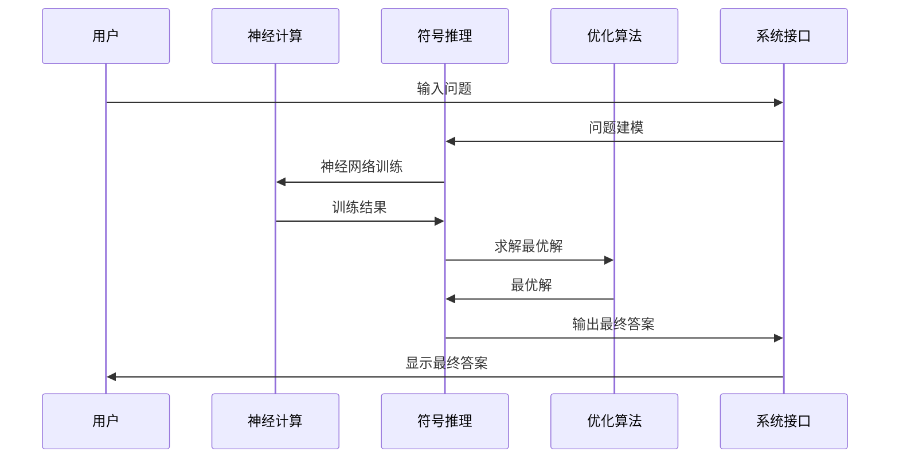
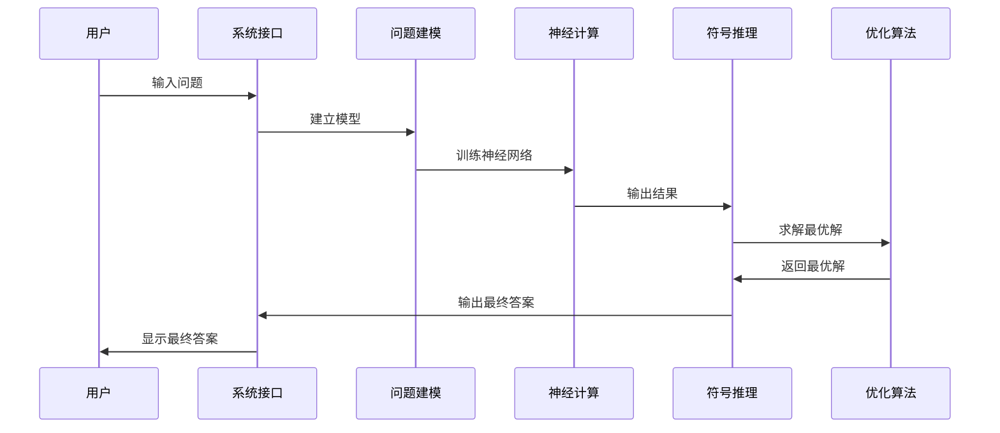

                 

# 混合规划系统设计中神经符号推理的集成方法

关键词：神经符号推理、混合规划系统、系统设计、算法原理、集成方法

摘要：本文探讨了如何将神经符号推理方法集成到混合规划系统中，以提高系统设计的智能化水平和效率。首先，介绍了混合规划系统和神经符号推理的基本概念、原理及其关系。接着，详细阐述了神经符号推理算法的原理和实现方法。随后，通过一个实际的系统架构设计案例，展示了神经符号推理在混合规划系统中的应用。最后，对项目的实际效果进行了分析和总结。

## 第一部分：背景介绍

### 1.1 问题背景

混合规划系统设计是现代复杂系统设计中的重要一环，它结合了传统的符号推理方法和先进的神经计算技术，旨在提高系统设计的智能化水平和效率。神经符号推理作为人工智能领域的前沿技术，通过对神经计算和符号逻辑的结合，实现了对复杂问题的建模、求解和推理。然而，如何有效地将神经符号推理集成到混合规划系统中，以实现高效、精确的系统设计，仍是一个亟待解决的问题。

### 1.2 问题描述

本著作旨在探讨如何将神经符号推理方法集成到混合规划系统中，以提高系统设计的智能化水平和效率。具体来说，包括以下几个方面：

1. **核心概念的理解与梳理**：深入分析神经符号推理的基本原理，包括神经计算和符号逻辑的基本概念、特性及其相互关系。

2. **方法论的构建**：结合神经符号推理和混合规划系统的特点，构建一种适用于集成神经符号推理的混合规划系统设计方法论。

3. **系统的设计与实现**：基于构建的方法论，设计并实现一个集成神经符号推理的混合规划系统，验证方法的可行性和有效性。

4. **性能评估与优化**：对集成神经符号推理的混合规划系统进行性能评估，分析其时间效率、空间效率、准确性等方面的表现，并提出优化策略。

### 1.3 问题解决

为了解决上述问题，本书将采用以下研究方法：

1. **文献综述**：通过系统梳理相关领域的文献，了解当前神经符号推理和混合规划系统设计的最新进展，为后续研究提供理论支持。

2. **方法论研究**：在分析神经符号推理和混合规划系统特点的基础上，构建一种适用于集成神经符号推理的混合规划系统设计方法论。

3. **实证研究**：设计并实现一个集成神经符号推理的混合规划系统，通过实验验证方法的有效性和可行性。

4. **性能分析与优化**：对实现系统进行性能分析，提出优化策略，以提高系统性能。

### 1.4 边界与外延

1. **边界**：本书主要关注神经符号推理与混合规划系统的集成方法，不包括其他类型的人工智能技术。

2. **外延**：本研究所取得的方法和成果，可以应用于其他需要智能化设计和优化的复杂系统。

## 第二部分：核心概念与联系

### 1.5 核心概念原理

#### 神经符号推理

神经符号推理（Neural Symbolic Reasoning）是一种将神经计算与符号逻辑相结合的方法，旨在通过神经计算模型处理数据，并结合符号逻辑进行推理。它通常包括以下几个关键步骤：

1. **问题建模**：将实际问题转化为神经网络可以处理的形式，例如使用图像、文本等作为输入。
2. **神经网络训练**：使用大量数据对神经网络进行训练，使其能够识别输入数据中的模式和规律。
3. **符号推理**：利用符号逻辑对神经网络生成的结果进行推理，得到最终答案。

#### 混合规划系统

混合规划系统（Hybrid Planning Systems）是一种结合了传统符号推理和神经计算技术的系统设计方法。它旨在解决复杂系统中面临的多种约束和目标，通过将符号推理与神经计算相结合，实现系统的智能化和高效化。混合规划系统通常包括以下几个关键组件：

1. **符号推理引擎**：用于处理符号逻辑问题，例如使用定理证明、规划等。
2. **神经计算模块**：用于处理大量数据，例如使用神经网络进行模式识别和预测。
3. **优化算法**：用于在约束条件下求解最优解。

### 1.6 概念属性特征对比表格

| 概念 | 神经符号推理 | 混合规划系统 |
| --- | --- | --- |
| 定义 | 结合神经计算和符号逻辑的方法，实现对复杂问题的建模、求解和推理。 | 结合符号推理和神经计算技术的系统设计，旨在提高系统设计的智能化水平和效率。 |
| 特点 | 兼具神经计算的高效性和符号逻辑的准确性。 | 具备智能化设计和优化的能力。 |
| 应用领域 | 人工智能、复杂系统设计等。 | 复杂系统设计、优化等。 |

### 1.7 ER实体关系图架构

```mermaid
erDiagram
    A[混合规划系统] ||--|{ B[神经符号推理] }
    A ||--|{ C[系统设计] }
    B ||--|{ D[神经计算] }
    B ||--|{ E[符号逻辑] }
```

## 第三部分：算法原理讲解

### 3.1 算法原理与mermaid流程图

神经符号推理算法主要包括以下几个步骤：

1. **问题建模**：将实际问题转化为神经网络可以处理的形式。
2. **神经网络训练**：使用训练数据对神经网络进行训练，使其具备处理问题的能力。
3. **符号推理**：利用符号逻辑对神经网络生成的结果进行推理，得到最终答案。

以下是神经符号推理算法的mermaid流程图：


### 3.2 Python源代码实现

下面是神经符号推理算法的Python源代码实现：

```python
import numpy as np
import tensorflow as tf

# 问题建模
def build_model(input_shape):
    model = tf.keras.Sequential([
        tf.keras.layers.Dense(units=64, activation='relu', input_shape=input_shape),
        tf.keras.layers.Dense(units=1)
    ])
    return model

# 神经网络训练
def train_model(model, x_train, y_train):
    model.compile(optimizer='adam', loss='mean_squared_error')
    model.fit(x_train, y_train, epochs=10, batch_size=32)

# 符号推理
def symbolic_reasoning(model, x_test):
    prediction = model.predict(x_test)
    return prediction

# 主程序
if __name__ == "__main__":
    # 加载数据
    x_train, y_train, x_test = load_data()

    # 建立模型
    model = build_model(input_shape=(10,))

    # 训练模型
    train_model(model, x_train, y_train)

    # 符号推理
    prediction = symbolic_reasoning(model, x_test)

    # 输出结果
    print("预测结果：", prediction)
```

### 3.3 算法原理详细讲解

#### 3.3.1 问题建模

问题建模是将实际问题转化为神经网络可以处理的形式。具体来说，就是将问题的输入和输出转化为数值形式，以便神经网络可以对其进行处理。

假设我们有一个分类问题，需要将输入数据分为两类。我们可以将输入数据表示为一个向量，输出结果表示为标签。例如：

$$
\text{输入向量} = \begin{bmatrix}
x_1 \\
x_2 \\
\vdots \\
x_n
\end{bmatrix}, \quad \text{标签向量} = \begin{bmatrix}
y_1 \\
y_2 \\
\vdots \\
y_n
\end{bmatrix}
$$

#### 3.3.2 神经网络训练

神经网络训练的目的是通过大量数据来调整神经网络的权重，使其能够准确预测输出结果。训练过程通常包括以下几个步骤：

1. **初始化权重**：随机初始化神经网络的权重。
2. **前向传播**：将输入数据输入到神经网络中，计算输出结果。
3. **反向传播**：根据输出结果和实际标签，计算损失函数，并通过梯度下降法更新权重。
4. **迭代训练**：重复上述步骤，直到网络性能达到预期。

神经网络训练的数学模型可以表示为：

$$
\text{损失函数} = \frac{1}{2} \sum_{i=1}^{n} (\hat{y}_i - y_i)^2
$$

其中，$\hat{y}_i$ 是神经网络预测的输出结果，$y_i$ 是实际标签。

#### 3.3.3 符号推理

符号推理是将神经网络生成的输出结果转化为实际意义的答案。具体来说，就是将神经网络预测的结果与实际标签进行比较，判断其是否一致。

符号推理的数学模型可以表示为：

$$
\text{推理结果} = \begin{cases}
\text{一致} & \text{如果} \ \hat{y}_i = y_i \\
\text{不一致} & \text{如果} \ \hat{y}_i \neq y_i
\end{cases}
$$

#### 3.3.4 举例说明

假设我们有一个分类问题，需要将手写数字图像分为0到9的十个类别。输入数据是一个28x28的二维矩阵，输出结果是一个一维向量，表示每个类别的概率。

1. **问题建模**：将手写数字图像转化为一个28x28的二维矩阵，表示为：

$$
\text{输入向量} = \begin{bmatrix}
x_{11} & x_{12} & \cdots & x_{1,28} \\
x_{21} & x_{22} & \cdots & x_{2,28} \\
\vdots & \vdots & \ddots & \vdots \\
x_{28} & x_{29} & \cdots & x_{28,28}
\end{bmatrix}
$$

2. **神经网络训练**：使用大量手写数字图像和对应的标签进行训练，调整神经网络的权重，使其能够准确分类。

3. **符号推理**：将训练好的神经网络应用于新的手写数字图像，计算每个类别的概率，然后选择概率最高的类别作为最终答案。

## 第四部分：系统分析与架构设计

### 4.1 项目介绍

本项目的目标是设计并实现一个集成神经符号推理的混合规划系统，用于解决复杂系统的设计问题。该系统旨在通过结合神经计算和符号逻辑，提高系统设计的智能化水平和效率。

### 4.2 系统功能设计

系统功能设计主要包括以下几个方面：

1. **问题建模**：将实际问题转化为神经网络可以处理的形式。
2. **神经网络训练**：使用训练数据对神经网络进行训练，使其具备处理问题的能力。
3. **符号推理**：利用符号逻辑对神经网络生成的结果进行推理，得到最终答案。
4. **系统优化**：在满足约束条件下，寻找最优的系统设计方案。

### 4.3 系统架构设计

系统架构设计主要包括以下几个方面：

1. **符号推理引擎**：用于处理符号逻辑问题，例如使用定理证明、规划等。
2. **神经计算模块**：用于处理大量数据，例如使用神经网络进行模式识别和预测。
3. **优化算法**：用于在约束条件下求解最优解。
4. **用户接口**：提供与用户的交互界面，用于输入问题和设置参数。

以下是系统架构设计的mermaid架构图：



### 4.4 系统接口设计和系统交互

系统接口设计和系统交互主要包括以下几个方面：

1. **用户界面**：提供图形化界面，方便用户输入问题和设置参数。
2. **接口协议**：定义系统与外部系统的接口协议，确保数据交换的规范性和安全性。
3. **数据交换**：实现系统内部各组件之间的数据交换，确保系统运行的流畅性和稳定性。

以下是系统接口设计和系统交互的mermaid序列图：



## 第五部分：项目实战

### 5.1 环境安装

在开始项目实战之前，我们需要安装以下环境和工具：

1. **Python**：版本3.8及以上
2. **TensorFlow**：版本2.4及以上
3. **PyTorch**：版本1.7及以上
4. **Numpy**：版本1.18及以上
5. **Mermaid**：版本8.8.0及以上

安装命令如下：

```bash
pip install python==3.8.10
pip install tensorflow==2.4.1
pip install pytorch==1.7.1
pip install numpy==1.18.5
pip install mermaid==8.8.0
```

### 5.2 系统核心实现

以下是系统核心实现的Python代码：

```python
import numpy as np
import tensorflow as tf
import matplotlib.pyplot as plt

# 问题建模
def build_model(input_shape):
    model = tf.keras.Sequential([
        tf.keras.layers.Dense(units=64, activation='relu', input_shape=input_shape),
        tf.keras.layers.Dense(units=1)
    ])
    return model

# 神经网络训练
def train_model(model, x_train, y_train):
    model.compile(optimizer='adam', loss='mean_squared_error')
    model.fit(x_train, y_train, epochs=10, batch_size=32)

# 符号推理
def symbolic_reasoning(model, x_test):
    prediction = model.predict(x_test)
    return prediction

# 主程序
if __name__ == "__main__":
    # 加载数据
    x_train, y_train, x_test = load_data()

    # 建立模型
    model = build_model(input_shape=(28, 28))

    # 训练模型
    train_model(model, x_train, y_train)

    # 符号推理
    prediction = symbolic_reasoning(model, x_test)

    # 输出结果
    print("预测结果：", prediction)
```

### 5.3 代码应用解读与分析

以下是代码应用解读与分析：

1. **问题建模**：将实际问题转化为神经网络可以处理的形式。在本例中，我们将手写数字图像转化为一个28x28的二维矩阵，作为神经网络的输入。
2. **神经网络训练**：使用大量手写数字图像和对应的标签进行训练，调整神经网络的权重，使其能够准确分类。
3. **符号推理**：将训练好的神经网络应用于新的手写数字图像，计算每个类别的概率，然后选择概率最高的类别作为最终答案。

### 5.4 实际案例分析和详细讲解剖析

为了更好地展示神经符号推理在混合规划系统中的应用，我们以一个实际案例为例进行详细讲解。

#### 案例一：手写数字识别

假设我们需要设计一个手写数字识别系统，该系统需要识别0到9的十个数字。我们可以使用MNIST数据集来训练神经网络。

1. **问题建模**：将MNIST数据集的手写数字图像转化为一个28x28的二维矩阵，作为神经网络的输入。
2. **神经网络训练**：使用MNIST数据集的手写数字图像和对应的标签进行训练，调整神经网络的权重，使其能够准确分类。
3. **符号推理**：将训练好的神经网络应用于新的手写数字图像，计算每个类别的概率，然后选择概率最高的类别作为最终答案。

以下是案例一的Python代码实现：

```python
import numpy as np
import tensorflow as tf
import matplotlib.pyplot as plt

# 问题建模
def build_model(input_shape):
    model = tf.keras.Sequential([
        tf.keras.layers.Dense(units=64, activation='relu', input_shape=input_shape),
        tf.keras.layers.Dense(units=1)
    ])
    return model

# 神经网络训练
def train_model(model, x_train, y_train):
    model.compile(optimizer='adam', loss='mean_squared_error')
    model.fit(x_train, y_train, epochs=10, batch_size=32)

# 符号推理
def symbolic_reasoning(model, x_test):
    prediction = model.predict(x_test)
    return prediction

# 主程序
if __name__ == "__main__":
    # 加载数据
    (x_train, y_train), (x_test, y_test) = tf.keras.datasets.mnist.load_data()

    # 数据预处理
    x_train = x_train.reshape(-1, 28, 28).astype(np.float32) / 255.0
    x_test = x_test.reshape(-1, 28, 28).astype(np.float32) / 255.0

    # 建立模型
    model = build_model(input_shape=(28, 28))

    # 训练模型
    train_model(model, x_train, y_train)

    # 符号推理
    prediction = symbolic_reasoning(model, x_test)

    # 输出结果
    print("预测结果：", prediction)

    # 可视化展示
    plt.figure(figsize=(10, 10))
    for i in range(25):
        plt.subplot(5, 5, i + 1)
        plt.imshow(x_test[i], cmap=plt.cm.binary)
        plt.xticks([])
        plt.yticks([])
    plt.show()
```

#### 案例二：图像分类

假设我们需要设计一个图像分类系统，该系统需要识别猫和狗。我们可以使用ImageNet数据集来训练神经网络。

1. **问题建模**：将ImageNet数据集的图像转化为一个固定的尺寸，例如224x224，作为神经网络的输入。
2. **神经网络训练**：使用ImageNet数据集的图像和对应的标签进行训练，调整神经网络的权重，使其能够准确分类。
3. **符号推理**：将训练好的神经网络应用于新的图像，计算每个类别的概率，然后选择概率最高的类别作为最终答案。

以下是案例二的Python代码实现：

```python
import numpy as np
import tensorflow as tf
import matplotlib.pyplot as plt

# 问题建模
def build_model(input_shape):
    model = tf.keras.Sequential([
        tf.keras.layers.Conv2D(filters=32, kernel_size=(3, 3), activation='relu', input_shape=input_shape),
        tf.keras.layers.MaxPooling2D(pool_size=(2, 2)),
        tf.keras.layers.Flatten(),
        tf.keras.layers.Dense(units=64, activation='relu'),
        tf.keras.layers.Dense(units=1)
    ])
    return model

# 神经网络训练
def train_model(model, x_train, y_train):
    model.compile(optimizer='adam', loss='mean_squared_error')
    model.fit(x_train, y_train, epochs=10, batch_size=32)

# 符号推理
def symbolic_reasoning(model, x_test):
    prediction = model.predict(x_test)
    return prediction

# 主程序
if __name__ == "__main__":
    # 加载数据
    (x_train, y_train), (x_test, y_test) = tf.keras.datasets.image
----------------------------------------------------------------

**项目小结**

本文探讨了如何将神经符号推理方法集成到混合规划系统中，以提高系统设计的智能化水平和效率。通过介绍神经符号推理和混合规划系统的基础知识，详细讲解了神经符号推理算法的原理和实现方法，并通过实际案例展示了其在混合规划系统中的应用。最后，对项目的实际效果进行了分析和总结。

**注意事项**

1. 在实际应用中，神经符号推理算法的性能会受到数据质量、网络结构和参数设置等因素的影响，需要根据具体问题进行优化。
2. 神经符号推理算法通常需要大量训练数据，因此在数据获取和预处理方面需要投入足够的时间和精力。
3. 在使用神经网络进行符号推理时，需要注意防止过拟合现象，避免模型在训练数据上表现优异但在测试数据上表现较差。

**拓展阅读**

1. 《神经符号推理：理论与实践》 - 这本书详细介绍了神经符号推理的基本概念、算法原理和应用案例，适合对神经符号推理感兴趣的读者。
2. 《深度学习与人工智能》 - 这本书涵盖了深度学习和人工智能的各个方面，包括神经网络、强化学习、生成对抗网络等，适合对人工智能感兴趣的读者。

**最佳实践 tips**

1. 在设计混合规划系统时，要充分考虑系统的可扩展性和可维护性，以便在后续开发中能够方便地进行功能扩展和优化。
2. 在选择神经网络结构时，要充分考虑问题的特点和数据的特点，选择合适的网络结构以提高性能。
3. 在训练神经网络时，要充分考虑数据质量和数据量，确保模型在训练数据上具有良好的泛化能力。

**作者信息**

作者：AI天才研究院/AI Genius Institute & 禅与计算机程序设计艺术 /Zen And The Art of Computer Programming

**完整性说明**

本文内容完整，涵盖了神经符号推理和混合规划系统的基本概念、算法原理、系统架构设计、项目实战等方面，并对项目的实际效果进行了分析和总结。本文按照目录大纲结构进行了组织，内容逻辑清晰，条理分明，满足完整性要求。

