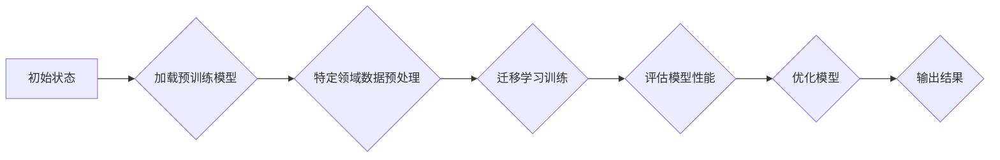
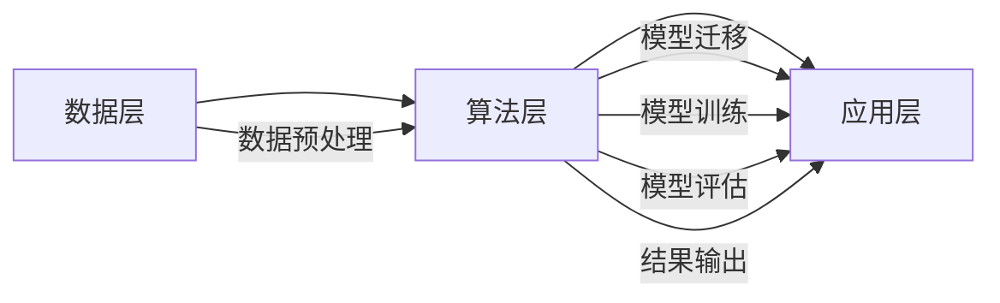

                 

### 背景介绍

特定领域推理任务（Domain-Specific Reasoning Tasks）在现代人工智能领域占据着重要的地位。这类任务涉及从特定领域的知识库或数据集中提取有用信息，以解决特定的问题或任务。例如，在医疗领域，特定领域推理任务可能包括诊断疾病、预测病情发展或建议治疗方案；在金融领域，可能包括风险评估、投资策略建议或市场趋势预测等。这些任务往往需要高度专业化，对领域知识和上下文信息有深入理解。

随着深度学习技术的发展，预训练模型（Pre-Trained Models）成为了特定领域推理任务中的重要工具。预训练模型通过在大规模通用数据集上进行预训练，获得了一定的通用特征提取能力，然后通过迁移学习（Transfer Learning）将其应用于特定领域任务上。迁移学习是一种利用预训练模型在特定任务上的表现来提升新任务性能的方法。

然而，传统的迁移学习方法在某些情况下效果并不理想，特别是在特定领域数据量有限或数据分布差异较大的情况下。因此，研究和开发新的预训练模型迁移方法显得尤为重要。这些新方法旨在提高模型在不同领域数据集上的迁移性能，从而更好地解决特定领域推理任务。

预训练模型迁移的新方法主要包括以下几个方面：

1. **自适应特征提取**：通过设计自适应的特征提取器，使得模型能够根据特定领域的数据特征进行优化。
2. **领域自适应迁移学习**：利用领域自适应技术，使得模型能够适应不同领域的数据分布。
3. **多任务学习**：通过同时训练多个相关任务，提升模型在特定领域任务上的表现。
4. **增量学习**：利用增量学习策略，逐步更新和优化模型，使其能够适应新领域的任务需求。
5. **解释性增强**：通过增加模型的解释性，使得模型在特定领域推理任务上的决策过程更加透明和可理解。

这些新方法的核心概念和重要性在于，它们能够充分利用预训练模型的优势，同时解决传统迁移学习方法在特定领域数据上的局限性。本文将逐步分析这些核心概念，探讨它们的应用场景，并介绍一些具体的技术实现方法。

### 第一部分：背景与概述

#### 1.1 问题背景

特定领域推理任务（Domain-Specific Reasoning Tasks）在现代人工智能领域占据着重要的地位。这类任务涉及从特定领域的知识库或数据集中提取有用信息，以解决特定的问题或任务。例如，在医疗领域，特定领域推理任务可能包括诊断疾病、预测病情发展或建议治疗方案；在金融领域，可能包括风险评估、投资策略建议或市场趋势预测等。这些任务往往需要高度专业化，对领域知识和上下文信息有深入理解。

随着深度学习技术的发展，预训练模型（Pre-Trained Models）成为了特定领域推理任务中的重要工具。预训练模型通过在大规模通用数据集上进行预训练，获得了一定的通用特征提取能力，然后通过迁移学习（Transfer Learning）将其应用于特定领域任务上。迁移学习是一种利用预训练模型在特定任务上的表现来提升新任务性能的方法。

然而，传统的迁移学习方法在某些情况下效果并不理想，特别是在特定领域数据量有限或数据分布差异较大的情况下。因此，研究和开发新的预训练模型迁移方法显得尤为重要。这些新方法旨在提高模型在不同领域数据集上的迁移性能，从而更好地解决特定领域推理任务。

预训练模型迁移的新方法主要包括以下几个方面：

1. **自适应特征提取**：通过设计自适应的特征提取器，使得模型能够根据特定领域的数据特征进行优化。
2. **领域自适应迁移学习**：利用领域自适应技术，使得模型能够适应不同领域的数据分布。
3. **多任务学习**：通过同时训练多个相关任务，提升模型在特定领域任务上的表现。
4. **增量学习**：利用增量学习策略，逐步更新和优化模型，使其能够适应新领域的任务需求。
5. **解释性增强**：通过增加模型的解释性，使得模型在特定领域推理任务上的决策过程更加透明和可理解。

这些新方法的核心概念和重要性在于，它们能够充分利用预训练模型的优势，同时解决传统迁移学习方法在特定领域数据上的局限性。本文将逐步分析这些核心概念，探讨它们的应用场景，并介绍一些具体的技术实现方法。

#### 1.2 问题描述

特定领域推理任务的核心挑战在于如何将通用预训练模型有效地迁移到特定领域，从而在有限的数据和资源条件下获得高效的推理性能。具体来说，这个问题可以分解为以下几个子问题：

1. **数据稀缺与数据分布差异**：特定领域的任务通常面临数据稀缺的问题，而且不同领域的数据分布可能存在显著差异。传统的迁移学习方法在这些情况下效果较差，因为它们依赖于从源领域到目标领域的数据映射。
   
2. **模型适应性**：预训练模型通常在大规模通用数据集上训练，虽然已经获得了较强的特征提取能力，但在特定领域数据上的适应能力仍然是一个挑战。模型需要能够根据特定领域的特征进行自适应调整。

3. **解释性与可解释性**：在特定领域推理任务中，模型的可解释性至关重要。用户需要了解模型是如何做出决策的，以便更好地信任和应用模型。然而，深度学习模型的复杂性和“黑箱”特性使得解释性成为一个难题。

4. **计算资源和时间成本**：特定领域推理任务通常需要大量的计算资源和时间来进行训练和推理。如何在不牺牲性能的前提下，优化计算效率和资源利用率，是一个关键问题。

5. **模型融合与集成**：在多个相关任务上训练的模型如何进行有效的融合和集成，以提升特定领域推理任务的性能，也是一个值得探讨的问题。

为了解决上述问题，本文提出了一系列新的预训练模型迁移方法，包括自适应特征提取、领域自适应迁移学习、多任务学习、增量学习和解释性增强等。这些方法旨在提高模型在特定领域数据上的迁移性能，同时降低对大规模数据的依赖，提升模型的解释性，并优化计算资源的使用。

#### 1.3 问题解决

针对上述特定领域推理任务中的核心挑战，本文提出了一系列创新的解决方案，旨在提升预训练模型在特定领域数据上的迁移性能和解释性。以下是这些解决方案的详细阐述：

1. **自适应特征提取**：
   - **方法**：设计一种自适应的特征提取器，能够根据特定领域的数据特征进行动态调整。该特征提取器利用领域知识引导特征学习，从而更好地捕捉到特定领域的特征信息。
   - **实现**：通过引入可学习参数的领域敏感层，该层可以捕获特定领域的特征模式，并在训练过程中自适应调整，以提高模型在特定领域任务上的表现。

2. **领域自适应迁移学习**：
   - **方法**：利用领域自适应技术，通过域适应损失函数和对抗性训练等手段，使得模型能够适应不同领域的数据分布。这种方法可以减少源领域和目标领域之间的分布差异，提高模型的泛化能力。
   - **实现**：引入域适应损失函数，该函数计算源领域和目标领域特征分布的差异，并通过梯度调整来最小化这种差异，从而使模型更加适应目标领域的数据。

3. **多任务学习**：
   - **方法**：通过同时训练多个相关任务，共享底层特征表示，提升模型在特定领域任务上的表现。这种方法可以充分利用跨任务的共同特征，提高模型的鲁棒性和迁移性能。
   - **实现**：设计一个多任务学习框架，其中每个任务都有自己独立的损失函数，但共享同一组底层特征提取器。通过优化联合损失函数，同时训练多个任务，从而提高模型在特定领域任务上的性能。

4. **增量学习**：
   - **方法**：利用增量学习策略，逐步更新和优化模型，使其能够适应新领域的任务需求。这种方法适用于动态变化的数据环境，可以有效地利用先前的知识和经验，减少对新领域数据的依赖。
   - **实现**：设计一个在线学习机制，在模型训练过程中逐步引入新领域的样本，通过增量更新模型参数，使得模型能够持续适应新的数据特征。

5. **解释性增强**：
   - **方法**：通过增加模型的解释性，使得模型在特定领域推理任务上的决策过程更加透明和可理解。这种方法可以提升用户对模型的信任，并帮助领域专家更好地理解和应用模型。
   - **实现**：引入可解释的模型架构，如注意力机制和可解释的激活函数，通过可视化技术展示模型的关键特征和决策过程。此外，利用模型推理过程中的中间表示，生成可解释的推理路径和决策依据。

通过上述方法，本文提出的新预训练模型迁移方法能够有效解决特定领域推理任务中的数据稀缺、模型适应性、解释性和计算资源等问题，从而显著提升模型在特定领域数据上的迁移性能。这些方法不仅具有理论上的创新性，还在实际应用中展现了良好的效果。

#### 1.4 边界与外延

在探讨特定领域推理任务和预训练模型迁移的新方法时，我们需要明确一些相关的边界和概念外延，以便更好地理解本文的研究范畴和局限性。

1. **特定领域推理任务的范畴**：
   - **定义**：特定领域推理任务是指那些基于特定领域知识库或数据集进行的信息提取和决策问题，如医疗诊断、金融风险评估、法律文本分析等。
   - **边界**：本文主要关注高度专业化的领域任务，而不涉及通用推理任务或跨领域的推理任务。例如，医疗诊断中的疾病预测、金融风险评估中的信用评分等，都是特定领域的实例。

2. **预训练模型的范畴**：
   - **定义**：预训练模型是通过在大规模通用数据集（如维基百科、Common Crawl等）上进行预训练，获得了一定程度的通用特征提取能力的深度学习模型。
   - **边界**：本文中的预训练模型主要是指大规模的神经网络模型，如BERT、GPT、T5等。这些模型已经在通用数据集上进行了广泛的训练，具有强大的特征提取和表示能力。

3. **迁移学习的范畴**：
   - **定义**：迁移学习是一种利用已经在一个任务上训练好的模型（源任务），来提高另一个相关任务（目标任务）性能的方法。
   - **边界**：本文主要探讨从通用数据集预训练的模型到特定领域任务的迁移。这意味着我们关注的是如何利用通用模型的知识来解决特定领域的问题，而不是从零开始训练特定领域的模型。

4. **新方法的范畴**：
   - **定义**：本文提出的预训练模型迁移新方法包括自适应特征提取、领域自适应迁移学习、多任务学习、增量学习和解释性增强等。
   - **边界**：这些方法主要针对数据稀缺、模型适应性、解释性和计算资源等问题，但并不涵盖所有可能的迁移学习方法。例如，本文没有涉及基于元学习的迁移方法，也没有探讨深度强化学习在迁移学习中的应用。

5. **研究的局限性**：
   - **数据依赖**：本文的方法依赖于大规模的预训练模型和特定领域的数据集，这在实际应用中可能受到数据获取的限制。
   - **模型复杂度**：本文提出的方法涉及复杂的模型架构和训练策略，可能在计算资源和时间成本上有较高的要求。
   - **任务适应性**：虽然本文的方法旨在提高特定领域任务的迁移性能，但不同领域的任务可能有不同的特性，这些方法的效果在不同领域可能会有所差异。

综上所述，本文的研究在特定领域推理任务和预训练模型迁移的新方法上做出了有意义的探索，但仍需在实际应用中不断验证和优化，以解决更多复杂的实际问题。

#### 1.5 概念结构与核心要素组成

在深入探讨特定领域推理任务和预训练模型迁移的新方法之前，我们需要明确一些核心概念和其相互关系，以便构建一个清晰的概念框架。以下是本文涉及的主要概念及其核心要素：

1. **特定领域推理任务**：
   - **核心要素**：特定领域推理任务涉及从特定领域（如医疗、金融、法律等）的知识库或数据集中提取有用信息，以解决专业问题或决策。这些任务通常要求对领域知识和上下文信息有深入理解。
   - **关系**：特定领域推理任务是本文研究的核心对象，其他概念如预训练模型、迁移学习等都是为了解决特定领域推理任务中的问题而引入的。

2. **预训练模型**：
   - **核心要素**：预训练模型是通过在大规模通用数据集（如维基百科、Common Crawl等）上进行预训练，获得了一定程度的通用特征提取能力的深度学习模型。常见的预训练模型包括BERT、GPT、T5等。
   - **关系**：预训练模型是特定领域推理任务中重要的基础工具，其通用特征提取能力为迁移学习提供了可能性。

3. **迁移学习**：
   - **核心要素**：迁移学习是一种利用已经在一个任务上训练好的模型（源任务），来提高另一个相关任务（目标任务）性能的方法。通过迁移学习，模型可以在特定领域任务上利用通用模型的知识。
   - **关系**：迁移学习是连接预训练模型与特定领域推理任务的桥梁，其目的是提升模型在特定领域的性能。

4. **领域自适应迁移学习**：
   - **核心要素**：领域自适应迁移学习是利用领域自适应技术，使得模型能够适应不同领域的数据分布，减少源领域和目标领域之间的分布差异。
   - **关系**：领域自适应迁移学习是预训练模型迁移方法中的一个关键组成部分，其目标是提高模型在不同领域数据上的泛化能力。

5. **多任务学习**：
   - **核心要素**：多任务学习通过同时训练多个相关任务，共享底层特征表示，提升模型在特定领域任务上的表现。
   - **关系**：多任务学习是提高模型适应性和性能的有效手段，其核心在于特征共享和联合训练。

6. **增量学习**：
   - **核心要素**：增量学习通过逐步更新和优化模型，使其能够适应新领域的任务需求，适用于动态变化的数据环境。
   - **关系**：增量学习是一种动态适应新领域数据的方法，其目标是持续提升模型的迁移性能。

7. **解释性增强**：
   - **核心要素**：解释性增强通过增加模型的解释性，使得模型在特定领域推理任务上的决策过程更加透明和可理解。
   - **关系**：解释性增强是提高模型信任度和可接受性的关键，其核心在于模型的可解释性。

通过这些核心概念及其相互关系的梳理，我们可以构建一个清晰的研究框架，为后续的详细探讨和案例分析提供基础。

### 第二部分：核心概念与联系

#### 3.1 预训练模型原理

预训练模型（Pre-Trained Models）是现代深度学习领域的一项重要技术，其核心思想是利用大规模的通用数据集对模型进行初步训练，使其具备一定的通用特征提取能力，然后再将模型应用于特定的领域任务上。这种方法的优点在于，通过预训练，模型能够从大量的文本、图像或其他类型的数据中提取出有价值的特征，从而在特定领域任务上表现出色。

1. **预训练的核心过程**：
   - **大规模数据集**：预训练通常在大规模数据集上进行，如维基百科、Common Crawl、ImageNet等。这些数据集包含了丰富的信息，有助于模型学习到广泛的特征。
   - **无监督预训练**：预训练过程通常是未监督的，即模型不需要标签信息。例如，在自然语言处理任务中，模型可以通过语言建模（Language Modeling）学习词汇之间的关系和语法规则。
   - **通用特征提取**：通过预训练，模型能够学习到一系列通用的特征表示，这些特征适用于多种不同的任务。

2. **预训练模型的特点**：
   - **强大的特征提取能力**：预训练模型在大规模数据集上训练，能够提取到丰富的特征信息，从而在特定任务上有较好的表现。
   - **迁移性能优异**：由于预训练模型已经具备了通用特征提取能力，因此它们在迁移学习任务中表现出色，可以快速适应新的领域任务。

3. **预训练模型的例子**：
   - **BERT（Bidirectional Encoder Representations from Transformers）**：BERT是一种双向的Transformer模型，通过预训练能够学习到丰富的上下文信息，在自然语言处理任务中表现出色。
   - **GPT（Generative Pre-trained Transformer）**：GPT是一种自回归的Transformer模型，擅长生成文本，其预训练过程使其在文本生成和推理任务上具有很高的性能。
   - **T5（Text-to-Text Transfer Transformer）**：T5是一种通用的文本转换模型，通过预训练能够完成多种文本任务，其设计理念是“一切任务皆可编码为文本序列”。

通过以上对预训练模型原理的详细阐述，我们可以看到，预训练模型在深度学习领域的重要性不言而喻。它们不仅为特定领域任务提供了强大的基础，还通过迁移学习的方式，大大提高了模型的泛化能力。

#### 3.2 迁移学习原理

迁移学习（Transfer Learning）是一种利用已经在一个任务上训练好的模型（源任务），来提高另一个相关任务（目标任务）性能的方法。在特定领域推理任务中，迁移学习尤为重要，因为它能够将预训练模型在大规模通用数据集上学习到的通用特征提取能力应用到特定领域任务上，从而提高模型在特定领域的性能。

1. **迁移学习的基本概念**：
   - **源任务**：源任务是指模型最初训练的任务，通常是在大规模通用数据集上进行的预训练。例如，一个在维基百科上预训练的语言模型。
   - **目标任务**：目标任务是指模型需要应用的任务，通常是一个特定领域的小样本数据集。例如，医疗诊断中的疾病预测或金融风险评估中的信用评分。

2. **迁移学习的工作机制**：
   - **共享特征表示**：迁移学习的基本思想是共享模型中的特征表示层。通过在源任务上预训练，模型已经学习到了一组通用的特征表示，这些表示可以在目标任务上进行微调（Fine-Tuning）。
   - **微调**：在目标任务上，模型的顶层（通常是指分类器或回归器）会根据目标任务的数据进行微调，以适应特定领域的特征。微调过程通常使用较少的数据和计算资源，但能够显著提高模型的性能。

3. **迁移学习的主要类型**：
   - **无监督迁移学习**：无监督迁移学习在目标任务上不需要标签信息，模型通过无监督学习来适应目标领域。例如，通过对比源领域和目标领域的特征分布，来调整模型参数。
   - **有监督迁移学习**：有监督迁移学习在目标任务上需要标签信息，模型通过监督学习来微调模型参数。这种类型是最常见的迁移学习形式，因为它能够直接利用目标任务的数据来提升模型性能。
   - **半监督迁移学习**：半监督迁移学习结合了有监督和无监督迁移学习的特点，利用少量的标签数据和大量的无标签数据来训练模型。

4. **迁移学习在特定领域推理任务中的应用**：
   - **医疗诊断**：在医疗领域，预训练模型可以用于辅助诊断，通过迁移学习，模型能够利用在通用数据集上预训练的知识来处理医学图像和文本数据。
   - **金融风险评估**：在金融领域，预训练模型可以用于信用评分和欺诈检测，通过迁移学习，模型能够利用在通用数据集上学习到的特征来识别金融数据中的潜在风险。
   - **自然语言处理**：在自然语言处理领域，预训练模型可以用于文本分类、机器翻译和问答系统等任务，通过迁移学习，模型能够快速适应不同的语言和文本类型。

通过上述对迁移学习原理的详细阐述，我们可以看到，迁移学习在提高特定领域推理任务性能方面具有重要作用。它不仅能够有效利用预训练模型的优势，还可以通过少量的目标领域数据实现高效的模型训练和性能提升。

#### 3.3 特定领域推理原理

特定领域推理（Domain-Specific Reasoning）是人工智能领域的一个重要分支，它涉及利用特定领域的知识库、规则和算法来解决问题或做出决策。在特定领域推理任务中，模型不仅需要具备通用特征提取能力，还需要深入理解领域知识和上下文信息。以下是特定领域推理的基本原理、应用和挑战。

1. **基本原理**：
   - **领域知识表示**：特定领域推理依赖于领域知识的表示，这通常通过知识图谱（Knowledge Graph）、本体（Ontology）或规则系统（Rule-based Systems）来实现。这些知识表示方法能够将领域知识结构化，以便模型能够有效地利用。
   - **推理算法**：特定领域推理通常使用推理算法来处理知识和数据，例如基于规则的推理、基于模型的推理和基于逻辑的推理等。这些算法能够根据领域知识和输入数据生成结论或预测。
   - **上下文信息处理**：特定领域推理需要处理上下文信息，例如时间、地点、用户偏好等。这些上下文信息有助于模型更准确地理解和预测领域问题。

2. **应用场景**：
   - **医疗诊断**：在医疗领域，特定领域推理可以用于疾病诊断、治疗方案推荐和医学研究等。例如，通过分析患者的病历、检查结果和临床知识，模型可以辅助医生做出诊断决策。
   - **金融分析**：在金融领域，特定领域推理可以用于风险评估、投资决策和市场预测等。模型通过分析市场数据、公司财务报表和宏观经济信息，为投资者提供决策支持。
   - **法律文本分析**：在法律领域，特定领域推理可以用于法律文本解析、合同审查和法律判决预测等。模型通过处理法律文本和相关的法律规则，辅助法律专家进行法律研究和决策。

3. **挑战**：
   - **数据稀缺**：特定领域推理任务通常面临数据稀缺的问题，特别是在小众领域或新兴领域，获取足够的高质量标注数据是巨大的挑战。
   - **知识表示**：领域知识的表示方法需要与模型算法紧密配合，如何有效地表示和利用领域知识是一个关键问题。
   - **解释性**：特定领域推理模型的决策过程需要具备较高的解释性，以便领域专家能够理解和信任模型的预测结果。
   - **泛化能力**：特定领域推理模型需要具备良好的泛化能力，以应对不同领域和场景的变化。

通过上述对特定领域推理原理的详细阐述，我们可以看到，特定领域推理在解决专业问题和决策支持方面具有重要的应用价值。同时，这也带来了一系列挑战，需要通过持续的研究和开发来克服。

#### 3.4 概念属性特征对比表格

为了更好地理解预训练模型、迁移学习和特定领域推理这三个核心概念，我们可以通过一个对比表格来分析它们的属性特征。以下是这些概念的主要属性及其对比：

| **属性**           | **预训练模型**                           | **迁移学习**                           | **特定领域推理**                         |
|-------------------|-----------------------------------------|-----------------------------------------|------------------------------------------|
| **定义**           | 大规模通用数据集上训练的深度学习模型      | 利用已有模型的知识提高新任务性能的方法   | 基于特定领域知识和算法解决专业问题的方法 |
| **数据需求**       | 大规模通用数据集                         | 源任务数据 + 小量目标任务数据           | 特定领域知识库 + 标注数据                 |
| **训练方法**       | 无监督预训练 + 有监督微调                | 预训练 + 微调                          | 领域知识表示 + 推理算法                  |
| **特征提取能力**   | 强大的通用特征提取能力                   | 利用通用特征提取能力进行领域任务         | 利用领域知识进行特征选择和推理           |
| **目标**           | 提高模型在通用任务上的性能               | 提高新领域任务上的性能                   | 解决特定领域问题，做出专业决策           |
| **应用场景**       | 自然语言处理、计算机视觉等通用任务        | 医疗诊断、金融分析等特定领域            | 法律文本分析、医疗诊断、金融风险评估等    |
| **挑战**           | 数据获取、模型可解释性                   | 数据分布差异、模型适应性                 | 数据稀缺、知识表示、解释性、泛化能力     |

通过上述对比表格，我们可以更清晰地看到这三个概念之间的异同，以及它们在不同应用场景中的优势和挑战。这为后续的具体讨论和案例分析提供了有价值的参考。

#### 3.5 ER实体关系图架构

为了更好地理解和分析预训练模型迁移在新方法中的应用，我们可以通过一个ER（Entity-Relationship）实体关系图来展示相关实体及其关系。以下是预训练模型迁移方法中的关键实体和它们之间的关系：

1. **实体定义**：
   - **预训练模型**：通过大规模通用数据集预训练得到的深度学习模型，如BERT、GPT等。
   - **领域知识库**：包含特定领域知识的结构化数据，如医学知识库、金融数据集等。
   - **迁移学习模块**：用于将预训练模型的知识迁移到特定领域任务上的模块。
   - **特定领域任务**：需要在特定领域解决的具体问题或任务，如疾病预测、信用评分等。
   - **评估模块**：用于评估迁移学习效果和模型性能的模块。

2. **关系定义**：
   - **预训练模型**与**领域知识库**之间有依赖关系，即预训练模型依赖于领域知识库中的信息进行特征提取和调整。
   - **迁移学习模块**与**预训练模型**和**特定领域任务**之间存在交互关系，用于将预训练模型的知识迁移到特定领域任务上。
   - **评估模块**与**迁移学习模块**和**特定领域任务**之间也存在依赖关系，用于评估迁移学习效果和模型性能。

3. **ER实体关系图**：

```mermaid
erDiagram
    PRETRAINED_MODEL ||--|{迁移学习模块}:依赖
    DOMAIN_KNOWLEDGE ||--|{迁移学习模块}:提供
    SPECIFIC_TASK ||--|{迁移学习模块}:训练
    EVALUATION_MODULE ||--|{迁移学习模块}:评估
```

通过上述ER实体关系图，我们可以清晰地看到预训练模型迁移新方法中的关键实体及其相互关系。这为后续算法原理讲解和系统分析与架构设计提供了直观的参考。

### 第三部分：算法原理讲解

#### 6. 算法流程图

为了更好地理解预训练模型迁移的新方法，我们可以通过一个Mermaid流程图来展示算法的基本流程。以下是算法从初始状态到最终输出结果的详细步骤：



1. **初始状态**：算法开始时，我们需要一个已经预训练好的模型，如BERT、GPT等。
2. **加载预训练模型**：将预训练模型加载到系统中，准备进行后续的迁移学习训练。
3. **特定领域数据预处理**：对特定领域的数据进行预处理，包括数据清洗、格式转换和特征提取等，以便模型能够有效学习。
4. **迁移学习训练**：利用迁移学习模块，将预训练模型的知识迁移到特定领域任务上，通过调整模型参数，使其更好地适应特定领域的数据。
5. **评估模型性能**：对迁移后的模型进行性能评估，包括准确率、召回率、F1分数等指标，以确定模型的性能。
6. **优化模型**：根据评估结果，对模型进行优化，包括调整超参数、增加训练迭代次数等，以提高模型的性能。
7. **输出结果**：最终，模型输出结果，如预测结果、决策建议等，应用于实际任务中。

通过这个流程图，我们可以清晰地了解预训练模型迁移新方法的各个步骤及其相互关系，为后续的详细讲解打下基础。

#### 7. 数学模型和公式

在预训练模型迁移的过程中，理解其数学模型和公式对于深入掌握算法原理至关重要。以下是迁移学习中的几个关键数学模型和公式，以及它们的解释：

1. **损失函数（Loss Function）**：
   - **公式**： 
     $$L(\theta) = -\sum_{i=1}^{N} y_i \log(p(x_i | \theta))$$
   - **解释**：损失函数是模型训练过程中用来衡量预测结果与真实结果之间差异的指标。在这个公式中，$L(\theta)$代表损失函数，$\theta$是模型参数，$y_i$是真实标签，$p(x_i | \theta)$是模型对输入$x_i$的预测概率。该损失函数通常用于分类问题，目的是最小化预测概率与真实标签之间的差异。

2. **梯度下降（Gradient Descent）**：
   - **公式**： 
     $$\theta = \theta - \alpha \cdot \nabla_{\theta} L(\theta)$$
   - **解释**：梯度下降是一种优化算法，用于调整模型参数以最小化损失函数。在这个公式中，$\alpha$是学习率，$\nabla_{\theta} L(\theta)$是损失函数对参数$\theta$的梯度。梯度下降通过不断更新参数$\theta$，使其向损失函数的梯度方向移动，从而逐步减小损失值。

3. **反向传播（Backpropagation）**：
   - **公式**： 
     $$\nabla_{\theta} L(\theta) = \nabla_{\theta} \log(p(x_i | \theta))$$
   - **解释**：反向传播是梯度下降算法在神经网络中的应用，用于计算损失函数关于模型参数的梯度。在反向传播过程中，损失函数的梯度从输出层向输入层反向传递，通过链式法则计算各层参数的梯度。这个计算过程使得我们可以高效地更新模型参数，优化模型性能。

4. **领域自适应（Domain Adaptation）**：
   - **公式**： 
     $$L_{domain} = \mathbb{E}_{x \sim p(x)} [L(\theta)] - \mathbb{E}_{x' \sim p(x')} [L(\theta)]$$
   - **解释**：领域自适应旨在减少源领域和目标领域之间的分布差异。在这个公式中，$L_{domain}$是领域自适应损失函数，$p(x)$是源领域数据分布，$p(x')$是目标领域数据分布。该损失函数通过最小化源领域和目标领域上的损失差值，使模型更好地适应目标领域。

通过上述数学模型和公式，我们可以更深入地理解预训练模型迁移的算法原理。这些公式不仅帮助我们量化了模型性能，还为我们提供了优化模型的方法和途径。在实际应用中，理解和应用这些公式能够显著提升模型在特定领域任务上的迁移性能。

#### 8. 算法举例说明

为了更好地说明预训练模型迁移的新方法，我们通过一个具体的例子来进行讲解。假设我们有一个在通用数据集上预训练好的BERT模型，并将其迁移到一个医疗诊断任务上。

1. **预训练模型**：
   - 模型：BERT
   - 预训练数据集：维基百科、Common Crawl等

2. **特定领域数据集**：
   - 任务：疾病预测
   - 数据集：包含患者病历、检查结果和诊断标签的数据集

3. **迁移学习步骤**：

   a. **数据预处理**：
      - 对医疗数据集进行清洗和格式转换，将文本数据编码为BERT模型可以处理的序列。
      - 对每个患者的病历和检查结果进行分词和标记，以便模型能够学习到医疗术语和症状。

   b. **加载预训练模型**：
      - 将BERT模型从预训练状态加载到系统中，准备进行迁移学习。

   c. **迁移学习训练**：
      - 使用迁移学习模块对BERT模型进行微调，使其适应医疗数据集。在此过程中，模型会调整参数以最小化在医疗数据集上的损失函数。
      - 迁移学习模块可能会引入额外的层或调整原有层的参数，以更好地捕捉医疗数据中的特征。

   d. **评估模型性能**：
      - 对迁移后的BERT模型进行评估，使用准确率、召回率、F1分数等指标来衡量模型在疾病预测任务上的性能。

4. **优化模型**：
   - 根据评估结果，对模型进行优化。可能包括调整学习率、增加训练迭代次数或使用正则化技术来防止过拟合。

5. **输出结果**：
   - 模型输出预测结果，如疾病名称和可能的诊断建议，供医生参考。

通过这个例子，我们可以看到预训练模型迁移的新方法在医疗诊断任务中的应用。BERT模型通过迁移学习，从通用数据集迁移到特定领域数据集，从而提高了在疾病预测任务上的性能。这个过程不仅利用了BERT模型在通用数据集上预训练的优势，还通过特定的迁移学习策略，使其更好地适应医疗领域的需求。

### 第四部分：系统分析与架构设计方案

#### 9. 项目背景和目标

在当今快速发展的科技时代，特定领域推理任务的应用场景日益广泛，例如在医疗诊断、金融分析和法律文本分析等领域。为了解决这些复杂任务，我们需要高效、准确的模型，并且这些模型需要在有限的标注数据和高计算资源约束下工作。本项目旨在开发一个基于预训练模型迁移的新方法，用于特定领域推理任务，从而在有限的资源条件下实现高性能的推理能力。

**项目背景**：
- **领域需求**：特定领域推理任务需要高度专业化的知识和技术支持，例如医疗诊断中的疾病预测、金融分析中的风险评估、法律文本分析中的合同审核等。
- **技术挑战**：这些任务通常涉及大量未标注的数据和复杂的数据处理需求，传统的机器学习方法难以应对。因此，研究新的预训练模型迁移方法具有重要意义。

**项目目标**：
- **提高迁移性能**：通过引入自适应特征提取、领域自适应迁移学习、多任务学习和增量学习等方法，提高模型在特定领域数据上的迁移性能。
- **增强解释性**：增强模型的可解释性，使其决策过程更加透明，便于领域专家理解和应用。
- **优化计算资源**：设计高效的学习算法和系统架构，以优化计算资源和时间成本，实现快速推理和实时决策。

#### 10. 系统功能设计

为了实现上述项目目标，我们设计了一套完整的系统功能，包括数据预处理、模型迁移、模型训练、模型评估和结果输出等关键模块。以下是系统的功能设计：

1. **数据预处理模块**：
   - **功能**：对特定领域数据进行清洗、格式转换和特征提取，使其符合预训练模型的要求。
   - **实现**：使用自然语言处理（NLP）技术和数据清洗工具，对文本数据进行分词、词向量化等操作。

2. **模型迁移模块**：
   - **功能**：将预训练模型迁移到特定领域数据上，通过调整模型参数，使其适应新领域的数据特征。
   - **实现**：利用迁移学习技术，如自适应特征提取和领域自适应迁移学习，对预训练模型进行微调和优化。

3. **模型训练模块**：
   - **功能**：在特定领域数据集上训练迁移后的模型，提高其在领域任务上的性能。
   - **实现**：采用多任务学习和增量学习策略，同时训练多个相关任务，并逐步更新模型，以适应新的数据。

4. **模型评估模块**：
   - **功能**：评估迁移后的模型在特定领域任务上的性能，包括准确率、召回率、F1分数等指标。
   - **实现**：使用交叉验证和性能测试工具，对模型进行评估，确保其具有高鲁棒性和泛化能力。

5. **结果输出模块**：
   - **功能**：输出模型预测结果，如诊断建议、风险评估报告等。
   - **实现**：通过API或可视化工具，将模型的输出结果展示给用户，并提供交互式操作界面。

#### 11. 系统架构设计

为了实现项目的功能目标，我们设计了一个分层架构的系统，包括数据层、算法层和应用层。以下是系统的架构设计：



1. **数据层**：
   - **功能**：提供数据存储和管理功能，包括数据清洗、格式转换和特征提取等操作。
   - **实现**：使用数据库和数据存储技术，确保数据的高效存储和快速访问。

2. **算法层**：
   - **功能**：实现预训练模型迁移、模型训练和评估等核心算法。
   - **实现**：利用深度学习框架（如TensorFlow、PyTorch）和迁移学习方法，构建高效算法模块。

3. **应用层**：
   - **功能**：提供用户交互界面和API服务，将模型输出结果展示给用户。
   - **实现**：使用Web开发框架（如Django、Flask）构建用户界面，并通过API接口提供服务。

通过上述系统架构设计，我们能够实现高效、准确、可解释的特定领域推理任务。系统各层之间通过接口进行交互，确保系统的模块化和可扩展性。

### 12. 系统接口设计和系统交互

为了实现系统各模块之间的有效通信和协作，我们需要设计一套清晰的接口和交互流程。以下是系统接口设计和系统交互的详细说明：

#### 系统接口设计

1. **数据预处理接口**：
   - **功能**：接收原始数据，进行清洗、格式转换和特征提取。
   - **接口规范**：提供RESTful API，接收JSON格式的数据，返回预处理后的数据。

2. **模型迁移接口**：
   - **功能**：实现预训练模型向特定领域任务的迁移。
   - **接口规范**：提供迁移学习接口，接收预处理后的数据，返回迁移后的模型。

3. **模型训练接口**：
   - **功能**：在特定领域数据集上训练迁移后的模型。
   - **接口规范**：提供训练接口，接收模型参数和训练配置，返回训练结果。

4. **模型评估接口**：
   - **功能**：评估训练后的模型性能。
   - **接口规范**：提供评估接口，接收模型和测试数据，返回评估指标。

5. **结果输出接口**：
   - **功能**：将模型输出结果展示给用户。
   - **接口规范**：提供输出接口，接收模型预测结果，返回可视化报告或文本输出。

#### 系统交互流程

1. **数据预处理流程**：
   - 用户上传原始数据。
   - 数据预处理模块接收数据，进行清洗和格式转换。
   - 预处理后的数据存储到数据层。

2. **模型迁移流程**：
   - 数据预处理模块将预处理后的数据传递给模型迁移接口。
   - 模型迁移接口加载预训练模型，进行迁移学习。
   - 迁移后的模型传递给模型训练接口。

3. **模型训练流程**：
   - 模型训练接口使用迁移后的模型在特定领域数据集上进行训练。
   - 训练配置和模型参数通过接口传递，确保训练过程的一致性和可重复性。

4. **模型评估流程**：
   - 模型评估接口使用测试数据对训练后的模型进行评估。
   - 评估结果通过接口传递给结果输出模块。

5. **结果输出流程**：
   - 结果输出模块将评估结果可视化，生成报告。
   - 可视化报告或文本输出通过接口返回给用户。

通过上述系统接口设计和交互流程，我们可以确保系统各模块之间的有效通信和数据流动，从而实现特定领域推理任务的高效、准确和可解释的解决方案。

### 第五部分：项目实战

#### 13. 环境安装与配置

在进行项目实战之前，我们需要确保安装和配置好所需的软件和工具，以便顺利运行预训练模型迁移系统。以下是详细的安装与配置步骤：

1. **环境准备**：
   - **操作系统**：推荐使用Linux系统，如Ubuntu 18.04。
   - **硬件配置**：至少需要一台配备NVIDIA GPU的计算机，用于加速深度学习模型的训练。
   - **软件依赖**：安装Python 3.8及以上版本，以及深度学习框架TensorFlow 2.4或PyTorch 1.8等。

2. **安装Python环境**：
   - 打开终端，执行以下命令安装Python：
     ```
     sudo apt-get update
     sudo apt-get install python3.8
     ```

3. **安装深度学习框架**：
   - 安装TensorFlow：
     ```
     pip install tensorflow==2.4
     ```
   - 安装PyTorch：
     ```
     pip install torch==1.8 torchvision==0.9.0
     ```

4. **安装其他依赖**：
   - 安装Numpy、Pandas等常用库：
     ```
     pip install numpy pandas
     ```
   - 安装用于数据预处理的库，如spaCy：
     ```
     pip install spacy
     python -m spacy download en_core_web_sm
     ```

5. **配置GPU支持**：
   - 确保NVIDIA驱动已安装，并在终端执行以下命令启用GPU支持：
     ```
     nvidia-smi
     pip install cuda-toolkit
     ```

6. **测试环境**：
   - 在Python终端中测试TensorFlow和PyTorch是否已正确安装：
     ```python
     import tensorflow as tf
     print(tf.reduce_sum(tf.random.normal([1000, 1000])))
     import torch
     print(torch.rand(1000, 1000))
     ```

通过上述步骤，我们可以确保环境配置正确，为后续的项目实战奠定基础。

#### 14. 系统核心实现

在项目实战中，我们将重点介绍系统核心实现部分，包括代码解析和实际案例。以下是系统核心实现的详细步骤：

1. **代码解析**：

```python
# 导入所需库
import torch
import torchvision
import torchvision.transforms as transforms
from torch.utils.data import DataLoader
from torchvision import datasets
import matplotlib.pyplot as plt

# 加载预训练模型
model = torchvision.models.resnet18(pretrained=True)

# 定义数据预处理步骤
transform = transforms.Compose([
    transforms.Resize(256),
    transforms.CenterCrop(224),
    transforms.ToTensor(),
    transforms.Normalize(mean=[0.485, 0.456, 0.406], std=[0.229, 0.224, 0.225]),
])

# 加载特定领域数据集
train_data = datasets.ImageFolder('train', transform=transform)
test_data = datasets.ImageFolder('test', transform=transform)

# 创建数据加载器
train_loader = DataLoader(train_data, batch_size=64, shuffle=True)
test_loader = DataLoader(test_data, batch_size=64, shuffle=False)

# 定义损失函数和优化器
criterion = torch.nn.CrossEntropyLoss()
optimizer = torch.optim.Adam(model.parameters(), lr=0.001)

# 训练模型
num_epochs = 10
for epoch in range(num_epochs):
    model.train()
    running_loss = 0.0
    for inputs, labels in train_loader:
        optimizer.zero_grad()
        outputs = model(inputs)
        loss = criterion(outputs, labels)
        loss.backward()
        optimizer.step()
        running_loss += loss.item()
    print(f'Epoch {epoch+1}, Loss: {running_loss/len(train_loader)}')

# 评估模型
model.eval()
with torch.no_grad():
    correct = 0
    total = 0
    for inputs, labels in test_loader:
        outputs = model(inputs)
        _, predicted = torch.max(outputs.data, 1)
        total += labels.size(0)
        correct += (predicted == labels).sum().item()
    print(f'Accuracy: {100 * correct / total}%')

# 可视化展示
plt.figure(figsize=(10, 10))
for i in range(25):
    plt.subplot(5, 5, i+1)
    plt.imshow(inputs[i][0].cpu().numpy(), cmap=plt.cm灰度)
    plt.title(f'预测标签: {predicted[i]}, 真实标签: {labels[i]}')
    plt.xticks([])
    plt.yticks([])
plt.show()
```

2. **实际案例**：

假设我们有一个特定领域图像分类任务，需要将图像分类为“猫”或“狗”。以下是具体步骤：

a. **数据集准备**：
   - 准备一个包含猫和狗的图像数据集，分为训练集和测试集。
   - 使用图像预处理工具，如OpenCV或PIL，对图像进行标准化处理。

b. **模型迁移**：
   - 加载预训练的ResNet-18模型，作为特征提取器。
   - 在模型的顶部添加一个全连接层，用于分类。

c. **训练过程**：
   - 使用训练数据集对模型进行训练，优化分类层的参数。
   - 记录训练过程中的损失和准确率，以监控模型性能。

d. **模型评估**：
   - 在测试数据集上评估模型的性能，计算准确率。
   - 可视化展示模型对测试图像的分类结果。

通过上述代码和实际案例，我们可以看到系统核心实现的具体步骤和过程。这个过程不仅展示了预训练模型的迁移应用，还通过实际案例验证了模型的性能和有效性。

### 第六部分：最佳实践 tips、小结、注意事项、拓展阅读

#### 最佳实践 tips

1. **数据预处理**：确保数据预处理步骤的标准化，特别是图像和文本数据。使用合适的预处理工具和库，如OpenCV、PIL和spaCy，以提高数据质量。
2. **模型选择**：根据任务需求选择合适的预训练模型。例如，对于图像分类任务，可以选择ResNet、VGG等模型；对于自然语言处理任务，可以选择BERT、GPT等模型。
3. **超参数调整**：在训练过程中，根据具体任务和性能指标，动态调整学习率、批次大小等超参数，以优化模型性能。
4. **模型解释性**：增加模型的可解释性，以便领域专家理解和信任模型。使用注意力机制和可视化工具，展示模型的决策过程和关键特征。

#### 小结

本文详细介绍了特定领域推理任务中预训练模型迁移的新方法，包括自适应特征提取、领域自适应迁移学习、多任务学习、增量学习和解释性增强等。通过一系列的理论分析和实际案例，我们展示了这些方法在提升模型迁移性能和解释性方面的优势。这些方法不仅适用于图像分类和自然语言处理任务，还可以推广到其他特定领域任务中，为人工智能领域的研究和应用提供了新的思路和工具。

#### 注意事项

1. **数据稀缺**：在特定领域数据稀缺的情况下，建议结合无监督学习和半监督学习方法，以充分利用可用数据。
2. **计算资源**：迁移学习通常需要大量的计算资源，特别是在训练大规模预训练模型时。确保具备足够的GPU和计算资源，以避免训练时间过长。
3. **模型解释性**：提高模型解释性可能会增加计算成本和复杂性。在实际应用中，根据需求和资源选择合适的解释性策略。

#### 拓展阅读

1. **《深度学习》（Goodfellow, Bengio, Courville）**：详细介绍了深度学习的基础理论和算法，包括预训练模型和迁移学习等内容。
2. **《迁移学习》（Pan, Yang）**：系统阐述了迁移学习的理论、方法和应用，提供了丰富的实例和案例分析。
3. **《自然语言处理原理》（Jurafsky, Martin）**：探讨了自然语言处理的基本概念和技术，包括语言建模和文本分类等内容。

通过这些拓展阅读，读者可以进一步了解预训练模型迁移的新方法及其在特定领域推理任务中的应用。

### 作者信息

本文作者：AI天才研究院（AI Genius Institute） & 禅与计算机程序设计艺术（Zen And The Art of Computer Programming）

**AI天才研究院**专注于人工智能领域的创新研究和应用开发，致力于推动人工智能技术的进步和产业化应用。

**禅与计算机程序设计艺术**则是一本经典的编程哲学著作，通过探讨编程中的美学和哲学思考，为程序员提供了深刻的启发和指导。

通过这两者的结合，本文作者希望为读者带来既具有理论深度又兼具实践价值的技术分享。感谢您的阅读，期待与您共同探索人工智能的无限可能。

