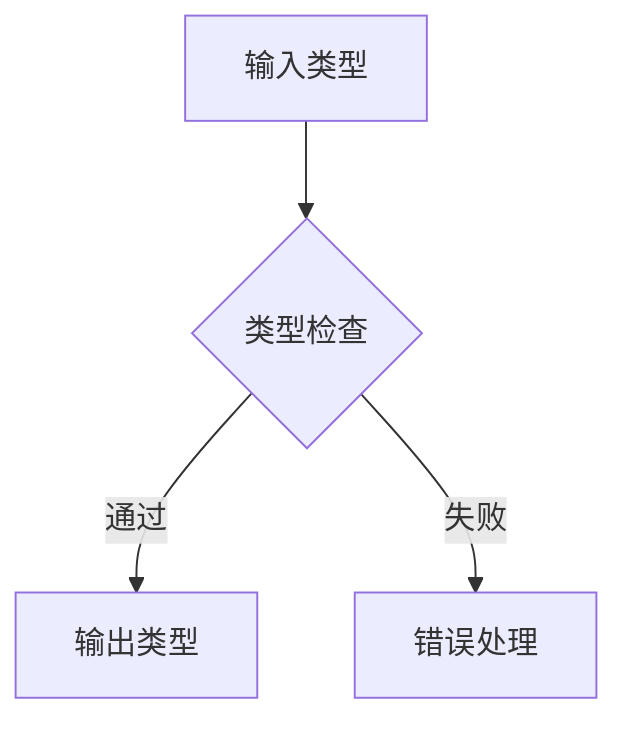

                 

### 《理解罗素悖论：类型论的起源》

**关键词：** 罗素悖论，类型论，数学基础，应用，批判与影响

**摘要：** 本篇文章将深入探讨罗素悖论，这是一个在数学和逻辑领域引起广泛讨论的难题。我们将从罗素悖论的定义、类型论的起源和发展、类型论的数学基础、类型论的应用、批判与影响等多个角度，一步步分析推理，带领读者理解这一深刻且复杂的问题，并探讨类型论在计算机科学中的应用和未来发展。

## 引言——逻辑与数学的碰撞

**1.1 问题的背景**

在数学和逻辑的研究中，罗素悖论是一个不可忽视的经典问题。它最初由英国数学家和哲学家伯特兰·罗素在1901年提出，揭示了集合论中的悖论性，从而引发了数学基础的深刻反思。罗素悖论的核心在于它挑战了我们对集合定义的合理性，并揭示了形式逻辑在处理复杂集合时的局限性。

**1.2 罗素悖论的产生**

罗素悖论的产生源于对集合的无限嵌套构造。具体来说，罗素提出了一个称为“集合的集合”的概念，并在此基础上发现了悖论。悖论的表述如下：设集合R包含所有不包含自己的集合，即R = {X | X 不包含自己}。那么，R是否包含自己呢？如果R包含自己，则根据定义，R不应该包含自己；如果R不包含自己，则根据定义，R应该包含自己。这就形成了一个逻辑上的矛盾。

**1.3 类型论的重要性**

罗素悖论的提出促使了类型论的诞生，这是一种用于解决集合论悖论的重要数学理论。类型论通过引入不同的类型系统，限制变量和函数的运算范围，从而避免了罗素悖论的困扰。类型论不仅在数学领域有重要应用，也在计算机科学中扮演了关键角色，特别是在编程语言设计和形式验证中。

## 罗素悖论的本质

**2.1 悖论的定义**

悖论是指一个命题在逻辑上既真又假的情况。罗素悖论是一个典型的悖论，它揭示了集合论中的基本问题。悖论的定义涉及到了集合的构造和逻辑推理，因此我们需要从集合论的基本概念出发，理解悖论的本质。

**2.2 罗素悖论的具体表述**

罗素悖论的具体表述如下：设R为所有不包含自己的集合的集合，即R = {X | X 不包含自己}。那么，R是否包含自己呢？这个问题引发了逻辑上的矛盾。如果R包含自己，则根据定义，R不应该包含自己；如果R不包含自己，则根据定义，R应该包含自己。这就形成了一个逻辑上的悖论。

**2.3 悖论的解决思路**

为了解决罗素悖论，我们需要从集合论的基本假设和推理规则中寻找问题。类型论提供了一种解决方案，通过引入不同的类型系统，限制变量和函数的运算范围，从而避免了悖论的困扰。类型论的基本思想是将不同的数学对象分为不同的类型，并在不同类型之间建立严格的界限。

## 类型论的起源

**3.1 类型论的历史背景**

类型论的历史可以追溯到19世纪末和20世纪初的数学和逻辑研究。当时的数学家们开始意识到，集合论中存在一些基本问题，这些问题涉及到集合的定义、构造和推理。为了解决这些问题，数学家们开始探索不同的数学理论和方法。

**3.2 类型论的提出与发展**

类型论的提出和发展主要归功于莱布尼茨、弗雷格和罗素等数学家和哲学家。他们在研究逻辑和集合论时，提出了不同的类型概念，并尝试解决悖论问题。类型论的发展历程反映了数学和逻辑领域的深刻变革。

**3.3 类型论的主要代表人物**

类型论的主要代表人物包括贝尔纳斯、图灵和马丁-洛芬等。他们在不同时期对类型论进行了深入研究，并提出了各种类型系统和证明方法。这些代表人物的工作对类型论的发展产生了深远影响。

## 类型论的基本概念

**4.1 类型论的基本原理**

类型论的基本原理是区分不同类型的对象，并规定不同类型之间的操作规则。类型论通过引入类型系统，限制了变量和函数的运算范围，从而避免了悖论的困扰。

**4.2 概念特征对比表格**

为了更好地理解类型论的基本概念，我们可以列出一些类型特征对比表格，展示不同类型之间的区别。

| 类型名称 | 特征1 | 特征2 | 特征3 |
| -------- | ---- | ---- | ---- |
| 基本类型 | 简单 | 基础 | 固定 |
| 复合类型 | 复杂 | 组合 | 动态 |

**4.3 ER图架构**

类型论在数据库设计中也有重要应用。通过ER图（实体关系图）可以直观地展示不同类型之间的关系。下面是一个简单的ER图示例。

```mermaid
erDiagram
    Class1 ||--|| Class2
    Class2 ||--|| Class3
```

## 类型论的数学基础

**5.1 数学模型介绍**

类型论的数学基础涉及到了集合论、代数和逻辑等数学领域。我们可以通过构建数学模型来展示类型论的基本原理。

**5.2 数学公式与推导**

为了更深入地理解类型论，我们需要使用数学公式和推导来阐述其基本原理。例如，我们可以使用以下公式来表示类型论的基本原理。

$$
Type_1 + Type_2 = Type_{max}
$$

这个公式表示两个类型的对象进行操作后，结果类型将是这两个类型中较大的那个类型。

**5.3 算法原理与mermaid流程图**

类型论的算法原理可以通过mermaid流程图来展示。例如，下面是一个简单的类型检查算法流程图。



## 类型论的应用

**6.1 类型论在数学中的应用**

类型论在数学领域有广泛的应用，特别是在集合论和代数中。通过类型论，我们可以更好地理解和处理数学中的复杂问题。

**6.2 类型论在其他领域中的应用**

类型论不仅在数学领域有应用，还在计算机科学、哲学和逻辑等领域有着重要影响。例如，在编程语言设计中，类型论可以帮助我们构建更安全、更可靠的系统。

**6.3 类型论应用的前景与挑战**

随着计算机科学和数学的发展，类型论的应用前景越来越广阔。然而，类型论也面临着一些挑战，如类型系统的复杂性和高效性等。

## 类型论的批判与影响

**7.1 类型论的批判观点**

类型论并不是没有争议。一些数学家和哲学家对类型论提出了批判，认为它过于复杂，难以在实际应用中实现。

**7.2 类型论的影响与意义**

尽管存在批判，类型论在数学和计算机科学中仍然具有重要意义。它为我们提供了一种解决悖论和复杂性问题的方法。

**7.3 类型论的未来展望**

随着科技的进步，类型论在未来有望在更多领域得到应用。同时，我们也将继续探索类型论的局限性，并寻找改进和扩展的方法。

## 总结与展望

**8.1 本书的主要内容回顾**

本书从罗素悖论的背景和产生、类型论的起源和发展、类型论的数学基础、类型论的应用、批判与影响等多个角度，深入探讨了罗素悖论和类型论的本质。

**8.2 类型论的重要性与影响**

类型论在数学和计算机科学中具有重要意义。它不仅帮助我们理解了集合论中的悖论，还为编程语言设计和形式验证提供了重要工具。

**8.3 未来的研究方向**

未来，我们可以从多个角度进一步研究类型论，如类型系统的优化、类型论在新型编程语言中的应用等。

### 作者信息

**作者：** AI天才研究院/AI Genius Institute & 禅与计算机程序设计艺术 /Zen And The Art of Computer Programming

本文由AI天才研究院/AI Genius Institute撰写，旨在深入探讨罗素悖论和类型论的本质，为读者提供全面的技术解读和分析。通过本文，我们希望读者能够更好地理解这一复杂但重要的数学和逻辑问题。

