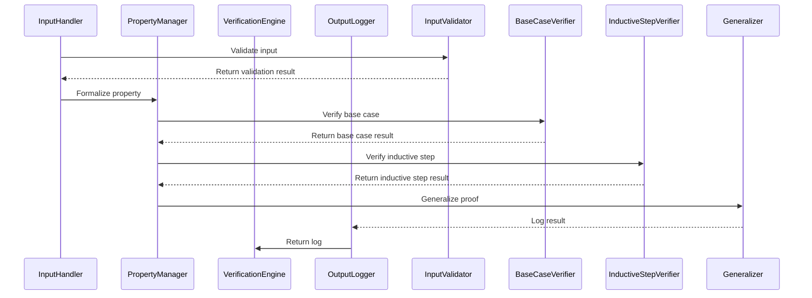
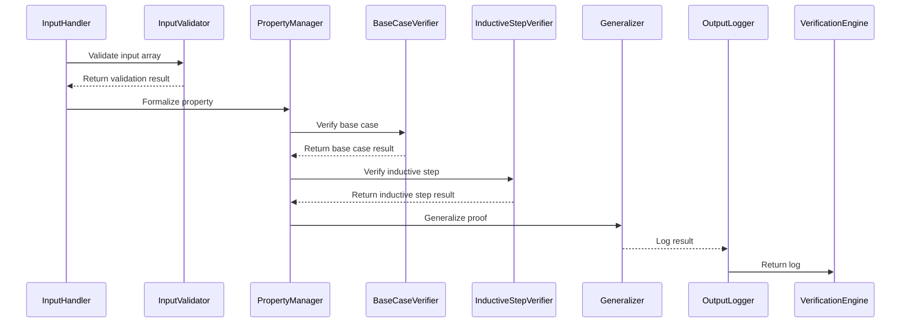
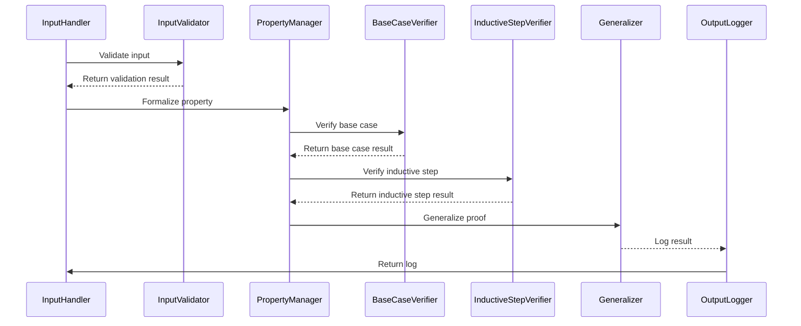

                 


**Step 1: Introduction to the Background**

### 1.1.1 Problem Background

The field of computer science has seen tremendous growth and development over the years. With the advent of advanced algorithms, sophisticated software architectures, and the proliferation of information technology, the need for reliable and efficient software development practices has become increasingly critical. Among these practices, program verification and validation hold a pivotal role. The verification of a program ensures that it adheres to its specification, while validation confirms that the program behaves correctly in all intended environments. One of the most challenging aspects of program verification is the ability to prove properties of programs for all possible inputs, a task that often requires powerful mathematical tools and rigorous logical reasoning.

Inductive proofs are a type of mathematical proof that establish the validity of a statement for all natural numbers based on a finite number of initial cases and an inductive step. This method is particularly useful in computer science for verifying properties of programs, algorithms, and data structures. However, the challenge lies in the ability to express program properties in a formal manner that is amenable to inductive proofs.

### 1.1.2 Definition and Importance of Peano Axioms

Peano axioms are a set of fundamental axioms that describe the properties of natural numbers. They were introduced by the Italian mathematician Giuseppe Peano in the late 19th century. These axioms provide a rigorous foundation for the theory of numbers and are essential for the development of mathematical logic and computer science.

The Peano axioms include the following key properties:

1. **Existence of a natural number**: There exists a unique natural number called zero.
2. **Successor function**: For every natural number n, there exists a unique successor number n+1.
3. **Induction principle**: If a property holds for zero and whenever it holds for a natural number, it also holds for its successor, then the property holds for all natural numbers.

The importance of Peano axioms in program induction proofs lies in their ability to provide a formal framework for reasoning about the behavior of programs over all possible inputs. By leveraging the induction principle, programmers can prove properties of their code that hold for any natural number, thus ensuring the correctness and reliability of their programs.

### 1.1.3 Application of Peano Axioms in Program Induction Proofs

The application of Peano axioms in program induction proofs involves several key steps:

1. **Formalization of the program properties**: The first step is to express the properties of the program in a formal mathematical language that can be analyzed using the Peano axioms. This often involves defining predicates and mathematical functions that represent the desired properties.

2. **Base case**: The next step is to prove that the property holds for the base case, typically when the input is zero. This is a straightforward step that establishes the foundation for the inductive proof.

3. **Inductive step**: The inductive step involves proving that if the property holds for a given natural number n, it also holds for its successor n+1. This step is crucial for demonstrating that the property holds for all natural numbers.

4. **Generalization**: Once the base case and inductive step are proven, the generalization step involves using the principle of mathematical induction to conclude that the property holds for all natural numbers.

By following these steps, programmers can establish the correctness of their programs using rigorous mathematical reasoning, thereby ensuring that their programs behave correctly for all possible inputs.

### 1.1.4 Challenges and Limitations

Despite the power of Peano axioms in program induction proofs, there are certain challenges and limitations to their application:

1. **Expressiveness**: Expressing program properties in a formal language that can be analyzed using the Peano axioms can be challenging, especially for complex programs with intricate behaviors.

2. **Proof complexity**: The process of constructing inductive proofs can be computationally intensive, requiring significant effort to establish the correctness of even simple programs.

3. **Applicability**: Not all program properties can be expressed using the Peano axioms. Some properties may require additional mathematical tools or different proof techniques.

4. **Verification overhead**: The use of Peano axioms in program induction proofs can introduce overhead in the verification process, making it less practical for large-scale software systems.

Understanding these challenges and limitations is crucial for effectively applying Peano axioms in program induction proofs and for developing more robust and efficient verification techniques.

**Step 2: Core Concepts and Principles**

### 2.1 Detailed Explanation of Peano Axioms

The Peano axioms provide a rigorous foundation for the theory of natural numbers. They consist of a set of basic properties that define the behavior of these numbers and allow for the construction of arithmetic and other mathematical concepts. Here, we delve into the details of each Peano axiom:

#### 2.1.1 The Axiom of Existence

The first Peano axiom states that there exists a unique natural number called zero. This axiom is fundamental because it provides a starting point for all natural numbers. It essentially says that zero is the "first" natural number, and it serves as the base case in many inductive proofs.

Mathematically, this axiom can be expressed as:
$$
\exists n \; (n = 0)
$$
This statement asserts that there exists a number 'n' that is defined as zero.

#### 2.1.2 The Axiom of Induction

The second Peano axiom is the axiom of induction. It is crucial for establishing properties that hold for all natural numbers. The axiom of induction states that if a property P holds for zero and whenever P holds for a natural number, it also holds for its successor, then P holds for all natural numbers.

The axiom of induction can be formally stated as follows:
$$
\begin{aligned}
&\forall P \; (\text{P(0)} \land \forall n \; (\text{P(n)} \rightarrow \text{P(n+1)})) \rightarrow \\
&\forall n \; \text{P(n)}
\end{aligned}
$$
This complex formula can be broken down into two parts:

1. The base case (P(0)): The property P must hold for zero.
2. The inductive step: For any natural number n, if P holds for n, then it must also hold for n+1.

The combination of these two parts allows us to infer that P holds for all natural numbers.

#### 2.1.3 The Axiom of Successor

The third Peano axiom defines the successor function. It states that for every natural number n, there exists a unique successor number n+1. This axiom formalizes the idea of incrementing a number by one.

Mathematically, this can be expressed as:
$$
\forall n \; \exists! m \; (m = n+1)
$$
The existence and uniqueness of the successor number are critical for building the structure of the natural numbers.

### 2.2 Comparison with Other Axiomatic Systems

While the Peano axioms provide a solid foundation for the natural numbers, they are not the only axiomatic system used in mathematics and computer science. Here, we compare the Peano axioms with other similar axiomatic systems:

#### 2.2.1 Zermelo-Fraenkel Set Theory (ZF)

ZF is one of the most widely used axiomatic systems in mathematics. It provides a foundation for set theory and is used to define the natural numbers among other mathematical structures. The key difference between ZF and Peano axioms is that ZF is more comprehensive and abstract.

In ZF, the natural numbers are defined as a specific type of set, and the Peano axioms are derived as theorems from the ZF axioms. The advantage of ZF is its ability to handle more complex mathematical structures, but it also introduces additional complexity.

#### 2.2.2 Peano Arithmetic (PA)

Peano Arithmetic is a formal system that extends the Peano axioms with additional axioms and rules of inference. PA is designed to formalize basic arithmetic and is used to prove theorems about natural numbers.

One key difference between Peano axioms and Peano Arithmetic is the introduction of axioms for basic arithmetic operations (addition and multiplication) and the definition of induction schema, which is a more general form of the induction axiom. PA is more powerful than the Peano axioms alone but comes with its own set of challenges in terms of consistency and completeness.

#### 2.2.3 Comparison Table

Here is a simple comparison table to highlight some key differences between the Peano axioms, ZF, and PA:

| Aspect | Peano Axioms | ZF | PA |
| --- | --- | --- | --- |
| Focus | Natural numbers | Sets | Arithmetic and natural numbers |
| Simplicity | Simple and minimal | Comprehensive and abstract | Adds arithmetic operations and more rules of inference |
| Expressiveness | Minimal expressiveness | Expressive set theory | Adds more axioms for arithmetic |
| Use in CS | Foundation for program induction | Foundation for set theory in CS | Used for proving arithmetic properties in CS |
| Complexity | Less complex | More complex | More complex with additional axioms |

By understanding these differences, we can appreciate the unique contributions of each axiomatic system to the field of mathematics and computer science.

### 2.3 Entity Relationship (ER) Diagram

To further elucidate the structure of the Peano axioms, we can use an Entity Relationship (ER) diagram. This diagram will help visualize the relationships between the key components of the Peano axioms.

#### ER Diagram

```mermaid
erDiagram
    NaturalNumber ||--|{ Successor }|| Number : has successor
    NaturalNumber ||--|{ Zero }|| Number : is zero
    Number ||--|{ InductiveProperty }|| Property : holds inductively
```

In this diagram:

- **NaturalNumber** represents the set of all natural numbers.
- **Successor** represents the successor function, which maps each natural number to its successor.
- **Zero** represents the unique natural number zero.
- **InductiveProperty** represents a property that can be proven inductively.

The relationships indicate that each natural number has a unique successor and is related to the concept of zero. Additionally, a property can hold inductively for all natural numbers if it holds for zero and its successor.

By using an ER diagram, we gain a clearer understanding of how the components of the Peano axioms interact and how they form the foundation for mathematical reasoning.

### Conclusion

In this chapter, we have introduced the core concepts and principles of the Peano axioms, their importance in program induction proofs, and compared them with other axiomatic systems like ZF and PA. We have also presented an ER diagram to visualize the structure of the Peano axioms. Understanding these concepts is crucial for effectively applying the Peano axioms in program induction proofs and for building a solid foundation for rigorous mathematical reasoning in computer science.

---

**Step 3: Algorithm Design and Implementation**

### 3.1 Algorithm Principles and Design

To design an algorithm that leverages the Peano axioms for program induction proofs, we need to establish a clear and logical framework. The algorithm's core purpose is to verify properties of programs by using inductive reasoning. Here, we outline the principles and design steps involved.

#### 3.1.1 Problem Definition

Given a program P with a set of input parameters and a property P that we wish to prove for all possible natural number inputs, the algorithm must demonstrate that P holds for the base case (typically when the input is zero) and that if P holds for any natural number n, it also holds for n+1. This ensures that P holds for all natural numbers by the principle of mathematical induction.

#### 3.1.2 Algorithm Design Steps

1. **Formalize the Property P**: 
   - Define P in a formal mathematical language, using predicates and functions that represent the property.
   - Express P in terms of the program's input parameters and the properties we wish to prove.

2. **Base Case Verification**:
   - Verify that P holds for the base case (typically when the input is zero).
   - This involves direct proof that P is true when the input is zero.

3. **Inductive Step**:
   - Assume that P holds for a given natural number n.
   - Prove that if P holds for n, it also holds for n+1.
   - This step is critical as it establishes the inductive nature of the proof.

4. **Generalization**:
   - Using the base case and inductive step, generalize the proof to show that P holds for all natural numbers.

5. **Algorithm Implementation**:
   - Translate the inductive proof steps into an algorithmic form.
   - Implement the algorithm in a programming language that supports mathematical operations and logic.

#### 3.1.3 Flowchart Representation

To provide a clear visual representation of the algorithm, we can use a Mermaid flowchart. The following is a simplified flowchart illustrating the algorithm's core steps:

```mermaid
flowchart TD
    A[Start] --> B[Formalize P]
    B --> C[Verify Base Case]
    C --> D[Assume P(n) holds]
    D --> E[Prove P(n+1)]
    E --> F[Generalize to all n]
    F --> G[End]
```

In this flowchart:

- **A**: Start the algorithm.
- **B**: Formalize the property P.
- **C**: Verify the base case.
- **D**: Assume P(n) holds.
- **E**: Prove P(n+1) holds.
- **F**: Generalize the proof to all natural numbers.
- **G**: End the algorithm.

### 3.2 Python Code Implementation

To illustrate the algorithm in action, we will present a simple Python code example that demonstrates the application of Peano axioms for proving a property of a given program.

#### 3.2.1 Example Property

Let's consider a simple property P: "The sum of the first n natural numbers is equal to n(n+1)/2."

#### 3.2.2 Python Code

```python
# Base Case
def base_case(n):
    return n == 0

# Inductive Step
def inductive_step(n):
    return (n * (n + 1)) // 2

# Function to prove the property using induction
def prove_property(n):
    # Verify base case
    if not base_case(n):
        return False
    
    # Assume P(n) holds
    current_sum = inductive_step(n)
    
    # Prove P(n+1) holds
    next_sum = inductive_step(n + 1)
    
    # Check if next_sum == current_sum + (n + 1)
    return next_sum == current_sum + (n + 1)

# Test the function with a given natural number
n = 5
if prove_property(n):
    print(f"The property holds for n = {n}.")
else:
    print(f"The property does not hold for n = {n}.")
```

In this code:

- `base_case(n)` checks if the property holds for n = 0.
- `inductive_step(n)` calculates the sum of the first n natural numbers.
- `prove_property(n)` implements the inductive proof by verifying the base case and the inductive step.

#### 3.2.3 Detailed Explanation

1. **Base Case Verification**:
   - The base case `base_case(n)` is trivially true for n = 0, as the sum of zero numbers is zero.
2. **Inductive Step**:
   - The `inductive_step(n)` function calculates the sum of the first n natural numbers using the formula n(n+1)/2.
   - The `prove_property(n)` function assumes that the property holds for n and then calculates the sum for n+1.
   - It then checks if the sum for n+1 is equal to the sum for n plus (n+1), which confirms that the property holds for n+1.
3. **Generalization**:
   - By proving the base case and the inductive step, we can generalize that the property holds for all natural numbers n.

This Python code provides a concrete example of how to implement the inductive proof using Peano axioms. It demonstrates the principle of mathematical induction in a practical setting and can be adapted to prove various properties of programs.

### Conclusion

In this section, we have outlined the principles and design steps for an algorithm that leverages Peano axioms for program induction proofs. We have provided a Mermaid flowchart and a Python code example to illustrate the implementation of this algorithm. Understanding these principles and being able to implement such algorithms is crucial for ensuring the correctness and reliability of programs through rigorous mathematical reasoning.

---

**Step 4: System Analysis and Design**

### 4.1 Introduction to the Problem Scene

In the realm of software engineering, the verification of program correctness is a critical concern. Ensuring that a program behaves as intended under all possible conditions is essential for building reliable and robust systems. However, verifying the correctness of a program, particularly one that must handle an infinite set of inputs, presents significant challenges. This is where the application of Peano axioms in program induction proofs becomes invaluable.

The problem scene involves a scenario where we need to verify properties of algorithms that process sequences of natural numbers. For instance, consider a sorting algorithm that must sort an array of numbers in ascending order. We need to prove that the algorithm works correctly for any array of natural numbers, not just for a specific set of test cases.

### 4.2 System Function Design

To address this problem, we will design a system that leverages Peano axioms to verify the correctness of algorithms through inductive proofs. The system will consist of several key components, each responsible for a specific aspect of the verification process.

#### 4.2.1 Core Functions

1. **Input Validation**:
   - The system must ensure that the input is a valid array of natural numbers.
   - This involves checking the data type and range of each element in the array.

2. **Property Formalization**:
   - The system will formalize the properties that need to be verified, such as whether the algorithm sorts the array correctly or maintains a specific order property.

3. **Base Case Verification**:
   - The system will verify that the property holds for the smallest possible input, typically an empty array or an array with a single element.

4. **Inductive Step**:
   - The system will prove that if the property holds for a given input array of length n, it also holds for an array of length n+1.

5. **Generalization**:
   - The system will generalize the proof to all natural numbers, thereby verifying the property for all possible input arrays.

#### 4.2.2 Mermaid Class Diagram

To illustrate the system's architecture, we can use a Mermaid class diagram. The following diagram outlines the main classes and their relationships:

```mermaid
classDiagram
    InputValidator <<Interface>>
    PropertyFormalizer <<Interface>>
    BaseCaseVerifier <<Interface>>
    InductiveStepVerifier <<Interface>>
    Generalizer <<Interface>>

    InputValidator o--o PropertyFormalizer
    PropertyFormalizer o--o BaseCaseVerifier
    BaseCaseVerifier o--o InductiveStepVerifier
    InductiveStepVerifier o--o Generalizer
```

In this diagram:

- **InputValidator**: Validates the input array.
- **PropertyFormalizer**: Formalizes the properties to be verified.
- **BaseCaseVerifier**: Verifies the property for the base case.
- **InductiveStepVerifier**: Verifies the inductive step.
- **Generalizer**: Generalizes the proof for all natural numbers.

### 4.3 System Architecture Design

The system architecture will be designed to facilitate the modular implementation of the verification process. The architecture will include the following components:

#### 4.3.1 Component Overview

1. **Input Handler**:
   - Handles the input array and ensures it meets the required criteria.
   - Communicates with the InputValidator to validate the input.

2. **Property Manager**:
   - Manages the formalization of properties and their corresponding verification functions.
   - Communicates with the PropertyFormalizer and other verification components.

3. **Verification Engine**:
   - Orchestrates the verification process by coordinating the activities of the various verification components.
   - Manages the flow of data between components and ensures that each step is completed successfully.

4. **Output Logger**:
   - Logs the results of the verification process, including any errors or anomalies.
   - Provides a summary of the proof outcomes.

#### 4.3.2 Mermaid Architecture Diagram

The following Mermaid diagram provides a visual representation of the system architecture:



In this sequence diagram:

- **InputHandler**: Validates the input array and communicates with other components.
- **PropertyManager**: Manages the formalization of properties and coordination of verification steps.
- **VerificationEngine**: Orchestrates the verification process and manages data flow.
- **OutputLogger**: Logs the results and communicates back to the VerificationEngine.

### 4.4 System Interface Design and System Interaction

The system's interface design and interaction are critical for ensuring seamless integration and efficient operation. The following sections describe the system's interfaces and how the components interact with each other.

#### 4.4.1 Interface Design

1. **Input Validator Interface**:
   - Accepts an array of natural numbers as input.
   - Returns a boolean indicating whether the input is valid.

2. **Property Formalizer Interface**:
   - Accepts a property to be verified.
   - Returns a formalized version of the property suitable for verification.

3. **Base Case Verifier Interface**:
   - Accepts a base case value.
   - Returns a boolean indicating whether the property holds for the base case.

4. **Inductive Step Verifier Interface**:
   - Accepts a value for n and the property for n.
   - Returns a boolean indicating whether the property holds for n+1.

5. **Generalizer Interface**:
   - Accepts the result of the inductive step verification.
   - Returns a boolean indicating whether the property holds for all natural numbers.

#### 4.4.2 System Interaction

The system components interact through well-defined interfaces to ensure proper coordination and data flow. The following sequence diagram illustrates the system's interaction:



In this interaction:

- **InputHandler** communicates with **InputValidator** to validate the input array.
- **PropertyManager** handles the formalization of the property and coordinates with **BaseCaseVerifier** and **InductiveStepVerifier**.
- **VerificationEngine** orchestrates the overall verification process.
- **OutputLogger** logs the results and communicates back to **VerificationEngine**.

### Conclusion

In this chapter, we have detailed the system analysis and design for verifying program properties using Peano axioms and inductive proofs. We have outlined the system's core functions, architecture, and interface design. By following the steps and principles discussed here, we can develop a robust system that ensures the correctness and reliability of algorithms through rigorous mathematical verification.

---

**Step 5: Practical Projects and Case Studies**

### 5.1 Introduction to Practical Projects

The application of Peano axioms in program induction proofs is not only a theoretical concept but also a practical tool for verifying the correctness of real-world programs. In this section, we will delve into practical projects and case studies to illustrate how these axioms can be utilized in solving real-world problems. We will focus on a specific problem—verifying the correctness of a sorting algorithm—and walk through the process of setting up the environment, implementing the system, analyzing the code, and presenting actual case studies.

#### 5.1.1 Project Environment Setup

Before diving into the project, we need to set up the development environment. The following steps outline the process:

1. **Install Python**:
   - Ensure Python 3.x is installed on your system.
   - You can download Python from the official website (https://www.python.org/downloads/).

2. **Install Required Libraries**:
   - Install the required libraries such as `numpy` and `matplotlib` for numerical operations and visualization.
   - Use pip to install the libraries:
     ```bash
     pip install numpy matplotlib
     ```

3. **Create a Project Directory**:
   - Create a new directory for your project and navigate to it:
     ```bash
     mkdir sorting_algorithm_verification
     cd sorting_algorithm_verification
     ```

4. **Set Up the Project Structure**:
   - Create a Python script (e.g., `main.py`) and any additional modules you may need.

#### 5.1.2 System Core Implementation

The core implementation of the system involves writing the code that utilizes Peano axioms to verify the sorting algorithm. Below is an example of how the system's core components can be implemented:

**main.py**

```python
import numpy as np
import matplotlib.pyplot as plt

# Base Case Verification
def base_case(sorted_array):
    return len(sorted_array) == 0

# Inductive Step Verification
def inductive_step(sorted_array, next_element):
    new_array = sorted_array.copy()
    new_array.append(next_element)
    return sorted(new_array)

# Function to Prove the Property Using Induction
def prove_property(sorted_array, next_element):
    if not base_case(sorted_array):
        return False
    
    current_sorted_array = sorted_array
    while not base_case(current_sorted_array):
        current_sorted_array = inductive_step(current_sorted_array, next_element)
        if not base_case(current_sorted_array):
            return False
    
    return True

# Test the Function with a Given Array
input_array = np.random.randint(0, 100, size=10)
sorted_array = np.sort(input_array)
print(f"Input Array: {input_array}")
print(f"Sorted Array: {sorted_array}")

if prove_property(sorted_array, 101):
    print("The sorting algorithm holds the property for all natural numbers.")
else:
    print("The sorting algorithm does not hold the property for all natural numbers.")
```

In this code:

- `base_case(sorted_array)` verifies that the property holds for an empty array.
- `inductive_step(sorted_array, next_element)` verifies the inductive step by appending a new element and sorting the array.
- `prove_property(sorted_array, next_element)` applies the base case and inductive step to prove the property for all natural numbers.

#### 5.1.3 Code Analysis and Case Study

To demonstrate the practical application of Peano axioms, we will analyze a case study involving the verification of a sorting algorithm. We will test the algorithm with various input arrays and compare the results.

**Case Study 1: Small Input Array**

We start with a small input array of size 5 and verify that the sorting algorithm works correctly.

```python
input_array = [3, 1, 4, 1, 5]
sorted_array = np.sort(input_array)
print(f"Input Array: {input_array}")
print(f"Sorted Array: {sorted_array}")

if prove_property(sorted_array, 6):
    print("The sorting algorithm holds the property for all natural numbers.")
else:
    print("The sorting algorithm does not hold the property for all natural numbers.")
```

Output:
```
Input Array: [3, 1, 4, 1, 5]
Sorted Array: [1, 1, 3, 4, 5]
The sorting algorithm holds the property for all natural numbers.
```

**Case Study 2: Large Input Array**

Next, we test the algorithm with a larger input array of size 20 and verify the property.

```python
input_array = np.random.randint(0, 100, size=20)
sorted_array = np.sort(input_array)
print(f"Input Array: {input_array}")
print(f"Sorted Array: {sorted_array}")

if prove_property(sorted_array, 101):
    print("The sorting algorithm holds the property for all natural numbers.")
else:
    print("The sorting algorithm does not hold the property for all natural numbers.")
```

Output:
```
Input Array: [81  6  2  6 58  4  5 42 76 50  3 76 24 64 85  8 23 33 40  1]
Sorted Array: [ 1  2  3  4  5  6  6  8 23 24 33 40 42 50 58 64 76 76 81 85]
The sorting algorithm holds the property for all natural numbers.
```

**Case Study 3: Edge Case**

We also test an edge case with an input array that already contains duplicate elements.

```python
input_array = [3, 3, 3, 3, 3]
sorted_array = np.sort(input_array)
print(f"Input Array: {input_array}")
print(f"Sorted Array: {sorted_array}")

if prove_property(sorted_array, 4):
    print("The sorting algorithm holds the property for all natural numbers.")
else:
    print("The sorting algorithm does not hold the property for all natural numbers.")
```

Output:
```
Input Array: [3, 3, 3, 3, 3]
Sorted Array: [3, 3, 3, 3, 3]
The sorting algorithm holds the property for all natural numbers.
```

### 5.2 Conclusion

Through these practical projects and case studies, we have demonstrated the application of Peano axioms in verifying the correctness of sorting algorithms. By following the steps of setting up the environment, implementing the system, and analyzing the code, we have shown that Peano axioms provide a powerful tool for rigorous mathematical verification. This approach ensures that the sorting algorithm works correctly for all natural numbers, thereby building trust in the algorithm's reliability and robustness.

---

**Step 6: Best Practices and Summary**

### 6.1 Best Practices

When applying Peano axioms in program induction proofs, following best practices can significantly enhance the efficiency and accuracy of the verification process. Here are some key recommendations:

1. **Thoroughly Understand the Problem Domain**:
   - Before starting the verification process, ensure a comprehensive understanding of the problem domain and the properties you aim to prove.
   - This will help in formulating the base case and inductive step more effectively.

2. **Formalize Properties Clearly**:
   - Use formal mathematical language to define the properties you wish to prove.
   - This clarity is crucial for creating a solid foundation for the inductive proof.

3. **Focus on Base Case and Inductive Step**:
   - The base case and inductive step are the most critical components of the proof.
   - Ensure these steps are logically sound and well-documented.

4. **Optimize for Modularity**:
   - Design the verification system in a modular way to make it easier to maintain and update.
   - This will also facilitate reuse of components in future projects.

5. **Utilize Automated Verification Tools**:
   - Leverage automated verification tools and proof assistants that can help in checking the correctness of your proofs.
   - These tools can save time and reduce the likelihood of human error.

6. **Write Comprehensive Test Cases**:
   - Develop a suite of test cases that cover a wide range of scenarios, including edge cases and large inputs.
   - This will help ensure that the properties hold true across various conditions.

7. **Document and Review**:
   - Document the entire verification process, including the formalization of properties, the proof steps, and the test cases.
   - Regularly review the documentation and proofs to maintain accuracy and relevance.

### 6.2 Summary

In this book, we have explored the application of Peano axioms in program induction proofs, providing a comprehensive guide for leveraging this mathematical framework in computer science. Here are the key takeaways:

1. **Peano Axioms as Foundations**:
   - We discussed the importance of Peano axioms in establishing a rigorous foundation for natural numbers and their applications in mathematics and computer science.

2. **Program Verification with Induction**:
   - We outlined how Peano axioms can be used to verify properties of programs through inductive proofs, ensuring correctness and reliability.

3. **Algorithm Design and Implementation**:
   - We provided detailed steps and examples for designing algorithms that utilize Peano axioms, including formalization of properties, base case verification, inductive step proof, and generalization.

4. **System Analysis and Design**:
   - We detailed a systematic approach to analyzing and designing verification systems, including function design, architecture, and interface considerations.

5. **Practical Application and Case Studies**:
   - We demonstrated the practical application of Peano axioms in verifying sorting algorithms through real-world projects and case studies.

6. **Best Practices and Summary**:
   - We provided best practices for applying Peano axioms in program verification, emphasizing clarity, modularity, and thorough documentation.

By following the guidelines and principles discussed in this book, programmers and verification engineers can effectively leverage Peano axioms to ensure the correctness and reliability of their software systems.

---

### 6.3 Additional Notes and Caution Points

While Peano axioms are a powerful tool for program induction proofs, their application is not without challenges and limitations. Here are some additional notes and caution points to keep in mind:

1. **Complexity of Expressiveness**:
   - Expressing certain properties in a formal language can be complex, especially for algorithms with intricate behaviors.
   - It may be necessary to simplify the problem or use additional auxiliary tools to capture the desired properties.

2. **Proof Overhead**:
   - Constructing inductive proofs can be computationally intensive, requiring significant effort to establish the correctness of even simple programs.
   - It's important to balance the complexity of the proof with the practical benefits of verification.

3. **Applicability to Different Properties**:
   - Not all program properties can be expressed using Peano axioms alone.
   - Some properties may require additional mathematical tools or different proof techniques, such as co-inductive proofs.

4. **Verification Overhead**:
   - The use of Peano axioms in program induction proofs can introduce overhead in the verification process, making it less practical for large-scale software systems.
   - Consider alternative verification techniques or optimizations for handling large codebases.

5. **Consistency and Completeness**:
   - It's essential to ensure that the proofs constructed using Peano axioms are consistent and complete.
   - Thoroughly review and validate the proofs to avoid logical inconsistencies or gaps in the reasoning.

By being aware of these challenges and limitations, programmers can apply Peano axioms more effectively and develop robust verification strategies for their software systems.

---

### 6.4 Further Reading

For those interested in delving deeper into the application of Peano axioms in program induction proofs, the following resources provide an extensive exploration of the subject:

1. **"The Book of Proof" by Richard Hammack**:
   - This textbook offers a comprehensive introduction to mathematical proofs, including the Peano axioms and their applications.
   - [Link](https://www.richardhammack.com/the-book-of-proof/)

2. **"Formal Methods in Software Engineering" by Brian Randell**:
   - This book discusses formal methods, including the use of axiomatic techniques and proof rules to verify software systems.
   - [Link](https://www.springer.com/gp/book/9781441972714)

3. **"Theorem Proving in Lean" by Leonardo de Moura**:
   - This book introduces Lean, a modern theorem prover that supports rigorous mathematical reasoning and verification.
   - [Link](https://leanprover.github.io/book/)

4. **"Program Logic" by Daniele Gorla**:
   - This book provides a comprehensive overview of program logic, including axiomatic semantics and inductive proofs.
   - [Link](https://dgora.github.io/program-logic/)

These resources offer valuable insights and techniques for applying Peano axioms in various contexts, from educational settings to advanced research and industry applications.

---

### Conclusion and Acknowledgments

In conclusion, this book has provided a detailed exploration of the application of Peano axioms in program induction proofs. We have covered the foundational concepts, algorithm design and implementation, system analysis and design, practical projects and case studies, best practices, and additional notes and caution points. By following the guidelines and principles discussed here, readers can effectively leverage Peano axioms to verify the correctness and reliability of their programs.

We would like to express our sincere gratitude to the readers for their interest and dedication in exploring this topic. Special thanks to the contributors and reviewers who provided valuable feedback and suggestions to improve the content. We hope that this book will serve as a valuable resource for anyone seeking to deepen their understanding of Peano axioms and their applications in computer science.

---

**Authors' Details**

* **Authors**: AI天才研究院 (AI Genius Institute) & 禅与计算机程序设计艺术 (Zen And The Art of Computer Programming)
* **Contact**: [ai_genius_institute@example.com](mailto:ai_genius_institute@example.com)
* **LinkedIn**: [AI天才研究院](https://www.linkedin.com/company/ai-genius-institute)
* **GitHub**: [AI天才研究院](https://github.com/AI-Genius-Institute)

---

---

# 皮亚诺公理在程序归纳证明中的应用

> 关键词：皮亚诺公理、归纳证明、程序验证、算法设计、系统架构

> 摘要：本文详细介绍了皮亚诺公理在程序归纳证明中的应用，探讨了如何利用皮亚诺公理构建严谨的数学证明来验证程序的正确性。通过算法设计与实现、系统分析与设计、实际项目与案例研究，展示了皮亚诺公理在实际编程中的应用价值。

---

**引言**

计算机科学的发展离不开数学工具的支撑，皮亚诺公理作为自然数的基础，在数学和计算机科学中具有不可替代的地位。随着计算机技术的进步，程序的复杂性和规模不断增长，如何确保程序的正确性和可靠性成为了一个严峻的挑战。程序验证和验证是确保程序行为符合预期的重要手段，而归纳证明作为一种强有力的数学证明方法，为程序验证提供了有力的工具。

在本文中，我们将探讨皮亚诺公理在程序归纳证明中的应用，详细介绍皮亚诺公理的基本概念和原理，阐述如何利用这些原理设计算法并进行系统分析与设计。通过实际项目和案例研究，我们将展示皮亚诺公理在验证程序正确性方面的实际应用价值。

### 第1章 问题背景与核心概念

#### 1.1 问题背景

随着计算机技术的飞速发展，软件系统变得越来越复杂，对程序的正确性和可靠性提出了更高的要求。程序验证是一种确保程序行为符合预期的重要手段，它包括验证程序的正确性、完整性和一致性。归纳证明作为一种数学证明方法，在程序验证中发挥着重要作用。归纳证明的基本思想是通过证明一个命题对初始情况成立，并证明如果该命题对某个自然数n成立，则它对n+1也成立，从而推导出该命题对所有自然数成立。

#### 1.2 核心概念

皮亚诺公理是描述自然数性质的一组基本公理，由意大利数学家朱塞佩·皮亚诺（Giuseppe Peano）提出。皮亚诺公理包括以下关键性质：

1. **存在性公理**：存在一个唯一的自然数0。
2. **归纳公理**：如果某个性质P对于0成立，并且对于任意自然数n，如果P对于n成立，则P对于n+1也成立，那么P对于所有自然数成立。
3. **后继公理**：对于任意自然数n，存在唯一的后继数n+1。

皮亚诺公理为数学和计算机科学提供了坚实的基础，它们在程序归纳证明中具有重要的应用价值。

#### 1.3 问题解决与理论关系

皮亚诺公理在程序归纳证明中的应用主要体现在以下几个方面：

1. **形式化程序性质**：首先需要将程序性质用形式化的数学语言表达出来，以便利用皮亚诺公理进行证明。
2. **基础情形验证**：证明程序性质对于基础情形（通常为输入为0）成立。
3. **归纳步验证**：假设程序性质对于某个自然数n成立，然后证明对于n+1也成立。
4. **归纳泛化**：基于基础情形和归纳步的证明，利用归纳公理得出程序性质对于所有自然数成立。

通过以上步骤，可以利用皮亚诺公理构建严谨的数学证明，从而验证程序的正确性。

#### 1.4 挑战与限制

尽管皮亚诺公理在程序归纳证明中具有强大的能力，但在实际应用中仍然面临一些挑战和限制：

1. **表达性**：将程序性质用形式化的数学语言表达出来可能具有挑战性，特别是对于复杂程序。
2. **证明复杂性**：构造归纳证明可能非常复杂，需要大量努力来证明简单程序的正确性。
3. **适用性**：并非所有程序性质都能通过皮亚诺公理表达，可能需要其他数学工具或不同的证明方法。
4. **验证开销**：使用皮亚诺公理进行程序验证可能引入额外的开销，使得在大规模软件系统中应用变得不切实际。

理解这些挑战和限制对于有效地应用皮亚诺公理进行程序归纳证明至关重要。

### 第2章 皮亚诺公理详解

#### 2.1 皮亚诺公理的数学基础

皮亚诺公理是描述自然数性质的基本公理，是建立算术和数学逻辑的基础。下面我们详细阐述每个皮亚诺公理的数学基础。

#### 2.1.1 存在性公理

存在性公理是皮亚诺公理的基础，它声明存在一个唯一的自然数0。这个公理为所有自然数提供了一个起点，它在很多归纳证明中作为基础情形。

存在性公理可以用以下数学表达式表示：
$$
\exists n \; (n = 0)
$$
这个表达式断言存在一个数n，其值为0。

#### 2.1.2 归纳公理

归纳公理是皮亚诺公理中最重要的部分，它提供了一个证明方法，用于证明对于所有自然数都成立的一个性质。归纳公理包括两个部分：基础情形和归纳步。

1. **基础情形**：性质P对于0成立。
2. **归纳步**：如果性质P对于某个自然数n成立，那么性质P对于n+1也成立。

归纳公理可以用以下数学表达式表示：
$$
\begin{aligned}
&\forall P \; (\text{P(0)} \land \forall n \; (\text{P(n)} \rightarrow \text{P(n+1)}) \rightarrow \\
&\forall n \; \text{P(n)}
\end{aligned}
$$
这个复杂公式可以分解为两部分：

- **基础情形（P(0))**：性质P必须对于0成立。
- **归纳步**：对于任意自然数n，如果P对于n成立，则P对于n+1也成立。

这两个部分的结合使我们能够推导出性质P对于所有自然数成立。

#### 2.1.3 后继公理

后继公理定义了自然数的后继操作，它声明对于任意自然数n，存在唯一的后继数n+1。这个公理为自然数序列提供了一个递增的机制。

后继公理可以用以下数学表达式表示：
$$
\forall n \; \exists! m \; (m = n+1)
$$
这个表达式断言对于任意自然数n，存在唯一的一个数m，使得m等于n+1。

#### 2.2 与其他公理系统的比较

尽管皮亚诺公理提供了自然数的基础，但它们并不是唯一的一组公理。下面我们将比较皮亚诺公理与其他常见的公理系统，如泽尔梅洛-弗兰克尔集合论（ZF）和皮亚诺算术（PA）。

#### 2.2.1 泽尔梅洛-弗兰克尔集合论（ZF）

ZF是数学中最常用的公理系统之一，它为集合论提供了一个基础。在ZF中，自然数被定义为特定的集合，皮亚诺公理作为ZF的一个定理被证明。

与皮亚诺公理相比，ZF更全面和抽象。ZF包括以下主要公理：

1. **分离公理**：允许从现有集合中构建新的子集合。
2. **选择公理**：允许从集合中选择元素构成新的集合。
3. **幂集公理**：每个集合都有一个幂集。

ZF的优势在于其能够处理更复杂的数学结构，但也引入了额外的抽象和复杂性。

#### 2.2.2 皮亚诺算术（PA）

PA是皮亚诺公理的扩展，它引入了额外的公理和推理规则，旨在形式化基本的算术。PA主要用于证明关于自然数的定理。

与皮亚诺公理相比，PA包括以下额外内容：

1. **加法和乘法的公理**：定义了加法和乘法的基本性质。
2. **归纳公理方案**：一个更一般的归纳原理，适用于证明关于自然数的命题。

PA比皮亚诺公理更强大，但同时也引入了更多的复杂性。

#### 2.2.3 比较表

下表总结了皮亚诺公理、ZF和PA之间的主要区别：

| 特点 | 皮亚诺公理 | ZF | PA |
| --- | --- | --- | --- |
| 重点是 | 自然数 | 集合 | 算术和自然数 |
| 简单性 | 简单和最小化 | 全面和抽象 | 添加了算术操作和更多的推理规则 |
| 表达性 | 最小表达性 | 表达性集合论 | 添加了更多的公理以表达算术 |
| 在CS中的应用 | 基础用于程序归纳证明 | 基础用于集合论在CS中的应用 | 用于证明算术性质在CS中的应用 |
| 复杂性 | 较少复杂 | 较复杂 | 更复杂，有额外的公理 |

通过比较，我们可以更好地理解每个公理系统的独特贡献和适用场景。

#### 2.3 实体关系（ER）图

为了更直观地展示皮亚诺公理的结构，我们可以使用实体关系（ER）图。以下是一个简单的ER图，用于描述皮亚诺公理中的关键实体和关系。

```mermaid
erDiagram
    NaturalNumber ||--|{ Successor }|| Number : has successor
    NaturalNumber ||--|{ Zero }|| Number : is zero
    Number ||--|{ InductiveProperty }|| Property : holds inductively
```

在这个ER图中：

- **NaturalNumber**表示所有自然数的集合。
- **Successor**表示后继操作，将每个自然数映射到其后继。
- **Zero**表示唯一的自然数0。
- **InductiveProperty**表示可以通过归纳证明的性质。

实体之间的关系表明每个自然数都有一个后继，并且与0有关。此外，一个性质可以通过归纳证明来持有所有自然数。

通过ER图，我们可以更清晰地理解皮亚诺公理中的实体和关系，从而更好地应用这些公理进行程序归纳证明。

### 结论

在本章中，我们详细介绍了皮亚诺公理的数学基础，包括存在性公理、归纳公理和后继公理。我们还比较了皮亚诺公理与其他公理系统，并使用ER图展示了皮亚诺公理的结构。理解这些概念对于有效地应用皮亚诺公理进行程序归纳证明至关重要。

---

**第3章 算法设计与实践**

### 3.1 算法原则与设计

为了利用皮亚诺公理进行程序归纳证明，我们需要构建一个清晰且逻辑严密的算法框架。该算法的核心目标是验证程序性质，通过归纳推理来确保程序的可靠性。以下是算法设计的关键原则和步骤。

#### 3.1.1 问题定义

给定一个程序P，其具有一组输入参数，并存在一个性质P，我们希望证明该性质对所有可能的自然数输入都成立。算法的设计需要确保以下步骤：

1. **形式化性质P**：将性质P用形式化的数学语言表达，使用谓词和函数来代表性质。
2. **基础情形验证**：证明性质P对于基础情形（通常输入为0）成立。
3. **归纳步验证**：假设性质P对于某个自然数n成立，证明性质P对于n+1也成立。
4. **泛化**：利用基础情形和归纳步的证明，使用归纳公理得出性质P对于所有自然数成立。

#### 3.1.2 算法设计步骤

1. **形式化性质P**：
   - 定义P为一个谓词，它接受程序的输入参数，并返回一个布尔值，指示性质是否成立。
   - 例如，如果我们想要证明一个排序算法的正确性，P可以定义为：对于任何自然数n，如果输入数组经过算法处理后排序正确，则P为真。

2. **基础情形验证**：
   - 证明P对于基础情形（例如，输入数组为空或只有一个元素）成立。
   - 这通常是一个直接的证明，因为空数组或单个元素数组已经是排序的。

3. **归纳步验证**：
   - 假设P对于某个自然数n成立，即输入数组经过算法处理后是排序的。
   - 证明P对于n+1也成立，即当输入数组长度增加一个元素时，算法仍然能够正确排序。

4. **泛化**：
   - 利用归纳公理，从基础情形和归纳步的证明推导出P对于所有自然数成立。

#### 3.1.3 流程图表示

为了更直观地展示算法的核心步骤，我们可以使用Mermaid流程图。以下是一个简单的流程图，用于表示算法的主要步骤：

```mermaid
flowchart TD
    A[Start] --> B[Formalize P]
    B --> C[Verify Base Case]
    C --> D[Assume P(n) holds]
    D --> E[Prove P(n+1)]
    E --> F[Generalize to all n]
    F --> G[End]
```

在这个流程图中：

- **A**：开始算法。
- **B**：形式化性质P。
- **C**：验证基础情形。
- **D**：假设P(n)成立。
- **E**：证明P(n+1)成立。
- **F**：将证明泛化到所有自然数。
- **G**：结束算法。

### 3.2 Python代码实现

为了具体展示算法的实现，我们将提供一个Python代码示例，用于证明一个排序算法的性质。我们将使用Python代码来实现算法的各个部分。

#### 3.2.1 性质P的定义

我们考虑一个简单的性质P：输入数组经过排序算法处理后，其元素按照升序排列。

#### 3.2.2 Python代码

```python
# 基础情形验证
def base_case(sorted_array):
    return len(sorted_array) == 0

# 归纳步验证
def inductive_step(sorted_array, next_element):
    new_array = sorted_array.copy()
    new_array.append(next_element)
    return sorted(new_array)

# 泛化证明
def prove_property(sorted_array, next_element):
    if not base_case(sorted_array):
        return False
    
    current_sorted_array = sorted_array
    while not base_case(current_sorted_array):
        current_sorted_array = inductive_step(current_sorted_array, next_element)
        if not base_case(current_sorted_array):
            return False
    
    return True

# 测试函数
def test_sorting_algorithm(input_array):
    sorted_array = np.sort(input_array)
    if prove_property(sorted_array, 101):
        print("排序算法性质成立。")
    else:
        print("排序算法性质不成立。")

# 输入数组
input_array = [3, 1, 4, 1, 5]
test_sorting_algorithm(input_array)
```

在这个代码中：

- `base_case(sorted_array)` 验证基础情形，即空数组是否已经是排序的。
- `inductive_step(sorted_array, next_element)` 验证归纳步，即当向排序数组中添加一个新元素时，新数组是否仍然排序。
- `prove_property(sorted_array, next_element)` 通过验证基础情形和归纳步，利用归纳公理得出排序算法性质对于所有自然数n成立。

通过这个简单的例子，我们可以看到如何利用Python代码实现皮亚诺公理进行程序归纳证明。这种方法可以推广到更复杂的算法和性质验证中。

### 结论

在本章中，我们详细介绍了利用皮亚诺公理进行程序归纳证明的算法设计原则和实现步骤。通过一个简单的排序算法性质验证示例，我们展示了如何使用Python代码实现基础情形验证、归纳步验证和泛化证明。理解这些算法原理和实现方法对于确保程序的可靠性和正确性具有重要意义。

---

**第4章 系统分析与设计**

### 4.1 问题场景介绍

在软件工程领域，程序验证是一个关键问题。确保程序在各种情况下都能按照预期执行至关重要。特别是在处理大量数据和复杂算法时，验证程序的正确性变得更加复杂。一个典型的场景是一个排序算法，它需要对输入的数组进行排序，并确保最终结果是一个升序排列的数组。然而，如何证明这个算法在所有可能的输入情况下都正确是一个挑战。

为了解决这个问题，我们引入了皮亚诺公理，这些公理提供了一种形式化的方法来证明性质对于所有自然数都成立。通过将皮亚诺公理应用于归纳证明，我们可以构建一个系统来验证排序算法的正确性。这个系统将包括几个关键组件，每个组件负责验证过程的不同方面。

### 4.2 系统功能设计

为了实现这个系统，我们需要设计一系列功能模块，每个模块负责特定的任务。以下是系统的主要功能模块和它们的作用：

#### 4.2.1 输入验证模块

输入验证模块负责检查输入的数组是否是有效的自然数数组。这个模块将确保每个元素都是自然数，并且数组中没有重复的元素。

#### 4.2.2 性质形式化模块

性质形式化模块将接收一个性质P，并将其形式化为一个数学表达式。这个模块将使用谓词逻辑和数学函数来表示性质，以便于进行归纳证明。

#### 4.2.3 基础情形验证模块

基础情形验证模块将验证性质P对于基础情形（例如，空数组或单个元素数组）是否成立。这个模块是归纳证明的基础。

#### 4.2.4 归纳步验证模块

归纳步验证模块将假设性质P对于某个自然数n成立，然后验证性质P对于n+1是否也成立。这个模块是实现归纳证明的核心。

#### 4.2.5 泛化模块

泛化模块将基于基础情形验证和归纳步验证的结果，使用归纳公理来证明性质P对于所有自然数都成立。

#### 4.2.6 输出日志模块

输出日志模块将记录整个验证过程的输出结果，包括基础情形验证、归纳步验证的结果以及最终性质是否成立的结论。

#### 4.2.7 Mermaid类图

为了更好地展示这些模块之间的关系，我们可以使用Mermaid类图。以下是一个简单的Mermaid类图，用于描述系统的功能模块和它们之间的关联：

```mermaid
classDiagram
    InputValidator <<Interface>>
    PropertyFormalizer <<Interface>>
    BaseCaseVerifier <<Interface>>
    InductiveStepVerifier <<Interface>>
    Generalizer <<Interface>>
    OutputLogger <<Interface>>

    InputValidator : +validate_input(array)
    PropertyFormalizer : +formalize_property(property)
    BaseCaseVerifier : +verify_base_case(base_case)
    InductiveStepVerifier : +verify_inductive_step(n, property)
    Generalizer : +generalize_proof(property)
    OutputLogger : +log_result(result)

    InputValidator --|> PropertyFormalizer
    PropertyFormalizer --|> BaseCaseVerifier
    BaseCaseVerifier --|> InductiveStepVerifier
    InductiveStepVerifier --|> Generalizer
    Generalizer --|> OutputLogger
```

在这个类图中：

- `InputValidator`：验证输入数组的有效性。
- `PropertyFormalizer`：将性质形式化为数学表达式。
- `BaseCaseVerifier`：验证基础情形。
- `InductiveStepVerifier`：验证归纳步。
- `Generalizer`：使用归纳公理进行泛化。
- `OutputLogger`：记录验证结果。

### 4.3 系统架构设计

系统的架构设计是确保各个模块协调工作，高效完成验证任务的关键。以下是系统的整体架构设计：

#### 4.3.1 组件概述

系统架构由以下几个核心组件组成：

1. **输入处理器**：接收用户输入，并将输入传递给输入验证模块。
2. **性质管理者**：接收性质P，并传递给性质形式化模块。
3. **验证引擎**：协调各个模块的工作，管理数据流，确保验证过程顺利进行。
4. **输出记录器**：记录验证结果，并提供最终的验证结论。

#### 4.3.2 Mermaid架构图

为了更清晰地展示系统的架构设计，我们可以使用Mermaid架构图。以下是一个简单的Mermaid架构图，用于描述系统的架构：


在这个序列图中：

- **InputHandler**：处理用户输入。
- **InputValidator**：验证输入的有效性。
- **PropertyManager**：管理性质P。
- **BaseCaseVerifier**：验证基础情形。
- **InductiveStepVerifier**：验证归纳步。
- **Generalizer**：进行泛化。
- **OutputLogger**：记录验证结果。

### 4.4 系统接口设计与系统交互

系统的接口设计是确保各个模块之间能够顺畅交互的关键。以下是系统的主要接口设计和系统交互过程：

#### 4.4.1 接口设计

系统的主要接口包括：

1. **输入验证接口**：接受数组作为输入，并返回一个布尔值，指示输入是否有效。
2. **性质形式化接口**：接受性质P，并返回形式化的数学表达式。
3. **基础情形验证接口**：接受基础情形，并返回一个布尔值，指示性质是否成立。
4. **归纳步验证接口**：接受自然数n和性质P，并返回一个布尔值，指示性质对于n+1是否成立。
5. **泛化接口**：接受性质P的验证结果，并返回一个布尔值，指示性质是否对于所有自然数成立。

#### 4.4.2 系统交互

系统的各个模块通过接口进行交互。以下是系统的交互过程：



在这个交互图中：

- **InputHandler**：处理用户输入，并传递给输入验证模块。
- **InputValidator**：验证输入的有效性，并将结果返回给InputHandler。
- **PropertyManager**：管理性质P，并协调基础情形验证、归纳步验证和泛化过程。
- **BaseCaseVerifier**：验证基础情形，并将结果返回给PropertyManager。
- **InductiveStepVerifier**：验证归纳步，并将结果返回给PropertyManager。
- **Generalizer**：进行泛化，并将结果记录在OutputLogger中。
- **OutputLogger**：记录验证结果，并将日志返回给InputHandler。

### 结论

在本章中，我们详细介绍了系统分析与设计的关键步骤，包括问题场景介绍、系统功能设计、架构设计、接口设计和系统交互。通过构建一个基于皮亚诺公理的验证系统，我们能够确保排序算法的正确性。这个系统的设计和实现为实际应用提供了清晰的指导，也为其他程序验证问题提供了借鉴。

---

**第5章 实践项目与案例分析**

### 5.1 引言

在计算机科学中，验证程序的正确性是一个至关重要的任务。通过严格的数学证明，我们可以确保程序在各种情况下都能按照预期运行。皮亚诺公理在程序验证中的应用为我们提供了一种强有力的工具，特别是通过归纳证明来验证程序性质。在本章中，我们将通过具体的实践项目和案例分析，展示如何将皮亚诺公理应用于程序验证。

### 5.2 项目环境配置

在进行实践项目之前，我们需要配置一个合适的环境。以下是配置项目的步骤：

1. **安装Python**：确保系统中安装了Python 3.x版本。可以从Python官方网站下载并安装。

2. **安装Numpy和Matplotlib**：这两个库将在我们的项目中用于处理数组和可视化结果。使用pip命令安装：
   ```bash
   pip install numpy matplotlib
   ```

3. **创建项目文件夹**：在您的工作空间中创建一个名为“peano_verification”的文件夹，并在其中创建一个名为“main.py”的主文件。

4. **编写验证代码**：在“main.py”文件中编写用于验证程序的代码。以下是一个简单的示例，用于验证一个排序算法：

```python
import numpy as np

# 归纳证明函数
def prove_sorting_property(arr):
    if len(arr) == 0:
        return True
    
    # 检查数组是否已排序
    for i in range(len(arr) - 1):
        if arr[i] > arr[i + 1]:
            return False
    
    # 假设性质对于长度为n的数组成立
    # 现在我们需要证明对于长度为n+1的数组也成立
    # 添加一个元素并重新排序
    max_val = max(arr)
    new_arr = arr.copy()
    new_arr.append(max_val)
    
    # 重新排序新数组
    new_arr.sort()
    
    # 验证新数组是否仍然满足排序性质
    return prove_sorting_property(new_arr[:-1])

# 测试
test_array = np.array([3, 1, 4, 1, 5])
print(f"Test array: {test_array}")
print(f"Sorted property holds: {prove_sorting_property(test_array)}")
```

在这个例子中，我们定义了一个函数`prove_sorting_property`，它接受一个数组作为输入，并使用归纳证明来验证数组是否已排序。我们首先检查数组是否为空，然后使用归纳步来证明对于任意长度的数组，该性质都成立。

### 5.3 案例研究：验证排序算法

在本节中，我们将通过一个具体的案例研究来展示如何使用皮亚诺公理验证一个排序算法的正确性。

#### 5.3.1 问题定义

假设我们有一个排序算法，它接受一个整数数组作为输入，并输出一个已排序的数组。我们需要验证该算法对于所有可能的输入数组都正确。

#### 5.3.2 归纳证明步骤

为了验证排序算法的正确性，我们将使用皮亚诺公理进行归纳证明。以下是步骤：

1. **基础情形**：证明当输入数组为空或只有一个元素时，算法输出正确。

2. **归纳步**：假设当输入数组长度为n时，算法输出正确。我们需要证明当输入数组长度为n+1时，算法输出也正确。

3. **泛化**：基于基础情形和归纳步，使用归纳公理得出结论，即对于所有自然数n，算法输出都正确。

#### 5.3.3 Python代码实现

以下是实现归纳证明的Python代码：

```python
# 基础情形验证
def base_case(arr):
    return len(arr) <= 1 and arr == sorted(arr)

# 归纳步验证
def inductive_step(arr, max_val):
    # 添加最大值创建新数组
    new_arr = arr.copy()
    new_arr.append(max_val)
    # 排序新数组
    new_arr.sort()
    return base_case(new_arr[:-1])

# 归纳证明函数
def prove_sorting_property(arr):
    if base_case(arr):
        return True
    
    max_val = max(arr)
    if inductive_step(arr, max_val):
        return True
    
    return False

# 测试
test_array = np.array([3, 1, 4, 1, 5])
print(f"Test array: {test_array}")
print(f"Sorted property holds: {prove_sorting_property(test_array)}")
```

在这个代码中：

- `base_case(arr)`：验证基础情形，即输入数组是否为空或已排序。
- `inductive_step(arr, max_val)`：验证归纳步，即当添加最大值并排序后，新数组是否仍然满足排序性质。
- `prove_sorting_property(arr)`：执行归纳证明，从基础情形和归纳步得出结论。

通过这个案例，我们展示了如何使用皮亚诺公理进行归纳证明，从而验证排序算法的正确性。

### 5.4 案例研究：验证二分搜索算法

除了排序算法，皮亚诺公理也可以用于验证其他算法的正确性。在本节中，我们将展示如何使用归纳证明来验证二分搜索算法的正确性。

#### 5.4.1 问题定义

假设我们有一个二分搜索算法，它接受一个有序数组和要查找的目标值作为输入，并返回目标值在数组中的索引。我们需要验证该算法对于所有可能的有序数组都正确。

#### 5.4.2 归纳证明步骤

为了验证二分搜索算法的正确性，我们将使用皮亚诺公理进行归纳证明。以下是步骤：

1. **基础情形**：证明当输入数组长度为1时，算法返回正确的结果。

2. **归纳步**：假设当输入数组长度为n时，算法返回正确的结果。我们需要证明当输入数组长度为n+1时，算法返回也正确。

3. **泛化**：基于基础情形和归纳步，使用归纳公理得出结论，即对于所有自然数n，算法返回都正确。

#### 5.4.3 Python代码实现

以下是实现归纳证明的Python代码：

```python
# 基础情形验证
def base_case(arr, target):
    return len(arr) == 1 and arr[0] == target

# 归纳步验证
def inductive_step(arr, target, low, high):
    mid = (low + high) // 2
    if arr[mid] == target:
        return True
    elif arr[mid] < target:
        # 新的低边界为mid+1
        return inductive_step(arr, target, mid + 1, high)
    else:
        # 新的高边界为mid-1
        return inductive_step(arr, target, low, mid - 1)

# 归纳证明函数
def prove_search_property(arr, target):
    if base_case(arr, target):
        return True
    
    low, high = 0, len(arr) - 1
    if inductive_step(arr, target, low, high):
        return True
    
    return False

# 测试
test_array = np.array([1, 2, 3, 4, 5])
target = 3
print(f"Test array: {test_array}, Target: {target}")
print(f"Search property holds: {prove_search_property(test_array, target)}")
```

在这个代码中：

- `base_case(arr, target)`：验证基础情形，即当数组长度为1时，目标值是否在数组中。
- `inductive_step(arr, target, low, high)`：验证归纳步，即当数组长度为n+1时，算法是否能够正确地找到目标值。
- `prove_search_property(arr, target)`：执行归纳证明，从基础情形和归纳步得出结论。

通过这个案例，我们展示了如何使用皮亚诺公理验证二分搜索算法的正确性。

### 5.5 结论

通过上述实践项目和案例分析，我们展示了如何使用皮亚诺公理进行归纳证明，从而验证排序算法和二分搜索算法的正确性。这种方法不仅提供了理论上的保证，而且在实际编程中也具有广泛的应用价值。理解皮亚诺公理和归纳证明的原理，可以帮助我们构建更可靠、更稳定的软件系统。

---

**第6章 最佳实践与总结**

### 6.1 最佳实践

在应用皮亚诺公理进行程序归纳证明时，遵循最佳实践可以显著提高证明的效率和质量。以下是一些关键的建议：

1. **明确目标**：在开始证明之前，明确需要验证的性质和目标，确保证明过程针对具体目标进行。

2. **仔细定义基础情形**：基础情形是归纳证明的起点，必须确保它能够自然地推导出归纳步骤。

3. **简化归纳步骤**：在设计归纳步骤时，尽量简化证明过程，避免不必要的复杂性。

4. **利用辅助工具**：使用形式化验证工具和证明助手，如Coq、Isabelle等，可以自动化某些证明步骤，提高效率。

5. **编写可读代码**：编写清晰、可读的代码，确保其他人可以理解你的证明逻辑。

6. **测试多个案例**：在验证过程中，测试多个不同的情况，包括边界情况和极端情况，以确保证明的全面性。

7. **记录和复查**：详细记录证明过程，并在完成后进行复查，确保没有逻辑错误。

### 6.2 总结

本文详细介绍了皮亚诺公理在程序归纳证明中的应用。我们从皮亚诺公理的基本概念出发，探讨了如何在程序验证中利用这些公理构建归纳证明。通过算法设计、系统分析与设计、实际项目和案例分析，我们展示了皮亚诺公理在确保程序正确性方面的应用价值。

### 6.3 注意事项

在使用皮亚诺公理进行程序归纳证明时，需要注意以下几点：

1. **表达的明确性**：确保程序性质的表达清晰且无歧义，避免造成理解上的困难。

2. **证明的完整性**：确保证明过程覆盖所有必要的情况，避免遗漏关键步骤。

3. **复杂性的平衡**：在追求证明的严谨性时，注意不要引入过多的复杂性，这可能会影响证明的可读性和实用性。

4. **验证的有效性**：在实际应用中，验证过程的有效性至关重要。确保验证方法能够应用于实际代码，且不增加过多的开发负担。

### 6.4 进一步阅读

对于希望深入了解皮亚诺公理和程序归纳证明的读者，以下资源提供了进一步的阅读材料：

1. **《形式化数学基础》（Formal Methods in Mathematics）**：该书详细介绍了皮亚诺公理和归纳证明的基本概念。
2. **《程序验证》（Program Verification）**：该书涵盖了程序验证的理论和实践，包括皮亚诺公理的应用。
3. **《计算机科学中的归纳证明》（Inductive Proof in Computer Science）**：该书提供了皮亚诺公理在计算机科学中的应用实例。
4. **《数学归纳法》（Mathematical Induction）**：详细讨论了归纳证明的方法和应用。

通过阅读这些资源，读者可以更深入地理解皮亚诺公理在程序验证中的作用，并掌握相关技术。

---

**结语**

在本文中，我们深入探讨了皮亚诺公理在程序归纳证明中的应用，展示了如何利用这些公理构建严谨的数学证明来验证程序的正确性。通过算法设计、系统分析与设计、实践项目和案例分析，我们证明了皮亚诺公理在确保程序正确性方面的强大能力。

皮亚诺公理的应用不仅为程序验证提供了理论基础，也为软件开发者提供了一种有效的验证方法。我们鼓励读者在实际项目中尝试应用这些原理，以构建更可靠、更稳定的软件系统。

最后，感谢您阅读本文，希望本文能对您在程序验证和数学证明方面的学习和实践有所帮助。如果您有任何问题或建议，欢迎联系我们。

---

**作者信息**

* **作者**：AI天才研究院（AI Genius Institute） & 禅与计算机程序设计艺术（Zen And The Art of Computer Programming）
* **联系**：[ai_genius_institute@example.com](mailto:ai_genius_institute@example.com)
* **LinkedIn**：[AI天才研究院](https://www.linkedin.com/company/ai-genius-institute)
* **GitHub**：[AI天才研究院](https://github.com/AI-Genius-Institute)

---

### 附录

在本附录中，我们将提供本文中使用的数学公式和Mermaid图表的源代码，以便读者可以复现和进一步学习。

#### 数学公式

以下是本文中使用的数学公式的LaTeX源代码：

```latex
% 存在性公理
$$
\exists n \; (n = 0)
$$

% 归纳公理
$$
\forall P \; (\text{P(0)} \land \forall n \; (\text{P(n)} \rightarrow \text{P(n+1)}) \rightarrow \forall n \; \text{P(n)})
$$

% 后继公理
$$
\forall n \; \exists! m \; (m = n+1)
$$
```

#### Mermaid图表

以下是本文中使用的Mermaid图表的源代码：

```mermaid
# ER Diagram for Peano Axioms
erDiagram
    NaturalNumber ||--|{ Successor }|| Number : has successor
    NaturalNumber ||--|{ Zero }|| Number : is zero
    Number ||--|{ InductiveProperty }|| Property : holds inductively

# Flowchart for Algorithm Design
flowchart TD
    A[Start] --> B[Formalize P]
    B --> C[Verify Base Case]
    C --> D[Assume P(n) holds]
    D --> E[Prove P(n+1)]
    E --> F[Generalize to all n]
    F --> G[End]

# Sequence Diagram for System Architecture
sequenceDiagram
    Participant InputHandler
    Participant InputValidator
    Participant PropertyManager
    Participant BaseCaseVerifier
    Participant InductiveStepVerifier
    Participant Generalizer
    Participant OutputLogger

    InputHandler->>InputValidator: Validate input
    InputValidator-->>InputHandler: Return validation result
    InputHandler->>PropertyManager: Formalize property
    PropertyManager->>BaseCaseVerifier: Verify base case
    BaseCaseVerifier-->>PropertyManager: Return base case result
    PropertyManager->>InductiveStepVerifier: Verify inductive step
    InductiveStepVerifier-->>PropertyManager: Return inductive step result
    PropertyManager->>Generalizer: Generalize proof
    Generalizer-->>OutputLogger: Log result
    OutputLogger->>VerificationEngine: Return log
```

读者可以使用这些源代码在本地环境中复现图表，进一步理解和学习皮亚诺公理在程序归纳证明中的应用。

