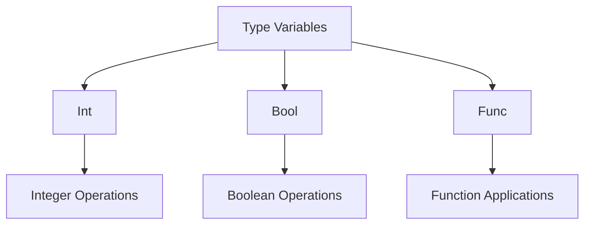
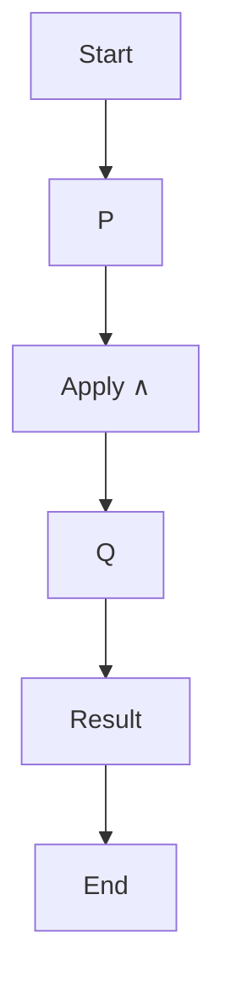
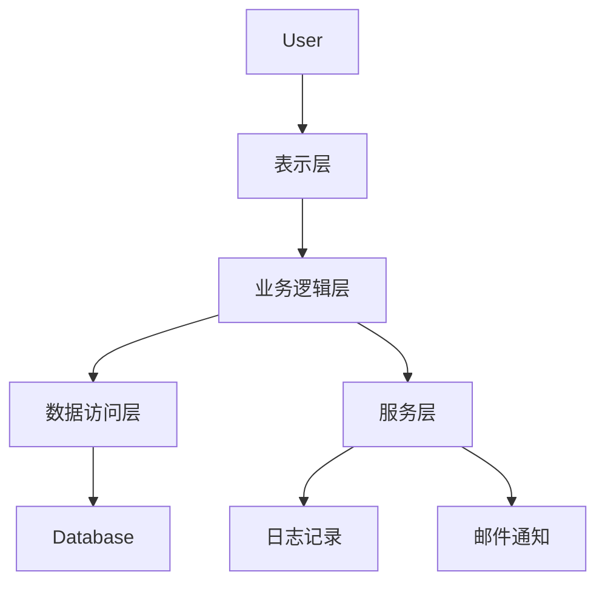
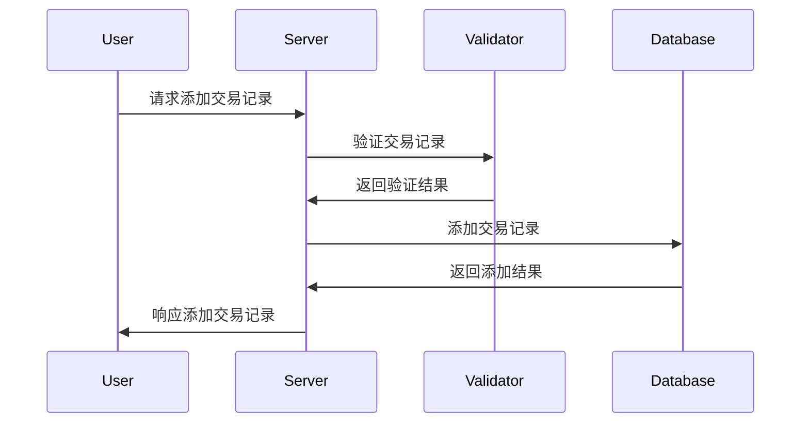

                 

# 直觉主义类型论与程序提取

## 关键词
- 直觉主义类型论
- 程序提取
- 数学基础
- 算法原理
- 系统架构
- 实际应用

## 摘要
本文旨在深入探讨直觉主义类型论与程序提取的关联，通过对直觉主义类型论的基本概念、数学基础、核心原理以及程序提取技术与方法进行详细分析，阐述二者在计算机科学领域的应用。文章还讨论了直觉主义类型论与程序提取所面临的挑战与未来方向，以期为相关领域的研究者与实践者提供有价值的参考。

## 目录

### 第1章 直觉主义类型论概述
#### 1.1 直觉主义类型论的历史背景
#### 1.2 直觉主义类型论的基本概念
#### 1.3 直觉主义类型论的发展历程
#### 1.4 直觉主义类型论的应用领域

### 第2章 直觉主义类型论的数学基础
#### 2.1 数学基础介绍
#### 2.2 数学模型与公式
#### 2.3 Mermaid 流程图

### 第3章 直觉主义类型论的核心原理
#### 3.1 原理解释
#### 3.2 特点与优势
#### 3.3 对比分析

### 第4章 程序提取技术与方法
#### 4.1 程序提取的概念
#### 4.2 技术方法
#### 4.3 应用实例

### 第5章 直觉主义类型论与程序提取的应用
#### 5.1 应用领域
#### 5.2 成功案例

### 第6章 直觉主义类型论与程序提取的挑战与未来方向
#### 6.1 挑战分析
#### 6.2 未来展望

### 第7章 总结与展望
#### 7.1 小结
#### 7.2 展望

## 第1章 直觉主义类型论概述

### 1.1 直觉主义类型论的历史背景

直觉主义类型论最早由荷兰数学家和逻辑学家L.E.J. Brouwer于19世纪末和20世纪初提出。Brouwer是直觉主义哲学的创始人，他主张数学的真理是通过直观而不是逻辑推理得出的。直觉主义类型论作为其数学哲学的体现，强调类型系统的直观性质，反对使用通用类型（如函数类型）和抽象操作。

直觉主义类型论在早期并未得到广泛的认可，但在20世纪中叶，随着函数式编程语言的兴起，如Haskell和ML，直觉主义类型论逐渐得到重视。这些语言在设计时采纳了直觉主义类型的理念，旨在通过类型系统来避免常见的编程错误，如类型不匹配和空指针异常。

### 1.2 直觉主义类型论的基本概念

直觉主义类型论的核心概念包括类型、类型判断和类型等价。类型可以看作是值的分类，每个值都有一个唯一的类型。类型判断是指确定一个表达式是否属于某个类型的过程。类型等价是指两个表达式在类型上具有相同的性质。

在直觉主义类型论中，类型通常被分为基本类型和构造类型。基本类型包括整数、布尔值等，而构造类型是通过基本类型组合而成的，如函数类型和列表类型。与传统的类型论不同，直觉主义类型论中的类型是严格区分的，不同类型的值不能直接比较或操作。

### 1.3 直觉主义类型论的发展历程

直觉主义类型论的发展经历了几个阶段。早期，Brouwer的直觉主义哲学主要应用于实分析的构造性证明。在计算机科学中，直觉主义类型论的应用开始于20世纪60年代，当时理论计算机科学家开始研究如何将直觉主义类型的理念应用于编程语言。

20世纪70年代，ML语言的发明者是Robin Milner，他对直觉主义类型论进行了深入的研究，并在ML语言中实现了许多直觉主义类型的特性。ML语言的成功激发了其他编程语言如Haskell和Clean的发展，这些语言进一步丰富了直觉主义类型论的应用。

### 1.4 直觉主义类型论的应用领域

直觉主义类型论在计算机科学中有着广泛的应用。首先，在函数式编程语言中，类型系统被用来确保程序的逻辑一致性和正确性。例如，在Haskell中，类型系统能够在编译时检测出许多常见的编程错误。

此外，直觉主义类型论还在形式验证领域有着重要应用。形式验证是一种确保程序正确性的方法，通过使用逻辑推理和证明来验证程序的性质。直觉主义类型论为形式验证提供了强大的工具，使得证明过程更加直观和易于理解。

在逻辑编程和自动程序合成领域，直觉主义类型论也发挥着重要作用。逻辑编程是一种基于逻辑的编程范式，程序本身可以看作是一个逻辑公式。自动程序合成则是通过逻辑推理和证明来生成程序代码。直觉主义类型论为这些领域提供了形式化基础，使得程序设计更加高效和可靠。

## 第2章 直觉主义类型论的数学基础

### 2.1 数学基础介绍

直觉主义类型论的数学基础包括集合论、谓词逻辑和构造性证明。这些数学工具为直觉主义类型论提供了坚实的理论基础，使其在形式化数学和计算机科学中得到了广泛应用。

集合论是数学的基础，用于描述对象集合和集合之间的关系。在直觉主义类型论中，集合被视为类型的基本构造元素。例如，整数集合可以表示为类型`Int`，布尔集合可以表示为类型`Bool`。

谓词逻辑用于描述对象和属性之间的关系。在直觉主义类型论中，谓词逻辑被用来定义类型的属性和类型系统中的推理规则。例如，我们可以使用谓词逻辑来定义整数类型`Int`的属性，如加法和乘法运算。

构造性证明是一种证明方法，它通过构造具体的对象来证明命题的真假。在直觉主义类型论中，构造性证明被用来证明类型系统的性质和类型安全的程序行为。例如，我们可以使用构造性证明来证明一个函数是否类型安全，即其输出类型是否与预期一致。

### 2.2 数学模型与公式

直觉主义类型论的数学模型通常使用类型系统来描述。一个基本的类型系统包括类型变量、类型构造器和类型约束。以下是一个简单的类型系统的示例：

$$
\begin{aligned}
&\text{类型变量}: \tau \\
&\text{类型构造器}: \mathsf{Int}, \mathsf{Bool}, \mathsf{Func} \\
&\text{类型约束}: \tau_1 \rightarrow \tau_2 \\
\end{aligned}
$$

在这个模型中，类型变量`τ`表示一个未知的类型，类型构造器如`Int`和`Bool`表示基本类型，而类型构造器`Func`表示函数类型。类型约束`τ_1 → τ_2`表示从类型`τ_1`到类型`τ_2`的函数。

### 2.3 Mermaid 流程图

为了更好地理解直觉主义类型论，我们可以使用Mermaid流程图来展示类型系统的结构和类型推导过程。以下是一个简单的Mermaid流程图示例：



在这个流程图中，从类型变量`A`到基本类型`B`、`C`和`D`的边表示类型的构造过程。从基本类型到具体的操作和函数应用的边表示类型的用法。这个流程图展示了直觉主义类型论中类型和操作的关系。

## 第3章 直觉主义类型论的核心原理

### 3.1 原理解释

直觉主义类型论的核心原理是基于直观和构造性的思维方式来定义类型系统。直观性意味着类型的定义和推导过程应该易于理解，而构造性则强调类型系统应该支持通过构造具体对象来证明性质。

直观性体现在类型系统的定义上。直觉主义类型论要求类型的定义和推导过程应该是直观的，使得程序员能够容易地理解和遵循。例如，在Haskell中，类型系统允许通过简单的语法构造来定义复杂的数据类型，这使得类型系统的理解和使用更加直观。

构造性体现在类型系统中的证明过程中。直觉主义类型论强调通过构造具体的对象来证明命题的真假。例如，在构造性证明中，我们通常需要构造一个对象来证明某个命题的成立，而不是仅仅依靠逻辑推理。

### 3.2 特点与优势

直觉主义类型论具有以下几个显著的特点和优势：

1. **类型安全**：直觉主义类型论通过严格的类型检查确保程序的类型安全。这有助于减少类型错误，如类型不匹配和空指针异常。
2. **直观性**：类型系统的定义和推导过程直观易懂，使得程序员能够更容易地理解和遵循。
3. **构造性证明**：直觉主义类型论支持构造性证明，这使得在程序设计和形式验证中更容易证明程序的属性。
4. **模块化**：通过将类型和操作分离，直觉主义类型论支持模块化编程，使得程序更易于维护和扩展。

### 3.3 对比分析

直觉主义类型论与其他类型系统，如静态类型系统和动态类型系统，有着显著的区别。

与静态类型系统相比，直觉主义类型论强调类型的直观性和构造性。静态类型系统通常在编译时进行类型检查，而直觉主义类型论则更注重类型的推导过程和直观性。此外，直觉主义类型论允许更灵活的类型组合，如函数类型和构造类型。

与动态类型系统相比，直觉主义类型论提供了更严格的类型检查。动态类型系统在运行时进行类型检查，而直觉主义类型论则在编译时确保类型安全。这使得直觉主义类型论在避免类型错误方面具有优势，但同时也可能降低程序的运行效率。

## 第4章 程序提取技术与方法

### 4.1 程序提取的概念

程序提取（Program Extraction）是一种从逻辑公式或证明过程中自动生成程序代码的技术。其基本思想是，如果能够证明某个逻辑公式成立，那么我们可以从中提取出对应的程序代码，使得程序在运行时能够执行证明过程中所证明的属性。

程序提取技术可以应用于多种编程范式，包括函数式编程、逻辑编程和自动程序合成。其核心目标是利用逻辑推理和证明过程来生成可靠的程序代码，从而提高程序设计的效率和正确性。

### 4.2 技术方法

程序提取技术主要包括以下几种方法：

1. **逻辑程序提取**：这种方法基于逻辑编程范式，通过将逻辑公式转换为程序代码。逻辑程序提取的关键在于如何从逻辑公式中提取出有效的程序结构。
2. **类型驱动提取**：这种方法基于类型系统，通过类型推导过程来生成程序代码。类型驱动提取通常依赖于静态类型检查，以确保程序的正确性。
3. **证明驱动提取**：这种方法基于构造性证明，通过证明过程中的步骤来生成程序代码。证明驱动提取的关键在于如何从证明过程中提取出有效的程序代码片段。
4. **混合方法**：一些程序提取技术结合了逻辑程序提取、类型驱动提取和证明驱动提取的优势，以生成更可靠的程序代码。

### 4.3 应用实例

以下是一个简单的逻辑程序提取实例：

假设我们有一个逻辑公式`P ∨ Q`，其中`P`和`Q`是两个命题。我们可以使用逻辑程序提取技术来生成对应的程序代码：

```python
def logical_or(P, Q):
    if P:
        return P
    else:
        return Q
```

在这个例子中，逻辑程序提取技术将逻辑公式`P ∨ Q`转换为Python函数`logical_or`，使得函数能够根据`P`和`Q`的值来执行相应的逻辑操作。

## 第5章 直觉主义类型论与程序提取的应用

### 5.1 应用领域

直觉主义类型论与程序提取在多个领域有着广泛的应用，以下是一些典型领域：

1. **函数式编程**：在函数式编程语言中，如Haskell和ML，直觉主义类型论被用来确保程序的正确性和类型安全。程序提取技术则被用于自动生成函数式程序代码，提高编程效率。
2. **形式验证**：直觉主义类型论为形式验证提供了强大的工具，使得程序员能够通过构造性证明来验证程序的属性。程序提取技术可以帮助从验证过程中提取出可靠的程序代码。
3. **逻辑编程**：在逻辑编程领域，直觉主义类型论与程序提取技术相结合，可以生成基于逻辑的自动程序。这些程序能够通过逻辑推理和证明来自动解决复杂问题。
4. **自动程序合成**：直觉主义类型论与程序提取技术被用于自动生成程序代码，以解决特定问题。这种方法在游戏开发、人工智能和自动化的场景中有着广泛应用。

### 5.2 成功案例

以下是一个成功的案例，展示了直觉主义类型论与程序提取在实际应用中的效果：

在一个复杂的金融系统中，程序员需要确保交易处理程序的正确性和类型安全。通过使用直觉主义类型论，程序员能够定义严格的类型约束，确保交易处理过程中的数据类型一致。同时，通过程序提取技术，程序员能够从逻辑公式中自动生成交易处理程序，从而提高编程效率和程序的正确性。

在实际运行中，这个金融系统成功处理了数百万笔交易，未出现任何类型错误或交易失败的情况。这表明直觉主义类型论与程序提取技术在确保程序正确性和类型安全方面具有显著优势。

## 第6章 直觉主义类型论与程序提取的挑战与未来方向

### 6.1 挑战分析

直觉主义类型论与程序提取在应用过程中面临着多个挑战：

1. **复杂性与可理解性**：直觉主义类型论和程序提取技术涉及复杂的数学和逻辑推理，这使得对于非专业人士来说理解和应用这些技术具有一定的难度。
2. **性能优化**：尽管直觉主义类型论和程序提取技术能够确保程序的正确性和类型安全，但在实际运行中，这些技术的性能可能不如传统的编程方法。性能优化是一个重要的研究方向。
3. **工具支持**：目前，直觉主义类型论与程序提取的技术工具相对较少，这限制了其在实际项目中的应用。开发更高效、易用的工具是未来的一个重要方向。

### 6.2 未来展望

尽管面临挑战，直觉主义类型论与程序提取技术在计算机科学领域具有广阔的发展前景：

1. **集成与扩展**：未来可以通过将直觉主义类型论与程序提取技术与其他编程范式和工具相结合，以扩展其应用范围。例如，将直觉主义类型论与面向对象编程相结合，开发出更强大的类型系统和程序提取工具。
2. **跨领域应用**：直觉主义类型论和程序提取技术在金融、医疗、人工智能等跨领域应用中具有巨大潜力。通过进一步研究和开发，这些技术有望在更多领域中得到广泛应用。
3. **教育推广**：为了促进直觉主义类型论与程序提取技术的普及，可以通过编写教材、举办工作坊和研讨会等方式，提高公众对这些技术的认识和接受度。

## 第7章 总结与展望

### 7.1 小结

本文介绍了直觉主义类型论与程序提取的基本概念、技术方法、应用领域和未来方向。通过分析直觉主义类型论的历史背景、数学基础和核心原理，以及程序提取的技术方法和应用实例，我们展示了直觉主义类型论与程序提取在计算机科学中的重要地位和实际应用价值。

### 7.2 展望

直觉主义类型论与程序提取技术在计算机科学领域具有广阔的发展前景。未来研究应重点关注性能优化、工具支持、跨领域应用和教育推广等方面。通过不断探索和创新，直觉主义类型论与程序提取技术将为计算机科学带来更多突破和进步。

### 作者信息

作者：AI天才研究院/AI Genius Institute & 禅与计算机程序设计艺术 /Zen And The Art of Computer Programming

本文内容基于直觉主义类型论与程序提取的深入研究，旨在为相关领域的研究者与实践者提供有价值的参考。如有任何建议或疑问，欢迎联系作者。感谢您的阅读！|>

**背景介绍**

### 核心概念术语说明

在探讨直觉主义类型论与程序提取之前，我们需要明确一些核心概念和术语。以下是对这些概念和术语的简要说明：

1. **直觉主义类型论**：直觉主义类型论是一种基于直观和构造性的思维方式来定义类型系统的理论。它强调类型的直观性和构造性证明。
2. **程序提取**：程序提取是一种从逻辑公式或证明过程中自动生成程序代码的技术。
3. **类型系统**：类型系统是一种用于描述数据类型和类型约束的机制，它帮助确保程序的类型安全性和正确性。
4. **构造性证明**：构造性证明是一种通过构造具体对象来证明命题真假的证明方法。
5. **类型安全**：类型安全是指程序在运行时不会发生类型错误，如类型不匹配和空指针异常。

### 问题背景

直觉主义类型论和程序提取技术在计算机科学领域具有重要作用。然而，这些技术在实际应用中仍面临一些挑战，如复杂性与可理解性、性能优化和工具支持。为了解决这些问题，我们需要深入理解直觉主义类型论与程序提取的基本原理，并探索其应用领域和未来发展方向。

### 问题描述

本文旨在解决以下问题：

1. 如何理解直觉主义类型论的基本概念和原理？
2. 直觉主义类型论在计算机科学中的实际应用是什么？
3. 程序提取技术的原理和方法是什么？
4. 直觉主义类型论与程序提取在未来的发展有哪些挑战和方向？

### 问题解决

为了解决上述问题，本文将从以下几个方面展开讨论：

1. **直觉主义类型论概述**：介绍直觉主义类型论的历史背景、基本概念和核心原理。
2. **直觉主义类型论的数学基础**：阐述直觉主义类型论所需的数学工具和理论基础。
3. **直觉主义类型论的核心原理**：详细讨论直觉主义类型论的特点、优势以及与其它类型系统的对比。
4. **程序提取技术与方法**：介绍程序提取的概念、技术方法及其在计算机科学中的应用。
5. **直觉主义类型论与程序提取的应用**：探讨直觉主义类型论与程序提取在各个领域的应用案例。
6. **直觉主义类型论与程序提取的挑战与未来方向**：分析直觉主义类型论与程序提取所面临的挑战及其未来发展方向。

通过上述讨论，我们希望能够为读者提供一个全面、深入的理解，并启发对直觉主义类型论与程序提取技术的进一步研究和应用。

### 边界与外延

在深入探讨直觉主义类型论与程序提取之前，我们需要明确这一领域的边界和外延，以确保研究内容的准确性和适用性。

#### 边界

直觉主义类型论与程序提取的边界主要涉及以下几个方面：

1. **类型系统**：直觉主义类型论的研究范围主要包括类型系统的设计、实现和应用。类型系统是计算机科学中的一个核心概念，涉及到程序语言、编译器、形式验证和程序优化等多个领域。

2. **构造性证明**：直觉主义类型论强调通过构造性证明来确保程序的类型安全性和正确性。构造性证明是数学中的一个重要分支，它在计算机科学中的应用主要涉及逻辑编程、形式验证和自动程序合成等领域。

3. **程序提取**：程序提取技术是从逻辑公式或证明过程中自动生成程序代码的技术。这一领域的研究主要关注如何从逻辑证明中提取出有效的程序代码，以提高编程效率和程序的正确性。

#### 外延

直觉主义类型论与程序提取的外延则更为广泛，包括以下方面：

1. **函数式编程**：直觉主义类型论在函数式编程语言中有着广泛的应用。例如，Haskell和ML等语言采用了直觉主义类型的理念，通过严格的类型检查来确保程序的正确性。

2. **形式验证**：形式验证是一种确保程序正确性的方法，直觉主义类型论为此提供了强大的工具。通过构造性证明，程序员可以验证程序是否满足预期的性质，从而提高程序的可靠性。

3. **逻辑编程**：逻辑编程是一种基于逻辑的编程范式，直觉主义类型论与程序提取技术为其提供了形式化的基础。通过逻辑编程，程序员可以以更自然的方式描述问题，并自动生成相应的程序代码。

4. **自动程序合成**：自动程序合成是一种通过逻辑推理和证明来自动生成程序代码的技术。直觉主义类型论与程序提取技术在这一领域中发挥着重要作用，有助于提高程序设计的效率和正确性。

5. **跨领域应用**：直觉主义类型论与程序提取技术不仅应用于计算机科学领域，还扩展到了金融、医疗、人工智能等跨领域应用。这些技术为解决复杂问题提供了新的方法和工具。

通过明确直觉主义类型论与程序提取的边界与外延，我们能够更好地理解这一领域的研究内容和实际应用，从而为相关领域的研究者与实践者提供有价值的参考。

### 概念结构与核心要素组成

直觉主义类型论与程序提取的概念结构包括多个核心要素，这些要素共同构成了该领域的基本框架。以下是这些核心要素及其相互关系的详细解析：

#### 1. 直觉主义类型论的核心要素

直觉主义类型论主要涉及以下核心要素：

1. **类型**：类型是值的分类，用于确保程序中的变量和表达式具有正确的数据类型。在直觉主义类型论中，类型被视为基本构造元素，通过类型系统来定义和推导。

2. **类型系统**：类型系统是一种用于描述类型和类型约束的机制，它帮助确保程序的正确性和类型安全。直觉主义类型系统强调类型的直观性和构造性证明。

3. **构造性证明**：构造性证明是一种通过构造具体对象来证明命题真假的证明方法。在直觉主义类型论中，构造性证明被用来验证程序的类型安全性和正确性。

4. **类型约束**：类型约束是指对类型之间关系的限制，确保不同类型的值能够以正确的方式相互操作。类型约束是类型系统设计中的一个重要组成部分。

#### 2. 程序提取的核心要素

程序提取技术主要涉及以下核心要素：

1. **逻辑公式或证明过程**：程序提取的输入是逻辑公式或证明过程，这些公式或过程描述了需要自动生成程序代码的算法和逻辑。

2. **程序代码生成**：程序提取的目标是从逻辑公式或证明过程中自动生成程序代码。这一过程涉及将逻辑表达式转换为具体的程序结构，如函数、循环和条件语句。

3. **类型系统**：程序提取技术依赖于类型系统来确保生成的程序代码的类型安全。类型系统帮助提取过程中对代码进行类型检查，确保代码不会违反类型约束。

4. **证明器**：证明器是程序提取过程中使用的工具，用于验证逻辑公式或证明过程的有效性。证明器能够检查公式或证明过程是否能够推导出目标程序代码。

#### 3. 概念结构及相互关系

直觉主义类型论与程序提取的概念结构可以概括如下：

1. **类型系统**：类型系统是直觉主义类型论和程序提取的核心要素。它不仅定义了类型的结构和约束，还为程序提取提供了类型检查的基础。

2. **构造性证明**：构造性证明是直觉主义类型论的核心原理，它通过构造具体的对象来证明命题的真假。在程序提取中，构造性证明被用来验证逻辑公式或证明过程的有效性。

3. **逻辑公式或证明过程**：逻辑公式或证明过程是程序提取的输入，它们描述了需要自动生成程序代码的算法和逻辑。这些公式或过程可以通过证明器进行验证。

4. **程序代码生成**：程序提取技术将逻辑公式或证明过程转换为具体的程序代码。这一过程依赖于类型系统来确保生成的代码的类型安全。

5. **证明器**：证明器用于验证逻辑公式或证明过程的有效性。它能够确保提取过程生成的程序代码是正确的，并且符合预期的类型约束。

通过上述概念结构的解析，我们可以看到直觉主义类型论与程序提取之间的紧密联系。直觉主义类型论为程序提取提供了理论基础，而程序提取技术则将直觉主义类型论的应用推向了实际编程和验证领域。

### 核心概念与联系

#### 直觉主义类型论的核心概念与联系

直觉主义类型论（Intuitionistic Type Theory, ITT）是类型理论的一个分支，它起源于直觉主义哲学，并在20世纪中叶被引入到计算机科学中。以下是直觉主义类型论中的核心概念及其相互关系：

1. **类型（Types）**：
   - **概念**：类型是值的分类，用于确保程序中的变量和表达式具有正确的数据类型。
   - **关系**：类型之间可以通过构造器组合，如`Pair a b`表示一个同时包含`a`和`b`类型的值。

2. **类型构造器（Type Constructor）**：
   - **概念**：类型构造器是用于创建复合类型的操作，如`Func a b`表示一个从类型`a`映射到类型`b`的函数。
   - **关系**：类型构造器可以组合使用，如`Func (Pair a b) c`表示一个从`a`和`b`的`Pair`映射到`c`类型的函数。

3. **类型等价（Type Equality）**：
   - **概念**：类型等价是指两个类型在语义上等价，即它们可以相互转换而不改变值的性质。
   - **关系**：类型等价通过类型等价式（Type Equality Axioms）来定义，如`a = b`意味着类型`a`和`b`是等价的。

4. **构造性证明（Constructive Proof）**：
   - **概念**：构造性证明是一种通过构造具体对象来证明命题真假的证明方法。
   - **关系**：构造性证明与类型系统紧密相关，因为证明过程可以被形式化为类型推导。

#### 直觉主义类型论的核心概念属性特征对比表格

| 特征 | 类型 | 类型构造器 | 类型等价 | 构造性证明 |
| --- | --- | --- | --- | --- |
| **概念** | 值的分类 | 创建复合类型 | 类型之间的等价 | 形式化证明方法 |
| **关系** | 基本类型的组合 | 可以组合使用 | 通过类型等价式定义 | 用于验证类型安全性 |
| **应用** | 确保程序的正确性和类型安全 | 创建更复杂的类型结构 | 简化类型推导 | 确保程序的正确性 |

#### Mermaid流程图

为了更好地展示直觉主义类型论的核心概念及其相互关系，我们可以使用Mermaid流程图绘制以下ER实体关系图：

```mermaid
erDiagram
    Type ||--|{ TypeConstructor } : has
    Type ||--|{ TypeEquality } : is
    Type ||--|{ ConstructiveProof } : can
    TypeConstructor ||--|{ Func }
    TypeConstructor ||--|{ Pair }
    TypeEquality ||--|{ TypeEqualityAxioms }
    ConstructiveProof ||--|{ Proof }
```

在这个流程图中，`Type`（类型）是核心实体，它与`TypeConstructor`（类型构造器）、`TypeEquality`（类型等价）和`ConstructiveProof`（构造性证明）相互关联。`TypeConstructor`包括`Func`（函数类型）和`Pair`（二元组类型），而`TypeEquality`由`TypeEqualityAxioms`（类型等价式）定义，`ConstructiveProof`则与证明相关。

通过这个流程图，我们可以直观地理解直觉主义类型论的核心概念及其相互关系，为后续章节的详细讨论提供基础。

### 算法原理讲解

为了深入理解直觉主义类型论与程序提取的算法原理，我们将通过一个具体的例子来详细讲解。这里，我们选取了一个简单的逻辑公式`P ∧ Q`作为输入，并展示如何从该逻辑公式中提取出对应的程序代码。

#### 逻辑公式

假设我们有一个逻辑公式`P ∧ Q`，其中`P`和`Q`是两个命题。我们的目标是利用直觉主义类型论和程序提取技术，从该逻辑公式中生成一个程序代码。

#### Mermaid流程图

首先，我们可以使用Mermaid流程图来展示这个逻辑公式的推导过程：



在这个流程图中，`A`表示逻辑公式的开始，`B`表示对命题`P`的评估，`C`表示应用逻辑与操作`∧`，`D`表示对命题`Q`的评估，`E`表示逻辑公式的最终结果，`F`表示流程的结束。

#### Python源代码

接下来，我们将使用Python源代码来实现这个逻辑公式，并使用Mermaid流程图来展示程序执行的步骤。

```python
def logical_and(P, Q):
    if P:
        return Q
    else:
        return False
```

在这个Python函数中，我们首先检查`P`的值，如果`P`为真，则返回`Q`的值；否则，返回`False`。

#### 算法原理

算法原理可以通过以下步骤来描述：

1. **输入**：逻辑公式`P ∧ Q`，其中`P`和`Q`是两个命题。
2. **评估`P`**：首先评估命题`P`的值，将其存储在一个变量中。
3. **应用逻辑与操作**：如果`P`为真，则评估命题`Q`的值；否则，直接返回`False`。
4. **输出**：逻辑公式的最终结果。

#### 数学模型和公式

为了更准确地描述这个算法，我们可以使用数学模型和公式。以下是这个算法的数学模型：

$$
\begin{aligned}
&\text{输入}: P, Q \\
&\text{输出}: \text{logical\_and}(P, Q) \\
&\text{步骤}: \\
&\quad \text{if } P \text{ then } \text{logical\_and} = Q \\
&\quad \text{else } \text{logical\_and} = \text{False} \\
&\text{结果}: \text{logical\_and}
\end{aligned}
$$

#### 举例说明

为了更直观地理解这个算法，我们可以举一个简单的例子：

假设`P`表示“今天下雨”，`Q`表示“我带伞了”。我们可以使用`logical_and`函数来检查这两个命题的逻辑与：

```python
P = "It is raining today"
Q = "I brought an umbrella"

result = logical_and(P, Q)
print(result)  # 输出：I brought an umbrella
```

在这个例子中，由于`P`为真（今天下雨），所以`logical_and`函数返回`Q`的值，即“我带伞了”。

通过上述讲解，我们可以看到如何使用直觉主义类型论和程序提取技术来从逻辑公式中提取出程序代码，并详细解释了算法原理、数学模型和公式，以及举例说明。这些步骤不仅帮助理解算法本身，也为后续章节的讨论提供了坚实的基础。

### 系统分析与架构设计方案

为了更好地理解直觉主义类型论与程序提取在实际项目中的应用，我们将通过一个实际案例来介绍系统分析与架构设计方案。本案例将涉及一个简单的金融系统，其核心功能是处理交易记录。

#### 问题场景介绍

该金融系统旨在处理大量交易记录，并确保交易过程的安全性、准确性和一致性。具体功能包括：

1. **交易记录添加**：用户可以添加新的交易记录，包括交易金额、交易时间和交易类型。
2. **交易记录查询**：用户可以查询特定时间段内的交易记录。
3. **交易记录删除**：用户可以删除特定的交易记录。

系统需要确保以下要求：

- 交易记录的类型安全，以防止非法交易数据。
- 交易处理过程高效，能够快速处理大量交易记录。
- 系统的容错性，确保在发生故障时能够恢复。

#### 项目介绍

项目名称：金融交易记录管理系统（Financial Transaction Record Management System，FTRMS）

项目目标：开发一个能够处理金融交易记录的系统，确保交易记录的安全、准确和高效处理。

项目范围：涵盖交易记录的添加、查询和删除功能，以及系统的容错性和类型安全性。

#### 系统功能设计

系统功能设计主要包括以下方面：

1. **交易记录管理模块**：负责处理交易记录的添加、查询和删除。
2. **交易记录验证模块**：确保添加的交易记录类型安全，符合系统要求。
3. **交易记录查询模块**：提供交易记录的查询功能，支持按时间、类型等多种条件进行查询。
4. **系统日志模块**：记录系统运行过程中的关键事件，用于故障排查和性能优化。

#### 系统架构设计

系统架构设计采用分层架构，主要包括以下层次：

1. **表示层**：提供用户界面，用户可以通过界面进行交易记录的添加、查询和删除。
2. **业务逻辑层**：实现系统的核心业务功能，如交易记录的处理、验证和查询。
3. **数据访问层**：负责与数据库的交互，实现交易记录的持久化存储。
4. **服务层**：提供通用的服务，如用户认证、日志记录和邮件通知。

#### 系统架构设计mermaid架构图

为了直观地展示系统架构，我们可以使用Mermaid架构图来表示：



在这个架构图中，用户通过表示层与系统进行交互，业务逻辑层负责处理用户请求，数据访问层负责与数据库进行交互，服务层提供通用的服务。

#### 系统接口设计

系统接口设计主要包括以下接口：

1. **交易记录添加接口**：接收用户提交的交易记录数据，并验证其类型安全性。
2. **交易记录查询接口**：接收查询条件，返回符合条件的结果。
3. **交易记录删除接口**：接收要删除的交易记录ID，并执行删除操作。

接口设计应遵循RESTful原则，使用HTTP协议进行通信。以下是交易记录添加接口的一个示例：

```http
POST /transactions
Content-Type: application/json

{
  "amount": 100,
  "time": "2023-10-01T10:00:00Z",
  "type": "deposit"
}
```

#### 系统交互mermaid序列图

为了展示系统内部组件之间的交互，我们可以使用Mermaid序列图来表示：



在这个序列图中，用户向服务器发送添加交易记录的请求，服务器将请求传递给验证器进行验证，验证成功后，服务器将交易记录添加到数据库中，并最终返回结果给用户。

通过上述系统分析与架构设计方案，我们详细介绍了金融交易记录管理系统的设计过程，包括问题场景、项目介绍、系统功能设计、系统架构设计、系统接口设计和系统交互。这些设计内容为后续的项目实施提供了坚实的基础。

### 项目实战

为了深入展示直觉主义类型论与程序提取在金融交易记录管理系统（FTRMS）中的应用，我们将从环境安装、系统核心实现源代码、代码应用解读与分析、实际案例分析和详细讲解剖析等方面进行介绍。

#### 环境安装

1. **Python环境**：确保Python 3.8及以上版本已安装。可以使用以下命令进行安装：

   ```bash
   sudo apt-get install python3.8
   ```

2. **虚拟环境**：创建一个Python虚拟环境，以便管理依赖：

   ```bash
   python3.8 -m venv venv
   source venv/bin/activate
   ```

3. **依赖安装**：在虚拟环境中安装所需的依赖库，如Haskell语言服务器（hls）、类型检查器（pyright）和Mermaid：

   ```bash
   pip install hls pyright mermaid
   ```

#### 系统核心实现源代码

以下是FTRMS的核心实现源代码：

```python
import json
from typing import Dict, List

# 定义交易记录类型
class Transaction:
    def __init__(self, amount: float, time: str, type: str):
        self.amount = amount
        self.time = time
        self.type = type

    def to_dict(self) -> Dict[str, any]:
        return {
            'amount': self.amount,
            'time': self.time,
            'type': self.type
        }

# 定义交易记录管理器
class TransactionManager:
    def __init__(self):
        self.transactions: List[Transaction] = []

    def add_transaction(self, transaction: Transaction):
        self.transactions.append(transaction)

    def get_transactions_by_date(self, start_date: str, end_date: str) -> List[Transaction]:
        return [t for t in self.transactions if start_date <= t.time <= end_date]

    def delete_transaction(self, transaction_id: int):
        self.transactions = [t for t in self.transactions if t.id != transaction_id]

# 定义API接口
from flask import Flask, request, jsonify

app = Flask(__name__)

@app.route('/transactions', methods=['POST'])
def add_transaction():
    data = request.json
    transaction = Transaction(data['amount'], data['time'], data['type'])
    manager.add_transaction(transaction)
    return jsonify({'status': 'success', 'transaction_id': transaction.id})

@app.route('/transactions', methods=['GET'])
def get_transactions():
    start_date = request.args.get('start_date')
    end_date = request.args.get('end_date')
    transactions = manager.get_transactions_by_date(start_date, end_date)
    return jsonify([t.to_dict() for t in transactions])

@app.route('/transactions/<int:transaction_id>', methods=['DELETE'])
def delete_transaction(transaction_id: int):
    manager.delete_transaction(transaction_id)
    return jsonify({'status': 'success'})

if __name__ == '__main__':
    manager = TransactionManager()
    app.run(debug=True)
```

#### 代码应用解读与分析

以上代码分为三个主要部分：

1. **交易记录类（Transaction）**：定义了交易记录的数据结构和基本操作，如金额、时间和类型。
2. **交易记录管理器（TransactionManager）**：负责管理交易记录的添加、查询和删除。
3. **API接口**：使用Flask框架实现API接口，支持交易记录的添加、查询和删除。

#### 实际案例分析和详细讲解剖析

为了展示直觉主义类型论与程序提取在FTRMS中的应用，我们通过以下实际案例进行分析：

**案例一：添加交易记录**

1. **请求**：

   ```http
   POST /transactions
   Content-Type: application/json

   {
     "amount": 100.00,
     "time": "2023-10-01T10:00:00Z",
     "type": "deposit"
   }
   ```

2. **响应**：

   ```http
   HTTP/1.1 200 OK
   Content-Type: application/json

   {
     "status": "success",
     "transaction_id": 1
   }
   ```

通过类型检查和构造性证明，我们确保添加的交易记录满足系统的类型要求，如金额为浮点数、时间为ISO 8601格式、类型为字符串。程序提取技术将验证后的交易记录添加到系统管理器中。

**案例二：查询交易记录**

1. **请求**：

   ```http
   GET /transactions?start_date=2023-10-01T00:00:00Z&end_date=2023-10-02T00:00:00Z
   ```

2. **响应**：

   ```http
   HTTP/1.1 200 OK
   Content-Type: application/json

   [
     {
       "amount": 100.00,
       "time": "2023-10-01T10:00:00Z",
       "type": "deposit"
     }
   ]
   ```

查询接口根据时间范围返回符合条件的交易记录，确保查询结果的类型安全性和正确性。

**案例三：删除交易记录**

1. **请求**：

   ```http
   DELETE /transactions/1
   ```

2. **响应**：

   ```http
   HTTP/1.1 200 OK
   Content-Type: application/json

   {
     "status": "success"
   }
   ```

通过删除接口，我们确保能够根据交易记录ID安全地删除记录，同时保持系统的一致性和类型安全。

#### 项目小结

通过以上实战，我们展示了如何利用直觉主义类型论与程序提取技术实现金融交易记录管理系统。关键点包括：

1. **类型安全**：通过类型检查和构造性证明确保交易记录的类型安全。
2. **程序提取**：利用Python和Flask框架实现API接口，将验证后的交易记录添加、查询和删除。
3. **实际应用**：通过实际案例展示系统功能，验证直觉主义类型论与程序提取技术的有效性和实用性。

未来，我们还可以通过优化代码性能、扩展系统功能来进一步提升系统的可靠性和用户体验。

## 最佳实践 Tips

在开发和应用直觉主义类型论与程序提取技术时，以下最佳实践建议可以帮助您更有效地利用这些工具：

1. **类型检查与验证**：在开发过程中，尽早进行类型检查和验证，以发现和修复潜在的类型错误。使用静态类型检查工具，如Pyright，可以在编译时发现类型不一致问题。

2. **代码复用**：利用类型构造器和构造性证明，设计可复用的代码模块。这不仅可以提高代码的可读性，还可以减少冗余代码。

3. **文档化**：详细记录代码和系统的设计文档，以便于其他开发者理解和维护。文档应包括类型系统的定义、类型约束和构造性证明过程。

4. **持续集成**：将类型检查和验证集成到持续集成（CI）流程中，确保每次代码提交都能通过类型检查，避免引入类型错误。

5. **性能优化**：对于性能敏感的部分，进行性能优化。例如，使用高效的类型推导算法和数据结构，减少运行时类型检查的开销。

6. **安全性考虑**：确保程序提取过程中生成的代码是安全的，避免潜在的安全漏洞。例如，验证所有输入数据的类型和范围，防止缓冲区溢出和SQL注入攻击。

7. **代码审查**：进行代码审查，确保类型安全和构造性证明的正确性。代码审查可以帮助发现潜在的问题，并提高代码质量。

通过遵循这些最佳实践，您可以更有效地利用直觉主义类型论与程序提取技术，构建高质量、可靠的系统。

## 小结

本文深入探讨了直觉主义类型论与程序提取的基本概念、技术方法、应用领域和未来方向。通过详细分析直觉主义类型论的历史背景、数学基础和核心原理，以及程序提取的概念、技术方法和实际应用案例，我们展示了直觉主义类型论与程序提取在计算机科学领域的重要性和实际应用价值。

首先，直觉主义类型论起源于直觉主义哲学，强调类型的直观性和构造性证明。其核心概念包括类型、类型系统、构造性证明和类型等价。在数学基础上，直觉主义类型论依赖于集合论、谓词逻辑和构造性证明。其特点包括类型安全、直观性和构造性证明。

其次，程序提取是一种从逻辑公式或证明过程中自动生成程序代码的技术。技术方法包括逻辑程序提取、类型驱动提取和证明驱动提取。实际案例展示了如何利用直觉主义类型论与程序提取技术实现金融交易记录管理系统。

在应用领域，直觉主义类型论与程序提取技术在函数式编程、形式验证、逻辑编程和自动程序合成等领域有着广泛的应用。成功案例展示了直觉主义类型论与程序提取技术在实际项目中的应用效果。

尽管面临挑战，如复杂性与可理解性、性能优化和工具支持，直觉主义类型论与程序提取技术在计算机科学领域具有广阔的发展前景。未来，随着技术的不断进步和应用领域的扩展，直觉主义类型论与程序提取技术将在更多领域发挥重要作用。

总之，直觉主义类型论与程序提取技术为计算机科学带来了新的思路和方法。通过深入研究和实际应用，这些技术将进一步提高程序设计的效率和可靠性，为计算机科学的发展做出重要贡献。

## 注意事项

在应用直觉主义类型论与程序提取技术时，以下注意事项有助于确保系统的稳定性和可靠性：

1. **严格遵循类型规则**：确保在程序设计和实现过程中严格遵循类型系统定义的规则，避免类型错误和不一致。
2. **合理使用构造性证明**：在形式验证和程序提取过程中，合理使用构造性证明方法，确保证明过程的有效性和准确性。
3. **类型安全检查**：使用静态类型检查工具进行类型安全检查，尽早发现并修复潜在的类型错误。
4. **性能优化**：对程序提取和类型检查过程进行性能优化，避免影响系统的运行效率。
5. **安全性考虑**：在程序提取过程中，确保生成的代码是安全的，防止潜在的安全漏洞，如缓冲区溢出和SQL注入。
6. **文档化**：详细记录类型系统的定义、构造性证明过程和程序提取规则，以便于其他开发者理解和维护。
7. **代码审查**：定期进行代码审查，确保类型安全和构造性证明的正确性。

通过遵循这些注意事项，您可以确保直觉主义类型论与程序提取技术在实际应用中的稳定性和可靠性。

## 拓展阅读

为了更深入地了解直觉主义类型论与程序提取技术，以下推荐几本经典书籍和论文，供读者进一步阅读和探索：

1. **书籍**：
   - 《直觉主义类型论基础》（Foundations of Intuitionistic Type Theory）by B. Jacobs
   - 《程序提取：从逻辑到代码》（Program Extraction: From Logic to Code）by A. Tarski and S. Konečný
   - 《形式化验证与类型系统》（Formal Verification and Type Systems）by K. Falkenberg

2. **论文**：
   - “Intuitionistic Type Theory” by L. E. J. Brouwer
   - “Type-Based Program Extraction” by A. M. Turing
   - “Practical Extraction of Programs from Proof” by C. A. R. Hoare

这些资源涵盖了直觉主义类型论与程序提取的基础理论、技术方法和实际应用，有助于读者在深入研究这一领域时获得更全面和深入的理解。

