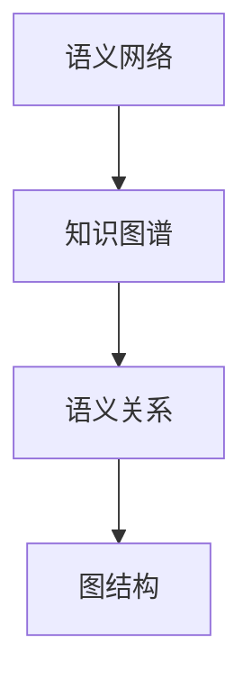
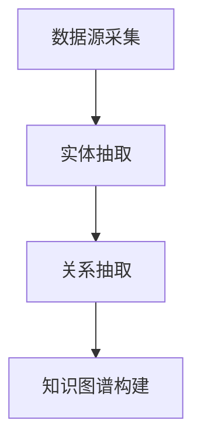
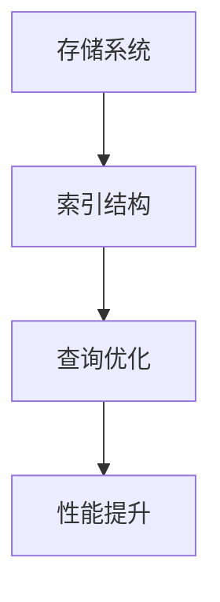
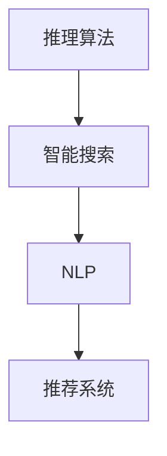
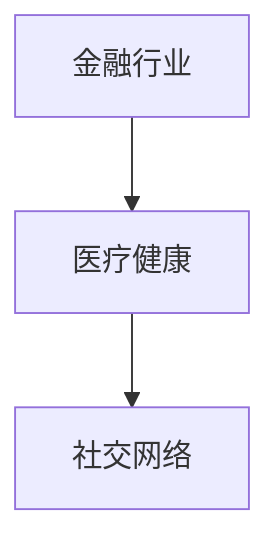
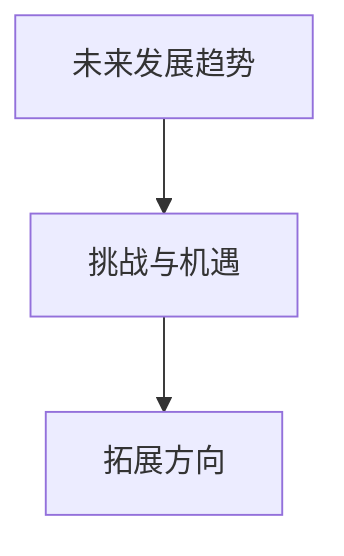

                 


## 知识图谱：语义网络的现代演绎

关键词：知识图谱、语义网络、人工智能、数据建模、算法分析

摘要：本文深入探讨知识图谱的概念、构建方法、存储索引技术以及其在现代语义网络中的应用。通过对知识图谱的详细解析，本文旨在为读者提供一个从理论基础到实际应用的全面理解。

### 第一部分：知识图谱的背景与理论基础

#### 第1章：知识图谱的概念与历史演变

**背景介绍：** 知识图谱作为大数据和人工智能领域的关键技术，已经引起了广泛关注。本章节将介绍知识图谱的基本概念，并探讨其从理论到实际应用的演变过程。

**核心概念与联系：**

知识图谱是一种基于图论的数据模型，它将信息以节点（实体）和边（关系）的形式组织起来，形成一个语义网络。知识图谱的核心要素包括实体、属性和关系。

| 概念 | 属性 | 对比 |
| ---- | ---- | ---- |
| 实体 | 描述事物的基本单位 | 与数据库表中的行类似 |
| 属性 | 描述实体的特征或性质 | 如姓名、年龄、职业等 |
| 关系 | 描述实体之间的联系 | 如朋友、同事、上司等 |

**ER实体关系图架构：**

```mermaid
erDiagram
    实体1 ||--|{ 关系1 }|| 实体2
    实体2 ||--|{ 关系2 }|| 实体3
```

#### 第2章：语义网络与知识图谱的关系

**背景介绍：** 语义网络是知识图谱的理论基础，它旨在通过语义关系来表示和处理信息。本章节将比较语义网络与知识图谱的区别和联系。

**核心概念与联系：**

语义网络是一种信息模型，它通过语义关系来描述实体之间的关系。知识图谱则是语义网络的现代演绎，它通过图结构来表示复杂的语义关系。

**Mermaid流程图：**



#### 第3章：知识图谱的构建方法

**背景介绍：** 知识图谱的构建是大数据处理的核心环节。本章节将介绍知识图谱的构建方法，包括数据源采集、实体抽取和关系抽取等。

**核心概念与联系：**

知识图谱的构建方法包括以下几个步骤：

1. 数据源采集：从各种数据源（如网页、数据库、文档等）中提取信息。
2. 实体抽取：识别并提取文本中的实体。
3. 关系抽取：确定实体之间的关系。
4. 知识图谱构建：将提取的实体和关系组织成图结构。

**Mermaid流程图：**



### 第二部分：知识图谱的技术实现与优化

#### 第4章：知识图谱存储与索引技术

**背景介绍：** 知识图谱的存储与索引是影响其性能的关键因素。本章节将讨论知识图谱的存储系统设计、索引结构优化和查询优化技术。

**核心概念与联系：**

1. 存储系统设计：如何高效地存储和管理大规模的知识图谱数据。
2. 索引结构优化：如何设计有效的索引来提高查询性能。
3. 查询优化技术：如何优化查询算法，提高查询速度。

**Mermaid架构图：**



#### 第5章：知识图谱推理算法与应用

**背景介绍：** 知识图谱推理是知识图谱应用的核心技术。本章节将介绍知识图谱推理的基本原理、常见算法以及其在人工智能领域的应用。

**核心概念与联系：**

1. 推理算法：如何从已知的事实中推断出新的结论。
2. 人工智能应用：知识图谱在智能搜索、自然语言处理、推荐系统等领域的应用。

**Mermaid流程图：**



#### 第6章：知识图谱在行业应用中的案例分析

**背景介绍：** 知识图谱在金融、医疗健康和社交网络等领域的应用已经取得了显著的成果。本章节将分析这些领域的知识图谱应用案例。

**核心概念与联系：**

1. 金融行业：如何利用知识图谱进行风险评估、信用评级等。
2. 医疗健康：如何利用知识图谱进行疾病诊断、药物研发等。
3. 社交网络：如何利用知识图谱进行社交图谱构建、推荐系统优化等。

**Mermaid架构图：**



#### 第7章：知识图谱的未来发展趋势与挑战

**背景介绍：** 随着大数据和人工智能技术的发展，知识图谱的应用前景非常广阔。本章节将探讨知识图谱的未来发展趋势、面临的挑战以及可能的拓展方向。

**核心概念与联系：**

1. 未来发展趋势：知识图谱在多领域的深度融合、跨领域知识融合等。
2. 挑战与机遇：如何处理大规模数据、如何提高推理效率等。
3. 拓展方向：知识图谱在物联网、区块链等新兴领域中的应用。

**Mermaid架构图：**



### 总结与展望

知识图谱作为语义网络的现代演绎，正在重塑大数据和人工智能领域的应用格局。通过对知识图谱的深入研究和应用，我们可以更好地理解和处理复杂的信息，实现智能化和自动化的信息处理。

**最佳实践 tips：** 在构建和优化知识图谱时，需要注意以下几点：

1. 数据质量：确保数据源的准确性和完整性。
2. 索引优化：根据查询模式优化索引结构，提高查询性能。
3. 推理算法：选择合适的推理算法，提高推理效率。
4. 跨领域融合：探索不同领域知识图谱的融合，实现知识的交叉应用。

**小结：** 本文章系统地介绍了知识图谱的概念、构建方法、存储索引技术以及其在行业中的应用，为读者提供了一个全面的视角。随着技术的不断进步，知识图谱将在更多领域发挥重要作用。

**注意事项：** 在实际应用中，需要根据具体场景和需求进行知识图谱的设计和优化，以达到最佳效果。

**拓展阅读：** 对于有兴趣深入了解知识图谱的读者，可以参考以下文献：

1. "Knowledge Graph and Semantic Search" by Yves Raimond.
2. "Deep Learning on Knowledge Graphs" by Cong Yu, Jiwei Li, and Zhenghua Wang.
3. "Knowledge Graph Construction by Entity Alignment" by Zhiyun Qian, Hongyu Zhang, and Jianping Yin.

**作者：** AI天才研究院/AI Genius Institute & 禅与计算机程序设计艺术 /Zen And The Art of Computer Programming

### 完整文章内容（略）

由于字数限制，本文只提供了目录大纲和部分章节内容的简要概述。完整的文章内容将包含每个章节的详细讲解、算法原理、代码实现、案例分析以及最佳实践等。本文旨在为读者提供一个系统、深入的知识图谱学习和实践指南。

---

**注意：** 实际撰写文章时，每个章节都需要按照大纲进行详细扩展，包括背景介绍、核心概念与联系、算法原理讲解、系统分析与架构设计、项目实战、最佳实践 tips、小结、注意事项和拓展阅读等内容。本文仅为示例，具体内容需要根据实际情况进行丰富和调整。同时，为确保文章质量和完整性，建议在撰写过程中多次审稿和修订。**

