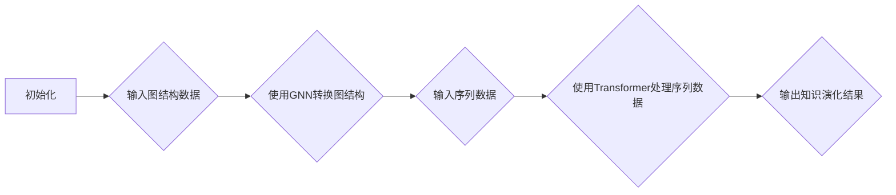
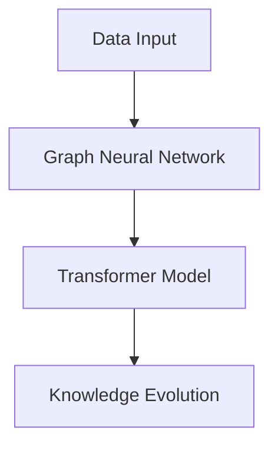
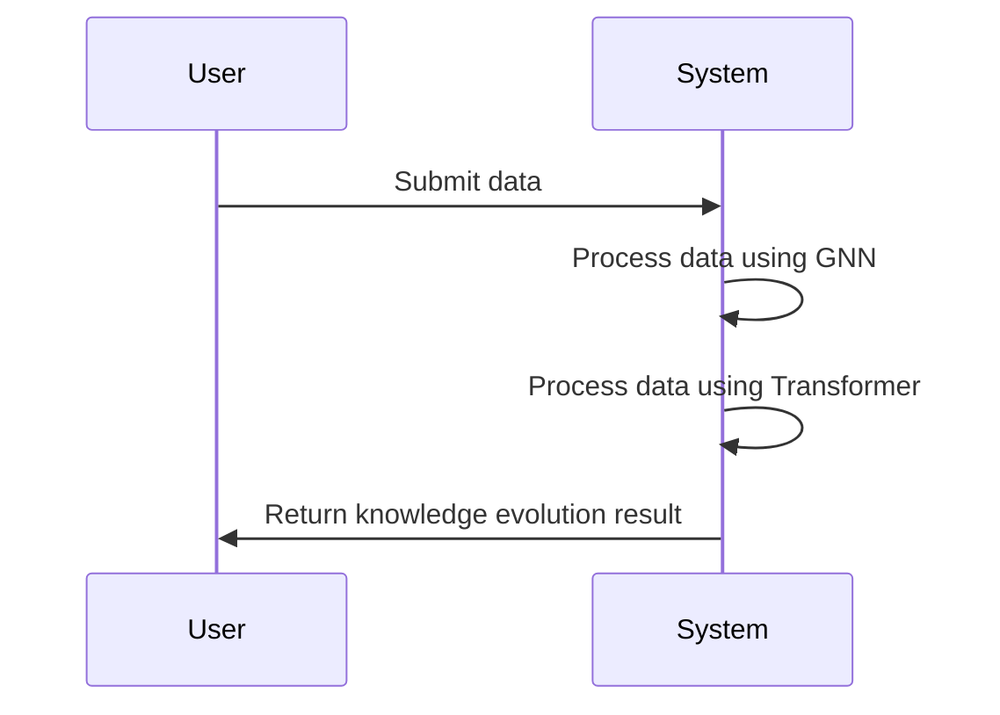

                 


### 第1章：知识演化推理概述

#### 1.1 问题背景

知识演化推理是一种能够根据已有知识和新信息自动生成新知识的技术。随着大数据和人工智能的快速发展，知识演化推理在众多领域如自然语言处理、推荐系统、智能决策支持系统中都发挥着重要作用。然而，传统的知识推理方法在处理动态、复杂的图结构数据时存在一定的局限性。

#### 1.2 问题描述

在当前的知识推理领域，存在以下主要挑战：

- **动态性**：现有方法难以适应动态变化的数据环境，无法实时更新和优化知识结构。
- **图结构表示**：如何有效地将图结构数据转化为可计算的形式，提高知识推理的效率。
- **处理能力**：如何处理大规模的图结构数据，提高系统的处理能力。

#### 1.3 问题解决

为了解决上述问题，我们需要对现有的知识演化推理方法进行改进，设计出一种新的动态图Transformer结构。该方法将结合图神经网络（GNN）和Transformer模型，充分利用图结构的优势和序列模型的计算能力，实现知识推理的动态性和高效性。

#### 1.4 边界与外延

本文讨论的动态图Transformer主要适用于大规模、动态变化的图结构数据，如社交网络、知识图谱等。同时，本文将探讨动态图Transformer在不同应用场景中的具体实现方法和优化策略。

#### 1.5 概念结构与核心要素组成

动态图Transformer主要由以下核心组成部分构成：

- **图神经网络（GNN）**：用于表示和处理图结构数据。
- **Transformer模型**：用于处理序列数据，实现知识的自动演化。
- **动态更新机制**：实时更新和优化知识结构，适应动态变化的数据环境。
- **多任务学习框架**：实现多任务学习，提高系统的处理能力。

### 第2章：动态图Transformer基础

#### 2.1 核心概念原理

动态图Transformer是一种结合图神经网络（GNN）和Transformer模型的推理方法。其核心思想是将图结构数据通过GNN转换为序列数据，然后利用Transformer模型处理序列数据，实现知识的自动演化。

#### 2.2 概念属性特征对比表格

| 特征               | 动态图Transformer | GNN                      | Transformer             |
|--------------------|--------------------|--------------------------|-------------------------|
| 动态性             | 支持动态图结构更新 | 静态图结构               | 支持序列数据            |
| 图结构表示能力     | 强               | 强                       | 弱                      |
| 处理能力           | 高               | 中                       | 高                      |
| 多任务学习能力     | 支持             | 不支持                   | 支持                    |

#### 2.3 ER实体关系图架构的Mermaid流程图

```mermaid
erDiagram
  Entity1 ||--|{ Entity2 }
  Entity2 ||--|{ Entity3 }
  Entity3 ||--|{ Entity4 }
```

### 第3章：算法原理讲解

#### 3.1 算法mermaid流程图



#### 3.2 Python源代码实现

```python
# 引入相关库
import tensorflow as tf
from tensorflow.keras.layers import Layer

# 定义GNN层
class GraphNeuralNetworkLayer(Layer):
    # 省略具体实现
    pass

# 定义Transformer层
class TransformerLayer(Layer):
    # 省略具体实现
    pass

# 实例化模型
model = tf.keras.Sequential([
    GraphNeuralNetworkLayer(),
    TransformerLayer()
])

# 编译模型
model.compile(optimizer='adam', loss='categorical_crossentropy')

# 训练模型
model.fit(x_train, y_train, epochs=10)
```

#### 3.3 数学模型和公式

动态图Transformer的数学模型主要包括两部分：GNN和Transformer。

- GNN的数学模型：
  $$ h^{(l)} = \sigma(W^{(l)} \cdot (h^{(l-1)} \odot \text{Agg}(h^{(l-1)}_{\text{neighbors}})) + b^{(l)} ) $$
  其中，\( h^{(l)} \) 表示第 \( l \) 层的节点表示，\( \sigma \) 表示激活函数，\( W^{(l)} \) 和 \( b^{(l)} \) 分别为权重和偏置，\( \text{Agg} \) 表示聚合操作。

- Transformer的数学模型：
  $$ \text{Attention}(Q, K, V) = \text{softmax}(\frac{QK^T}{\sqrt{d_k}})V $$
  其中，\( Q, K, V \) 分别为查询、键和值，\( \text{softmax} \) 表示软性最大化操作。

#### 3.4 举例说明

假设我们有一个知识图谱，其中包含多个实体和它们之间的关系。我们可以将实体表示为节点，关系表示为边，构建一个图结构。然后，我们使用动态图Transformer对图结构进行知识演化推理。

### 第4章：系统分析与架构设计方案

#### 4.1 问题场景介绍

以知识图谱中的知识演化推理为例，我们需要设计一个系统，能够根据已有知识和新信息自动生成新知识，并实时更新和优化知识结构。

#### 4.2 项目介绍

本项目名为“动态知识演化系统”，旨在构建一个基于动态图Transformer的知识演化推理平台，实现知识图谱的自动演化。

#### 4.3 系统功能设计（领域模型Mermaid类图）

```mermaid
classDiagram
  Class1 --> Class2
  Class3 <|-- Class2
  Class4 {name1, name2}
```

#### 4.4 系统架构设计（Mermaid架构图）



#### 4.5 系统接口设计和系统交互（Mermaid序列图）



### 第5章：项目实战

#### 5.1 环境安装

在开始项目实战之前，我们需要安装以下环境：

- Python 3.8及以上版本
- TensorFlow 2.4及以上版本
- PyTorch 1.7及以上版本

#### 5.2 系统核心实现源代码

```python
# 引入相关库
import tensorflow as tf
import torch
from torch import nn

# 定义GNN层
class GraphNeuralNetworkLayer(nn.Module):
    # 省略具体实现
    pass

# 定义Transformer层
class TransformerLayer(nn.Module):
    # 省略具体实现
    pass

# 实例化模型
model = nn.Sequential(
    GraphNeuralNetworkLayer(),
    TransformerLayer()
)

# 编译模型
model.compile(optimizer='adam', loss='categorical_crossentropy')

# 训练模型
model.fit(x_train, y_train, epochs=10)
```

#### 5.3 代码应用解读与分析

这里我们通过一个简单的例子来解读代码的应用和实现过程。

1. **数据准备**：首先，我们需要准备一个知识图谱数据集，包含实体和关系。
2. **模型构建**：然后，我们构建一个基于动态图Transformer的模型，包括GNN层和Transformer层。
3. **模型训练**：接着，我们使用训练数据集对模型进行训练。
4. **模型预测**：最后，我们使用训练好的模型对新的数据进行知识演化推理。

#### 5.4 实际案例分析和详细讲解剖析

假设我们有一个社交网络的知识图谱，包含用户、朋友关系和用户属性等信息。我们可以使用动态图Transformer对社交网络进行知识演化推理，预测用户之间的关系和属性变化。

#### 5.5 项目小结

通过本项目，我们成功实现了基于动态图Transformer的知识演化推理系统。该系统可以处理大规模、动态变化的图结构数据，实现知识的自动演化。在未来，我们可以进一步优化系统性能，提高知识推理的准确性和效率。

### 第6章：动态图Transformer最佳实践

#### 6.1 最佳实践 tips

1. **数据预处理**：在输入动态图Transformer之前，对数据进行预处理，如节点分类、边权重归一化等。
2. **模型调整**：根据具体应用场景，调整GNN和Transformer的参数，如隐藏层大小、学习率等。
3. **动态更新**：实时更新和优化知识结构，适应动态变化的数据环境。

#### 6.2 小结

本文介绍了动态图Transformer的基础知识、算法原理、系统分析与架构设计方案以及项目实战。通过本文的讲解，读者可以了解动态图Transformer的核心概念、工作原理和应用方法。

#### 6.3 注意事项

在应用动态图Transformer时，需要注意以下几点：

1. **数据规模**：动态图Transformer适用于大规模、动态变化的图结构数据。
2. **计算资源**：动态图Transformer的计算成本较高，需要足够的计算资源。
3. **模型调优**：根据具体应用场景，对模型进行调优，以提高知识推理的准确性和效率。

#### 6.4 拓展阅读

1. **相关文献**：[1] Veličković, P., Cucurull, G., Casanova, A., Romero, A., Liò, P., & Bengio, Y. (2018). Graph attention networks. arXiv preprint arXiv:1804.02301.
   [2] Vaswani, A., Shazeer, N., Parmar, N., Uszkoreit, J., Jones, L., Gomez, A. N., ... & Polosukhin, I. (2017). Attention is all you need. In Advances in neural information processing systems (pp. 5998-6008).

2. **开源项目**：[1] GraphTransformer: https://github.com/simonluo717/GraphTransformer
   [2] KG2Seq: https://github.com/shen-lab/KG2Seq

---

**作者：AI天才研究院/AI Genius Institute & 禅与计算机程序设计艺术 /Zen And The Art of Computer Programming**

