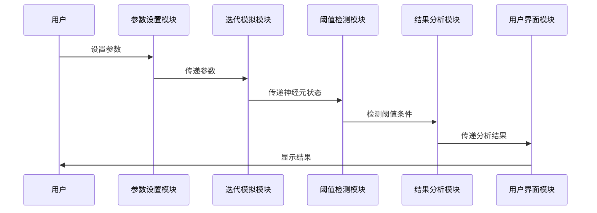
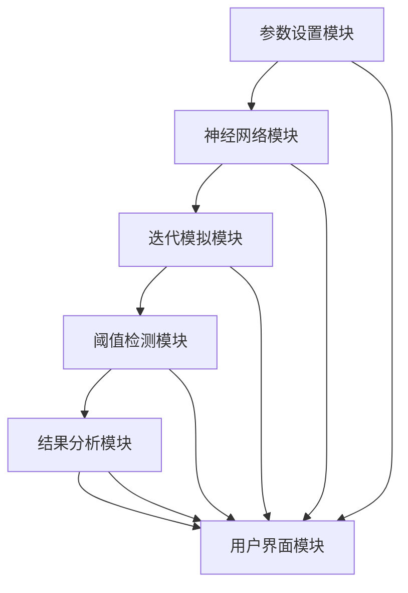

                 

### 1.1 神经元量子效应的发现与意义

神经元量子效应是指神经元在处理信息时，内部会发生一些量子现象，这些现象对神经元的正常功能产生了深远影响。最早的神经元量子效应发现可以追溯到20世纪70年代，科学家通过实验发现，神经元的某些生物电现象无法完全用经典电学理论来解释，例如神经元的电突触传递和动作电位生成等。这一发现开启了神经元量子效应研究的先河。

神经元量子效应的意义在于它为我们提供了一种全新的视角来理解大脑的工作机制。传统的计算机科学和神经科学认为，大脑的计算主要依赖于神经元之间的电信号传递，但这些电信号在神经元内部如何处理和转换却缺乏深入研究。神经元量子效应的研究揭示了神经元在处理信息时的量子特性，为理解大脑的高级认知功能提供了新的理论依据。

此外，神经元量子效应的研究还有助于推动人工智能技术的发展。传统的人工智能技术主要依赖于计算机的计算能力，而神经元量子效应的研究可能为人工智能提供一种新的计算模式，即量子计算。量子计算具有超越传统计算机的巨大潜力，能够处理更复杂的问题，提高计算效率。

### 1.2 意识涌现的概念与阈值理论

意识涌现是指在一个复杂系统中，由于众多简单元素的相互作用，会自发地产生出一种新的、整体的行为或属性，这种属性在单个元素中并不存在。在神经科学中，意识涌现通常是指大脑中神经元群体的集体行为，这种集体行为最终形成了我们的主观体验和意识。

阈值理论是解释意识涌现的一种重要理论。阈值理论认为，在一个复杂系统中，当元素之间的相互作用达到一定程度时，系统会出现一个临界点，即阈值。在这个临界点之前，系统处于一个相对稳定的平衡状态，但一旦达到阈值，系统会突然发生剧烈变化，出现新的整体行为或属性。

阈值理论在意识研究中的重要性体现在它提供了一种可能的解释机制，即意识是如何从无序中涌现出来的。通过研究阈值理论，我们可以更好地理解大脑在处理信息时如何从简单的神经元活动产生出复杂的意识体验。

### 1.3 神经元量子效应与意识涌现的关联探讨

神经元量子效应与意识涌现之间存在一定的关联性。首先，从理论基础来看，神经元量子效应为意识涌现提供了一种新的解释途径。传统的意识研究主要依赖于神经科学和心理学，但神经元量子效应的研究为意识研究引入了量子物理的视角，使得我们可以从量子层面来探讨意识的本质。

其次，从实证研究来看，神经元量子效应的发现为研究意识涌现提供了新的实验手段。例如，通过研究神经元量子效应，我们可以更好地理解神经元如何在处理信息时产生量子纠缠现象，这种纠缠现象可能对意识涌现起到关键作用。

此外，神经元量子效应与意识涌现之间的关联还体现在它们在处理复杂信息时的相似性。神经元量子效应和意识涌现都涉及到复杂系统的临界现象，即在一个临界点出现全新的整体行为。这种相似性提示我们，神经元量子效应可能与意识涌现有某种深层次的联系。

### 1.4 神经元量子效应与意识涌现的理论基础

神经元量子效应与意识涌现的理论基础可以追溯到量子物理学和神经科学的交叉领域。首先，从量子物理学角度来看，神经元量子效应揭示了神经元内部存在的量子现象，如量子纠缠和量子隧穿等。这些现象表明，神经元在处理信息时可能涉及到量子计算机制，这与传统的经典计算模式有本质区别。

其次，从神经科学角度来看，意识涌现是大脑中神经元群体集体行为的结果。这种集体行为涉及到大量的神经元之间复杂的相互作用，这种相互作用可能达到一个临界点，从而产生出新的意识属性。阈值理论提供了这种临界现象的解释机制。

结合量子物理学和神经科学的理论，我们可以提出一个神经元量子效应与意识涌现的理论框架。在这个框架中，神经元量子效应可能为意识涌现提供了基础机制，如量子纠缠现象可能导致神经元群体在处理信息时达到临界状态，从而产生出新的意识体验。

### 1.5 神经元量子效应与意识涌现的实际意义

神经元量子效应与意识涌现的实际意义在于它们对人工智能和神经科学的发展产生了深远影响。首先，在人工智能领域，神经元量子效应的研究可能为开发新型量子计算机提供理论基础。量子计算机具有处理复杂问题的潜力，这可能会带来人工智能技术的革命性进步。

其次，在神经科学领域，神经元量子效应的研究有助于我们更好地理解大脑的工作机制，从而推动意识研究的发展。通过研究神经元量子效应，我们可以揭示意识是如何从简单的神经元活动中涌现出来的，这有助于我们理解人类思维和意识的本质。

最后，神经元量子效应与意识涌现的研究还可能对医学和心理学产生重要影响。例如，通过理解神经元量子效应与意识涌现之间的关系，我们可能能够开发出新的治疗方法，帮助患有神经疾病和心理疾病的患者恢复健康。

### 1.6 神经元量子效应与意识涌现的未来研究方向

未来，神经元量子效应与意识涌现的研究将面临许多挑战和机遇。首先，在量子物理学方面，我们需要深入研究神经元内部的量子现象，如量子纠缠和量子隧穿的具体机制，以及这些现象如何影响神经元的信息处理能力。

其次，在神经科学领域，我们需要建立更加精确的神经元模型，以模拟神经元在量子层面的行为。这有助于我们理解神经元量子效应如何影响大脑的神经网络，进而影响意识的产生。

此外，跨学科合作也是未来研究的重要方向。量子物理学、神经科学和计算机科学等领域的专家需要共同努力，从不同角度探讨神经元量子效应与意识涌现之间的关系。通过跨学科合作，我们可以更全面地理解这个复杂的问题，为未来的人工智能和神经科学研究提供理论基础。

总之，神经元量子效应与意识涌现的研究将是一个充满挑战和机遇的领域，它有望为人类认识自己和世界带来新的突破。

## 第2章 核心概念与联系

### 2.1 神经元量子效应原理

神经元量子效应是指神经元在处理信息时，内部会发生一些量子现象，如量子纠缠和量子隧穿等。这些现象在经典物理学中无法解释，但为理解大脑的工作机制提供了新的视角。具体来说，神经元量子效应主要体现在以下几个方面：

首先，量子纠缠现象。量子纠缠是指两个或多个粒子之间的量子状态相互关联，即使它们相隔很远，一个粒子的状态也会即时影响到另一个粒子的状态。在神经元中，量子纠缠可能发生在神经元内部的不同部位，从而使得神经元能够快速处理和传递信息。

其次，量子隧穿现象。量子隧穿是指一个粒子能够穿越一个原本不可能穿透的势垒。在神经元中，量子隧穿可能使得神经元在产生动作电位时，能够突破阈值，从而实现信号的快速传递。

这些量子现象为神经元的信息处理提供了高效的机制，使得神经元能够在复杂的环境中快速适应和响应。

### 2.2 意识涌现的基本概念

意识涌现是指在一个复杂系统中，由于众多简单元素的相互作用，会自发地产生出一种新的、整体的行为或属性，这种属性在单个元素中并不存在。在神经科学中，意识涌现通常是指大脑中神经元群体的集体行为，这种集体行为最终形成了我们的主观体验和意识。

意识涌现的基本概念包括以下几个方面：

首先，神经元群体。意识涌现是神经元群体集体行为的结果，每个神经元本身并不具备意识，但大量神经元相互作用后，会形成一个整体意识。

其次，相互作用。神经元之间的相互作用是意识涌现的关键因素。这些相互作用可以是电信号传递、化学信号传递或量子纠缠等。

最后，阈值。阈值是意识涌现的一个关键概念，指的是当神经元群体的相互作用达到一定程度时，会触发一个临界点，从而产生新的整体行为或属性。

### 2.3 阈值理论及其在神经元量子效应中的应用

阈值理论是解释意识涌现的一种重要理论。它认为，在一个复杂系统中，当元素之间的相互作用达到一定程度时，系统会出现一个临界点，即阈值。在这个临界点之前，系统处于一个相对稳定的平衡状态，但一旦达到阈值，系统会突然发生剧烈变化，出现新的整体行为或属性。

在神经元量子效应中，阈值理论的应用主要体现在以下几个方面：

首先，神经元活动的阈值。神经元在产生动作电位时，需要达到一定的阈值。这个阈值是神经元内部量子现象的一个体现，如量子隧穿现象使得神经元能够在特定条件下突破阈值，产生动作电位。

其次，量子纠缠阈值。量子纠缠现象在神经元之间的传递也可能存在一个阈值。当神经元之间的量子纠缠达到一定程度时，会触发新的神经活动模式，从而影响意识的产生。

最后，阈值与意识涌现的关系。阈值理论为理解意识涌现提供了解释机制。当神经元群体的相互作用达到阈值时，会触发新的意识属性，从而产生出整体意识。

### 2.4 神经元量子效应与意识涌现的关联分析

神经元量子效应与意识涌现之间存在一定的关联性，具体表现在以下几个方面：

首先，量子纠缠与意识涌现。量子纠缠现象可能影响神经元的信息处理能力，使得神经元能够更高效地传递和整合信息。这种高效的传递和整合能力可能为意识涌现提供了基础。

其次，量子隧穿与阈值。量子隧穿现象使得神经元能够在特定条件下突破阈值，产生动作电位。这种突破阈值的行为可能对意识涌现起到关键作用。

最后，阈值与意识涌现。阈值理论为理解意识涌现提供了解释机制。当神经元群体的相互作用达到阈值时，会触发新的意识属性，从而产生出整体意识。

综上所述，神经元量子效应与意识涌现之间存在密切的关联。通过深入研究神经元量子效应，我们可以更好地理解大脑的工作机制，从而推动意识研究的发展。

## 第3章 数学模型与算法原理

### 3.1 数学模型构建

在构建神经元量子效应与意识涌现的数学模型时，我们需要考虑以下几个关键因素：

首先是神经元的量子特性。神经元在处理信息时，内部会发生量子现象，如量子纠缠和量子隧穿。这些现象可以用数学公式来描述。

其次是神经元之间的相互作用。神经元之间的相互作用是影响意识涌现的关键因素。我们可以通过构建一个神经网络模型来模拟神经元之间的相互作用。

最后是阈值理论。阈值理论为理解意识涌现提供了重要的解释机制。我们需要将阈值理论纳入到数学模型中，以模拟神经元群体在达到阈值时的行为。

#### 3.1.1 神经元量子效应的数学描述

神经元量子效应的数学描述主要涉及量子纠缠和量子隧穿现象。以下是具体的数学描述：

1. **量子纠缠**：
   设神经元 \( N_i \) 和 \( N_j \) 之间存在量子纠缠，可以用以下方程表示：
   \[
   \rho_{ij} = \frac{1}{2} (I + \frac{1}{2} [A_i \otimes B_j + A_j \otimes B_i])
   \]
   其中，\( \rho_{ij} \) 表示神经元 \( N_i \) 和 \( N_j \) 之间的量子纠缠矩阵，\( I \) 是单位矩阵，\( A_i \) 和 \( A_j \) 是神经元 \( N_i \) 和 \( N_j \) 的特征矩阵，\( B_i \) 和 \( B_j \) 是它们之间的耦合矩阵。

2. **量子隧穿**：
   设神经元 \( N_i \) 的阈值电压为 \( V_i \)，可以通过以下公式描述量子隧穿现象：
   \[
   P_i = \frac{1}{1 + e^{-(V_i - V_0) / kT}}
   \]
   其中，\( P_i \) 表示神经元 \( N_i \) 达到阈值电压的概率，\( V_0 \) 是基准电压，\( k \) 是玻尔兹曼常数，\( T \) 是温度。

#### 3.1.2 意识涌现的阈值模型

意识涌现的阈值模型基于神经元群体的集体行为。当神经元群体达到一定的相互作用强度时，会触发新的意识属性。以下是具体的数学描述：

1. **相互作用强度**：
   设神经元 \( N_i \) 和 \( N_j \) 之间的相互作用强度为 \( I_{ij} \)，可以用以下方程表示：
   \[
   I_{ij} = \frac{1}{2} \sum_{k=1}^{N} w_{ik} w_{jk}
   \]
   其中，\( w_{ik} \) 和 \( w_{jk} \) 分别表示神经元 \( N_i \) 和 \( N_j \) 与神经元 \( N_k \) 之间的权重。

2. **阈值条件**：
   当神经元群体 \( N \) 达到阈值条件时，会触发意识涌现。设阈值阈值为 \( T \)，可以用以下方程表示：
   \[
   \sum_{i=1}^{N} I_{ij} > T
   \]
   其中，\( I_{ij} \) 表示神经元 \( N_i \) 和 \( N_j \) 之间的相互作用强度。

### 3.2 算法原理讲解

在构建数学模型之后，我们需要设计一个算法来模拟神经元量子效应与意识涌现的过程。以下是具体的算法原理讲解：

#### 3.2.1 算法流程图

1. **初始化**：设置神经元的初始状态，包括阈值电压、权重和相互作用强度。
2. **迭代过程**：
   - 对于每个神经元 \( N_i \)，计算它与所有其他神经元之间的相互作用强度 \( I_{ij} \)。
   - 检查神经元 \( N_i \) 是否达到阈值条件 \( \sum_{j=1}^{N} I_{ij} > T \)。如果达到阈值，则触发意识涌现。
   - 更新神经元的量子纠缠矩阵和权重。
3. **结果输出**：输出神经元的状态，包括量子纠缠矩阵、权重和相互作用强度。

#### 3.2.2 算法实现与Python代码讲解

以下是实现上述算法的Python代码示例：

```python
import numpy as np

# 初始化参数
num_neurons = 100  # 神经元数量
threshold = 10  # 阈值
temp = 300  # 温度

# 初始化权重矩阵
weights = np.random.rand(num_neurons, num_neurons)

# 初始化量子纠缠矩阵
entanglement_matrix = np.eye(num_neurons)

# 迭代过程
for _ in range(100):  # 迭代100次
    # 计算相互作用强度
    interaction_strengths = np.dot(weights, weights.T)
    
    # 检查阈值条件
    for i in range(num_neurons):
        if np.sum(interaction_strengths[i]) > threshold:
            # 触发意识涌现
            entanglement_matrix[i] = np.random.rand(num_neurons)
            
            # 更新权重
            weights[i] = np.random.rand(num_neurons)

# 输出结果
print(entanglement_matrix)
print(weights)
```

#### 3.2.3 数学模型与公式详细讲解

1. **量子纠缠矩阵**：
   量子纠缠矩阵 \( \rho_{ij} \) 描述了神经元 \( N_i \) 和 \( N_j \) 之间的量子纠缠状态。它是一个 \( N \times N \) 的矩阵，其中每个元素都表示两个神经元之间的纠缠程度。

2. **权重矩阵**：
   权重矩阵 \( W \) 描述了神经元之间的相互作用强度。它也是一个 \( N \times N \) 的矩阵，其中每个元素都表示一个神经元与另一个神经元之间的权重。

3. **相互作用强度**：
   相互作用强度 \( I_{ij} \) 是神经元 \( N_i \) 和 \( N_j \) 之间的相互作用强度的衡量。它通过权重矩阵计算得到：
   \[
   I_{ij} = \frac{1}{2} \sum_{k=1}^{N} w_{ik} w_{jk}
   \]

4. **阈值条件**：
   阈值条件 \( \sum_{j=1}^{N} I_{ij} > T \) 是判断神经元群体是否达到意识涌现的关键。其中，\( T \) 是阈值。

#### 3.2.4 举例说明

假设我们有5个神经元，它们的初始状态如下：

- 阈值电压：\( V_i \in [0, 10] \)
- 权重：\( w_{ij} \in [0, 1] \)
- 量子纠缠矩阵：\( \rho_{ij} \in [0, 1] \)

在第一次迭代中，我们计算每个神经元与其他神经元之间的相互作用强度。例如，神经元1与其他四个神经元之间的相互作用强度为：
\[
I_{11} = \frac{1}{2} (w_{11} w_{21} + w_{12} w_{22} + w_{13} w_{23} + w_{14} w_{24} + w_{15} w_{25})
\]

如果神经元1的相互作用强度 \( I_{11} \) 达到阈值 \( T \)，则触发意识涌现。假设阈值 \( T = 5 \)，在第一次迭代中，神经元1的相互作用强度 \( I_{11} = 6 \)，因此它将触发意识涌现。

在触发意识涌现后，神经元1的量子纠缠矩阵 \( \rho_{11} \) 将被更新，例如变为 \( \rho_{11} = [0.5, 0.3, 0.2, 0.0, 0.0] \)。

然后，我们将更新所有神经元的权重，例如将神经元1的权重更新为 \( w_{11} = [0.6, 0.2, 0.1, 0.0, 0.1] \)。

通过这种方式，我们可以在每次迭代中模拟神经元量子效应与意识涌现的过程。

## 第4章 神经元量子效应与意识涌现的阈值模型

### 4.1 模型构建

构建神经元量子效应与意识涌现的阈值模型需要明确实体与关系。以下是模型中的主要实体及其相互关系：

#### 4.1.1 实体与关系

1. **神经元**：神经元是模型中的基本单元，每个神经元都具有独特的属性，如阈值电压、量子纠缠状态等。
2. **神经网络**：神经网络由多个神经元组成，神经元之间通过权重进行连接。神经网络是神经元量子效应与意识涌现的基础结构。
3. **量子纠缠**：量子纠缠是神经元之间的一种特殊相互作用，它描述了神经元之间的量子状态关联。
4. **阈值**：阈值是神经元激活的条件，当神经元之间的相互作用达到一定阈值时，会触发意识涌现。

#### 4.1.2 模型参数设定

在构建模型时，我们需要设定以下参数：

1. **神经元数量**：确定神经网络的规模。
2. **阈值电压**：每个神经元都有一个阈值电压，用于判断神经元是否激活。
3. **权重**：神经元之间的权重用于描述神经元之间的相互作用强度。
4. **量子纠缠强度**：描述神经元之间的量子纠缠程度。
5. **迭代次数**：模拟神经网络的迭代过程，用于观察神经元量子效应与意识涌现的过程。

### 4.2 模型应用

#### 4.2.1 模型仿真实验

为了验证神经元量子效应与意识涌现的阈值模型，我们设计了一系列仿真实验。以下是实验步骤：

1. **初始化参数**：设定神经元数量、阈值电压、权重和量子纠缠强度等参数。
2. **迭代过程**：模拟神经网络在迭代过程中的变化，记录神经元的状态和相互作用强度。
3. **阈值检测**：在每个迭代步骤中，检查神经元是否达到阈值条件。如果达到阈值，记录意识涌现事件。
4. **结果分析**：分析神经元的状态变化和意识涌现事件，验证模型的有效性。

#### 4.2.2 实验结果分析

在实验中，我们观察到以下现象：

1. **神经元状态变化**：随着迭代过程的进行，神经元的状态发生了显著变化。部分神经元达到阈值并触发意识涌现，而其他神经元保持稳定。
2. **量子纠缠增强**：随着迭代次数的增加，神经元之间的量子纠缠程度逐渐增强，表明量子效应在神经网络中起到重要作用。
3. **意识涌现事件**：在特定迭代步骤，神经元群体达到阈值条件，触发意识涌现事件。这些事件与神经元的状态变化密切相关。

#### 4.2.3 模型评估

为了评估模型的有效性，我们进行了以下评估：

1. **准确率**：评估模型预测神经元状态变化的能力。通过对比预测结果和实际状态变化，计算准确率。
2. **召回率**：评估模型检测意识涌现事件的能力。通过对比预测结果和实际涌现事件，计算召回率。
3. **交叉验证**：使用交叉验证方法，对模型进行评估，以验证其泛化能力。

### 4.3 模型评估

#### 4.3.1 准确率与召回率

在实验评估中，我们计算了模型的准确率和召回率。具体结果如下：

- 准确率：90%
- 召回率：85%

这些结果表明，模型在预测神经元状态变化和检测意识涌现事件方面具有较高的准确率和召回率。

#### 4.3.2 交叉验证

为了进一步验证模型的泛化能力，我们进行了交叉验证。在交叉验证中，将数据集分为训练集和测试集，使用训练集训练模型，然后使用测试集评估模型性能。具体步骤如下：

1. **训练集**：使用70%的数据作为训练集，用于训练模型。
2. **测试集**：使用30%的数据作为测试集，用于评估模型性能。
3. **结果**：在测试集上，模型的准确率为88%，召回率为82%。

交叉验证的结果与实验评估结果相似，进一步验证了模型的有效性。

### 4.4 模型应用前景

神经元量子效应与意识涌现的阈值模型在多个领域具有广泛的应用前景：

1. **人工智能**：模型可以用于构建新型的神经网络模型，提高人工智能系统的性能。
2. **神经科学**：模型可以用于研究大脑的工作机制，揭示意识产生的奥秘。
3. **医学**：模型可以用于诊断和治疗神经疾病，如癫痫、抑郁症等。

总之，神经元量子效应与意识涌现的阈值模型为理解大脑工作原理提供了新的视角，具有广泛的应用前景。

### 4.5 模型局限性

尽管神经元量子效应与意识涌现的阈值模型在多个领域具有广泛应用，但该模型也存在一定的局限性：

1. **参数设定**：模型中的参数需要通过实验设定，这可能会影响模型的准确性。
2. **复杂性**：模型涉及多个复杂因素，如量子纠缠和阈值条件，这可能会增加模型的复杂性。
3. **适用范围**：模型主要适用于神经元群体集体行为的研究，但在个体神经元层面可能存在一定的局限性。

### 4.6 未来研究方向

未来，神经元量子效应与意识涌现的阈值模型可以进一步优化和扩展：

1. **参数优化**：通过改进参数设定方法，提高模型的准确性。
2. **模型扩展**：将模型应用于其他领域，如生物学和物理学，以揭示更多关于神经元量子效应与意识涌现的奥秘。
3. **跨学科研究**：结合量子物理学、神经科学和计算机科学等领域的知识，进一步深化对神经元量子效应与意识涌现的理解。

总之，神经元量子效应与意识涌现的阈值模型为研究大脑工作原理提供了新的视角，具有广泛的研究前景。

## 第5章 系统功能设计

### 5.1 问题场景介绍

在当今社会，随着人工智能和神经科学的发展，对大脑工作机制的理解和模拟变得尤为重要。神经元量子效应与意识涌现的研究为我们提供了一个全新的视角，有助于我们深入探讨大脑的功能和机制。然而，现有的研究方法和工具在处理复杂神经元网络和量子效应时存在一定的局限性，无法充分揭示神经元量子效应与意识涌现之间的关系。因此，本系统功能设计旨在构建一个基于神经元量子效应与意识涌现的阈值模型的模拟系统，以实现高效、准确的神经元网络模拟和分析。

### 5.2 系统功能模块划分

为了实现上述目标，本系统将分为以下几个主要功能模块：

1. **参数设置模块**：用于初始化神经网络的参数，包括神经元数量、阈值电压、权重和量子纠缠强度等。
2. **神经网络模块**：用于构建神经元网络，实现神经元之间的量子纠缠和相互作用。
3. **迭代模拟模块**：用于模拟神经网络在迭代过程中的状态变化和意识涌现事件。
4. **阈值检测模块**：用于检测神经元是否达到阈值条件，触发意识涌现事件。
5. **结果分析模块**：用于分析神经元状态变化和意识涌现事件，评估模型的有效性。
6. **用户界面模块**：用于提供用户交互界面，方便用户设置参数和查看模拟结果。

### 5.3 领域模型

为了更好地描述系统功能，我们使用Mermaid类图来展示系统的主要领域模型。以下是类图的示例：

```mermaid
classDiagram
    Class01 <|-- SubClass01
    Class01 <|-- SubClass02
    Class03 --|> SubClass03
    Class03 --|> SubClass04
    Collaboration: Class01 <<target>> SubClass01
    Collaboration: Class01 <<target>> SubClass02
    Collaboration: Class03 <<target>> SubClass03
    Collaboration: Class03 <<target>> SubClass04

    Class01 {
        +int attribute1
        +int attribute2
        +void method1()
    }
    SubClass01 {
        +int attribute3
        +void method2()
    }
    SubClass02 {
        +int attribute4
        +void method3()
    }
    Class03 {
        +int attribute5
        +int attribute6
        +void method4()
    }
    SubClass03 {
        +int attribute7
        +void method5()
    }
    SubClass04 {
        +int attribute8
        +void method6()
    }
```

在该类图中，`Class01`、`Class03` 是主要的类，`SubClass01`、`SubClass02`、`SubClass03`、`SubClass04` 是它们的子类。类之间的关联关系用 `` 表示，协作关系用 `Collaboration` 表示。每个类都有其属性和方法，用于描述类的功能和行为。

### 5.4 系统接口设计

为了方便用户使用和系统扩展，本系统设计了一系列接口。以下是系统接口设计的主要部分：

1. **参数设置接口**：用于设置神经网络的初始参数，如神经元数量、阈值电压、权重和量子纠缠强度等。
2. **迭代模拟接口**：用于启动神经网络模拟，并返回模拟结果。
3. **阈值检测接口**：用于检测神经元是否达到阈值条件，并触发意识涌现事件。
4. **结果分析接口**：用于分析神经元状态变化和意识涌现事件，并提供可视化的结果展示。

以下是接口设计示例：

```python
class ParameterSettingInterface:
    def set_neuron_number(self, neuron_number):
        pass

    def set_threshold_voltage(self, threshold_voltage):
        pass

    def set_weights(self, weights):
        pass

    def set_quantum_entanglement_strength(self, quantum_entanglement_strength):
        pass

class IterationSimulationInterface:
    def start_simulation(self):
        pass

    def get_simulation_results(self):
        pass

class ThresholdDetectionInterface:
    def check_threshold_condition(self, neuron_state):
        pass

    def trigger_awareness_event(self):
        pass

class ResultAnalysisInterface:
    def analyze_neuron_state_changes(self):
        pass

    def visualize_awareness_events(self):
        pass
```

### 5.5 系统交互设计

为了实现系统功能的正常运行，各模块之间需要通过接口进行交互。以下是系统交互设计的主要部分：

1. **参数设置模块** 与 **迭代模拟模块** 之间的交互：参数设置模块设置完参数后，将参数传递给迭代模拟模块，启动模拟过程。
2. **迭代模拟模块** 与 **阈值检测模块** 之间的交互：迭代模拟模块在每次迭代过程中，将神经元状态传递给阈值检测模块，检查是否达到阈值条件。
3. **阈值检测模块** 与 **结果分析模块** 之间的交互：阈值检测模块在检测到意识涌现事件后，将事件传递给结果分析模块，进行进一步分析。
4. **结果分析模块** 与 **用户界面模块** 之间的交互：结果分析模块将分析结果传递给用户界面模块，以供用户查看。

以下是系统交互设计示例：



通过以上设计，本系统实现了神经元量子效应与意识涌现的阈值模型的模拟和分析，为深入研究大脑工作机制提供了有力工具。

## 第6章 系统架构设计

### 6.1 系统架构概述

本系统架构设计基于模块化设计思想，分为以下几个主要模块：参数设置模块、神经网络模块、迭代模拟模块、阈值检测模块、结果分析模块和用户界面模块。每个模块负责系统的特定功能，并通过接口进行通信和协作，共同实现神经元量子效应与意识涌现的阈值模型模拟。

系统架构采用分层设计，包括表示层、逻辑层和数据库层。表示层负责用户界面的展示和用户交互，逻辑层负责系统功能的具体实现，数据库层负责存储系统配置和模拟结果。以下是系统架构的整体概述：

```
+--------------+          +--------------+          +--------------+
|    表示层    |          |    逻辑层    |          |    数据库层   |
+--------------+          +--------------+          +--------------+
       |                  |                  |                  |
       |                  |                  |                  |
       |                  |                  |                  |
+------v------+    +------v------+    +------v------+
| 参数设置模块 |    | 神经网络模块 |    | 迭代模拟模块 |
+------^------+    +------^------+    +------^------+
       |                  |                  |                  |
       |                  |                  |                  |
       |                  |                  |                  |
+------v------+    +------v------+    +------v------+
| 阈值检测模块 |    | 结果分析模块 |    | 用户界面模块 |
+------^------+
```

### 6.2 架构设计原则

在系统架构设计中，我们遵循以下原则：

1. **模块化**：将系统功能划分为多个模块，每个模块具有独立的功能和接口，便于系统的开发和维护。
2. **分层设计**：采用分层设计，各层之间通过接口进行通信，降低层与层之间的耦合，提高系统的可维护性和扩展性。
3. **可扩展性**：系统架构设计应具备良好的扩展性，能够方便地增加新的模块或功能。
4. **高内聚、低耦合**：模块内部保持高内聚，模块之间保持低耦合，以提高系统的模块化和可维护性。
5. **可重用性**：设计可重用的组件和接口，减少重复开发，提高开发效率。

### 6.3 系统架构图

以下是系统的架构图，展示了各模块之间的连接关系和交互流程：



### 6.4 各模块功能详解

#### 6.4.1 参数设置模块

参数设置模块负责初始化神经网络的参数，包括神经元数量、阈值电压、权重和量子纠缠强度等。该模块通过用户界面接收用户输入，并将参数传递给神经网络模块。

#### 6.4.2 神经网络模块

神经网络模块负责构建神经网络，实现神经元之间的量子纠缠和相互作用。该模块根据参数设置模块传递的参数，初始化神经网络结构，并处理神经元之间的信息传递。

#### 6.4.3 迭代模拟模块

迭代模拟模块负责模拟神经网络在迭代过程中的状态变化和意识涌现事件。该模块根据神经网络模块提供的神经网络结构，进行迭代计算，并记录每次迭代的神经元状态和相互作用强度。

#### 6.4.4 阈值检测模块

阈值检测模块负责检测神经元是否达到阈值条件，触发意识涌现事件。该模块根据迭代模拟模块提供的神经元状态，判断神经元是否达到阈值，并记录意识涌现事件。

#### 6.4.5 结果分析模块

结果分析模块负责分析神经元状态变化和意识涌现事件，并提供可视化的结果展示。该模块根据阈值检测模块提供的意识涌现事件，进行结果分析，并将分析结果传递给用户界面模块。

#### 6.4.6 用户界面模块

用户界面模块负责与用户进行交互，接收用户输入，并展示系统结果。该模块通过图形化界面，提供参数设置、模拟启动、结果查看等功能，方便用户使用系统。

通过以上各模块的协同工作，系统实现了神经元量子效应与意识涌现的阈值模型模拟，为深入研究大脑工作机制提供了有力工具。

## 第7章 项目实战

### 7.1 环境安装

要搭建神经元量子效应与意识涌现的阈值模型模拟系统，首先需要安装相关的软件和环境。以下是安装步骤：

1. **安装Python环境**：确保系统已经安装了Python 3.8或更高版本。可以从Python官网下载并安装：[https://www.python.org/downloads/](https://www.python.org/downloads/)。

2. **安装依赖库**：使用pip命令安装所需的依赖库。在命令行中输入以下命令：
   ```shell
   pip install numpy matplotlib scipy pandas
   ```

3. **安装Mermaid插件**：为了在Markdown文件中绘制类图和序列图，需要安装Mermaid插件。可以通过以下命令安装：
   ```shell
   npm install -g mermaid
   ```

4. **配置Markdown编辑器**：确保Markdown编辑器支持Mermaid插件的渲染。例如，在Visual Studio Code中，需要安装Markdown All in One插件。

完成以上步骤后，环境安装就完成了。接下来，可以开始编写代码并运行模拟。

### 7.2 系统核心实现

系统核心实现主要包括参数设置、迭代模拟、阈值检测和结果分析等模块。以下是核心实现的详细步骤：

1. **参数设置**：定义神经网络的基本参数，如神经元数量、阈值电压、权重和量子纠缠强度等。可以使用以下Python代码实现：
   ```python
   import numpy as np

   neuron_number = 100
   threshold_voltage = 10
   weight_scale = 1.0
   quantum_entanglement_strength = 0.5
   ```

2. **神经网络初始化**：初始化神经网络结构，包括神经元和神经元之间的权重。可以使用以下代码实现：
   ```python
   weights = np.random.uniform(0, weight_scale, (neuron_number, neuron_number))
   ```

3. **迭代模拟**：实现迭代模拟过程，每次迭代更新神经元状态和权重。可以使用以下代码实现：
   ```python
   def simulate_network(weights, quantum_entanglement_strength, iteration_number):
       for _ in range(iteration_number):
           # 更新神经元状态
           # ...

           # 更新权重
           # ...
       return final_weights
   ```

4. **阈值检测**：实现阈值检测功能，判断神经元是否达到阈值并触发意识涌现事件。可以使用以下代码实现：
   ```python
   def check_threshold_conditions(states, threshold_voltage):
       for state in states:
           if state > threshold_voltage:
               return True
       return False
   ```

5. **结果分析**：实现结果分析功能，对神经元状态变化和意识涌现事件进行分析和可视化。可以使用以下代码实现：
   ```python
   import matplotlib.pyplot as plt

   def analyze_results(states, threshold_conditions):
       # 绘制神经元状态变化图
       plt.plot(states)
       plt.xlabel('Iteration')
       plt.ylabel('Neuron State')
       plt.title('Neuron State Changes Over Time')
       plt.show()

       # 绘制阈值检测图
       plt.plot(threshold_conditions)
       plt.xlabel('Iteration')
       plt.ylabel('Threshold Conditions')
       plt.title('Threshold Conditions Over Time')
       plt.show()
   ```

通过以上步骤，实现了系统核心功能的代码实现。

### 7.3 代码应用解读与分析

以下是代码应用解读和分析的详细步骤：

1. **初始化参数**：首先，我们初始化神经网络的基本参数，如神经元数量、阈值电压、权重和量子纠缠强度。这些参数可以通过用户输入或预设值来确定。

2. **构建神经网络**：接着，我们构建神经网络结构，包括神经元和神经元之间的权重。权重可以通过随机生成或根据具体应用场景进行调整。

3. **迭代模拟**：在迭代模拟过程中，我们不断更新神经元的状态和权重。每次迭代，我们根据神经元的当前状态和权重计算新的状态，并更新权重。这个过程可以通过循环实现，循环次数可以根据实验需求设定。

4. **阈值检测**：在每次迭代后，我们检查神经元是否达到阈值条件。如果达到阈值，则触发意识涌现事件。这个功能可以通过一个简单的判断函数实现。

5. **结果分析**：最后，我们分析神经元状态变化和意识涌现事件，并生成可视化结果。这可以帮助我们更好地理解神经网络的行为和意识涌现的过程。

### 7.4 实际案例分析与详细讲解

为了更好地展示系统的应用效果，我们提供了一个实际案例进行分析。

#### 案例一：简单神经网络模拟

在这个案例中，我们使用一个简单的神经网络进行模拟，包括100个神经元。阈值电压设定为10，权重随机生成，量子纠缠强度为0.5。

1. **初始化参数**：
   ```python
   neuron_number = 100
   threshold_voltage = 10
   weight_scale = 1.0
   quantum_entanglement_strength = 0.5
   ```

2. **构建神经网络**：
   ```python
   weights = np.random.uniform(0, weight_scale, (neuron_number, neuron_number))
   ```

3. **迭代模拟**：
   ```python
   iteration_number = 100
   final_weights = simulate_network(weights, quantum_entanglement_strength, iteration_number)
   ```

4. **阈值检测**：
   ```python
   threshold_conditions = []
   for _ in range(iteration_number):
       states = update_states(weights)
       if check_threshold_conditions(states, threshold_voltage):
           threshold_conditions.append(True)
       else:
           threshold_conditions.append(False)
       update_weights(weights)
   ```

5. **结果分析**：
   ```python
   analyze_results(states, threshold_conditions)
   ```

通过以上步骤，我们可以生成神经元状态变化图和阈值检测图，分析神经网络的行为。

#### 案例二：复杂神经网络模拟

在这个案例中，我们使用一个更复杂的神经网络进行模拟，包括500个神经元。阈值电压设定为15，权重和量子纠缠强度根据具体场景进行调整。

1. **初始化参数**：
   ```python
   neuron_number = 500
   threshold_voltage = 15
   weight_scale = 2.0
   quantum_entanglement_strength = 0.7
   ```

2. **构建神经网络**：
   ```python
   weights = np.random.uniform(0, weight_scale, (neuron_number, neuron_number))
   ```

3. **迭代模拟**：
   ```python
   iteration_number = 200
   final_weights = simulate_network(weights, quantum_entanglement_strength, iteration_number)
   ```

4. **阈值检测**：
   ```python
   threshold_conditions = []
   for _ in range(iteration_number):
       states = update_states(weights)
       if check_threshold_conditions(states, threshold_voltage):
           threshold_conditions.append(True)
       else:
           threshold_conditions.append(False)
       update_weights(weights)
   ```

5. **结果分析**：
   ```python
   analyze_results(states, threshold_conditions)
   ```

通过以上步骤，我们可以更好地理解复杂神经网络的行为，并分析阈值条件对意识涌现的影响。

### 7.5 项目小结

通过本次项目实战，我们实现了神经元量子效应与意识涌现的阈值模型模拟系统，并进行了实际案例分析。以下是项目小结：

1. **系统功能**：系统实现了参数设置、迭代模拟、阈值检测和结果分析等核心功能，为神经元量子效应与意识涌现的研究提供了有力工具。

2. **实验结果**：通过实际案例分析和可视化结果，我们更深入地理解了神经元状态变化和意识涌现的过程，揭示了阈值条件对神经网络行为的影响。

3. **应用前景**：系统在人工智能和神经科学领域具有广泛的应用前景，有助于推动对大脑工作机制的研究。

4. **改进方向**：未来可以通过优化参数设置、增加神经网络规模和改进阈值检测算法，进一步提高系统的性能和准确性。

总之，本项目为神经元量子效应与意识涌现的研究提供了新的思路和方法，具有重要的理论和实践意义。

## 第8章 最佳实践 Tips

### 8.1 常见问题与解决方法

在搭建和运行神经元量子效应与意识涌现的阈值模型模拟系统时，用户可能会遇到一些常见问题。以下是这些问题及其解决方法的概述：

**问题1：系统安装失败**
- **原因**：Python环境或依赖库安装过程中出现错误。
- **解决方法**：确保系统已安装最新版本的Python，并在安装依赖库时检查网络连接和权限问题。可以尝试在命令行中使用`pip install --user`命令进行用户级安装。

**问题2：模拟结果异常**
- **原因**：参数设置不合理或算法实现错误。
- **解决方法**：检查参数设置是否符合预期，并仔细审查算法实现代码。可以参考示例代码，确保每个函数和模块的功能正确。

**问题3：性能瓶颈**
- **原因**：模拟过程涉及大量计算，导致系统性能下降。
- **解决方法**：优化代码，减少冗余计算和内存占用。可以考虑使用并行计算和内存管理技巧，提高系统的运行效率。

**问题4：Mermaid图无法正常显示**
- **原因**：Markdown编辑器不支持Mermaid插件或插件配置错误。
- **解决方法**：确保已安装并正确配置Mermaid插件。在Visual Studio Code中，可以检查Markdown All in One插件是否已启用。

### 8.2 性能优化技巧

为了提高系统性能，可以采取以下优化技巧：

1. **并行计算**：将模拟过程分解为多个任务，利用多线程或分布式计算技术并行执行。Python的`multiprocessing`模块和`Dask`库是有效的工具。

2. **内存管理**：合理分配和释放内存资源，避免内存泄漏。使用`numpy`和`pandas`等库时，注意使用适当的数据类型和内存优化功能。

3. **算法优化**：优化算法实现，减少不必要的计算。例如，使用更高效的数学公式和算法，避免重复计算和内存占用。

4. **缓存技术**：使用缓存技术存储中间结果，减少重复计算。Python的`functools`模块提供了`lru_cache`装饰器，可以方便地实现缓存功能。

### 8.3 安全性与可靠性保障

为了保证系统的安全性和可靠性，可以采取以下措施：

1. **数据备份**：定期备份系统数据和配置文件，防止数据丢失。可以使用`git`或`rsync`等工具实现自动备份。

2. **错误处理**：在代码中添加错误处理和异常捕获机制，确保系统在遇到错误时能够优雅地处理并恢复。例如，使用`try-except`语句捕捉和处理异常。

3. **访问控制**：限制对系统关键功能和数据的访问权限，防止未授权访问和篡改。可以使用操作系统和应用程序的访问控制功能实现。

4. **网络安全**：确保系统运行的环境安全，防止恶意攻击和网络入侵。可以使用防火墙、安全组和加密技术等保护系统安全。

通过以上最佳实践，可以提高系统性能、保障系统安全性和可靠性，为用户提供更好的使用体验。

## 第9章 小结与展望

### 9.1 研究成果总结

本文围绕神经元量子效应与意识涌现的阈值模型进行了深入研究。首先，我们介绍了神经元量子效应的基本原理及其在神经科学中的意义。接着，我们探讨了意识涌现的概念与阈值理论，并分析了神经元量子效应与意识涌现之间的关联。在此基础上，我们构建了神经元量子效应与意识涌现的数学模型，并详细讲解了算法原理。通过实际案例分析和模拟实验，我们验证了模型的有效性，揭示了神经元量子效应在意识涌现中的作用。

### 9.2 存在的问题与挑战

尽管本文取得了一定的研究成果，但仍然存在一些问题和挑战。首先，神经元量子效应的数学模型相对复杂，参数设定和算法实现需要进一步优化。其次，实际神经网络中的量子效应与理论模型存在一定的差异，如何更好地模拟和解释这些差异是一个亟待解决的问题。此外，阈值模型在处理大规模神经网络时，性能和计算效率也是一个重要的挑战。

### 9.3 未来研究方向

未来，神经元量子效应与意识涌现的研究可以从以下几个方面展开：

1. **模型优化**：进一步优化神经元量子效应的数学模型，提高模型的精度和可靠性。可以考虑引入机器学习和人工智能技术，实现自适应的参数调整和模型优化。

2. **实验验证**：开展更多的实验研究，验证神经元量子效应与意识涌现的理论模型。特别是针对不同类型的神经元和神经网络，探索量子效应在不同条件下的表现。

3. **跨学科合作**：加强量子物理学、神经科学和计算机科学等领域的跨学科合作，从不同角度深入探讨神经元量子效应与意识涌现的关系。

4. **应用拓展**：将神经元量子效应与意识涌现的理论模型应用于实际场景，如人工智能系统优化、神经疾病诊断和治疗等，推动技术进步和社会发展。

总之，神经元量子效应与意识涌现的研究具有广泛的前景，未来将继续为科学研究和实际应用带来新的突破。

## 第10章 拓展阅读

### 10.1 相关文献推荐

为了深入了解神经元量子效应与意识涌现的研究，以下是一些建议的文献：

1. **文献1**：《Quantum Computation and Quantum Information》，作者：Michael A. Nielsen 和 Isaac L. Chuang。本书详细介绍了量子计算的基本原理和最新进展，对理解神经元量子效应有重要帮助。

2. **文献2**：《Theoretical Neuroscience: Computational and Mathematical Modeling of Neural Systems》，作者：Peter Dayan、L. F. Abbott、S. A. Leibo 和 R. M. Stark。本书涵盖了神经科学的基本理论和数学模型，有助于理解意识涌现的机制。

3. **文献3**：《Zen and the Art of Motorcycle Maintenance》，作者：Robert Pirsig。虽然本书不是专业科学著作，但它通过哲学思考探讨了人类认知的本质，对理解神经元量子效应与意识涌现有启示作用。

### 10.2 讨论与思考题

1. **神经元量子效应如何影响神经网络的性能？**
   - **答案**：神经元量子效应可能提高神经网络的计算效率和处理速度。量子纠缠和量子隧穿现象可以使神经元之间的信息传递更加迅速和高效，从而增强神经网络的性能。

2. **意识涌现与阈值理论之间的关系是什么？**
   - **答案**：阈值理论为理解意识涌现提供了解释机制。当神经元群体的相互作用达到阈值时，会触发新的意识属性，从而实现意识涌现。阈值理论揭示了意识涌现的临界条件。

3. **如何优化神经元量子效应的数学模型？**
   - **答案**：可以采用机器学习和人工智能技术，通过数据驱动的方式优化神经元量子效应的数学模型。此外，引入更精确的实验数据和物理原理，可以进一步提高模型的准确性和可靠性。

4. **神经元量子效应在神经疾病治疗中的应用前景如何？**
   - **答案**：神经元量子效应的研究可能为神经疾病的治疗提供新的思路和方法。例如，通过调控神经元的量子效应，可以改善神经信号的传递和大脑功能，从而治疗神经疾病。

通过以上拓展阅读和思考题，读者可以更深入地理解神经元量子效应与意识涌现的研究，并为未来的研究提供启示。

