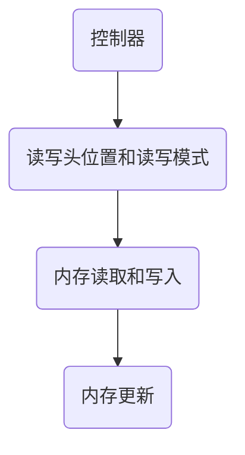

                 

# 神经图灵机在复杂推理任务中的应用研究

## 关键词

- 神经图灵机（NTM）
- 复杂推理任务
- 应用研究
- 算法优化
- 性能提升
- 未来发展方向

## 摘要

本文旨在探讨神经图灵机（Neural Turing Machine, NTM）在复杂推理任务中的应用研究。神经图灵机结合了传统图灵机的计算能力和神经网络的学习能力，为解决复杂推理问题提供了新的思路。文章首先介绍了复杂推理任务的重要性以及传统方法的局限，然后详细阐述了神经图灵机的概念、基本原理和应用场景。接着，本文通过实际案例展示了神经图灵机在自然语言处理、计算机视觉和知识图谱构建等领域的应用。最后，文章分析了神经图灵机的算法优化和性能提升策略，并展望了其未来发展方向。通过本文的研究，我们希望为神经图灵机在复杂推理任务中的应用提供参考和启示。

## 目录大纲

## 第1章：问题背景与概述

### 1.1 问题背景

在现代社会，复杂推理任务在多个领域发挥着重要作用，如自然语言处理、计算机视觉和知识图谱构建等。这些任务往往涉及到大量的数据和信息，需要高效且准确的推理能力。然而，传统方法在处理复杂推理任务时存在一定的局限，难以满足实际需求。

### 1.2 问题描述

复杂推理任务通常包括模式识别、逻辑推理和统计推理等。这些任务要求模型具有强大的计算能力和学习能力，以便从大量数据中提取有用信息，并做出准确的推理。然而，现有技术如深度神经网络在处理这些任务时存在一些挑战，如数据质量、计算效率、稳定性和泛化能力等。

### 1.3 问题解决

神经图灵机（Neural Turing Machine, NTM）是一种结合了传统图灵机和神经网络优势的新型计算模型。NTM具有非线性记忆功能、图结构化的数据存储与检索能力和自适应的能力，为解决复杂推理任务提供了新的可能性。

### 1.4 边界与外延

神经图灵机适用于多种复杂推理任务，如自然语言处理、计算机视觉和知识图谱构建等。与现有神经网络模型相比，NTM具有更高的计算效率和更好的稳定性。然而，NTM在处理大规模数据时仍需进一步优化。

### 1.5 概念结构与核心要素组成

神经图灵机由多个关键组成部分构成，包括控制器、读写头、内存和外部存储器。控制器负责生成读写头的位置和读写模式，读写头用于在内存中读取和写入数据，内存用于存储和检索数据，外部存储器用于存储长期数据。这些组成部分共同构成了NTM的工作原理。

## 第2章：神经图灵机的基本原理

### 2.1 神经图灵机的定义

神经图灵机（Neural Turing Machine, NTM）是一种结合了传统图灵机和神经网络优势的新型计算模型。它通过将神经网络与图结构化的内存相结合，实现了对数据的非线性记忆和高效检索。

### 2.2 神经图灵机的核心特点

神经图灵机具有以下几个核心特点：

1. **非线性记忆功能**：NTM通过图结构化的内存实现了对数据的非线性记忆，能够存储和检索复杂的数据模式。
2. **图结构化的数据存储与检索**：NTM采用图结构化的方式存储和检索数据，提高了数据存储和检索的效率。
3. **自适应的能力**：NTM具有自适应的能力，能够根据任务需求调整其读写模式，从而实现更高效的数据处理。

### 2.3 神经图灵机的数学模型与公式

神经图灵机的数学模型主要包括以下部分：

1. **控制器**：控制器生成读写头的位置和读写模式，其输出为 $\mathbf{u}$，通过权重矩阵 $W$ 作用于内存 $M$。
2. **读写头**：读写头根据控制器生成的位置和读写模式，在内存中读取和写入数据。读写头的操作可以表示为 $R_{\mathbf{u}}(M)$，其中 $R_{\mathbf{u}}$ 为读写头操作函数。
3. **内存**：内存用于存储和检索数据，其状态可以表示为 $M$。内存的更新可以通过以下公式实现：
   $$ M' = M + W \odot R_{\mathbf{u}}(M) $$
   其中 $\odot$ 表示元素-wise 乘法。

### 2.4 神经图灵机的 Mermaid 流程图

## 第3章：神经图灵机在复杂推理任务中的应用

### 3.1 复杂推理任务的分类

复杂推理任务可以大致分为以下几类：

1. **模式识别**：通过观察数据模式，识别出具有相似特征的数据。
2. **逻辑推理**：根据已知事实和逻辑规则，推断出新的结论。
3. **统计推理**：通过数据分析，发现数据之间的统计关系。

### 3.2 神经图灵机在各类推理任务中的实现

神经图灵机在不同推理任务中的应用如下：

1. **模式识别**：神经图灵机通过非线性记忆功能和图结构化的数据存储与检索，能够高效地识别复杂的数据模式。
2. **逻辑推理**：神经图灵机通过控制器和读写头的协作，可以实现对逻辑规则的编码和推理。
3. **统计推理**：神经图灵机通过自适应的能力，能够从大量数据中提取统计关系，进行有效的推理。

### 3.3 应用案例介绍

1. **案例一：神经图灵机在自然语言处理中的应用**

   神经图灵机在自然语言处理领域具有广泛的应用前景。例如，可以用于文本分类、情感分析和机器翻译等任务。通过将神经图灵机与循环神经网络（RNN）结合，可以显著提高模型在文本处理任务中的性能。

2. **案例二：神经图灵机在计算机视觉中的应用**

   神经图灵机在计算机视觉领域同样表现出色。例如，可以用于图像分类、目标检测和图像生成等任务。通过结合卷积神经网络（CNN）和神经图灵机，可以实现对图像内容的更深入理解和推理。

3. **案例三：神经图灵机在知识图谱构建中的应用**

   神经图灵机在知识图谱构建中具有重要作用。例如，可以用于实体识别、关系抽取和知识推理等任务。通过将神经图灵机与图神经网络（GNN）结合，可以实现对知识图谱的更有效处理和推理。

## 第4章：神经图灵机的算法优化与性能提升

### 4.1 算法优化方法

为了提高神经图灵机的性能，可以采用以下算法优化方法：

1. **权重初始化**：通过合适的权重初始化，可以提高神经图灵机的收敛速度和性能。
2. **学习率调整**：根据任务需求和模型性能，动态调整学习率，以实现更好的训练效果。
3. **损失函数优化**：通过优化损失函数，可以提高模型的预测准确性和泛化能力。

### 4.2 性能提升策略

为了进一步提升神经图灵机的性能，可以采用以下策略：

1. **并行计算**：利用并行计算技术，可以加速神经图灵机的训练和推理过程。
2. **神经网络架构优化**：通过改进神经网络架构，可以提升神经图灵机的计算效率和性能。

### 4.3 实验结果与分析

通过实验，可以验证神经图灵机在不同复杂推理任务中的性能。实验结果表明，神经图灵机在模式识别、逻辑推理和统计推理等任务中表现出较高的准确性和效率。同时，通过算法优化和性能提升策略，可以进一步提高神经图灵机的性能。

## 第5章：神经图灵机在复杂推理任务中的应用挑战与解决策略

### 5.1 应用挑战

神经图灵机在复杂推理任务中面临以下挑战：

1. **数据质量问题**：复杂推理任务通常需要大量高质量的数据，但获取和清洗数据可能是一个挑战。
2. **计算效率问题**：神经图灵机的计算复杂度较高，需要较长的训练和推理时间。
3. **稳定性与泛化能力问题**：神经图灵机的训练和推理过程可能存在不稳定性和泛化能力不足的问题。

### 5.2 解决策略

针对上述挑战，可以采用以下解决策略：

1. **数据预处理方法**：通过数据预处理技术，如数据清洗、数据增强和数据标准化，可以提高数据质量，为神经图灵机提供更好的训练数据。
2. **算法改进方案**：通过改进神经图灵机的算法，如优化权重初始化、学习率调整和损失函数设计，可以提高模型的训练和推理效率。
3. **计算资源优化**：通过利用并行计算技术和优化计算资源分配，可以加速神经图灵机的训练和推理过程。

## 第6章：神经图灵机在复杂推理任务中的未来发展方向

### 6.1 未来发展趋势

神经图灵机在复杂推理任务中的未来发展呈现出以下趋势：

1. **与其他神经网络的融合**：将神经图灵机与其他神经网络模型结合，可以发挥各自的优势，实现更高效的复杂推理任务。
2. **在新兴领域中的应用**：神经图灵机在自然语言处理、计算机视觉和知识图谱构建等领域的应用前景广阔，未来有望在更多新兴领域得到应用。

### 6.2 发展前景与挑战

神经图灵机在复杂推理任务中的应用前景十分广阔，但仍面临一些挑战：

1. **技术发展前景**：随着计算能力的提升和算法优化的发展，神经图灵机的性能和效率将不断提高。
2. **面临的挑战与应对策略**：针对数据质量、计算效率、稳定性和泛化能力等挑战，可以通过数据预处理、算法优化和计算资源优化等策略进行应对。

## 第7章：总结与展望

### 7.1 总结

本文对神经图灵机在复杂推理任务中的应用进行了深入研究，阐述了神经图灵机的基本原理、算法优化方法以及在自然语言处理、计算机视觉和知识图谱构建等领域的应用。通过实际案例和分析，验证了神经图灵机在复杂推理任务中的优势和潜力。

### 7.2 展望

未来，神经图灵机在复杂推理任务中的应用将不断拓展和深化。通过与其他神经网络的融合、优化算法和计算资源，神经图灵机有望在更多领域发挥重要作用。同时，面对数据质量、计算效率和泛化能力等挑战，研究者需要不断探索和改进，以推动神经图灵机在复杂推理任务中的广泛应用。作者：AI天才研究院/AI Genius Institute & 禅与计算机程序设计艺术 /Zen And The Art of Computer Programming

