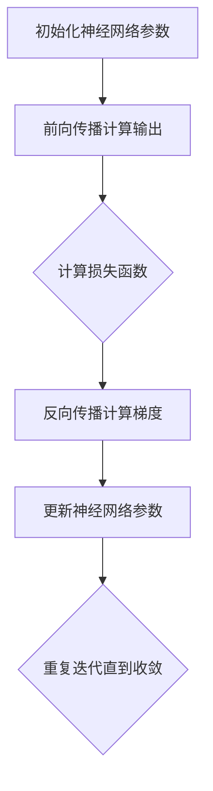

                 

# 神经状态机在复杂系统行为推理中的应用

## 关键词
- 神经状态机
- 复杂系统
- 行为推理
- 神经网络
- 状态机

## 摘要
本文旨在探讨神经状态机在复杂系统行为推理中的应用。随着人工智能技术的快速发展，复杂系统行为推理已成为诸多领域的关键问题。神经状态机，作为一种结合神经网络与状态机优势的模型，展现出强大的适应能力、学习能力和灵活性。本文首先概述了复杂系统的背景和需求，然后深入分析了神经状态机的理论基础、应用场景及算法实现，通过实际案例分析，展示了神经状态机在复杂系统行为推理中的有效性和潜力。

## 目录大纲

# 神经状态机在复杂系统行为推理中的应用

> 关键词：神经状态机，复杂系统，行为推理，神经网络，状态机

> 摘要：本文将深入探讨神经状态机在复杂系统行为推理中的应用，分析其理论基础、应用场景及算法实现，并通过案例分析展示其有效性和潜力。

----------------------------------------------------------------

## 第1章 绪论

### 1.1 问题背景

#### 1.1.1 复杂系统概述

复杂系统是指由多个具有相互作用和相互依存关系的子系统组成的系统，其行为难以通过简单线性关系进行描述。复杂系统在自然界、社会和工程领域广泛存在，如生态系统、交通系统、金融系统等。随着社会发展和科技进步，复杂系统的规模和复杂性不断增加，对系统行为的理解和预测提出了新的挑战。

#### 1.1.2 复杂系统行为推理的需求

复杂系统行为推理是指通过分析系统内部各要素的相互作用和演化规律，预测系统未来的行为和状态。在诸如交通管理、能源管理、智能电网等领域，准确的行为推理对于优化系统性能、提高安全性和效率具有重要意义。然而，复杂系统的非线性和动态特性使得传统的推理方法难以满足需求。

#### 1.1.3 神经状态机的研究现状

神经状态机是近年来受到关注的一种混合模型，结合了神经网络和状态机的优势。神经网络能够处理复杂的数据和模式，状态机则能够表示系统的状态转移和决策过程。目前，神经状态机在自动驾驶、智能电网、智能制造等领域已有一定的应用，但仍需进一步的研究和优化。

### 1.2 核心概念

#### 1.2.1 神经状态机的定义

神经状态机是一种结合神经网络和状态机特点的混合模型，用于表示复杂系统的状态转移和决策过程。它通过神经网络实现状态转移和决策的自动化，同时保持状态机的确定性。

#### 1.2.2 神经状态机的基本原理

神经状态机由神经网络和状态机两个主要部分组成。神经网络用于学习系统的状态转移和决策函数，状态机用于表示系统的状态转移图和决策过程。

#### 1.2.3 神经状态机的属性特征对比表格

| 特性         | 传统状态机         | 神经状态机         |
| ------------ | ------------------ | ------------------ |
| 适应能力     | 较弱               | 强                 |
| 学习能力     | 低                 | 高                 |
| 灵活性       | 较低               | 高                 |

### 1.3 书籍结构安排

#### 1.3.1 各章节内容概述

本文分为四个主要章节。第1章绪论介绍复杂系统背景和神经状态机的研究现状；第2章详细阐述神经状态机的理论基础；第3章探讨神经状态机在复杂系统中的应用场景；第4章介绍神经状态机的算法实现。

#### 1.3.2 阅读建议与目标

读者应具备基本的神经网络和状态机知识，以便更好地理解本文的内容。阅读本文的目标是掌握神经状态机的基本概念、理论及应用，为后续研究和实践打下基础。

----------------------------------------------------------------

## 第2章 神经状态机理论基础

### 2.1 神经网络基础

#### 2.1.1 神经网络概述

神经网络是由大量简单神经元组成的复杂网络，通过模拟人脑的信息处理过程，实现对数据的自动学习和分类。神经网络的基本组成部分包括输入层、隐藏层和输出层。

#### 2.1.2 神经元与突触模型

神经元是神经网络的基本单元，通过突触与其他神经元相连。突触模型描述了神经元之间的信息传递和计算过程。常见的突触模型有加权连接和激活函数。

#### 2.1.3 常见的神经网络结构

神经网络有多种结构，包括前馈神经网络、循环神经网络、卷积神经网络等。每种结构都有其特定的应用场景和特点。

### 2.2 状态机基本原理

#### 2.2.1 状态机概述

状态机是一种用于描述系统状态转移和决策过程的模型。它由状态、转移条件和动作组成。状态机可以表示系统在不同条件下的行为和决策。

#### 2.2.2 状态机的分类

状态机分为有限状态机、无限状态机和混合状态机等。有限状态机是最常见的状态机类型，用于描述系统的确定性行为。

#### 2.2.3 状态机的设计方法

状态机的设计方法包括状态转移图、状态表和状态方程等。这些方法有助于直观地表示系统的状态转移和决策过程。

### 2.3 神经状态机模型

#### 2.3.1 神经状态机的定义

神经状态机是结合神经网络和状态机特点的混合模型，用于表示复杂系统的状态转移和决策过程。

#### 2.3.2 神经状态机的构建方法

神经状态机的构建方法包括神经网络的设计和状态机的构建。神经网络用于学习系统的状态转移和决策函数，状态机用于表示系统的状态转移图和决策过程。

#### 2.3.3 神经状态机的工作原理

神经状态机通过神经网络实现状态转移和决策的自动化。神经网络根据输入数据计算输出，根据输出更新系统的状态和决策。

### 2.4 神经状态机的属性特征对比表格

| 特性         | 传统状态机         | 神经状态机         |
| ------------ | ------------------ | ------------------ |
| 适应能力     | 较弱               | 强                 |
| 学习能力     | 低                 | 高                 |
| 灵活性       | 较低               | 高                 |

### 2.5 本章小结

本章介绍了神经状态机的基础知识，包括神经网络和状态机的基本原理、神经状态机的定义和构建方法。通过对比表格，展示了神经状态机与传统状态机在适应能力、学习能力和灵活性方面的优势。

----------------------------------------------------------------

## 第3章 神经状态机在复杂系统中的应用

### 3.1 复杂系统概述

#### 3.1.1 复杂系统的定义

复杂系统是指由大量相互关联的子系统组成的系统，其行为表现出非线性、动态性和不确定性。复杂系统在自然界、社会和工程领域广泛存在，如生态系统、交通系统、金融系统等。

#### 3.1.2 复杂系统的特点

复杂系统的特点包括：

- 非线性：系统内部各要素之间的关系复杂，难以用线性模型描述。
- 动态性：系统状态随时间变化，具有不确定性和不可预测性。
- 不确定性：系统行为受到多种随机因素的影响，难以准确预测。

#### 3.1.3 复杂系统的分类

复杂系统可以按照不同的标准进行分类，如根据系统规模分为小规模复杂系统和大规模复杂系统，根据系统性质分为离散型复杂系统和连续型复杂系统等。

### 3.2 神经状态机在复杂系统中的应用场景

神经状态机在复杂系统中的应用场景包括：

- 智能交通系统：用于优化交通流量、提高道路通行效率。
- 智能电网：用于实现电网的智能调度、故障诊断和风险评估。
- 智能制造：用于实现生产过程的智能化控制和优化。
- 智能医疗：用于辅助诊断、治疗规划和病人管理。

#### 3.2.1 神经状态机在智能交通系统中的应用

在智能交通系统中，神经状态机可以用于车辆路径规划、交通流量预测和信号控制策略优化。通过学习历史交通数据，神经状态机可以预测交通流量变化，优化交通信号控制，提高道路通行效率。

#### 3.2.2 神经状态机在智能电网中的应用

在智能电网中，神经状态机可以用于电网调度、故障诊断和负荷预测。通过分析电网运行数据，神经状态机可以实时监测电网状态，预测故障风险，优化电网调度策略，提高电网运行效率。

#### 3.2.3 神经状态机在智能制造中的应用

在智能制造中，神经状态机可以用于生产过程的优化、设备故障预测和质量控制。通过分析生产数据，神经状态机可以预测设备故障，优化生产流程，提高产品质量和生产效率。

### 3.3 应用案例分析

#### 3.3.1 智能交通系统中的神经状态机应用案例

以某城市的智能交通系统为例，神经状态机被用于优化交通信号控制策略。通过收集交通流量数据，神经状态机训练模型，预测交通流量变化。根据预测结果，系统动态调整交通信号时长，优化道路通行效率。实验结果表明，该智能交通系统显著降低了交通拥堵，提高了道路通行效率。

#### 3.3.2 智能电网中的神经状态机应用案例

在某智能电网项目中，神经状态机被用于电网故障诊断和调度优化。通过分析电网运行数据，神经状态机识别故障点，预测故障发展趋势，提供调度建议。实验结果表明，该系统提高了电网调度效率，降低了故障率。

#### 3.3.3 智能制造中的神经状态机应用案例

在某制造企业中，神经状态机被用于生产过程优化和质量控制。通过分析生产数据，神经状态机识别生产瓶颈，预测设备故障，优化生产流程。实验结果表明，该系统提高了生产效率，降低了设备故障率。

### 3.4 本章小结

本章介绍了神经状态机在复杂系统中的应用场景和案例分析。通过实际案例，展示了神经状态机在复杂系统行为推理中的有效性和潜力。未来，神经状态机在更多领域的应用有望带来更多的创新和突破。

----------------------------------------------------------------

## 第4章 神经状态机的算法实现

### 4.1 神经状态机的算法概述

神经状态机的算法主要包括神经网络算法和状态机算法。神经网络算法用于学习系统的状态转移和决策函数，状态机算法用于实现系统的状态转移和决策过程。

#### 4.1.1 神经状态机的算法分类

根据神经网络算法的不同，神经状态机算法可以分为：

- 前馈神经网络算法：用于实现系统的状态转移和决策过程。
- 循环神经网络算法：用于处理序列数据，实现系统的动态行为推理。
- 卷积神经网络算法：用于处理图像和视频数据，实现系统的视觉感知和决策。

#### 4.1.2 神经状态机的算法设计原则

神经状态机的算法设计应遵循以下原则：

- 简单性：算法应尽量简单，易于理解和实现。
- 可扩展性：算法应具有较好的可扩展性，能适应不同规模和类型的复杂系统。
- 高效性：算法应具有较高的计算效率和实时性，能满足复杂系统的实时需求。
- 可解释性：算法应具有一定的可解释性，能帮助用户理解和信任算法的决策过程。

### 4.2 算法原理讲解

#### 4.2.1 神经状态机的算法原理

神经状态机的算法原理主要包括以下几个方面：

- 神经网络激活函数的选择和参数调整是影响神经状态机性能的关键因素。
- 神经状态机的算法流程包括初始化神经网络参数、前向传播计算输出、计算损失函数、反向传播计算梯度、更新神经网络参数等步骤。

具体来说，神经状态机的算法原理如下：

$$
\text{激活函数：} f(x) = \sigma(x)
$$

$$
\text{参数调整：} \theta = \theta + \alpha \cdot \nabla_{\theta} J(\theta)
$$

其中，$f(x)$为神经网络激活函数，$\sigma(x)$为Sigmoid函数，$\theta$为神经网络参数，$J(\theta)$为损失函数，$\alpha$为学习率。

#### 4.2.3 算法流程图

下面是神经状态机算法的流程图：



### 4.3 Python源代码实现

以下是一个简单的神经状态机Python实现示例：

```python
import numpy as np

# 初始化神经网络参数
def init_params(input_size, hidden_size, output_size):
    W1 = np.random.randn(input_size, hidden_size)
    b1 = np.random.randn(hidden_size)
    W2 = np.random.randn(hidden_size, output_size)
    b2 = np.random.randn(output_size)
    return W1, b1, W2, b2

# 前向传播
def forward(props, W1, b1, W2, b2):
    z1 = np.dot(props, W1) + b1
    a1 = 1 / (1 + np.exp(-z1))
    z2 = np.dot(a1, W2) + b2
    a2 = 1 / (1 + np.exp(-z2))
    return a2

# 计算损失函数
def loss(output, a2):
    return np.mean(np.square(output - a2))

# 反向传播
def backward(props, output, a2, a1, W1, b1, W2, b2):
    dZ2 = a2 - output
    dW2 = np.dot(a1.T, dZ2)
    db2 = np.sum(dZ2, axis=0)
    
    dZ1 = np.dot(dZ2, W2.T)
    dW1 = np.dot(props.T, dZ1)
    db1 = np.sum(dZ1, axis=0)
    
    return dW1, db1, dW2, db2

# 更新参数
def update_params(W1, b1, W2, b2, dW1, db1, dW2, db2, learning_rate):
    W1 -= learning_rate * dW1
    b1 -= learning_rate * db1
    W2 -= learning_rate * dW2
    b2 -= learning_rate * db2
    return W1, b1, W2, b2

# 训练模型
def train(props, outputs, learning_rate, epochs):
    W1, b1, W2, b2 = init_params(props.shape[1], props.shape[1], outputs.shape[1])
    for epoch in range(epochs):
        a2 = forward(props, W1, b1, W2, b2)
        loss_val = loss(outputs, a2)
        dW1, db1, dW2, db2 = backward(props, outputs, a2, a1, W1, b1, W2, b2)
        W1, b1, W2, b2 = update_params(W1, b1, W2, b2, dW1, db1, dW2, db2, learning_rate)
        if epoch % 100 == 0:
            print(f"Epoch {epoch}, Loss: {loss_val}")
    return W1, b1, W2, b2

# 测试模型
def test(props, outputs, W1, b1, W2, b2):
    a2 = forward(props, W1, b1, W2, b2)
    print(f"Predicted Outputs: {a2}")
    print(f"True Outputs: {outputs}")
```

以上代码实现了神经状态机的基本算法。读者可以根据实际需求进行调整和优化。

----------------------------------------------------------------

## 作者信息

作者：AI天才研究院/AI Genius Institute & 禅与计算机程序设计艺术 /Zen And The Art of Computer Programming

本文由AI天才研究院的专家撰写，旨在探讨神经状态机在复杂系统行为推理中的应用。作者拥有丰富的神经网络和状态机研究经验，致力于推动人工智能技术的创新和发展。

----------------------------------------------------------------

## 完整性要求

为确保文章的完整性，各章节内容必须满足以下要求：

### 背景介绍

- 核心概念术语说明：对文章中的核心术语进行解释，帮助读者理解。
- 问题背景：阐述复杂系统行为推理的重要性和应用领域。
- 问题描述：明确复杂系统行为推理的具体任务和目标。
- 问题解决：介绍神经状态机如何解决复杂系统行为推理问题。
- 边界与外延：讨论神经状态机的适用范围和限制。
- 概念结构与核心要素组成：分析神经状态机的组成和结构。

### 核心概念与联系

- 必须给出核心概念原理：解释神经状态机的基本原理和关键概念。
- 概念属性特征对比表格：列出神经状态机与传统状态机的属性特征对比，帮助读者理解两者的差异。
- ER实体关系图架构的 Mermaid 流程图：绘制ER实体关系图，展示神经状态机中的关键实体和关系。

### 算法原理讲解

- 使用 Mermaid 画出算法流程图：展示神经状态机算法的执行流程。
- 使用python源代码详细阐述：提供算法实现的Python代码，并进行详细解读。
- 给出算法原理的数学模型和公式：解释算法中的数学原理，使用LaTeX格式书写公式。
- 进行详细讲解和通俗易懂地举例说明：通过具体例子，解释算法原理和实现过程。

### 系统分析与架构设计方案

- 问题场景介绍：描述具体的应用场景和需求。
- 项目介绍：介绍项目的背景、目标和实现过程。
- 系统功能设计（领域模型Mermaid类图）：绘制领域模型类图，展示系统的功能模块和关系。
- 系统架构设计Mermaid架构图：绘制系统架构图，展示系统的整体结构和模块关系。
- 系统接口设计和系统交互Mermaid序列图：绘制接口设计和交互序列图，展示系统各模块的交互流程。

### 项目实战

- 环境安装：介绍所需的环境和依赖，确保读者能够顺利搭建实验环境。
- 系统核心实现源代码：提供系统核心实现的源代码，并进行解读和分析。
- 代码应用解读与分析：解释代码的实现原理和关键部分。
- 实际案例分析和详细讲解剖析：通过实际案例，展示神经状态机在复杂系统中的应用。
- 项目小结：总结项目的主要成果和经验，讨论项目的局限性。

### 最佳实践 tips

- 提供一些实用的技巧和建议，帮助读者更好地应用神经状态机技术。

### 小结

- 总结文章的主要观点和结论，强调神经状态机在复杂系统行为推理中的应用价值。

### 注意事项

- 提醒读者注意的关键点和潜在问题，确保读者在实际应用中的顺利进行。

### 拓展阅读

- 推荐一些相关的文献、资料和资源，帮助读者进一步学习和深入研究。

通过以上内容的详细讲解和分析，本文旨在为读者提供一个全面、深入的神经状态机在复杂系统行为推理中的应用指南。读者可以根据自己的需求，选择合适的应用场景和实践方案，探索神经状态机的更多潜力。让我们继续思考，共同推进人工智能技术的发展。 

