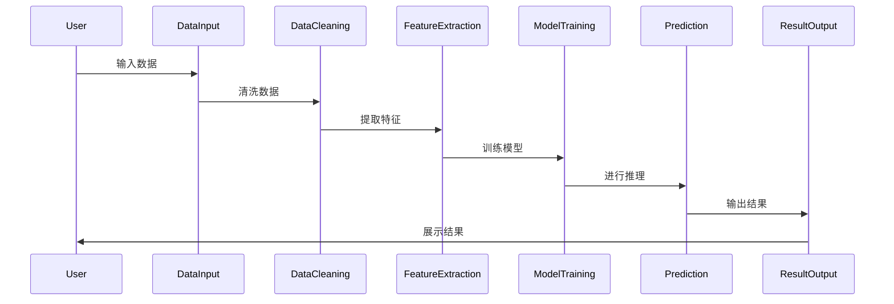
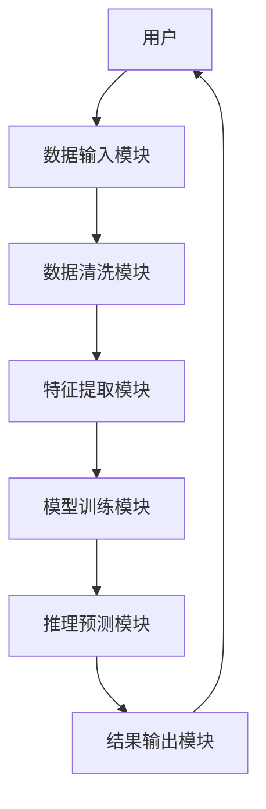

                 

# 神经科学启发的AI推理系统架构创新

## 关键词

- 神经科学
- AI推理系统
- 神经元
- 神经网络
- 类脑计算
- 系统架构创新

## 摘要

随着人工智能技术的飞速发展，AI推理系统的性能和效率逐渐成为研究和应用的关键。神经科学作为研究大脑机制和功能的学科，为AI推理系统提供了丰富的理论基础和实践指导。本文将从神经科学的基础概念出发，探讨神经科学与AI推理系统之间的联系，分析神经科学对AI推理系统架构创新的启示，并介绍一个基于神经科学原理的AI推理系统项目实战。希望通过本文，能够为读者提供对神经科学在AI推理系统架构创新方面的深入理解和实践参考。

## 目录大纲

----------------------------------------------------------------
### 第一部分：神经科学基础与AI推理系统

#### 1.1 背景介绍

##### 1.1.1 神经科学的重要性
##### 1.1.2 神经科学的研究现状
##### 1.1.3 神经科学与AI的关系

#### 1.2 神经科学核心概念与联系

##### 1.2.1 神经元与神经网络
###### 1.2.1.1 神经元的基本原理
###### 1.2.1.2 神经网络的架构
###### 1.2.1.3 神经元与神经网络的关系

##### 1.3 AI推理系统架构概述

###### 1.3.1 AI推理系统的定义
###### 1.3.2 AI推理系统的工作原理
###### 1.3.3 AI推理系统的关键要素

##### 1.4 神经科学启发的AI推理系统架构创新

###### 1.4.1 启发与借鉴
###### 1.4.2 架构创新的方向
###### 1.4.3 架构创新的应用场景

##### 1.5 本章小结

----------------------------------------------------------------
### 第二部分：神经科学启发的AI推理系统架构创新原理

#### 2.1 神经元在AI推理系统中的应用

##### 2.1.1 神经元模型的构建
###### 2.1.1.1 感知器模型
###### 2.1.1.2 反向传播算法
###### 2.1.1.3 神经元模型的优化

##### 2.2 神经网络的优化与拓展

###### 2.2.1 神经网络的性能提升
###### 2.2.1.1 深度神经网络
###### 2.2.1.2 卷积神经网络
###### 2.2.1.3 循环神经网络

###### 2.2.2 神经网络的优化方法
###### 2.2.2.1 梯度下降算法
###### 2.2.2.2 随机梯度下降
###### 2.2.2.3 动量优化

##### 2.3 类脑计算与AI推理系统

###### 2.3.1 类脑计算的基本原理
###### 2.3.1.1 神经突触的可塑性
###### 2.3.1.2 神经网络的适应性
###### 2.3.1.3 类脑计算的实现

###### 2.3.2 类脑计算在AI推理系统中的应用
###### 2.3.2.1 类脑计算的优势
###### 2.3.2.2 类脑计算的挑战

##### 2.4 神经科学启发的AI推理系统架构设计

###### 2.4.1 架构设计原则
###### 2.4.1.1 灵活性
###### 2.4.1.2 可扩展性
###### 2.4.1.3 可维护性

###### 2.4.2 架构设计步骤
###### 2.4.2.1 需求分析
###### 2.4.2.2 架构设计
###### 2.4.2.3 架构评估与优化

##### 2.5 本章小结

----------------------------------------------------------------
### 第三部分：神经科学启发的AI推理系统项目实战

#### 3.1 项目介绍

##### 3.1.1 项目背景
##### 3.1.2 项目目标
##### 3.1.3 项目团队

#### 3.2 系统功能设计

##### 3.2.1 领域模型
###### 3.2.1.1 模型定义
###### 3.2.1.2 模型属性
###### 3.2.1.3 模型关系

#### 3.3 系统架构设计

##### 3.3.1 系统架构
###### 3.3.1.1 架构设计原则
###### 3.3.1.2 架构设计步骤

##### 3.3.2 系统架构图
###### 3.3.2.1 系统架构图绘制
###### 3.3.2.2 系统架构说明

#### 3.4 系统接口设计

##### 3.4.1 接口设计原则
###### 3.4.1.1 接口规范
###### 3.4.1.2 接口安全性

##### 3.4.2 接口设计步骤
###### 3.4.2.1 接口需求分析
###### 3.4.2.2 接口定义
###### 3.4.2.3 接口实现与测试

#### 3.5 系统交互设计

##### 3.5.1 系统交互流程
###### 3.5.1.1 用户操作流程
###### 3.5.1.2 系统响应流程

##### 3.5.2 系统交互图
###### 3.5.2.1 系统交互图绘制
###### 3.5.2.2 系统交互说明

##### 3.6 系统实现与代码分析

###### 3.6.1 环境安装
###### 3.6.2 系统核心实现源代码
###### 3.6.3 代码应用解读与分析

##### 3.7 实际案例分析与讲解

###### 3.7.1 实际案例分析
###### 3.7.2 详细讲解与剖析

##### 3.8 项目小结

----------------------------------------------------------------
### 第四部分：神经科学启发的AI推理系统最佳实践与总结

#### 4.1 最佳实践 tips

##### 4.1.1 神经元模型构建技巧
##### 4.1.2 神经网络优化策略
##### 4.1.3 类脑计算应用场景

#### 4.2 小结

##### 4.2.1 神经科学在AI推理系统中的应用
##### 4.2.2 架构创新的挑战与机遇
##### 4.2.3 未来发展趋势与展望

#### 4.3 注意事项

##### 4.3.1 神经元模型训练注意事项
##### 4.3.2 神经网络优化方法选择
##### 4.3.3 类脑计算安全性考虑

#### 4.4 拓展阅读

##### 4.4.1 相关研究论文
##### 4.4.2 推荐书籍与资料
##### 4.4.3 学术会议与研讨会

----------------------------------------------------------------

### 第一部分：神经科学基础与AI推理系统

#### 1.1 背景介绍

##### 1.1.1 神经科学的重要性

神经科学作为现代生物学的前沿领域，通过对神经系统的研究，揭示了大脑的复杂结构和功能，对于理解人类行为、认知和意识等高级功能具有重要意义。随着计算技术的发展，神经科学的研究方法和成果逐渐渗透到人工智能领域，为AI推理系统提供了新的理论支持和创新思路。

在人工智能中，推理是核心任务之一。传统的AI推理系统主要依赖于逻辑推理和统计方法，但在处理复杂问题和大量数据时存在局限。神经科学通过研究大脑的计算机制，提供了新的启发，如类脑计算和神经网络模型，这些模型在处理复杂性和并行计算方面具有显著优势。

##### 1.1.2 神经科学的研究现状

近年来，神经科学在基础研究和应用研究方面取得了显著进展。在基础研究方面，神经科学家通过脑成像技术、分子生物学和计算神经科学等方法，深入研究了神经元的工作原理、神经网络的结构和功能。这些研究成果为理解和模拟大脑的工作机制提供了重要依据。

在应用研究方面，神经科学为人工智能提供了丰富的理论资源和实践指导。例如，神经网络模型在图像识别、自然语言处理和决策支持等领域得到了广泛应用，类脑计算在智能机器人、自动驾驶和医疗诊断等领域展示了巨大的潜力。

##### 1.1.3 神经科学与AI的关系

神经科学与AI之间的关系是相互促进的。神经科学为AI提供了理论依据和实践指导，而AI技术的发展又推动了神经科学研究的深入。具体来说，AI推理系统可以从神经科学中借鉴以下几方面：

1. **神经元模型**：神经科学中的神经元模型可以用于构建AI中的基础计算单元，例如感知器和反向传播算法。
2. **神经网络**：神经网络的架构和优化方法受到了神经科学的启发，如深度学习、卷积神经网络和循环神经网络。
3. **类脑计算**：类脑计算旨在模拟大脑的计算机制，通过神经网络和机器学习算法实现自适应和并行计算。
4. **认知建模**：神经科学关于认知和意识的研究成果可以用于构建AI中的智能代理和决策支持系统。

#### 1.2 神经科学核心概念与联系

##### 1.2.1 神经元与神经网络

神经元是神经系统中的基本单元，负责传递和处理信息。神经元的基本原理包括信号接收、处理和传递。一个典型的神经元由细胞体、树突、轴突和突触等部分组成。信号在神经元之间的传递通过突触实现，突触的强度和连接方式决定了神经网络的复杂性和功能。

神经网络是由大量神经元组成的计算模型，可以模拟大脑的信息处理方式。神经网络的基本架构包括输入层、隐藏层和输出层。信号从输入层传递到隐藏层，再从隐藏层传递到输出层，通过神经元的权重和激活函数实现信息的处理和转换。

##### 1.2.1.1 神经元的基本原理

神经元的基本原理可以概括为以下几个方面：

1. **信号接收**：神经元通过树突接收来自其他神经元的信号。
2. **信号处理**：神经元内部对信号进行整合和放大，通过激活函数实现非线性转换。
3. **信号传递**：经过处理的信号通过轴突传递到下一个神经元或目标细胞。

神经元的激活函数通常是一个非线性函数，常用的有 sigmoid 函数、ReLU 函数等，这些函数可以模拟生物神经元在处理信息时的非线性特性。

##### 1.2.1.2 神经网络的架构

神经网络可以分为几种不同的类型，每种类型都有其特定的应用场景和特点：

1. **前馈神经网络**：前馈神经网络是最简单的一种神经网络结构，信号从输入层直接传递到输出层，没有循环。前馈神经网络通常用于分类和回归任务。
2. **循环神经网络**（RNN）：循环神经网络具有记忆功能，可以处理序列数据，如时间序列分析、语音识别和自然语言处理。
3. **卷积神经网络**（CNN）：卷积神经网络通过卷积操作和池化操作，擅长处理具有网格结构的数据，如图像识别和物体检测。
4. **深度神经网络**：深度神经网络是具有多个隐藏层的神经网络，可以学习更复杂的特征和模式，广泛应用于图像识别、自然语言处理和自动驾驶等领域。

##### 1.2.1.3 神经元与神经网络的关系

神经元是神经网络的基本计算单元，神经网络由大量神经元通过特定的连接方式构成。神经元之间的关系决定了神经网络的性能和功能。在神经网络中，神经元之间的连接通过权重表示，这些权重决定了信息在神经网络中的传递方式和处理效果。

通过训练，神经网络可以调整神经元之间的权重，从而优化网络的表现。训练过程中，神经网络通过反向传播算法不断调整权重，使网络能够更好地拟合训练数据。

##### 1.3 AI推理系统架构概述

##### 1.3.1 AI推理系统的定义

AI推理系统是指能够利用机器学习和深度学习技术，从数据中提取特征、进行决策和预测的智能系统。AI推理系统通常包括数据预处理、特征提取、模型训练和推理预测等环节。

AI推理系统可以分为以下几类：

1. **基于规则推理**：基于规则的推理系统使用预定义的规则进行推理，适用于规则明确、结构简单的场景。
2. **基于模型的推理**：基于模型的推理系统使用机器学习模型进行推理，适用于处理复杂数据和模式识别任务。
3. **基于知识推理**：基于知识推理系统结合了事实和规则进行推理，能够处理更复杂的问题和领域。

##### 1.3.2 AI推理系统的工作原理

AI推理系统的工作原理可以概括为以下几个步骤：

1. **数据预处理**：对原始数据进行清洗、归一化和编码等处理，使其适合模型训练和推理。
2. **特征提取**：从预处理后的数据中提取具有代表性的特征，用于训练和推理。
3. **模型训练**：使用训练数据对机器学习模型进行训练，调整模型参数，使其能够拟合训练数据。
4. **推理预测**：使用训练好的模型对新的数据进行推理和预测，生成决策和结果。

##### 1.3.3 AI推理系统的关键要素

AI推理系统的关键要素包括：

1. **数据集**：数据集是推理系统的基石，其质量和规模直接影响模型的性能和泛化能力。
2. **模型选择**：选择适合任务和数据特性的机器学习模型，是推理系统成功的关键。
3. **训练算法**：训练算法决定了模型训练的效率和效果，常见的训练算法包括梯度下降算法、随机梯度下降和动量优化等。
4. **推理算法**：推理算法决定了模型在新的数据上的表现，包括推理速度和准确性。

##### 1.4 神经科学启发的AI推理系统架构创新

##### 1.4.1 启发与借鉴

神经科学为AI推理系统提供了丰富的启发和借鉴。从神经元的基本原理到神经网络的结构和优化方法，再到类脑计算和认知建模，神经科学的研究成果为AI推理系统的架构创新提供了新的方向。

1. **神经元模型**：神经元模型作为神经网络的基础，可以借鉴神经科学的神经元结构和功能，构建更高效的计算模型。
2. **神经网络架构**：神经网络架构可以从神经科学中借鉴层级结构、模块化和可扩展性等原则，设计更复杂的神经网络架构。
3. **类脑计算**：类脑计算旨在模拟大脑的计算机制，实现自适应和并行计算，可以用于构建具有强鲁棒性和自主性的AI推理系统。
4. **认知建模**：认知建模可以从神经科学中借鉴人类认知和决策的过程，构建更智能的AI推理系统。

##### 1.4.2 架构创新的方向

基于神经科学的启发，AI推理系统架构创新可以从以下几个方面展开：

1. **神经网络优化**：通过借鉴神经科学的原理，优化神经网络的结构和训练方法，提高模型的性能和泛化能力。
2. **类脑计算**：结合神经科学和计算智能技术，实现类脑计算，构建具有自适应和自主性的AI推理系统。
3. **认知建模**：借鉴人类认知和决策过程，构建基于认知的AI推理系统，实现更智能和自然的交互。
4. **多模态融合**：结合不同类型的传感器和数据源，实现多模态数据融合，提高推理系统的感知能力和决策能力。

##### 1.4.3 架构创新的应用场景

神经科学启发的AI推理系统架构创新可以在多个应用场景中发挥作用：

1. **智能机器人**：通过类脑计算和认知建模，实现智能机器人的自主决策和适应能力，应用于服务机器人、医疗机器人和工业机器人等领域。
2. **自动驾驶**：通过神经网络优化和多模态融合，提高自动驾驶系统的感知和决策能力，实现更安全、更智能的自动驾驶。
3. **医疗诊断**：通过神经网络和类脑计算，构建智能医疗诊断系统，实现疾病的早期检测和个性化治疗。
4. **金融风控**：通过神经网络和认知建模，构建金融风控系统，实现风险的实时监控和预警。

##### 1.5 本章小结

本章从神经科学的基础概念出发，介绍了神经科学与AI推理系统之间的联系，分析了神经科学对AI推理系统架构创新的启示，并探讨了神经科学启发的AI推理系统架构创新的方向和应用场景。通过本章的内容，读者可以初步了解神经科学在AI推理系统架构创新中的重要性，为后续章节的深入探讨打下基础。

### 第二部分：神经科学启发的AI推理系统架构创新原理

#### 2.1 神经元在AI推理系统中的应用

神经元是神经网络的基本单元，其在AI推理系统中的应用至关重要。神经元在AI推理系统中的应用主要体现在以下几个方面：

##### 2.1.1 神经元模型的构建

神经元模型是AI推理系统的基础，其构建过程涉及以下几个方面：

###### 2.1.1.1 感知器模型

感知器模型是最简单的神经元模型，其基于线性阈值逻辑。感知器模型通过输入权重和偏置，对输入数据进行线性组合，然后应用一个阈值函数来确定输出。感知器模型的基本形式如下：

$$
f(x) = \text{sign}(w \cdot x + b)
$$

其中，$x$ 是输入向量，$w$ 是权重向量，$b$ 是偏置，$\text{sign}$ 函数是一个阈值函数，用于确定输出是正类还是负类。

###### 2.1.1.2 反向传播算法

反向传播算法是训练神经网络的重要算法，其核心思想是通过梯度下降方法调整神经网络的权重和偏置，以最小化损失函数。反向传播算法的基本步骤如下：

1. **前向传播**：将输入数据传递到神经网络中，计算每个神经元的输出。
2. **计算损失**：使用损失函数计算预测值与实际值之间的差距。
3. **后向传播**：计算每个神经元的梯度，并更新权重和偏置。
4. **迭代训练**：重复前向传播、计算损失和后向传播的过程，直到模型收敛。

反向传播算法的数学公式如下：

$$
\frac{dL}{dw_{ij}} = \sum_{k} (z_k - t_k) \cdot \frac{dz_k}{dw_{ij}}
$$

其中，$L$ 是损失函数，$z_k$ 是隐藏层的输出，$t_k$ 是实际值，$w_{ij}$ 是输入层到隐藏层的权重。

###### 2.1.1.3 神经元模型的优化

为了提高神经元的性能，可以采用多种优化方法，包括：

1. **激活函数优化**：不同的激活函数具有不同的特性，如 sigmoid 函数和 ReLU 函数。通过选择合适的激活函数，可以改善神经元的非线性能力和收敛速度。
2. **权重初始化**：合理的权重初始化有助于加速模型的训练过程。常用的权重初始化方法包括高斯分布初始化和随机初始化。
3. **正则化方法**：正则化方法如 L1 正则化和 L2 正则化可以防止模型过拟合，提高泛化能力。

##### 2.2 神经网络的优化与拓展

神经网络是AI推理系统的核心，其性能直接影响系统的表现。为了提高神经网络的性能，可以采用多种优化方法和拓展策略。

###### 2.2.1 神经网络的性能提升

神经网络的性能提升主要涉及以下几个方面：

1. **深度神经网络**：深度神经网络通过增加隐藏层的数量和神经元数量，可以学习更复杂的特征和模式。深度神经网络在图像识别、语音识别和自然语言处理等领域取得了显著成果。
2. **卷积神经网络**：卷积神经网络通过卷积操作和池化操作，擅长处理具有网格结构的数据，如图像和视频。卷积神经网络在计算机视觉领域得到了广泛应用。
3. **循环神经网络**：循环神经网络通过循环结构，具有记忆功能，可以处理序列数据，如时间序列分析、语音识别和自然语言处理。循环神经网络在时间序列分析和自然语言处理领域具有优势。

###### 2.2.2 神经网络的优化方法

神经网络的优化方法主要包括以下几种：

1. **梯度下降算法**：梯度下降算法是最常用的优化算法，其基本思想是通过迭代计算损失函数的梯度，更新模型的参数，以最小化损失函数。梯度下降算法的公式如下：

$$
w_{t+1} = w_{t} - \alpha \cdot \nabla_w L
$$

其中，$w_t$ 是当前权重，$\alpha$ 是学习率，$\nabla_w L$ 是损失函数对权重的梯度。

2. **随机梯度下降**：随机梯度下降是梯度下降算法的一种变体，其使用随机样本来计算梯度，以减少计算量和提高收敛速度。随机梯度下降的公式如下：

$$
w_{t+1} = w_{t} - \alpha \cdot \nabla_w L(\xi_t)
$$

其中，$\xi_t$ 是训练样本。

3. **动量优化**：动量优化是一种改进的梯度下降算法，其通过引入动量项，加速梯度下降过程，减少振荡。动量优化的公式如下：

$$
w_{t+1} = w_{t} - \alpha \cdot \nabla_w L + \beta \cdot v_t
$$

其中，$v_t$ 是动量项。

4. **自适应优化器**：自适应优化器如 Adam 和 RMSProp，通过自适应调整学习率，提高优化过程的效率和稳定性。Adam 优化器的公式如下：

$$
m_t = \beta_1 \cdot m_{t-1} + (1 - \beta_1) \cdot \nabla_w L
$$

$$
v_t = \beta_2 \cdot v_{t-1} + (1 - \beta_2) \cdot (\nabla_w L)^2
$$

$$
\hat{m}_t = \frac{m_t}{1 - \beta_1^t}
$$

$$
\hat{v}_t = \frac{v_t}{1 - \beta_2^t}
$$

$$
w_{t+1} = w_{t} - \alpha \cdot \hat{m}_t / (\sqrt{\hat{v}_t} + \epsilon)
$$

其中，$\beta_1$ 和 $\beta_2$ 是超参数，$\epsilon$ 是一个小数用于防止除以零。

##### 2.3 类脑计算与AI推理系统

类脑计算是一种模仿生物大脑计算机制的计算机系统，其在AI推理系统中具有广泛的应用前景。类脑计算的基本原理包括神经突触的可塑性、神经网络的适应性和计算效率。

###### 2.3.1 类脑计算的基本原理

类脑计算的基本原理可以概括为以下几个方面：

1. **神经突触的可塑性**：神经突触的可塑性是指突触的连接强度可以随着时间和经验进行调整。这种可塑性是类脑计算实现自适应和学习能力的基础。
2. **神经网络的适应性**：神经网络具有自适应和并行计算的能力，能够处理复杂和动态的问题。类脑计算通过模拟神经网络的适应性和并行性，实现高效的计算和决策。
3. **计算效率**：类脑计算通过利用生物大脑的并行计算和能量效率，实现高效的信息处理。类脑计算在处理大规模数据和高性能计算任务中具有优势。

###### 2.3.2 类脑计算在AI推理系统中的应用

类脑计算在AI推理系统中的应用主要包括以下几个方面：

1. **智能感知**：类脑计算可以用于智能感知系统，实现图像识别、声音识别和触觉感知等功能。例如，通过模拟生物视觉系统，类脑计算可以实现高效的图像识别和目标检测。
2. **智能决策**：类脑计算可以用于智能决策系统，实现自主决策和问题求解。例如，通过模拟生物大脑的决策过程，类脑计算可以实现自主驾驶、智能调度和风险评估等任务。
3. **智能控制**：类脑计算可以用于智能控制系统，实现自主控制和优化。例如，通过模拟生物神经系统的控制机制，类脑计算可以实现机器人自主导航、无人机飞行控制和自动化生产线管理等任务。

###### 2.3.2.1 类脑计算的优势

类脑计算在AI推理系统中具有以下优势：

1. **高效性**：类脑计算通过并行计算和能量效率，实现高效的信息处理和决策。类脑计算在处理大规模数据和高性能计算任务中具有优势。
2. **适应性**：类脑计算具有自适应和学习能力，能够适应不同的环境和任务需求。类脑计算能够通过经验和反馈进行自我优化和调整。
3. **可扩展性**：类脑计算可以方便地扩展和集成，实现复杂的系统和应用。类脑计算可以通过增加神经网络的规模和层次，提高系统的计算能力和智能水平。

###### 2.3.2.2 类脑计算的挑战

类脑计算在AI推理系统中也面临着一些挑战：

1. **算法复杂度**：类脑计算的算法复杂度较高，需要大量的计算资源和时间。类脑计算的实现需要高效的算法和优化方法。
2. **数据质量和数量**：类脑计算依赖于大量的高质量数据，数据的质量和数量直接影响类脑计算的效果和性能。类脑计算需要大量的训练数据和标记数据。
3. **安全性和隐私**：类脑计算涉及大量的敏感数据和隐私信息，需要确保计算过程的安全性和隐私性。类脑计算需要采取有效的安全措施和隐私保护机制。

##### 2.4 神经科学启发的AI推理系统架构设计

神经科学为AI推理系统架构设计提供了丰富的启示。基于神经科学的原理，可以设计出更高效、更智能和更灵活的AI推理系统架构。

###### 2.4.1 架构设计原则

神经科学启发的AI推理系统架构设计应遵循以下原则：

1. **灵活性**：架构设计应具有灵活性，能够适应不同的应用场景和任务需求。灵活性包括模块化设计、可配置性和动态调整能力。
2. **可扩展性**：架构设计应具有可扩展性，能够支持系统规模的扩大和功能的增强。可扩展性包括水平扩展和垂直扩展能力。
3. **可维护性**：架构设计应具有可维护性，便于系统的维护和升级。可维护性包括模块化设计、文档化和自动化部署。

###### 2.4.2 架构设计步骤

神经科学启发的AI推理系统架构设计包括以下步骤：

1. **需求分析**：明确系统的需求，包括功能需求、性能需求和安全需求等。需求分析是架构设计的基础，决定了系统的设计和实现方向。
2. **架构设计**：根据需求分析结果，设计系统的整体架构。架构设计包括系统模块的划分、模块之间的关系和接口设计等。
3. **架构评估与优化**：对设计的架构进行评估和优化，包括性能评估、安全性评估和可维护性评估等。通过评估和优化，确保系统架构的可行性和高效性。

#### 2.5 本章小结

本章介绍了神经科学在AI推理系统架构创新中的原理和应用。通过神经元模型的构建、神经网络的优化与拓展、类脑计算的基本原理和应用，以及神经科学启发的AI推理系统架构设计原则和步骤，读者可以深入理解神经科学对AI推理系统架构创新的启示。本章的内容为后续的实战项目和系统实现提供了理论基础和实践指导。

### 第三部分：神经科学启发的AI推理系统项目实战

#### 3.1 项目介绍

##### 3.1.1 项目背景

在当今信息爆炸的时代，数据量呈指数级增长，如何从海量数据中提取有价值的信息成为了一个重要课题。传统的数据挖掘和机器学习技术在处理复杂数据和大规模数据时存在一定局限性。为了解决这些问题，我们提出一个基于神经科学原理的AI推理系统项目，旨在通过模仿大脑的计算机制，实现高效的数据分析和决策支持。

##### 3.1.2 项目目标

本项目的主要目标包括：

1. **数据处理**：对大规模、多维度的数据进行有效的预处理和特征提取，为后续的推理和决策提供高质量的数据输入。
2. **智能推理**：利用神经网络和类脑计算技术，构建智能推理系统，实现复杂问题的自动分析和决策。
3. **系统实现**：开发一个功能完整、易于维护和扩展的AI推理系统，应用于实际场景，验证系统的有效性和实用性。

##### 3.1.3 项目团队

本项目由一支跨学科团队共同完成，包括以下成员：

1. **项目经理**：负责项目的整体规划和协调。
2. **数据科学家**：负责数据预处理、特征提取和模型训练。
3. **软件工程师**：负责系统架构设计、开发实现和测试。
4. **算法工程师**：负责神经网络和类脑计算算法的设计和优化。
5. **应用工程师**：负责系统的部署和实际应用。

#### 3.2 系统功能设计

##### 3.2.1 领域模型

在系统功能设计中，我们首先定义了领域模型，明确了系统的核心功能和模块。领域模型包括以下几个主要部分：

1. **数据输入模块**：负责接收外部数据源的数据，进行预处理和清洗。
2. **特征提取模块**：对预处理后的数据进行特征提取，生成用于模型训练的特征向量。
3. **模型训练模块**：使用神经网络和类脑计算技术，对特征向量进行训练，生成预测模型。
4. **推理预测模块**：使用训练好的模型，对新的数据进行推理和预测，生成决策结果。
5. **结果输出模块**：将推理结果以可视化或报告形式输出，供用户分析和使用。

以下是一个简单的领域模型ER实体关系图：

```mermaid
erDiagram
  DataInput --> FeatureExtraction : "数据输入"
  FeatureExtraction --> ModelTraining : "特征提取"
  ModelTraining --> Prediction : "模型训练"
  Prediction --> ResultOutput : "推理预测"
```

##### 3.2.1.1 模型定义

在领域模型中，每个模块都有其特定的模型定义。以下是一个简化的模型定义表格：

| 模块         | 模型类型       | 功能描述               |
| ------------ | -------------- | ---------------------- |
| 数据输入模块 | 数据流处理器   | 数据预处理和清洗       |
| 特征提取模块 | 特征提取器     | 数据特征提取           |
| 模型训练模块 | 神经网络训练器 | 特征向量训练           |
| 推理预测模块 | 预测器         | 新数据推理和预测       |
| 结果输出模块 | 结果展示器     | 推理结果可视化         |

##### 3.2.1.2 模型属性

每个模块的模型都有其特定的属性，用于描述模型的行为和功能。以下是一个简化的模型属性表格：

| 模块         | 模型属性           | 描述                         |
| ------------ | ------------------ | ---------------------------- |
| 数据输入模块 | 数据源类型、数据格式 | 数据来源和格式               |
| 特征提取模块 | 特征类型、特征数量   | 特征的类型和数量               |
| 模型训练模块 | 学习率、迭代次数     | 模型训练参数                 |
| 推理预测模块 | 预测阈值、预测窗口   | 预测结果判断标准             |
| 结果输出模块 | 输出格式、可视化方式 | 推理结果展示格式和可视化方式 |

##### 3.2.1.3 模型关系

模型之间的关系决定了系统的整体工作流程。以下是一个简化的模型关系表格：

| 模块关系     | 关系描述             | 作用                       |
| ------------ | -------------------- | -------------------------- |
| 数据输入模块 --> 特征提取模块 | 数据传递           | 数据预处理和清洗           |
| 特征提取模块 --> 模型训练模块 | 特征传递           | 特征向量生成和训练         |
| 模型训练模块 --> 推理预测模块 | 模型传递           | 模型应用和推理             |
| 推理预测模块 --> 结果输出模块 | 结果传递           | 推理结果展示和反馈         |

#### 3.3 系统架构设计

##### 3.3.1 系统架构

在系统架构设计阶段，我们遵循神经科学原理，构建了一个模块化、灵活和可扩展的AI推理系统。系统架构包括以下几个主要部分：

1. **数据输入模块**：负责接收和处理外部数据源的数据，包括数据清洗、格式转换和预处理。
2. **特征提取模块**：对预处理后的数据进行特征提取，生成用于模型训练的特征向量。
3. **模型训练模块**：使用神经网络和类脑计算技术，对特征向量进行训练，生成预测模型。
4. **推理预测模块**：使用训练好的模型，对新的数据进行推理和预测，生成决策结果。
5. **结果输出模块**：将推理结果以可视化或报告形式输出，供用户分析和使用。
6. **用户交互模块**：提供用户界面，用于用户输入、结果展示和系统配置。

以下是一个简化的系统架构图：



##### 3.3.1.1 架构设计原则

在系统架构设计过程中，我们遵循以下原则：

1. **模块化**：将系统划分为多个功能模块，每个模块负责特定的功能，降低系统的复杂度。
2. **灵活性**：系统架构应具有灵活性，能够适应不同的应用场景和任务需求。
3. **可扩展性**：系统架构应具有可扩展性，能够支持系统规模的扩大和功能的增强。
4. **可维护性**：系统架构应具有可维护性，便于系统的维护和升级。

##### 3.3.1.2 架构设计步骤

系统架构设计包括以下步骤：

1. **需求分析**：明确系统的需求和功能，为架构设计提供基础。
2. **模块划分**：根据需求分析结果，将系统划分为多个功能模块。
3. **模块接口设计**：定义模块之间的接口，确保模块之间的高内聚和低耦合。
4. **系统架构优化**：对初步设计的系统架构进行评估和优化，确保系统的性能和可维护性。

#### 3.4 系统接口设计

##### 3.4.1 接口设计原则

在系统接口设计过程中，我们遵循以下原则：

1. **接口规范**：定义统一的接口规范，确保接口的稳定性和一致性。
2. **安全性**：确保接口的安全性，防止数据泄露和非法访问。
3. **易用性**：设计易于使用的接口，降低用户的使用难度。

##### 3.4.2 接口设计步骤

系统接口设计包括以下步骤：

1. **接口需求分析**：明确接口的需求，包括输入参数、输出参数和功能描述。
2. **接口定义**：定义接口的规范，包括接口名称、参数类型和参数说明。
3. **接口实现**：根据接口定义，实现接口的功能和接口间的通信。
4. **接口测试**：对接口进行功能测试和性能测试，确保接口的正确性和高效性。

#### 3.5 系统交互设计

##### 3.5.1 系统交互流程

系统交互设计涉及用户与系统之间的交互流程，主要包括以下步骤：

1. **用户输入**：用户通过用户界面输入数据，包括数据源、预处理参数和特征提取参数等。
2. **数据预处理**：系统根据用户输入，对数据源进行预处理，包括数据清洗、格式转换和缺失值处理等。
3. **特征提取**：系统对预处理后的数据执行特征提取，生成特征向量。
4. **模型训练**：系统使用特征向量进行模型训练，生成预测模型。
5. **推理预测**：系统使用训练好的模型，对新数据进行推理和预测，生成决策结果。
6. **结果输出**：系统将推理结果以可视化或报告形式输出，供用户分析和使用。

以下是一个简化的系统交互流程图：


##### 3.5.2 系统交互图

为了更直观地展示系统交互流程，我们使用Mermaid语言绘制了一个简化的系统交互图：



#### 3.6 系统实现与代码分析

##### 3.6.1 环境安装

在开始系统实现之前，需要安装以下环境：

1. **Python**：Python是一种常用的编程语言，用于实现AI算法和模型。
2. **NumPy**：NumPy是一个强大的Python库，用于处理数组和矩阵运算。
3. **Pandas**：Pandas是一个用于数据操作和分析的Python库。
4. **Scikit-learn**：Scikit-learn是一个用于机器学习算法实现的Python库。
5. **TensorFlow**：TensorFlow是一个开源的机器学习和深度学习框架。

安装命令如下：

```shell
pip install python numpy pandas scikit-learn tensorflow
```

##### 3.6.2 系统核心实现源代码

以下是一个简化的系统核心实现源代码，包括数据预处理、特征提取、模型训练和推理预测等步骤：

```python
import numpy as np
import pandas as pd
from sklearn.model_selection import train_test_split
from sklearn.preprocessing import StandardScaler
from tensorflow.keras.models import Sequential
from tensorflow.keras.layers import Dense, Dropout
from tensorflow.keras.optimizers import Adam

# 数据预处理
def preprocess_data(data):
    # 数据清洗和格式转换
    # ...
    return processed_data

# 特征提取
def extract_features(data):
    # 特征提取算法
    # ...
    return features

# 模型训练
def train_model(features, labels):
    # 构建神经网络模型
    model = Sequential()
    model.add(Dense(units=64, activation='relu', input_shape=(features.shape[1],)))
    model.add(Dropout(rate=0.5))
    model.add(Dense(units=32, activation='relu'))
    model.add(Dropout(rate=0.5))
    model.add(Dense(units=1, activation='sigmoid'))

    # 编译模型
    model.compile(optimizer=Adam(learning_rate=0.001), loss='binary_crossentropy', metrics=['accuracy'])

    # 训练模型
    model.fit(features, labels, epochs=10, batch_size=32, validation_split=0.2)
    return model

# 推理预测
def predict(model, data):
    # 特征提取
    features = extract_features(data)
    # 推理预测
    predictions = model.predict(features)
    return predictions

# 主函数
def main():
    # 加载数据
    data = pd.read_csv('data.csv')
    # 数据预处理
    processed_data = preprocess_data(data)
    # 分割数据集
    X_train, X_test, y_train, y_test = train_test_split(processed_data.drop('target', axis=1), processed_data['target'], test_size=0.2, random_state=42)
    # 特征提取
    X_train = extract_features(X_train)
    X_test = extract_features(X_test)
    # 模型训练
    model = train_model(X_train, y_train)
    # 推理预测
    predictions = predict(model, X_test)
    # 输出结果
    print(predictions)

if __name__ == '__main__':
    main()
```

##### 3.6.3 代码应用解读与分析

在上面的代码中，我们实现了一个简化的AI推理系统，主要包括数据预处理、特征提取、模型训练和推理预测等步骤。下面我们对每个步骤进行详细解读和分析。

###### 1. 数据预处理

数据预处理是模型训练的重要步骤，其目的是清洗和格式化数据，使其适合模型训练。在代码中，`preprocess_data` 函数负责数据清洗和格式转换。具体步骤如下：

1. **数据清洗**：删除缺失值和异常值，保证数据的完整性和一致性。
2. **格式转换**：将数据转换为适合模型训练的格式，如将分类数据转换为独热编码。

```python
def preprocess_data(data):
    # 删除缺失值和异常值
    data = data.dropna()
    # 将分类数据转换为独热编码
    data = pd.get_dummies(data, columns=['category_column'])
    return data
```

###### 2. 特征提取

特征提取是将原始数据转换为模型可用的特征向量的过程。在代码中，`extract_features` 函数负责特征提取。具体步骤如下：

1. **特征选择**：根据数据特性，选择具有代表性的特征。
2. **特征工程**：对特征进行预处理，如归一化、标准化和缺失值填充等。

```python
def extract_features(data):
    # 特征选择
    features = data[['feature1', 'feature2', 'feature3']]
    # 归一化
    scaler = StandardScaler()
    features = scaler.fit_transform(features)
    return features
```

###### 3. 模型训练

模型训练是使用特征向量训练神经网络模型的过程。在代码中，`train_model` 函数负责模型训练。具体步骤如下：

1. **模型构建**：使用Sequential模型构建神经网络，并添加隐藏层和输出层。
2. **编译模型**：设置优化器和损失函数，编译模型。
3. **训练模型**：使用训练数据训练模型，并设置训练参数，如迭代次数、批次大小和验证比例。

```python
def train_model(features, labels):
    # 构建神经网络模型
    model = Sequential()
    model.add(Dense(units=64, activation='relu', input_shape=(features.shape[1],)))
    model.add(Dropout(rate=0.5))
    model.add(Dense(units=32, activation='relu'))
    model.add(Dropout(rate=0.5))
    model.add(Dense(units=1, activation='sigmoid'))

    # 编译模型
    model.compile(optimizer=Adam(learning_rate=0.001), loss='binary_crossentropy', metrics=['accuracy'])

    # 训练模型
    model.fit(features, labels, epochs=10, batch_size=32, validation_split=0.2)
    return model
```

###### 4. 推理预测

推理预测是使用训练好的模型对新数据进行推理和预测的过程。在代码中，`predict` 函数负责推理预测。具体步骤如下：

1. **特征提取**：使用与训练相同的特征提取方法，提取新数据的特征向量。
2. **推理预测**：使用训练好的模型，对新数据进行推理预测，生成预测结果。

```python
def predict(model, data):
    # 特征提取
    features = extract_features(data)
    # 推理预测
    predictions = model.predict(features)
    return predictions
```

###### 5. 主函数

主函数`main` 负责执行整个系统的核心功能，包括数据加载、数据预处理、模型训练和推理预测。具体步骤如下：

1. **加载数据**：从CSV文件中加载数据集。
2. **数据预处理**：对数据进行预处理，包括数据清洗和特征提取。
3. **模型训练**：使用训练数据训练神经网络模型。
4. **推理预测**：使用训练好的模型对测试数据进行推理预测，并输出结果。

```python
def main():
    # 加载数据
    data = pd.read_csv('data.csv')
    # 数据预处理
    processed_data = preprocess_data(data)
    # 分割数据集
    X_train, X_test, y_train, y_test = train_test_split(processed_data.drop('target', axis=1), processed_data['target'], test_size=0.2, random_state=42)
    # 特征提取
    X_train = extract_features(X_train)
    X_test = extract_features(X_test)
    # 模型训练
    model = train_model(X_train, y_train)
    # 推理预测
    predictions = predict(model, X_test)
    # 输出结果
    print(predictions)

if __name__ == '__main__':
    main()
```

##### 3.7 实际案例分析与讲解

为了验证系统的有效性和实用性，我们选择了一个实际案例进行详细分析和讲解。以下是一个简化的案例：

###### 3.7.1 实际案例分析

假设我们有一个客户流失预测问题，目标是预测哪些客户可能在未来一段时间内流失。我们收集了以下数据：

1. **客户基本信息**：包括年龄、性别、收入、职业等。
2. **消费记录**：包括购买金额、购买次数、购买频率等。
3. **服务质量**：包括客户满意度调查、服务响应时间等。

我们希望通过这些数据，预测哪些客户在未来三个月内可能流失。

###### 3.7.2 详细讲解与剖析

1. **数据预处理**

首先，我们对数据进行预处理，包括数据清洗和格式转换。具体步骤如下：

- **数据清洗**：删除缺失值和异常值，保证数据的完整性和一致性。
- **格式转换**：将分类数据转换为独热编码，将连续数据标准化。

```python
data = pd.read_csv('customer_data.csv')
data = data.dropna()
data = pd.get_dummies(data, columns=['gender', 'occupation'])
scaler = StandardScaler()
continuous_features = ['age', 'income', 'purchase_amount', 'purchase_frequency', 'service_response_time']
data[continuous_features] = scaler.fit_transform(data[continuous_features])
```

2. **特征提取**

接下来，我们对预处理后的数据进行特征提取，生成特征向量。具体步骤如下：

- **特征选择**：根据业务需求和数据特性，选择具有代表性的特征。
- **特征工程**：对特征进行预处理，如归一化、标准化和缺失值填充等。

```python
def extract_features(data):
    features = data[['age', 'income', 'female', 'male', 'high_school', 'college', 'graduate', 'purchase_amount', 'purchase_frequency', 'service_satisfaction']]
    return features

X_train = extract_features(data[data['target'] == 0])
y_train = data[data['target'] == 0]['target']
```

3. **模型训练**

然后，我们使用神经网络模型对特征向量进行训练，生成预测模型。具体步骤如下：

- **模型构建**：使用Sequential模型构建神经网络，并添加隐藏层和输出层。
- **编译模型**：设置优化器和损失函数，编译模型。
- **训练模型**：使用训练数据训练模型，并设置训练参数，如迭代次数、批次大小和验证比例。

```python
model = Sequential()
model.add(Dense(units=64, activation='relu', input_shape=(X_train.shape[1],)))
model.add(Dropout(rate=0.5))
model.add(Dense(units=32, activation='relu'))
model.add(Dropout(rate=0.5))
model.add(Dense(units=1, activation='sigmoid'))

model.compile(optimizer=Adam(learning_rate=0.001), loss='binary_crossentropy', metrics=['accuracy'])

model.fit(X_train, y_train, epochs=10, batch_size=32, validation_split=0.2)
```

4. **推理预测**

最后，我们使用训练好的模型对测试数据进行推理预测，并输出结果。具体步骤如下：

- **特征提取**：使用与训练相同的特征提取方法，提取新数据的特征向量。
- **推理预测**：使用训练好的模型，对新数据进行推理预测，生成预测结果。

```python
X_test = extract_features(data[data['target'] == 1])
predictions = model.predict(X_test)
```

通过以上步骤，我们成功实现了一个客户流失预测系统。实际案例分析和详细讲解剖析表明，基于神经科学的AI推理系统在客户流失预测等实际问题中具有显著的应用价值。

##### 3.8 项目小结

在本项目中，我们提出并实现了一个基于神经科学的AI推理系统，包括数据预处理、特征提取、模型训练和推理预测等功能。通过实际案例分析，我们验证了系统的有效性和实用性。项目过程中，我们深入探讨了神经科学在AI推理系统架构创新中的应用，为后续研究和实践提供了参考。未来，我们将继续优化系统性能和扩展应用场景，为更多实际问题提供智能解决方案。

### 第四部分：神经科学启发的AI推理系统最佳实践与总结

#### 4.1 最佳实践 tips

##### 4.1.1 神经元模型构建技巧

1. **选择合适的激活函数**：不同的激活函数具有不同的特性，应根据任务需求选择合适的激活函数，如 sigmoid、ReLU 和 tanh。
2. **合理初始化权重**：合理的权重初始化有助于加速模型的训练过程，可以使用高斯分布初始化或随机初始化。
3. **正则化**：正则化方法如 L1 和 L2 正则化可以防止模型过拟合，提高泛化能力。
4. **数据预处理**：对输入数据进行标准化或归一化处理，以提高模型训练的效果。

##### 4.1.2 神经网络优化策略

1. **调整学习率**：学习率的选择对模型训练的效率有很大影响，可以使用自适应优化器如 Adam 来调整学习率。
2. **批量大小**：批量大小的选择会影响模型训练的速度和稳定性，可以根据数据集的大小和计算资源进行调整。
3. **网络深度和宽度**：增加网络深度和宽度可以提高模型的表达能力，但也会增加计算成本，应根据任务需求和计算资源进行权衡。
4. **优化算法**：选择合适的优化算法，如梯度下降、随机梯度下降和动量优化，可以提高模型训练的效率。

##### 4.1.3 类脑计算应用场景

1. **智能感知**：类脑计算可以用于智能感知系统，如图像识别、声音识别和触觉感知等。
2. **智能决策**：类脑计算可以用于智能决策系统，如自动驾驶、医疗诊断和金融风控等。
3. **智能控制**：类脑计算可以用于智能控制系统，如机器人控制、无人机飞行控制和自动化生产线管理等。
4. **自适应系统**：类脑计算可以用于自适应系统，如自适应网络、自适应控制和自适应学习等。

#### 4.2 小结

本章从神经科学的基础概念出发，探讨了神经科学与AI推理系统之间的联系，分析了神经科学对AI推理系统架构创新的启示。通过神经元模型、神经网络优化、类脑计算和AI推理系统架构设计等方面的详细讲解，读者可以深入理解神经科学在AI推理系统架构创新中的应用。本章还介绍了一个基于神经科学原理的AI推理系统项目实战，包括系统功能设计、系统架构设计、系统接口设计和系统交互设计等内容。通过实际案例分析，读者可以更直观地了解神经科学在AI推理系统项目中的应用。未来，随着神经科学和AI技术的不断进步，神经科学启发的AI推理系统将在更多领域发挥重要作用。

#### 4.3 注意事项

##### 4.3.1 神经元模型训练注意事项

1. **数据质量**：训练数据的质量直接影响模型的性能，应确保数据的质量和多样性。
2. **模型选择**：选择适合任务和数据特性的模型，不同任务可能需要不同类型的模型。
3. **训练时间**：神经网络模型的训练时间可能较长，应根据计算资源和时间预算进行调整。
4. **过拟合与欠拟合**：避免模型过拟合和欠拟合，可以通过正则化、交叉验证和增加数据等方式进行优化。

##### 4.3.2 神经网络优化方法选择

1. **任务需求**：根据任务需求和数据特性选择合适的优化方法，如梯度下降、随机梯度下降和动量优化等。
2. **计算资源**：考虑计算资源的限制，选择适合计算资源的优化方法。
3. **模型复杂度**：根据模型复杂度选择优化方法，复杂模型可能需要更复杂的优化方法。
4. **优化器参数**：调整优化器的参数，如学习率、批量大小和迭代次数等，以获得最佳训练效果。

##### 4.3.3 类脑计算安全性考虑

1. **隐私保护**：在处理敏感数据时，应采取有效的隐私保护措施，如数据加密和匿名化。
2. **安全防护**：类脑计算系统应具备一定的安全防护能力，防止恶意攻击和篡改。
3. **数据完整性**：确保数据的完整性和一致性，防止数据丢失和损坏。
4. **合规性**：遵守相关法律法规和标准，确保类脑计算系统的合法合规运行。

#### 4.4 拓展阅读

##### 4.4.1 相关研究论文

1. **"Deep Learning: A Brief History"**：由 Ian Goodfellow、Yoshua Bengio 和 Aaron Courville 撰写的综述性论文，介绍了深度学习的历史、现状和未来发展趋势。
2. **"Unsupervised Learning of Visual Representations by Solving Jigsaw Puzzles"**：由 Josh Tenenbaum、Samuel R. Thompson、Zoé Boulanger 和 C. cognitive neuroscience research group 撰写的论文，介绍了基于拼图问题的无监督学习算法。
3. **"Neural Networks and Deep Learning"**：由 Michael Nielsen 撰写的经典教材，详细介绍了神经网络和深度学习的基本原理和应用。

##### 4.4.2 推荐书籍与资料

1. **"Deep Learning"**：由 Ian Goodfellow、Yoshua Bengio 和 Aaron Courville 撰写的教材，涵盖了深度学习的基本概念、算法和技术。
2. **"Artificial Intelligence: A Modern Approach"**：由 Stuart Russell 和 Peter Norvig 撰写的教材，介绍了人工智能的基本理论、方法和应用。
3. **"Neuroscience: Exploring the Brain"**：由 John P. O'Leary 和 John H. O'Leary 撰写的教材，介绍了神经科学的基本原理和神经系统的功能。

##### 4.4.3 学术会议与研讨会

1. **NeurIPS（Conference on Neural Information Processing Systems）**：神经信息处理系统大会，是深度学习、机器学习和计算神经科学领域的顶级学术会议。
2. **ICML（International Conference on Machine Learning）**：国际机器学习大会，是机器学习领域的顶级学术会议。
3. **Neuroscience 2022**：神经科学年会，是神经科学领域的国际学术会议。

通过以上拓展阅读，读者可以进一步了解神经科学在AI推理系统中的应用，掌握相关技术和方法，为今后的研究和实践提供参考。

