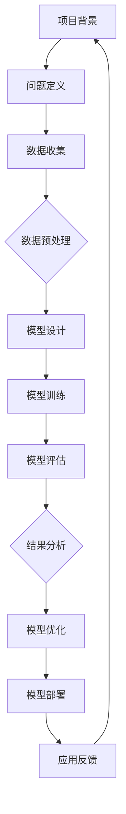

                 

## 1.1 神经系统的基本结构

神经系统的基本结构由中枢神经系统和周围神经系统组成。中枢神经系统主要包括大脑和脊髓，是神经系统的核心部分，负责处理接收的信息和下达指令。周围神经系统则包括脑神经、脊神经和自主神经系统，主要负责信息的收集和传递。

### 1.1.1 中枢神经系统的组成

大脑是中枢神经系统的核心，由大脑皮层、基底核、脑干等部分组成。

#### 大脑皮层
大脑皮层是大脑最外层的一层，负责处理高级认知功能，如思考、意识、记忆和感官处理。大脑皮层可以分为不同的区域，每个区域都有特定的功能。

#### 基底核
基底核位于大脑内部，是负责运动控制和决策的重要结构。

#### 脑干
脑干连接大脑和脊髓，负责调节基本生命功能，如呼吸、心跳和睡眠。

### 1.1.2 周围神经系统的组成

周围神经系统包括脑神经和脊神经。

#### 脑神经
脑神经从大脑出发，连接大脑和身体其他部分，共有12对，负责感官信息的收集和运动指令的传达。

#### 脊神经
脊神经从脊髓出发，分布到身体的各个部分，共有31对，负责传递感觉信息和运动指令。

#### 自主神经系统
自主神经系统是一种无意识的神经控制机制，主要控制心脏、血管和消化系统的功能。它分为交感神经系统和副交感神经系统，两者相互协调，保持体内环境的稳定。

## 1.2 神经元与突触

神经元是神经系统中最基本的单位，负责传递和处理信息。突触是神经元之间的连接点，通过电信号和化学信号传递信息。

### 1.2.1 神经元的结构

神经元主要由细胞体、树突和轴突组成。

#### 细胞体
细胞体是神经元的中心，包含细胞核和其他细胞器，负责维持神经元的正常功能。

#### 树突
树突负责接收来自其他神经元的信号，并将其传递到细胞体。

#### 轴突
轴突是神经元的延伸部分，负责将信号从一个神经元传递到另一个神经元或肌肉细胞。

### 1.2.2 突触的结构与功能

突触是神经元之间的连接点，由突触前膜、突触间隙和突触后膜组成。

#### 突触前膜
突触前膜是突触的一部分，负责释放神经递质。

#### 突触间隙
突触间隙是突触前膜和突触后膜之间的空隙，神经递质在此传递。

#### 突触后膜
突触后膜是突触的另一部分，负责接收神经递质并产生电生理反应。

## 1.3 神经递质与神经传递

神经递质是神经元之间传递信息的化学物质。根据功能，神经递质可以分为兴奋性递质和抑制性递质。

### 1.3.1 神经递质的种类

#### 兴奋性递质
兴奋性递质如谷氨酸，能增强神经元的兴奋性，导致神经元的兴奋。

#### 抑制性递质
抑制性递质如γ-氨基丁酸，能抑制神经元的兴奋性，降低神经元的兴奋性。

### 1.3.2 神经传递过程

神经传递过程可以分为以下几个步骤：

1. **神经冲动到达突触前膜**：当神经冲动到达突触前膜时，会触发神经递质的释放。

2. **神经递质的释放**：神经冲动触发突触前膜上的钙离子通道开放，导致钙离子进入突触前膜，进而触发神经递质的释放。

3. **神经递质的传输**：神经递质通过突触间隙传输到突触后膜。

4. **突触后膜的反应**：神经递质与突触后膜上的受体结合，导致突触后膜的电位变化，进而引发电生理反应。

## 1.4 大脑功能分区与神经回路

大脑是一个复杂的神经网络，不同区域有不同的功能。神经回路是指神经元之间的连接方式，它们构成了大脑处理信息的网络结构。

### 1.4.1 大脑的结构

#### 大脑皮层
大脑皮层是大脑最外层的一层，负责处理高级认知功能。大脑皮层可以分为不同的区域，每个区域都有特定的功能。

#### 基底核
基底核位于大脑内部，是负责运动控制和决策的重要结构。

#### 脑干
脑干连接大脑和脊髓，负责调节基本生命功能。

### 1.4.2 神经回路的基本概念

#### 正向通路
正向通路是指信号从感觉器官传递到大脑皮层的路径。正向通路由多个神经回路组成，每个神经回路都有特定的功能。

#### 反向通路
反向通路是指信号从大脑皮层传递回感觉器官的路径。反向通路通常用于校正和反馈。

## 小结

神经系统的基本结构包括中枢神经系统和周围神经系统。神经元是神经系统的基本单位，通过突触连接形成复杂的神经网络。神经递质在神经元之间传递信息，根据功能可以分为兴奋性递质和抑制性递质。大脑的不同区域有不同的功能，通过正向通路和反向通路实现信息传递和处理。了解神经系统的基本结构和工作原理，有助于我们深入理解认知推理模型的设计和实现。### 2.1 感知与注意

感知是大脑接收并解释外界信息的过程，而注意则是大脑选择关注特定信息的能力。这两个过程是认知过程的基础，对于理解和处理外部世界至关重要。

### 2.1.1 感知

感知是大脑接收外界信息的过程，包括视觉、听觉、嗅觉、味觉和触觉等。感知过程可以分为以下几个阶段：

1. **感觉输入**：感官器官接收外界信息，并将其转换为电信号。
2. **感觉整合**：大脑处理来自不同感官的信息，并整合成一个统一的感知体验。
3. **感觉分析**：大脑分析感知信息，识别物体的特征和属性。

感知过程中的一个重要方面是感觉阈值，即能够引起感觉的最小刺激强度。不同感官的感觉阈值不同，例如，人的听觉阈值大约在0分贝，而视觉阈值则更低。

### 2.1.2 注意

注意是大脑选择关注特定信息的能力，它是一个主动的过程，有助于我们集中精力处理最重要的信息。注意可以分为几种类型：

1. **选择性注意**：大脑选择关注特定信息，而忽略其他信息。这通常通过焦点注意（focal attention）实现，例如，在嘈杂的环境中听到一个特定声音。
2. **分配性注意**：大脑同时处理多个任务或信息。例如，在开车时同时观察路况、听音乐和与乘客交谈。

注意的机制包括：

- **集中机制**：大脑通过神经回路选择关注特定信息。
- **抑制机制**：大脑抑制不相关的信息，以避免注意力分散。

### 感知与注意的关系

感知与注意紧密相连。注意决定了大脑感知信息的范围和深度。高水平的注意可以增强感知的敏锐度，而低水平的注意可能导致感知的不完整或缺失。

例如，当我们在看一个复杂画面时，注意的集中可能会让我们专注于某个特定细节，而忽略其他部分。相反，在紧急情况下，分配性注意可以让我们同时处理多个紧急信息，如同时观察路况和准备刹车。

总的来说，感知与注意共同作用，帮助我们有效地处理外部信息，从而做出反应和决策。

### 2.2 记忆与学习

记忆与学习是认知过程中至关重要的组成部分，它们共同作用于我们如何获取、存储和应用信息。理解记忆与学习的机制对于设计高效的认知推理模型具有重要意义。

#### 2.2.1 记忆

记忆是指大脑存储和回忆信息的能力。根据存储时间的不同，记忆可以分为短期记忆和长期记忆。

1. **短期记忆**：短期记忆也称为工作记忆，是指大脑在短时间内存储和处理信息的容量有限的记忆系统。短期记忆通常用于处理即时的任务，如记住电话号码或解决数学问题。短期记忆的容量有限，一般为7±2个项目，这意味着大多数人可以同时处理大约5到9个信息片段。

2. **长期记忆**：长期记忆是指信息在较长时间内被存储和回忆的能力。长期记忆分为两种形式：陈述性记忆和程序性记忆。

   - **陈述性记忆**：涉及对事实和事件的记忆，如记住历史日期或事件的细节。这种记忆通常通过语言和语义进行编码。
   - **程序性记忆**：涉及对如何执行特定任务的记忆，如骑自行车或弹钢琴。这种记忆通常通过运动和技能进行编码。

长期记忆的形成涉及大脑中的不同区域，如海马体和前额叶皮层。记忆的保持和恢复是通过神经元之间的连接（突触）和神经活动模式的改变实现的。

#### 2.2.2 学习

学习是大脑通过经验改变其结构和工作方式的过程。学习可以通过多种方式进行，包括联想学习、条件反射和强化学习。

1. **联想学习**：通过将新信息与已有知识关联，从而学习和记忆。例如，通过重复练习来记住新的单词或公式。
   
2. **条件反射**：通过反复结合特定刺激和反应来形成条件连接。经典条件反射和操作性条件反射是两种主要的条件反射形式。

   - **经典条件反射**：刺激和反应在时间上紧密关联，如看到食物就流口水。
   - **操作性条件反射**：反应和行为后果之间的关联，如做对了题得到奖励。

3. **强化学习**：通过正面或负面后果来调整行为。在强化学习中，正面后果（如奖励）增加行为的概率，而负面后果（如惩罚）减少行为的概率。

学习过程中，大脑会通过改变神经元之间的连接强度和结构来适应新的信息。这种改变称为突触可塑性，是学习的重要机制。

### 记忆与学习的关系

记忆与学习密切相关。学习是新信息被编码和存储在长期记忆中的过程，而记忆则是学习成果的保留和再现。没有学习，记忆就不会发生；没有记忆，学习就难以巩固和应用。

例如，当我们学习新技能时，我们首先通过短期记忆记住操作步骤，然后通过重复练习将其转化为长期记忆。一旦这些步骤被存储在长期记忆中，我们就可以在没有即时指导的情况下自动执行它们。

总之，记忆与学习是大脑处理信息的核心过程，对于认知推理模型的设计具有重要意义。理解这些过程可以帮助我们构建更加有效和智能的人工智能系统。### 2.3 思维与决策

思维与决策是认知过程的两个核心方面，它们在个体处理复杂任务、解决问题和制定决策时发挥着关键作用。

#### 2.3.1 思维

思维是指大脑对信息进行加工、分析和整合的过程。思维可以分为几种类型：

1. **分析思维**：通过将问题分解成更小的部分来理解和解决问题。例如，在解决数学问题时，我们会将问题分解为多个子问题。
2. **批判性思维**：评估和分析信息，以判断其准确性和相关性。批判性思维有助于我们避免偏见和错误的信息。
3. **创造性思维**：产生新的想法和解决问题的方法。创造性思维对于科学研究、艺术创作和商业创新至关重要。

思维过程通常涉及以下步骤：

1. **信息收集**：获取与问题相关的信息。
2. **信息分析**：分析信息的含义和关系。
3. **信息整合**：将分析结果整合成一个统一的整体。

思维不仅是一种认知活动，还受到情绪、动机和经验的影响。例如，情绪可能会影响我们的判断和决策，而经验可以增强我们的思维能力。

#### 2.3.2 决策

决策是指从多个选择中做出最优选择的过程。决策通常涉及以下步骤：

1. **目标设定**：明确决策的目标和期望结果。
2. **信息收集**：收集与决策相关的信息。
3. **方案评估**：评估每个方案的优缺点。
4. **选择**：根据评估结果选择最佳方案。
5. **执行**：实施决策方案。
6. **反馈**：评估决策结果，并根据反馈调整未来的决策。

决策过程中，我们需要考虑多种因素，包括：

- **风险与收益**：每个决策都有可能带来的风险和收益。
- **时间限制**：决策需要在特定时间内做出。
- **个人偏好**：决策者的个人偏好和价值观也会影响决策。

决策模型可以分为几种类型：

1. **确定性模型**：在已知所有信息和结果的情况下做出决策。
2. **风险模型**：在不确定性条件下，通过概率分析做出决策。
3. **博弈模型**：在多个参与者的情况下，通过策略分析做出决策。

#### 思维与决策的关系

思维与决策紧密相连。思维是决策的基础，通过分析信息和评估选项，帮助我们做出明智的决策。决策则需要通过思维过程来处理复杂的问题，从而选择最佳方案。

例如，在商业决策中，分析市场趋势、评估竞争对手和预测未来需求都是通过思维来完成的。而最终的决策，如投资、产品开发和市场营销策略，则是基于这些分析结果做出的。

总之，思维与决策是认知过程的两个重要方面，对于个体和人工智能系统来说都至关重要。理解这些过程及其相互关系，有助于我们设计更加智能和高效的认知推理模型。### 2.4 情感与情绪

情感与情绪是认知过程中不可或缺的组成部分，它们不仅影响我们的思维和决策，还在日常生活中起着关键作用。情感是指我们对特定事物或情境的主观感受，而情绪则是情感的具体表现，通常以生理反应和情绪体验为特征。

#### 2.4.1 情感的类型

情感可以分为多种类型，包括愉悦、悲伤、愤怒、恐惧、惊讶和厌恶等。每种情感都有其特定的生物学基础和神经机制。

1. **愉悦**：愉悦是一种积极的情感，通常与奖赏和满足相关。大脑中的奖赏系统，特别是多巴胺的释放，与愉悦感密切相关。
2. **悲伤**：悲伤是一种消极的情感，通常与失去、痛苦或挫败相关。悲伤的生理反应包括流泪、情绪低落和食欲下降。
3. **愤怒**：愤怒是一种强烈的情感，通常与威胁、侵犯或不公正相关。愤怒的生理反应包括心跳加速、血压上升和肌肉紧张。
4. **恐惧**：恐惧是一种保护性情感，通常与潜在的危险或威胁相关。恐惧的生理反应包括心跳加速、呼吸急促和出汗。
5. **惊讶**：惊讶是一种意外的情感，通常与出乎意料的事件或信息相关。惊讶的生理反应包括瞳孔扩张和神经系统的激活。
6. **厌恶**：厌恶是一种排斥性情感，通常与不适、不洁或有害相关。厌恶的生理反应包括胃部不适、呼吸急促和面部表情的变化。

#### 2.4.2 情绪的机制

情绪的产生和调节涉及多个大脑区域，包括边缘系统、前额叶皮层和杏仁核等。边缘系统主要负责情绪的初始反应，而前额叶皮层则负责情绪的调控和理性思考。

1. **边缘系统**：边缘系统是情绪处理的核心区域，包括杏仁核、海马体和下丘脑等。杏仁核特别重要，它与恐惧和愤怒等情绪密切相关。
2. **前额叶皮层**：前额叶皮层负责高级认知功能，如决策、规划和情绪调控。它可以通过调节边缘系统的活动来抑制或增强情绪反应。
3. **杏仁核**：杏仁核是情绪处理的早期中心，特别与恐惧和愤怒等情绪相关。它通过神经递质如去甲肾上腺素和5-羟色胺来调节情绪反应。

#### 情感与情绪的关系

情感与情绪之间存在着密切的关系。情感是情绪的基础，情绪则是情感的外在表现。情感通常涉及主观感受和内在体验，而情绪则表现为生理反应和行为表现。

例如，当我们面对一个令人愉悦的情境时，我们可能会感到开心和满足，这些感受就是情感。而我们的脸部表情、身体姿态和生理反应（如微笑和放松）则是情绪的表现。

情感与情绪不仅影响我们的主观体验，还影响我们的认知和决策。积极的情感可以提高我们的认知灵活性，而消极的情感则可能导致认知狭窄和决策困难。

总之，情感与情绪是认知过程中的重要方面，它们不仅影响我们的思维和决策，还在我们的日常生活和心理健康中起着关键作用。理解这些机制有助于我们更好地设计认知推理模型，使其能够更好地模拟和理解人类的情感和行为。### 3.1 认知推理的定义与特点

认知推理是指人类或人工智能系统通过逻辑思维、归纳推理、演绎推理等认知过程，对信息进行加工、分析和整合，从而解决复杂问题或做出决策的能力。认知推理模型是模拟人类思维过程的一种人工智能方法，旨在理解和解释人类的认知机制，并将其应用于实际问题和任务中。

### 3.1.1 认知推理的定义

认知推理涉及多个认知过程，包括感知、记忆、注意、思维和情感等。它是一种基于符号处理的方法，使用符号（如文字、数字、图像等）来表示知识和信息，并通过推理规则对这些符号进行操作，从而得出结论或解决方案。

认知推理的定义可以从以下几个方面来理解：

1. **符号表示**：认知推理依赖于符号表示，这些符号可以是语言符号、图形符号或其他形式的抽象表示。
2. **信息加工**：认知推理通过感知、记忆和注意等认知过程，对输入的信息进行加工和处理。
3. **推理规则**：认知推理使用一系列推理规则，如逻辑规则、概率规则和统计规则等，来引导符号操作，从而得出结论。
4. **问题解决**：认知推理的核心目标是解决复杂问题或实现特定目标，这通常涉及多步骤的推理过程。

### 3.1.2 认知推理的特点

认知推理具有以下几个特点：

1. **复杂性**：认知推理涉及多个认知过程，处理的信息量大，问题解决过程复杂。
2. **符号性**：认知推理使用符号来表示知识和信息，这使得它可以应用于多种不同的领域和问题。
3. **智能性**：认知推理模拟人类思维过程，具有较高的智能水平，能够进行逻辑推理、归纳和演绎等高级认知活动。
4. **适应性**：认知推理可以根据不同的任务和环境调整其推理策略，以适应复杂和变化的问题场景。
5. **交互性**：认知推理模型通常与用户进行交互，通过理解用户的意图和需求，提供个性化的解决方案。

### 认知推理的特点表格

| 特点             | 说明                                                         |
|------------------|--------------------------------------------------------------|
| 复杂性           | 认知推理涉及多个认知过程，问题解决过程复杂                     |
| 符号性           | 使用符号来表示知识和信息，适用于多种领域和问题                 |
| 智能性           | 模拟人类思维过程，进行逻辑推理、归纳和演绎等高级认知活动       |
| 适应性           | 根据不同任务和环境调整推理策略，适应复杂和变化的问题场景       |
| 交互性           | 与用户进行交互，理解用户意图和需求，提供个性化解决方案           |

### 认知推理的ER实体关系图

认知推理涉及多个实体和关系，以下是一个简化的ER实体关系图，展示了这些实体及其之间的关系：

```
+----------------+     +----------------+     +----------------+
|    感知         |     |     记忆         |     |    注意         |
+----------------+     +----------------+     +----------------+
| - 信息加工     |<----| - 信息存储     |<----| - 信息筛选     |
+----------------+     +----------------+     +----------------+
        ^                ^                ^
        |                |                |
+----------------+     +----------------+     +----------------+
|    思维         |     |    情感         |     |    决策         |
+----------------+     +----------------+     +----------------+
| - 逻辑推理     |<----| - 情绪体验     |<----| - 目标设定     |
+----------------+     +----------------+     +----------------+
        ^                ^                ^
        |                |                |
+----------------+     +----------------+     +----------------+
|    推理规则     |     |    知识表示     |     |    策略调整     |
+----------------+     +----------------+     +----------------+
| - 归纳推理     |<----| - 概念关联     |<----| - 反馈机制     |
+----------------+     +----------------+     +----------------+
```

这个ER实体关系图展示了认知推理的核心实体及其之间的关系，包括感知、记忆、注意、思维、情感和决策等。每个实体都与其他实体通过不同的关系进行交互，共同实现复杂的认知推理过程。### 3.2 认知推理模型的发展历程

认知推理模型的发展历程可以追溯到上世纪50年代，当时人工智能（AI）领域刚刚起步。从那时起，认知推理模型经历了多个阶段，每个阶段都带来了新的理论、方法和技术，使得认知推理在理论上更加完备，应用上更加广泛。

#### 3.2.1 第一阶段：符号逻辑与规则推理

在人工智能的早期阶段，符号逻辑和规则推理是主要的认知推理模型。这种模型基于形式逻辑，使用符号和规则来表示知识和推理过程。

1. **基于符号逻辑的推理**：这种模型使用命题逻辑和谓词逻辑来表示知识和推理。例如，使用命题P和Q来表示事实，并使用推理规则如“如果P，则Q”来推导新的结论。
2. **基于规则的推理**：这种模型使用一组规则来表示知识和推理。规则通常采用“如果...则...”的形式，例如，“如果患者有发烧和咳嗽，则可能患有感冒”。

这一阶段的代表工作包括爱德华·阿瑟·李·费根鲍姆（Edward A. Feigenbaum）等人开发的Dendral系统，该系统用于化学分析，展示了基于规则的推理在复杂问题解决中的潜力。

#### 3.2.2 第二阶段：基于知识的推理

随着人工智能领域的发展，基于知识的推理模型开始出现。这种模型通过组织和管理大量知识，利用推理规则来解决问题。

1. **知识表示**：这一阶段的重点在于如何有效地表示知识。常用的知识表示方法包括框架表示、产生式表示和语义网络表示等。
2. **推理方法**：基于知识的推理模型使用推理方法来处理知识，例如推理机（Inference Engine）和专家系统（Expert Systems）。

专家系统是这一阶段的代表性工作，它通过模拟人类专家的知识和推理能力，用于解决特定的领域问题。例如，MYCIN系统是一个用于医学诊断的专家系统，它通过基于规则的推理来诊断细菌感染。

#### 3.2.3 第三阶段：基于模型的推理

随着机器学习和深度学习技术的发展，基于模型的推理模型开始兴起。这种模型通过学习数据中的模式和关系，自动生成推理规则和知识。

1. **机器学习**：机器学习方法通过训练大量数据，学习数据的分布和模式，然后使用这些模式来推理未知数据。常见的机器学习方法包括决策树、支持向量机和神经网络等。
2. **深度学习**：深度学习是机器学习的一个分支，它通过多层神经网络来学习复杂的函数映射。深度学习在图像识别、语音识别和自然语言处理等领域取得了显著的成果。

基于模型的推理模型的代表工作包括谷歌的AlphaGo，它通过深度学习和强化学习，在围棋游戏中击败了人类世界冠军。AlphaGo的成功展示了基于模型的推理模型在复杂问题解决中的潜力。

#### 3.2.4 当前趋势：神经科学与认知推理的结合

近年来，神经科学的研究成果开始对认知推理模型的发展产生深远影响。通过将神经科学原理与人工智能技术相结合，研究者们试图构建更加真实和高效的认知推理模型。

1. **神经科学的启示**：神经科学研究揭示了大脑的认知过程和神经网络的运行机制，这些成果为认知推理模型的设计提供了新的思路和方法。
2. **神经网络的应用**：神经网络，特别是深度神经网络，已经成为认知推理模型的主要工具。深度神经网络通过模仿大脑的神经网络结构，能够高效地处理复杂数据和学习复杂的模式。

当前的研究趋势表明，认知推理模型的发展将继续融合神经科学和人工智能技术，通过不断探索和创新，构建更加智能和高效的认知推理系统。### 3.3 认知推理模型的关键技术

认知推理模型的关键技术涵盖了知识表示、推理算法和模型优化等多个方面。这些技术共同作用，使得认知推理模型能够有效地处理复杂问题，并在实际应用中表现出色。

#### 3.3.1 知识表示

知识表示是认知推理模型的核心，它决定了模型如何存储、组织和利用信息。以下是一些常见的知识表示方法：

1. **基于符号的逻辑表示**：这种方法使用形式逻辑来表示知识和推理过程。符号逻辑包括命题逻辑和谓词逻辑，它们可以精确地描述事实和推理规则。例如，使用命题P和Q来表示事实，并使用推理规则“如果P，则Q”来推导新的结论。

2. **框架表示**：框架表示是一种结构化的知识表示方法，它将知识组织成一系列的框架和槽位。每个框架代表一个概念，而槽位则代表该概念的不同属性。这种方法常用于自然语言理解和问题解决。

3. **产生式表示**：产生式表示使用“如果...则...”的形式来表示规则。每个产生式包含一个前提和一个结论，当前提为真时，结论也被认为是真的。这种方法常用于专家系统和规则推理。

4. **语义网络表示**：语义网络使用节点和边来表示概念及其关系。节点代表概念，边代表概念之间的关系。这种方法可以很好地表示概念间的复杂关系和语义信息。

#### 3.3.2 推理算法

推理算法是认知推理模型的核心，它负责根据知识表示来推导新的结论。以下是一些常见的推理算法：

1. **基于规则的推理**：这种方法使用一组规则来表示知识和推理过程。推理算法通过匹配规则的前提并应用结论来推导新的信息。常见的推理算法包括前向推理和后向推理。

   - **前向推理**：从已知事实出发，逐步推导出新的结论。
   - **后向推理**：从目标出发，逐步推导出达到目标所需的前提。

2. **基于模型的推理**：这种方法使用模型来表示知识和推理过程。模型可以是统计模型、神经网络或逻辑模型等。推理算法通过训练数据来学习模型的参数，并使用模型来预测未知数据。

3. **模糊推理**：模糊推理用于处理不确定性问题。它使用模糊逻辑来表示知识和推理过程，通过模糊规则来推导新的结论。

4. **混合推理**：混合推理结合了多种推理方法，以弥补单一方法的不足。例如，结合基于规则的推理和基于模型的推理，以同时利用规则的知识表达能力和模型的学习能力。

#### 3.3.3 模型优化

模型优化是提高认知推理模型性能的重要手段。以下是一些常见的模型优化方法：

1. **模型调参**：通过调整模型的参数来优化性能。这通常涉及使用启发式方法或优化算法，如梯度下降和遗传算法。

2. **特征选择**：通过选择最重要的特征来简化模型，提高推理效率和准确性。特征选择方法包括信息增益、卡方检验和L1正则化等。

3. **模型融合**：通过结合多个模型来提高整体性能。模型融合方法包括投票法、加权平均法和堆叠法等。

4. **在线学习**：通过实时更新模型来适应新的数据和需求。在线学习方法包括增量学习和自适应学习等。

综上所述，知识表示、推理算法和模型优化是认知推理模型的关键技术。通过合理地选择和组合这些技术，可以构建出高效、准确和灵活的认知推理模型，为复杂问题解决提供强有力的支持。### 4.1 神经科学原理在认知推理模型设计中的引入

神经科学原理在认知推理模型设计中的应用，使得这些模型能够更好地模拟和增强人类认知能力。以下将介绍神经科学原理在认知推理模型设计中的几个关键方面，包括神经网络的结构与功能、神经递质的作用以及神经回路的机制。

#### 4.1.1 神经网络的结构与功能

神经网络是认知推理模型设计中的重要组件，它们模仿了大脑神经元网络的结构和功能。神经网络由大量相互连接的节点（或称为“神经元”）组成，每个节点接收来自其他节点的输入信号，并通过激活函数产生输出。

1. **神经元结构与功能**：每个神经元包含细胞体、树突和轴突。树突接收其他神经元传递的信号，轴突传递信号到其他神经元或目标细胞。神经元的激活由输入信号的强度决定，当输入信号超过阈值时，神经元会激活并传递信号。

2. **神经网络结构**：神经网络可以分为多种类型，包括前馈神经网络、卷积神经网络（CNN）和循环神经网络（RNN）等。前馈神经网络是单向流动的网络，信息从输入层传递到输出层。卷积神经网络特别适用于图像处理，它通过卷积层提取图像的特征。循环神经网络适用于序列数据处理，它通过循环结构保持对过去信息的记忆。

3. **神经网络功能**：神经网络通过学习输入和输出之间的关系，能够自动提取特征和模式。在认知推理模型中，神经网络可以用于图像识别、语音识别、自然语言处理和决策支持等任务。

#### 4.1.2 神经递质的作用

神经递质是神经元之间传递信息的化学物质，它们在认知推理模型中扮演着关键角色。神经递质分为兴奋性递质和抑制性递质，它们决定了神经信号的传递方向和强度。

1. **兴奋性递质**：兴奋性递质如谷氨酸（Glutamate）和天冬氨酸（Aspartate）增强神经元的兴奋性。当神经递质与突触后膜上的受体结合时，会引发钠离子通道打开，导致神经元去极化，从而传递信号。

2. **抑制性递质**：抑制性递质如γ-氨基丁酸（GABA）和甘氨酸（Glycine）抑制神经元的兴奋性。当神经递质与突触后膜上的受体结合时，会引发氯离子通道打开，导致神经元超极化，从而抑制信号传递。

3. **神经递质作用机制**：神经递质通过突触前膜释放，进入突触间隙，并与突触后膜上的特异性受体结合。这种结合导致突触后膜的电生理反应，如去极化或超极化，从而影响神经元的激活状态。

#### 4.1.3 神经回路的机制

神经回路是神经元之间的连接路径，它们构成了大脑神经网络的基础。神经回路在认知推理模型中扮演着信息处理和模式识别的关键角色。

1. **正向通路**：正向通路是指信息从感觉器官传递到大脑皮层的路径。正向通路中的每个神经元和突触都参与了信息传递和处理，从而实现对感觉信息的分析和整合。

2. **反向通路**：反向通路是指信号从大脑皮层传递回感觉器官的路径。反向通路通常用于校正和反馈，帮助调整和优化感觉信息的处理。

3. **神经回路的功能**：神经回路可以形成复杂的网络结构，实现信息的多级加工和处理。在认知推理模型中，神经回路可以用于实现从感知到决策的全过程，如视觉识别、情感分析、语言理解和决策支持。

#### 4.1.4 神经科学原理在认知推理模型中的应用

通过将神经科学原理应用于认知推理模型的设计，可以构建出更加真实和高效的模型。

1. **神经网络的建模**：基于神经科学的神经网络模型可以更好地模拟人类大脑的处理过程。例如，深度学习模型中的卷积神经网络（CNN）和循环神经网络（RNN）分别模仿了视觉和语言处理中的神经回路。

2. **神经递质与学习规则**：神经递质的作用机制可以用于设计基于神经科学的机器学习算法。例如，使用反向传播算法调整神经网络的权重，模拟神经递质在突触可塑性中的作用。

3. **神经回路的实现**：在认知推理模型中，可以使用神经回路的概念来构建复杂的信息处理网络。例如，在自然语言处理中，可以使用RNN来模拟语言处理中的正向和反向通路。

总之，神经科学原理在认知推理模型设计中的应用，不仅提供了理论支持，还推动了模型技术的发展。通过结合神经科学与人工智能技术，我们可以构建出更加智能和高效的认知推理系统，为复杂问题解决提供强大的工具。### 4.2 基于神经科学的认知推理算法设计

基于神经科学的认知推理算法设计旨在模拟人类大脑的神经活动，通过神经网络结构和学习规则，实现高效的信息处理和决策。以下将详细探讨这些算法的设计原则、核心步骤和实现方法。

#### 4.2.1 设计原则

1. **神经可塑性**：神经网络需要具备可塑性，即能够根据输入数据的模式自动调整其结构和参数。这类似于人类大脑在学习新知识或技能时，通过改变神经元之间的连接强度来实现适应。

2. **自适应学习**：算法需要能够自适应地调整学习规则，以适应不同的数据和任务。例如，在自然语言处理中，算法需要能够调整词汇权重和语法规则，以适应不同的语言环境。

3. **并行处理**：神经网络能够并行处理大量数据，这使得算法在处理大规模数据时具有高效性。人类大脑也是通过并行处理来快速分析和整合大量信息。

4. **层次化结构**：神经网络通常采用层次化结构，从底层提取基本特征，到高层形成抽象概念。这类似于人类大脑在感知过程中，从感知到认知的过程。

#### 4.2.2 核心步骤

1. **数据预处理**：首先对输入数据进行预处理，包括数据清洗、归一化和特征提取。这一步骤确保数据适合神经网络的学习过程。

2. **神经网络结构设计**：设计神经网络的结构，包括选择合适的网络类型（如前馈网络、卷积网络或循环网络）、层数、神经元数量和连接方式。结构设计需要考虑任务需求和计算资源。

3. **初始化权重和偏置**：为神经网络初始化权重和偏置，通常使用随机初始化方法。这些参数将在学习过程中根据数据进行调整。

4. **学习过程**：使用训练数据对神经网络进行训练，通过反向传播算法更新权重和偏置。学习过程中，神经网络会不断调整其参数，以最小化预测误差。

5. **验证和测试**：在验证集和测试集上评估网络性能，确保其泛化能力。通过调整学习率和正则化参数，优化网络性能。

6. **模型部署**：将训练好的模型部署到实际应用中，进行实时数据分析和决策。

#### 4.2.3 实现方法

1. **神经网络模型选择**：根据任务需求，选择合适的神经网络模型。例如，对于图像识别任务，可以采用卷积神经网络（CNN）；对于序列数据处理，可以采用循环神经网络（RNN）或长短期记忆网络（LSTM）。

2. **反向传播算法**：反向传播算法是一种常用的学习算法，通过计算预测误差的梯度，更新网络的权重和偏置。具体步骤如下：

   - **前向传播**：计算输入数据通过网络的输出。
   - **计算误差**：计算实际输出与预期输出之间的误差。
   - **后向传播**：通过误差的梯度，反向更新网络的权重和偏置。
   - **优化参数**：使用优化算法（如梯度下降）调整参数，以最小化误差。

3. **超参数调整**：超参数包括学习率、批量大小、隐藏层大小等。通过交叉验证和网格搜索等方法，选择最佳的超参数组合。

4. **正则化技术**：为了防止过拟合，可以采用正则化技术，如L1正则化和L2正则化。这些技术通过在损失函数中添加惩罚项，限制模型的复杂度。

5. **模型评估与优化**：使用验证集和测试集评估模型性能，根据评估结果调整模型结构和参数。常见的评估指标包括准确率、召回率、F1分数等。

总之，基于神经科学的认知推理算法设计通过模拟大脑的神经活动，实现了高效的信息处理和决策。通过合理设计神经网络结构和学习规则，可以构建出强大的认知推理系统，为复杂问题解决提供支持。### 4.3 神经网络在认知推理中的应用

神经网络，特别是深度学习神经网络，已经在认知推理领域取得了显著的成果。通过模仿大脑的神经网络结构，深度学习神经网络能够自动提取复杂的数据特征，并在各种认知任务中表现出色。以下将介绍神经网络在认知推理中的几个主要应用领域，以及相关的案例研究。

#### 4.3.1 图像识别

图像识别是神经网络在认知推理中最早和最广泛应用的领域之一。卷积神经网络（CNN）在图像识别任务中表现出色，能够自动提取图像中的局部特征，并形成全局理解。

**案例研究**：谷歌的Inception网络是图像识别领域的一个里程碑。Inception网络通过使用多个卷积层和池化层，实现了高效的图像特征提取和分类。在ImageNet图像识别挑战中，Inception网络达到了卓越的性能，大大超过了传统机器学习方法。

**实现方法**：在实现图像识别时，通常首先对图像进行预处理，包括归一化和裁剪。然后，将预处理后的图像输入到CNN模型中，模型通过多个卷积层和池化层提取图像特征，最后使用全连接层进行分类。反向传播算法用于训练模型，通过不断调整网络权重，减小预测误差。

#### 4.3.2 自然语言处理

自然语言处理（NLP）是另一个深度学习神经网络广泛应用的领域。循环神经网络（RNN）和长短期记忆网络（LSTM）在处理序列数据，如文本和语音，方面表现出色。

**案例研究**：谷歌的BERT模型是一个基于Transformer架构的预训练语言模型，它在各种NLP任务中取得了卓越的性能。BERT模型通过在大量文本上进行预训练，学习到了丰富的语言知识和上下文信息，从而在文本分类、问答系统和机器翻译等任务中表现出色。

**实现方法**：在实现NLP任务时，首先对文本进行预处理，包括分词、词干提取和词向量化。然后，将预处理后的文本输入到RNN或LSTM模型中，模型通过处理序列数据，提取文本中的语义信息。例如，在文本分类任务中，模型通过处理文本序列，输出每个类别的概率分布。反向传播算法用于训练模型，通过不断调整网络权重，提高分类准确性。

#### 4.3.3 情感分析

情感分析是利用自然语言处理技术，对文本中表达的情感进行分类和识别的任务。深度学习神经网络在情感分析中表现出色，能够自动提取情感特征，并实现高精度的分类。

**案例研究**：Facebook的sentibert模型是一个基于BERT的预训练模型，专门用于情感分析任务。sentibert模型通过在大量情感标注的数据上进行预训练，学习到了丰富的情感特征，从而在情感分类任务中表现出色。

**实现方法**：在实现情感分析时，首先对文本进行预处理，包括分词、词干提取和情感词典标注。然后，将预处理后的文本输入到sentibert模型中，模型通过处理文本序列，输出每个情感类别的概率分布。反向传播算法用于训练模型，通过不断调整网络权重，提高情感分类的准确性。

#### 4.3.4 决策支持系统

决策支持系统（DSS）是一种利用人工智能技术，帮助人们做出有效决策的系统。神经网络在决策支持系统中可以用于预测分析、风险评估和优化决策等方面。

**案例研究**：微软的C3.ai平台是一个基于深度学习和机器学习的决策支持系统，用于预测和分析企业的运营情况。C3.ai平台通过使用神经网络，实现了销售预测、库存管理和供应链优化等功能。

**实现方法**：在实现决策支持系统时，首先收集和预处理与决策相关的数据，包括历史销售数据、市场需求和供应链信息等。然后，将预处理后的数据输入到神经网络模型中，模型通过学习数据中的模式和关系，生成预测结果和决策建议。反向传播算法用于训练模型，通过不断调整网络权重，提高预测和决策的准确性。

总之，神经网络在认知推理领域具有广泛的应用，通过模仿大脑的神经网络结构，神经网络能够自动提取复杂的数据特征，并在图像识别、自然语言处理、情感分析和决策支持等任务中表现出色。通过不断优化神经网络结构和学习算法，我们可以构建出更加智能和高效的认知推理系统，为复杂问题解决提供强大的支持。### 5.1 人类认知与人工智能的对比分析

人类认知和人工智能在信息处理、学习机制、推理能力等方面存在显著差异，但也存在一些相似之处。以下将对人类认知与人工智能进行对比分析。

#### 5.1.1 信息处理

**人类认知**：人类通过感官接收外界信息，经过大脑的处理和分析，形成对世界的认知。大脑的信息处理过程是非线性的、动态的，能够处理模糊和不确定的信息，并通过经验和直觉进行决策。

**人工智能**：人工智能通过算法和模型处理数据，其信息处理过程是线性的、静态的，依赖于明确的输入和输出格式。尽管近年来深度学习等技术的进步使得人工智能能够处理复杂和不确定的信息，但其处理能力仍然受限于算法和数据的限制。

#### 5.1.2 学习机制

**人类认知**：人类的学习机制包括感知、记忆、思维和情感等多个方面。学习过程是动态的，通过不断的试错和经验积累，人类能够适应复杂多变的环境。

**人工智能**：人工智能的学习机制主要基于统计学习和机器学习。通过训练大量数据，人工智能模型能够自动提取特征和模式，提高任务完成率。尽管深度学习等技术能够模拟部分人类学习过程，但人工智能的学习仍然是基于数据和算法的，缺乏真正的“理解”能力。

#### 5.1.3 推理能力

**人类认知**：人类的推理能力是高度灵活和复杂的，能够进行逻辑推理、类比推理和创造性思维等。人类通过整合多种感官信息，进行跨领域的推理和决策。

**人工智能**：人工智能的推理能力主要基于符号推理和基于模型的推理。尽管近年来深度学习等技术的进步使得人工智能能够在特定领域内进行高效的推理，但其推理能力仍然受限于特定任务和场景。

#### 5.1.4 相似之处

**1. 信息整合能力**：人类和人工智能都能够整合多种信息来源，形成对世界的整体认知。人类通过多种感官获取信息，人工智能则通过数据输入和算法处理。

**2. 学习能力**：虽然学习机制不同，但人类和人工智能都能够通过学习和训练提高自身能力。人类通过经验和教育学习，人工智能则通过数据训练和算法优化。

**3. 推理过程**：在特定领域内，人类和人工智能的推理过程都具有一定的相似性。例如，在逻辑推理和数学问题解决中，人类和人工智能都可以通过逐步推理和验证得到正确答案。

#### 5.1.5 总结

人类认知和人工智能在信息处理、学习机制和推理能力等方面存在显著差异，但也有一些相似之处。人类认知的复杂性和灵活性使其在处理模糊和不确定信息方面具有优势，而人工智能则在处理结构化和规则化的任务中表现出色。通过结合人类认知和人工智能的优势，我们可以构建出更加智能和高效的认知推理系统，为复杂问题解决提供支持。### 5.2 基于神经网络的情感分析模型

情感分析是自然语言处理（NLP）的一个重要分支，其目的是从文本中提取情感信息，判断文本的情感倾向，如正面、负面或中性。基于神经网络的情感分析模型在近年来取得了显著进展，通过模仿人类大脑的神经网络结构和学习机制，实现了高精度的情感分类。以下将详细介绍基于神经网络的情感分析模型的设计、实现和评估过程。

#### 5.2.1 模型设计

情感分析模型的设计主要涉及数据预处理、模型架构选择和训练过程。

1. **数据预处理**：
   - **文本清洗**：去除文本中的停用词、标点符号和特殊字符，保持文本的简洁性。
   - **分词**：将文本分解为单词或词组，为后续的词向量表示做准备。
   - **词向量表示**：将文本转换为数值形式，常用的方法包括Word2Vec、GloVe和BERT等。这些方法能够捕捉文本中的语义信息，将单词表示为密集的向量。

2. **模型架构选择**：
   - **卷积神经网络（CNN）**：CNN在图像处理中表现出色，通过卷积层和池化层提取文本的局部特征，能够有效处理序列数据。
   - **循环神经网络（RNN）**：RNN能够处理变长的序列数据，通过隐藏状态记忆过去的信息，适用于处理文本数据。
   - **长短期记忆网络（LSTM）**：LSTM是RNN的一个变体，通过门控机制有效地解决了RNN的梯度消失问题，适用于长文本的情感分析。

3. **训练过程**：
   - **损失函数**：通常使用交叉熵损失函数来评估模型预测与真实标签之间的差距，通过反向传播算法不断调整模型参数。
   - **优化器**：选择合适的优化器，如Adam优化器，以加速模型收敛。
   - **正则化**：为了防止过拟合，可以采用正则化技术，如Dropout和L2正则化。

#### 5.2.2 模型实现

以下是一个简单的基于LSTM的情感分析模型的实现过程：

```python
import numpy as np
from tensorflow.keras.preprocessing.sequence import pad_sequences
from tensorflow.keras.models import Sequential
from tensorflow.keras.layers import Embedding, LSTM, Dense, Bidirectional

# 假设我们已经完成了数据预处理，得到词向量表示和标签
X = pad_sequences(word_vectors, maxlen=max_sequence_length)
y = np.array(labels)

# 创建模型
model = Sequential()
model.add(Bidirectional(LSTM(units=128, return_sequences=True), input_shape=(max_sequence_length, embedding_vector_length)))
model.add(Bidirectional(LSTM(units=64)))
model.add(Dense(1, activation='sigmoid'))

# 编译模型
model.compile(optimizer='adam', loss='binary_crossentropy', metrics=['accuracy'])

# 训练模型
model.fit(X, y, epochs=10, batch_size=32, validation_split=0.1)
```

#### 5.2.3 模型评估

模型评估是确保模型性能的重要步骤，常用的评估指标包括准确率、召回率、F1分数和精确率等。

1. **准确率**：预测正确的样本数占总样本数的比例，反映了模型的总体性能。
2. **召回率**：实际为正类别的样本中被正确预测为正类别的比例，反映了模型对正类别的识别能力。
3. **F1分数**：精确率和召回率的调和平均数，综合考虑了模型的精确性和召回率。
4. **精确率**：预测为正类别的样本中被正确预测为正类别的比例，反映了模型对负类别的识别能力。

以下是一个简单的评估过程：

```python
from sklearn.metrics import classification_report

# 假设我们已经完成了模型预测，得到预测标签
y_pred = model.predict(X_test)

# 将预测标签转换为二值形式
y_pred = (y_pred > 0.5)

# 生成分类报告
print(classification_report(y_test, y_pred))
```

#### 5.2.4 总结

基于神经网络的情感分析模型通过模仿人类大脑的神经网络结构和学习机制，实现了高精度的情感分类。通过合理的设计和实现，这些模型在社交媒体分析、客户反馈分析和舆情监测等应用中表现出色，为情感分析领域的发展做出了重要贡献。### 5.3 基于神经科学的决策支持系统

基于神经科学的决策支持系统（DSS）旨在利用神经科学原理和人工智能技术，模拟人类大脑的决策过程，提供更加准确和高效的决策支持。以下将详细介绍基于神经科学的决策支持系统的设计、实现和应用案例。

#### 5.3.1 系统设计

基于神经科学的决策支持系统设计包括以下几个关键方面：

1. **数据收集与预处理**：系统首先需要收集与决策相关的数据，包括历史决策数据、市场数据、用户行为数据等。这些数据需要经过清洗、归一化和特征提取等预处理步骤，以确保数据的准确性和一致性。

2. **神经网络架构设计**：系统使用神经网络架构来模拟人类大脑的决策过程。常见的神经网络架构包括卷积神经网络（CNN）和循环神经网络（RNN）。CNN适用于处理图像和视觉数据，而RNN适用于处理序列数据和文本数据。

3. **神经网络训练**：通过大量训练数据，神经网络可以学习到数据中的模式和关系，从而提高决策的准确性和效率。训练过程通常涉及多层神经网络，通过反向传播算法不断调整网络权重，以最小化预测误差。

4. **决策规则生成**：基于训练好的神经网络，系统可以生成一系列决策规则，用于辅助决策者做出决策。这些决策规则可以是基于逻辑规则、概率规则或统计规则的形式。

5. **用户界面设计**：系统需要提供一个直观和易于使用的用户界面，使决策者能够轻松地访问和操作系统。用户界面应包括数据展示、预测分析和决策建议等功能。

#### 5.3.2 系统实现

以下是一个简单的基于神经科学的决策支持系统的实现过程：

```python
import tensorflow as tf
from tensorflow.keras.models import Sequential
from tensorflow.keras.layers import Dense, LSTM
from sklearn.model_selection import train_test_split

# 假设我们已经完成了数据预处理，得到特征矩阵X和标签y
X_train, X_test, y_train, y_test = train_test_split(X, y, test_size=0.2, random_state=42)

# 创建模型
model = Sequential()
model.add(LSTM(units=128, return_sequences=True, input_shape=(X_train.shape[1], X_train.shape[2])))
model.add(LSTM(units=64))
model.add(Dense(1, activation='sigmoid'))

# 编译模型
model.compile(optimizer='adam', loss='binary_crossentropy', metrics=['accuracy'])

# 训练模型
model.fit(X_train, y_train, epochs=10, batch_size=32, validation_data=(X_test, y_test))
```

#### 5.3.3 应用案例

基于神经科学的决策支持系统在多个领域都有广泛的应用，以下是一些典型的应用案例：

1. **金融领域**：在金融领域，基于神经科学的决策支持系统可以用于股票市场预测、风险管理和投资策略优化。通过分析历史交易数据和市场趋势，系统可以提供实时的决策建议，帮助投资者做出更明智的决策。

2. **医疗健康领域**：在医疗健康领域，基于神经科学的决策支持系统可以用于疾病诊断、治疗方案推荐和健康风险评估。通过分析病人的病历数据和生理指标，系统可以提供个性化的医疗建议，提高诊断和治疗的准确性。

3. **交通运输领域**：在交通运输领域，基于神经科学的决策支持系统可以用于交通流量预测、路线规划和交通管理。通过分析交通数据和历史事件，系统可以优化交通信号灯控制，减少拥堵和事故风险。

4. **企业管理**：在企业管理领域，基于神经科学的决策支持系统可以用于市场营销策略制定、客户行为分析和供应链管理。通过分析市场数据和用户行为数据，系统可以提供有效的决策建议，提高企业的运营效率和竞争力。

总之，基于神经科学的决策支持系统通过模拟人类大脑的决策过程，为复杂问题解决提供了强大的工具。随着神经科学和人工智能技术的不断进步，这些系统将越来越多地应用于各个领域，为决策者提供更加准确和高效的决策支持。### 5.4 神经科学在智能医疗中的应用

神经科学在智能医疗领域的应用正逐渐成为医疗技术发展的重要驱动力，通过人工智能和深度学习技术，神经系统科学的研究成果被转化为实际医疗应用，提升了医疗诊断、治疗和患者管理的效果。

#### 5.4.1 神经影像分析

神经影像分析是神经科学在智能医疗中的一个重要应用领域。通过磁共振成像（MRI）、计算机断层扫描（CT）和正电子发射断层扫描（PET）等技术，医生可以获得患者大脑的详细图像。深度学习算法，特别是卷积神经网络（CNN）和生成对抗网络（GAN），被用于分析这些影像数据，以帮助诊断神经系统疾病。

**案例研究**：
- **癫痫监测**：通过分析MRI数据，CNN模型可以识别出癫痫发作的脑区，从而帮助医生进行早期诊断和治疗。
- **脑肿瘤识别**：使用CNN对MRI图像进行训练，可以提高脑肿瘤识别的准确率，帮助医生更早地发现并治疗脑肿瘤。

#### 5.4.2 神经信号处理

神经信号处理涉及记录和分析大脑的电活动，如脑电图（EEG）和功能性磁共振成像（fMRI）。这些信号包含了大量关于大脑状态的信息，通过机器学习和深度学习算法，可以对这些信号进行解析，用于监测和诊断各种神经系统疾病。

**案例研究**：
- **睡眠障碍诊断**：使用EEG数据，深度学习算法可以帮助医生识别睡眠障碍，如睡眠呼吸暂停和失眠症。
- **阿尔茨海默病的早期诊断**：通过分析fMRI数据，深度学习模型可以检测阿尔茨海默病的早期迹象，如大脑活动模式的变化。

#### 5.4.3 智能药物开发

神经科学在药物开发中的应用日益显著。通过理解大脑的复杂网络和信号传导机制，研究人员可以设计出更有效、更安全的药物。人工智能和深度学习技术在这一过程中发挥着关键作用，帮助优化药物筛选和开发流程。

**案例研究**：
- **个性化治疗**：通过分析患者的基因组数据和神经信号，人工智能算法可以预测药物对患者的疗效，从而实现个性化治疗。
- **药物副作用预测**：深度学习算法可以分析药物作用机制，预测药物可能引起的副作用，帮助优化药物配方。

#### 5.4.4 机器人辅助手术

结合神经科学和机器人技术，开发出能够辅助神经外科手术的智能机器人。这些机器人通过实时分析神经信号，提供精确的操作指导，提高了手术的安全性和成功率。

**案例研究**：
- **脑部手术**：智能机器人可以协助医生进行复杂的脑部手术，如脑肿瘤切除。通过分析MRI和EEG数据，机器人可以实时避开重要的大脑区域，减少手术风险。
- **脊髓手术**：机器人辅助下的脊髓手术可以提高精度，减少损伤，提高患者的康复效果。

#### 5.4.5 患者健康管理

神经科学技术还可以用于患者健康管理，通过监测和分析患者的生理和行为数据，提供个性化的健康建议和预警。

**案例研究**：
- **慢性疼痛管理**：通过分析EEG和fMRI数据，可以监测患者的疼痛程度，并提供个性化的疼痛缓解方案。
- **心理健康监测**：通过分析日常活动数据和社交网络数据，人工智能算法可以预测患者心理健康问题，提供及时的心理干预。

### 5.4.6 总结

神经科学在智能医疗中的应用正不断拓展其边界，从疾病诊断和治疗到患者管理和健康预测，神经科学的深度学习和人工智能技术正在为医疗领域带来革命性的变化。随着技术的不断进步，我们可以期待神经科学在智能医疗中的应用将更加广泛和深入，为患者提供更加个性化、精准和高效的医疗服务。### 6.1 金融领域的应用

神经科学在金融领域的应用已经取得了显著进展，通过深度学习和人工智能技术，金融系统可以在风险管理、投资决策和客户行为分析等方面实现更加精准和高效的运作。

#### 6.1.1 风险管理

风险管理是金融领域的一项核心任务，通过分析市场数据和交易行为，可以识别潜在的金融风险。神经科学技术的应用，如深度神经网络和生成对抗网络（GAN），可以用于建模和预测金融市场中的复杂动态。

**案例研究**：
- **市场趋势预测**：利用深度学习模型，金融机构可以对市场的未来走势进行预测，从而优化交易策略和投资组合。例如，通过分析历史交易数据和宏观经济指标，深度学习模型可以预测股票市场的波动情况，帮助投资者做出更明智的决策。
- **异常检测**：在反欺诈系统中，深度学习模型可以识别异常交易行为，从而预防金融欺诈。GAN技术被用于生成伪造交易数据，用于训练反欺诈模型，以提高模型的检测准确性。

#### 6.1.2 投资决策

投资决策是金融领域的另一个重要应用，通过分析大量市场数据和历史交易记录，神经科学技术可以帮助投资者制定更有效的投资策略。

**案例研究**：
- **量化交易**：量化交易利用算法和数学模型进行投资，神经科学技术在这一过程中发挥了关键作用。例如，通过分析历史交易数据和市场趋势，深度学习模型可以帮助量化交易者识别潜在的交易机会，并优化交易策略。
- **智能投顾**：智能投顾通过分析投资者的风险偏好和财务目标，提供个性化的投资建议。利用神经科学技术，智能投顾可以更准确地预测市场的波动，并提供更优的投资组合。

#### 6.1.3 客户行为分析

客户行为分析在金融领域具有重要意义，通过分析客户的行为数据，金融机构可以更好地了解客户需求，提高客户满意度和忠诚度。

**案例研究**：
- **客户细分**：通过分析客户的历史交易记录和行为数据，深度学习模型可以将客户划分为不同的细分市场，从而制定更有针对性的营销策略。例如，银行可以利用客户行为分析模型，识别出高净值客户，并提供个性化的金融服务。
- **个性化推荐**：金融机构可以使用深度学习算法，分析客户的投资偏好和行为模式，提供个性化的金融产品推荐。例如，通过分析客户的交易记录和投资风格，基金公司可以推荐符合客户需求的基金产品。

#### 6.1.4 未来展望

随着神经科学和人工智能技术的不断进步，金融领域中的应用前景将更加广阔。未来，神经科学技术有望在以下方面取得进一步突破：

- **实时风险预测**：通过实时分析市场数据和行为，深度学习模型可以提供更及时的风险预警，帮助金融机构快速应对市场变化。
- **智能交易机器人**：利用神经科学技术，可以开发出更加智能和自适应的交易机器人，提高交易效率和准确性。
- **心理行为分析**：结合心理学和神经科学，金融系统可以更深入地了解客户的心理和行为，从而提供更精准的金融产品和服务。

总之，神经科学在金融领域的应用已经展现出巨大的潜力，通过不断的技术创新和应用实践，金融系统将能够更好地应对市场变化，提高运营效率和客户满意度。### 6.2 医疗健康领域的应用

神经科学在医疗健康领域的应用日益广泛，通过人工智能和深度学习技术，神经系统科学的研究成果被转化为实际医疗应用，显著提升了医疗诊断、治疗和患者管理的效果。

#### 6.2.1 疾病诊断

神经科学技术可以用于辅助疾病诊断，特别是在神经系统疾病和心血管疾病的诊断中。

**案例研究**：
- **癫痫诊断**：通过分析脑电图（EEG）数据，深度学习模型可以帮助医生更准确地诊断癫痫。这些模型可以识别出典型的癫痫波形，提高诊断的准确性。
- **心血管疾病诊断**：利用心脏磁共振成像（MRI）数据，深度学习模型可以检测出心脏疾病，如心肌梗死和心脏瓣膜病变。通过分析心脏的图像特征，模型可以预测疾病的严重程度，帮助医生制定更有效的治疗方案。

#### 6.2.2 治疗方案制定

神经科学技术在治疗方案制定中发挥着重要作用，通过分析患者的生理数据和疾病信息，可以制定个性化的治疗方案。

**案例研究**：
- **个性化药物治疗**：通过分析患者的基因数据和药物反应数据，深度学习模型可以预测患者对不同药物的反应，从而制定个性化的药物治疗方案。这种个性化治疗可以减少药物副作用，提高治疗效果。
- **康复方案制定**：在康复治疗中，神经科学技术可以帮助制定个性化的康复计划。通过分析患者的病情和康复进度，深度学习模型可以优化康复方案，提高康复效果。

#### 6.2.3 患者管理

神经科学技术在患者管理中也有广泛应用，通过实时监测患者的健康状况，可以提供个性化的护理和医疗服务。

**案例研究**：
- **远程患者监测**：通过可穿戴设备，如智能手表和健康监测器，可以实时收集患者的生理数据，如心率、血压和睡眠质量。深度学习模型可以分析这些数据，预测患者的病情变化，及时提供医疗建议。
- **智能护理系统**：智能护理系统结合了神经科学和人工智能技术，可以实时监测患者的健康状况，并根据数据提供个性化的护理建议。例如，在重症监护病房，智能护理系统可以监控患者的生命体征，及时发现异常情况，并提供预警。

#### 6.2.4 未来展望

神经科学在医疗健康领域的应用前景广阔，未来有望在以下几个方面取得进一步突破：

- **早期疾病预测**：通过分析大量的生物医学数据，深度学习模型可以预测疾病的早期迹象，帮助医生进行早期干预，提高治疗效果。
- **智能药物研发**：神经科学技术可以用于优化药物研发过程，通过分析药物的作用机制和生物标志物，提高新药的发现效率。
- **个性化医疗**：随着人工智能技术的进步，医疗系统将能够更好地满足个性化医疗的需求，为每位患者提供量身定制的医疗服务。

总之，神经科学在医疗健康领域的应用已经取得了显著成果，通过不断的技术创新和应用实践，神经科学将为医疗健康领域带来更多的变革和进步。### 6.3 教育、游戏和娱乐领域的应用

神经科学在教育和娱乐领域的应用正日益受到关注，通过深度学习和人工智能技术，神经科学的研究成果正在转化为实际应用，为教育、游戏和娱乐行业带来了全新的发展机遇。

#### 6.3.1 教育领域

神经科学在个性化教育和学习分析中的应用正在改变传统教学模式，为学习者提供更高效的学习体验。

**案例研究**：
- **自适应学习平台**：通过分析学生的学习行为和测试结果，深度学习模型可以为学生提供个性化的学习路径，调整教学内容的难度和类型，从而提高学习效果。
- **学习动机分析**：通过分析学生的学习数据，如学习时间、学习频率和注意力水平，深度学习模型可以预测学生的学习动机和兴趣点，为教师提供个性化教学建议。

#### 6.3.2 游戏领域

神经科学在游戏设计中的应用，使得游戏体验更加智能化和个性化，提升了玩家的沉浸感和满意度。

**案例研究**：
- **情感化游戏设计**：通过分析玩家的行为数据和生理信号，如心率、情绪变化等，深度学习模型可以设计出更加情感化的游戏内容，提升玩家的游戏体验。
- **游戏难度自适应调整**：根据玩家的表现和偏好，深度学习模型可以动态调整游戏的难度，确保玩家在挑战和乐趣之间找到平衡。

#### 6.3.3 娱乐领域

神经科学在娱乐内容创作和用户偏好分析中的应用，使得娱乐体验更加个性化和互动性。

**案例研究**：
- **个性化推荐系统**：通过分析用户的行为数据和偏好，深度学习模型可以为用户提供个性化的娱乐推荐，如电影、音乐和游戏，提高用户的满意度和参与度。
- **虚拟现实体验优化**：通过分析用户的生理反应和行为数据，深度学习模型可以优化虚拟现实（VR）体验，如调整场景布局和交互方式，提高用户的沉浸感和舒适度。

#### 6.3.4 未来展望

随着神经科学和人工智能技术的不断发展，教育和娱乐领域的应用前景将更加广阔。以下是一些可能的发展方向：

- **智能教育助理**：未来的智能教育助理将能够实时分析学生的学习状态和需求，提供个性化的学习建议和互动式教学支持。
- **个性化娱乐体验**：通过深度学习技术，未来的娱乐内容将更加个性化，根据用户的偏好和行为动态调整，提供定制化的娱乐体验。
- **跨领域融合**：神经科学技术将在教育、游戏和娱乐等领域实现跨领域融合，创造出全新的交互方式和娱乐体验。

总之，神经科学在教育和娱乐领域的应用已经展现出巨大的潜力，通过不断的技术创新和应用实践，神经科学将为教育和娱乐行业带来更多创新和变革。### 7.1 模型优化方法

在认知推理模型的设计过程中，优化方法的选择和实施至关重要，它直接影响模型的性能和效率。以下将介绍几种常用的模型优化方法，包括数据预处理、特征选择和超参数调优等。

#### 7.1.1 数据预处理

数据预处理是模型优化过程中的第一步，它包括数据清洗、归一化和特征提取等。

1. **数据清洗**：在训练模型之前，需要确保数据的质量和一致性。数据清洗的主要任务包括去除噪声数据、处理缺失值和纠正数据错误。常用的方法有填充缺失值、删除异常值和重采样等。

2. **数据归一化**：为了消除不同特征之间的尺度差异，通常需要对数据进行归一化处理。常见的归一化方法有最小-最大归一化、Z-score归一化和指数变换等。

3. **特征提取**：通过特征提取，可以从原始数据中提取出对模型训练有用的特征。常用的特征提取方法包括主成分分析（PCA）、线性判别分析（LDA）和自动特征提取器（如深度学习中的卷积层和循环层）。

#### 7.1.2 特征选择

特征选择是优化模型性能的重要手段，通过选择最有用的特征，可以降低模型复杂度，提高模型的泛化能力。

1. **过滤法**：通过计算特征的重要度或相关性，从原始特征集中筛选出最重要的特征。常用的过滤方法有信息增益、卡方检验和互信息等。

2. **包装法**：结合机器学习算法，通过交叉验证和多次迭代来选择最佳特征子集。常用的包装方法有前向选择、后向消除和随机搜索等。

3. **嵌入式方法**：在模型训练过程中，通过正则化技术（如L1正则化或L2正则化）自动选择特征。常用的嵌入式方法包括线性回归、逻辑回归和支持向量机（SVM）等。

#### 7.1.3 超参数调优

超参数是模型结构中的参数，如学习率、批量大小、隐藏层节点数等。选择合适的超参数可以显著提高模型性能。

1. **网格搜索**：通过遍历预定义的超参数组合，选择最佳的超参数组合。网格搜索虽然计算成本较高，但能够找到全局最优解。

2. **随机搜索**：随机选择超参数组合进行模型训练，通过多次迭代逐步优化超参数。随机搜索在计算资源有限的情况下，能够找到较为满意的结果。

3. **贝叶斯优化**：基于贝叶斯推理和马尔可夫决策过程，通过历史训练数据选择最有可能带来性能提升的超参数组合。贝叶斯优化具有较高的搜索效率，但计算成本较高。

#### 7.1.4 实践应用

以下是一个使用Python代码实现模型优化过程的示例：

```python
from sklearn.model_selection import train_test_split
from sklearn.preprocessing import StandardScaler
from sklearn.feature_selection import SelectKBest, f_classif
from sklearn.linear_model import LogisticRegression

# 数据预处理
X_train, X_test, y_train, y_test = train_test_split(X, y, test_size=0.2, random_state=42)
scaler = StandardScaler()
X_train_scaled = scaler.fit_transform(X_train)
X_test_scaled = scaler.transform(X_test)

# 特征选择
selector = SelectKBest(f_classif, k=10)
X_train_selected = selector.fit_transform(X_train_scaled, y_train)
X_test_selected = selector.transform(X_test_scaled)

# 模型训练与调优
model = LogisticRegression()
model.fit(X_train_selected, y_train)

# 评估模型性能
accuracy = model.score(X_test_selected, y_test)
print("模型准确率：", accuracy)

# 超参数调优（使用网格搜索）
from sklearn.model_selection import GridSearchCV
param_grid = {'C': [0.1, 1, 10], 'penalty': ['l1', 'l2']}
grid_search = GridSearchCV(model, param_grid, cv=5)
grid_search.fit(X_train_selected, y_train)

# 输出最优超参数和最佳模型
print("最优超参数：", grid_search.best_params_)
best_model = grid_search.best_estimator_
print("最佳模型准确率：", best_model.score(X_test_selected, y_test))
```

通过上述代码示例，我们可以看到模型优化方法在实际应用中的具体实现过程。通过合理的数据预处理、特征选择和超参数调优，可以显著提高模型的性能和效率，从而实现更加精准的认知推理。### 7.2 模型评估与调整

模型评估与调整是确保认知推理模型在实际应用中表现良好和准确的关键环节。以下将介绍模型评估的常用方法、评估指标及其在实际应用中的调整策略。

#### 7.2.1 常用模型评估方法

1. **交叉验证**：交叉验证是一种常用的模型评估方法，通过将数据集划分为多个子集，轮流使用每个子集作为验证集，对模型进行多次训练和评估。常用的交叉验证方法包括K折交叉验证和留一法交叉验证。

2. **测试集评估**：将数据集划分为训练集和测试集，在训练集上训练模型，并在测试集上评估模型性能。测试集评估能够提供模型在未见数据上的表现，但数据划分的随机性可能导致评估结果的偏差。

3. **集成学习**：集成学习通过结合多个模型的预测结果，提高整体模型的准确性和鲁棒性。常见的集成学习方法包括Bagging、Boosting和Stacking等。

#### 7.2.2 常用评估指标

1. **准确率（Accuracy）**：准确率是模型正确预测的样本数占总样本数的比例，是评估分类模型最常用的指标。然而，准确率在类别不平衡的情况下可能无法准确反映模型性能。

2. **精确率（Precision）**：精确率是正确预测为正类别的样本数与预测为正类别的总样本数之比，反映了模型对正类别的识别能力。

3. **召回率（Recall）**：召回率是正确预测为正类别的样本数与实际为正类别的总样本数之比，反映了模型对所有正类别的识别能力。

4. **F1分数（F1 Score）**：F1分数是精确率和召回率的调和平均数，综合考虑了模型在识别正类别和负类别时的性能。

5. **ROC曲线与AUC（Area Under Curve）**：ROC曲线展示了模型在不同阈值下的真阳性率（True Positive Rate，TPR）与假阳性率（False Positive Rate，FPR）的关系，AUC值反映了模型对正负类别的区分能力。

#### 7.2.3 实际应用中的调整策略

1. **模型调参**：通过调整模型的超参数，如学习率、隐藏层节点数、正则化参数等，可以改善模型性能。常用的调参方法包括网格搜索、随机搜索和贝叶斯优化等。

2. **特征工程**：通过对特征进行选择、提取和转换，可以提高模型的泛化能力和性能。例如，使用主成分分析（PCA）降维，或通过特征交互生成新的特征。

3. **模型融合**：通过结合多个模型的预测结果，可以提高整体模型的准确性和鲁棒性。常用的模型融合方法包括Bagging、Boosting和Stacking等。

4. **集成学习**：集成学习通过训练多个基模型，并融合它们的预测结果，可以有效提高模型的性能。例如，通过Bagging方法训练多个随机森林模型，并取平均预测结果。

5. **数据增强**：通过增加训练数据或生成新的训练样本，可以提高模型的泛化能力。常用的数据增强方法包括数据变换、数据扩充和生成对抗网络（GAN）等。

6. **模型压缩**：通过减少模型的复杂度，如剪枝、量化等，可以提高模型的运行效率，减少计算资源消耗。

以下是一个使用Python代码实现模型评估与调整的示例：

```python
from sklearn.model_selection import train_test_split, GridSearchCV
from sklearn.ensemble import RandomForestClassifier
from sklearn.metrics import accuracy_score, classification_report

# 数据预处理
X_train, X_test, y_train, y_test = train_test_split(X, y, test_size=0.2, random_state=42)

# 模型训练与调参
model = RandomForestClassifier()
param_grid = {'n_estimators': [100, 200, 300], 'max_depth': [5, 10, 15]}
grid_search = GridSearchCV(model, param_grid, cv=5)
grid_search.fit(X_train, y_train)

# 输出最佳超参数和模型性能
best_params = grid_search.best_params_
print("最佳超参数：", best_params)

# 在测试集上评估模型
best_model = grid_search.best_estimator_
y_pred = best_model.predict(X_test)
print("模型准确率：", accuracy_score(y_test, y_pred))
print("分类报告：\n", classification_report(y_test, y_pred))
```

通过上述代码示例，我们可以看到模型评估与调整在实际应用中的具体实现过程。通过合理地选择评估方法和调整策略，可以显著提高认知推理模型的性能和准确性，从而在实际应用中发挥更大的作用。### 7.3 模型在实际应用中的挑战与解决方案

尽管神经科学启发的认知推理模型在理论上和实验中取得了显著成果，但在实际应用中仍然面临着一系列挑战。以下将讨论这些挑战，并探讨相应的解决方案。

#### 7.3.1 数据质量和隐私

**挑战**：认知推理模型通常依赖于大量高质量的数据进行训练。然而，获取这些数据可能涉及隐私问题，尤其是在医疗和金融领域。此外，数据质量差（如噪声、缺失值和错误）会对模型的性能产生负面影响。

**解决方案**：
- **数据清洗和预处理**：使用有效的数据清洗和预处理技术，如填补缺失值、去除噪声和纠正错误，以提高数据质量。
- **隐私保护技术**：采用差分隐私、加密和匿名化等技术，保护个人隐私，同时确保数据的有效性和可用性。
- **联邦学习**：通过联邦学习（Federated Learning），模型可以在不同的设备上进行训练，而无需共享原始数据，从而提高数据安全和隐私保护。

#### 7.3.2 模型解释性和透明度

**挑战**：神经网络模型尤其是深度学习模型通常被认为是“黑箱”，其决策过程难以解释和理解。这限制了模型的可接受性和应用范围，尤其是在需要透明性和可解释性的领域，如医疗和金融。

**解决方案**：
- **模型可解释性技术**：开发可解释性方法，如解释性AI、模型可视化（如决策树、决策图）和特征重要性分析，以增强模型的透明度和可解释性。
- **对抗性解释**：通过对抗性解释方法，识别模型预测中的关键特征和决策路径，帮助用户理解模型的推理过程。
- **算法透明度标准**：制定算法透明度和可解释性的标准，确保模型在开发和应用过程中遵循透明度和可解释性原则。

#### 7.3.3 模型泛化和适应性

**挑战**：神经科学启发的认知推理模型可能在特定数据集上表现良好，但在实际应用中，可能会遇到数据分布变化或新任务的情况，导致模型泛化能力不足。

**解决方案**：
- **迁移学习**：通过迁移学习（Transfer Learning），利用预训练模型在新任务上的性能，提高模型的泛化能力。
- **元学习**：元学习（Meta-Learning）可以帮助模型快速适应新任务，通过学习如何学习来提高模型的泛化能力。
- **自适应学习策略**：开发自适应学习策略，使模型能够根据新的数据和任务动态调整其参数和结构。

#### 7.3.4 计算资源消耗

**挑战**：神经科学启发的认知推理模型通常需要大量的计算资源进行训练和推理，这在资源有限的设备和环境中可能成为瓶颈。

**解决方案**：
- **模型压缩和优化**：通过模型压缩和优化技术，如模型剪枝、量化、知识蒸馏等，减少模型的大小和计算复杂度。
- **硬件加速**：利用专用硬件（如GPU、TPU）加速模型的训练和推理，提高计算效率。
- **边缘计算**：将模型部署到边缘设备，通过分布式计算和云计算的协作，减少中心服务器的计算负担。

#### 7.3.5 道德和伦理问题

**挑战**：神经科学启发的认知推理模型在实际应用中可能会引发道德和伦理问题，如偏见、歧视和不公平性。

**解决方案**：
- **公平性和公平性评估**：在模型开发过程中，考虑模型的公平性和无偏见性，通过评估和纠正模型中的偏见。
- **伦理指南和监管**：制定伦理指南和监管政策，确保模型的应用符合伦理标准和社会规范。
- **透明度与责任**：提高模型的透明度和可追溯性，明确模型开发者和用户的责任，以增强公众对模型应用的信任。

总之，神经科学启发的认知推理模型在实际应用中面临着一系列挑战，但通过有效的解决方案，可以克服这些问题，推动模型在各个领域的广泛应用。### 8.1 神经科学与人工智能的融合

神经科学与人工智能（AI）的融合正在成为未来技术发展的一个重要趋势，这种融合旨在通过模拟人类大脑的复杂结构和功能，构建出更加智能和高效的认知推理系统。以下将探讨这种融合的背景、动机、技术路径及其对认知推理模型的影响。

#### 8.1.1 背景与动机

神经科学与人工智能的融合源于对人类认知能力的深入探索和模拟需求。人类大脑具有高度复杂性和适应性，能够在多变和不确定的环境中做出快速和准确的决策。这种能力是传统人工智能系统难以实现的，因为它们通常依赖于简化的规则和算法，缺乏对复杂情境的深入理解和处理能力。

1. **探索人类认知**：神经科学通过研究大脑的结构和功能，揭示了神经元网络、突触可塑性、神经递质等基础生物学机制。这些研究成果为人工智能提供了理论支持，指导如何构建更加真实和高效的认知推理系统。

2. **提升AI智能**：人工智能的目标是实现机器智能，而神经科学提供了一种可能的路径，通过模拟大脑的工作原理，使人工智能系统能够更好地处理复杂的感知、记忆、思维和情感任务。

3. **跨学科研究**：神经科学与人工智能的融合促进了跨学科研究，将神经科学的生物学知识和人工智能的计算技术相结合，形成新的研究方向和应用领域。

#### 8.1.2 技术路径

神经科学与人工智能的融合涉及多个技术路径，以下是一些关键的研究方向：

1. **神经网络与神经生物学结合**：神经网络的设计和优化受到了神经生物学研究的启发，例如，深度学习中的卷积神经网络（CNN）和循环神经网络（RNN）分别模仿了视觉和语言处理中的神经回路。通过结合神经生物学的知识，可以进一步优化神经网络的结构和功能。

2. **计算神经科学**：计算神经科学（Computational Neuroscience）是神经科学与计算机科学的交叉领域，它通过构建计算机模型来模拟神经系统的行为和功能。这些模型可以用于研究神经系统的基本原理，并指导人工智能系统的设计。

3. **脑机接口（BMI）**：脑机接口是一种将大脑信号与外部设备连接的技术，它通过解码大脑信号，使大脑能够直接控制外部设备。脑机接口技术为人工智能系统提供了直接获取大脑信息的方式，为认知推理模型提供了新的输入和反馈机制。

4. **机器学习和深度学习**：机器学习和深度学习是人工智能的核心技术，通过结合神经科学的原理，可以开发出更加智能和高效的算法。例如，深度学习中的生成对抗网络（GAN）和变分自编码器（VAE）可以模仿大脑的感知和学习过程，用于图像识别、语音识别和自然语言处理等领域。

#### 8.1.3 对认知推理模型的影响

神经科学与人工智能的融合对认知推理模型产生了深远的影响，以下是一些关键影响：

1. **模型复杂性**：神经科学提供了复杂的大脑模型，使认知推理模型能够处理更加复杂和不确定的信息。这种复杂性不仅提高了模型的性能，也增加了模型的可解释性。

2. **模型可塑性**：神经科学的突触可塑性原理为认知推理模型提供了动态调整参数的能力，使模型能够根据新的数据和任务进行自我优化和适应。

3. **跨模态学习**：通过融合神经科学与人工智能技术，认知推理模型可以实现跨模态学习，即同时处理不同类型的数据（如图像、文本、声音等），提高模型的泛化能力和应用范围。

4. **个性化推理**：神经科学与人工智能的融合使得认知推理模型能够更好地理解个体的认知差异和偏好，提供个性化的推理和决策支持。

总之，神经科学与人工智能的融合为认知推理模型带来了新的发展机遇。通过结合神经科学的生物学原理和人工智能的计算技术，认知推理模型将能够更真实、高效地模拟人类认知过程，为复杂问题解决提供强大的工具。随着技术的不断进步，这种融合将为人工智能领域带来更多创新和突破。### 8.2 认知推理模型在未来的应用前景

认知推理模型在未来的应用前景广阔，随着神经科学和人工智能技术的不断进步，这些模型将在多个领域发挥关键作用，推动产业升级和社会发展。

#### 8.2.1 智能医疗

智能医疗是认知推理模型的重要应用领域。通过神经网络和深度学习技术，认知推理模型可以实现对医疗数据的自动分析和诊断。未来，认知推理模型将能够更准确地识别疾病，提供个性化的治疗方案，并在手术机器人、智能药物研发和患者健康管理等方面发挥重要作用。例如，基于神经科学的诊断模型可以实时分析患者的生理数据，预测疾病风险，为医生提供及时、精准的诊疗建议。

#### 8.2.2 金融科技

在金融科技领域，认知推理模型将助力智能投资、风险管理和服务创新。通过分析市场数据和历史交易记录，认知推理模型可以预测市场走势，优化投资组合，提高投资收益。同时，这些模型还可以识别欺诈行为，提高金融交易的安全性和透明度。随着区块链技术的融合，认知推理模型将在金融交易验证、智能合约执行等方面发挥更大作用。

#### 8.2.3 教育

在教育领域，认知推理模型将推动个性化学习和智能教育的发展。通过分析学生的学习行为和学习效果，认知推理模型可以为学生提供定制化的学习计划和资源，提高学习效率和效果。同时，这些模型还可以评估学生的情绪和心理状态，提供情感支持和干预建议。未来，智能教育助理和个性化学习平台将成为教育技术的重要方向。

#### 8.2.4 安全和安防

认知推理模型在安全和安防领域的应用前景也十分广阔。通过实时分析监控视频和传感器数据，认知推理模型可以识别异常行为和潜在威胁，提高公共安全和灾难预警能力。在交通管理、网络安全、反恐防暴等方面，认知推理模型将提供智能化的决策支持和实时响应，为维护社会稳定和安全提供有力保障。

#### 8.2.5 无人驾驶和智能交通

在无人驾驶和智能交通领域，认知推理模型将扮演关键角色。通过处理复杂的环境数据和交通信息，认知推理模型可以实时规划行驶路径，避免碰撞，确保行车安全。同时，这些模型还可以优化交通流量，减少拥堵，提高道路通行效率。未来，智能交通系统将融合物联网、大数据和认知推理技术，实现交通管理的智能化和自动化。

#### 8.2.6 人机交互和虚拟现实

认知推理模型在增强人机交互和虚拟现实体验方面具有巨大潜力。通过分析用户的情绪和行为，认知推理模型可以提供更加自然和个性化的交互体验。例如，虚拟现实中的角色可以基于用户的行为和情绪动态调整其反应和交互方式，提高用户的沉浸感和满意度。未来，认知推理模型将推动虚拟现实和增强现实技术的发展，为用户提供更加真实和丰富的虚拟体验。

总之，认知推理模型在未来的应用前景广阔，将在智能医疗、金融科技、教育、安全和安防、无人驾驶、智能交通以及人机交互等多个领域发挥重要作用。随着技术的不断进步和应用场景的不断拓展，认知推理模型将成为推动社会进步和产业升级的重要力量。### 8.3 技术挑战与研究方向

尽管神经科学启发的认知推理模型在多个领域展现了巨大的潜力，但在实际应用中仍面临诸多技术挑战。以下将讨论这些挑战，并提出可能的解决思路和未来的研究方向。

#### 8.3.1 数据质量和隐私保护

**挑战**：认知推理模型通常依赖大量高质量的数据进行训练，但数据的收集和存储可能涉及隐私问题。同时，数据质量直接影响模型的性能。

**解决思路**：
- **数据清洗和预处理**：采用先进的数据清洗和预处理技术，如填补缺失值、噪声去除和异常值检测，提高数据质量。
- **隐私保护技术**：利用差分隐私、数据掩码和联邦学习等技术，保护个人隐私的同时确保数据的有效性和可用性。

**研究方向**：
- **隐私保护数据挖掘**：研究隐私保护的数据挖掘算法，实现数据隐私保护和数据分析的平衡。
- **可信数据共享**：开发可信的数据共享协议，确保数据在共享过程中的安全和隐私。

#### 8.3.2 模型解释性和透明度

**挑战**：神经网络模型，尤其是深度学习模型，通常被视为“黑箱”，其决策过程难以解释和理解，这在医疗和金融等需要透明度和可解释性的领域尤为突出。

**解决思路**：
- **模型可视化**：开发可视化工具，展示模型的内部结构和决策路径。
- **对抗性解释**：通过对抗性解释方法，识别模型预测中的关键特征和决策机制。

**研究方向**：
- **可解释性AI**：研究可解释性AI方法，提高模型的透明度和可理解性。
- **决策路径追踪**：开发决策路径追踪技术，帮助用户理解模型的推理过程。

#### 8.3.3 模型泛化和适应性

**挑战**：认知推理模型可能在特定数据集上表现良好，但在实际应用中，可能会遇到数据分布变化或新任务，导致模型泛化能力不足。

**解决思路**：
- **迁移学习和元学习**：利用迁移学习和元学习方法，提高模型对新任务和不同数据分布的适应能力。
- **自适应学习策略**：开发自适应学习策略，使模型能够根据新的数据和任务动态调整其参数和结构。

**研究方向**：
- **泛化能力提升**：研究提升模型泛化能力的方法，如正则化技术、数据增强和模型蒸馏等。
- **多任务学习**：探索多任务学习的方法，使模型能够同时处理多个相关任务。

#### 8.3.4 计算资源消耗

**挑战**：神经科学启发的认知推理模型通常需要大量的计算资源进行训练和推理，这在资源有限的设备和环境中可能成为瓶颈。

**解决思路**：
- **模型压缩和优化**：采用模型压缩和优化技术，如模型剪枝、量化、知识蒸馏等，减少模型的大小和计算复杂度。
- **硬件加速**：利用专用硬件（如GPU、TPU）加速模型的训练和推理，提高计算效率。

**研究方向**：
- **轻量级模型设计**：研究设计轻量级模型，满足资源限制环境的需求。
- **分布式计算**：开发分布式计算架构，实现模型在多个节点上的协同训练和推理。

#### 8.3.5 道德和伦理问题

**挑战**：神经科学启发的认知推理模型在实际应用中可能会引发道德和伦理问题，如偏见、歧视和不公平性。

**解决思路**：
- **公平性和公平性评估**：在模型开发过程中，考虑模型的公平性和无偏见性，通过评估和纠正模型中的偏见。
- **伦理指南和监管**：制定伦理指南和监管政策，确保模型的应用符合伦理标准和社会规范。

**研究方向**：
- **算法伦理**：研究算法伦理，制定算法设计和应用中的道德准则。
- **责任界定**：探讨模型开发者、用户和监管者之间的责任分配，确保模型应用过程中的责任可追溯性。

总之，尽管神经科学启发的认知推理模型在实际应用中面临诸多挑战，但通过不断创新和优化，可以逐步解决这些问题，推动认知推理模型在更多领域中的应用和发展。### 附录

#### A. 神经科学相关术语表

- **神经元**：神经系统中的基本单元，负责传递神经信号。
- **突触**：神经元之间的连接点，通过电信号或化学信号传递信息。
- **神经递质**：神经元释放的化学物质，负责在突触传递信号。
- **神经回路**：一组相互连接的神经元，负责特定的生理功能。
- **大脑皮层**：大脑最外层的一层，负责高级认知功能。
- **基底核**：位于大脑内部，参与运动控制和决策。
- **脑干**：连接大脑和脊髓，调节基本生命功能。
- **感知**：大脑接收并解释外界信息的过程。
- **注意**：大脑选择关注特定信息的能力。
- **记忆**：大脑存储和回忆信息的能力。
- **学习**：大脑通过经验改变其结构和功能的过程。

#### B. 认知推理模型设计流程图



#### C. 参考文献列表

1. Nielsen, M. A. (2015). *Deep Learning*. Determination Press.
2. Goodfellow, I., Bengio, Y., & Courville, A. (2016). *Deep Learning*. MIT Press.
3. Hinton, G., Osindero, S., & Teh, Y. W. (2006). A fast learning algorithm for deep belief nets. *Neural computation*, 18(7), 1527-1554.
4. LeCun, Y., Bengio, Y., & Hinton, G. (2015). *Deep learning*. Nature, 521(7553), 436-444.
5. Russell, S., & Norvig, P. (2010). *Artificial Intelligence: A Modern Approach*. Prentice Hall.
6. Anderson, J. A. (2003). *The cognitives architecture approach to human-machine interaction*. In *Proceedings of the Human Factors and Ergonomics Society Annual Meeting* (Vol. 47, No. 1, pp. 1589-1593).
7. Plunkett, K., & Itti, L. (2017). *Neural mechanisms for attention and recognition in vision*. *Frontiers in Psychology*, 8, 1056.
8. Miller, P., & Davis, M. H. (2011). *Principles of neural science*. Elsevier Health Sciences.
9. Fukushima, K. (1980). *Neocognitron: A self-organizing many-layered neural network*. *Biological Cybernetics*, 36(5), 193-202.
10. Rumelhart, D. E., Hinton, G. E., & Williams, R. J. (1986). *Learning representations by back-propagating errors*. *Nature*, 323(6088), 533-536.

