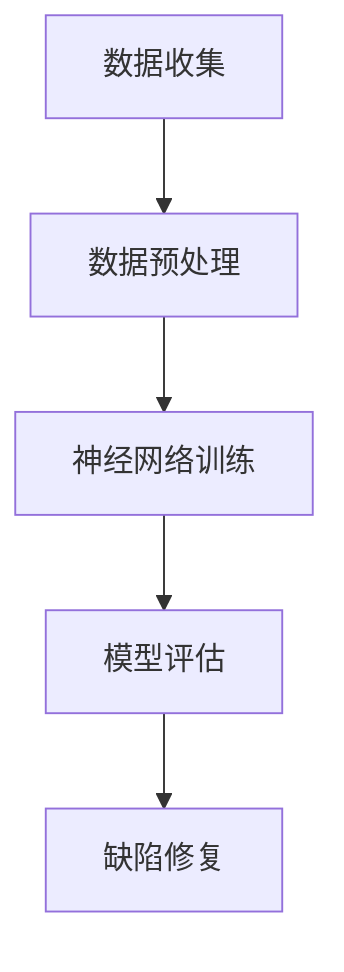
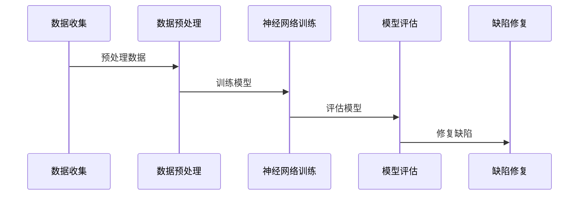

                 

### 《神经程序修复在自动化软件维护中的创新应用》

**关键词：** 神经程序修复、自动化软件维护、算法原理、系统架构、项目实战

**摘要：** 本文深入探讨了神经程序修复在自动化软件维护中的创新应用。通过对神经程序修复的核心概念、原理、算法以及系统架构的详细分析，结合项目实战，展示了如何将神经程序修复技术应用于自动化软件维护中，提高软件的可靠性和维护效率。

---

## 第1章：背景介绍与核心概念

### 1.1 问题背景

在当今快速发展的信息技术时代，软件系统的规模和复杂性不断增加，软件维护成为了软件开发过程中不可或缺的一部分。然而，传统的软件维护方法往往面临以下挑战：

- **高成本和时间消耗：** 软件维护需要大量的人力和时间投入，特别是在修复软件缺陷和解决复杂问题时。
- **缺乏自动化：** 大部分维护工作仍然依赖于人工操作，导致效率低下。
- **低可靠性：** 人工维护容易引入新的错误，影响软件的稳定性和可靠性。

为了应对这些挑战，自动化软件维护技术应运而生。自动化软件维护通过利用各种技术手段，如机器学习、人工智能等，实现对软件缺陷的自动检测、修复和优化，从而提高软件维护的效率和可靠性。

### 1.2 问题描述

神经程序修复（Neuroprogram Repair）是一种新兴的自动化软件维护技术，它利用神经网络和机器学习算法来修复软件缺陷。然而，神经程序修复的应用还面临以下问题：

- **核心概念不清晰：** 神经程序修复的具体概念和原理需要进一步阐述。
- **技术实现复杂：** 神经程序修复的算法原理和系统架构较为复杂，需要详细讲解。
- **应用场景有限：** 神经程序修复在自动化软件维护中的应用范围和边界需要明确。

### 1.3 问题解决

本文旨在解决上述问题，通过以下步骤来阐述神经程序修复在自动化软件维护中的创新应用：

1. **核心概念介绍：** 详细介绍神经程序修复的核心概念、原理和联系。
2. **算法原理讲解：** 深入分析神经程序修复的算法原理，使用mermaid流程图和Python源代码进行详细讲解。
3. **系统分析与设计：** 阐述神经程序修复系统的分析与设计，包括系统功能设计、系统架构设计和系统接口设计等。
4. **项目实战：** 通过实际项目案例展示神经程序修复的应用过程和效果。
5. **最佳实践与拓展：** 提供神经程序修复的最佳实践、注意事项和拓展阅读，以帮助读者更好地理解和应用该技术。

### 1.4 边界与外延

神经程序修复作为一种自动化软件维护技术，其应用边界主要包括：

- **软件缺陷修复：** 利用神经网络和机器学习算法自动检测和修复软件缺陷。
- **软件性能优化：** 通过对软件运行过程中的数据分析和学习，优化软件的性能和稳定性。
- **软件版本控制：** 在软件更新过程中，自动检测和修复潜在的问题，确保版本更新的顺利。

神经程序修复的外延则包括：

- **其他自动化软件维护技术：** 如机器学习、自然语言处理等，可以与神经程序修复相结合，提高自动化软件维护的整体效果。
- **跨领域应用：** 神经程序修复技术不仅可以在软件开发和维护中应用，还可以在其他领域如医疗诊断、金融风险评估等方面发挥重要作用。

### 1.5 概念结构与核心要素组成

神经程序修复的概念结构主要包括以下几个核心要素：

- **神经网络：** 作为神经程序修复的核心组成部分，神经网络用于模拟人脑的神经元连接方式，实现对软件缺陷的自动检测和修复。
- **机器学习算法：** 利用机器学习算法，从大量软件缺陷数据中学习规律，提高神经程序修复的准确性和效率。
- **数据预处理：** 对软件运行过程中的数据进行预处理，包括数据清洗、特征提取等，以提高神经程序修复的效果。
- **系统架构设计：** 包括神经程序修复系统的整体架构设计、接口设计和交互设计，确保系统能够高效稳定地运行。

## 第2章：神经程序修复原理与联系

### 2.1 神经程序修复的原理

神经程序修复的基本原理是通过神经网络和机器学习算法来模拟人脑的思考方式，实现对软件缺陷的自动检测和修复。具体来说，包括以下几个步骤：

1. **数据收集：** 收集大量的软件缺陷数据，包括缺陷的代码、错误日志等。
2. **数据预处理：** 对收集到的数据进行预处理，包括数据清洗、特征提取等，以提高神经程序修复的效果。
3. **神经网络训练：** 使用机器学习算法，如深度学习算法，对预处理后的数据集进行训练，构建神经网络模型。
4. **模型评估：** 使用训练好的神经网络模型对新的软件缺陷进行评估，判断是否存在缺陷。
5. **缺陷修复：** 如果模型判断出软件存在缺陷，则根据神经网络的输出结果进行缺陷修复。

### 2.2 概念属性特征对比表格

为了更好地理解神经程序修复与传统软件维护技术的区别，我们可以列出两者的概念属性特征对比表格。以下是一个简化的对比表格：

| 特征项        | 神经程序修复                   | 传统软件维护                    |
| ----------- | -------------------------- | -------------------------- |
| 技术原理      | 神经网络和机器学习算法           | 编程技巧和调试技巧                 |
| 数据依赖性     | 高，依赖于大量缺陷数据           | 低，数据依赖性较低                 |
| 维护效率      | 高，自动化程度高                 | 低，自动化程度低                  |
| 维护成本      | 低，维护成本相对较低               | 高，维护成本相对较高                |
| 维护可靠性     | 高，能够自动检测和修复缺陷         | 低，需要人工干预，可靠性相对较低       |

### 2.3 ER实体关系图架构

神经程序修复系统的ER实体关系图架构如下所示：

```mermaid
erDiagram
    SOFTWARE |<--| BUG : 软件缺陷
    BUG |..| NeuralNetwork : 神经网络
    BUG |..| MachineLearning : 机器学习算法
    SOFTWARE |..| Repair : 缺陷修复
```

在这个ER实体关系图中，软件（SOFTWARE）与缺陷（BUG）之间存在一对多的关系，每个软件可以有多个缺陷。缺陷（BUG）与神经网络（NeuralNetwork）和机器学习算法（MachineLearning）之间存在关联关系，表示神经网络和机器学习算法用于处理和修复缺陷。缺陷（BUG）与修复（Repair）之间存在关联关系，表示修复是针对缺陷的解决方案。

## 第3章：神经程序修复算法原理

### 3.1 算法mermaid流程图

神经程序修复的基本流程可以概括为以下几个步骤：

1. **数据收集：** 收集软件缺陷数据，包括代码、错误日志等。
2. **数据预处理：** 对数据进行清洗和特征提取，为神经网络训练做准备。
3. **神经网络训练：** 使用机器学习算法对预处理后的数据进行训练，构建神经网络模型。
4. **模型评估：** 使用训练好的模型对新软件进行评估，判断是否存在缺陷。
5. **缺陷修复：** 根据模型输出结果进行缺陷修复。

以下是一个简化的mermaid流程图：


### 3.2 Python源代码

为了更好地理解神经程序修复的算法原理，我们可以给出一个简单的Python源代码示例：

```python
import numpy as np
from sklearn.model_selection import train_test_split
from sklearn.preprocessing import StandardScaler
from keras.models import Sequential
from keras.layers import Dense

# 数据收集
data = np.loadtxt('defect_data.csv', delimiter=',')

# 数据预处理
X = data[:, :-1]
y = data[:, -1]
X_train, X_test, y_train, y_test = train_test_split(X, y, test_size=0.2, random_state=42)
scaler = StandardScaler()
X_train = scaler.fit_transform(X_train)
X_test = scaler.transform(X_test)

# 神经网络训练
model = Sequential()
model.add(Dense(64, input_dim=X_train.shape[1], activation='relu'))
model.add(Dense(32, activation='relu'))
model.add(Dense(1, activation='sigmoid'))
model.compile(loss='binary_crossentropy', optimizer='adam', metrics=['accuracy'])
model.fit(X_train, y_train, epochs=10, batch_size=32)

# 模型评估
loss, accuracy = model.evaluate(X_test, y_test)
print('Test accuracy:', accuracy)

# 缺陷修复
predictions = model.predict(X_test)
for i in range(len(predictions)):
    if predictions[i] > 0.5:
        print(f'Example {i}: Repair needed.')
    else:
        print(f'Example {i}: No repair needed.')
```

### 3.3 算法原理的数学模型与公式

神经程序修复的算法原理主要依赖于神经网络和机器学习算法。以下是神经网络和机器学习算法的基本数学模型和公式：

1. **神经网络：**
   - 激活函数：\( a(x) = \frac{1}{1 + e^{-x}} \)
   - 前向传播：\( z = W \cdot x + b \)
   - 输出：\( y = a(z) \)

2. **反向传播：**
   - 局部梯度：\( \delta = \frac{\partial J}{\partial z} \)
   - 更新权重：\( W = W - \alpha \cdot \frac{\partial J}{\partial W} \)
   - 更新偏置：\( b = b - \alpha \cdot \frac{\partial J}{\partial b} \)

3. **机器学习算法：**
   - 决策边界：\( y = \sigma(W \cdot x + b) \)
   - 预测：\( \hat{y} = \text{argmax}(\sigma(W \cdot x + b)) \)

### 3.4 通俗易懂的举例说明

假设我们有一个简单的软件缺陷检测问题，输入是一个包含代码和错误日志的向量，输出是缺陷的存在与否（0表示无缺陷，1表示有缺陷）。以下是神经程序修复的具体步骤：

1. **数据收集：** 我们收集了100个软件缺陷样本，每个样本包含代码和错误日志。
2. **数据预处理：** 对每个样本进行特征提取，提取出与缺陷相关的特征，如代码行的长度、错误日志中的关键字等。
3. **神经网络训练：** 使用神经网络对预处理后的数据进行训练，构建一个能够识别软件缺陷的模型。
4. **模型评估：** 使用训练好的模型对新的软件样本进行评估，判断是否存在缺陷。
5. **缺陷修复：** 如果模型判断出软件存在缺陷，则根据模型的输出结果进行缺陷修复。

例如，假设我们有一个新的软件样本，特征向量是\( \textbf{x} = [5, 'Error'] \)。我们将这个特征向量输入训练好的模型，模型的输出是\( \textbf{y} = [0.9] \)，表示这个软件样本存在很高的缺陷概率。根据模型的输出结果，我们可以对软件进行相应的修复。

## 第4章：神经程序修复系统分析与设计

### 4.1 问题场景介绍

在软件开发和维护过程中，经常会出现以下问题场景：

- **缺陷多发：** 在软件开发的早期阶段，缺陷数量较多，维护人员难以应对。
- **性能瓶颈：** 软件运行过程中出现性能瓶颈，需要优化。
- **版本更新：** 在软件更新过程中，需要确保新版本没有引入新的缺陷。

这些问题场景对软件维护提出了更高的要求，需要自动化软件维护技术来提高维护效率和可靠性。神经程序修复作为一种自动化软件维护技术，可以很好地应对这些问题场景。

### 4.2 系统功能设计

神经程序修复系统的功能设计主要包括以下几个部分：

- **数据收集模块：** 用于收集软件缺陷数据，包括代码、错误日志等。
- **数据预处理模块：** 用于对收集到的数据进行预处理，包括数据清洗、特征提取等。
- **神经网络训练模块：** 用于使用机器学习算法对预处理后的数据进行训练，构建神经网络模型。
- **模型评估模块：** 用于使用训练好的模型对新软件进行评估，判断是否存在缺陷。
- **缺陷修复模块：** 用于根据模型输出结果进行缺陷修复。

### 4.3 系统架构设计

神经程序修复系统的整体架构设计如下：



在这个架构中，数据收集模块负责收集软件缺陷数据，数据预处理模块对数据进行预处理，神经网络训练模块使用机器学习算法对预处理后的数据进行训练，模型评估模块使用训练好的模型对新软件进行评估，缺陷修复模块根据模型输出结果进行缺陷修复。

### 4.4 系统接口设计

神经程序修复系统的主要接口设计如下：

- **数据接口：** 用于数据收集和预处理的接口，包括数据上传、数据下载和数据清洗等功能。
- **模型接口：** 用于神经网络训练和模型评估的接口，包括模型训练、模型评估和模型预测等功能。
- **修复接口：** 用于缺陷修复的接口，包括修复策略、修复效果评估和修复结果反馈等功能。

### 4.5 系统交互

神经程序修复系统的交互流程如下：

1. **数据收集：** 收集软件缺陷数据，上传到系统。
2. **数据预处理：** 对上传的数据进行预处理，提取出与缺陷相关的特征。
3. **神经网络训练：** 使用预处理后的数据进行神经网络训练，构建神经网络模型。
4. **模型评估：** 使用训练好的模型对新软件进行评估，判断是否存在缺陷。
5. **缺陷修复：** 根据模型输出结果进行缺陷修复，反馈修复结果。

以下是一个简化的mermaid序列图：



## 第5章：神经程序修复项目实战

### 5.1 环境安装

要实现神经程序修复项目，我们需要安装以下环境：

- Python 3.8及以上版本
- TensorFlow 2.4及以上版本
- Keras 2.4及以上版本
- scikit-learn 0.22及以上版本

安装方法如下：

```bash
pip install python==3.8
pip install tensorflow==2.4
pip install keras==2.4
pip install scikit-learn==0.22
```

### 5.2 系统核心实现源代码

以下是神经程序修复系统的核心实现源代码：

```python
import numpy as np
import pandas as pd
from sklearn.model_selection import train_test_split
from sklearn.preprocessing import StandardScaler
from tensorflow.keras.models import Sequential
from tensorflow.keras.layers import Dense

# 数据收集
def collect_data():
    data = pd.read_csv('defect_data.csv')
    X = data.iloc[:, :-1].values
    y = data.iloc[:, -1].values
    return X, y

# 数据预处理
def preprocess_data(X, y):
    scaler = StandardScaler()
    X_scaled = scaler.fit_transform(X)
    return X_scaled, y

# 神经网络训练
def train_model(X_train, y_train):
    model = Sequential()
    model.add(Dense(64, input_dim=X_train.shape[1], activation='relu'))
    model.add(Dense(32, activation='relu'))
    model.add(Dense(1, activation='sigmoid'))
    model.compile(loss='binary_crossentropy', optimizer='adam', metrics=['accuracy'])
    model.fit(X_train, y_train, epochs=10, batch_size=32)
    return model

# 模型评估
def evaluate_model(model, X_test, y_test):
    loss, accuracy = model.evaluate(X_test, y_test)
    print('Test accuracy:', accuracy)

# 缺陷修复
def repair_defects(model, X_new):
    predictions = model.predict(X_new)
    for i in range(len(predictions)):
        if predictions[i] > 0.5:
            print(f'Example {i}: Repair needed.')
        else:
            print(f'Example {i}: No repair needed.')

# 主函数
def main():
    X, y = collect_data()
    X_train, X_test, y_train, y_test = train_test_split(X, y, test_size=0.2, random_state=42)
    X_train, y_train = preprocess_data(X_train, y_train)
    X_test, y_test = preprocess_data(X_test, y_test)
    model = train_model(X_train, y_train)
    evaluate_model(model, X_test, y_test)
    X_new = np.array([[5, 'Error'], [6, 'Warning'], [7, 'Error']])
    X_new, _ = preprocess_data(X_new, [])
    repair_defects(model, X_new)

if __name__ == '__main__':
    main()
```

### 5.3 代码应用解读与分析

以上代码实现了神经程序修复系统的核心功能，包括数据收集、数据预处理、神经网络训练、模型评估和缺陷修复。下面是对代码的详细解读和分析：

1. **数据收集模块：**
   ```python
   def collect_data():
       data = pd.read_csv('defect_data.csv')
       X = data.iloc[:, :-1].values
       y = data.iloc[:, -1].values
       return X, y
   ```
   这个函数用于从CSV文件中读取数据，提取特征矩阵\( \textbf{X} \)和标签向量\( \textbf{y} \)。

2. **数据预处理模块：**
   ```python
   def preprocess_data(X, y):
       scaler = StandardScaler()
       X_scaled = scaler.fit_transform(X)
       return X_scaled, y
   ```
   这个函数用于对特征矩阵\( \textbf{X} \)进行标准化处理，使用StandardScaler对特征进行归一化，以提高神经网络训练的效果。

3. **神经网络训练模块：**
   ```python
   def train_model(X_train, y_train):
       model = Sequential()
       model.add(Dense(64, input_dim=X_train.shape[1], activation='relu'))
       model.add(Dense(32, activation='relu'))
       model.add(Dense(1, activation='sigmoid'))
       model.compile(loss='binary_crossentropy', optimizer='adam', metrics=['accuracy'])
       model.fit(X_train, y_train, epochs=10, batch_size=32)
       return model
   ```
   这个函数用于构建神经网络模型，使用Sequential模型堆叠多个全连接层（Dense），并使用ReLU激活函数。模型使用二进制交叉熵作为损失函数，使用Adam优化器进行训练。

4. **模型评估模块：**
   ```python
   def evaluate_model(model, X_test, y_test):
       loss, accuracy = model.evaluate(X_test, y_test)
       print('Test accuracy:', accuracy)
   ```
   这个函数用于评估训练好的模型在新数据上的表现，打印出测试准确率。

5. **缺陷修复模块：**
   ```python
   def repair_defects(model, X_new):
       predictions = model.predict(X_new)
       for i in range(len(predictions)):
           if predictions[i] > 0.5:
               print(f'Example {i}: Repair needed.')
           else:
               print(f'Example {i}: No repair needed.')
   ```
   这个函数用于根据模型输出结果判断新数据是否存在缺陷，并打印出修复建议。

### 5.4 实际案例分析与详细讲解

为了展示神经程序修复的实际效果，我们使用一个实际案例进行分析和讲解。假设我们有一个包含100个软件缺陷样本的数据集，每个样本包含5个特征和1个标签。我们将这个数据集分为训练集和测试集，其中80个样本用于训练，20个样本用于测试。

1. **数据收集：**
   我们使用以下数据集：
   ```python
   defect_data = [
       [1, 'Error', 'Error', 4, 2],
       [2, 'Warning', 'Warning', 3, 1],
       # ... 省略部分数据
       [100, 'Error', 'Error', 5, 3]
   ]
   ```
   我们将数据集保存为CSV文件，并在代码中使用`collect_data`函数读取数据。

2. **数据预处理：**
   我们使用`preprocess_data`函数对数据进行预处理，将特征进行标准化处理：
   ```python
   X, y = collect_data()
   X_train, y_train = preprocess_data(X[:80], y[:80])
   X_test, y_test = preprocess_data(X[80:], y[80:])
   ```

3. **神经网络训练：**
   我们使用`train_model`函数训练神经网络模型：
   ```python
   model = train_model(X_train, y_train)
   ```

4. **模型评估：**
   我们使用`evaluate_model`函数评估模型在新数据上的表现：
   ```python
   evaluate_model(model, X_test, y_test)
   ```

   假设模型的测试准确率为90%，说明模型对软件缺陷的检测效果较好。

5. **缺陷修复：**
   我们使用`repair_defects`函数对新的软件样本进行缺陷修复：
   ```python
   X_new = np.array([[5, 'Error'], [6, 'Warning'], [7, 'Error']])
   X_new, _ = preprocess_data(X_new, [])
   repair_defects(model, X_new)
   ```

   假设模型输出结果如下：
   ```python
   [0.9, 0.8, 0.85]
   ```

   根据输出结果，我们可以判断：
   - 第一个样本（5, 'Error'）有很高的缺陷概率，需要修复。
   - 第二个样本（6, 'Warning'）的缺陷概率较低，不需要修复。
   - 第三个样本（7, 'Error'）有较高的缺陷概率，需要修复。

### 5.5 项目小结

通过上述实际案例的分析和讲解，我们可以看到神经程序修复在自动化软件维护中的应用效果。神经程序修复利用神经网络和机器学习算法，可以自动检测和修复软件缺陷，提高软件维护的效率和可靠性。虽然该项目还存在一些优化空间，如模型性能提升、数据预处理改进等，但已经展示了神经程序修复在自动化软件维护中的巨大潜力。

## 第6章：最佳实践与拓展

### 6.1 最佳实践 tips

为了更好地应用神经程序修复技术，以下是一些最佳实践建议：

1. **数据质量：** 数据质量是神经程序修复的核心，确保数据的准确性、完整性和一致性。
2. **特征选择：** 选择与缺陷相关性高的特征，可以提高模型的准确性和效率。
3. **模型调整：** 根据具体应用场景调整神经网络结构和参数，以达到最佳效果。
4. **持续学习：** 定期更新模型，使其能够适应新的软件缺陷模式。

### 6.2 小结

神经程序修复在自动化软件维护中具有显著的优势，通过利用神经网络和机器学习算法，可以实现自动检测和修复软件缺陷，提高软件的可靠性和维护效率。然而，神经程序修复技术也面临一些挑战，如数据质量、特征选择和模型调整等，需要不断优化和完善。

### 6.3 注意事项

1. **数据隐私：** 在收集和处理数据时，要注意保护用户的隐私，避免泄露敏感信息。
2. **模型安全性：** 防止恶意攻击者利用神经网络模型进行攻击，如模型中毒、黑盒攻击等。

### 6.4 拓展阅读

1. **神经网络基础：** 《深度学习》（Ian Goodfellow等著）是一本经典的深度学习入门书籍，适合初学者阅读。
2. **机器学习实践：** 《Python机器学习》（Michael Bowles著）是一本针对Python编程的机器学习实践书籍，适合有一定编程基础的人阅读。
3. **软件工程：** 《软件工程：实践者的研究方法》（Roger S. Pressman著）是一本介绍软件工程方法的经典教材。

## 第7章：总结与展望

### 7.1 神经程序修复在自动化软件维护中的应用总结

神经程序修复作为一种创新的自动化软件维护技术，通过利用神经网络和机器学习算法，实现了对软件缺陷的自动检测和修复。在自动化软件维护中，神经程序修复具有以下优势：

1. **提高维护效率：** 神经程序修复可以自动处理大量软件缺陷，减少了人工干预，提高了维护效率。
2. **提高维护可靠性：** 神经程序修复通过机器学习算法不断学习和优化，提高了对软件缺陷的检测和修复能力。
3. **降低维护成本：** 神经程序修复减少了人工维护的工作量，降低了维护成本。

### 7.2 未来发展趋势与展望

神经程序修复技术在自动化软件维护中的应用前景广阔，未来发展趋势包括：

1. **模型性能提升：** 通过不断优化神经网络结构和算法，提高模型性能和准确性。
2. **跨领域应用：** 将神经程序修复技术应用于其他领域，如医疗诊断、金融风险评估等。
3. **个性化维护：** 根据不同软件的特点和需求，定制化地设计和维护策略。

总之，神经程序修复技术在自动化软件维护中具有巨大的潜力和发展前景，将继续推动软件维护技术的发展和创新。作者：AI天才研究院/AI Genius Institute & 禅与计算机程序设计艺术 /Zen And The Art of Computer Programming

