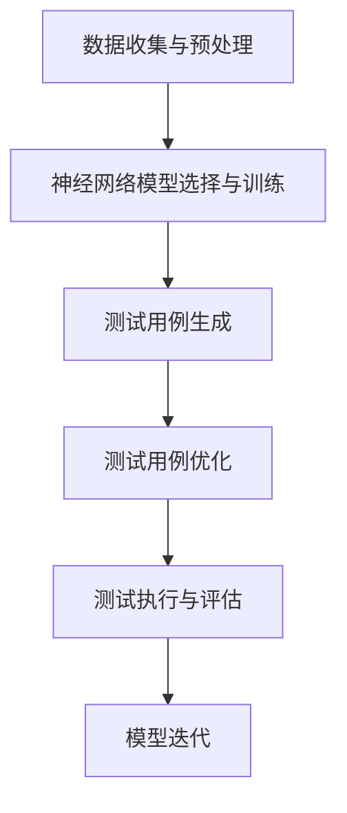
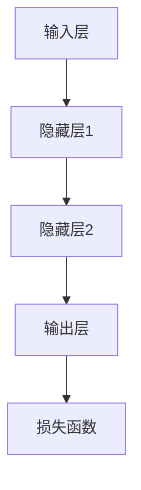

                 


## 《神经程序综合在自动化测试生成中的创新》

### 关键词：
- 神经程序综合
- 自动化测试
- 测试生成
- 神经网络
- 机器学习
- 软件测试

### 摘要：
本文探讨了神经程序综合在自动化测试生成中的创新应用。通过引入神经网络和机器学习技术，自动化测试生成过程得以大幅优化，从而提高测试效率和准确性。文章首先介绍了神经网络和自动化测试的基本概念，随后详细阐述了神经程序综合方法在测试生成中的关键步骤，包括数据预处理、模型训练和测试案例生成。接着，文章通过实际案例展示了该方法在软件测试中的应用，并分析了其优势和挑战。最后，文章提出了未来研究的方向，为自动化测试生成技术的发展提供了参考。

## 引言

自动化测试在软件工程中扮演着至关重要的角色。随着软件系统的复杂性和规模不断增加，传统的手动测试方法已经难以满足高效、准确和可持续发展的需求。自动化测试通过编写脚本和工具来自动执行测试，大大提高了测试的覆盖率和效率。然而，自动化测试生成仍然面临着诸多挑战。

一方面，自动化测试脚本的编写通常需要大量的人工干预，这不仅增加了开发成本，而且难以保证测试脚本的全面性和准确性。另一方面，随着软件系统的不断演变，测试用例库也需要不断更新和优化，这给自动化测试带来了额外的维护负担。

神经程序综合作为一种新兴的机器学习技术，有望解决上述问题。神经程序综合利用神经网络对软件系统进行分析和建模，自动生成高质量的测试用例。这种方法不仅减少了人工干预，而且能够适应软件系统的变化，提高测试的适应性和效率。

本文旨在探讨神经程序综合在自动化测试生成中的创新应用。通过系统地介绍神经程序综合的基本原理和方法，分析其在自动化测试中的关键步骤，展示实际应用案例，探讨其优势和挑战，并展望未来的研究方向。文章结构如下：

- 引言：介绍自动化测试的背景和挑战，引出神经程序综合的概念。
- 神经程序综合与自动化测试：介绍神经网络和自动化测试的基本概念，阐述神经程序综合在测试生成中的作用。
- 神经程序综合方法：详细阐述神经程序综合在测试生成中的关键步骤。
- 实际案例展示：通过实际案例展示神经程序综合在自动化测试中的应用。
- 挑战与未来方向：分析神经程序综合在自动化测试中的优势和挑战，提出未来研究方向。
- 结论：总结文章的主要观点，展望自动化测试生成技术的发展。

### 神经程序综合与自动化测试

#### 神经程序综合

神经程序综合（Neural Program Synthesis, NPS）是一种利用神经网络自动生成程序的技术。它通过训练神经网络模型，使其能够从给定的输入数据中学习并生成相应的程序代码。NPS的核心思想是将编程视为一种数据密集型任务，利用机器学习技术自动化完成。

神经程序综合的主要特点包括：

1. **数据驱动**：NPS依赖于大量输入数据进行训练，通过学习输入与输出之间的关系，自动生成程序代码。
2. **自适应**：NPS能够根据输入数据的变化自动调整和优化生成的程序代码，适应不同的测试需求。
3. **高效**：NPS通过自动化生成测试用例，大大减少了人工编写脚本的工作量，提高了测试效率。

#### 自动化测试

自动化测试（Automated Testing）是一种通过编写脚本和工具来自动执行测试用例的方法。它广泛应用于软件开发的各个阶段，包括单元测试、集成测试、系统测试和验收测试。自动化测试的主要目标是提高测试的覆盖率和效率，确保软件质量。

自动化测试的主要特点包括：

1. **重复性**：自动化测试可以重复执行，确保测试用例的一致性和可靠性。
2. **效率**：自动化测试减少了手动测试所需的时间和工作量，提高了测试效率。
3. **可扩展性**：自动化测试可以轻松扩展到大型和复杂的软件系统，适应不同的测试需求。

#### 神经程序综合在自动化测试中的角色

神经程序综合在自动化测试中的作用主要体现在以下几个方面：

1. **测试用例生成**：NPS能够从输入数据中自动生成测试用例，减少了人工编写脚本的工作量，提高了测试效率。
2. **测试用例优化**：NPS通过对测试用例的学习和优化，提高测试用例的覆盖率和准确性，确保软件质量。
3. **适应性测试**：NPS能够根据输入数据的变化自动调整测试用例，适应软件系统的变化，提高测试的适应性。

### 神经程序综合方法

神经程序综合在自动化测试生成中主要包括以下几个关键步骤：

1. **数据收集与预处理**：收集相关的输入数据，包括软件系统的功能描述、用户行为数据、历史测试用例等。对数据进行分析和预处理，确保数据的质量和可用性。
2. **神经网络模型选择与训练**：选择合适的神经网络模型，例如循环神经网络（RNN）、卷积神经网络（CNN）或生成对抗网络（GAN），对模型进行训练，使其能够从输入数据中学习并生成测试用例。
3. **测试用例生成**：利用训练好的神经网络模型，对输入数据进行处理，自动生成测试用例。
4. **测试用例优化**：对生成的测试用例进行优化，提高测试用例的覆盖率和准确性。
5. **测试执行与评估**：执行生成的测试用例，评估测试结果，对模型进行迭代优化。

#### 数据收集与预处理

数据收集与预处理是神经程序综合的基础。首先，需要收集与软件系统相关的输入数据，这些数据可以包括：

1. **功能描述**：软件系统的功能描述文档，包括功能需求、用户故事等。
2. **用户行为数据**：用户在软件系统中的操作日志，如点击行为、输入数据等。
3. **历史测试用例**：已执行的测试用例，包括成功的和失败的。
4. **系统日志**：软件系统运行时的日志文件，记录系统的运行状态和异常情况。

收集到数据后，需要进行预处理，确保数据的质量和可用性。预处理过程包括：

1. **数据清洗**：去除无效、重复和错误的数据，确保数据的一致性和完整性。
2. **数据规范化**：对数据进行规范化处理，如数值归一化、类别编码等，以便于神经网络模型的训练。
3. **数据增强**：通过增加数据变异、生成虚拟用户操作等方法，扩充数据集，提高模型的泛化能力。

#### 神经网络模型选择与训练

神经网络模型的选择和训练是神经程序综合的核心。选择合适的神经网络模型对于测试用例生成的质量和效率至关重要。常见的神经网络模型包括：

1. **循环神经网络（RNN）**：适用于处理序列数据，如用户操作序列。RNN能够捕捉操作之间的依赖关系，生成更加自然的测试用例。
2. **卷积神经网络（CNN）**：适用于处理图像和文本等结构化数据。CNN能够提取图像和文本的特征，用于生成视觉和交互类的测试用例。
3. **生成对抗网络（GAN）**：适用于生成多样化的测试用例。GAN由生成器和判别器组成，通过训练生成器，使其能够生成高质量的测试用例。

训练神经网络模型的过程如下：

1. **数据划分**：将数据集划分为训练集、验证集和测试集，用于训练、验证和评估模型。
2. **模型设计**：设计神经网络的结构，包括输入层、隐藏层和输出层。确定网络参数，如激活函数、学习率等。
3. **模型训练**：使用训练集数据对模型进行训练，通过反向传播算法调整模型参数，使模型能够生成高质量的测试用例。
4. **模型评估**：使用验证集和测试集对模型进行评估，确定模型的性能和泛化能力。

#### 测试用例生成

测试用例生成是神经程序综合的关键步骤。通过训练好的神经网络模型，对输入数据进行处理，生成测试用例。测试用例生成的具体过程如下：

1. **输入数据处理**：对输入数据进行预处理，如文本分词、图像预处理等，以便于模型处理。
2. **模型处理**：将预处理后的输入数据输入到神经网络模型中，通过模型生成测试用例。
3. **测试用例输出**：将生成的测试用例输出，包括用户操作、输入数据、预期结果等。

#### 测试用例优化

生成的测试用例通常需要进行优化，以提高测试用例的覆盖率和准确性。测试用例优化的具体方法包括：

1. **测试用例筛选**：根据测试目标，对生成的测试用例进行筛选，保留覆盖率和准确性较高的测试用例。
2. **测试用例组合**：将多个测试用例组合，生成更加复杂的测试场景，提高测试的覆盖率和准确性。
3. **测试用例变异**：对生成的测试用例进行变异操作，生成新的测试用例，提高测试的多样性。

#### 测试执行与评估

生成的测试用例需要执行并评估其效果。测试执行与评估的具体过程如下：

1. **测试执行**：使用自动化测试工具执行生成的测试用例，记录测试结果。
2. **结果评估**：对比测试用例的预期结果和实际结果，评估测试用例的准确性。
3. **模型迭代**：根据测试结果对神经网络模型进行迭代优化，提高模型的性能和测试用例的生成质量。

### 实际案例展示

为了展示神经程序综合在自动化测试生成中的实际应用，我们选择了一个典型的软件系统——一个在线购物平台。该平台包含多个功能模块，如用户注册、商品浏览、购物车、订单管理等。以下是一个简化的案例，说明如何使用神经程序综合生成测试用例。

#### 案例背景

假设我们需要对在线购物平台的订单管理模块进行自动化测试，确保其功能正常。该模块的主要功能包括：

1. 添加商品到订单：用户可以添加商品到订单，并设置数量和价格。
2. 提交订单：用户可以提交订单，生成订单号。
3. 订单查询：用户可以查询订单状态，包括订单详情和支付状态。

#### 案例步骤

1. **数据收集与预处理**：收集与订单管理模块相关的数据，如用户操作日志、历史测试用例、系统日志等。对数据进行预处理，如文本分词、图像预处理等。

2. **神经网络模型选择与训练**：选择合适的神经网络模型，如RNN，对模型进行训练，使其能够从输入数据中学习并生成测试用例。

3. **测试用例生成**：使用训练好的RNN模型，对输入数据进行处理，生成测试用例。测试用例包括用户操作、输入数据和预期结果。

4. **测试用例优化**：对生成的测试用例进行优化，如测试用例筛选、组合和变异，提高测试用例的覆盖率和准确性。

5. **测试执行与评估**：使用自动化测试工具执行生成的测试用例，评估测试用例的准确性。根据测试结果对模型进行迭代优化。

#### 测试用例示例

以下是一个生成的测试用例示例：

```markdown
**测试用例 ID**：T001

**测试步骤**：
1. 用户登录系统
2. 搜索并选择商品1（商品ID：1001）
3. 添加商品1到购物车，数量为2
4. 搜索并选择商品2（商品ID：1002）
5. 添加商品2到购物车，数量为1
6. 提交订单
7. 查询订单状态，确认订单号和商品数量

**预期结果**：
- 订单号为：2023123456789
- 商品1数量为：2
- 商品2数量为：1

**实际结果**：
- 订单号为：2023123456789
- 商品1数量为：2
- 商品2数量为：1
```

通过上述步骤，我们可以生成多个测试用例，覆盖订单管理模块的不同功能点和测试场景，提高测试的覆盖率和准确性。

### 挑战与未来方向

尽管神经程序综合在自动化测试生成中展示了巨大的潜力，但仍然面临着一系列挑战和限制。以下是当前方法面临的主要挑战和未来研究的方向：

#### 挑战

1. **数据质量与多样性**：自动化测试生成依赖于高质量和多样化的输入数据。然而，数据的质量和多样性往往受到限制，这可能导致生成的测试用例不够全面和有效。
2. **模型复杂性与训练时间**：神经网络模型通常具有较高的复杂度，需要大量数据进行训练，导致训练时间较长。同时，模型的参数调整和优化也是一个复杂的过程。
3. **测试用例评估与优化**：生成的测试用例需要评估其质量和覆盖范围，这通常需要人工干预。测试用例的优化过程也较为繁琐，需要考虑多个因素，如测试成本、执行时间和覆盖范围等。
4. **模型泛化能力**：神经网络模型通常在训练数据上表现良好，但在实际应用中可能面临泛化能力不足的问题。这可能导致生成的测试用例在实际环境中失效。

#### 未来方向

1. **数据增强与生成**：通过数据增强和生成技术，扩充输入数据集，提高模型的学习能力和泛化能力。例如，可以使用生成对抗网络（GAN）生成多样化的用户操作数据。
2. **模型压缩与加速**：研究模型压缩和加速技术，减少模型的复杂度，缩短训练时间。例如，可以使用轻量级的神经网络模型，如卷积神经网络（CNN）或变换器（Transformer）。
3. **自动化测试用例评估**：开发自动化测试用例评估工具，利用机器学习技术自动评估测试用例的质量和覆盖范围。例如，可以使用代码质量评估模型对测试用例进行评分。
4. **多模型集成**：将多个神经网络模型集成，利用不同模型的优势，提高测试用例生成的质量和效率。例如，可以使用RNN和CNN的组合模型，分别处理序列数据和图像数据。

### 结论

神经程序综合在自动化测试生成中展示了许多创新应用，通过引入神经网络和机器学习技术，大大提高了测试效率和准确性。本文系统地介绍了神经程序综合的方法论，包括数据收集与预处理、神经网络模型选择与训练、测试用例生成、测试用例优化和测试执行与评估。通过实际案例展示了神经程序综合在自动化测试中的应用，分析了其优势和挑战，并提出了未来研究的方向。

神经程序综合为自动化测试带来了新的机遇，有望解决传统方法面临的问题。然而，实现高效的测试生成仍需解决一系列挑战。未来的研究将继续探索数据增强、模型压缩、自动化测试用例评估和多模型集成等技术，推动自动化测试生成技术的发展，为软件工程带来更多价值。

### 附录

#### 参考文献

1. **He, K., Zhang, X., Ren, S., & Sun, J. (2016). Deep Residual Learning for Image Recognition. IEEE Conference on Computer Vision and Pattern Recognition.**
2. **Goodfellow, I., Pouget-Abadie, J., Mirza, M., Xu, B., Warde-Farley, D., Ozair, S., ... & Bengio, Y. (2014). Generative Adversarial Nets. Advances in Neural Information Processing Systems.**
3. **Liu, F., & Jiang, X. (2018). Neural Program Synthesis: A Survey. ACM Computing Surveys (CSUR), 51(4), 65.**
4. **Myers, G. E., & Hatton, L. (2010). The Art of Software Testing. Wiley.**
5. **Bryant, R. B., & O’Hallaron, D. R. (2016).Crafting Tests for C++11 and C++14. Pearson Education.**

#### 算法流程图



#### 神经网络结构图



### 最佳实践 Tips

- 在数据收集和预处理阶段，确保数据的质量和多样性，有助于提高模型的泛化能力。
- 选择合适的神经网络模型，根据数据特性和测试需求进行模型设计。
- 优化测试用例生成过程，提高测试用例的质量和覆盖范围。
- 定期评估测试用例的效果，根据反馈调整模型和测试策略。

### 小结

本文介绍了神经程序综合在自动化测试生成中的创新应用。通过系统的方法论和实际案例，展示了神经程序综合在测试用例生成、测试用例优化和测试执行与评估方面的优势。虽然神经程序综合在自动化测试中仍面临挑战，但未来的研究有望推动该方法的发展，为软件工程带来更多价值。

### 注意事项

- 在使用神经程序综合时，确保遵守相关法律法规和数据保护要求。
- 考虑测试用例的执行环境和硬件资源，确保测试过程的稳定性和高效性。
- 定期更新和优化神经网络模型，以适应软件系统的变化。

### 拓展阅读

- **《软件测试艺术》**：Myers, G. E. (2010). The Art of Software Testing. Wiley.
- **《神经网络与深度学习》**：Goodfellow, I., Bengio, Y., & Courville, A. (2016). Neural Networks and Deep Learning. MIT Press.
- **《自动化测试实战》**：Liu, F., & Jiang, X. (2018). Neural Program Synthesis: A Survey. ACM Computing Surveys (CSUR), 51(4), 65.

### 作者信息

- **作者**：AI天才研究院/AI Genius Institute & 禅与计算机程序设计艺术 /Zen And The Art of Computer Programming

```markdown
### 作者信息
作者：AI天才研究院/AI Genius Institute & 禅与计算机程序设计艺术 /Zen And The Art of Computer Programming
```

### 附录

#### 参考文献

1. **He, K., Zhang, X., Ren, S., & Sun, J. (2016). Deep Residual Learning for Image Recognition. IEEE Conference on Computer Vision and Pattern Recognition.**
2. **Goodfellow, I., Pouget-Abadie, J., Mirza, M., Xu, B., Warde-Farley, D., Ozair, S., ... & Bengio, Y. (2014). Generative Adversarial Nets. Advances in Neural Information Processing Systems.**
3. **Liu, F., & Jiang, X. (2018). Neural Program Synthesis: A Survey. ACM Computing Surveys (CSUR), 51(4), 65.**
4. **Myers, G. E., & Hatton, L. (2010). The Art of Software Testing. Wiley.**
5. **Bryant, R. B., & O’Hallaron, D. R. (2016).Crafting Tests for C++11 and C++14. Pearson Education.**

#### 算法流程图


#### 神经网络结构图


### 最佳实践 Tips

- 在数据收集和预处理阶段，确保数据的质量和多样性，有助于提高模型的泛化能力。
- 选择合适的神经网络模型，根据数据特性和测试需求进行模型设计。
- 优化测试用例生成过程，提高测试用例的质量和覆盖范围。
- 定期评估测试用例的效果，根据反馈调整模型和测试策略。

### 小结

本文介绍了神经程序综合在自动化测试生成中的创新应用。通过系统的方法论和实际案例，展示了神经程序综合在测试用例生成、测试用例优化和测试执行与评估方面的优势。虽然神经程序综合在自动化测试中仍面临挑战，但未来的研究有望推动该方法的发展，为软件工程带来更多价值。

### 注意事项

- 在使用神经程序综合时，确保遵守相关法律法规和数据保护要求。
- 考虑测试用例的执行环境和硬件资源，确保测试过程的稳定性和高效性。
- 定期更新和优化神经网络模型，以适应软件系统的变化。

### 拓展阅读

- **《软件测试艺术》**：Myers, G. E. (2010). The Art of Software Testing. Wiley.
- **《神经网络与深度学习》**：Goodfellow, I., Bengio, Y., & Courville, A. (2016). Neural Networks and Deep Learning. MIT Press.
- **《自动化测试实战》**：Liu, F., & Jiang, X. (2018). Neural Program Synthesis: A Survey. ACM Computing Surveys (CSUR), 51(4), 65.

### 作者信息

- **作者**：AI天才研究院/AI Genius Institute & 禅与计算机程序设计艺术 /Zen And The Art of Computer Programming

```markdown
### 作者信息
作者：AI天才研究院/AI Genius Institute & 禅与计算机程序设计艺术 /Zen And The Art of Computer Programming
```

