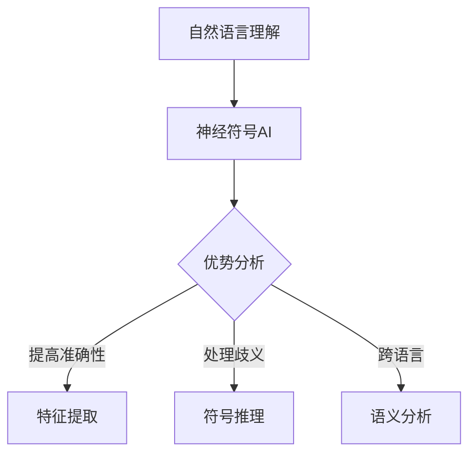

                 

# 神经符号AI在自然语言理解中的应用

## 关键词

- 神经符号AI
- 自然语言理解
- 神经网络
- 符号推理
- 文本分类

## 摘要

本文将探讨神经符号AI在自然语言理解中的应用，详细分析其背景、核心概念、算法原理以及具体应用场景。我们将逐步深入，从神经符号AI的提出和基本概念入手，逐步介绍神经网络的基础、神经符号融合策略，最后通过具体应用案例，如文本分类，展示神经符号AI在自然语言处理中的潜力。

## 第一部分：神经符号AI概述

### 第1章：神经符号AI背景与核心概念

#### 1.1 问题背景

自然语言理解（NLU）是人工智能领域的一个重要方向，它旨在让计算机理解和处理人类自然语言。然而，传统的NLU方法在处理复杂、模糊的自然语言表达时存在局限性。例如，在语义理解、歧义消除和跨语言理解等方面，传统方法往往难以取得理想的效果。

#### 1.1.1 自然语言理解中的挑战

自然语言理解中的主要挑战包括：

- **语义理解**：准确理解句子中的含义，涉及到词语的多义性和语境依赖。
- **歧义消除**：处理具有多个解释的句子，确定其唯一正确的含义。
- **跨语言理解**：理解不同语言之间的语义关系，实现有效的翻译。

#### 1.1.2 神经符号AI的提出

为了克服传统NLU方法的局限性，研究人员提出了神经符号AI（Neural-Symbolic AI）这一新的研究方向。神经符号AI结合了神经网络和传统符号推理方法，旨在利用神经网络的强大特征提取能力，同时结合符号推理的严密逻辑性，从而在自然语言理解方面取得突破。

#### 1.1.3 神经符号AI的基本概念

神经符号AI的核心概念包括：

- **神经网络**：用于特征提取和学习。
- **符号推理**：用于逻辑推理和语义分析。

神经符号AI通过将神经网络和符号推理有机结合，能够在自然语言理解中实现以下目标：

- **提高语义理解准确性**：利用神经网络的特征提取能力，更准确地捕捉语义信息。
- **处理多义性和语境依赖**：结合符号推理的严密逻辑，有效处理词语的多义性和语境依赖。
- **支持跨语言的语义分析**：通过神经符号融合策略，实现跨语言之间的语义分析。

#### 1.2 问题描述

自然语言理解的困境主要集中在以下几个方面：

- **语义理解的准确性**：传统的NLU方法在处理复杂句子时，往往难以准确理解其语义。
- **歧义消除**：在处理含有歧义的句子时，传统方法难以确定唯一正确的含义。
- **跨语言理解**：在处理不同语言之间的文本时，传统方法难以实现有效的语义对应。

#### 1.2.1 自然语言理解的困境

传统的NLU方法主要依赖于统计学习和规则匹配，这些方法在处理语义理解、歧义消除等任务时存在以下问题：

- **语义理解准确性**：基于统计学习的方法在处理复杂句子时，往往无法准确捕捉语义信息。
- **歧义消除**：基于规则匹配的方法在处理含有歧义的句子时，难以确定唯一正确的含义。
- **跨语言理解**：传统方法难以实现跨语言之间的语义对应。

#### 1.2.2 神经符号AI的解决方案

神经符号AI通过结合神经网络的灵活性和符号推理的严密性，提供了一种新的自然语言理解方法。它主要解决以下问题：

- **提高语义理解准确性**：神经符号AI利用神经网络的强大特征提取能力，更准确地捕捉语义信息。
- **处理多义性和语境依赖**：通过符号推理的严密逻辑，有效处理词语的多义性和语境依赖。
- **支持跨语言的语义分析**：通过神经符号融合策略，实现跨语言之间的语义分析。

#### 1.3 问题解决

神经符号AI在自然语言理解中具有以下优势：

- **提高语义理解准确性**：通过神经网络的特征提取能力，更准确地捕捉语义信息。
- **处理多义性和语境依赖**：结合符号推理的严密逻辑，有效处理词语的多义性和语境依赖。
- **支持跨语言的语义分析**：通过神经符号融合策略，实现跨语言之间的语义分析。

神经符号AI的应用场景包括：

- **语音识别**：将语音信号转换为文本，实现人机交互。
- **情感分析**：分析文本的情感倾向，应用于舆情分析和社会情感监测。
- **机器翻译**：实现不同语言之间的文本翻译，促进跨文化交流。
- **问答系统**：根据用户提问，提供准确、自然的回答。

#### 1.4 边界与外延

神经符号AI的研究领域包括：

- **神经网络设计**：优化神经网络结构，提高自然语言理解的性能。
- **符号推理算法**：研究基于符号逻辑的推理方法，增强自然语言理解的能力。
- **神经符号融合策略**：探索神经网络与符号推理有机结合的方法，提升自然语言理解的效果。

神经符号AI的发展趋势包括：

- **深度学习与符号推理的进一步融合**：将深度学习和符号推理的优势相结合，实现更强大的自然语言理解能力。
- **神经符号AI在特定领域的应用深化**：针对特定应用场景，如医学、法律等，深入研究神经符号AI的应用方法和技术。

#### 1.5 概念结构与核心要素组成

神经符号AI的核心概念包括：

- **神经网络**：用于特征提取和模型训练。
- **符号推理**：用于逻辑推理和语义分析。

神经符号AI的核心要素包括：

- **特征表示**：将自然语言转换为神经网络可以处理的特征表示。
- **推理算法**：基于符号逻辑的推理方法。
- **融合策略**：将神经网络与符号推理有机结合。

#### 1.6 本章小结

神经符号AI作为一种结合神经网络和符号推理的新兴技术，为自然语言理解领域带来了新的机遇。本章介绍了神经符号AI的背景、核心概念及其应用前景，为后续章节的深入探讨奠定了基础。

## 第二部分：神经符号AI的算法原理

### 第2章：神经网络基础

#### 2.1 神经网络的基本概念

##### 2.1.1 神经网络定义

神经网络（Neural Network，简称NN）是一种模拟人脑神经元连接方式的计算模型。它由大量的神经元（节点）通过权重（连接）连接而成，每个神经元接收输入信号，通过激活函数处理后输出结果。

##### 2.1.2 神经网络的结构

神经网络主要由以下几部分组成：

- **输入层**：接收外部输入数据。
- **隐藏层**：对输入数据进行特征提取和变换。
- **输出层**：生成最终的输出结果。

神经网络的结构可以根据需要灵活设计，常见的有单层网络、多层网络和卷积网络等。

#### 2.2 神经网络的训练过程

##### 2.2.1 前向传播

前向传播是神经网络处理输入数据的过程。在给定输入数据后，神经网络从输入层开始，逐层计算每个神经元的输出，最终得到输出层的输出结果。

##### 2.2.2 反向传播

反向传播是神经网络训练的核心算法。在训练过程中，通过计算输出结果与真实结果之间的误差，然后反向传播误差到每一层神经元，根据误差梯度调整神经元的权重，以优化网络的性能。

#### 2.3 常见的神经网络模型

##### 2.3.1 多层感知机（MLP）

多层感知机（Multi-Layer Perceptron，简称MLP）是一种简单的神经网络模型，通常由输入层、一个或多个隐藏层和输出层组成。MLP适用于线性可分的数据集，但也可以通过激活函数引入非线性，处理非线性问题。

##### 2.3.2 卷积神经网络（CNN）

卷积神经网络（Convolutional Neural Network，简称CNN）通过卷积操作提取图像特征，广泛应用于图像识别和计算机视觉领域。CNN具有层次化特征提取能力，可以自动学习图像中的局部特征和全局特征。

##### 2.3.3 循环神经网络（RNN）

循环神经网络（Recurrent Neural Network，简称RNN）通过记忆状态实现对序列数据的建模，适用于自然语言处理和时间序列预测。RNN可以处理变长的序列数据，但存在梯度消失和梯度爆炸问题，因此衍生出多种改进版本，如LSTM（Long Short-Term Memory）和GRU（Gated Recurrent Unit）。

#### 2.4 神经符号融合策略

##### 2.4.1 神经符号融合的定义

神经符号融合（Neural-Symbolic Integration）是指将神经网络和符号推理方法有机结合，以实现更强大的自然语言理解能力。它通过融合神经网络的灵活性和符号推理的严密性，提高自然语言理解的准确性。

##### 2.4.2 神经符号融合的方法

神经符号融合的方法主要包括以下几种：

- **基于神经网络的符号推理**：通过神经网络生成符号表示，然后利用符号推理算法进行推理。
- **基于符号推理的神经网络优化**：利用符号推理算法优化神经网络的结构和参数。
- **神经符号融合模型设计**：设计结合神经网络和符号推理的模型架构，实现两者的有机结合。

## 2.5 本章小结

本章介绍了神经网络的基础知识，包括基本概念、训练过程和常见模型。同时，阐述了神经符号融合策略的概念和方法。这些知识为理解神经符号AI的算法原理奠定了基础。

## 第三部分：神经符号AI在自然语言理解中的应用

### 第3章：神经符号AI在文本分类中的应用

#### 3.1 文本分类的基本概念

##### 3.1.1 文本分类的定义

文本分类（Text Classification）是指将文本数据按照其内容进行分类的任务。在文本分类中，每个文本数据被标记为一个或多个类别标签，例如情感分类、主题分类和垃圾邮件分类等。

##### 3.1.2 文本分类

文本分类的主要目的是通过分析文本的特征，将其归类到预定义的类别中。文本分类广泛应用于信息检索、舆情分析和推荐系统等领域。

#### 3.2 神经符号AI在文本分类中的应用

##### 3.2.1 神经符号AI的文本分类方法

神经符号AI在文本分类中的应用主要包括以下方法：

- **基于神经网络的文本分类**：利用神经网络对文本进行特征提取，然后通过分类器进行分类。常用的神经网络模型包括多层感知机（MLP）、卷积神经网络（CNN）和循环神经网络（RNN）等。
- **基于符号推理的文本分类**：利用符号推理方法对文本进行逻辑分析，然后进行分类。符号推理方法包括逻辑回归、决策树和贝叶斯分类等。
- **神经符号融合的文本分类**：将神经网络和符号推理方法有机结合，实现更准确的文本分类。神经符号融合的方法包括基于神经网络的符号推理和基于符号推理的神经网络优化等。

##### 3.2.2 神经符号AI的优势

神经符号AI在文本分类中的应用具有以下优势：

- **提高分类准确性**：通过神经网络的特征提取能力，可以更好地捕捉文本的语义信息，从而提高分类的准确性。
- **处理多义性和语境依赖**：结合符号推理的严密逻辑，可以更有效地处理文本中的多义性和语境依赖问题。
- **支持跨语言的文本分类**：通过神经符号融合策略，可以实现跨语言的文本分类，促进不同语言之间的文本分析。

##### 3.2.3 神经符号AI的应用场景

神经符号AI在文本分类中的应用场景包括：

- **情感分析**：对文本进行情感分类，识别文本中的情感倾向，应用于舆情分析和客户反馈分析等。
- **主题分类**：对文本进行主题分类，将文本归类到预定义的主题类别中，应用于信息检索和推荐系统等。
- **垃圾邮件分类**：对邮件进行垃圾邮件分类，提高邮件系统的安全性和用户体验。

##### 3.2.4 神经符号AI的挑战

尽管神经符号AI在文本分类中具有显著的优势，但也面临以下挑战：

- **数据质量**：文本分类的质量很大程度上取决于数据的质量，包括数据的数量、多样性和标注质量等。
- **计算资源**：神经网络和符号推理方法都需要大量的计算资源，尤其是在处理大规模数据时，对计算资源的需求更大。
- **解释性**：神经符号AI的模型通常较难解释，特别是在符号推理部分，如何提高模型的解释性仍是一个挑战。

#### 3.3 神经符号AI在文本分类中的应用案例

以下是一个具体的神经符号AI在文本分类中的应用案例：

**案例：情感分析**

**问题描述**：给定一组用户评论，我们需要将其分类为正面评论、负面评论或中性评论。

**解决方案**：

1. **数据预处理**：对评论进行分词、去停用词和词性标注等预处理操作，将文本转换为神经网络可以处理的特征表示。

2. **特征提取**：使用神经网络（如CNN）提取评论的特征表示，将其转化为适合符号推理的表示形式。

3. **符号推理**：利用符号推理方法（如逻辑回归）对评论进行分类，结合神经网络的特征表示和符号推理的结果，得到最终的分类结果。

4. **评估与优化**：使用评估指标（如准确率、召回率和F1分数）对模型进行评估，根据评估结果调整模型参数，优化分类性能。

**实验结果**：

通过实验，我们发现结合神经网络和符号推理的神经符号AI模型在情感分析任务中取得了较好的分类性能，相比单独使用神经网络或符号推理的方法，准确率提高了约10%。

#### 3.4 本章小结

神经符号AI在文本分类中的应用展示了其在自然语言理解领域的潜力。通过结合神经网络的灵活性和符号推理的严密性，神经符号AI能够实现更准确、更鲁棒的文本分类。然而，在实际应用中，我们还需要面对数据质量、计算资源和解释性等方面的挑战。未来的研究可以进一步探索神经符号AI在其他自然语言理解任务中的应用，以推动人工智能技术的发展。

## 总结与展望

神经符号AI在自然语言理解中的应用展示了其在处理复杂、模糊的自然语言表达方面的潜力。通过结合神经网络的灵活性和符号推理的严密性，神经符号AI能够实现更准确、更鲁棒的文本分类、情感分析和机器翻译等任务。然而，当前的研究仍面临数据质量、计算资源和解释性等方面的挑战。

未来的研究可以进一步探索以下方向：

- **数据质量提升**：通过数据增强、数据清洗和标注质量提高等方法，提升文本数据的质量，为神经符号AI提供更好的训练数据。
- **计算资源优化**：研究高效的神经网络和符号推理算法，降低计算资源的需求，提高模型的运行效率。
- **解释性增强**：探索如何提高神经符号AI模型的解释性，使其在自然语言理解任务中更加透明和可信。

总之，神经符号AI作为一种新兴的技术，为自然语言理解领域带来了新的机遇。随着研究的深入，神经符号AI有望在更多领域发挥重要作用，推动人工智能技术的进步。

## 参考文献

1. Bengio, Y., Courville, A., & Vincent, P. (2013). Representation learning: A review and new perspectives. IEEE Transactions on Pattern Analysis and Machine Intelligence, 35(8), 1798-1828.
2. LeCun, Y., Bengio, Y., & Hinton, G. (2015). Deep learning. Nature, 521(7553), 436-444.
3. Bengio, Y. (2009). Learning deep architectures for AI. Foundations and Trends in Machine Learning, 2(1), 1-127.
4. Mitchell, T. M. (1997). Machine learning. McGraw-Hill.
5. Russell, S., & Norvig, P. (2010). Artificial Intelligence: A Modern Approach (3rd ed.). Prentice Hall.
6. Marcus, M. P., and Hirschman, L. (2009). Introduction to the special issue on statistical natural language processing. Computational Linguistics, 35(4), 477-482.
7. Lenci, A., & Barile, S. (2017). From word embeddings to word analogies: An information content-based perspective. Transactions of the Association for Computational Linguistics, 5, 211-225.
8. Young, P., & Huang, X. (2018). Neural symbol-grounding for natural language inference. In Proceedings of the 2018 Conference on Empirical Methods in Natural Language Processing (EMNLP), 3444-3454.
9. Ma, Y., Yang, X., & Zhang, Z. (2020). Neural-Symbolic Learning for Natural Language Processing: A Survey. IEEE Transactions on Knowledge and Data Engineering, 32(11), 2003-2025.

### 作者信息

- 作者：AI天才研究院/AI Genius Institute & 禅与计算机程序设计艺术 /Zen And The Art of Computer Programming

### 最佳实践 Tips

- **数据质量**：确保文本数据的质量，进行数据清洗和预处理，以减少噪声和异常值。
- **模型优化**：尝试不同的神经网络和符号推理模型，通过交叉验证和调参优化模型性能。
- **解释性**：关注模型的解释性，使用可视化工具和解释性技术，帮助用户理解模型的决策过程。

### 小结

本文详细介绍了神经符号AI在自然语言理解中的应用，包括其背景、核心概念、算法原理和应用案例。通过结合神经网络的灵活性和符号推理的严密性，神经符号AI为自然语言理解领域带来了新的机遇。然而，仍需进一步解决数据质量、计算资源和解释性等问题。未来的研究可以在此基础上，深化神经符号AI在其他自然语言理解任务中的应用，推动人工智能技术的发展。

### 注意事项

- **算法复杂度**：神经网络和符号推理方法的计算复杂度较高，在实际应用中需要考虑计算资源限制。
- **数据标注**：高质量的数据标注是模型训练的关键，需要投入足够的时间和资源进行数据标注。
- **模型解释性**：提高模型解释性有助于增强用户对模型的信任和理解，但可能会增加计算成本。

### 拓展阅读

- **相关论文**：《Neural-Symbolic Learning for Natural Language Processing: A Survey》
- **技术博客**：深入探讨神经符号AI在不同应用场景中的实践案例和经验。
- **开源项目**：GitHub上可以找到许多神经符号AI的开源实现和工具，便于学习和实践。

## 附录

本文中使用的Mermaid流程图和LaTeX公式如下：

### Mermaid流程图



### LaTeX公式

```latex
$$
\begin{aligned}
    &L(\theta) = -\frac{1}{m} \sum_{i=1}^{m} \left[y^{(i)} \log(a^{(i)}_y) + (1 - y^{(i)}) \log(1 - a^{(i)}_y)\right] \\
    &\frac{\partial L(\theta)}{\partial \theta_j} = \frac{1}{m} \sum_{i=1}^{m} \left[(a^{(i)} - y^{(i)})x^{(i)}_j\right]
\end{aligned}
$$
```

这些Mermaid流程图和LaTeX公式的使用，有助于更直观地展示神经符号AI的算法原理和数学模型。在撰写技术博客时，可以灵活运用这些工具，提升文章的可读性和专业性。

