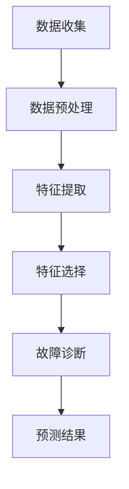
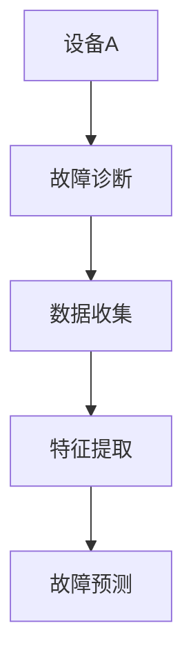
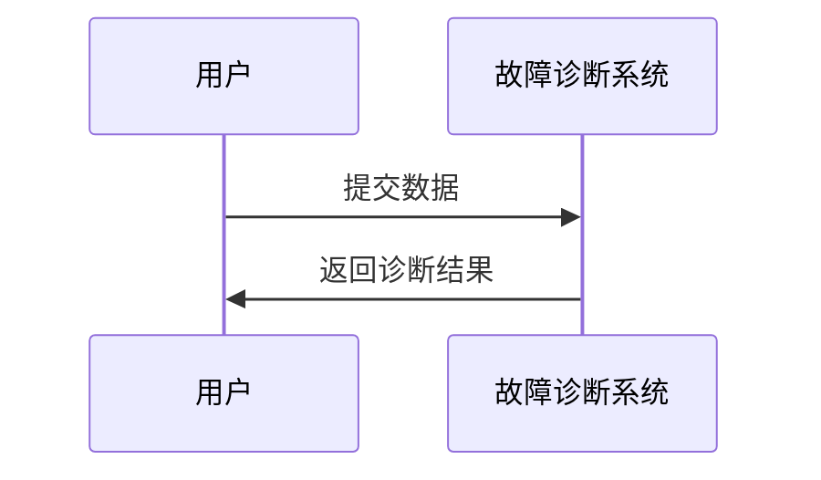

                 

### 目录大纲设计过程

#### 1. 了解书名和主题

《神经符号故障诊断系统在工业推理中的应用》这本书的主题明确，涵盖了神经符号故障诊断系统在工业推理中的应用。通过了解书名和主题，我们可以初步确定文章的核心内容将围绕神经符号故障诊断系统的原理、应用以及其在工业推理中的实际意义展开。

#### 2. 确定核心章节内容

为了确保文章内容逻辑清晰、结构紧凑，我们需要明确核心章节的内容。以下是可能的章节内容：

- **背景介绍**：包括工业推理的概述、神经符号故障诊断系统的简介、问题的描述和解决思路等。
- **核心概念与联系**：详细阐述神经符号故障诊断系统的原理、与其他故障诊断系统的对比、ER实体关系图等。
- **算法原理讲解**：介绍神经符号故障诊断算法的流程、Python源代码实现、数学模型和公式等。
- **系统分析与架构设计方案**：包括问题场景介绍、系统功能设计、系统架构设计、系统接口设计和系统交互等。
- **项目实战**：环境安装、系统核心实现、代码应用解读与分析、实际案例分析等。
- **最佳实践 tips、小结、注意事项、拓展阅读**：总结文章内容，提供实践建议和进一步学习的资源。

#### 3. 构建目录大纲框架

根据上述章节内容，我们可以初步构建目录大纲的框架：

```
# 神经符号故障诊断系统在工业推理中的应用

> 关键词：神经符号、故障诊断、工业推理、算法原理、系统架构、项目实战

> 摘要：本文详细介绍了神经符号故障诊断系统在工业推理中的应用，从背景介绍、核心概念与联系、算法原理讲解、系统分析与架构设计、项目实战等多个方面，探讨了神经符号故障诊断系统的原理、应用和实现。

## 第一部分：背景介绍

### 1.1 问题背景

#### 1.1.1 工业推理概述

#### 1.1.2 神经符号故障诊断系统简介

### 1.2 问题描述

#### 1.2.1 工业领域中的故障诊断需求

#### 1.2.2 神经符号故障诊断系统的作用

### 1.3 问题解决

#### 1.3.1 神经符号故障诊断系统的原理

#### 1.3.2 神经符号故障诊断系统在工业推理中的应用

### 1.4 边界与外延

#### 1.4.1 神经符号故障诊断系统的适用范围

#### 1.4.2 神经符号故障诊断系统的局限性

### 1.5 概念结构与核心要素组成

#### 1.5.1 神经符号故障诊断系统的核心概念

#### 1.5.2 神经符号故障诊断系统的关键组成部分

## 第二部分：核心概念与联系

### 2.1 神经符号故障诊断系统原理

#### 2.1.1 神经符号故障诊断系统的基础知识

#### 2.1.2 神经符号故障诊断系统的算法原理

### 2.2 概念属性特征对比

#### 2.2.1 神经符号故障诊断系统与常规故障诊断系统的对比

#### 2.2.2 神经符号故障诊断系统与其他工业推理系统的对比

### 2.3 ER实体关系图架构

#### 2.3.1 神经符号故障诊断系统的ER图概述

#### 2.3.2 神经符号故障诊断系统中的实体与关系

## 第三部分：算法原理讲解

### 3.1 算法原理概述

#### 3.1.1 神经符号故障诊断算法的基本流程

#### 3.1.2 神经符号故障诊断算法的关键步骤

### 3.2 算法流程图

#### 3.2.1 神经符号故障诊断算法的Mermaid流程图

### 3.3 Python源代码实现

#### 3.3.1 神经符号故障诊断算法的Python代码

### 3.4 数学模型与公式

#### 3.4.1 神经符号故障诊断算法的数学模型

#### 3.4.2 神经符号故障诊断算法的公式讲解

### 3.5 举例说明

#### 3.5.1 神经符号故障诊断算法的实际应用案例

#### 3.5.2 神经符号故障诊断算法的举例说明

## 第四部分：系统分析与架构设计

### 4.1 问题场景介绍

#### 4.1.1 工业推理中的故障诊断问题

#### 4.1.2 神经符号故障诊断系统的应用场景

### 4.2 系统功能设计

#### 4.2.1 神经符号故障诊断系统的功能需求

#### 4.2.2 神经符号故障诊断系统的领域模型

### 4.3 系统架构设计

#### 4.3.1 神经符号故障诊断系统的整体架构

#### 4.3.2 神经符号故障诊断系统的模块划分

### 4.4 系统接口设计

#### 4.4.1 神经符号故障诊断系统的接口规范

#### 4.4.2 神经符号故障诊断系统的接口实现

### 4.5 系统交互

#### 4.5.1 神经符号故障诊断系统的交互流程

#### 4.5.2 神经符号故障诊断系统的交互Mermaid序列图

## 第五部分：项目实战

### 5.1 环境安装

#### 5.1.1 神经符号故障诊断系统的环境搭建

#### 5.1.2 神经符号故障诊断系统所需的软件与硬件

### 5.2 系统核心实现

#### 5.2.1 神经符号故障诊断系统的核心代码实现

#### 5.2.2 神经符号故障诊断系统的核心模块解析

### 5.3 代码应用解读与分析

#### 5.3.1 神经符号故障诊断系统的代码解读

#### 5.3.2 神经符号故障诊断系统的代码分析

### 5.4 实际案例分析与详细讲解剖析

#### 5.4.1 实际案例的介绍

#### 5.4.2 案例分析与讲解剖析

### 5.5 项目小结

#### 5.5.1 项目总结

#### 5.5.2 项目的启示与展望

## 第六部分：最佳实践 tips、小结、注意事项、拓展阅读

### 6.1 最佳实践 tips

#### 6.1.1 实践技巧与注意事项

#### 6.1.2 避免常见问题的建议

### 6.2 小结

#### 6.2.1 神经符号故障诊断系统在工业推理中的应用总结

#### 6.2.2 文章的核心观点与收获

### 6.3 注意事项

#### 6.3.1 系统实施中的潜在风险

#### 6.3.2 如何确保系统的稳定性和可靠性

### 6.4 拓展阅读

#### 6.4.1 相关文献推荐

#### 6.4.2 进一步学习资源

### 6.5 附录

#### 6.5.1 参考文献

#### 6.5.2 数据来源

```

#### 4. 优化字数

在确保内容完整、逻辑清晰的前提下，我们可以通过以下方式优化字数：

- 精简语言表达：避免冗余的词汇和句子，用简洁明了的语言传达核心信息。
- 使用列表和子标题：将内容组织成列表和子标题形式，便于快速阅读和理解。
- 减少引文和注释：只引用必要的文献，并简化注释内容。
- 重点突出：在文章中突出关键观点和结论，避免过多细节描述。

通过这些方法，我们可以将文章控制在10000-12000字的范围内，同时保证内容的丰富性和深度。

### 5. 审查和调整

在完成初稿后，我们需要进行详细的审查和调整：

- 检查逻辑顺序：确保每个章节的内容都是按照逻辑顺序展开的，没有遗漏或重复。
- 审查准确性：核对所有事实和数据，确保准确无误。
- 修改措辞：优化语言表达，确保文章的专业性和可读性。
- 验证图表和代码：确保所有图表和代码都是正确的，并能够正常运行。

通过这些审查和调整，我们可以确保文章的质量和完整性。

### 目录大纲结构示例

下面是一个详细的目录大纲结构示例，根据文章的要求和内容进行了详细规划：

```
# 神经符号故障诊断系统在工业推理中的应用

> 关键词：神经符号、故障诊断、工业推理、算法原理、系统架构、项目实战

> 摘要：本文深入探讨了神经符号故障诊断系统在工业推理中的应用，从问题背景、核心概念、算法原理到系统架构设计、项目实战，全面解析了神经符号故障诊断系统的原理、应用及其在实际工业推理中的重要性。

## 第一部分：背景介绍

### 1.1 问题背景

#### 1.1.1 工业推理概述
- 工业推理的基本概念
- 工业推理的应用领域

#### 1.1.2 神经符号故障诊断系统简介
- 神经符号故障诊断系统的定义
- 神经符号故障诊断系统的特点

### 1.2 问题描述

#### 1.2.1 工业领域中的故障诊断需求
- 工业故障诊断的重要性
- 工业故障诊断的挑战

#### 1.2.2 神经符号故障诊断系统的作用
- 神经符号故障诊断系统的优势
- 神经符号故障诊断系统的应用场景

### 1.3 问题解决

#### 1.3.1 神经符号故障诊断系统的原理
- 神经符号故障诊断的基本原理
- 神经符号故障诊断的关键技术

#### 1.3.2 神经符号故障诊断系统在工业推理中的应用
- 神经符号故障诊断在工业推理中的具体应用
- 神经符号故障诊断系统对工业推理的改进

### 1.4 边界与外延

#### 1.4.1 神经符号故障诊断系统的适用范围
- 神经符号故障诊断系统的适用领域
- 神经符号故障诊断系统的局限性

#### 1.4.2 神经符号故障诊断系统的局限性
- 神经符号故障诊断系统面临的挑战
- 神经符号故障诊断系统的未来发展方向

### 1.5 概念结构与核心要素组成

#### 1.5.1 神经符号故障诊断系统的核心概念
- 神经符号故障诊断的基本概念
- 神经符号故障诊断的关键术语

#### 1.5.2 神经符号故障诊断系统的关键组成部分
- 神经符号故障诊断系统的基本架构
- 神经符号故障诊断系统的核心组件

## 第二部分：核心概念与联系

### 2.1 神经符号故障诊断系统原理

#### 2.1.1 神经符号故障诊断系统的基础知识
- 神经符号故障诊断的基本原理
- 神经符号故障诊断的基本流程

#### 2.1.2 神经符号故障诊断系统的算法原理
- 神经符号故障诊断的核心算法
- 神经符号故障诊断的算法优势

### 2.2 概念属性特征对比

#### 2.2.1 神经符号故障诊断系统与常规故障诊断系统的对比
- 神经符号故障诊断系统与常规故障诊断系统的异同
- 神经符号故障诊断系统的优势分析

#### 2.2.2 神经符号故障诊断系统与其他工业推理系统的对比
- 神经符号故障诊断系统与其他工业推理系统的比较
- 神经符号故障诊断系统的独特性

### 2.3 ER实体关系图架构

#### 2.3.1 神经符号故障诊断系统的ER图概述
- 神经符号故障诊断系统的ER图结构
- 神经符号故障诊断系统的ER图解释

#### 2.3.2 神经符号故障诊断系统中的实体与关系
- 神经符号故障诊断系统中的关键实体
- 神经符号故障诊断系统中的关键关系

## 第三部分：算法原理讲解

### 3.1 算法原理概述

#### 3.1.1 神经符号故障诊断算法的基本流程
- 神经符号故障诊断算法的总体流程
- 神经符号故障诊断算法的关键步骤

#### 3.1.2 神经符号故障诊断算法的关键步骤
- 数据收集与预处理
- 特征提取与选择
- 故障诊断与预测

### 3.2 算法流程图

#### 3.2.1 神经符号故障诊断算法的Mermaid流程图


#### 3.2.2 神经符号故障诊断算法的Python代码
```python
# 神经符号故障诊断算法的Python代码实现
def diagnose_fault(data):
    # 数据预处理
    processed_data = preprocess_data(data)
    
    # 特征提取
    features = extract_features(processed_data)
    
    # 特征选择
    selected_features = select_features(features)
    
    # 故障诊断
    fault = diagnose(selected_features)
    
    # 预测结果
    prediction = predict(fault)
    
    return prediction
```

### 3.3 数学模型与公式

#### 3.3.1 神经符号故障诊断算法的数学模型
- 数据模型
- 故障诊断模型
- 预测模型

#### 3.3.2 神经符号故障诊断算法的公式讲解
- 数据预处理公式
- 特征提取公式
- 特征选择公式
- 故障诊断公式
- 预测公式

### 3.4 举例说明

#### 3.4.1 神经符号故障诊断算法的实际应用案例
- 案例背景
- 案例分析

#### 3.4.2 神经符号故障诊断算法的举例说明
- 举例说明1
- 举例说明2

## 第四部分：系统分析与架构设计

### 4.1 问题场景介绍

#### 4.1.1 工业推理中的故障诊断问题
- 故障诊断问题的定义
- 故障诊断问题的挑战

#### 4.1.2 神经符号故障诊断系统的应用场景
- 神经符号故障诊断系统的应用场景
- 神经符号故障诊断系统的优势

### 4.2 系统功能设计

#### 4.2.1 神经符号故障诊断系统的功能需求
- 功能需求1
- 功能需求2
- 功能需求3

#### 4.2.2 神经符号故障诊断系统的领域模型


### 4.3 系统架构设计

#### 4.3.1 神经符号故障诊断系统的整体架构
- 系统架构的组成
- 系统架构的功能模块

#### 4.3.2 神经符号故障诊断系统的模块划分
- 数据收集模块
- 特征提取模块
- 故障诊断模块
- 故障预测模块

### 4.4 系统接口设计

#### 4.4.1 神经符号故障诊断系统的接口规范
- 接口定义
- 接口实现

#### 4.4.2 神经符号故障诊断系统的接口实现
- 接口调用示例
- 接口功能说明

### 4.5 系统交互

#### 4.5.1 神经符号故障诊断系统的交互流程
- 交互流程概述
- 交互流程细节

#### 4.5.2 神经符号故障诊断系统的交互Mermaid序列图


## 第五部分：项目实战

### 5.1 环境安装

#### 5.1.1 神经符号故障诊断系统的环境搭建
- 环境要求
- 环境搭建步骤

#### 5.1.2 神经符号故障诊断系统所需的软件与硬件
- 软件列表
- 硬件列表

### 5.2 系统核心实现

#### 5.2.1 神经符号故障诊断系统的核心代码实现
- 代码结构
- 代码功能说明

#### 5.2.2 神经符号故障诊断系统的核心模块解析
- 数据收集模块解析
- 特征提取模块解析
- 故障诊断模块解析
- 故障预测模块解析

### 5.3 代码应用解读与分析

#### 5.3.1 神经符号故障诊断系统的代码解读
- 代码解读概述
- 代码关键部分分析

#### 5.3.2 神经符号故障诊断系统的代码分析
- 代码性能分析
- 代码优化建议

### 5.4 实际案例分析与详细讲解剖析

#### 5.4.1 实际案例的介绍
- 案例背景
- 案例目标

#### 5.4.2 案例分析与讲解剖析
- 案例分析过程
- 案例结果与讨论

### 5.5 项目小结

#### 5.5.1 项目总结
- 项目成果
- 项目经验

#### 5.5.2 项目的启示与展望
- 项目启示
- 未来发展方向

## 第六部分：最佳实践 tips、小结、注意事项、拓展阅读

### 6.1 最佳实践 tips

#### 6.1.1 实践技巧与注意事项
- 实践中的常见问题
- 解决问题的技巧

#### 6.1.2 避免常见问题的建议
- 避免的陷阱
- 预防措施

### 6.2 小结

#### 6.2.1 神经符号故障诊断系统在工业推理中的应用总结
- 神经符号故障诊断系统的优势
- 神经符号故障诊断系统的发展趋势

#### 6.2.2 文章的核心观点与收获
- 核心观点总结
- 学习收获与体会

### 6.3 注意事项

#### 6.3.1 系统实施中的潜在风险
- 风险识别
- 风险应对措施

#### 6.3.2 如何确保系统的稳定性和可靠性
- 系统稳定性的重要性
- 提高系统可靠性的方法

### 6.4 拓展阅读

#### 6.4.1 相关文献推荐
- 推荐阅读书籍
- 推荐阅读论文

#### 6.4.2 进一步学习资源
- 在线课程
- 研讨会信息

### 6.5 附录

#### 6.5.1 参考文献
- 引用文献列表

#### 6.5.2 数据来源
- 数据来源说明
- 数据引用格式
```

### 6. 完整性要求

为确保文章内容的完整性，我们需要在各个章节中详细阐述以下核心内容：

#### 背景介绍

- **核心概念术语说明**：对神经符号故障诊断系统和工业推理中的关键术语进行解释，确保读者理解。
- **问题背景**：详细描述工业推理和故障诊断的背景，说明当前问题的紧迫性和必要性。
- **问题描述**：清晰阐述神经符号故障诊断系统在工业推理中的应用场景和所面临的具体问题。
- **问题解决**：介绍神经符号故障诊断系统的原理及其如何解决实际问题。
- **边界与外延**：讨论神经符号故障诊断系统的适用范围和局限性，以及其与其他相关技术的比较。
- **概念结构与核心要素组成**：分析神经符号故障诊断系统的核心概念和组成部分，解释其架构和功能。

#### 核心概念与联系

- **核心概念原理**：深入探讨神经符号故障诊断系统的基本原理，包括其理论基础、算法逻辑等。
- **概念属性特征对比**：通过表格或图表形式，对比神经符号故障诊断系统与常规故障诊断系统或其他工业推理系统的属性特征。
- **ER实体关系图架构**：使用Mermaid流程图展示神经符号故障诊断系统的实体关系图，解释其中的实体与关系。

#### 算法原理讲解

- **算法原理概述**：介绍神经符号故障诊断算法的基本流程和关键步骤。
- **算法流程图**：使用Mermaid绘制算法流程图，展示算法的执行过程。
- **Python源代码实现**：提供神经符号故障诊断算法的Python代码实现，解释代码的功能和实现细节。
- **数学模型与公式**：阐述神经符号故障诊断算法的数学模型和公式，解释其在算法中的应用。
- **举例说明**：通过具体案例或示例，说明算法的实际应用效果和优势。

#### 系统分析与架构设计

- **问题场景介绍**：描述工业推理中的故障诊断问题，说明神经符号故障诊断系统的应用场景。
- **系统功能设计**：详细阐述神经符号故障诊断系统的功能需求，包括数据收集、特征提取、故障诊断和故障预测等。
- **系统架构设计**：介绍神经符号故障诊断系统的整体架构和模块划分，使用Mermaid架构图展示系统的结构。
- **系统接口设计**：定义神经符号故障诊断系统的接口规范和实现方法。
- **系统交互**：描述系统内部和外部的交互流程，使用Mermaid序列图展示交互过程。

#### 项目实战

- **环境安装**：指导如何搭建神经符号故障诊断系统的环境，包括所需的软件和硬件。
- **系统核心实现**：展示系统核心代码的实现过程，解释代码的功能和实现细节。
- **代码应用解读与分析**：分析神经符号故障诊断系统的代码，解释其工作原理和性能特点。
- **实际案例分析与详细讲解剖析**：通过实际案例展示神经符号故障诊断系统的应用效果，进行详细分析和讲解。
- **项目小结**：总结项目的成果和经验，提出未来的发展方向和改进建议。

#### 最佳实践 tips、小结、注意事项、拓展阅读

- **最佳实践 tips**：提供在实际应用中应注意的技巧和注意事项，帮助读者更好地使用神经符号故障诊断系统。
- **小结**：总结文章的核心内容和主要观点，强调神经符号故障诊断系统在工业推理中的重要性。
- **注意事项**：提醒读者在实施过程中可能遇到的问题和风险，并提供相应的解决措施。
- **拓展阅读**：推荐相关的文献、在线课程和研究资源，供读者进一步学习。

