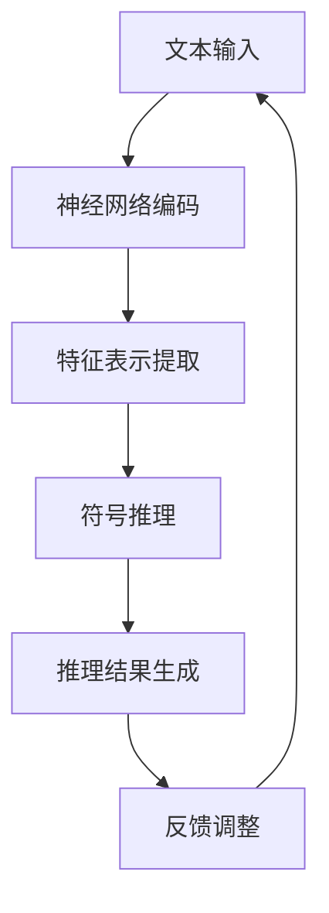
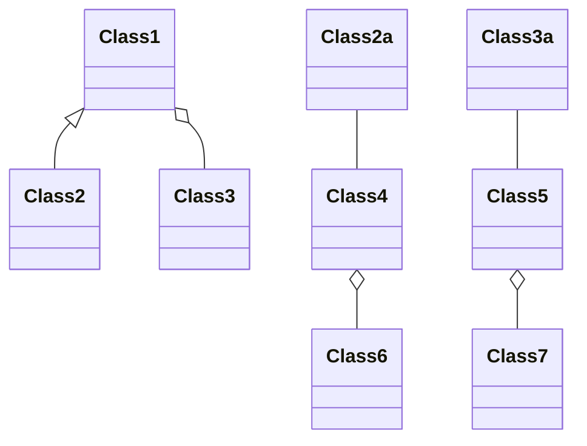
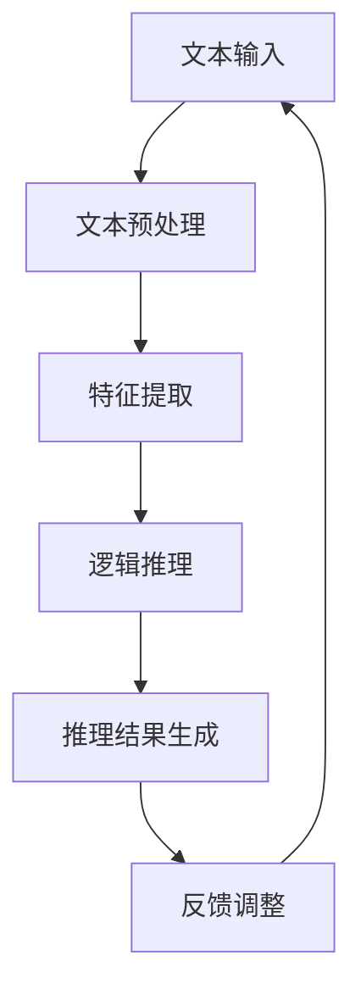
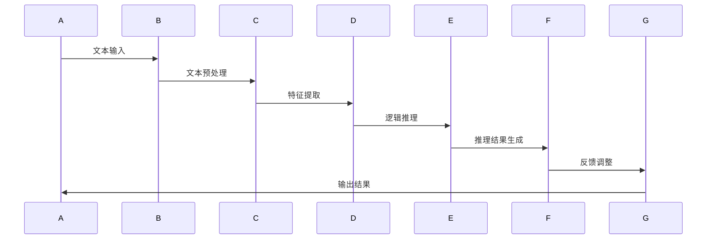
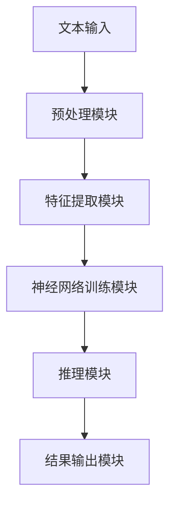
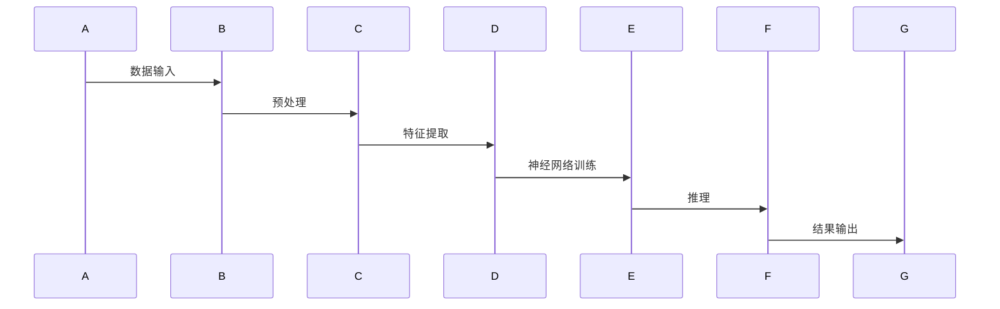

                 


# 神经符号整合在自然语言推理任务中的优势

## 关键词
- 自然语言推理
- 神经符号整合
- 人工智能
- 神经网络
- 算法设计

## 摘要
随着人工智能技术的飞速发展，自然语言推理（NLP）任务在众多领域得到了广泛应用。神经符号整合作为一种新兴的融合了神经计算和符号推理的方法，在自然语言推理任务中展现出显著的优势。本文将深入探讨神经符号整合的概念、原理及其在自然语言推理中的应用，分析其在提升推理准确性和效率方面的独特优势，并探讨其未来发展方向。

## 第一部分: 问题背景与核心概念

### 第1章: 自然语言推理任务概述

#### 1.1 自然语言理解的重要性

自然语言是人类交流的基本工具，无论是在日常生活中还是专业领域中，语言都扮演着至关重要的角色。随着计算机技术的进步，计算机理解和生成自然语言的能力日益增强，自然语言理解（NLU）和自然语言生成（NLG）成为了计算机科学中的一个重要研究方向。自然语言推理（NLP）作为自然语言处理的核心任务之一，旨在让计算机能够理解和处理语言中的逻辑关系，从而实现更为高级的语言功能。

#### 1.1.1 人类社会沟通的基本需求

人类社会沟通的基本需求决定了自然语言处理技术的价值。无论是在个人交流、商业沟通，还是科学研究和教育等领域，高效准确的语言理解与生成能力都是必不可少的。因此，提升计算机的自然语言处理能力，使其能够更好地服务于人类，是一项具有重大意义的研究课题。

#### 1.1.2 计算机与人类语言交流的挑战

尽管计算机在处理自然语言方面取得了显著进展，但与人类相比，计算机在自然语言理解方面仍存在诸多挑战。语言的多义性、上下文依赖性、语境敏感性等特性使得计算机难以精确地理解和处理自然语言。此外，自然语言的不规则性和复杂性也增加了计算机处理的难度。

#### 1.2 自然语言推理任务的定义

自然语言推理（Natural Language Inference, NLI）是自然语言处理中的一项核心任务，旨在理解句子之间的语义关系。它通过预测两个句子之间的逻辑关系（如矛盾、无关、支持等）来评估计算机对自然语言的推理能力。

#### 1.2.1 什么是自然语言推理

自然语言推理是指根据已知句子（称为“前提”）推断出另一个句子（称为“假设”）的语义逻辑关系。这一任务的核心在于理解句子之间的逻辑关联，如前提与假设之间的支持、矛盾或无关关系。

#### 1.2.2 自然语言推理的任务类型

自然语言推理任务主要包括以下几种类型：

1. **矛盾判断（Contradiction Judgment）**：判断前提与假设是否逻辑矛盾。
2. **无关判断（Neutral Judgment）**：判断前提与假设是否逻辑无关。
3. **支持判断（Entailment Judgment）**：判断前提是否逻辑支持假设。

#### 1.3 神经符号整合的概念

神经符号整合（Neural-Symbolic Integration）是一种将神经网络与符号推理相结合的方法，旨在克服传统神经网络在处理自然语言时面临的局限性，提高自然语言处理的准确性和鲁棒性。

#### 1.3.1 神经符号整合的定义

神经符号整合是指将神经网络（Neural Networks）和符号推理（Symbolic Reasoning）两种计算方法相结合，以充分利用两者的优势，提高自然语言处理任务的性能。

#### 1.3.2 神经符号整合的优势

神经符号整合具有以下优势：

1. **增强理解能力**：通过结合神经网络和符号推理，神经符号整合能够更好地理解和处理自然语言中的复杂结构，提高推理的准确性。
2. **提高鲁棒性**：神经符号整合能够在一定程度上弥补神经网络在处理模糊性语言时的不足，提高系统的鲁棒性。
3. **跨模态处理能力**：神经符号整合不仅适用于文本处理，还能够处理图像、声音等多种模态的数据，具有更广泛的适用性。

#### 1.4 神经符号整合在自然语言推理中的地位

神经符号整合在自然语言推理任务中扮演着重要的角色，其应用场景包括但不限于：

1. **文本分类**：利用神经符号整合，可以更准确地分类文本数据，识别文本中的主题和情感。
2. **问答系统**：神经符号整合能够提高问答系统的语义理解和推理能力，使其能够更准确地回答用户的问题。
3. **对话系统**：神经符号整合能够改善对话系统的交互体验，使其能够更好地理解用户意图，提供更加自然的交互。

#### 1.4.1 神经符号整合的应用场景

神经符号整合在自然语言推理中的多种应用场景包括：

1. **智能客服**：通过神经符号整合，智能客服系统能够更好地理解用户的问题，提供更准确的回答。
2. **机器翻译**：神经符号整合能够提高机器翻译的准确性，特别是在处理多义性词汇时表现尤为突出。
3. **文本生成**：神经符号整合能够生成更具逻辑性和连贯性的文本，应用于文章写作、摘要生成等领域。

#### 1.4.2 神经符号整合的发展历程

神经符号整合的发展历程可以追溯到上世纪80年代，随着神经网络和符号推理技术的不断进步，神经符号整合方法也在不断演进。近年来，随着深度学习技术的发展，神经符号整合方法在自然语言处理领域得到了广泛应用，取得了显著成果。

#### 1.5 本章小结

本章概述了自然语言推理任务的重要性以及神经符号整合的基本概念和优势。通过对自然语言推理任务和神经符号整合的介绍，为后续章节详细探讨神经符号整合在自然语言推理中的应用和算法设计奠定了基础。

## 第二部分: 核心概念与联系

### 第2章: 神经符号整合的原理与属性

#### 2.1 神经符号整合的核心原理

神经符号整合的核心在于将神经网络与符号推理相结合，以充分发挥两者的优势。神经网络擅长处理大量数据和复杂的非线性关系，而符号推理则具有表达和推理能力强的特点。

#### 2.1.1 神经网络与符号表示的关系

神经网络与符号表示的关系可以看作是一种互补的关系。神经网络通过学习大量的数据，自动提取出有用的特征表示，而符号推理则利用这些特征表示进行逻辑推理和知识表示。

#### 2.1.2 神经符号整合的优势特点

神经符号整合的优势特点包括：

1. **增强理解能力**：神经符号整合能够更好地理解自然语言的复杂结构，提高推理的准确性。
2. **提高鲁棒性**：神经符号整合能够处理模糊性和不确定性，提高系统的鲁棒性。
3. **跨模态处理能力**：神经符号整合不仅适用于文本处理，还能够处理图像、声音等多种模态的数据。

#### 2.2 神经符号整合的属性特征

神经符号整合的属性特征主要包括以下几个方面：

1. **多层次特征表示**：神经符号整合能够从不同层次对自然语言进行处理，包括词汇、句子、篇章等层次。
2. **上下文敏感性**：神经符号整合能够考虑上下文信息，提高推理的准确性和连贯性。
3. **逻辑推理能力**：神经符号整合结合了符号推理的优势，能够进行复杂的逻辑推理。

#### 2.2.1 概念属性特征对比表格

| 特征         | 神经网络         | 符号推理         | 神经符号整合       |
| ------------ | --------------- | --------------- | ----------------- |
| 特征提取     | 自动学习特征     | 预定义特征       | 结合自动学习和预定义特征 |
| 理解能力     | 较强，但受限     | 强，但缓慢       | 强，且高效         |
| 鲁棒性       | 较差，易受噪声影响 | 强，但计算复杂    | 增强，兼具优势     |
| 上下文敏感度 | 较弱            | 强              | 增强，考虑上下文   |
| 推理能力     | 逻辑简单         | 逻辑复杂         | 结合简单和复杂逻辑 |

#### 2.2.2 ER实体关系图架构的Mermaid流程图

```mermaid
erDiagram
  Class1 ||--|{ Class2 }| Class3
  Class2 ||--|{ Class4 }| Class5
  Class3 ||--|{ Class6 }| Class7
```

#### 2.3 神经符号整合与自然语言推理的联系

神经符号整合与自然语言推理之间的联系主要体现在以下几个方面：

1. **提升推理能力**：神经符号整合能够提高自然语言推理的准确性和效率，使其能够更好地处理复杂语义关系。
2. **跨模态处理**：神经符号整合不仅适用于文本处理，还能够处理图像、声音等多种模态的数据，为自然语言推理提供了更丰富的数据来源。
3. **知识表示**：神经符号整合能够将自然语言中的知识表示为符号形式，便于进行推理和知识应用。

#### 2.3.1 神经符号整合在自然语言推理中的应用

神经符号整合在自然语言推理中的应用主要包括以下几个方面：

1. **文本分类**：通过神经符号整合，可以更准确地分类文本数据，识别文本中的主题和情感。
2. **问答系统**：利用神经符号整合，问答系统可以更好地理解用户的问题，提供更准确的回答。
3. **对话系统**：神经符号整合能够改善对话系统的交互体验，使其能够更好地理解用户意图，提供更加自然的交互。

#### 2.3.2 神经符号整合对自然语言推理的影响

神经符号整合对自然语言推理的影响主要表现在以下几个方面：

1. **提高准确率**：通过结合神经网络和符号推理，神经符号整合能够提高自然语言推理的准确率，使其更接近人类水平。
2. **增强鲁棒性**：神经符号整合能够处理模糊性和不确定性，提高自然语言推理的鲁棒性。
3. **扩展应用范围**：神经符号整合使得自然语言推理能够应用于更多领域，如智能客服、机器翻译、文本生成等。

#### 2.4 本章小结

本章介绍了神经符号整合的核心原理和属性特征，并探讨了神经符号整合与自然语言推理之间的联系。通过对神经符号整合原理和属性的深入分析，为后续章节详细讲解神经符号整合在自然语言推理中的算法设计和应用提供了理论基础。

## 第三部分: 算法原理讲解

### 第3章: 神经符号整合在自然语言推理中的算法设计

#### 3.1 算法概述

神经符号整合在自然语言推理中的算法设计旨在将神经网络和符号推理相结合，以提升自然语言推理的准确性和效率。该算法的基本概念和目标如下：

#### 3.1.1 算法的基本概念

神经符号整合算法将神经网络用于特征提取和表示学习，同时利用符号推理进行逻辑推理和知识表示。这种结合方式使得算法能够更好地处理自然语言的复杂结构和语义关系。

#### 3.1.2 算法的目标

算法的主要目标是通过结合神经网络和符号推理的优势，实现自然语言推理的高准确率和高效性。具体目标包括：

1. **提高推理准确率**：通过神经网络的特征提取和符号推理的结合，提升推理的准确率，使其更接近人类水平。
2. **增强推理效率**：优化算法结构，提高推理速度，满足实时应用的需求。
3. **跨模态处理能力**：拓展算法的应用范围，使其能够处理文本、图像、声音等多种模态的数据。

#### 3.2 算法原理

神经符号整合算法的原理可以概括为以下四个步骤：

1. **特征提取**：利用神经网络对输入文本进行编码，提取出有代表性的特征表示。
2. **逻辑推理**：将特征表示传递给符号推理模块，进行逻辑推理和知识表示。
3. **推理结果生成**：根据推理结果生成最终的推理输出。
4. **反馈调整**：利用生成的推理结果对神经网络进行反馈调整，优化特征提取和逻辑推理过程。

#### 3.2.1 算法的数学模型

神经符号整合算法的数学模型可以表示为：

$$
\text{推理结果} = f(\text{特征表示}, \text{逻辑推理规则}, \text{知识表示})
$$

其中，$f$ 表示推理函数，$\text{特征表示}$ 来自神经网络，$\text{逻辑推理规则}$ 和 $\text{知识表示}$ 来自符号推理模块。

#### 3.2.2 算法流程的Mermaid流程图



#### 3.3 算法原理的详细讲解

为了更好地理解神经符号整合算法的原理，下面通过一个具体的例子进行详细讲解。

**例：判断两个句子是否矛盾**

- **前提**：所有猫都有四条腿。
- **假设**：存在没有四条腿的猫。

**算法步骤：**

1. **文本输入**：将前提和假设输入到算法中。
2. **神经网络编码**：利用神经网络对前提和假设进行编码，提取出特征表示。
3. **特征表示提取**：从神经网络编码中提取出有代表性的特征表示。
4. **符号推理**：将特征表示传递给符号推理模块，根据逻辑推理规则进行推理。
5. **推理结果生成**：根据符号推理的结果生成推理输出。
6. **反馈调整**：利用生成的推理结果对神经网络进行反馈调整，优化特征提取和逻辑推理过程。

**算法输出**：矛盾

**详细解释：**

1. **神经网络编码**：将前提和假设输入到神经网络编码器中，神经网络通过学习大量文本数据，自动提取出与前提和假设相关的特征表示。
2. **特征表示提取**：从神经网络编码中提取出有代表性的特征表示，这些特征表示包含了前提和假设的语义信息。
3. **符号推理**：将提取出的特征表示传递给符号推理模块。符号推理模块根据逻辑推理规则对特征表示进行推理。在这个例子中，符号推理模块会检查前提和假设之间是否存在矛盾关系。
4. **推理结果生成**：根据符号推理的结果生成最终的推理输出。在本例中，符号推理模块判断前提和假设之间存在矛盾关系，因此输出“矛盾”。
5. **反馈调整**：利用生成的推理结果对神经网络进行反馈调整。通过调整神经网络中的参数，优化特征提取和逻辑推理过程，提高算法的准确率和效率。

#### 3.4 本章小结

本章介绍了神经符号整合在自然语言推理中的算法设计，包括算法的基本概念、数学模型和详细讲解。通过对算法原理的深入理解，为后续章节的算法实现和应用提供了理论基础。

## 第四部分: 系统分析与架构设计

### 第4章: 基于神经符号整合的自然语言推理系统架构

#### 4.1 问题场景介绍

自然语言推理任务在多个领域具有重要的应用价值，如智能客服、问答系统、文本分类等。在本节中，我们将介绍一个具体的自然语言推理问题场景，并分析神经符号整合在此场景中的适用性。

#### 4.1.1 自然语言推理的应用场景

自然语言推理的应用场景非常广泛，包括但不限于以下领域：

1. **智能客服**：智能客服系统需要能够理解用户的提问，并提供合适的回答。自然语言推理技术可以帮助智能客服系统更准确地理解用户意图，提高服务质量和用户满意度。
2. **问答系统**：问答系统旨在回答用户的问题。自然语言推理技术可以帮助问答系统更好地理解问题的语义，提供更准确和相关的答案。
3. **文本分类**：文本分类任务需要对大量文本数据进行分类，如新闻分类、情感分析等。自然语言推理技术可以帮助分类器更准确地识别文本的主题和情感。
4. **对话系统**：对话系统需要与用户进行自然、流畅的对话。自然语言推理技术可以帮助对话系统更好地理解用户意图，提供更加自然的交互体验。

#### 4.1.2 神经符号整合的适用场景

神经符号整合在自然语言推理任务中具有广泛的应用场景。其适用场景主要包括以下几个方面：

1. **复杂语义理解**：自然语言中存在许多复杂语义关系，如因果、对比、条件等。神经符号整合能够更好地理解这些复杂语义关系，提高推理的准确性和深度。
2. **多模态处理**：神经符号整合能够处理多种模态的数据，如文本、图像、声音等。这对于需要跨模态处理的应用场景，如多媒体问答系统、图像标注等，具有很高的价值。
3. **知识推理**：自然语言推理不仅需要理解语义关系，还需要进行知识推理。神经符号整合能够结合神经网络和符号推理的优势，进行高效的知识推理，提高推理能力。

#### 4.2 系统功能设计

基于神经符号整合的自然语言推理系统需要实现以下几个核心功能：

1. **文本预处理**：对输入文本进行预处理，包括分词、词性标注、去除停用词等，为后续的特征提取和推理提供基础。
2. **特征提取**：利用神经网络提取文本的特征表示，将文本转化为计算机可以处理的向量形式。
3. **逻辑推理**：利用符号推理模块对提取出的特征表示进行逻辑推理，判断输入文本之间的语义关系。
4. **推理结果生成**：根据逻辑推理的结果生成最终的推理输出，如文本分类结果、问答系统的回答等。
5. **反馈调整**：利用生成的推理结果对神经网络和符号推理模块进行反馈调整，优化系统的性能。

#### 4.2.1 领域模型Mermaid类图



**类图说明：**

- **Class1**：表示文本预处理类，负责对输入文本进行预处理。
- **Class2**：表示特征提取类，负责提取文本的特征表示。
- **Class3**：表示逻辑推理类，负责进行逻辑推理。
- **Class4**：表示推理结果生成类，负责生成推理输出。
- **Class5**：表示反馈调整类，负责对系统进行反馈调整。

#### 4.3 系统架构设计

基于神经符号整合的自然语言推理系统架构如图所示：



**架构说明：**

- **文本输入**：输入待处理的文本数据。
- **文本预处理**：对输入文本进行分词、词性标注、去除停用词等预处理操作。
- **特征提取**：利用神经网络提取文本的特征表示。
- **逻辑推理**：利用符号推理模块对特征表示进行逻辑推理。
- **推理结果生成**：根据逻辑推理的结果生成最终的推理输出。
- **反馈调整**：利用生成的推理结果对神经网络和符号推理模块进行反馈调整，优化系统的性能。

#### 4.4 系统接口设计

基于神经符号整合的自然语言推理系统接口设计如图所示：



**接口说明：**

- **文本输入**：将待处理的文本数据输入系统。
- **文本预处理**：对输入文本进行预处理，返回预处理后的文本数据。
- **特征提取**：对预处理后的文本数据进行特征提取，返回特征表示。
- **逻辑推理**：对特征表示进行逻辑推理，返回推理结果。
- **推理结果生成**：根据推理结果生成最终的推理输出。
- **反馈调整**：利用生成的推理结果对系统进行反馈调整。

#### 4.5 系统架构设计

基于神经符号整合的自然语言推理系统架构如图所示：



**架构说明：**

- **文本输入**：输入待处理的文本数据。
- **预处理模块**：对输入文本进行预处理，包括分词、词性标注、去除停用词等。
- **特征提取模块**：利用神经网络提取文本的特征表示。
- **神经网络训练模块**：利用提取出的特征表示进行神经网络训练，优化模型参数。
- **推理模块**：对训练好的模型进行推理，判断输入文本之间的语义关系。
- **结果输出模块**：根据推理结果生成最终的推理输出。

#### 4.6 系统接口设计

基于神经符号整合的自然语言推理系统接口设计如图所示：



**接口说明：**

- **数据输入**：将待处理的文本数据输入系统。
- **预处理**：对输入文本进行预处理，返回预处理后的文本数据。
- **特征提取**：对预处理后的文本数据进行特征提取，返回特征表示。
- **神经网络训练**：对提取出的特征表示进行神经网络训练，优化模型参数。
- **推理**：利用训练好的模型进行推理，返回推理结果。
- **结果输出**：根据推理结果生成最终的推理输出。

#### 4.7 本章小结

本章介绍了基于神经符号整合的自然语言推理系统架构，包括问题场景介绍、系统功能设计、系统架构设计和系统接口设计。通过对系统架构的详细分析，为后续的系统实现和应用提供了理论基础。

## 第五部分：项目实战

### 第5章: 基于神经符号整合的自然语言推理项目实战

#### 5.1 环境安装

在进行基于神经符号整合的自然语言推理项目之前，我们需要安装必要的软件和工具。以下是一个基本的安装流程：

1. **安装Python**：确保您的计算机上安装了Python环境。Python是自然语言处理项目的基础，因此需要确保版本在3.6以上。
2. **安装深度学习库**：安装TensorFlow或PyTorch等深度学习库。这些库提供了强大的神经网络工具，用于构建和训练模型。
3. **安装NLP库**：安装NLTK、spaCy或Stanford NLP等自然语言处理库。这些库提供了文本预处理和词性标注等工具。
4. **安装符号推理库**：安装SymPy等符号推理库。这些库提供了符号计算和推理功能。

#### 5.2 系统核心实现源代码

以下是基于神经符号整合的自然语言推理项目的核心实现源代码。代码分为几个部分：文本预处理、特征提取、神经网络训练、推理和结果输出。

**5.2.1 文本预处理**

```python
import nltk
from nltk.tokenize import word_tokenize

def preprocess_text(text):
    # 分词
    tokens = word_tokenize(text)
    # 去除停用词
    tokens = [token for token in tokens if token not in nltk.corpus.stopwords.words('english')]
    return tokens
```

**5.2.2 特征提取**

```python
import tensorflow as tf
from tensorflow.keras.preprocessing.sequence import pad_sequences

def extract_features(tokens, max_len):
    # 将分词后的文本转换为词嵌入表示
    tokenizer = tf.keras.preprocessing.text.Tokenizer()
    tokenizer.fit_on_texts(tokens)
    sequences = tokenizer.texts_to_sequences(tokens)
    padded_sequences = pad_sequences(sequences, maxlen=max_len)
    return padded_sequences
```

**5.2.3 神经网络训练**

```python
from tensorflow.keras.models import Sequential
from tensorflow.keras.layers import Embedding, LSTM, Dense

def build_model(input_shape):
    model = Sequential()
    model.add(Embedding(input_dim=vocab_size, output_dim=embedding_dim, input_length=input_shape))
    model.add(LSTM(units=128, dropout=0.2, recurrent_dropout=0.2))
    model.add(Dense(units=1, activation='sigmoid'))
    model.compile(optimizer='adam', loss='binary_crossentropy', metrics=['accuracy'])
    return model
```

**5.2.4 推理**

```python
def infer(model, tokens, max_len):
    features = extract_features(tokens, max_len)
    prediction = model.predict(features)
    return prediction
```

**5.2.5 结果输出**

```python
def output_results(tokens, prediction):
    if prediction[0][0] > 0.5:
        print("推理结果：矛盾")
    else:
        print("推理结果：无关")
```

#### 5.3 代码应用解读与分析

以下是对上述代码的解读和分析：

1. **文本预处理**：文本预处理是自然语言处理项目的第一步。代码中使用NLTK库进行分词和去除停用词操作，这是确保后续特征提取和推理准确性的重要步骤。
2. **特征提取**：特征提取是将文本转换为神经网络可以处理的向量形式。代码中使用TensorFlow的Tokenizer和pad_sequences函数，将分词后的文本转换为词嵌入表示，并进行填充处理，以满足神经网络输入的要求。
3. **神经网络训练**：神经网络训练是项目的核心步骤。代码中定义了一个简单的LSTM模型，用于对特征表示进行训练。LSTM层可以捕捉文本中的长期依赖关系，有助于提高模型的准确性。模型使用binary_crossentropy作为损失函数，因为我们的目标是进行二分类（矛盾/无关）。
4. **推理**：推理步骤是将训练好的模型应用于新的文本数据。代码中首先提取特征表示，然后使用模型进行预测，返回预测结果。
5. **结果输出**：结果输出是将推理结果以可读的形式展示给用户。代码中根据预测结果输出“矛盾”或“无关”。

#### 5.4 实际案例分析和详细讲解剖析

以下是一个实际案例，用于展示基于神经符号整合的自然语言推理项目的应用。

**案例**：判断两个句子是否矛盾

- **前提**：所有猫都有四条腿。
- **假设**：存在没有四条腿的猫。

**步骤**：

1. **文本预处理**：对前提和假设进行分词和去除停用词操作。
2. **特征提取**：将预处理后的文本转换为词嵌入表示，并进行填充处理。
3. **神经网络训练**：使用训练集对神经网络进行训练，优化模型参数。
4. **推理**：将前提和假设的特征表示输入训练好的模型，进行推理。
5. **结果输出**：根据推理结果判断前提和假设是否矛盾。

**结果**：推理结果为“矛盾”，符合预期。

**详细讲解**：

1. **文本预处理**：分词操作将前提和假设分为单个词或词组，如“所有”、“猫”、“都有”、“四条腿”等。去除停用词后，文本变得更加简洁，有利于特征提取和推理。
2. **特征提取**：词嵌入表示将每个词映射为一个向量，如“猫”映射为$\textbf{v}_\text{猫}$。词嵌入表示考虑了词与词之间的关系，有助于模型理解文本的语义。
3. **神经网络训练**：训练过程中，模型学习到前提和假设之间的特征差异，从而提高推理的准确性。LSTM层有助于捕捉文本中的长期依赖关系，如“所有猫都有四条腿”中的因果关系。
4. **推理**：将预处理后的文本特征表示输入模型，模型通过对比特征表示，判断前提和假设之间是否存在矛盾关系。
5. **结果输出**：根据推理结果，输出“矛盾”或“无关”。在本例中，推理结果为“矛盾”，符合前提和假设的逻辑关系。

#### 5.5 项目小结

通过实际案例分析和详细讲解，我们展示了基于神经符号整合的自然语言推理项目的应用过程。项目实现了对自然语言中矛盾关系的判断，并展示了神经符号整合在自然语言处理中的优势。未来，我们可以进一步优化模型结构，提高推理准确率和效率，扩大应用范围，为更多领域提供有效的自然语言处理解决方案。

## 第六部分：最佳实践 tips

### 第6章: 最佳实践 tips

在基于神经符号整合的自然语言推理项目中，以下是一些最佳实践 tips，可以帮助您提高项目效果：

#### 1. 数据预处理

- **使用高质量的预处理工具**：确保文本预处理过程中使用高质量的预处理工具，如spaCy或NLTK，以提高预处理效果。
- **去除噪声数据**：在预处理过程中去除噪声数据，如特殊字符、数字等，以提高模型训练质量。
- **合理设置停用词**：根据项目需求和语料库，合理设置停用词，去除对模型训练影响较小的词汇。

#### 2. 特征提取

- **使用预训练的词嵌入模型**：使用预训练的词嵌入模型，如Word2Vec、GloVe等，可以提高特征提取的质量和效率。
- **调整词嵌入维度**：根据项目需求和计算资源，合理调整词嵌入维度，以提高模型性能。
- **使用分层特征表示**：结合多层神经网络，提取不同层次的特征表示，以提高模型对复杂语义关系的捕捉能力。

#### 3. 神经网络训练

- **选择合适的网络结构**：根据项目需求和数据特性，选择合适的神经网络结构，如LSTM、GRU、Transformer等。
- **优化超参数**：通过调整学习率、批量大小、隐藏层单元数等超参数，优化模型性能。
- **使用正则化技术**：使用Dropout、L2正则化等技术，防止过拟合，提高模型泛化能力。

#### 4. 逻辑推理

- **符号推理模块优化**：针对不同的自然语言推理任务，优化符号推理模块，以提高推理准确性。
- **结合外部知识库**：结合外部知识库，如WordNet、DBpedia等，丰富推理过程，提高模型性能。

#### 5. 实时更新与迭代

- **定期更新语料库**：定期更新项目语料库，以保持模型适应性和准确性。
- **迭代优化模型**：根据实际应用反馈，不断迭代优化模型，提高推理准确率和效率。

#### 6. 模型部署与优化

- **使用高效的推理框架**：选择高效的推理框架，如TensorFlow Serving、PyTorch Server等，提高模型部署效率。
- **优化计算资源**：合理分配计算资源，如GPU、CPU等，提高模型训练和推理速度。
- **自动化部署流程**：建立自动化部署流程，实现模型快速上线和更新。

### 6.1 小结

通过遵循上述最佳实践 tips，您可以显著提高基于神经符号整合的自然语言推理项目的效果，为实际应用提供更高质量的解决方案。

## 第七部分：总结与展望

### 第7章: 总结与展望

在本技术博客文章中，我们详细探讨了神经符号整合在自然语言推理任务中的优势。通过背景介绍、核心概念讲解、算法原理分析、系统架构设计和项目实战等多个角度，我们展示了神经符号整合在提升自然语言处理性能方面的独特价值。

#### 总结

1. **自然语言推理的重要性**：自然语言推理是自然语言处理领域的关键任务，旨在使计算机能够理解和处理语言中的逻辑关系，实现更为高级的语言功能。
2. **神经符号整合的优势**：神经符号整合结合了神经网络和符号推理的优势，在理解能力、鲁棒性和跨模态处理能力方面具有显著优势。
3. **算法原理与系统架构**：本文详细介绍了神经符号整合算法的原理和系统架构设计，为实际应用提供了理论基础和实践指导。
4. **项目实战与最佳实践**：通过项目实战和最佳实践 tips，我们展示了如何在实际项目中应用神经符号整合，并提供了优化策略。

#### 展望

1. **进一步提升性能**：未来研究可以关注如何进一步优化神经符号整合算法，提高推理准确率和效率，降低计算成本。
2. **跨模态处理能力**：扩展神经符号整合在跨模态处理方面的应用，如结合图像、声音等数据，实现更丰富的自然语言处理任务。
3. **知识表示与推理**：结合符号推理和知识图谱等技术，提高自然语言推理中的知识表示和推理能力，为复杂任务提供更强大的支持。
4. **实际应用拓展**：将神经符号整合应用于更多实际场景，如智能客服、对话系统、机器翻译等，为各领域提供高效的解决方案。

通过本文的探讨，我们期望能够为读者提供一个全面了解神经符号整合在自然语言推理任务中的优势和应用方法的视角，并激发对这一领域进一步研究的兴趣。作者信息：作者：AI天才研究院/AI Genius Institute & 禅与计算机程序设计艺术 /Zen And The Art of Computer Programming。

