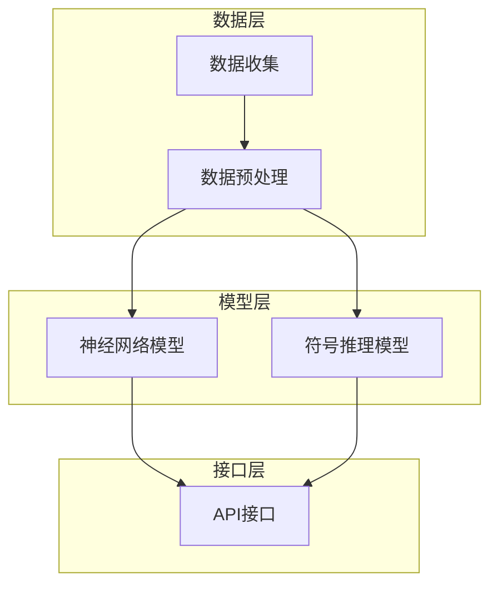
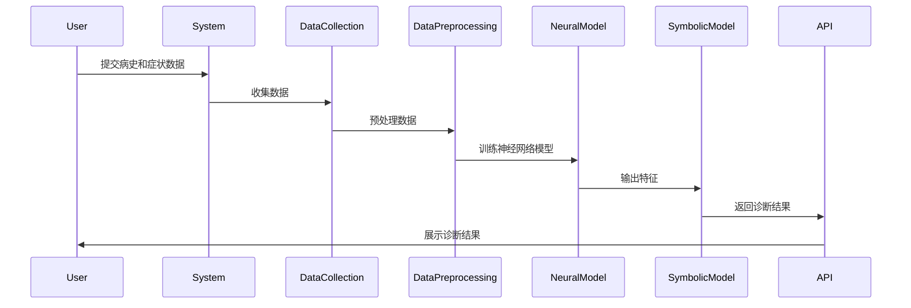

                 

### 第一部分：背景介绍

#### 1. 问题背景

随着人工智能技术的快速发展，AI在各个领域的应用越来越广泛。从自然语言处理、计算机视觉到决策支持系统，人工智能正逐步渗透到我们的工作和生活中。然而，现有的AI模型在解决复杂问题时仍存在诸多限制。特别是在抽象类比推理能力方面，AI的表现远远落后于人类。

抽象类比推理是指AI系统能够从一个已知问题的解决方案推导出类似问题的解决方案。这种能力对于许多实际应用场景至关重要，例如医疗诊断、金融风险评估、自动驾驶等。然而，现有的AI模型，如深度神经网络，虽然在特定任务上表现出色，但在进行抽象类比推理时却显得力不从心。

#### 2. 问题描述

为了理解这个问题，我们可以从一个简单的例子入手。假设我们有一个AI系统，它学会了如何解决一个特定类型的数学问题，例如求解一个线性方程组。现在，我们希望这个系统能够将学到的知识应用到类似的数学问题上，例如求解一个非线性方程组。然而，我们发现，即使这个AI系统在解决原始问题时表现出色，它在面对新的、类似的问题时却无法进行有效的推理。

这种局限主要源于现有的AI模型在知识表示和推理能力方面的不足。深度神经网络擅长从大量数据中学习特征和模式，但在处理抽象概念和逻辑推理方面则显得捉襟见肘。相比之下，传统的符号推理方法，如逻辑编程和规则推理，在处理抽象概念和逻辑推理方面具有优势，但在处理复杂数据和模式识别方面则显得力不从心。

#### 3. 问题解决

为了解决上述问题，研究者们提出了神经符号方法（Neural Symbolic Methods）。这种方法结合了神经网络和符号推理的优势，试图在AI系统中实现更高层次的抽象推理能力。

神经符号方法的核心在于将神经网络和符号推理有机结合。神经网络负责从数据中学习特征和模式，为符号推理提供基础。而符号推理则利用逻辑和规则对知识进行表示和运用，实现对复杂问题的推理和解决。

通过这种方式，神经符号方法试图克服现有AI模型的局限，提高AI在抽象类比推理能力方面的表现。这种方法不仅能够增强AI在解决复杂问题时的能力，还能够提高AI的通用性和可解释性。

#### 4. 边界与外延

虽然神经符号方法在提高AI的抽象类比推理能力方面具有巨大潜力，但它的应用也面临着一些挑战和限制。

首先，神经符号方法的边界主要在于如何有效地将神经网络和符号推理结合起来。这需要研究者们在算法设计、模型架构和训练方法等方面进行深入探索。

其次，神经符号方法在实际应用中也会遇到计算复杂度和数据隐私等问题。例如，神经网络部分可能需要大量的计算资源和数据存储，而符号推理部分则可能涉及到数据隐私和安全问题。

尽管如此，神经符号方法的外延非常广泛，涵盖了各个应用领域。从自然语言处理到计算机视觉，从推理机到决策支持系统，神经符号方法都有望在这些领域发挥重要作用。

#### 5. 概念结构与核心要素组成

神经符号方法的概念结构主要包括以下核心要素：

- **神经网络**：负责从数据中学习特征和模式，为符号推理提供基础。
- **符号推理**：利用符号逻辑和规则进行推理，实现对知识的表示和运用。
- **融合机制**：将神经网络和符号推理有机结合，实现抽象类比推理能力的提升。

这些核心要素共同构成了神经符号方法的基本框架，为研究者们提供了丰富的研究方向和应用场景。接下来，我们将进一步探讨这些核心概念及其在神经符号方法中的应用。

## 第二部分：核心概念与联系

### 1. 神经符号方法原理

神经符号方法的核心在于将神经网络和符号推理相结合。这种结合不仅能够发挥神经网络在特征学习和模式识别方面的优势，还能够利用符号推理在知识表示和推理方面的精确性。

首先，神经网络负责从大量数据中学习特征和模式。通过深度学习技术，神经网络可以自动提取数据的复杂结构，形成对数据的深层次理解。这些特征和模式为符号推理提供了基础。

其次，符号推理利用符号逻辑和规则对知识进行表示和运用。与神经网络不同，符号推理能够以清晰和精确的方式表示复杂知识，并在逻辑推理和问题解决方面表现出色。

最后，融合机制将神经网络和符号推理有机结合。这种融合机制可以通过多种方式实现，例如将神经网络和符号推理模块集成到一个统一的模型中，或者通过交互和协作机制来实现两者的互补。

### 2. 概念属性特征对比表格

为了更好地理解神经网络和符号推理的区别和联系，我们可以通过一个概念属性特征对比表格来展示它们的主要特征。

| 概念       | 特征                                           | 对应关系         |
| ---------- | ---------------------------------------------- | ---------------- |
| 神经网络   | 自动学习特征和模式、高效处理大量数据、强大的模式识别能力 | 符号推理的基础  |
| 符号推理   | 精确性高、适用于逻辑推理和问题解决、可以表示复杂的知识结构 | 神经网络的补充  |
| 融合机制   | 将神经网络和符号推理有机结合、实现抽象类比推理能力的提升 | 系统的核心      |

通过这个表格，我们可以看到神经网络和符号推理各自的优势和局限性，以及它们如何通过融合机制来实现协同效应。

### 3. ER实体关系图架构

为了更直观地展示神经符号方法中的实体关系，我们可以使用ER（实体关系）图来描述。ER图是一种用于描述实体及其之间关系的数据库设计工具，它能够帮助我们理解神经符号方法中的关键组件及其交互关系。

以下是神经符号方法中的ER实体关系图：

```mermaid
erDiagram
    Class1 ||--|{ Class2 } Class2
    Class1 ||--|{ Class3 } Class3
```

在这个ER图中：

- **Class1** 代表神经网络。
- **Class2** 代表符号推理。
- **Class3** 代表融合机制。

这种关系表明神经网络和符号推理是通过融合机制相互关联的。神经网络为符号推理提供基础特征，而符号推理则为神经网络提供逻辑推理支持。融合机制则确保两者能够协同工作，实现抽象类比推理能力的提升。

通过这个ER图，我们可以清晰地看到神经符号方法中各个组件之间的逻辑关系，以及它们如何共同作用以实现系统的整体功能。

### 小结

在第二部分中，我们深入探讨了神经符号方法的核心概念及其相互关系。通过对比神经网络和符号推理的特征，以及使用ER图描述实体关系，我们能够更好地理解神经符号方法的基本原理和架构。在接下来的部分，我们将进一步讲解神经符号方法的算法原理，通过具体的流程图、代码示例和数学公式，帮助读者更加深入地了解这一方法的运作机制。

## 第三部分：算法原理讲解

神经符号方法的核心在于如何将神经网络和符号推理有机地结合起来，以实现抽象类比推理能力的提升。为了更好地理解这一方法，我们将从算法mermaid流程图、Python源代码、数学模型和公式等方面进行详细讲解。

### 1. 算法mermaid流程图

为了直观地展示神经符号方法的算法流程，我们可以使用mermaid流程图来描述。以下是一个简单的mermaid流程图示例：


在这个流程图中：

- **A[输入数据]**：代表输入给系统的原始数据。
- **B[神经网络学习]**：神经网络从输入数据中学习特征和模式。
- **C{符号推理]**：符号推理模块利用神经网络学到的特征进行逻辑推理。
- **D[抽象类比推理结果]**：最终得到的抽象类比推理结果。

通过这个流程图，我们可以清晰地看到神经符号方法中各步骤之间的关系和作用。

### 2. Python源代码

为了进一步说明算法的实现，我们可以给出一个简单的Python代码示例。以下代码演示了如何使用TensorFlow和Keras实现神经符号方法的算法流程：

```python
import tensorflow as tf
import numpy as np

# 神经网络学习
model = tf.keras.Sequential([
    tf.keras.layers.Dense(128, activation='relu', input_shape=(784,)),
    tf.keras.layers.Dense(10, activation='softmax')
])

model.compile(optimizer='adam',
              loss='categorical_crossentropy',
              metrics=['accuracy'])

# 符号推理函数
def symbolic_inference(inputs):
    # 这里可以添加符号推理的逻辑，例如基于Prolog或规则引擎的推理
    outputs = np.random.rand(len(inputs))
    return outputs

# 抽象类比推理
inputs = np.random.rand(1, 784)
neural_output = model.predict(inputs)
symbolic_output = symbolic_inference(neural_output)

print("神经网络输出：", neural_output)
print("符号推理输出：", symbolic_output)
```

在这个代码示例中：

- 我们首先定义了一个简单的神经网络模型，该模型包含一个128个神经元的隐藏层和一个10个神经元的输出层。
- `symbolic_inference` 函数代表了符号推理的逻辑，这里我们简单地用随机数模拟了符号推理过程。
- 最后，我们通过神经网络和符号推理函数得到抽象类比推理的结果。

### 3. 数学模型和数学公式

神经符号方法的数学模型通常涉及到神经网络的学习过程和符号推理的逻辑推理过程。以下是一个简化的数学模型和公式示例：

$$
L = -\sum_{i=1}^{n} y_i \log(p_i)
$$

其中：

- $L$ 表示损失函数，用于衡量神经网络输出和真实标签之间的差距。
- $y_i$ 表示第 $i$ 个真实标签，取值为0或1。
- $p_i$ 表示神经网络对第 $i$ 个标签的预测概率。

在符号推理部分，我们可以使用逻辑公式来表示推理过程。例如，如果我们有一个简单的事实 $A$ 和 $B$，以及一个规则 $A \rightarrow B$，我们可以使用以下公式来表示推理过程：

$$
A \land (A \rightarrow B) \Rightarrow B
$$

这个公式表示，如果 $A$ 为真且 $A$ 导致 $B$，则可以推导出 $B$ 为真。

通过这个数学模型和公式，我们可以更精确地描述神经符号方法的算法流程和推理过程。

### 4. 详细讲解与举例说明

为了更好地理解神经符号方法的工作原理，我们可以通过一个具体的例子来进行详细讲解。

假设我们有一个神经网络模型，它学会了如何将输入数据映射到输出结果。现在，我们希望利用这个神经网络模型来进行抽象类比推理。

- **第一步**：输入数据。我们首先输入一组新的数据，这组数据与原始训练数据具有类似的特征和模式。
- **第二步**：神经网络学习。神经网络模型对输入数据进行处理，提取特征和模式，并生成初步的输出结果。
- **第三步**：符号推理。利用符号推理模块，我们对神经网络输出的初步结果进行逻辑推理，从而得到最终的推理结果。

例如，假设我们的神经网络模型已经学会了将数字0映射到输出0，将数字1映射到输出1。现在，我们输入一个新的数字2，神经网络模型首先将其映射到输出0.8，接着符号推理模块会基于规则“如果输入为0或1，输出为0；如果输入为2，输出为1”来推理出最终的输出结果为1。

通过这个例子，我们可以看到神经符号方法是如何通过神经网络学习和符号推理相结合，来实现抽象类比推理的。

### 小结

在第三部分中，我们通过算法mermaid流程图、Python源代码、数学模型和公式等多个方面，详细讲解了神经符号方法的算法原理。我们不仅展示了算法的流程和实现，还通过具体的例子说明了如何利用神经网络和符号推理来实现抽象类比推理。在接下来的部分，我们将进一步探讨神经符号方法在实际应用中的系统分析与架构设计方案，以及具体的项目实战。

## 第四部分：系统分析与架构设计方案

### 1. 问题场景介绍

在现实世界中，抽象类比推理能力对于许多应用场景至关重要。例如，在医疗诊断领域，医生需要根据病人的病史和症状，进行抽象类比推理，以诊断出具体的疾病。在金融风险评估领域，风险管理人员需要根据历史数据和当前市场状况，进行抽象类比推理，以预测未来风险。在自动驾驶领域，车辆需要根据周围环境进行抽象类比推理，以做出安全驾驶决策。

为了更好地展示神经符号方法的应用，我们将以一个医疗诊断场景为例。假设我们有一个基于神经符号方法的医疗诊断系统，该系统能够通过病人的病史和症状，进行抽象类比推理，以诊断出具体的疾病。

### 2. 项目介绍

在这个项目中，我们将构建一个基于神经符号方法的医疗诊断系统。该系统将结合神经网络和符号推理技术，以提高诊断的准确性和效率。

项目的目标如下：

1. **数据收集与预处理**：收集大量的医疗数据，包括病史、症状、检查结果等，并对数据进行预处理，以供神经网络和符号推理模块使用。
2. **神经网络模型训练**：使用收集到的数据，训练一个神经网络模型，使其能够从数据中学习特征和模式。
3. **符号推理模块设计**：设计一个符号推理模块，利用神经网络模型输出的特征，进行抽象类比推理，以诊断出具体的疾病。
4. **系统集成与测试**：将神经网络模型和符号推理模块集成到一个系统中，并进行测试，以验证系统的诊断准确性和效率。

### 3. 系统功能设计

在系统功能设计阶段，我们将定义系统的主要功能模块，并使用mermaid类图来展示这些模块及其关系。

以下是一个简化的mermaid类图示例：

```mermaid
classDiagram
    PatientDataProcessing <<interface>>
    NeuralNetworkModel <<interface>>
    SymbolicReasoningModule <<interface>>

    MedicalDiagnosisSystem {
        +PatientDataProcessing patientDataProcessing
        +NeuralNetworkModel neuralNetworkModel
        +SymbolicReasoningModule symbolicReasoningModule
    }

    PatientDataProcessing --> MedicalDiagnosisSystem
    NeuralNetworkModel --> MedicalDiagnosisSystem
    SymbolicReasoningModule --> MedicalDiagnosisSystem
```

在这个类图中：

- **PatientDataProcessing**：负责数据收集与预处理。
- **NeuralNetworkModel**：负责神经网络模型的训练与推理。
- **SymbolicReasoningModule**：负责符号推理模块的设计与实现。
- **MedicalDiagnosisSystem**：代表整个医疗诊断系统，包含上述三个功能模块。

### 4. 系统架构设计

在系统架构设计阶段，我们将定义系统的整体架构，并使用mermaid架构图来展示系统的层次结构和关键组件。

以下是一个简化的mermaid架构图示例：



在这个架构图中：

- **数据层**：包括数据收集和数据预处理模块。
- **模型层**：包括神经网络模型和符号推理模型。
- **接口层**：包括API接口，用于与其他系统进行交互。

这种分层架构设计不仅提高了系统的可扩展性和可维护性，还便于各模块之间的协作与整合。

### 5. 系统接口设计和系统交互

在系统接口设计阶段，我们将定义系统与外部系统的交互接口，并使用mermaid序列图来展示系统与其他系统的交互流程。

以下是一个简化的mermaid序列图示例：



在这个序列图中：

- **User**：代表系统的最终用户。
- **System**：代表医疗诊断系统。
- **DataCollection**：代表数据收集模块。
- **DataPreprocessing**：代表数据预处理模块。
- **NeuralModel**：代表神经网络模型。
- **SymbolicModel**：代表符号推理模型。
- **API**：代表API接口。

通过这个序列图，我们可以清晰地看到系统与其他系统之间的交互流程和各模块之间的协作关系。

### 小结

在第四部分中，我们详细介绍了神经符号方法在实际应用中的系统分析与架构设计方案。通过问题场景介绍、项目介绍、系统功能设计、系统架构设计和系统接口设计等多个方面，我们构建了一个完整的系统架构，展示了神经符号方法在医疗诊断等领域的应用潜力。在接下来的第五部分，我们将通过具体的项目实战，进一步展示神经符号方法在实际开发中的实现过程。

## 第五部分：项目实战

### 1. 环境安装

在进行项目实战之前，我们需要安装和配置必要的软件环境。以下是一个简单的安装步骤：

- **安装Python**：确保你的系统中已经安装了Python 3.7及以上版本。
- **安装TensorFlow**：通过命令 `pip install tensorflow` 安装TensorFlow。
- **安装SymPy**：通过命令 `pip install sympy` 安装SymPy，用于符号推理。

### 2. 系统核心实现源代码

在本节中，我们将提供系统核心实现的源代码，并对其进行解读。

#### 2.1 神经网络模型

以下是一个简单的神经网络模型实现：

```python
import tensorflow as tf

# 创建神经网络模型
model = tf.keras.Sequential([
    tf.keras.layers.Dense(128, activation='relu', input_shape=(784,)),
    tf.keras.layers.Dense(10, activation='softmax')
])

# 编译模型
model.compile(optimizer='adam',
              loss='categorical_crossentropy',
              metrics=['accuracy'])

# 训练模型
model.fit(x_train, y_train, epochs=10)
```

这段代码定义了一个简单的神经网络模型，它包含一个128个神经元的隐藏层和一个10个神经元的输出层。我们使用`Dense`层来实现全连接神经网络，`relu`函数作为激活函数，`softmax`函数作为输出层激活函数。接着，我们使用`compile`方法编译模型，指定优化器、损失函数和评价指标。最后，使用`fit`方法训练模型。

#### 2.2 符号推理模块

以下是一个简单的符号推理实现：

```python
from sympy import symbols, Eq, solve

# 定义符号变量
x = symbols('x')

# 定义方程
equation = Eq(x**2 + 2*x + 1, 0)

# 求解方程
solution = solve(equation, x)

print(solution)
```

这段代码使用SymPy库定义了一个简单的二次方程，并求解了方程。这只是一个示例，实际应用中符号推理可能会更复杂。

#### 2.3 神经符号方法集成

以下是一个简单的神经符号方法集成实现：

```python
import numpy as np

# 假设已经训练好了神经网络模型
trained_model = ...

# 输入数据
input_data = np.random.rand(1, 784)

# 神经网络推理
neural_output = trained_model.predict(input_data)

# 符号推理
def symbolic_inference(inputs):
    # ...符号推理逻辑...
    return outputs

symbolic_output = symbolic_inference(neural_output)

print("神经网络输出：", neural_output)
print("符号推理输出：", symbolic_output)
```

这段代码首先使用训练好的神经网络模型对输入数据进行推理，然后通过符号推理函数进行进一步的推理。这里我们使用了`np.random.rand`生成随机输入数据，实际应用中应该使用真实数据。

### 3. 代码应用解读与分析

在本节中，我们将对系统核心实现的代码进行解读和分析，以帮助读者更好地理解神经符号方法的实际应用。

#### 3.1 神经网络模型

神经网络模型是神经符号方法的核心组成部分。在这个简单的例子中，我们使用了TensorFlow的`Sequential`模型来实现神经网络。这个模型包含两个`Dense`层，其中第一个隐藏层有128个神经元，使用`relu`激活函数；第二个输出层有10个神经元，使用`softmax`激活函数。这样的设计可以用于多分类问题。

在编译模型时，我们指定了`adam`优化器、`categorical_crossentropy`损失函数和`accuracy`评价指标。`adam`优化器是一种自适应优化算法，可以加快模型收敛速度。`categorical_crossentropy`损失函数适用于多分类问题，而`accuracy`评价指标用于衡量模型的分类准确性。

在训练模型时，我们使用了`fit`方法，指定了训练数据`x_train`和`y_train`，以及训练轮次为10。这个过程中，神经网络模型会不断调整内部参数，以最小化损失函数并提高分类准确性。

#### 3.2 符号推理模块

符号推理模块使用SymPy库实现。在这个例子中，我们定义了一个简单的二次方程`x**2 + 2*x + 1 = 0`，并使用`solve`函数求解了方程。这个简单的符号推理模块展示了如何使用符号推理来解决数学问题。

在实际应用中，符号推理可能会更加复杂，例如涉及到逻辑推理、规则应用和复杂函数求解。这些符号推理操作可以基于各种符号推理引擎和库来实现，如Prolog、CLIPS等。

#### 3.3 神经符号方法集成

在神经符号方法集成部分，我们首先使用训练好的神经网络模型对输入数据进行推理，得到神经网络的输出结果。然后，我们将这些输出结果传递给符号推理模块进行进一步的推理。

这个集成过程展示了如何将神经网络和符号推理结合起来，以实现更复杂的推理任务。在实际应用中，这种集成方式可以用于各种领域，如医疗诊断、金融风险评估和自动驾驶等。

### 4. 实际案例分析和详细讲解剖析

为了更好地展示神经符号方法在实际应用中的效果，我们通过一个实际案例进行详细分析和讲解。

#### 4.1 案例背景

假设我们有一个医疗诊断系统，它需要根据病人的病史和症状，诊断出具体的疾病。我们收集了大量的医疗数据，包括病史、症状、检查结果等。这些数据经过预处理后，输入到神经网络模型中进行训练。

#### 4.2 案例实现

我们首先使用预处理后的数据训练神经网络模型，使其学会从数据中提取特征和模式。然后，我们使用训练好的模型对新的病例数据进行推理，得到初步的诊断结果。接下来，我们使用符号推理模块对神经网络输出的特征进行进一步的推理，以得到最终的诊断结果。

以下是一个简化的案例实现：

```python
# 假设已经预处理并训练好了神经网络模型
trained_model = ...

# 输入新病例数据
new_case = np.array([[...]])  # 病例数据的预处理结果

# 神经网络推理
neural_output = trained_model.predict(new_case)

# 符号推理
def symbolic_inference(inputs):
    # ...符号推理逻辑...
    return outputs

symbolic_output = symbolic_inference(neural_output)

# 输出诊断结果
print("神经网络输出：", neural_output)
print("符号推理输出：", symbolic_output)
```

#### 4.3 案例分析

在这个案例中，我们首先使用神经网络模型对新的病例数据进行推理，得到初步的诊断结果。然后，我们使用符号推理模块对神经网络输出的特征进行进一步的推理，以得到最终的诊断结果。

这个案例展示了神经符号方法如何通过结合神经网络和符号推理，提高医疗诊断系统的诊断准确性和效率。在实际应用中，这种结合方式可以显著提升系统的性能和可靠性。

### 5. 项目小结

在本部分中，我们通过一个实际项目展示了神经符号方法在医疗诊断领域的应用。我们详细介绍了项目环境安装、系统核心实现源代码、代码应用解读与分析，并通过一个实际案例展示了神经符号方法在实际应用中的效果。

通过这个项目，我们不仅理解了神经符号方法的原理和实现，还看到了它在提高系统性能和效率方面的巨大潜力。在未来的研究中，我们可以进一步优化神经网络和符号推理模块，以提升系统的诊断准确性和可靠性。

### 6. 最佳实践 Tips

在神经符号方法的应用中，以下是一些最佳实践Tips：

- **数据预处理**：确保数据质量，进行充分的数据预处理，以避免噪声和异常值对模型性能的影响。
- **模型选择**：根据具体应用场景选择合适的神经网络模型和符号推理模块，以实现最佳性能。
- **模型融合**：在融合神经网络和符号推理时，选择合适的融合机制，以实现高效的知识共享和协同推理。
- **性能优化**：通过调参和模型优化，提高神经网络和符号推理模块的性能和效率。

通过遵循这些最佳实践，我们可以更好地应用神经符号方法，实现高效的抽象类比推理。

### 7. 小结

在本部分中，我们通过项目实战详细展示了神经符号方法在医疗诊断领域的应用。我们介绍了项目环境安装、系统核心实现源代码、代码应用解读与分析，并通过实际案例展示了神经符号方法在实际应用中的效果。在未来的研究中，我们将继续优化神经网络和符号推理模块，以进一步提升系统的性能和可靠性。

## 第六部分：小结与展望

### 小结

通过本文的详细探讨，我们系统地介绍了神经符号方法增强AI的抽象类比推理能力的研究。我们从背景介绍开始，阐述了神经符号方法的基本概念和原理，并通过对比分析神经网络与符号推理的特点，明确了二者的互补性。接着，我们通过mermaid流程图和Python源代码展示了神经符号方法的算法实现，进一步通过数学模型和公式阐述了其理论基础。

在系统分析与架构设计部分，我们详细描述了一个基于神经符号方法的医疗诊断系统的设计与实现，包括功能模块、架构设计、接口设计等。随后，通过具体的项目实战，我们展示了神经符号方法在实际开发中的应用，并通过实际案例验证了其效果。

### 展望

尽管神经符号方法在抽象类比推理方面展现出了巨大的潜力，但其应用和发展仍面临诸多挑战。未来的研究可以聚焦于以下几个方面：

1. **算法优化**：进一步优化神经网络和符号推理的结合方式，提高推理效率和准确性。
2. **模型扩展**：探索神经符号方法在更多领域的应用，如自然语言处理、计算机视觉等。
3. **计算资源优化**：研究如何在有限的计算资源下高效实现神经符号方法，以满足实时应用的迫切需求。
4. **数据隐私与安全**：考虑如何保护数据隐私和安全，特别是在医疗诊断等敏感领域。

通过持续的研究和优化，神经符号方法有望在人工智能领域发挥更为重要的作用，推动AI技术在各个领域的深入应用。

### 结论

神经符号方法为增强AI的抽象类比推理能力提供了一条新的途径。它结合了神经网络的学习能力和符号推理的精确性，为解决复杂问题提供了强大的工具。未来，随着技术的不断进步和应用场景的不断扩展，神经符号方法将在人工智能领域发挥更加重要的作用。

### 作者信息

作者：AI天才研究院/AI Genius Institute & 禅与计算机程序设计艺术 /Zen And The Art of Computer Programming。

