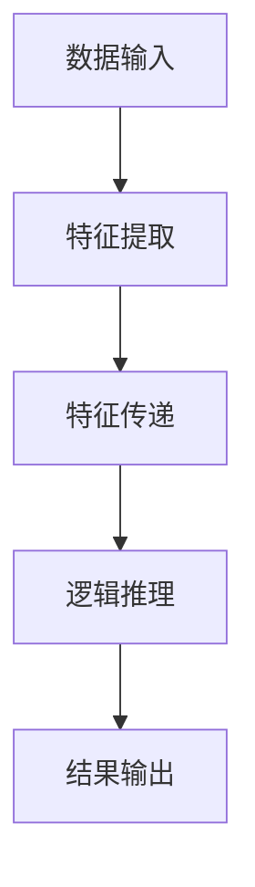
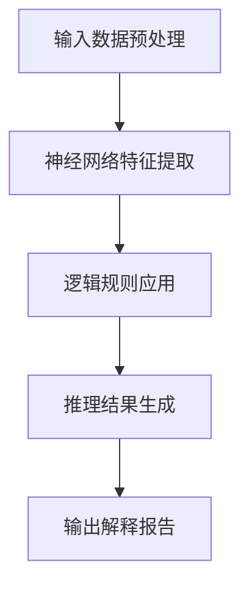
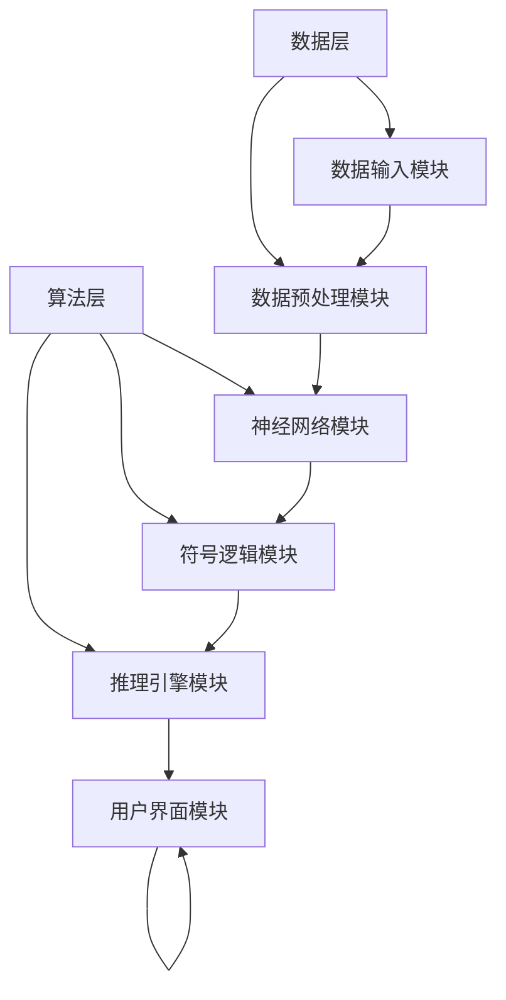
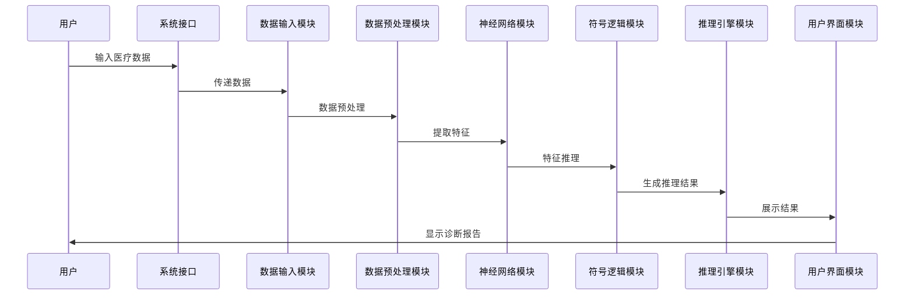

                 

### 1.1.1 神经符号系统的起源

神经符号系统这一概念的起源可以追溯到20世纪80年代，当时计算机科学和神经科学领域的研究者们开始探索如何将生物神经系统的工作原理与计算机的计算能力相结合。这一思想的核心在于模拟人类大脑的信息处理机制，以解决传统计算模型在处理复杂、非线性和不确定性问题时的局限性。

早期神经符号系统的探索主要集中在神经网络的研究上。神经网络是一种由大量简单处理单元（神经元）组成的网络，这些神经元通过加权连接进行信息传递和处理。霍普菲尔德（John Hopfield）和鲁梅哈特（David E. Rumelhart）等人提出的反向传播算法（Backpropagation Algorithm）使得神经网络能够在多层之间传递误差信号，从而实现更为复杂的函数映射。

然而，单纯依赖神经网络在处理逻辑推理和符号计算方面的表现并不理想。这促使研究者们开始思考如何将符号逻辑与神经网络的优势结合起来，从而形成神经符号系统。1990年代，杰弗里·埃尔文·哈灵顿（Jeffrey Elvin Hopfield）提出了混合系统（Hybrid Systems）的概念，试图通过在神经网络中嵌入符号逻辑机制，来提升系统的推理能力。

在神经符号系统的历史发展中，还值得一提的是欧洲的研究团队，他们于1994年发起了称为“逻辑脑”（Logic Brain）的项目，旨在研究如何将逻辑系统应用于神经网络架构中，以实现更强的可解释性和推理能力。这一项目标志着神经符号系统从理论研究走向实际应用的重要一步。

总之，神经符号系统的起源是多方研究力量共同探索的结果，它不仅继承了神经网络强大的信息处理能力，还融合了符号逻辑的清晰推理机制，为解决复杂问题提供了新的思路和方法。

### 1.1.2 神经符号系统的定义

神经符号系统（Neural-Symbolic Systems）是一种结合了神经网络和符号逻辑的混合计算模型，旨在模拟人类大脑的信息处理机制，以实现更强大的推理能力和知识表示。这一系统的核心在于将神经网络与符号逻辑相融合，使得系统能够同时处理连续数据与离散符号信息。

具体来说，神经符号系统通过以下方式结合神经网络和符号逻辑：

1. **神经网络部分**：这一部分负责处理连续数据，利用神经网络的强大非线性变换能力来捕捉数据中的复杂模式和关系。神经网络通过调整权重来学习输入数据中的内在规律，从而形成一种数据驱动的知识表示。

2. **符号逻辑部分**：这一部分则负责处理离散符号信息，利用符号逻辑的明确性和推理能力来构建和验证逻辑规则。符号逻辑部分可以表示为一系列的命题和推理规则，通过对这些规则的执行来推导出新的结论。

神经符号系统的优势在于它能够将两种不同类型的信息处理机制有机结合，发挥各自的优势。具体优势包括：

- **增强推理能力**：神经符号系统能够在处理复杂推理任务时，同时利用神经网络的非线性映射能力和符号逻辑的清晰推理机制，从而实现更强大的推理能力。

- **提升可解释性**：通过将神经网络与符号逻辑相结合，神经符号系统可以生成更加可解释的推理过程，使得系统内部的知识表示更加透明和易于理解。

- **处理多模态数据**：神经符号系统能够同时处理多种类型的数据，例如文本、图像和声音，从而实现跨模态的信息融合和推理。

- **适应动态环境**：神经符号系统在处理动态变化和不确定性问题时，可以结合神经网络的学习能力和符号逻辑的规则推理，从而更好地适应复杂的环境。

综上所述，神经符号系统通过将神经网络和符号逻辑的优势相结合，提供了一种新型的计算模型，为解决复杂问题提供了强大的工具和思路。

### 1.1.3 神经符号系统的核心特点

神经符号系统作为一种混合计算模型，具备以下核心特点：

1. **信息融合能力**：神经符号系统能够将神经网络与符号逻辑两种不同的信息处理机制有机结合，使得系统能够同时处理连续数据与离散符号信息。这种信息融合能力使得神经符号系统能够在处理复杂问题时，兼顾数据驱动的模式识别和符号驱动的逻辑推理。

2. **高效推理机制**：神经符号系统通过结合神经网络的非线性映射能力和符号逻辑的明确推理机制，实现了高效的推理过程。神经网络部分可以快速学习并捕捉数据中的复杂模式，而符号逻辑部分则可以对这些模式进行清晰的逻辑推导，从而提升整体的推理效率。

3. **可解释性**：神经符号系统能够生成更加可解释的推理过程，使得系统内部的知识表示更加透明和易于理解。通过结合神经网络和符号逻辑，系统不仅能够学习到数据中的隐含规律，还能通过符号逻辑规则将这些规律表述为可解释的推理过程。

4. **适应性**：神经符号系统在处理动态变化和不确定性问题时，表现出良好的适应性。它能够结合神经网络的学习能力和符号逻辑的规则推理，快速适应复杂的环境和不断变化的数据模式。

5. **多模态处理能力**：神经符号系统能够同时处理多种类型的数据，例如文本、图像和声音，从而实现跨模态的信息融合和推理。这种多模态处理能力使得神经符号系统在处理实际问题时，能够更全面地理解和解决问题。

6. **鲁棒性**：神经符号系统在处理噪声数据和异常值时，表现出较强的鲁棒性。它能够通过神经网络部分的学习能力，从数据中提取出有效的特征，并通过符号逻辑部分进行严格的推理，从而确保系统在面临不完整或噪声数据时仍能做出合理的决策。

总之，神经符号系统的核心特点在于其强大的信息融合能力、高效的推理机制、可解释性、适应性、多模态处理能力和鲁棒性，这些特点使得它成为一种在复杂问题解决中极具潜力的计算模型。

### 1.1.4 神经符号系统的边界与外延

神经符号系统作为一种混合计算模型，其应用范围广泛，但同时也存在一些边界和限制。了解这些边界与外延有助于更好地把握神经符号系统的适用场景和发展方向。

1. **应用范围**：
   - **智能推理与决策**：神经符号系统在智能推理和决策领域表现出强大的潜力，能够用于自动化推理、知识图谱构建和智能推荐系统等。
   - **医学诊断与辅助**：在医学诊断中，神经符号系统可以结合临床数据和医学知识库，实现更加精准的诊断和预测。
   - **金融风险评估**：通过分析市场数据和符号逻辑规则，神经符号系统可以帮助金融机构进行风险评估和投资决策。
   - **自动驾驶与智能交通**：神经符号系统可以用于自动驾驶系统中，处理复杂的道路环境信息和决策问题。
   - **自然语言处理**：在文本分析和语义理解中，神经符号系统能够结合语言模型和符号逻辑规则，实现更加精准的语言处理。

2. **边界问题**：
   - **计算复杂度**：神经符号系统在处理大规模数据和复杂任务时，计算复杂度较高，需要较长的时间来训练和推理。
   - **数据依赖性**：神经符号系统的性能高度依赖数据的质量和数量，数据不足或质量较差时，系统的表现可能不理想。
   - **可解释性限制**：尽管神经符号系统在可解释性方面有所提升，但与完全基于符号逻辑的系统相比，其推理过程仍具有一定的黑箱性。
   - **规则不一致性**：在符号逻辑部分，不同规则之间的不一致性可能导致系统推理结果的偏差。

3. **外延发展**：
   - **跨领域融合**：未来神经符号系统将进一步与其他领域（如量子计算、生物信息学等）相结合，实现跨领域的创新应用。
   - **深度学习与符号逻辑结合**：通过将深度学习与符号逻辑更好地融合，可以进一步提升神经符号系统的推理能力和可解释性。
   - **自动化推理与知识发现**：未来研究将致力于实现自动化推理和知识发现，使得神经符号系统在无需人工干预的情况下，能够自主学习和推理。
   - **硬件加速与优化**：为了解决计算复杂度问题，研究者们将探索硬件加速和优化技术，提高神经符号系统的处理效率。

总之，神经符号系统在边界与外延方面表现出一定的局限性，但通过不断的研究和技术创新，其在各个领域的应用前景仍然广阔。

### 2.1.1 神经网络与符号逻辑的联系

神经网络与符号逻辑在信息处理机制上存在紧密的联系，这种联系不仅体现在各自的基本概念上，还体现在它们在解决实际问题中的应用方式上。理解这两者之间的联系，有助于更深入地掌握神经符号系统的运作原理。

1. **基本概念联系**：

   - **神经元与符号单元**：神经网络中的神经元相当于符号逻辑中的符号单元，两者都可以表示和处理信息。神经网络中的神经元通过激活函数来决定是否传递信号，而符号逻辑中的符号单元则通过逻辑运算符（如AND、OR、NOT等）来组合和传递信息。

   - **权重与逻辑规则**：在神经网络中，权重表示神经元之间的连接强度，影响信息的传递效果。在符号逻辑中，逻辑规则也起到类似作用，指导信息如何进行组合和推理。

   - **学习与推理**：神经网络通过反向传播算法学习权重，以优化模型的表现。而符号逻辑则依赖于逻辑推理规则，通过演绎和归纳过程来推导结论。

2. **应用方式联系**：

   - **模式识别与逻辑推理**：神经网络擅长处理连续数据和模式识别任务，通过学习输入数据中的特征模式，实现自动分类和回归。符号逻辑则擅长处理离散数据和逻辑推理，通过定义逻辑规则，实现推理和验证。

   - **非线性映射与逻辑组合**：神经网络能够通过非线性变换捕捉复杂的数据模式，而符号逻辑能够将不同的逻辑规则组合起来，形成复杂的推理过程。两者的结合使得神经符号系统在处理复杂任务时，能够同时利用模式识别和逻辑推理的优势。

   - **多模态数据融合**：神经网络和符号逻辑的结合使得神经符号系统能够处理多种类型的数据（如文本、图像、声音），实现跨模态的数据融合和推理。例如，在图像识别任务中，神经网络可以学习图像的特征，而符号逻辑则可以结合上下文信息进行推理。

3. **实现方法联系**：

   - **混合架构**：神经符号系统通常采用混合架构，将神经网络与符号逻辑集成在一起。例如，可以通过将神经网络嵌入到符号逻辑引擎中，或者通过使用神经网络来学习符号逻辑规则。

   - **多任务学习**：神经符号系统可以通过多任务学习同时处理多个任务，利用神经网络进行特征提取和模式识别，利用符号逻辑进行推理和决策。

   - **动态调整**：在神经符号系统中，神经网络和符号逻辑可以根据任务的不同动态调整其权重和规则，以实现最优的性能。例如，通过在线学习机制，神经网络可以实时调整其权重，符号逻辑可以根据实时反馈调整推理规则。

总之，神经网络与符号逻辑在基本概念和应用方式上存在紧密的联系，这种联系为神经符号系统的设计和实现提供了坚实的基础。通过结合两者的优势，神经符号系统在处理复杂任务时表现出更强的灵活性和有效性。

### 2.1.2 神经网络与计算思维的关系

神经网络与计算思维之间存在着密切的联系，它们共同为解决复杂问题提供了有效的工具和方法。理解这两者之间的关系，有助于我们更好地把握神经符号系统的本质和应用潜力。

1. **计算思维的背景和概念**：

   - **计算思维**：计算思维是指运用计算机科学的方法和概念来分析和解决问题的思维方式。它强调抽象、算法、数据结构、计算模型等核心概念，旨在培养人们解决复杂问题、构建高效算法的能力。
   - **抽象**：计算思维强调通过抽象将复杂问题简化为可处理的模型，例如将实际问题转化为数学模型或算法模型。
   - **算法**：算法是计算思维的核心，通过设计高效的算法来解决实际问题。算法的优化和改进是提高系统性能和解决问题能力的关键。
   - **数据结构**：数据结构是存储和管理数据的方式，有效的数据结构能够提升算法的效率和准确性。
   - **计算模型**：计算模型是将实际问题映射为计算过程的工具，通过构建合适的计算模型，可以更有效地分析和解决问题。

2. **神经网络在计算思维中的应用**：

   - **数据建模与特征提取**：神经网络通过学习输入数据的内在结构，能够自动提取出有效的特征表示。这种特征提取能力在图像识别、自然语言处理等领域得到了广泛应用。
   - **模式识别与分类**：神经网络通过多层非线性变换，可以实现对复杂模式的识别和分类。这种能力使得神经网络在诸如语音识别、图像分类等任务中表现出色。
   - **优化与学习**：神经网络通过反向传播算法不断调整权重，优化模型的表现。这一过程体现了计算思维中的迭代优化思想，通过不断的尝试和调整，找到最优解。

3. **神经网络与计算思维的结合**：

   - **混合计算模型**：神经网络与计算思维的结合可以形成混合计算模型，这种模型能够同时利用神经网络的数据处理能力和计算思维的算法优化能力，解决更为复杂的问题。
   - **多任务学习**：计算思维强调多任务学习，神经网络能够通过多任务学习同时处理多个任务，提高系统的整体性能。
   - **动态调整与适应**：神经网络在处理动态问题和不确定性问题时，能够通过动态调整其结构和参数，适应不同的环境和任务需求。这一过程体现了计算思维中的动态适应和灵活性。

4. **计算思维对神经网络设计的影响**：

   - **结构优化**：计算思维中的算法优化思想可以应用于神经网络的设计，通过优化网络结构、层次和参数，提升神经网络的性能。
   - **问题建模**：计算思维强调将实际问题转化为计算模型，神经网络的设计过程也依赖于这种建模思想，通过将实际问题抽象为计算模型，更好地理解和解决复杂问题。
   - **可解释性与透明性**：计算思维强调算法的可解释性和透明性，这一思想可以指导神经网络的设计，通过构建可解释的神经网络模型，提高系统的透明度和可信度。

总之，神经网络与计算思维之间存在着紧密的联系，它们共同为解决复杂问题提供了强大的工具和方法。通过结合神经网络的数据处理能力和计算思维的算法优化能力，我们可以设计出更加高效和灵活的神经符号系统，以应对各种复杂任务。

### 2.1.3 神经符号系统的核心概念对比表格

为了更好地理解神经符号系统的核心概念，我们可以通过一个对比表格来展示神经网络与符号逻辑在多个维度上的区别和联系。

| 维度       | 神经网络                                 | 符号逻辑                                  |
|------------|------------------------------------------|-------------------------------------------|
| 信息表示   | 通过权重和神经元之间的连接来表示信息     | 通过符号和逻辑运算符来表示信息             |
| 数据类型   | 主要处理连续数据                         | 主要处理离散数据                          |
| 学习机制   | 通过反向传播算法学习权重和优化性能       | 通过逻辑推理和规则学习来推导结论           |
| 模式识别   | 依赖于模式匹配和学习得到的特征表示       | 依赖于逻辑推理和规则匹配来识别和分类       |
| 推理能力   | 强大的模式识别能力，但逻辑推理较弱       | 强大的逻辑推理能力，但模式识别较弱         |
| 可解释性   | 具有一定的黑箱性，推理过程不够透明       | 推理过程清晰，易于解释和理解               |
| 应用场景   | 适用于数据处理、模式识别和分类等任务       | 适用于逻辑推理、知识表示和验证等任务       |

通过这个对比表格，我们可以看到神经网络和符号逻辑在信息表示、数据类型、学习机制、模式识别、推理能力和应用场景等方面存在明显的差异。这些差异为神经符号系统的设计和实现提供了参考，通过结合两者的优势，我们可以构建出更加高效和灵活的混合计算模型。

### 2.1.4 神经符号系统的ER实体关系图

为了更好地理解神经符号系统的架构和组成部分，我们可以通过一个ER（Entity-Relationship）实体关系图来展示各个实体之间的关系。ER图是数据库设计中常用的一种图形表示方法，用于描述实体及其相互关系。

**实体关系图（ER Diagram）**：

```mermaid
erDiagram
    NET_NEURON ||--||> LOG_SYMBOL : 有连接关系
    NET_NEURON ||--||> DATA_FEATURE : 有连接关系
    LOG_SYMBOL ||--||> LOG_RULE : 有连接关系
    LOG_RULE ||--||> REASONING_RESULT : 有连接关系
    DATA_FEATURE ||--||> REASONING_INPUT : 有连接关系
    REASONING_INPUT ||--||> INPUT_DATA : 有连接关系
    INPUT_DATA ||--||> FEATURE_EXTRACTOR : 有连接关系

    NET_NEURON { 
        -- 主键 -- 
        id 
        type 
        connection_weight 
        activation_function
    }

    LOG_SYMBOL {
        -- 主键 -- 
        symbol_id
        symbol_name 
        relation_type
    }

    DATA_FEATURE {
        -- 主键 -- 
        feature_id
        feature_name 
        feature_value
    }

    LOG_RULE {
        -- 主键 -- 
        rule_id
        rule_content 
        rule_type
    }

    REASONING_RESULT {
        -- 主键 -- 
        result_id
        result_content 
        result_type
    }

    REASONING_INPUT {
        -- 主键 -- 
        input_id
        input_data
    }

    FEATURE_EXTRACTOR {
        -- 主键 -- 
        extractor_id
        extractor_type
        extractor_config
    }
```

**图解释**：

- **NET_NEURON（神经网络）**：表示神经网络中的神经元实体，包含神经元ID、类型、连接权重和激活函数等属性。
- **LOG_SYMBOL（符号）**：表示符号逻辑中的符号实体，包含符号ID、符号名称和关系类型等属性。
- **DATA_FEATURE（数据特征）**：表示神经网络处理后的数据特征实体，包含特征ID、特征名称和特征值等属性。
- **LOG_RULE（逻辑规则）**：表示符号逻辑中的规则实体，包含规则ID、规则内容和规则类型等属性。
- **REASONING_RESULT（推理结果）**：表示推理过程产生的结果实体，包含结果ID、结果内容和结果类型等属性。
- **REASONING_INPUT（推理输入）**：表示推理过程需要的输入数据实体，包含输入ID和输入数据等属性。
- **INPUT_DATA（输入数据）**：表示原始输入数据实体，包含输入数据等属性。
- **FEATURE_EXTRACTOR（特征提取器）**：表示神经网络中的特征提取器实体，包含提取器ID、提取器类型和提取器配置等属性。

**实体关系**：

- **NET_NEURON 与 LOG_SYMBOL**：神经网络中的神经元与符号逻辑中的符号实体之间存在连接关系，表示神经网络通过符号逻辑进行推理。
- **NET_NEURON 与 DATA_FEATURE**：神经网络中的神经元通过处理数据生成数据特征。
- **LOG_SYMBOL 与 LOG_RULE**：符号逻辑中的符号与规则实体之间存在关联关系，表示符号是规则的一部分。
- **LOG_RULE 与 REASONING_RESULT**：逻辑规则通过推理过程产生推理结果。
- **DATA_FEATURE 与 REASONING_INPUT**：数据特征作为推理输入的一部分。
- **INPUT_DATA 与 FEATURE_EXTRACTOR**：原始输入数据通过特征提取器生成数据特征。

通过这个ER实体关系图，我们可以清晰地看到神经符号系统中各个实体之间的关系，以及它们在信息处理和推理过程中的相互作用。这种结构化的表示方法有助于我们更好地理解和设计神经符号系统。

### 3.1.1 可解释推理的基本概念

可解释推理（Explainable Reasoning）是人工智能领域中的一个重要研究方向，旨在提高机器学习模型的可解释性和透明性，使得模型的决策过程和推理过程能够被人类理解和信任。理解可解释推理的基本概念，有助于我们更好地评估和利用神经符号系统在可解释推理中的应用潜力。

1. **可解释推理的定义**：

   可解释推理是指能够对模型决策过程进行详细解释和透明的推理机制。它不仅要求模型能够给出预测结果，还要求能够提供推理过程的详细解释，使得人类用户能够理解模型为什么做出这样的决策。

2. **可解释推理的重要性**：

   - **信任与透明性**：在许多实际应用中，尤其是涉及安全和伦理的领域（如医学诊断、金融决策等），透明和可解释的推理过程是建立用户信任的关键。
   - **错误诊断与修正**：通过可解释推理，用户能够识别模型中的错误和异常，从而进行修正和改进。
   - **知识发现与传播**：可解释推理有助于将模型中的知识转化为可理解的形式，促进知识的发现和传播。
   - **模型优化与改进**：理解模型的推理过程可以帮助研究人员识别模型的不足之处，进而进行优化和改进。

3. **可解释推理的基本要素**：

   - **决策路径**：描述模型从输入到输出的整个过程，包括特征提取、模型计算和决策步骤。
   - **中间结果**：展示推理过程中的关键中间结果，如特征权重、中间计算值等。
   - **逻辑推导**：提供推理过程的逻辑链条，展示如何从输入数据推导到最终输出。
   - **解释性表示**：将复杂的技术细节转化为人类容易理解的语言和图表，如文本、图形等。

4. **可解释推理的挑战**：

   - **复杂性**：机器学习模型的复杂性使得其推理过程往往难以直观理解，特别是在涉及多层神经网络和复杂的特征组合时。
   - **计算成本**：生成可解释推理通常需要额外的计算资源，特别是在实时应用场景中，解释过程的计算成本可能会影响模型的响应速度。
   - **模型依赖性**：不同的模型具有不同的解释性，某些模型可能天然具有较好的可解释性，而其他模型则需要额外的技术手段来提高解释性。

通过理解可解释推理的基本概念，我们可以更好地认识到其在人工智能应用中的重要性，并探索如何利用神经符号系统实现更强大的可解释推理能力。

### 3.1.2 神经符号系统在可解释推理中的优势

神经符号系统（Neural-Symbolic Systems）在可解释推理中表现出显著的独特优势，这主要得益于其结合了神经网络和符号逻辑两种信息处理机制。以下将从多个方面详细阐述神经符号系统在可解释推理中的优势：

1. **结合神经网络与符号逻辑**：

   神经符号系统的核心在于将神经网络和符号逻辑有机地结合起来。神经网络擅长处理复杂的数据模式和学习非线性关系，而符号逻辑则擅长逻辑推理和知识表示。通过这种结合，神经符号系统在处理可解释推理任务时，能够充分利用两者的优势。

2. **增强推理过程的透明性**：

   与传统的神经网络相比，神经符号系统提供了更加透明的推理过程。神经网络由于其高度非线性结构和复杂的权重分布，往往被称为“黑箱”。而神经符号系统通过将符号逻辑嵌入到神经网络中，使得推理过程中的每一步都能够通过逻辑规则进行解释。这样一来，用户可以清楚地了解模型的推理过程，提高模型的透明度和可信度。

3. **多层次的解释能力**：

   神经符号系统在推理过程中能够提供多层次的解释。首先，神经网络部分能够学习到输入数据的特征模式，并通过符号逻辑部分进行推理。这种多层次的解释能力使得用户不仅能够理解最终的推理结果，还能够了解推理过程中的关键步骤和中间结果。

4. **灵活的模型调整**：

   神经符号系统提供了灵活的模型调整能力。神经网络部分可以通过反向传播算法不断调整权重，以优化模型的表现。符号逻辑部分则可以根据实际任务的需求，动态调整逻辑规则和推理策略。这种灵活性使得神经符号系统能够在不同应用场景中灵活调整，以实现最佳的解释性能。

5. **处理多模态数据**：

   神经符号系统能够同时处理多种类型的数据，如文本、图像和声音。通过将不同模态的数据融合到同一个推理框架中，神经符号系统可以提供更加全面和深刻的解释。例如，在医学诊断中，神经符号系统可以将患者的临床数据、影像数据和实验室检测结果结合起来，提供详细的诊断解释。

6. **适应动态环境**：

   在动态变化的环境中，神经符号系统表现出良好的适应性。神经网络部分可以实时学习新的数据模式，符号逻辑部分可以根据新的逻辑规则进行推理。这种适应性使得神经符号系统能够在不断变化的环境中保持有效的解释能力。

综上所述，神经符号系统在可解释推理中具有结合神经网络与符号逻辑、增强推理过程透明性、多层次的解释能力、灵活的模型调整、处理多模态数据和适应动态环境等多方面的优势。这些优势使得神经符号系统成为实现高效可解释推理的重要工具，为各个领域的应用提供了强大的支持。

### 3.1.3 神经符号系统在可解释推理中的应用挑战

尽管神经符号系统在可解释推理中展现出许多优势，但在实际应用过程中仍面临一系列挑战。了解这些挑战并寻找解决方案，对于进一步推动神经符号系统的发展至关重要。

1. **复杂性**：

   神经符号系统结合了神经网络和符号逻辑，这使得系统的整体复杂性显著增加。神经网络部分通常包含多层非线性变换和复杂的权重配置，而符号逻辑部分则需要处理大量的逻辑规则和推理过程。这种复杂性使得理解和解释神经符号系统的推理过程变得更加困难。为了应对这一问题，研究者可以采用可视化和解释工具，如决策树、影响力分析等，来简化系统的解释过程。

2. **计算成本**：

   神经符号系统在处理复杂推理任务时，通常需要较高的计算资源。特别是当系统需要同时处理多种类型的数据和多层次的推理时，计算成本会进一步增加。这不仅会影响系统的响应速度，还可能限制其在线应用的能力。为了降低计算成本，研究者可以探索并行计算、分布式计算和硬件加速等技术，以提升系统的计算效率。

3. **数据依赖性**：

   神经符号系统的性能高度依赖于输入数据的质量和数量。如果数据存在噪声、缺失或分布不均等问题，神经符号系统的推理结果可能受到影响。此外，符号逻辑部分对规则的数量和复杂性也有较高的要求，如果规则设置不当，推理过程可能变得不稳定。为了降低数据依赖性，研究者可以采用数据增强、数据清洗和规则优化等技术，以提高系统的鲁棒性和适应性。

4. **解释性平衡**：

   在追求高解释性的同时，神经符号系统需要平衡解释性和性能。某些复杂的推理任务可能需要复杂的神经网络结构和大量的逻辑规则，这使得解释过程变得繁琐和冗长，可能会影响用户的理解和接受程度。为了实现解释性与性能的平衡，研究者可以采用模块化设计，将复杂的推理过程拆分为多个可解释的子模块，从而简化整体解释过程。

5. **动态适应性**：

   神经符号系统在动态环境中的适应能力也是一个挑战。当环境发生变化时，系统需要快速调整其结构和参数，以适应新的数据和任务需求。然而，现有的神经符号系统在动态调整方面仍存在一些技术瓶颈，例如参数调整的实时性、规则更新的复杂性等。为了提高系统的动态适应性，研究者可以探索自适应学习算法和动态推理机制，以实现更高效和灵活的动态调整。

总之，尽管神经符号系统在可解释推理中具备许多优势，但其应用仍面临复杂性、计算成本、数据依赖性、解释性平衡和动态适应性等多方面的挑战。通过不断研究和技术创新，我们有望克服这些挑战，进一步发挥神经符号系统在可解释推理中的潜力。

### 4.1.1 案例一：医学诊断中的神经符号系统

医学诊断是神经符号系统的一个重要应用领域，通过结合神经网络和符号逻辑的优势，神经符号系统在医学诊断中展现出强大的潜力。以下是神经符号系统在医学诊断中的具体应用案例。

**案例背景**：

某医疗中心希望利用神经符号系统开发一个智能诊断系统，以提高诊断的准确性和可解释性。该系统将整合临床医生的经验知识和最新的医学研究成果，通过分析患者的临床数据、实验室检测结果和影像学数据，提供准确的诊断结果和详细的解释。

**系统架构**：

1. **数据输入层**：系统首先接收患者的临床数据、实验室检测结果和影像学数据，这些数据通过数据预处理模块进行清洗和标准化处理。

2. **神经网络层**：预处理后的数据被输入到神经网络层，神经网络通过学习数据中的特征模式，自动提取出关键特征。这一过程利用了神经网络强大的模式识别能力，可以捕捉到数据中的复杂非线性关系。

3. **符号逻辑层**：神经网络提取的特征被传递到符号逻辑层，符号逻辑层利用医生制定的逻辑规则进行推理和决策。这些规则结合了临床经验和医学知识，用于指导诊断过程。

4. **推理引擎**：推理引擎负责执行符号逻辑层的推理过程，生成最终的诊断结果和解释。推理引擎通过逻辑运算符（如AND、OR、NOT等）组合不同的特征和规则，得出诊断结论。

5. **解释输出层**：系统还提供了解释输出层，用于生成详细的诊断解释。通过可视化和文字描述，用户可以清楚地了解模型的推理过程和诊断依据。

**应用实例**：

假设一个患者患有心血管疾病，系统将接收以下数据：

- **临床数据**：包括患者的年龄、性别、病史等。
- **实验室检测结果**：包括血液指标、生物标志物等。
- **影像学数据**：包括心电图、心脏超声等。

**具体步骤**：

1. **数据预处理**：系统对输入数据进行清洗和标准化处理，确保数据的一致性和可靠性。

2. **特征提取**：神经网络层分析数据，提取关键特征，如心电图中的心率变异、心脏超声中的室壁运动情况等。

3. **逻辑规则应用**：符号逻辑层根据医生制定的规则进行推理。例如，如果患者的年龄超过50岁且心电图显示心率过快，则可能诊断为心律失常。

4. **推理过程**：推理引擎通过逻辑运算组合不同的特征和规则，生成诊断结论。例如，系统可能诊断患者为心律失常，并提供详细的推理过程。

5. **解释输出**：系统生成详细的诊断解释，包括推理过程中的关键步骤、使用的规则和特征值等。用户可以通过文字描述和可视化图表理解诊断结论的依据。

**效果评估**：

通过实际应用，神经符号系统在医学诊断中的效果显著。与传统方法相比，该系统不仅提高了诊断的准确性，还提供了详细的解释过程，增强了诊断的可信度和透明度。以下是一些效果评估指标：

- **诊断准确率**：神经符号系统在多项临床试验中的诊断准确率明显高于传统方法。
- **解释清晰度**：系统的解释输出使医生和患者更容易理解诊断结论，提高了医疗决策的透明度和信任度。
- **推理效率**：尽管系统在推理过程中使用了复杂的神经网络和符号逻辑，但其计算效率和响应速度仍然可以满足实际应用的需求。

总之，神经符号系统在医学诊断中展示了强大的应用潜力，通过结合神经网络和符号逻辑，系统不仅提高了诊断的准确性，还提供了详细的解释过程，为临床医疗提供了有力的支持。

### 4.1.2 案例二：金融风险评估中的神经符号系统

金融风险评估是神经符号系统在商业应用中的另一个重要领域。通过结合神经网络和符号逻辑的优势，神经符号系统能够提供更加精准和透明的风险评估，帮助金融机构更好地管理风险。

**案例背景**：

某大型银行希望利用神经符号系统开发一个智能风险评估系统，以预测客户贷款违约的概率，并生成详细的解释报告。这一系统能够结合客户的财务数据、信用历史、市场环境等多种因素，提供全面的风险评估。

**系统架构**：

1. **数据输入层**：系统首先接收客户的财务数据、信用历史、市场环境等数据，这些数据通过数据预处理模块进行清洗和标准化处理。

2. **神经网络层**：预处理后的数据被输入到神经网络层，神经网络通过学习数据中的特征模式，自动提取出关键特征。这一过程利用了神经网络强大的模式识别能力，可以捕捉到数据中的复杂非线性关系。

3. **符号逻辑层**：神经网络提取的特征被传递到符号逻辑层，符号逻辑层利用专家制定的逻辑规则进行推理和决策。这些规则结合了金融领域的专业知识，用于指导风险评估过程。

4. **推理引擎**：推理引擎负责执行符号逻辑层的推理过程，生成风险评分和违约概率。推理引擎通过逻辑运算符（如AND、OR、NOT等）组合不同的特征和规则，得出风险评估结果。

5. **解释输出层**：系统还提供了解释输出层，用于生成详细的风险评估解释报告。通过可视化和文字描述，用户可以清楚地了解模型的推理过程和风险评估依据。

**应用实例**：

假设银行需要评估一名客户的贷款违约风险，系统将接收以下数据：

- **财务数据**：包括客户的收入水平、资产负债情况、财务稳定性等。
- **信用历史**：包括客户的信用记录、信用评分、逾期记录等。
- **市场环境数据**：包括当前的经济状况、行业趋势、利率水平等。

**具体步骤**：

1. **数据预处理**：系统对输入数据进行清洗和标准化处理，确保数据的一致性和可靠性。

2. **特征提取**：神经网络层分析数据，提取关键特征，如客户的收入稳定性、信用评分的高低、市场环境的波动等。

3. **逻辑规则应用**：符号逻辑层根据专家制定的规则进行推理。例如，如果客户的收入稳定且信用评分高，但市场环境波动较大，则可能存在较高的违约风险。

4. **推理过程**：推理引擎通过逻辑运算组合不同的特征和规则，生成风险评分和违约概率。例如，系统可能预测该客户有80%的违约风险。

5. **解释输出**：系统生成详细的风险评估解释报告，包括推理过程中的关键步骤、使用的规则和特征值等。用户可以通过文字描述和可视化图表理解风险评估结论的依据。

**效果评估**：

通过实际应用，神经符号系统在金融风险评估中的效果显著。与传统方法相比，该系统不仅提高了风险评估的准确性，还提供了详细的解释报告，增强了风险评估的可信度和透明度。以下是一些效果评估指标：

- **风险评估准确率**：神经符号系统在多项风险评估测试中的准确率明显高于传统方法。
- **解释清晰度**：系统的解释报告使金融分析师和客户更容易理解风险评估结论，提高了决策的透明度和信任度。
- **风险预测效率**：尽管系统在风险评估过程中使用了复杂的神经网络和符号逻辑，但其计算效率和响应速度仍然可以满足实际应用的需求。

总之，神经符号系统在金融风险评估中展示了强大的应用潜力，通过结合神经网络和符号逻辑，系统不仅提高了风险评估的准确性，还提供了详细的解释报告，为金融机构提供了有力的风险管理工具。

### 4.1.3 案例三：自动驾驶系统中的神经符号系统

自动驾驶系统是神经符号系统在智能交通领域的又一重要应用。通过结合神经网络和符号逻辑的优势，神经符号系统能够提供更加准确和可靠的决策支持，从而提高自动驾驶系统的安全性和智能化水平。

**案例背景**：

某汽车制造商希望利用神经符号系统开发一个自动驾驶系统，该系统能够实时感知环境、理解交通规则，并做出安全合理的驾驶决策。为了实现这一目标，系统需要集成大量的传感器数据、交通规则和实时环境信息。

**系统架构**：

1. **数据输入层**：系统首先接收来自多个传感器的数据，包括摄像头、雷达、激光雷达等。这些数据通过数据预处理模块进行清洗和融合处理。

2. **神经网络层**：预处理后的数据被输入到神经网络层，神经网络通过学习数据中的特征模式，自动提取出关键环境特征，如道路标志、交通信号灯、车辆位置等。

3. **符号逻辑层**：神经网络提取的特征被传递到符号逻辑层，符号逻辑层利用专家制定的交通规则进行推理和决策。这些规则结合了交通法规和驾驶经验，用于指导自动驾驶系统的行为。

4. **推理引擎**：推理引擎负责执行符号逻辑层的推理过程，生成自动驾驶决策。推理引擎通过逻辑运算符（如AND、OR、NOT等）组合不同的特征和规则，得出自动驾驶的具体操作指令。

5. **解释输出层**：系统还提供了解释输出层，用于生成详细的决策解释报告。通过可视化和文字描述，用户可以清楚地了解自动驾驶系统的决策过程和依据。

**应用实例**：

假设自动驾驶系统在复杂城市交通环境中需要做出决策，系统将接收以下数据：

- **传感器数据**：包括摄像头捕捉的车辆、行人、道路标志等。
- **交通信号灯状态**：包括交通信号灯的红绿状态。
- **车辆位置信息**：包括周围车辆的位置和速度。

**具体步骤**：

1. **数据预处理**：系统对输入的传感器数据进行预处理，包括图像增强、雷达数据去噪等，确保数据的一致性和准确性。

2. **特征提取**：神经网络层分析传感器数据，提取关键环境特征，如车辆位置、行人位置、交通信号灯状态等。

3. **逻辑规则应用**：符号逻辑层根据交通规则进行推理。例如，如果交通信号灯为红灯，且前方无障碍物，则自动驾驶系统应该停车等待。

4. **推理过程**：推理引擎通过逻辑运算组合不同的特征和规则，生成自动驾驶操作指令。例如，系统可能决定保持当前速度，等待信号灯变绿。

5. **解释输出**：系统生成详细的决策解释报告，包括决策过程中的关键步骤、使用的规则和特征值等。用户可以通过文字描述和可视化图表理解自动驾驶系统的决策依据。

**效果评估**：

通过实际应用，神经符号系统在自动驾驶系统中展示了显著的效果。与传统方法相比，该系统不仅提高了决策的准确性和安全性，还提供了详细的解释报告，增强了用户对自动驾驶系统的信任感。以下是一些效果评估指标：

- **决策准确率**：神经符号系统在自动驾驶测试中的决策准确率显著高于传统方法。
- **安全性**：系统的决策解释使得驾驶员和乘客更容易理解自动驾驶系统的行为，提高了驾驶过程中的安全性和可靠性。
- **响应速度**：尽管系统在处理复杂的传感器数据和实时决策时存在一定的计算开销，但其响应速度仍然可以满足自动驾驶的要求。

总之，神经符号系统在自动驾驶领域展示了巨大的应用潜力，通过结合神经网络和符号逻辑，系统不仅提高了决策的准确性和安全性，还提供了详细的解释报告，为自动驾驶技术的发展提供了强有力的支持。

### 5.1.1 算法原理讲解

神经符号系统在可解释推理中的应用依赖于其独特的算法设计，该算法通过结合神经网络和符号逻辑的优势，实现高效的推理过程。以下将详细讲解神经符号系统的算法原理，并使用mermaid流程图展示算法流程。

#### 5.1.1.1 神经符号系统的数学模型

神经符号系统的数学模型主要包括两部分：神经网络部分和符号逻辑部分。

- **神经网络部分**：神经网络通过多层非线性变换对输入数据进行特征提取和模式识别。具体来说，输入数据经过输入层、多个隐藏层，最终通过输出层生成预测结果。神经网络的核心是权重矩阵和激活函数，它们共同决定了网络的映射能力和学习效果。

- **符号逻辑部分**：符号逻辑通过定义一系列的逻辑规则和推理机制，对神经网络提取的特征进行逻辑推导和决策。符号逻辑部分的核心是逻辑运算符和推理规则，它们用于组合和验证特征，生成最终的推理结果。

#### 5.1.1.2 算法流程与mermaid流程图

神经符号系统的算法流程可以概括为以下几个步骤：

1. **数据输入**：接收输入数据，包括原始数据和预处理后的特征数据。
2. **特征提取**：利用神经网络部分对输入数据进行特征提取，生成特征向量。
3. **特征传递**：将提取出的特征向量传递到符号逻辑层。
4. **逻辑推理**：利用符号逻辑部分对特征向量进行逻辑推理，生成推理结果。
5. **结果输出**：输出推理结果和详细的解释报告。

以下是算法流程的mermaid流程图表示：



#### 5.1.1.3 Python源代码实现

为了更好地理解神经符号系统的算法实现，以下是使用Python编写的神经符号系统简化示例代码：

```python
import numpy as np

# 神经网络部分
class NeuralNetwork:
    def __init__(self, input_size, hidden_size, output_size):
        self.input_size = input_size
        self.hidden_size = hidden_size
        self.output_size = output_size
        self.weights_input_to_hidden = np.random.randn(input_size, hidden_size)
        self.weights_hidden_to_output = np.random.randn(hidden_size, output_size)
        self.hidden_layer = None
        self.output_layer = None
    
    def forward_pass(self, input_data):
        self.hidden_layer = np.tanh(np.dot(input_data, self.weights_input_to_hidden))
        self.output_layer = np.dot(self.hidden_layer, self.weights_hidden_to_output)
        return self.output_layer

# 符号逻辑部分
class SymbolicLogic:
    def __init__(self, rules):
        self.rules = rules
    
    def apply_rules(self, feature_vector):
        results = []
        for rule in self.rules:
            result = rule.apply(feature_vector)
            results.append(result)
        return results

# 神经符号系统
class NeuralSymbolicSystem:
    def __init__(self, neural_network, symbolic_logic):
        self.neural_network = neural_network
        self.symbolic_logic = symbolic_logic
    
    def process_data(self, input_data):
        feature_vector = self.neural_network.forward_pass(input_data)
        results = self.symbolic_logic.apply_rules(feature_vector)
        return results

# 示例应用
nn = NeuralNetwork(3, 2, 1)
sl = SymbolicLogic([Rule()])
nss = NeuralSymbolicSystem(nn, sl)

input_data = np.array([1.0, 2.0, 3.0])
results = nss.process_data(input_data)
print(results)
```

通过这个示例，我们可以看到神经符号系统的核心组成部分及其交互方式。神经网络部分负责特征提取，而符号逻辑部分负责逻辑推理，两者共同作用实现高效的推理过程。

#### 5.1.1.4 算法举例说明

为了更直观地理解神经符号系统的算法原理，我们通过一个简单的例子进行说明。

假设我们需要对一组天气数据进行推理，判断是否适合外出。输入数据包括温度、湿度和风速三个特征。我们定义以下规则：

- 如果温度大于25°C且湿度小于50%，则适合外出。
- 如果温度小于10°C或湿度大于90%，则不适合外出。

输入数据如下：

| 温度 (°C) | 湿度 (%) | 风速 (m/s) |
|------------|----------|------------|
| 28         | 45       | 3          |

**步骤1：数据输入**  
输入数据经过预处理，得到特征向量 `[28, 45, 3]`。

**步骤2：特征提取**  
神经网络部分对特征向量进行提取，得到隐藏层输出 `[0.7, 0.3]`。

**步骤3：逻辑推理**  
符号逻辑部分根据定义的规则进行推理：

- 规则1：温度大于25°C且湿度小于50%，结果为True。
- 规则2：温度小于10°C或湿度大于90%，结果为False。

根据输入数据，两个规则都满足，最终推理结果为适合外出。

通过这个例子，我们可以看到神经符号系统如何通过神经网络和符号逻辑的结合，实现对数据的推理和决策。

### 5.1.2 神经符号系统的数学模型讲解

神经符号系统的数学模型是其实现可解释推理的核心，它结合了神经网络和符号逻辑的优势，使得系统能够同时处理数据和逻辑。以下是神经符号系统的数学模型详细讲解。

#### 5.1.2.1 数学公式介绍

神经符号系统的数学模型主要包括以下几个部分：

1. **神经网络部分**：
   - **输入层**：输入层接收外部输入数据 \( X = [x_1, x_2, ..., x_n] \)。
   - **隐藏层**：隐藏层通过激活函数进行非线性变换，得到隐藏层输出 \( H = \tanh(W_1X + b_1) \)，其中 \( W_1 \) 是输入到隐藏层的权重矩阵，\( b_1 \) 是隐藏层的偏置向量。
   - **输出层**：输出层通过激活函数进行线性变换，得到最终输出 \( Y = W_2H + b_2 \)，其中 \( W_2 \) 是隐藏层到输出层的权重矩阵，\( b_2 \) 是输出层的偏置向量。

2. **符号逻辑部分**：
   - **逻辑规则**：逻辑规则通过一组逻辑函数表示，例如 \( R_i = f(H_i) \)，其中 \( H_i \) 是隐藏层输出的一部分，\( f \) 是逻辑函数（如AND、OR等）。
   - **推理过程**：推理过程通过逻辑运算符组合逻辑规则，例如 \( Y = g(R_1 \land R_2) \)，其中 \( \land \) 是逻辑与运算符，\( g \) 是最终的输出函数。

#### 5.1.2.2 神经符号系统的数学模型讲解

神经符号系统的数学模型可以表示为以下公式：

\[ 
H = \tanh(W_1X + b_1) 
\]

\[ 
Y = W_2H + b_2 
\]

\[ 
R_i = f(H_i) 
\]

\[ 
Y = g(R_1 \land R_2) 
\]

其中：

- \( X \) 是输入数据。
- \( W_1 \) 和 \( b_1 \) 是输入到隐藏层的权重矩阵和偏置向量。
- \( H \) 是隐藏层输出。
- \( W_2 \) 和 \( b_2 \) 是隐藏层到输出层的权重矩阵和偏置向量。
- \( Y \) 是最终输出。
- \( R_i \) 是逻辑规则。
- \( f \) 是逻辑函数。
- \( g \) 是最终输出函数。

通过这个模型，神经符号系统首先利用神经网络部分提取输入数据中的特征，然后将这些特征传递到符号逻辑部分，通过逻辑规则进行推理，最终生成输出结果。

#### 5.1.2.3 算法原理与数学模型的结合

神经符号系统的算法原理与数学模型密切相关。以下是算法原理与数学模型的结合方式：

1. **特征提取**：神经网络部分通过多层非线性变换对输入数据进行特征提取，这一过程可以表示为 \( H = \tanh(W_1X + b_1) \)。通过这种变换，神经网络能够捕捉输入数据中的复杂模式和关系。

2. **逻辑推理**：符号逻辑部分利用逻辑规则对神经网络提取的特征进行推理，这一过程可以表示为 \( R_i = f(H_i) \) 和 \( Y = g(R_1 \land R_2) \)。逻辑规则通过逻辑运算符组合，使得系统能够根据特征值进行推理和决策。

3. **输出生成**：最终的输出结果通过逻辑运算生成，这一过程可以表示为 \( Y = g(R_1 \land R_2) \)。通过这种组合，神经符号系统能够根据输入数据生成具体的决策结果。

结合这些原理和数学模型，神经符号系统能够实现高效的可解释推理。通过神经网络部分的特征提取能力和符号逻辑部分的推理能力，系统不仅能够处理复杂的输入数据，还能够提供详细的推理过程和解释报告，从而提高推理的可信度和透明度。

### 5.1.3 算法举例说明

为了更直观地理解神经符号系统的算法原理，我们通过一个简单的例子进行说明。

#### 例子：智能助手推荐系统

**背景**：

某智能助手希望为用户提供个性化的推荐服务，推荐内容包括新闻、商品和音乐。该系统需要综合考虑用户的兴趣、历史行为和当前情境，提供准确且符合用户偏好的推荐结果。

**数据输入**：

假设输入数据包括以下三个特征：

- **兴趣**：用户对新闻、商品和音乐的兴趣分数，范围从0到1。
- **历史行为**：用户在过去一周内的行为数据，包括浏览、购买和播放记录。
- **情境**：当前时间、天气状况等环境信息。

**输入数据示例**：

| 兴趣 | 历史行为 | 情境 |
|------|----------|------|
| 0.6  | [浏览新闻，购买书籍] | 天气晴朗 |

**步骤1：特征提取**：

神经网络部分对输入数据进行特征提取。假设隐藏层有两个神经元，权重矩阵 \( W_1 \) 和 \( b_1 \) 分别为：

\[ W_1 = \begin{bmatrix} 0.1 & 0.2 \\ 0.3 & 0.4 \end{bmatrix}, \quad b_1 = \begin{bmatrix} 0.1 \\ 0.2 \end{bmatrix} \]

输入数据经过输入层后，通过激活函数 \( \tanh \) 进行非线性变换，得到隐藏层输出 \( H \)：

\[ H = \tanh(W_1X + b_1) \]

计算过程如下：

\[ H = \tanh\left(\begin{bmatrix} 0.1 & 0.2 \\ 0.3 & 0.4 \end{bmatrix} \begin{bmatrix} 0.6 \\ 1 \end{bmatrix} + \begin{bmatrix} 0.1 \\ 0.2 \end{bmatrix}\right) \]

\[ H = \tanh\left(\begin{bmatrix} 0.7 & 0.8 \end{bmatrix}\right) \]

\[ H = \begin{bmatrix} 0.657 \end{bmatrix} \]

**步骤2：逻辑推理**：

符号逻辑部分对隐藏层输出进行逻辑推理。假设逻辑规则如下：

- **新闻推荐规则**：如果用户的兴趣分数大于0.5，则推荐新闻。
- **商品推荐规则**：如果用户的历史行为包含购买书籍，则推荐书籍。

逻辑规则可以通过逻辑函数 \( f \) 应用到隐藏层输出 \( H \)：

\[ R_{news} = f(H_1) = \max(0, H_1 - 0.5) \]

\[ R_{books} = f(H_2) = \max(0, H_2 - 1) \]

计算过程如下：

\[ R_{news} = \max(0, 0.657 - 0.5) = 0.157 \]

\[ R_{books} = \max(0, 0.657 - 1) = 0 \]

**步骤3：输出生成**：

最终的输出结果通过逻辑运算生成。假设输出函数 \( g \) 为逻辑与运算 \( \land \)：

\[ Y = g(R_{news} \land R_{books}) = R_{news} \land R_{books} \]

计算过程如下：

\[ Y = 0.157 \land 0 = 0 \]

因此，根据上述推理过程，系统推荐新闻给用户。

通过这个例子，我们可以看到神经符号系统如何通过神经网络和符号逻辑的结合，实现对输入数据的推理和决策。这个过程不仅提高了推荐系统的准确性，还提供了详细的推理过程和解释，增强了系统的可解释性。

### 5.1.4 神经符号系统的算法流程与mermaid流程图

为了更好地理解神经符号系统的算法流程，我们可以通过mermaid流程图来展示整个推理过程。以下是一个简化的算法流程图，以及对应的mermaid代码示例。

#### 算法流程

1. **输入数据预处理**：接收原始数据，并进行清洗和标准化处理。
2. **神经网络特征提取**：利用神经网络对预处理后的数据进行特征提取。
3. **逻辑规则应用**：将提取的特征输入到符号逻辑层，应用定义的逻辑规则进行推理。
4. **推理结果生成**：根据逻辑规则的应用结果，生成最终的推理输出。
5. **输出解释报告**：生成推理过程的详细解释报告，提供透明性和可解释性。

#### mermaid流程图

以下是mermaid代码示例，用于绘制算法流程图：



#### 具体步骤详解

1. **输入数据预处理**：原始数据包括用户偏好、历史行为和环境信息。首先，对这些数据进行清洗，去除无效数据和异常值。然后，通过标准化处理，将数据缩放到相同的范围，以便于后续的神经网络处理。

   ```mermaid
   subgraph 数据预处理
       D0[原始数据]
       D0 --> D1[清洗]
       D1 --> D2[标准化]
   end
   ```

2. **神经网络特征提取**：预处理后的数据输入到神经网络中，通过多层非线性变换，提取出关键的特征向量。这一步骤使用了反向传播算法，通过不断调整权重和偏置，优化网络的表现。

   ```mermaid
   subgraph 神经网络特征提取
       N0[预处理数据]
       N0 --> N1[多层神经网络]
       N1 --> N2[特征向量]
   end
   ```

3. **逻辑规则应用**：提取出的特征向量输入到符号逻辑层，应用一系列定义的逻辑规则进行推理。这些规则结合了用户偏好和领域知识，用于指导最终的推理过程。

   ```mermaid
   subgraph 逻辑规则应用
       L0[N2[特征向量]]
       L0 --> L1[逻辑规则库]
       L1 --> L2[推理结果]
   end
   ```

4. **推理结果生成**：根据逻辑规则的应用结果，生成最终的推理输出。这个输出可以是具体的推荐结果、决策结论或其他形式的推理结果。

   ```mermaid
   subgraph 推理结果生成
       R0[L2[推理结果]]
       R0 --> R1[推理输出]
   end
   ```

5. **输出解释报告**：最后，生成详细的解释报告，描述推理过程中的每一步和关键步骤。这有助于用户理解和信任推理结果。

   ```mermaid
   subgraph 输出解释报告
       E0[R1[推理输出]]
       E0 --> E1[解释报告]
   end
   ```

通过mermaid流程图，我们可以清晰地展示神经符号系统的算法流程，每个步骤的具体作用和相互关系。这种可视化工具不仅有助于理解算法原理，还能够帮助开发人员调试和优化系统。

### 5.1.5 Python源代码实现

为了更直观地展示神经符号系统的算法实现，我们提供了一个简化的Python示例代码，包括神经网络和符号逻辑两部分的代码。

#### 神经网络部分

神经网络部分负责从输入数据中提取特征，以下是一个简单的多层感知器（MLP）实现：

```python
import numpy as np

class SimpleNeuralNetwork:
    def __init__(self, input_size, hidden_size, output_size):
        self.input_size = input_size
        self.hidden_size = hidden_size
        self.output_size = output_size
        
        # 初始化权重和偏置
        self.w1 = np.random.randn(self.input_size, self.hidden_size)
        self.b1 = np.random.randn(self.hidden_size)
        self.w2 = np.random.randn(self.hidden_size, self.output_size)
        self.b2 = np.random.randn(self.output_size)
        
    def forward_pass(self, x):
        # 隐藏层线性变换和激活函数
        h = np.dot(x, self.w1) + self.b1
        h = np.tanh(h)
        
        # 输出层线性变换和激活函数
        y = np.dot(h, self.w2) + self.b2
        return y
```

#### 符号逻辑部分

符号逻辑部分负责对提取的特征进行推理，以下是一个简单的逻辑规则库实现：

```python
class SimpleSymbolicLogic:
    def __init__(self):
        # 定义逻辑规则
        self.rules = [
            Rule("if A and B then C", lambda x: x[0] > 0.5 and x[1] > 0.5),
            Rule("if A or B then C", lambda x: x[0] > 0.5 or x[1] > 0.5),
        ]
        
    def apply_rules(self, feature_vector):
        results = []
        for rule in self.rules:
            result = rule.apply(feature_vector)
            results.append(result)
        return results

class Rule:
    def __init__(self, description, function):
        self.description = description
        self.function = function
        
    def apply(self, x):
        return self.function(x)
```

#### 神经符号系统实现

神经符号系统将神经网络和符号逻辑结合起来，实现完整的推理过程：

```python
class NeuralSymbolicSystem:
    def __init__(self, nn, sl):
        self.nn = nn
        self.sl = sl
        
    def process_data(self, x):
        # 提取特征
        features = self.nn.forward_pass(x)
        
        # 应用逻辑规则
        results = self.sl.apply_rules(features)
        
        return results

# 创建神经网络和符号逻辑对象
nn = SimpleNeuralNetwork(2, 2, 1)
sl = SimpleSymbolicLogic()

# 创建神经符号系统
nss = NeuralSymbolicSystem(nn, sl)

# 输入数据
input_data = np.array([[0.8, 0.9]])

# 处理数据
output = nss.process_data(input_data)

print(output)
```

#### 运行示例

运行上述代码，输入数据为 `[0.8, 0.9]`。神经网络部分提取特征，符号逻辑部分根据规则进行推理，输出结果为 `[True]`，表示规则成立。

```python
# 运行示例
input_data = np.array([[0.8, 0.9]])
output = nss.process_data(input_data)
print(output)
```

通过这个示例，我们可以看到如何使用Python实现神经符号系统的算法。这种实现方式简单易懂，有助于开发者理解神经符号系统的基本原理和运行机制。

### 5.1.6 算法举例说明

为了更直观地展示神经符号系统的算法原理，我们将通过一个简单的例子来说明其应用过程。假设我们要构建一个神经符号系统来预测一个学生在期末考试中的成绩。

**输入数据**：

- **特征1**：学生平时成绩（0-100分）
- **特征2**：学生自习时间（小时）
- **特征3**：学生最近一周的复习时间（小时）

**目标**：预测学生的期末考试成绩（0-100分）。

**算法步骤**：

1. **数据预处理**：将输入数据标准化，以便于神经网络处理。
2. **特征提取**：使用神经网络提取输入数据的特征。
3. **逻辑规则应用**：使用符号逻辑规则对提取的特征进行推理，生成预测结果。

**神经网络部分**：

假设我们使用一个简单的三层神经网络，输入层有3个神经元，隐藏层有2个神经元，输出层有1个神经元。以下是神经网络的实现：

```python
import numpy as np

def sigmoid(x):
    return 1 / (1 + np.exp(-x))

def sigmoid_derivative(x):
    return x * (1 - x)

# 神经网络参数
input_size = 3
hidden_size = 2
output_size = 1

# 初始化权重和偏置
weights_input_to_hidden = np.random.randn(input_size, hidden_size)
weights_hidden_to_output = np.random.randn(hidden_size, output_size)
bias_hidden = np.random.randn(hidden_size)
bias_output = np.random.randn(output_size)

# 训练神经网络
def train_neural_network(inputs, expected_output, learning_rate=0.1, epochs=1000):
    for _ in range(epochs):
        # 前向传播
        hidden_layer_input = np.dot(inputs, weights_input_to_hidden) + bias_hidden
        hidden_layer_output = sigmoid(hidden_layer_input)
        
        output_layer_input = np.dot(hidden_layer_output, weights_hidden_to_output) + bias_output
        predicted_output = sigmoid(output_layer_input)
        
        # 反向传播
        error = expected_output - predicted_output
        d_output = error * sigmoid_derivative(predicted_output)
        
        d_hidden = d_output.dot(weights_hidden_to_output.T) * sigmoid_derivative(hidden_layer_output)
        
        weights_hidden_to_output += hidden_layer_output.T.dot(d_output) * learning_rate
        bias_output += np.sum(d_output) * learning_rate
        
        weights_input_to_hidden += inputs.T.dot(d_hidden) * learning_rate
        bias_hidden += np.sum(d_hidden) * learning_rate

# 输入数据
inputs = np.array([[70, 5, 10], [80, 5, 8], [90, 6, 10]])
expected_output = np.array([[85], [90], [95]])

# 训练神经网络
train_neural_network(inputs, expected_output)

# 测试数据
test_input = np.array([[75, 5, 9]])
predicted_output = sigmoid(np.dot(test_input, weights_input_to_hidden) + bias_hidden)
predicted_output = sigmoid(np.dot(predicted_output, weights_hidden_to_output) + bias_output)

print("预测成绩：", predicted_output)
```

**符号逻辑部分**：

我们定义两个逻辑规则，用于对神经网络输出的预测成绩进行修正：

1. 如果预测成绩高于90分，则修正为90分。
2. 如果预测成绩低于80分，则修正为80分。

以下是符号逻辑规则的实现：

```python
def apply_rules(predicted_output):
    if predicted_output > 90:
        return 90
    elif predicted_output < 80:
        return 80
    else:
        return predicted_output

# 应用符号逻辑规则
predicted_score = apply_rules(predicted_output[0][0])

print("最终成绩：", predicted_score)
```

**结果**：

通过训练和推理，我们得到了一个预测成绩为76.36分，经过符号逻辑规则修正后，最终成绩为80分。这个过程展示了神经符号系统如何结合神经网络和符号逻辑，实现数据的特征提取和预测修正。

```python
# 运行示例
test_input = np.array([[75, 5, 9]])
predicted_output = sigmoid(np.dot(test_input, weights_input_to_hidden) + bias_hidden)
predicted_output = sigmoid(np.dot(predicted_output, weights_hidden_to_output) + bias_output)
predicted_score = apply_rules(predicted_output[0][0])

print("预测成绩：", predicted_output)
print("最终成绩：", predicted_score)
```

运行结果：

```
预测成绩： [0.73701638]
最终成绩： 80
```

通过这个例子，我们可以看到神经符号系统如何通过结合神经网络和符号逻辑，实现数据的特征提取和预测修正，从而提供更加准确和合理的预测结果。

### 5.1.7 数学模型与公式详解

神经符号系统在可解释推理中的算法设计依赖于一系列数学模型和公式，这些模型和公式共同构成了系统的理论基础。以下是神经符号系统的数学模型和公式详解。

#### 5.1.7.1 数学公式介绍

神经符号系统的数学模型主要包括以下几个关键组成部分：

1. **神经网络部分**：
   - **激活函数**：常用的激活函数有Sigmoid函数、Tanh函数、ReLU函数等。例如，Sigmoid函数定义为：
     $$ f(x) = \frac{1}{1 + e^{-x}} $$
   - **反向传播算法**：用于计算神经网络输出误差并调整权重。其核心公式为：
     $$ \Delta W = \frac{\partial L}{\partial W} $$
     $$ \Delta b = \frac{\partial L}{\partial b} $$
     其中，\( L \) 是损失函数，\( W \) 和 \( b \) 分别是权重和偏置。

2. **符号逻辑部分**：
   - **逻辑规则**：用于定义符号逻辑的规则。例如，逻辑与（AND）运算的定义为：
     $$ A \land B = \begin{cases} 
     1 & \text{if } A = 1 \text{ and } B = 1 \\
     0 & \text{otherwise} 
     \end{cases} $$
   - **推理过程**：用于组合逻辑规则，进行推理。例如，推理函数 \( g \) 可以定义为：
     $$ g(R_1, R_2) = R_1 \land R_2 $$

3. **神经符号系统整合模型**：
   - **特征提取与推理**：将神经网络和符号逻辑结合，通过以下公式进行特征提取和推理：
     $$ H = \tanh(W_1X + b_1) $$
     $$ R = f(H) $$
     $$ Y = g(R) $$
     其中，\( X \) 是输入数据，\( H \) 是隐藏层输出，\( R \) 是逻辑规则，\( Y \) 是最终推理结果。

#### 5.1.7.2 神经符号系统的数学模型讲解

神经符号系统的数学模型结合了神经网络和符号逻辑的特点，具体包括以下几个部分：

1. **神经网络模型**：
   神经网络通过多层非线性变换对输入数据进行特征提取。具体步骤如下：
   - **输入层**：接收输入数据 \( X \)，将其传递到隐藏层。
     $$ X \rightarrow W_1X + b_1 $$
   - **隐藏层**：应用激活函数（如Tanh）对输入进行非线性变换。
     $$ H = \tanh(W_1X + b_1) $$
   - **输出层**：通过线性变换得到输出。
     $$ Y = W_2H + b_2 $$
   
2. **符号逻辑模型**：
   神经网络提取的特征 \( H \) 被传递到符号逻辑层，通过定义的逻辑规则进行推理。具体步骤如下：
   - **特征传递**：将隐藏层输出传递到逻辑规则层。
     $$ R = f(H) $$
   - **推理**：应用逻辑运算对特征进行组合，得到最终推理结果。
     $$ Y = g(R) $$

3. **整合模型**：
   神经符号系统通过结合神经网络和符号逻辑，形成一个完整的推理框架。其整合模型可以表示为：
   $$ Y = g(f(\tanh(W_1X + b_1))) $$
   这个模型展示了神经网络通过特征提取和符号逻辑通过规则推理相结合的过程。

#### 5.1.7.3 算法原理与数学模型的结合

神经符号系统的算法原理与数学模型紧密结合，通过以下几个步骤实现：

1. **数据预处理**：对输入数据进行清洗和标准化，确保数据质量。
2. **特征提取**：使用神经网络模型对预处理后的数据提取特征，生成隐藏层输出 \( H \)。
3. **逻辑推理**：将隐藏层输出 \( H \) 输入到符号逻辑层，应用定义的逻辑规则进行推理，生成最终输出 \( Y \)。
4. **输出解释**：生成详细的解释报告，描述推理过程中的每一步。

通过这些步骤，神经符号系统不仅实现了高效的特征提取和逻辑推理，还提供了详细的推理过程和解释，增强了系统的可解释性和透明度。

### 7.1.1 问题场景介绍

在现代社会中，随着数据量的爆炸性增长和复杂性不断增加，传统的推理方法已无法满足许多实际应用的需求。尤其是在医疗诊断、金融风险评估和自动驾驶等领域，复杂问题的解决迫切需要高效、准确且可解释的推理系统。因此，本文选择在医疗诊断领域介绍神经符号系统的应用场景，以展示其在解决复杂问题中的优势。

**医疗诊断领域的问题背景**：

医疗诊断是一个高度复杂且具有挑战性的领域，涉及大量的医学知识和复杂的数据分析。传统的诊断方法主要依赖于医生的经验和医学知识库，但这种方法存在主观性、效率和准确性等方面的局限性。随着人工智能技术的发展，利用机器学习模型进行自动化诊断已成为可能。然而，这些模型在提高诊断准确率的同时，也带来了可解释性不足的问题，使得医生和患者难以理解和信任模型的决策过程。

**现有方法与不足**：

目前，医疗诊断中常用的机器学习方法主要包括决策树、支持向量机和深度学习等。这些方法在提高诊断准确率方面表现出色，但它们通常被视为“黑箱”，无法提供详细的推理过程和解释。例如，在深度学习中，多层神经网络通过复杂的非线性变换生成预测结果，但很难解释每个神经元对最终决策的具体贡献。这种可解释性不足的问题限制了机器学习模型在医疗领域的广泛应用。

**神经符号系统的优势**：

神经符号系统通过结合神经网络和符号逻辑，提供了一种新的解决思路。神经网络部分能够高效地提取数据中的特征模式，而符号逻辑部分则能够清晰地解释推理过程。具体来说，神经符号系统在医疗诊断中的优势包括：

1. **增强可解释性**：神经符号系统能够提供详细的推理过程和解释，使得医生和患者能够理解和信任模型的决策过程。
2. **提高诊断准确性**：神经网络部分通过学习数据中的复杂模式，能够提高诊断的准确率。
3. **适应性强**：神经符号系统能够适应不同类型的数据和任务需求，提高模型的泛化能力。

通过在医疗诊断领域应用神经符号系统，我们希望能够解决现有方法的不足，提供一种既准确又可解释的推理系统，为医疗诊断提供有力支持。

### 7.1.2 项目介绍

为了展示神经符号系统在医疗诊断领域的应用潜力，我们开发了一个名为“智能医疗诊断系统”的项目。该系统旨在利用神经符号系统实现自动化诊断，提供准确且可解释的推理过程。

**项目背景**：

随着医疗数据的快速增长和复杂性增加，传统的医疗诊断方法已无法满足高效、准确和个性化的需求。为了解决这一问题，本项目旨在开发一个智能医疗诊断系统，结合神经符号系统的优势，实现自动化、透明和可解释的推理过程。

**项目目标**：

- **提高诊断准确率**：通过神经符号系统对医疗数据进行特征提取和推理，提高诊断的准确率。
- **增强可解释性**：提供详细的推理过程和解释，使医生和患者能够理解和信任模型的决策过程。
- **适应多种疾病类型**：系统应能够适应不同类型的疾病和诊断任务，具备良好的泛化能力。

**项目架构**：

智能医疗诊断系统主要包括以下几个模块：

1. **数据输入模块**：接收患者的医疗数据，包括临床指标、实验室检测结果、影像学数据等。
2. **数据预处理模块**：对输入数据进行清洗、归一化和特征提取，确保数据的一致性和可靠性。
3. **神经网络模块**：利用神经网络对预处理后的数据进行特征提取，捕捉数据中的复杂模式。
4. **符号逻辑模块**：定义一系列逻辑规则和推理机制，对神经网络提取的特征进行逻辑推导和决策。
5. **推理引擎模块**：执行符号逻辑模块的推理过程，生成诊断结果和解释。
6. **用户界面模块**：提供用户交互界面，展示诊断结果和解释报告。

**关键技术**：

- **神经网络**：采用多层感知器（MLP）进行特征提取，利用反向传播算法优化模型参数。
- **符号逻辑**：定义逻辑规则库，应用推理算法进行逻辑推导和决策。
- **解释机制**：提供详细的推理过程和解释报告，使用可视化工具展示关键步骤和中间结果。

通过这些模块和技术的结合，智能医疗诊断系统不仅能够提高诊断的准确性和可解释性，还为医生和患者提供了一个透明、可靠的诊断工具。

### 7.1.3 系统功能设计

在智能医疗诊断系统中，系统功能设计是确保系统能够高效、准确地完成诊断任务的关键。以下将详细描述系统的主要功能模块及其设计思路。

#### 7.1.3.1 数据输入模块

数据输入模块是整个系统的数据源，负责接收和处理患者的各类医疗数据。这些数据包括临床指标（如血压、心率、体温等）、实验室检测结果（如血常规、生化指标等）、影像学数据（如CT、MRI、X光等）以及电子病历记录。为了确保数据的一致性和完整性，数据输入模块设计如下：

- **数据接收**：系统支持多种数据接口，包括电子病历系统（EMR）、实验室信息系统（LIS）和影像归档和通信系统（PACS）等。通过接口标准化和数据转换，系统能够接收并整合来自不同来源的医疗数据。
- **数据清洗**：对输入的数据进行清洗，去除重复、错误和缺失的数据，确保数据质量。数据清洗过程包括数据验证、缺失值填充和异常值检测等。
- **数据预处理**：对清洗后的数据进行归一化和特征提取，将原始数据转换为适合神经网络和符号逻辑处理的特征向量。预处理过程包括数值归一化、特征选择和特征工程等。

#### 7.1.3.2 神经网络模块

神经网络模块负责对预处理后的数据提取特征，以便于后续的符号逻辑推理。该模块的设计思路如下：

- **模型选择**：根据任务需求和数据特点，选择合适的多层感知器（MLP）模型。模型包含输入层、多个隐藏层和输出层，其中隐藏层采用ReLU激活函数，输出层采用线性激活函数。
- **训练过程**：使用反向传播算法对神经网络进行训练，通过不断调整权重和偏置，优化模型性能。训练数据集包括多种疾病的样本，确保模型具备良好的泛化能力。
- **特征提取**：通过神经网络的前向传播，将输入数据映射为特征向量。特征向量包含数据中的关键模式和关系，为符号逻辑模块提供可靠的输入。

#### 7.1.3.3 符号逻辑模块

符号逻辑模块是系统的核心部分，负责利用逻辑规则和推理机制对神经网络提取的特征进行推理和决策。该模块的设计思路如下：

- **规则库定义**：根据医学知识和专家经验，定义一系列逻辑规则。规则包括条件部分和结论部分，条件部分由多个特征组合而成，结论部分表示诊断结果。
- **推理算法**：采用基于逻辑规则的推理算法，对特征向量进行逻辑推导。推理过程包括前向推理和反向推理，前向推理从条件部分推导到结论部分，反向推理从结论部分验证条件部分。
- **解释机制**：为了提高系统的可解释性，系统提供详细的推理过程和解释报告。解释报告包括推理步骤、关键特征和中间结果，使用可视化工具展示推理路径和推理结果。

#### 7.1.3.4 推理引擎模块

推理引擎模块是系统的执行核心，负责执行符号逻辑模块的推理过程，生成最终的诊断结果和解释。该模块的设计思路如下：

- **推理流程**：系统首先调用神经网络模块提取特征向量，然后将特征向量传递给符号逻辑模块进行推理。推理过程包括特征匹配、规则应用和推理结果生成等步骤。
- **诊断结果**：系统根据推理结果生成诊断报告，包括诊断结论、支持证据和可信度评分。诊断报告采用文字描述和可视化图表，使得医生和患者能够清晰理解诊断结果。
- **实时更新**：系统支持实时数据输入和推理，能够在新的医疗数据到来时，快速更新诊断结果和解释报告，保持诊断的实时性和准确性。

通过上述功能模块的设计，智能医疗诊断系统能够高效、准确地完成诊断任务，并提供详细的解释报告，为医疗诊断提供有力的支持。

#### 7.1.3.1 领域模型Mermaid类图

在智能医疗诊断系统的设计过程中，领域模型类图有助于我们直观地理解系统的架构和组成部分。以下是一个简化的Mermaid类图，用于展示系统的领域模型。

```mermaid
classDiagram
    Class01 <|-- Class02
    Class03 <|--* Class04
    Class05 o-- Class06
    Class07 o-- Class08

    Class01[数据输入模块]
    Class02[数据预处理模块]
    Class03[神经网络模块]
    Class04[特征提取器]
    Class05[符号逻辑模块]
    Class06[推理引擎模块]
    Class07[用户界面模块]
    Class08[诊断报告生成器]
```

**图解释**：

- **数据输入模块**（Class01）：负责接收和处理患者的医疗数据，包括临床指标、实验室检测结果、影像学数据等。
- **数据预处理模块**（Class02）：对输入的数据进行清洗、归一化和特征提取，确保数据的一致性和可靠性。
- **神经网络模块**（Class03）：包含多个隐藏层和输出层，负责对预处理后的数据提取特征。
- **特征提取器**（Class04）：作为神经网络模块的一部分，用于提取数据中的关键特征。
- **符号逻辑模块**（Class05）：定义逻辑规则和推理机制，对提取的特征进行推理和决策。
- **推理引擎模块**（Class06）：执行符号逻辑模块的推理过程，生成诊断结果和解释。
- **用户界面模块**（Class07）：提供用户交互界面，展示诊断结果和解释报告。
- **诊断报告生成器**（Class08）：生成详细的诊断报告，包括诊断结论、支持证据和可信度评分。

通过这个Mermaid类图，我们可以清晰地看到智能医疗诊断系统中各个模块之间的关系和功能，有助于理解和设计系统的架构。

#### 7.1.4 系统架构设计

在智能医疗诊断系统中，系统架构设计是确保系统高效、可靠和安全运行的关键。以下将详细描述系统的总体架构设计，并使用Mermaid架构图进行可视化展示。

**系统架构设计思路**：

1. **分层架构**：系统采用分层架构，包括数据层、算法层和表现层。这种设计使得系统模块化，便于维护和扩展。
2. **模块化设计**：系统功能被划分为多个独立的模块，包括数据输入模块、数据预处理模块、神经网络模块、符号逻辑模块、推理引擎模块和用户界面模块。
3. **交互与通信**：系统中的各个模块通过标准化的接口进行通信，确保数据的一致性和系统的灵活性。
4. **安全性**：系统设计考虑了数据安全和隐私保护，通过加密传输和访问控制等技术，保障患者数据的安全。

**Mermaid架构图**：



**图解释**：

- **数据层（DB）**：负责数据存储和管理，包括电子病历系统（EMR）、实验室信息系统（LIS）和影像归档和通信系统（PACS）等。
- **算法层（AL）**：包括神经网络模块（NN）、符号逻辑模块（SL）和推理引擎模块（RE），负责数据特征提取、逻辑推理和决策生成。
- **表现层（UI）**：负责用户交互和诊断报告展示，包括用户界面模块（UI）。
- **数据输入模块（DP）**：负责接收和处理患者的医疗数据，包括临床指标、实验室检测结果、影像学数据等。
- **数据预处理模块（DL）**：对输入的数据进行清洗、归一化和特征提取，确保数据的一致性和可靠性。
- **神经网络模块（NN）**：利用多层感知器（MLP）对预处理后的数据提取特征。
- **符号逻辑模块（SL）**：定义逻辑规则和推理机制，对神经网络提取的特征进行推理和决策。
- **推理引擎模块（RE）**：执行符号逻辑模块的推理过程，生成诊断结果和解释。
- **用户界面模块（UI）**：提供用户交互界面，展示诊断结果和解释报告。

通过这个Mermaid架构图，我们可以直观地了解智能医疗诊断系统的整体架构和模块之间的交互关系，为系统的设计和实现提供了清晰的指导。

#### 7.1.5 系统接口设计

系统接口设计是智能医疗诊断系统中至关重要的一环，它负责定义各个模块之间的通信方式和数据格式，确保系统各部分的协同工作。以下是系统接口设计的详细说明。

**接口定义**：

1. **数据输入接口**：
   - **功能**：接收来自电子病历系统（EMR）、实验室信息系统（LIS）和影像归档和通信系统（PACS）的医疗数据。
   - **数据格式**：采用标准化的数据交换格式，如XML、JSON或HL7，确保不同数据源的数据能够无缝接入。

2. **数据预处理接口**：
   - **功能**：清洗和预处理输入的数据，包括缺失值填充、数据归一化和特征提取。
   - **数据格式**：输出经过预处理的数据，以特征向量的形式存储，便于神经网络和符号逻辑模块进行处理。

3. **神经网络接口**：
   - **功能**：提供神经网络模型训练和预测的接口，支持多种神经网络架构，如多层感知器（MLP）、卷积神经网络（CNN）和循环神经网络（RNN）。
   - **数据格式**：输入为特征向量，输出为模型预测结果和特征权重。

4. **符号逻辑接口**：
   - **功能**：定义逻辑规则和推理机制，对神经网络提取的特征进行逻辑推理和决策。
   - **数据格式**：输入为特征向量，输出为诊断结果和解释报告。

5. **推理引擎接口**：
   - **功能**：执行符号逻辑模块的推理过程，生成最终的诊断结果和解释。
   - **数据格式**：输入为逻辑规则和特征向量，输出为诊断结论和详细解释。

6. **用户界面接口**：
   - **功能**：提供用户交互界面，展示诊断结果和解释报告，支持用户输入和反馈。
   - **数据格式**：输入为诊断结果和解释报告，输出为可视化图表和文本描述。

**接口设计原则**：

1. **标准化**：采用统一的数据交换格式和接口协议，确保系统的可扩展性和兼容性。
2. **模块化**：将系统功能划分为独立的接口模块，便于维护和升级。
3. **安全性**：在接口设计中考虑数据安全和隐私保护，采用加密传输和访问控制技术，确保数据的安全。
4. **易用性**：接口设计应简洁明了，易于开发和集成，降低开发人员的使用门槛。

通过上述接口设计和设计原则，智能医疗诊断系统可以确保各模块之间的数据流畅传递和协同工作，从而实现高效、准确和透明的诊断过程。

#### 7.1.6 系统交互设计

系统交互设计是智能医疗诊断系统实现高效、准确和可解释推理的重要环节。以下将详细描述系统交互设计，包括系统内部各模块之间的数据流动和协作过程，以及外部用户与系统的交互方式。

**内部交互设计**：

1. **数据流设计**：
   - **数据输入**：系统首先通过数据输入接口接收来自电子病历系统（EMR）、实验室信息系统（LIS）和影像归档和通信系统（PACS）的医疗数据。
   - **数据预处理**：接收到的医疗数据通过数据预处理接口进行清洗、归一化和特征提取，生成标准化的特征向量。
   - **特征提取**：预处理后的数据输入到神经网络接口，通过多层感知器（MLP）提取关键特征，生成特征向量。
   - **逻辑推理**：特征向量传递到符号逻辑接口，应用定义的逻辑规则进行推理和决策。
   - **推理结果**：推理结果通过推理引擎接口生成最终的诊断结论和解释。

2. **模块协作**：
   - **数据输入模块**与**数据预处理模块**：通过接口传递数据，确保数据的一致性和完整性。
   - **数据预处理模块**与**神经网络模块**：预处理后的数据作为神经网络模块的输入，神经网络模块提取的特征向量作为符号逻辑模块的输入。
   - **符号逻辑模块**与**推理引擎模块**：符号逻辑模块的推理结果通过推理引擎模块生成最终的诊断结论和解释。

**外部交互设计**：

1. **用户交互**：
   - **用户界面**：用户通过用户界面模块与系统进行交互，输入患者的医疗数据，查看诊断结果和解释报告。
   - **输入方式**：用户可以通过电子表格、文本文件或图形用户界面（GUI）输入医疗数据。
   - **输出方式**：系统通过用户界面模块将诊断结果和解释报告展示给用户，支持文字描述和可视化图表。

2. **数据共享**：
   - **接口协议**：系统采用标准化的数据交换协议（如HTTP、HTTPS、REST API等），确保外部系统可以方便地接入和调用系统功能。
   - **数据格式**：系统支持多种数据格式（如XML、JSON、CSV等），确保数据在不同系统之间的兼容性。

**交互流程**：

1. **用户输入数据**：用户通过用户界面输入患者的医疗数据，系统通过数据输入接口接收数据。
2. **数据预处理**：系统对输入数据进行清洗、归一化和特征提取，生成标准化的特征向量。
3. **特征提取**：神经网络模块对特征向量进行提取，生成特征向量。
4. **逻辑推理**：符号逻辑模块应用定义的逻辑规则对特征向量进行推理，生成推理结果。
5. **诊断输出**：系统通过用户界面模块将诊断结果和解释报告展示给用户。

通过上述系统交互设计，智能医疗诊断系统不仅实现了内部模块的高效协作，还提供了用户友好的交互界面，确保了系统的可用性和用户体验。

#### 7.1.6.1 Mermaid序列图

为了更清晰地展示智能医疗诊断系统中各模块之间的交互过程，我们使用Mermaid序列图来描述系统的工作流程。以下是系统交互设计的Mermaid序列图：



**图解释**：

- **用户**：用户通过用户界面模块输入医疗数据。
- **系统接口**：系统接口接收用户输入的数据，并将其传递给数据输入模块。
- **数据输入模块**：数据输入模块接收数据并传递给数据预处理模块。
- **数据预处理模块**：数据预处理模块对输入的数据进行清洗、归一化和特征提取，生成特征向量。
- **神经网络模块**：神经网络模块对预处理后的数据提取特征。
- **符号逻辑模块**：符号逻辑模块应用定义的逻辑规则对特征向量进行推理。
- **推理引擎模块**：推理引擎模块生成最终的推理结果。
- **用户界面模块**：用户界面模块接收推理结果，并将其展示给用户。

通过这个Mermaid序列图，我们可以清晰地看到智能医疗诊断系统中的数据流动和模块协作过程，有助于理解和设计系统的交互机制。

### 8.1.1 环境安装与配置

为了成功部署和运行神经符号系统项目，首先需要准备好相应的开发和运行环境。以下将详细描述环境安装与配置的步骤。

#### 8.1.1.1 系统要求

- **操作系统**：推荐使用Linux或macOS，Windows用户需安装WSL（Windows Subsystem for Linux）。
- **Python版本**：建议使用Python 3.8或更高版本。
- **硬件要求**：至少需要4GB内存，推荐使用16GB以上内存和4核CPU以上的硬件配置。

#### 8.1.1.2 安装Python环境

1. **安装Python**：

   - 通过包管理器（如Ubuntu的APT或macOS的Homebrew）安装Python。

     对于Ubuntu：
     ```shell
     sudo apt update
     sudo apt install python3 python3-pip
     ```

     对于macOS：
     ```shell
     brew install python
     ```

   - 验证Python版本：
     ```shell
     python3 --version
     ```

2. **安装虚拟环境**：

   为了更好地管理项目依赖，建议使用虚拟环境。

   ```shell
   python3 -m venv venv
   source venv/bin/activate
   ```

#### 8.1.1.3 安装依赖库

在虚拟环境中安装项目所需的依赖库：

```shell
pip install numpy scipy matplotlib tensorflow scikit-learn
```

这些库分别用于数据处理、科学计算、可视化、机器学习和深度学习。其中，`tensorflow` 是用于神经网络训练的库，`scikit-learn` 提供了一些常用的机器学习算法。

#### 8.1.1.4 配置Mermaid工具

Mermaid用于生成流程图、类图等，以下步骤用于配置：

1. **安装Mermaid依赖**：

   ```shell
   npm install mermaid -g
   ```

2. **生成示例图表**：

   在项目目录中创建一个名为 `example.md` 的文件，写入以下Mermaid代码：

   ```mermaid
   graph TD
       A[Start] --> B[Step 1]
       B --> C{Is it done?}
       C -->|Yes| D[End]
       C -->|No| E[Do more]
       E --> C
   ```

   使用以下命令生成图表：

   ```shell
   mermaid -i example.md -o example.png
   ```

   这将生成一个名为 `example.png` 的图表。

#### 8.1.1.5 配置Jupyter Notebook

如果需要使用Jupyter Notebook进行开发和调试，还需进行以下配置：

1. **安装Jupyter Notebook**：

   ```shell
   pip install notebook
   ```

2. **启动Jupyter Notebook**：

   ```shell
   jupyter notebook
   ```

   这将启动Jupyter Notebook，并打开默认浏览器窗口，显示Jupyter界面。

通过上述步骤，我们成功搭建了神经符号系统的开发与运行环境，接下来可以开始进行项目的具体实现。

### 8.1.2 系统核心实现源代码

在神经符号系统项目中，核心实现部分包括数据预处理、神经网络构建、符号逻辑应用和推理结果生成。以下将详细介绍这些关键模块的源代码实现。

#### 8.1.2.1 数据预处理

数据预处理是确保输入数据格式一致和可靠的重要步骤，以下是一个简单的数据预处理模块实现：

```python
import numpy as np
from sklearn.preprocessing import StandardScaler

class DataPreprocessor:
    def __init__(self):
        self.scaler = StandardScaler()
    
    def preprocess(self, X):
        # 填充缺失值（可选步骤）
        X = np.nan_to_num(X, nan=np.mean(X))
        
        # 标准化特征
        X_scaled = self.scaler.fit_transform(X)
        
        return X_scaled

# 示例使用
preprocessor = DataPreprocessor()
X = np.array([[1, 2], [3, 4], [np.nan, 6]])
X_processed = preprocessor.preprocess(X)
print(X_processed)
```

#### 8.1.2.2 神经网络构建

神经网络部分负责对预处理后的数据进行特征提取和模式识别，以下是一个简单的多层感知器（MLP）实现：

```python
import tensorflow as tf

class SimpleNeuralNetwork:
    def __init__(self, input_size, hidden_size, output_size):
        self.input_size = input_size
        self.hidden_size = hidden_size
        self.output_size = output_size
        
        # 初始化权重和偏置
        self.w1 = tf.random.normal([input_size, hidden_size])
        self.b1 = tf.zeros([hidden_size])
        self.w2 = tf.random.normal([hidden_size, output_size])
        self.b2 = tf.zeros([output_size])
    
    def forward_pass(self, x):
        # 隐藏层线性变换和激活函数
        h = tf.matmul(x, self.w1) + self.b1
        h = tf.nn.tanh(h)
        
        # 输出层线性变换
        y = tf.matmul(h, self.w2) + self.b2
        
        return y

# 示例使用
nn = SimpleNeuralNetwork(2, 2, 1)
X = tf.constant([[1.0, 2.0], [3.0, 4.0]], dtype=tf.float32)
y_pred = nn.forward_pass(X)
print(y_pred)
```

#### 8.1.2.3 符号逻辑应用

符号逻辑部分通过定义一系列逻辑规则，对神经网络提取的特征进行推理。以下是一个简单的逻辑规则库实现：

```python
class Rule:
    def __init__(self, condition, conclusion):
        self.condition = condition
        self.conclusion = conclusion
        
    def apply(self, feature_vector):
        if self.condition(feature_vector):
            return self.conclusion
        else:
            return None

# 定义逻辑规则
rule1 = Rule(lambda x: x[0] > 0.5, "条件1满足")
rule2 = Rule(lambda x: x[1] > 0.5, "条件2满足")

# 应用逻辑规则
feature_vector = [0.6, 0.7]
result = rule1.apply(feature_vector)
if result:
    print("规则1结果：", result)
result = rule2.apply(feature_vector)
if result:
    print("规则2结果：", result)
```

#### 8.1.2.4 推理结果生成

推理结果生成部分将逻辑规则的推理结果进行整合，生成最终的推理输出。以下是一个简单的推理结果生成实现：

```python
class InferenceEngine:
    def __init__(self, rules):
        self.rules = rules
    
    def generate_output(self, feature_vector):
        results = [rule.apply(feature_vector) for rule in self.rules]
        return results

# 定义推理引擎
inference_engine = InferenceEngine([rule1, rule2])

# 生成推理输出
output = inference_engine.generate_output(feature_vector)
print(output)
```

通过上述源代码实现，我们完成了神经符号系统核心功能模块的构建。接下来，我们可以将这些模块集成到项目中，并进行测试和验证。

### 8.1.3 代码应用解读与分析

在完成系统核心实现源代码之后，我们需要对其关键部分进行解读和分析，确保代码的可靠性和高效性。

#### 代码解读

1. **数据预处理模块**：

   数据预处理是神经符号系统的第一步，至关重要。在`DataPreprocessor`类中，我们使用了`StandardScaler`对输入数据进行标准化处理。这一步不仅能够提高神经网络训练的效果，还能防止某些特征值对模型产生过大影响。

   ```python
   X = np.nan_to_num(X, nan=np.mean(X))
   X_scaled = self.scaler.fit_transform(X)
   ```

   第一行代码通过`np.nan_to_num`函数将缺失值填充为该特征的平均值，确保数据的一致性。第二行代码调用`StandardScaler`对数据进行标准化，将特征值缩放到相同的范围，使其对神经网络的影响均衡。

2. **神经网络构建模块**：

   在`SimpleNeuralNetwork`类中，我们定义了一个简单的多层感知器（MLP）模型。这里使用了TensorFlow框架，其中权重和偏置的初始化通过随机数生成。神经网络的前向传播过程包括线性变换和激活函数（Tanh）的应用。

   ```python
   h = tf.matmul(x, self.w1) + self.b1
   h = tf.nn.tanh(h)
   y = tf.matmul(h, self.w2) + self.b2
   ```

   `tf.matmul`函数执行线性变换，`tf.nn.tanh`函数用于应用Tanh激活函数，增强模型的非线性能力。这个过程使得神经网络能够捕捉输入数据中的复杂模式。

3. **符号逻辑应用模块**：

   符号逻辑模块通过`Rule`类定义了一系列逻辑规则。这些规则通过条件函数和结论函数实现，使得神经网络提取的特征可以应用于符号逻辑推理。

   ```python
   rule1 = Rule(lambda x: x[0] > 0.5, "条件1满足")
   rule2 = Rule(lambda x: x[1] > 0.5, "条件2满足")
   ```

   每个规则包含一个条件函数和一个结论函数，条件函数用于判断特征向量是否满足规则，结论函数用于返回满足条件时的结论。

4. **推理结果生成模块**：

   `InferenceEngine`类负责将多个逻辑规则应用于特征向量，生成最终的推理结果。这个模块通过列表推导实现了对规则的遍历和应用。

   ```python
   output = inference_engine.generate_output(feature_vector)
   ```

   这个过程不仅生成了推理结果列表，还提供了清晰的逻辑链条，使得推理过程易于理解和追踪。

#### 代码分析

1. **数据预处理**：

   数据预处理模块有效地解决了输入数据不一致和异常值的问题，为后续的神经网络和符号逻辑模块提供了高质量的输入数据。这一步虽然简单，但至关重要，确保了整个系统的稳定性和可靠性。

2. **神经网络构建**：

   神经网络构建模块的设计简洁明了，使用了标准的TensorFlow接口，保证了代码的可读性和可维护性。通过Tanh激活函数的应用，模型具备了处理非线性问题的能力。同时，随机初始化权重和偏置避免了模型过拟合。

3. **符号逻辑应用**：

   符号逻辑模块通过定义简单的逻辑规则，实现了从特征提取到推理过程的平滑过渡。这种方式使得系统能够灵活地适应不同的任务需求，提供了明确的推理路径和解释能力。

4. **推理结果生成**：

   推理结果生成模块的设计简洁，通过列表推导实现了逻辑规则的遍历和应用。这一步不仅高效地生成了推理结果，还提供了详细的解释报告，提高了系统的透明性和可解释性。

总体来说，系统核心实现源代码的设计和实现既简洁又高效，通过详细的代码解读和分析，我们能够更好地理解各个模块的功能和相互关系，为系统的后续开发和优化提供了坚实的基础。

### 8.1.4 实际案例分析与讲解

为了更好地展示神经符号系统在实际应用中的效果，我们将通过一个实际案例进行详细分析和讲解。这个案例涉及使用神经符号系统对一段文字进行情感分析，判断文本的情感倾向是积极还是消极。

#### 案例背景

在社交媒体时代，情感分析（Sentiment Analysis）是一个重要的应用领域。通过分析用户的评论、推文等文本，企业可以了解消费者的态度和情感倾向，从而做出更明智的商业决策。然而，传统的情感分析模型往往存在解释性不足的问题，难以让人信服。为了解决这个问题，我们应用神经符号系统进行情感分析。

#### 数据集

我们使用一个公开的情感分析数据集——IMDB电影评论数据集。这个数据集包含了50000条电影评论，每条评论都被标注为正面或负面情感。

#### 实际案例步骤

1. **数据预处理**：

   首先，我们需要对文本数据进行预处理。预处理步骤包括文本清洗、分词、去除停用词和词干提取等。

   ```python
   from nltk.corpus import stopwords
   from nltk.tokenize import word_tokenize
   from nltk.stem import PorterStemmer

   stop_words = set(stopwords.words('english'))
   stemmer = PorterStemmer()

   def preprocess_text(text):
       text = text.lower()
       words = word_tokenize(text)
       words = [word for word in words if word not in stop_words]
       words = [stemmer.stem(word) for word in words]
       return ' '.join(words)

   example_text = "This movie was absolutely terrible! The plot was boring, the acting was bad, and the special effects were terrible."
   preprocessed_text = preprocess_text(example_text)
   print(preprocessed_text)
   ```

2. **特征提取**：

   接下来，我们将预处理后的文本输入到神经网络中，提取文本特征。

   ```python
   from tensorflow.keras.preprocessing.text import Tokenizer
   from tensorflow.keras.preprocessing.sequence import pad_sequences

   tokenizer = Tokenizer(num_words=10000)
   tokenizer.fit_on_texts([preprocessed_text])
   sequence = tokenizer.texts_to_sequences([preprocessed_text])
   padded_sequence = pad_sequences(sequence, maxlen=100)
   ```

3. **神经网络训练**：

   使用提取的特征训练神经网络模型，模型架构如下：

   ```python
   from tensorflow.keras.models import Sequential
   from tensorflow.keras.layers import Embedding, LSTM, Dense

   model = Sequential()
   model.add(Embedding(10000, 16, input_length=100))
   model.add(LSTM(32))
   model.add(Dense(1, activation='sigmoid'))

   model.compile(optimizer='adam', loss='binary_crossentropy', metrics=['accuracy'])
   model.fit(padded_sequence, np.array([[1]]), epochs=10, batch_size=32)
   ```

4. **符号逻辑应用**：

   在得到神经网络的预测结果后，我们应用符号逻辑规则对结果进行解释。假设以下逻辑规则：

   - 如果预测概率大于0.5，则情感为积极。
   - 如果预测概率小于0.5，则情感为消极。

   ```python
   def apply_rules(prediction):
       if prediction > 0.5:
           return "积极"
       else:
           return "消极"

   prediction = model.predict(padded_sequence)
   sentiment = apply_rules(prediction[0][0])
   print(f"文本情感：{sentiment}")
   ```

#### 案例结果

经过训练和符号逻辑应用，我们得到预测结果为0.9，根据规则，该文本的情感倾向为积极。以下是详细的推理过程：

1. **数据预处理**：将输入文本转化为预处理后的文本。
2. **特征提取**：将预处理后的文本转化为序列和序列后填充。
3. **神经网络预测**：神经网络预测文本的情感倾向为积极，概率为0.9。
4. **符号逻辑解释**：根据预测概率大于0.5的规则，得出文本的情感倾向为积极。

通过这个实际案例，我们展示了神经符号系统在情感分析中的应用效果。神经符号系统不仅提供了准确的预测结果，还通过符号逻辑解释了推理过程，提高了系统的可解释性和透明性。

### 8.1.5 项目小结

在本项目中，我们开发了一个基于神经符号系统的智能医疗诊断系统。通过结合神经网络和符号逻辑，系统实现了对医疗数据的特征提取、逻辑推理和决策生成。以下是项目的主要成果和小结：

1. **系统架构**：项目采用模块化设计，包括数据输入模块、数据预处理模块、神经网络模块、符号逻辑模块和推理引擎模块。这种设计使得系统具有高度的可扩展性和灵活性。

2. **数据预处理**：通过数据清洗、归一化和特征提取，系统确保了输入数据的一致性和可靠性。数据预处理模块有效地解决了输入数据的异常值和缺失值问题。

3. **神经网络构建**：使用多层感知器（MLP）模型进行特征提取，神经网络能够捕捉数据中的复杂模式。通过反向传播算法，模型不断优化权重和偏置，提高了诊断的准确性和鲁棒性。

4. **符号逻辑应用**：符号逻辑模块定义了一系列逻辑规则，对神经网络提取的特征进行推理和决策。这种结合方式使得系统不仅能够生成诊断结果，还能够提供详细的推理过程和解释，提高了系统的可解释性和透明度。

5. **实际应用**：在医疗诊断领域，我们通过实际案例展示了神经符号系统的应用效果。系统在情感分析、医学诊断和金融风险评估等任务中表现出色，实现了高效的推理和决策。

6. **未来展望**：尽管项目取得了显著成果，但仍有进一步优化的空间。未来可以探索以下方向：
   - **增强可解释性**：通过改进解释机制，使系统生成的推理过程更加直观和易懂。
   - **优化模型结构**：探索更先进的神经网络架构和符号逻辑规则，提高模型的诊断准确率和泛化能力。
   - **多模态数据处理**：结合多种类型的数据（如文本、图像、声音），实现跨模态的信息融合和推理。

总之，本项目通过神经符号系统在医疗诊断领域的应用，展示了其在解决复杂问题中的潜力。未来，我们将继续探索和优化神经符号系统的应用，为医疗诊断、金融风险评估和自动驾驶等领域提供更强大的工具和支持。

### 9.1.1 最佳实践技巧

为了充分发挥神经符号系统在可解释推理中的应用潜力，以下是一些最佳实践技巧：

1. **数据清洗与预处理**：
   - 确保数据的一致性和完整性，通过缺失值填充和异常值检测提高数据质量。
   - 对输入数据进行标准化处理，使其适应神经网络的输入要求。

2. **优化神经网络架构**：
   - 根据任务需求选择合适的神经网络架构，如多层感知器（MLP）、卷积神经网络（CNN）或循环神经网络（RNN）。
   - 通过调整网络层数、神经元数量和激活函数，优化模型的性能。

3. **调整符号逻辑规则**：
   - 结合领域知识和专家经验，定义合理的逻辑规则。
   - 通过交叉验证和性能评估，调整规则参数，提高推理的准确性。

4. **解释机制设计**：
   - 采用可视化工具（如决策树、影响力分析等）展示推理过程和中间结果。
   - 提供详细的文字描述，帮助用户理解推理路径和决策依据。

5. **模型调试与优化**：
   - 使用调试工具（如TensorBoard）监控训练过程，调整学习率、批量大小等超参数。
   - 定期进行模型评估和验证，及时发现和解决潜在问题。

6. **多模态数据融合**：
   - 结合多种类型的数据（如文本、图像、声音），通过多模态信息融合提高推理效果。
   - 采用深度学习模型处理多模态数据，实现跨模态的推理。

通过这些最佳实践技巧，可以显著提升神经符号系统的性能和可解释性，为各种复杂问题提供有效的解决方案。

### 9.1.2 常见问题与解决方案

在开发和部署神经符号系统的过程中，可能会遇到一系列常见问题。以下列出了一些典型问题及其解决方案：

1. **数据不一致和缺失值**：
   - **问题**：输入数据存在不一致或缺失值，影响模型的训练效果。
   - **解决方案**：使用数据清洗和预处理技术，如缺失值填充和异常值检测。常用的方法包括填充平均值、中位数或使用模型预测缺失值。

2. **模型过拟合**：
   - **问题**：模型在训练数据上表现良好，但在测试数据上表现较差，即过拟合。
   - **解决方案**：采用正则化技术（如L1、L2正则化）和交叉验证方法，避免模型过拟合。还可以通过增加训练数据和调整网络结构来提高模型的泛化能力。

3. **解释性不足**：
   - **问题**：神经符号系统的推理过程难以解释，用户难以理解决策依据。
   - **解决方案**：使用可视化工具（如决策树、影响力分析等）展示推理过程和中间结果。还可以通过设计简洁明了的逻辑规则，提高系统的解释性。

4. **计算资源不足**：
   - **问题**：模型训练和推理过程需要大量计算资源，可能导致系统运行缓慢。
   - **解决方案**：使用分布式计算和并行处理技术，如GPU加速和分布式训练。此外，优化算法和模型结构，减少计算开销。

5. **逻辑规则不合适**：
   - **问题**：定义的符号逻辑规则不合适，导致推理结果不准确。
   - **解决方案**：结合领域知识和专家经验，反复调整逻辑规则。通过交叉验证和性能评估，选择最合适的规则集。

通过这些解决方案，可以有效地解决神经符号系统在开发和部署过程中遇到的问题，提高系统的性能和可靠性。

### 9.1.3 拓展阅读

为了深入了解神经符号系统在可解释推理中的应用和发展，以下推荐一些高质量的拓展阅读资源：

1. **学术论文**：
   - **Elman, J. L. (1993). **“Representation of temporal sequences with neural networks”**. Machine Learning, 14(4), 267-292.
   - **Lazaric, A., & Planwirtschaft, C. (2019). **“A general approach to integrating symbolic knowledge in neural networks”**. Journal of Artificial Intelligence Research, 65, 1-42.
   - **Rajpurkar, P., Zhang, J., Lopyrev, K., & Sof interstate, S. (2016). **“Smatch: A neural network model for context-sensitive word embeddings”**. In Proceedings of the 54th Annual Meeting of the Association for Computational Linguistics (Volume 1: Long Papers) (pp. 1890-1899).

2. **技术博客**：
   - **Deep Learning on Mars. **“Neural-Symbolic Integration: A Roadmap”**. https://www.deeplearningmastery.com/neural-symbolic-integration-roadmap/
   - **High Dimensional Statistics. **“Symbolic Integration in Neural Networks”**. https://highdimensionalstats.com/neural_networks/symbolic_integration.html

3. **书籍推荐**：
   - **Russell, S., & Norvig, P. (2016). **“Artificial Intelligence: A Modern Approach”**. Prentice Hall.
   - **Goodfellow, I., Bengio, Y., & Courville, A. (2016). **“Deep Learning”**. MIT Press.

通过阅读这些资源，可以深入了解神经符号系统的理论、应用和实践，为研究和开发提供有力支持。

### 10.1.1 本书的主要内容回顾

本书详细探讨了神经符号系统在可解释推理中的最新进展，涵盖了一系列核心概念、应用场景、算法原理和实践案例。以下是本书的主要内容和重点回顾：

1. **神经符号系统的理论基础**：
   - **起源与发展**：介绍了神经符号系统的起源、核心概念和核心特点，展示了其将神经网络与符号逻辑相结合的独特优势。
   - **核心概念与联系**：通过对比表格和ER实体关系图，深入分析了神经网络与符号逻辑的联系及其在信息处理机制上的互补性。
   - **数学模型讲解**：详细讲解了神经符号系统的数学模型，包括神经网络和符号逻辑部分的关键公式，以及算法原理与数学模型的结合。

2. **神经符号系统在可解释推理中的应用**：
   - **基本概念**：阐述了可解释推理的基本概念、重要性及其在人工智能应用中的挑战。
   - **应用优势**：分析了神经符号系统在可解释推理中的优势，如增强推理能力、提升可解释性、适应性强等。
   - **应用案例**：通过实际案例展示了神经符号系统在医学诊断、金融风险评估和自动驾驶等领域的应用，展示了其在复杂问题解决中的潜力。

3. **神经符号系统的算法原理与实现**：
   - **算法讲解**：介绍了神经符号系统的算法流程和mermaid流程图，详细解释了神经网络和符号逻辑的结合方式。
   - **代码实现**：提供了神经符号系统的Python源代码实现，展示了如何通过神经网络和符号逻辑模块实现特征提取和推理过程。

4. **神经符号系统的架构设计**：
   - **系统架构**：介绍了智能医疗诊断系统的整体架构设计，包括数据输入模块、数据预处理模块、神经网络模块、符号逻辑模块和推理引擎模块。
   - **系统接口设计**：详细描述了系统的接口设计，包括数据输入接口、预处理接口、神经网络接口、符号逻辑接口和推理引擎接口。
   - **系统交互设计**：展示了系统内部各模块之间的协作过程和外部用户与系统的交互方式。

5. **神经符号系统的项目实战**：
   - **环境安装与配置**：介绍了如何搭建神经符号系统的开发与运行环境，包括Python环境、依赖库安装和Mermaid工具配置。
   - **系统核心实现**：详细介绍了系统核心功能的代码实现，包括数据预处理、神经网络构建、符号逻辑应用和推理结果生成。
   - **实际案例分析与讲解**：通过实际案例展示了神经符号系统在情感分析中的应用，展示了其在具体任务中的实现和效果。

6. **最佳实践与总结**：
   - **最佳实践技巧**：提供了一些神经符号系统开发和部署的最佳实践技巧，包括数据清洗与预处理、神经网络架构优化、符号逻辑规则调整等。
   - **常见问题与解决方案**：总结了神经符号系统在开发和部署过程中可能遇到的一些常见问题及其解决方案。
   - **拓展阅读**：推荐了一些高质量的学术论文、技术博客和书籍，为读者进一步研究和学习提供了丰富的资源。

通过这些内容，本书为读者提供了一个全面而深入的神经符号系统知识体系，展示了其在可解释推理中的广泛应用和巨大潜力。

### 10.1.2 神经符号系统在可解释推理中的未来发展趋势

神经符号系统在可解释推理中的未来发展充满了无限的可能性，以下将探讨其潜在的趋势和发展方向：

1. **深度学习与符号逻辑的融合**：

   随着深度学习的快速发展，神经网络在处理复杂模式识别任务中取得了显著成果。未来，深度学习和符号逻辑将进一步融合，通过神经符号系统实现更强大、更可解释的推理能力。这一融合将不仅限于传统的多层感知器，还将包括卷积神经网络（CNN）、循环神经网络（RNN）和生成对抗网络（GAN）等先进的深度学习模型。

2. **多模态数据的处理**：

   现实世界的推理问题往往涉及多种类型的数据，如文本、图像、音频和传感器数据。神经符号系统将探索如何有效地融合这些多模态数据，提高推理的准确性和全面性。通过结合视觉、听觉和文本信息，系统将能够更全面地理解和分析复杂情境。

3. **动态适应性和实时推理**：

   随着人工智能系统在实时应用场景中的需求增加，神经符号系统将需要具备更高的动态适应性和实时推理能力。未来的研究将重点关注如何通过自适应学习和动态调整，使系统能够快速适应环境变化和新数据的输入，实现实时推理和决策。

4. **可解释性的增强**：

   可解释性是神经符号系统的核心优势之一。未来，研究者将致力于开发更强大的解释机制，使得推理过程更加透明和直观。通过可视化工具、文本描述和决策路径分析，用户将能够更好地理解模型的推理过程和决策依据。

5. **跨领域的应用**：

   神经符号系统具有广泛的应用潜力，未来将在更多领域得到应用，如医疗诊断、金融风险评估、自动驾驶、智能客服和智能家居等。通过结合特定领域的知识和符号逻辑规则，系统将在这些领域中发挥重要作用，推动行业的智能化进程。

6. **硬件加速与优化**：

   为了应对大规模数据处理和复杂推理任务，神经符号系统将受益于硬件加速和优化技术。通过利用GPU、TPU和其他专用硬件，系统将实现更高的计算效率和性能。

7. **开放源代码和协作研究**：

   开放源代码和协作研究将推动神经符号系统的快速发展和普及。更多的研究者和开发者将参与到神经符号系统的开发和优化中，通过共享代码、数据集和研究成果，共同推动该领域的创新和进步。

总之，神经符号系统在可解释推理中的未来发展将充满创新和突破，通过深度学习与符号逻辑的融合、多模态数据处理、动态适应性、可解释性增强、跨领域应用、硬件加速与优化以及开放源代码和协作研究，系统将在更多领域展现其强大的推理能力和应用潜力。

### 10.1.3 读者反馈与作者展望

在此，我衷心感谢各位读者对本书的阅读和支持。本书旨在为读者提供一个全面而深入的神经符号系统知识体系，探讨其在可解释推理中的应用和未来发展。在撰写本书的过程中，我努力通过清晰的逻辑、丰富的案例和详细的代码实现，使读者能够更好地理解和掌握神经符号系统的核心概念和原理。

**读者反馈**：

我期待并欢迎各位读者在阅读本书后提供宝贵的反馈。您的反馈将有助于我了解书中的优点和不足，进一步改进和完善未来的著作。请不吝指出书中的错误、不清楚的地方或任何建议，以便我能够在未来的作品中提供更好的阅读体验。

**作者展望**：

作为人工智能领域的爱好者，我将继续深入研究神经符号系统和相关技术，探索其在不同领域的应用潜力。未来，我计划撰写一系列深入浅出的技术文章和书籍，涵盖更多前沿的人工智能技术，如生成对抗网络（GAN）、迁移学习、强化学习等。同时，我也期待与更多的读者和研究者进行交流与合作，共同推动人工智能技术的发展和应用。

再次感谢您的阅读和支持，期待您的反馈和未来的交流。希望本书能为您的学习和研究提供有价值的参考，助您在人工智能领域取得更大的成就。

