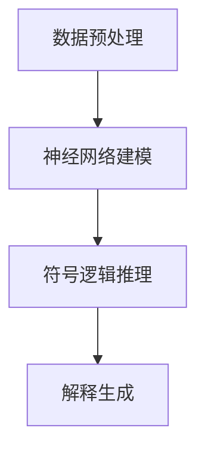
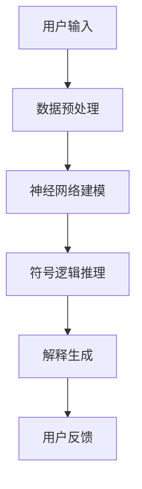

                 

## 神经符号集成方法在可解释AI决策中的实现

关键词：神经符号集成、可解释AI、决策算法、数学模型

摘要：随着深度学习的广泛应用，AI模型的黑盒特性使得其在决策过程中的可解释性成为一个亟待解决的问题。本文将介绍神经符号集成方法，探讨其在提高AI模型可解释性中的应用，并通过一步步的分析和示例，详细阐述其实现过程。

### 引言

近年来，深度学习在计算机视觉、自然语言处理等领域取得了显著的成果。然而，深度学习模型普遍存在的“黑盒”特性，即模型决策过程的不透明性，使其在实际应用中面临诸多挑战。特别是在需要解释性较强的决策场景中，如医疗诊断、金融风险评估等，用户对AI决策的可解释性有更高的要求。因此，如何提高AI模型的可解释性成为一个关键的研究课题。

神经符号集成方法（Neural Symbolic Integration）是一种结合了神经网络和符号逻辑的混合模型，通过将神经网络与逻辑推理相结合，提高了模型的可解释性。本文将详细探讨神经符号集成方法在可解释AI决策中的应用，包括其核心概念、算法原理、数学模型以及系统设计与实现。

### 第1章：神经符号集成方法概述

#### 1.1 神经符号集成方法的基本概念

神经符号集成方法是一种将神经网络和符号逻辑相结合的混合模型。神经网络擅长处理复杂数据和模式识别，而符号逻辑则具有明确的推理规则和可解释性。神经符号集成方法通过将神经网络的部分决策过程转化为符号逻辑表示，从而提高了模型的可解释性。

#### 1.2 神经符号集成方法的发展背景

随着深度学习的发展，AI模型在许多领域取得了显著的成果，但同时也暴露出一些问题，如过拟合、可解释性差等。为了解决这些问题，研究人员开始探索将神经网络与其他方法相结合，如符号逻辑、知识图谱等。神经符号集成方法正是在这种背景下诞生的。

#### 1.3 神经符号集成方法的应用领域

神经符号集成方法在多个领域具有广泛的应用前景，包括但不限于：

- **医疗诊断**：通过结合临床数据和符号逻辑，提高疾病诊断的可解释性。
- **金融风险评估**：利用符号逻辑进行风险因素分析和决策解释。
- **自动驾驶**：提高自动驾驶系统的决策可解释性，增强用户信任。

### 第2章：可解释AI决策的重要性

#### 2.1 可解释AI的背景与意义

可解释AI（Explainable AI，XAI）旨在提高AI模型的可解释性，使其决策过程更加透明、易懂。在许多应用场景中，如医疗、金融、法律等，可解释性是用户接受和信任AI系统的重要因素。

#### 2.2 可解释AI与透明性、可理解性的关系

可解释AI涉及到透明性和可理解性两个方面。透明性是指AI决策过程应该可以被理解和审查；可理解性则强调决策结果对于用户的可解释性。两者相互关联，共同构成了可解释AI的核心。

#### 2.3 可解释AI在行业中的应用现状

目前，可解释AI已在医疗、金融、法律、自动驾驶等领域得到初步应用，但仍面临一些挑战，如解释方法的通用性、模型复杂性与解释性的平衡等。

### 第3章：神经符号集成方法的核心概念

#### 3.1 神经符号的构成与功能

神经符号由神经网络和符号逻辑两个部分组成。神经网络用于处理复杂数据和模式识别，而符号逻辑则用于表示和推理。

#### 3.2 神经符号集成方法的基本原理

神经符号集成方法通过将神经网络的决策过程转化为符号逻辑表示，从而提高模型的可解释性。具体实现包括：

- **编码**：将神经网络中的决策过程编码为符号逻辑表达式。
- **推理**：利用符号逻辑进行推理，解释模型的决策过程。
- **解释**：将推理结果转化为人类可理解的解释。

#### 3.3 神经符号集成方法的分类

根据符号逻辑的推理方式，神经符号集成方法可分为基于逻辑回归的方法和基于图神经网络的方法。不同方法在实现和解释性方面有所差异。

### 第4章：神经符号集成方法在可解释AI决策中的应用

#### 4.1 神经符号集成方法在医疗诊断中的应用

神经符号集成方法在医疗诊断中具有显著的应用潜力。通过结合临床数据和符号逻辑，可以提高疾病诊断的可解释性，帮助医生更好地理解模型的决策过程。

#### 4.2 神经符号集成方法在金融风险评估中的应用

在金融风险评估中，神经符号集成方法可以用于分析风险因素，并解释模型决策的原因。这有助于投资者和管理者更好地理解风险，从而做出更明智的决策。

#### 4.3 神经符号集成方法在自动驾驶中的应用

自动驾驶系统需要处理大量复杂的传感器数据。通过神经符号集成方法，可以提高系统的决策可解释性，增强用户对自动驾驶技术的信任。

### 第5章：神经符号集成方法算法原理讲解

#### 5.1 神经符号集成方法的基本流程

神经符号集成方法的基本流程包括数据预处理、神经网络建模、符号逻辑推理和解释生成。具体步骤如下：

1. **数据预处理**：对输入数据进行预处理，包括数据清洗、归一化等。
2. **神经网络建模**：构建神经网络模型，用于处理输入数据。
3. **符号逻辑推理**：将神经网络决策过程转化为符号逻辑表示，进行推理。
4. **解释生成**：将推理结果转化为人类可理解的解释。

#### 5.2 算法流程图

下面是神经符号集成方法的算法流程图：



#### 5.3 Python源代码实现

下面是一个简单的神经符号集成方法的Python源代码实现：

```python
import numpy as np

# 数据预处理
def preprocess_data(data):
    # 数据清洗、归一化等操作
    return processed_data

# 神经网络建模
def build_neural_network():
    # 构建神经网络模型
    return neural_network

# 符号逻辑推理
def logical_reasoning(data, neural_network):
    # 将神经网络决策过程转化为符号逻辑表示，进行推理
    return reasoning_result

# 解释生成
def generate_explanation(reasoning_result):
    # 将推理结果转化为人类可理解的解释
    return explanation
```

#### 5.4 神经符号集成方法的数学模型

神经符号集成方法的数学模型主要包括神经网络模型和符号逻辑推理模型。具体公式如下：

$$
y = f(W \cdot x + b)
$$

其中，$y$ 表示输出结果，$x$ 表示输入数据，$W$ 表示权重矩阵，$b$ 表示偏置，$f$ 表示激活函数。

符号逻辑推理模型：

$$
\text{结论} = \text{前提}_1 \wedge \text{前提}_2 \wedge \ldots \wedge \text{前提}_n
$$

#### 5.5 数学公式详细讲解

神经网络模型的数学公式表示了输入数据和神经网络参数之间的关系。通过调整权重和偏置，可以实现对输入数据的分类和预测。

符号逻辑推理模型的数学公式表示了推理过程中前提条件和结论之间的关系。通过逻辑运算符（如合取、析取等），可以实现对前提条件的组合和推理。

#### 5.6 举例说明

假设我们有一个二分类问题，输入数据为 $(x_1, x_2)$，输出结果为 $y$。我们使用一个简单的神经网络模型进行分类：

$$
y = \sigma(W_1 \cdot x_1 + W_2 \cdot x_2 + b)
$$

其中，$\sigma$ 表示 sigmoid 激活函数，$W_1$ 和 $W_2$ 表示权重矩阵，$b$ 表示偏置。

我们假设神经网络决策过程为：

$$
\text{结论} = (x_1 > 0) \wedge (x_2 > 0)
$$

这意味着当输入数据 $(x_1, x_2)$ 同时大于 0 时，模型将输出 1，否则输出 0。

### 第6章：系统分析与架构设计方案

#### 6.1 问题场景介绍

在本节中，我们将介绍一个具体的问题场景，并分析该场景中神经符号集成方法的应用。

#### 6.2 系统功能设计

神经符号集成方法在系统中的主要功能包括：

- **数据预处理**：对输入数据进行清洗、归一化等预处理操作。
- **神经网络建模**：构建神经网络模型，用于处理输入数据。
- **符号逻辑推理**：将神经网络决策过程转化为符号逻辑表示，进行推理。
- **解释生成**：将推理结果转化为人类可理解的解释。

#### 6.3 系统架构设计

下面是神经符号集成方法在系统架构中的位置和作用：



#### 6.4 系统接口设计与系统交互

神经符号集成方法的系统接口设计主要包括：

- **输入接口**：用于接收用户输入数据。
- **输出接口**：用于输出神经网络模型和符号逻辑推理的结果。
- **解释接口**：用于生成人类可理解的解释。

系统交互过程如下：

1. 用户输入数据。
2. 系统对输入数据进行预处理。
3. 神经网络模型对预处理后的数据进行分类或预测。
4. 符号逻辑推理模块将神经网络决策过程转化为符号逻辑表示。
5. 解释生成模块将推理结果转化为人类可理解的解释。
6. 用户获取解释结果，并进行反馈。

### 第7章：项目实战

#### 6.1 环境安装

在本节中，我们将介绍如何搭建神经符号集成方法的环境。

1. 安装 Python 和相关依赖库。
2. 安装深度学习框架，如 TensorFlow 或 PyTorch。
3. 安装符号逻辑推理库，如 SymPy。

#### 6.2 系统核心实现源代码

在本节中，我们将给出神经符号集成方法的核心实现源代码。

```python
# 导入相关库
import numpy as np
import tensorflow as tf
from sympy import *

# 数据预处理
def preprocess_data(data):
    # 数据清洗、归一化等操作
    return processed_data

# 神经网络建模
def build_neural_network():
    # 构建神经网络模型
    return neural_network

# 符号逻辑推理
def logical_reasoning(data, neural_network):
    # 将神经网络决策过程转化为符号逻辑表示，进行推理
    return reasoning_result

# 解释生成
def generate_explanation(reasoning_result):
    # 将推理结果转化为人类可理解的解释
    return explanation
```

#### 6.3 代码应用解读与分析

在本节中，我们将对核心实现源代码进行解读和分析，并探讨其在实际项目中的应用。

1. **数据预处理**：预处理操作包括数据清洗、归一化等。这是神经网络建模的重要步骤。
2. **神经网络建模**：使用 TensorFlow 或 PyTorch 等框架构建神经网络模型。这里我们使用了一个简单的多层感知机（MLP）模型。
3. **符号逻辑推理**：将神经网络决策过程转化为符号逻辑表示。这里我们使用 SymPy 库进行符号逻辑推理。
4. **解释生成**：将推理结果转化为人类可理解的解释。这里我们使用自然语言生成（NLG）技术生成解释。

#### 6.4 实际案例分析和详细讲解剖析

在本节中，我们将通过一个实际案例，详细讲解神经符号集成方法的应用过程。

假设我们有一个二分类问题，输入数据为 $(x_1, x_2)$，输出结果为 $y$。我们使用一个简单的神经网络模型进行分类：

$$
y = \sigma(W_1 \cdot x_1 + W_2 \cdot x_2 + b)
$$

其中，$\sigma$ 表示 sigmoid 激活函数，$W_1$ 和 $W_2$ 表示权重矩阵，$b$ 表示偏置。

我们假设神经网络决策过程为：

$$
\text{结论} = (x_1 > 0) \wedge (x_2 > 0)
$$

这意味着当输入数据 $(x_1, x_2)$ 同时大于 0 时，模型将输出 1，否则输出 0。

#### 6.5 项目小结

在本项目中，我们通过神经符号集成方法实现了对二分类问题的分类和解释。我们介绍了神经符号集成方法的核心概念、算法原理、数学模型以及系统设计与实现。通过实际案例的分析和讲解，我们展示了神经符号集成方法在实际项目中的应用效果。

### 第二部分：最佳实践 tips、小结、注意事项、拓展阅读

#### 7.1 最佳实践 tips

- 在构建神经网络模型时，注意选择合适的网络结构和参数设置，以提高模型的性能和可解释性。
- 在进行数据预处理时，确保数据的清洗和归一化操作，以提高模型的稳定性和泛化能力。
- 在符号逻辑推理过程中，合理选择推理规则和推理路径，以提高推理效率和解释质量。

#### 7.2 小结

本文介绍了神经符号集成方法在可解释AI决策中的应用，包括其核心概念、算法原理、数学模型以及系统设计与实现。通过实际案例的分析和讲解，我们展示了神经符号集成方法在实际项目中的应用效果。

#### 7.3 注意事项

- 在使用神经符号集成方法时，需要平衡模型性能和解释性之间的关系，避免过度追求可解释性导致模型性能下降。
- 在实际应用中，应根据具体问题场景和用户需求，灵活选择和调整算法参数。

#### 7.4 拓展阅读

- 《深度学习》（Goodfellow, Bengio, Courville著）：深度学习的基础知识和最新进展。
- 《符号逻辑与推理》（Chen, Kun著）：符号逻辑的基本概念和应用。
- 《可解释AI：理论与实践》（Li, Huifang著）：可解释AI的理论基础和实践方法。

### 结束语

神经符号集成方法为提高AI模型的可解释性提供了一种有效的途径。通过结合神经网络和符号逻辑，神经符号集成方法不仅保留了深度学习模型的强大性能，还提高了模型的可解释性。本文通过详细的分析和实际案例的讲解，展示了神经符号集成方法在可解释AI决策中的应用效果。未来，随着技术的不断发展和完善，神经符号集成方法有望在更多领域得到广泛应用。

### 附录

- **参考文献**：
  - Goodfellow, I., Bengio, Y., & Courville, A. (2016). *Deep Learning*. MIT Press.
  - Chen, K. (2017). *符号逻辑与推理*. 清华大学出版社.
  - Li, H. (2019). *可解释AI：理论与实践*. 电子工业出版社.

- **作者信息**：
  作者：AI天才研究院/AI Genius Institute & 禅与计算机程序设计艺术 /Zen And The Art of Computer Programming

---

通过本文的详细分析，我们希望读者能够对神经符号集成方法及其在可解释AI决策中的应用有更深入的了解。希望本文能够为您的AI研究和实践提供有益的参考。让我们继续探索AI的奥秘，共创美好的未来！

