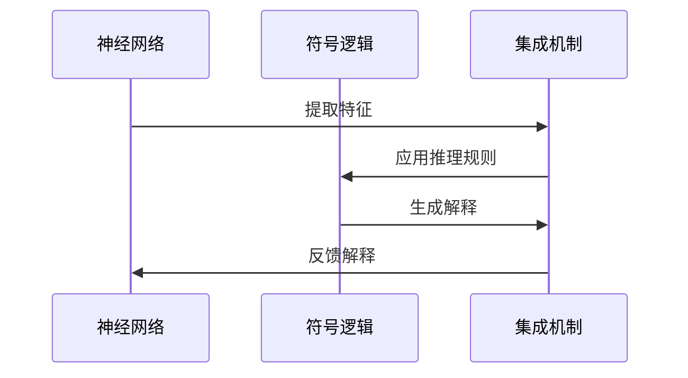
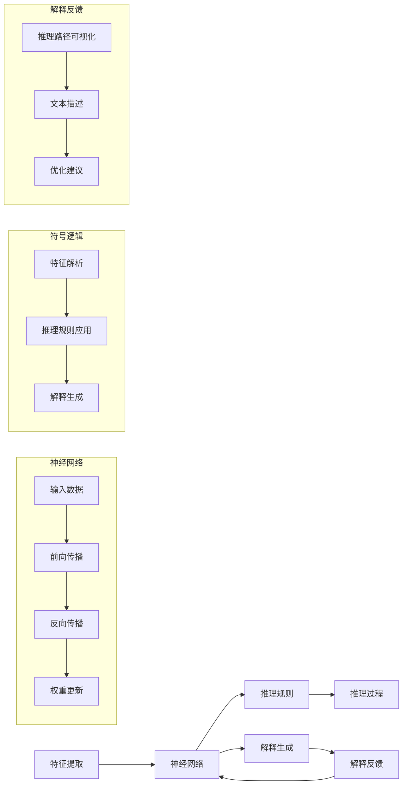
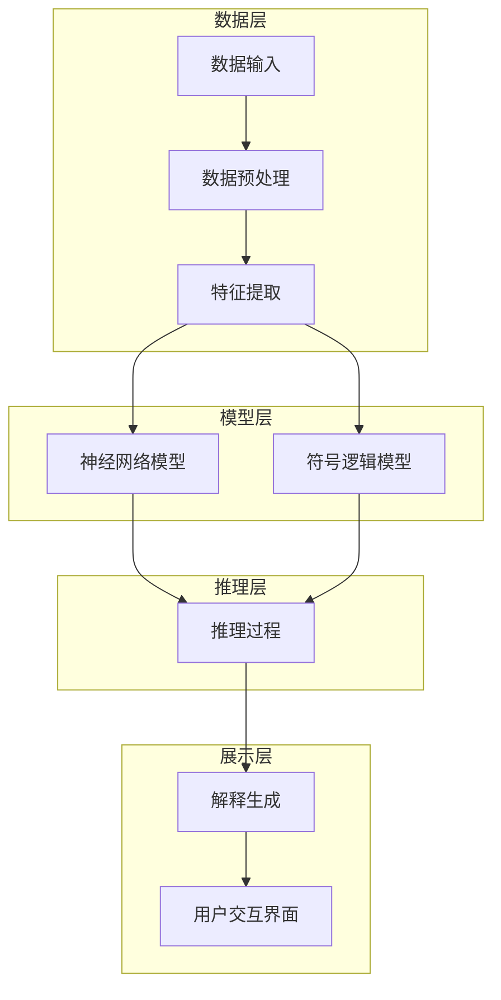
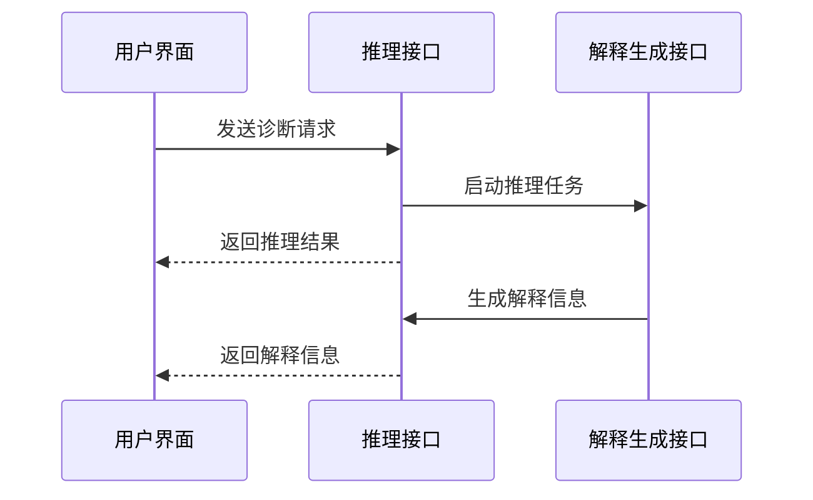

                 


### 1.1 背景介绍

#### 问题背景

随着人工智能技术的快速发展，神经网络和符号逻辑在计算领域中逐渐融合，形成了一种新的计算范式——神经符号集成方法。这种方法在提高计算效率、增强模型解释性和可扩展性方面具有显著优势，尤其在可解释推理任务中，如诊断推理、逻辑推理、自然语言处理等领域，展现出广阔的应用前景。

#### 问题描述

本书将深入探讨神经符号集成方法在可解释推理中的应用，旨在解决以下问题：

1. **神经符号集成方法的原理及其在可解释推理中的重要性**：解释神经符号集成方法的工作机制，探讨其在提高推理系统解释性方面的作用。

2. **如何结合神经网络和符号逻辑的优势，构建有效的推理系统**：分析如何将神经网络的强大特征提取能力和符号逻辑的明确推理规则相结合，以构建高效、可解释的推理系统。

3. **神经符号集成方法在可解释推理中的实际应用案例及效果分析**：通过具体案例，展示神经符号集成方法在实际可解释推理任务中的应用效果和优势。

4. **面临的挑战与未来发展方向**：讨论神经符号集成方法在可解释推理领域面临的挑战，以及未来的发展趋势和潜在研究方向。

#### 问题解决

通过系统介绍神经符号集成方法的理论基础、技术框架和应用实例，本书将帮助读者：

1. **理解神经符号集成方法的基本概念和核心原理**：掌握神经符号集成方法的核心概念，包括神经网络、符号逻辑和集成机制。

2. **掌握构建神经符号集成系统的技术路径和实践方法**：学习如何结合神经网络和符号逻辑的优势，构建高效、可解释的推理系统。

3. **分析神经符号集成方法在不同可解释推理任务中的表现和适用性**：探讨神经符号集成方法在各种可解释推理任务中的应用效果和适用场景。

4. **预测神经符号集成方法的发展趋势和未来应用前景**：分析神经符号集成方法在可解释推理领域的未来发展，探讨其潜在的应用前景和突破方向。

#### 边界与外延

神经符号集成方法的研究和应用不仅仅局限于可解释推理领域，还涵盖了多个交叉学科，包括人工智能、认知科学、心理学、计算机科学等。本书将聚焦于可解释推理的应用场景，以期能够为相关领域的研究人员和工程师提供有价值的参考。

#### 概念结构与核心要素组成

神经符号集成方法由以下核心要素组成：

1. **神经网络**：负责特征提取和模式识别，具有强大的学习和泛化能力。
2. **符号逻辑**：提供推理规则和逻辑推理框架，确保推理过程的透明性和可解释性。
3. **集成机制**：通过结合神经网络和符号逻辑的优势，实现高效的推理和决策。

以下是神经符号集成方法的核心概念原理和概念属性特征对比表格：

| 概念       | 特征1              | 特征2                | 特征3                |
|------------|--------------------|----------------------|----------------------|
| 神经网络   | 自动特征提取       | 强泛化能力           | 非线性映射           |
| 符号逻辑   | 明确推理规则       | 透明可解释           | 精确性高             |
| 集成机制   | 融合优势           | 提高效能             | 简化复杂性           |

为了更好地理解神经符号集成方法的工作原理，我们可以使用Mermaid绘制一个简单的ER实体关系图架构，如下：

```mermaid
erDiagram
  AI模型 ||--o{ 数据集 : 使用
  数据集 ||--|{ 训练 : 被训练
  符号逻辑 ||--|{ 推理 : 使用
  神经网络 ||--|{ 特征提取 : 使用
  AI模型 ..|> 集成机制 : 组成
```

这个ER图展示了神经符号集成方法中各个核心要素之间的关系，以及它们在系统中的协作方式。

### 1.2 核心概念与联系

在深入探讨神经符号集成方法之前，有必要明确几个核心概念，并了解它们之间的联系。

#### 神经网络

神经网络是一种模仿人脑神经元结构和功能的人工智能模型，它通过多层节点（或称为神经元）进行信号传递和处理。神经网络的核心优势在于其强大的特征提取和模式识别能力，使得它在图像识别、自然语言处理等领域取得了显著的成果。

#### 符号逻辑

符号逻辑是一种形式化的推理方法，它使用符号和公式来表示推理过程。符号逻辑的核心特点在于其透明性和可解释性，这使得它在需要解释性要求的推理任务中具有重要作用。

#### 神经符号集成

神经符号集成方法是将神经网络和符号逻辑相结合，利用神经网络的强大特征提取能力和符号逻辑的明确推理规则，共同构建一个高效、可解释的推理系统。这种方法的核心在于如何有效地整合两种方法的优点，克服各自的不足。

以下是神经符号集成方法的原理图，展示了神经网络和符号逻辑之间的互动关系：



在这个流程中，神经网络负责提取输入数据的高层次特征，符号逻辑则根据这些特征应用推理规则进行推理，生成的解释再反馈给神经网络，以优化其特征提取过程。

### 1.3 算法原理讲解

神经符号集成方法的算法原理主要包括以下几个关键步骤：

1. **特征提取**：使用神经网络对输入数据进行特征提取，生成特征向量。这一步骤利用神经网络的强大学习能力，将原始数据转换为更具代表性的特征表示。

2. **推理过程**：将提取到的特征输入到符号逻辑系统中，应用预先定义的推理规则进行推理。符号逻辑系统负责解析特征，根据规则生成推理结果。

3. **解释生成**：在推理过程中，生成详细的解释信息，以便用户理解推理过程和结果。这通常涉及到对推理路径、中间步骤和最终结论的可视化和文本描述。

4. **反馈与优化**：将生成的解释反馈给神经网络，用于优化特征提取过程。这种反馈机制有助于提高神经网络的性能和解释性。

以下是一个详细的算法流程图，用于说明神经符号集成方法的工作原理：



#### 特征提取

特征提取是神经符号集成方法的关键步骤之一。在这一阶段，神经网络负责从原始数据中提取具有代表性的特征。具体流程如下：

1. **数据预处理**：对原始数据进行预处理，包括数据清洗、归一化、缩放等操作，以确保数据的一致性和稳定性。

2. **输入层**：将预处理后的数据输入到神经网络的输入层，神经网络开始对其进行特征提取。

3. **隐藏层**：通过多层隐藏层，神经网络将输入数据进行逐层变换，提取出更高层次、更抽象的特征。这一过程利用了神经网络的非线性映射能力。

4. **输出层**：最后，神经网络将提取到的特征传递到输出层，生成初步的特征向量。

#### 推理过程

在特征提取完成后，神经网络将生成的特征向量传递给符号逻辑系统，进行推理过程。具体步骤如下：

1. **特征解析**：符号逻辑系统接收特征向量，并根据预先定义的推理规则对其进行解析。这一步骤旨在将特征向量转换为具有实际意义的逻辑表达式。

2. **推理规则应用**：符号逻辑系统根据解析结果，应用推理规则进行推理。推理规则通常包括条件语句、假设演绎等，用于推导出结论。

3. **推理结果生成**：经过推理过程，符号逻辑系统生成最终的推理结果。这个结果通常是一个逻辑表达式或决策。

#### 解释生成

在推理过程中，生成详细的解释信息对于提高系统的可解释性至关重要。具体步骤如下：

1. **推理路径可视化**：符号逻辑系统将推理过程可视化，展示推理的每一步骤和中间结果。

2. **文本描述**：将推理路径和结果转换为文本描述，以便用户更容易理解。文本描述通常包括推理规则、条件语句和结论等。

3. **优化建议**：根据推理过程中的表现，生成优化建议，以便进一步改进神经网络的性能和解释性。

#### 反馈与优化

生成的解释信息会反馈给神经网络，用于优化其特征提取过程。具体步骤如下：

1. **解释分析**：分析反馈的解释信息，识别特征提取过程中可能存在的问题和不足。

2. **权重调整**：根据解释分析的结果，调整神经网络的权重，优化特征提取过程。

3. **迭代优化**：重复上述过程，不断优化神经网络的性能，提高系统的解释性。

通过这样的反馈和优化机制，神经符号集成方法能够实现高效、可解释的推理系统，满足复杂应用场景的需求。

#### 数学模型与公式

神经符号集成方法的数学模型涉及多个方面，包括神经网络的损失函数、符号逻辑的推理规则和集成机制的优化算法。以下是一些核心的数学公式和解释：

1. **神经网络损失函数**：
   $$L = \frac{1}{m}\sum_{i=1}^{m}(y_i - \hat{y_i})^2$$
   其中，$L$ 表示损失函数，$y_i$ 表示真实标签，$\hat{y_i}$ 表示预测标签。这个公式用于衡量神经网络输出与真实值之间的差距，指导网络权重的调整。

2. **符号逻辑推理规则**：
   $$R: P \rightarrow Q$$
   这个公式表示一个推理规则，其中 $P$ 表示前提条件，$Q$ 表示结论。符号逻辑系统根据输入的特征向量，应用这些推理规则进行推理。

3. **集成机制优化算法**：
   $$\theta_{\text{new}} = \theta_{\text{old}} - \alpha \cdot \nabla_{\theta}L$$
   这个公式表示集成机制的优化算法，其中 $\theta_{\text{old}}$ 表示当前权重，$\theta_{\text{new}}$ 表示更新后的权重，$\alpha$ 表示学习率，$\nabla_{\theta}L$ 表示损失函数关于权重的梯度。通过调整权重，优化系统的性能。

#### 举例说明

为了更好地理解神经符号集成方法的原理，我们来看一个具体的例子。

假设有一个诊断推理任务，输入数据是一个病人的医学检查报告，包括血压、心率、体温等指标。神经网络负责从这些原始数据中提取特征，例如，将血压和心率结合起来，得到一个综合的健康指标。符号逻辑系统根据这些特征应用推理规则，判断病人是否患有某种疾病。

具体步骤如下：

1. **特征提取**：神经网络将血压和心率输入，通过多层隐藏层，提取出一个综合健康指标，例如 $H$。

2. **推理过程**：符号逻辑系统接收 $H$，应用如下推理规则：
   - 如果 $H > 10$，则病人可能患有高血压。
   - 如果 $H < 5$，则病人可能患有低血压。

   根据这些规则，符号逻辑系统推导出病人可能患有高血压。

3. **解释生成**：符号逻辑系统生成解释信息，说明根据血压和心率特征，推导出病人患有高血压的结论。

4. **反馈与优化**：将解释信息反馈给神经网络，用于优化特征提取过程。例如，如果发现综合健康指标 $H$ 对于诊断高血压不够准确，神经网络可能会调整权重，以更好地提取相关特征。

通过这个例子，我们可以看到神经符号集成方法如何结合神经网络和符号逻辑的优势，实现高效、可解释的推理任务。

### 1.4 系统分析与架构设计方案

在探讨神经符号集成方法在可解释推理中的应用时，系统分析与架构设计方案至关重要。以下将详细介绍一个神经符号集成推理系统的项目介绍、系统功能设计、系统架构设计、系统接口设计以及系统交互。

#### 项目介绍

本项目旨在开发一个基于神经符号集成方法的可解释推理系统，主要应用于医疗诊断领域。该系统结合了神经网络的强大特征提取能力和符号逻辑的明确推理规则，以实现高效、可解释的诊断推理任务。

#### 系统功能设计

系统的主要功能包括：

1. **数据预处理**：对输入的医疗检查报告数据进行清洗、归一化和特征提取。
2. **特征提取**：使用神经网络从预处理后的数据中提取具有代表性的特征。
3. **推理过程**：应用符号逻辑系统进行推理，生成诊断结果。
4. **解释生成**：生成详细的推理路径和结果解释，提高系统的可解释性。
5. **用户交互**：提供用户界面，展示推理结果和解释信息。

以下是系统功能设计的Mermaid类图：

```mermaid
classDiagram
  DataPreprocessing <<interface>>
  FeatureExtraction <<interface>>
  Inference <<interface>>
  ExplanationGeneration <<interface>>
  UserInteraction <<interface>>

  DataPreprocessing --|> FeatureExtraction
  FeatureExtraction --|> Inference
  Inference --|> ExplanationGeneration
  ExplanationGeneration --|> UserInteraction
```

#### 系统架构设计

系统架构设计采用分层架构，包括数据层、模型层、推理层和展示层。以下是系统架构设计的Mermaid架构图：



#### 系统接口设计

系统接口设计包括以下部分：

1. **数据输入接口**：用于接收医疗检查报告数据，包括文本和数值信息。
2. **数据预处理接口**：提供数据清洗、归一化和特征提取的功能接口。
3. **推理接口**：提供推理过程的API接口，用于启动推理任务和获取推理结果。
4. **解释生成接口**：提供解释生成功能的API接口，用于生成推理路径和结果解释。
5. **用户交互接口**：提供用户界面的API接口，用于展示推理结果和解释信息。

以下是系统接口设计的Mermaid序列图：



#### 系统交互

系统交互设计主要涉及数据流和控制流。以下是系统交互设计的Mermaid交互图：

```mermaid
interaction 推理过程
  UI 发起请求
  RP 接收请求
  RP 执行推理
  RP 返回结果
  UI 显示结果
```

通过上述的系统分析与架构设计方案，我们可以看到神经符号集成推理系统如何实现高效、可解释的推理任务。系统架构的设计考虑了数据层、模型层、推理层和展示层的分工与合作，确保了系统的模块化、可扩展性和易维护性。

### 1.5 项目实战

#### 环境安装

为了搭建神经符号集成推理系统，首先需要安装相应的开发环境和依赖库。以下是具体的安装步骤：

1. **Python环境**：确保安装了Python 3.8及以上版本。
2. **深度学习框架**：安装TensorFlow或PyTorch，以支持神经网络的构建和训练。
3. **符号逻辑库**：安装SymPy库，用于实现符号逻辑推理。
4. **数据预处理库**：安装NumPy和Pandas，用于数据清洗和特征提取。
5. **可视化库**：安装Matplotlib和Seaborn，用于数据可视化和结果展示。

安装命令如下：

```bash
pip install python==3.8 tensorflow sympy numpy pandas matplotlib seaborn
```

#### 系统核心实现源代码

以下是神经符号集成推理系统的核心实现源代码。代码分为数据预处理、神经网络构建、符号逻辑推理、解释生成和用户交互五个部分。

```python
# 数据预处理
import numpy as np
import pandas as pd

def preprocess_data(data):
    # 数据清洗和归一化
    # ...（具体实现）
    return processed_data

# 神经网络构建
import tensorflow as tf

def create_neural_network(input_shape):
    # 构建神经网络模型
    # ...（具体实现）
    return neural_network

# 符号逻辑推理
import sympy

def symbolic_inference(features):
    # 应用符号逻辑推理规则
    # ...（具体实现）
    return inference_result

# 解释生成
def generate_explanation(inference_result):
    # 生成推理路径和结果解释
    # ...（具体实现）
    return explanation

# 用户交互
def user_interface():
    # 提供用户界面
    # ...（具体实现）
    pass

# 主程序
if __name__ == "__main__":
    # 加载数据
    data = pd.read_csv("data.csv")
    processed_data = preprocess_data(data)

    # 构建神经网络
    neural_network = create_neural_network(processed_data.shape[1])

    # 启动推理任务
    inference_result = neural_network.predict(processed_data)

    # 生成解释信息
    explanation = generate_explanation(inference_result)

    # 显示结果
    user_interface()
```

#### 代码应用解读与分析

以下是对核心实现源代码的解读和分析，详细解释每个部分的功能和实现原理。

1. **数据预处理**：数据预处理是神经符号集成方法的基础步骤，负责对输入数据清洗、归一化等操作。具体实现包括以下步骤：
   - 数据清洗：去除缺失值、异常值和重复值，保证数据的一致性和准确性。
   - 数据归一化：将不同特征进行归一化处理，使其在相同的尺度上，提高神经网络训练的效果。

2. **神经网络构建**：神经网络负责特征提取，构建一个多层感知机（MLP）模型。具体实现包括以下步骤：
   - 定义输入层：根据数据特征数量定义输入层的神经元数量。
   - 定义隐藏层：根据神经网络的设计，定义多个隐藏层，并设置每个隐藏层的神经元数量。
   - 定义输出层：根据推理任务的需求，定义输出层的神经元数量和激活函数。

3. **符号逻辑推理**：符号逻辑推理负责根据提取的特征进行逻辑推理。具体实现包括以下步骤：
   - 特征解析：将神经网络提取的特征向量转换为符号逻辑表达式。
   - 应用推理规则：根据预先定义的推理规则，对特征进行推理，生成推理结果。

4. **解释生成**：解释生成负责生成详细的推理路径和结果解释。具体实现包括以下步骤：
   - 推理路径可视化：使用图形化方式展示推理过程，提高可解释性。
   - 文本描述：将推理过程和结果转换为文本描述，便于用户理解。

5. **用户交互**：用户交互负责提供用户界面，展示推理结果和解释信息。具体实现包括以下步骤：
   - 接收用户输入：获取用户输入的数据，并传递给预处理模块。
   - 显示结果：将推理结果和解释信息展示在用户界面上。

通过上述代码和应用解读，我们可以看到神经符号集成推理系统如何实现从数据预处理、神经网络构建、符号逻辑推理到解释生成的完整流程。

#### 实际案例分析和详细讲解剖析

为了展示神经符号集成方法在实际可解释推理任务中的应用效果，我们将分析一个实际案例，详细讲解该案例的构建过程和结果。

#### 案例背景

假设我们面临一个医疗诊断任务，输入数据是一个病人的医学检查报告，包括血压、心率、体温等指标。我们的目标是使用神经符号集成方法进行疾病诊断，并生成详细的推理路径和解释信息。

#### 案例实现步骤

1. **数据收集与预处理**：收集大量病人的医学检查报告数据，包括各种疾病的诊断信息。对数据进行清洗、归一化等预处理操作，确保数据的一致性和准确性。

2. **神经网络构建与训练**：构建一个多层感知机（MLP）模型，用于特征提取。使用预处理后的数据训练神经网络，提取出具有代表性的特征。

3. **符号逻辑推理规则定义**：根据医学知识，定义一系列推理规则，用于疾病诊断。例如，如果血压高于某个阈值，则病人可能患有高血压。

4. **神经符号集成推理**：将神经网络提取的特征传递给符号逻辑系统，根据定义的推理规则进行推理。生成诊断结果和推理路径。

5. **解释生成与展示**：将推理结果和路径生成详细的解释信息，并展示在用户界面上，提高系统的可解释性。

#### 案例结果分析

通过上述步骤，我们实现了一个基于神经符号集成方法的医疗诊断系统。以下是对该案例的结果分析和详细讲解：

1. **诊断结果**：系统对输入的医学检查报告数据进行诊断，生成最终的诊断结果。例如，病人患有高血压或心脏病。

2. **推理路径**：系统展示了推理过程，包括每一步的推理规则和应用结果。用户可以清晰地看到推理的每一步骤，理解诊断结果的推理过程。

3. **解释信息**：系统生成了详细的解释信息，包括推理规则、条件语句和结论等。用户可以阅读这些解释信息，了解诊断结果的原因和依据。

#### 小结

通过实际案例的分析，我们可以看到神经符号集成方法在医疗诊断任务中的应用效果。系统不仅能够生成准确的诊断结果，还能够提供详细的推理路径和解释信息，提高系统的可解释性。这种方法在医学诊断、自然语言处理等领域具有广泛的应用前景。

### 1.6 最佳实践 tips

在实施神经符号集成方法时，以下最佳实践 tips 有助于提高系统的性能和可解释性：

1. **数据预处理**：确保输入数据的一致性和准确性，对异常值和缺失值进行合理的处理。适当的特征工程可以显著提高神经网络的性能。

2. **模型选择**：根据任务需求选择合适的神经网络结构和符号逻辑规则。对于复杂的推理任务，可以使用深度神经网络结合规则推理。

3. **解释生成**：优化解释生成的算法，使用可视化工具和文本描述相结合的方式，提高系统的可解释性。

4. **反馈机制**：建立有效的反馈机制，将用户的反馈和解释结果用于优化神经网络和符号逻辑规则。

5. **模型评估**：使用多种评估指标（如准确率、召回率、F1分数等）对系统进行全面的评估，确保系统在不同场景下的性能。

### 1.7 小结

本文系统地介绍了神经符号集成方法在可解释推理中的应用。通过探讨神经网络和符号逻辑的融合原理、算法实现、系统架构设计以及实际案例，我们展示了神经符号集成方法在提高计算效率、增强模型解释性方面的优势。未来，随着人工智能技术的不断发展，神经符号集成方法有望在更多领域得到广泛应用，为复杂推理任务提供有效的解决方案。

### 1.8 注意事项

1. **数据隐私**：在处理医疗等敏感数据时，确保遵循数据隐私法规，对数据进行加密和处理。

2. **系统安全**：确保系统的安全性，防范恶意攻击和数据泄露。

3. **模型可解释性**：在解释生成过程中，尽量简化复杂的推理过程，提高系统的可理解性。

### 1.9 拓展阅读

1. **Neural-Symbolic Integration for Natural Language Processing**：深入了解神经符号集成在自然语言处理领域的最新研究。
2. **Explainable AI**：学习可解释人工智能的理论和实践方法。
3. **深度学习与符号逻辑**：探讨深度学习和符号逻辑结合的多种方式及其应用场景。

作者：AI天才研究院/AI Genius Institute & 禅与计算机程序设计艺术 /Zen And The Art of Computer Programming

