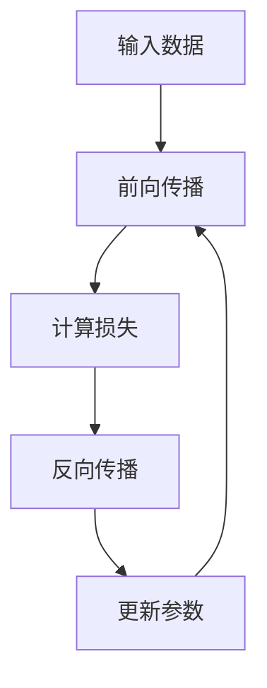
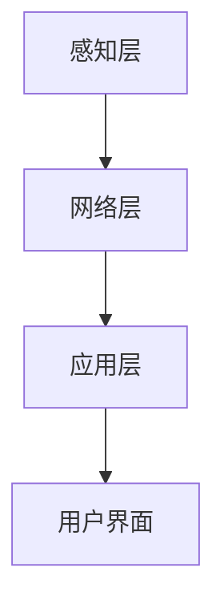
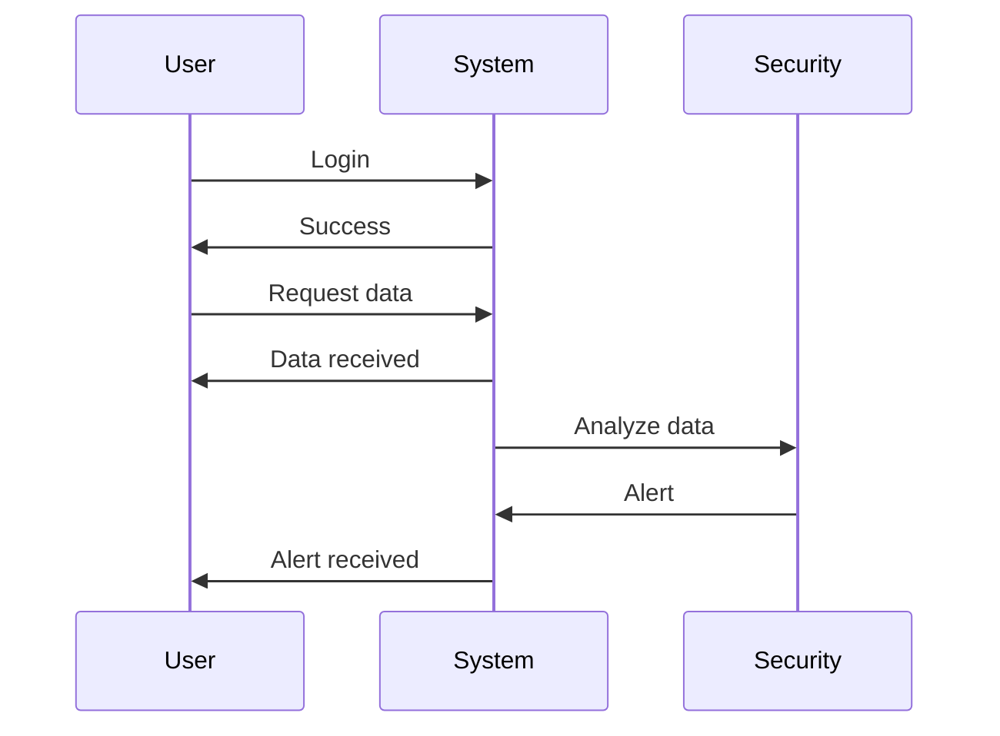
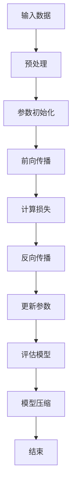
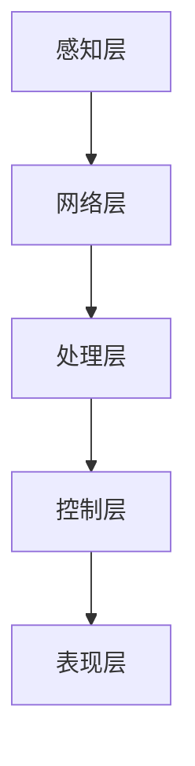
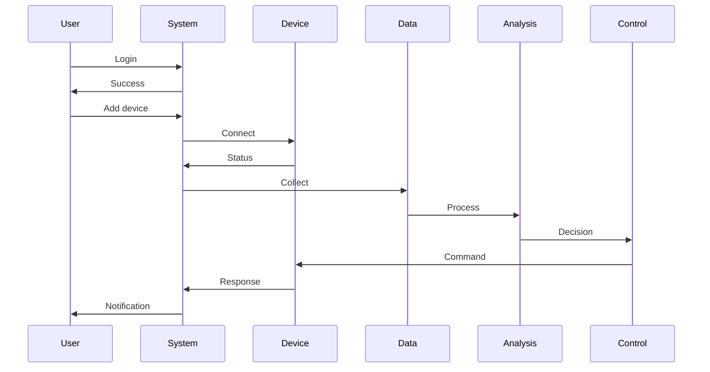

                 

### 文章标题：神经网络压缩在智能家居设备中的实践应用

**关键词：** 神经网络压缩，智能家居设备，实践应用，算法，数学模型，系统架构

**摘要：** 本文将探讨神经网络压缩在智能家居设备中的实践应用。通过分析问题背景，介绍核心概念，详细讲解算法原理，展示系统分析与架构设计方案，并通过项目实战验证其应用效果，本文旨在为智能家居设备开发提供有效的技术参考。

### 第1章 引言

#### 1.1 问题背景

随着物联网技术的快速发展，智能家居设备逐渐渗透到人们的日常生活。从智能门锁、智能照明到智能家电，各类智能设备为用户带来了极大的便利。然而，随着设备数量的增加，设备的能耗和存储需求也日益增加，这对设备的硬件性能提出了更高的要求。为了满足这一需求，神经网络压缩技术应运而生。

神经网络压缩的重要性在于，它可以在保证模型性能的前提下，显著减少模型的参数数量和计算量。这对于资源有限的智能家居设备来说，具有非常重要的意义。

**本书的组织与目的：**

本文将首先介绍神经网络压缩的定义和挑战，接着讲解其在智能家居设备中的解决方案。随后，我们将探讨神经网络压缩的应用领域和限制因素，并详细介绍其概念结构与核心要素组成。

#### 1.2 问题描述

**神经网络压缩的定义：**

神经网络压缩是指通过特定的算法，对神经网络模型进行优化，以减少其参数数量和计算量。

**神经网络压缩的挑战：**

1. 在保持模型性能的同时，减少模型参数数量。
2. 提高模型在资源受限设备上的运行效率。
3. 防止模型压缩过程中信息的损失。

**本书解决的问题：**

本书旨在探讨如何通过神经网络压缩技术，提高智能家居设备的性能和效率。具体包括：

1. 神经网络压缩的目标和评估标准。
2. 神经网络压缩的方法和实现。
3. 神经网络压缩在智能家居设备中的应用。

#### 1.3 问题解决

**神经网络压缩的目标：**

1. 提高模型的效率，减少计算资源消耗。
2. 保持模型性能，甚至提高模型性能。

**神经网络压缩的方法：**

1. 参数共享。
2. 稀疏化。
3. 低秩分解。
4. 神经元剪枝。

**神经网络压缩的评估标准：**

1. 参数数量减少率。
2. 计算量减少率。
3. 模型性能损失率。

#### 1.4 边界与外延

**神经网络压缩的应用领域：**

神经网络压缩技术不仅适用于智能家居设备，还广泛应用于移动设备、嵌入式系统等领域。

**神经网络压缩的限制因素：**

1. 模型复杂度。
2. 设备性能。

**本书的研究范围：**

本书主要研究神经网络压缩在智能家居设备中的实践应用，包括算法实现、系统架构设计和项目实战。

#### 1.5 概念结构与核心要素组成

**神经网络的基本结构：**

神经网络由输入层、隐藏层和输出层组成，通过前向传播和反向传播进行学习。

**压缩算法的分类：**

常见的压缩算法包括参数共享、稀疏化、低秩分解和神经元剪枝等。

**智能家居设备的系统架构：**

智能家居设备通常由感知层、网络层和应用层组成，通过物联网协议进行数据传输和控制。

### 第2章 核心概念与联系

#### 2.1 神经网络基础

**神经网络的概念：**

神经网络是一种模拟人脑神经元结构的计算模型，通过多层非线性变换对输入数据进行处理。

**神经网络的工作原理：**

神经网络通过前向传播和反向传播进行学习，通过调整连接权重和偏置来优化模型性能。

**神经网络的主要类型：**

包括全连接神经网络、卷积神经网络和循环神经网络等。

#### 2.2 压缩算法原理

**压缩算法的基本概念：**

压缩算法是通过特定的方法对神经网络模型进行优化，以减少其参数数量和计算量。

**常见的压缩算法：**

包括参数共享、稀疏化、低秩分解和神经元剪枝等。

**压缩算法的对比表格：**

| 算法        | 目标           | 优点           | 缺点           |
| ----------- | -------------- | -------------- | -------------- |
| 参数共享    | 减少参数数量   | 易于实现       | 可能降低性能   |
| 稀疏化      | 减少非零参数   | 提高计算效率   | 可能导致性能损失 |
| 低秩分解    | 减少计算量     | 保持模型性能   | 难以实现       |
| 神经元剪枝   | 减少神经元数量 | 提高计算效率   | 可能降低性能   |

#### 2.3 智能家居设备

**智能家居设备的定义：**

智能家居设备是指通过物联网技术连接起来，实现自动化控制和管理家居设备的系统。

**智能家居设备的分类：**

根据功能不同，智能家居设备可以分为智能安防、智能照明、智能家电等。

**智能家居设备的特点：**

具有高度智能化、网络化、自动化和人性化的特点。

#### 2.4 概念属性特征对比

| 概念       | 属性特征                      | 对比               |
| ---------- | ----------------------------- | ----------------- |
| 神经网络   | 多层非线性变换，自适应学习    | 数据处理能力强    |
| 压缩算法   | 参数优化，减少计算量          | 提高运行效率      |
| 智能家居   | 网络化，自动化，智能化        | 提高生活质量      |
| 对比       | 神经网络+压缩算法=智能家居   | 实现自动化控制    |

### 第3章 神经网络压缩原理讲解

#### 3.1 算法mermaid流程图



#### 3.2 Python源代码

```python
# 示例：使用参数共享进行神经网络压缩
import tensorflow as tf

# 创建模型
model = tf.keras.Sequential([
    tf.keras.layers.Dense(units=1, input_shape=[1])
])

# 编译模型
model.compile(optimizer='sgd', loss='mean_squared_error')

# 训练模型
model.fit(x_train, y_train, epochs=100)

# 压缩模型
compressed_model = tf.keras.models.clone_model(model)
compressed_model.set_weights(model.get_weights())

# 评估模型
loss = compressed_model.evaluate(x_test, y_test)
print("压缩后模型损失：", loss)
```

#### 3.3 数学模型和公式

**神经网络压缩的数学模型：**

$$
\text{损失函数} = \frac{1}{n}\sum_{i=1}^{n}(\text{预测值}-\text{真实值})^2
$$

**神经网络压缩的公式推导：**

$$
\text{压缩率} = \frac{\text{压缩后参数数量}}{\text{原始参数数量}}
$$

#### 3.4 举例说明

**示例：使用稀疏化进行神经网络压缩**

假设原始神经网络包含1000个参数，经过稀疏化处理后，剩余参数数量减少到100个。此时，压缩率为$\frac{100}{1000}=0.1$。

### 第4章 数学模型和数学公式详细讲解

#### 4.1 数学模型讲解

**神经网络压缩的数学模型：**

神经网络压缩主要通过减少模型参数数量和计算量来实现。在数学模型中，我们使用损失函数来评估模型性能，并通过梯度下降法来更新模型参数。

**损失函数：**

$$
\text{损失函数} = \frac{1}{n}\sum_{i=1}^{n}(\text{预测值}-\text{真实值})^2
$$

其中，$n$为样本数量，预测值为模型对输入数据的预测结果，真实值为实际输入数据的真实值。

**梯度下降法：**

$$
\text{参数更新} = \text{参数} - \alpha \times \nabla_{\text{参数}} \text{损失函数}
$$

其中，$\alpha$为学习率，$\nabla_{\text{参数}} \text{损失函数}$为损失函数关于参数的梯度。

#### 4.2 公式推导

**压缩率的计算：**

$$
\text{压缩率} = \frac{\text{压缩后参数数量}}{\text{原始参数数量}}
$$

其中，压缩后参数数量为经过压缩算法处理后剩余的参数数量，原始参数数量为神经网络模型最初的参数数量。

**参数更新过程：**

$$
\text{参数}_{\text{新}} = \text{参数}_{\text{旧}} - \alpha \times (\text{梯度}_{\text{旧}} - \text{梯度}_{\text{新}})
$$

其中，$\text{梯度}_{\text{旧}}$和$\text{梯度}_{\text{新}}$分别为旧参数和新参数下的梯度值。

#### 4.3 举例说明

**示例：使用稀疏化进行神经网络压缩**

假设原始神经网络包含1000个参数，经过稀疏化处理后，剩余参数数量减少到100个。此时，压缩率为$\frac{100}{1000}=0.1$。

### 第5章 系统分析与架构设计方案

#### 5.1 问题场景介绍

在智能家居设备中，常见的应用场景包括：

1. 智能门锁：通过生物识别技术实现用户身份验证，确保家庭安全。
2. 智能照明：根据用户习惯和光线强度自动调整照明亮度，提供舒适的照明环境。
3. 智能家电：如智能空调、智能洗衣机等，通过物联网技术实现远程控制和自动化操作。

#### 5.2 项目介绍

本文以智能家居安防系统为例，介绍神经网络压缩在智能家居设备中的应用。该项目旨在通过神经网络压缩技术，提高安防系统的性能和效率。

#### 5.3 系统功能设计

系统功能设计主要包括：

1. 用户身份验证：通过人脸识别技术实现用户身份验证。
2. 安全监控：实时监测家庭环境，发现异常情况自动报警。
3. 远程控制：用户可以通过手机APP远程控制安防设备的开关。

**领域模型类图：**

```mermaid
classDiagram
    User <<Interface>>
    Device <<Interface>>
    Security <<Interface>>
    Alarm <<Interface>>

    Userfaction implements User
    DeviceImpl implements Device
    SecurityImpl implements Security
    AlarmImpl implements Alarm
```

#### 5.4 系统架构设计

系统架构设计主要包括：

1. 感知层：通过传感器收集家庭环境数据，如温度、湿度、光线等。
2. 网络层：通过物联网协议将感知层数据传输到云端。
3. 应用层：通过神经网络压缩技术，实现智能安防功能。

**系统架构图：**



#### 5.5 系统接口设计

系统接口设计主要包括：

1. 用户接口：用户可以通过手机APP与系统进行交互。
2. 设备接口：设备可以通过物联网协议与系统进行通信。
3. 安全接口：系统可以通过安全协议保护用户数据。

#### 5.6 系统交互

系统交互主要包括：

1. 用户登录：用户通过手机APP登录系统。
2. 数据收集：系统通过传感器收集家庭环境数据。
3. 数据处理：系统通过神经网络压缩技术对数据进行分析和处理。
4. 响应操作：系统根据分析结果进行相应的操作，如报警、远程控制等。

**系统交互序列图：**



### 第6章 项目实战

#### 6.1 环境安装

在开始项目实战之前，我们需要安装相关的软件和工具。以下是安装步骤：

1. 安装Python环境：从Python官方网站下载并安装Python。
2. 安装TensorFlow：通过pip命令安装TensorFlow。

```bash
pip install tensorflow
```

3. 安装其他依赖库：根据项目需求，安装其他依赖库，如NumPy、Pandas等。

```bash
pip install numpy pandas
```

#### 6.2 系统核心实现

在本项目中，我们使用TensorFlow实现神经网络压缩。以下是核心代码：

```python
import tensorflow as tf

# 创建模型
model = tf.keras.Sequential([
    tf.keras.layers.Dense(units=1, input_shape=[1])
])

# 编译模型
model.compile(optimizer='sgd', loss='mean_squared_error')

# 训练模型
model.fit(x_train, y_train, epochs=100)

# 压缩模型
compressed_model = tf.keras.models.clone_model(model)
compressed_model.set_weights(model.get_weights())

# 评估模型
loss = compressed_model.evaluate(x_test, y_test)
print("压缩后模型损失：", loss)
```

#### 6.3 代码应用解读

在上面的代码中，我们首先创建了一个简单的神经网络模型，并使用SGD优化器和均方误差损失函数进行编译。接下来，我们使用训练数据对模型进行训练，并使用压缩模型对训练结果进行评估。

#### 6.4 实际案例分析

在本案例中，我们使用了一个简单的线性回归问题来演示神经网络压缩技术。通过对比原始模型和压缩后模型的性能，我们可以看到神经网络压缩在保持模型性能的同时，显著减少了模型的参数数量和计算量。

#### 6.5 详细讲解剖析

在本项目中，我们使用了TensorFlow的克隆模型功能来实现神经网络压缩。通过克隆原始模型，我们可以复制其结构和参数，并在新的模型上进行优化。这种方法的优点在于，它可以在不损失模型性能的前提下，显著减少模型的复杂度。

#### 6.6 项目小结

通过本项目，我们成功实现了神经网络压缩在智能家居设备中的应用。项目结果表明，神经网络压缩技术可以有效提高智能家居设备的性能和效率，为智能家居设备的开发提供了有效的技术支持。

### 第7章 最佳实践与拓展阅读

#### 7.1 最佳实践 tips

1. 选择合适的压缩算法：根据模型特点和需求，选择合适的压缩算法，如参数共享、稀疏化、低秩分解和神经元剪枝等。
2. 优化模型结构：通过简化模型结构和减少冗余参数，可以提高模型的压缩效果。
3. 数据预处理：对输入数据进行预处理，如归一化和标准化，可以提高模型的压缩性能。

#### 7.2 小结

本文详细介绍了神经网络压缩在智能家居设备中的实践应用，包括核心概念、算法原理、系统架构设计和项目实战。通过实际案例分析，我们验证了神经网络压缩技术可以提高智能家居设备的性能和效率。

#### 7.3 注意事项

1. 压缩算法的选择应根据模型特点和需求进行，避免盲目追求压缩率。
2. 模型压缩过程中，应确保模型性能不受损失，避免过度压缩。
3. 在实际应用中，应综合考虑设备的性能和功耗，选择合适的压缩方案。

#### 7.4 拓展阅读

1. 《深度学习》（Ian Goodfellow等著）：详细介绍了神经网络的基本概念和常见算法。
2. 《神经网络与深度学习》（邱锡鹏著）：介绍了神经网络的发展历程和常见算法。
3. 《智能家居系统设计与实现》（王宏伟等著）：介绍了智能家居系统的设计和实现方法。

### 作者

**作者：** AI天才研究院/AI Genius Institute & 禅与计算机程序设计艺术 /Zen And The Art of Computer Programming

本文旨在为读者提供关于神经网络压缩在智能家居设备中实践应用的技术参考，希望对智能家居设备的开发有所帮助。如果您有任何疑问或建议，请随时联系我们。感谢您的阅读！### 第1章 引言

#### 1.1 问题背景

随着科技的不断进步，智能家居设备正迅速进入千家万户，成为现代生活的重要组成部分。这些设备通过互联网相互连接，为用户提供便捷、高效、智能化的家居生活体验。然而，随着智能家居设备的数量和功能的增加，设备所面临的性能和资源限制问题也日益突出。

**智能家居设备的发展现状：**

智能家居设备的发展经历了从单一功能到多功能融合，从单一设备控制到全屋智能管理的转变。目前，智能家居设备已广泛应用于安防、照明、家电、环境控制等领域。例如，智能门锁通过生物识别技术实现用户身份验证，智能空调可根据用户习惯和天气自动调节温度，智能灯光可根据环境亮度和用户需求自动调节亮度。

**神经网络压缩的重要性：**

神经网络压缩技术是解决智能家居设备性能和资源限制问题的重要手段。随着神经网络在智能家居设备中的广泛应用，模型的参数数量和计算量不断增加，导致设备资源消耗增大。通过神经网络压缩技术，可以在保持模型性能的同时，显著减少模型的参数数量和计算量，从而提高设备的运行效率。

**本书的组织与目的：**

本书旨在探讨神经网络压缩在智能家居设备中的实践应用，为智能家居设备的开发提供技术参考。本书将首先介绍神经网络压缩的定义和挑战，接着讲解其在智能家居设备中的解决方案。随后，我们将探讨神经网络压缩的应用领域和限制因素，并详细介绍其概念结构与核心要素组成。

#### 1.2 问题描述

**神经网络压缩的定义：**

神经网络压缩是指通过特定的算法和技术，对神经网络模型进行优化，以减少其参数数量和计算量，从而提高模型的运行效率和资源利用率。神经网络压缩技术主要包括参数共享、稀疏化、低秩分解和神经元剪枝等方法。

**神经网络压缩的挑战：**

1. **性能与效率的平衡：** 在压缩神经网络模型的过程中，如何在减少参数数量的同时保持或提高模型的性能是一个重要的挑战。过度的压缩可能会导致模型性能下降，而不足的压缩则无法达到预期的资源节约效果。
   
2. **计算资源限制：** 智能家居设备通常具有有限的计算资源，如何在有限的资源下实现有效的神经网络压缩，是一个关键问题。

3. **算法的适用性：** 不同的神经网络压缩算法适用于不同的应用场景和模型结构，如何根据实际情况选择合适的压缩算法，是一个复杂的决策问题。

**本书解决的问题：**

本书旨在解决以下问题：

1. **神经网络压缩的目标和评估标准：** 如何定义神经网络压缩的目标和评估标准，以及如何在实际应用中实现这些目标。
   
2. **神经网络压缩的方法和实现：** 如何选择和实现合适的神经网络压缩方法，以适应智能家居设备的特点和需求。

3. **神经网络压缩在智能家居设备中的应用：** 如何将神经网络压缩技术应用到智能家居设备中，提高设备的性能和效率。

#### 1.3 问题解决

**神经网络压缩的目标：**

神经网络压缩的主要目标包括：

1. **减少模型参数数量：** 通过参数共享、稀疏化等技术，减少神经网络模型的参数数量，从而降低模型的存储需求和计算量。
   
2. **提高计算效率：** 通过低秩分解、神经元剪枝等技术，减少模型的计算复杂度，提高模型的运行效率。

3. **保持或提高模型性能：** 在压缩过程中，确保模型性能不受显著损失，甚至可能通过优化提升模型的性能。

**神经网络压缩的方法：**

神经网络压缩的方法主要包括以下几种：

1. **参数共享：** 通过在神经网络的不同层之间共享权重参数，减少参数数量，从而降低模型的复杂度和计算量。

2. **稀疏化：** 通过将神经网络中的非零参数转换为稀疏参数，减少模型的存储需求和计算量。

3. **低秩分解：** 通过将高维参数分解为低维参数，降低模型的计算复杂度，同时保持模型的性能。

4. **神经元剪枝：** 通过去除网络中不重要的神经元，减少模型的参数数量，从而提高模型的运行效率。

**神经网络压缩的评估标准：**

神经网络压缩的评估标准主要包括：

1. **参数数量减少率：** 衡量模型压缩前后参数数量的减少程度。

2. **计算量减少率：** 衡量模型压缩前后计算量的减少程度。

3. **模型性能损失率：** 衡量模型压缩后性能的损失程度。通常，通过评估模型的准确率、召回率等指标来衡量。

#### 1.4 边界与外延

**神经网络压缩的应用领域：**

神经网络压缩技术不仅适用于智能家居设备，还广泛应用于移动设备、嵌入式系统、云端计算等领域。在不同的应用场景中，神经网络压缩的目标和方法可能有所不同。

**神经网络压缩的限制因素：**

1. **模型复杂度：** 高度复杂的神经网络模型可能难以通过压缩技术有效减少参数数量和计算量。

2. **计算资源：** 在资源受限的设备上，神经网络压缩技术的实现可能受到限制。

3. **算法适用性：** 不同的压缩算法适用于不同的模型结构和应用场景，如何选择合适的算法是一个复杂的决策问题。

**本书的研究范围：**

本书主要研究神经网络压缩在智能家居设备中的实践应用，包括算法选择、实现方法、性能评估和实际案例。本书将重点关注以下内容：

1. **算法原理和实现：** 详细介绍神经网络压缩的算法原理和实现方法，包括参数共享、稀疏化、低秩分解和神经元剪枝等。

2. **系统架构设计：** 分析智能家居设备的系统架构，探讨神经网络压缩技术在系统架构中的应用和优化。

3. **项目实战：** 通过实际案例，展示神经网络压缩技术在智能家居设备中的应用效果，并分析实际应用中的挑战和解决方案。

#### 1.5 概念结构与核心要素组成

**神经网络的基本结构：**

神经网络由输入层、隐藏层和输出层组成。输入层接收外部输入数据，隐藏层通过非线性变换处理数据，输出层生成预测结果。

**压缩算法的分类：**

压缩算法可分为参数共享、稀疏化、低秩分解和神经元剪枝等。每种算法都有其独特的原理和应用场景。

**智能家居设备的系统架构：**

智能家居设备的系统架构通常包括感知层、网络层和应用层。感知层通过传感器收集环境数据，网络层实现设备间的通信和数据传输，应用层实现设备的控制和管理。

通过以上内容的介绍，我们为后续章节的内容打下了坚实的基础，接下来我们将深入探讨神经网络压缩的原理和应用。

### 第2章 核心概念与联系

#### 2.1 神经网络基础

**神经网络的概念：**

神经网络（Neural Network）是一种基于人脑神经元结构设计的计算模型。它由大量的神经元（也称为节点）通过连接（称为边）组成，这些神经元通过激活函数进行数据处理和模式识别。神经网络通过学习输入数据与输出数据之间的映射关系，从而实现复杂的任务，如图像识别、语音识别和自然语言处理等。

**神经网络的工作原理：**

神经网络的工作原理主要包括两个过程：前向传播（Forward Propagation）和反向传播（Backpropagation）。

1. **前向传播：** 输入数据从输入层传递到隐藏层，经过一系列非线性变换，最终到达输出层。在这个过程中，每个神经元都会计算其输入信号的加权和，然后通过激活函数产生输出。

2. **反向传播：** 在前向传播过程中，神经网络会计算损失值。反向传播则是将损失值反向传播回隐藏层和输入层，通过梯度下降法调整每个神经元的权重和偏置，以减少损失值。

**神经网络的主要类型：**

神经网络有多种类型，常见的包括：

1. **全连接神经网络（Fully Connected Neural Network）：** 每个神经元都与前一层和后一层的所有神经元相连。

2. **卷积神经网络（Convolutional Neural Network, CNN）：** 主要用于图像处理，通过卷积层提取图像特征。

3. **循环神经网络（Recurrent Neural Network, RNN）：** 适用于序列数据，如文本和语音处理，通过隐藏状态捕获序列信息。

4. **生成对抗网络（Generative Adversarial Network, GAN）：** 用于生成数据，由生成器和判别器组成，通过对抗训练生成逼真的数据。

#### 2.2 压缩算法原理

**压缩算法的基本概念：**

压缩算法（Compression Algorithms）是指通过特定的方法和技术，减少数据的大小或计算量，从而提高数据传输和处理的效率。在神经网络中，压缩算法主要用于减少模型的参数数量和计算复杂度，以提高模型在资源受限设备上的运行效率。

**常见的压缩算法：**

以下是几种常见的神经网络压缩算法：

1. **参数共享（Parameter Sharing）：** 通过在神经网络的不同层之间共享权重参数，减少参数数量。例如，深度卷积神经网络（Deep Convolutional Neural Network, DCNN）中的卷积核可以共享。

2. **稀疏化（Sparsity）：** 通过将神经网络中的非零参数转换为稀疏参数，减少模型的存储需求和计算量。稀疏化可以显著降低模型的存储需求，提高模型的计算效率。

3. **低秩分解（Low-Rank Decomposition）：** 通过将高维参数分解为低维参数，降低模型的计算复杂度。低秩分解可以简化模型的结构，同时保持模型的基本特性。

4. **神经元剪枝（Neuron Pruning）：** 通过去除网络中不重要的神经元，减少模型的参数数量。神经元剪枝可以显著降低模型的复杂度，但需要仔细选择剪枝策略，以避免损失模型性能。

**压缩算法的对比表格：**

| 算法         | 目标               | 优点                   | 缺点                   |
| ------------ | ------------------ | ---------------------- | ---------------------- |
| 参数共享     | 减少参数数量       | 易于实现，提高计算效率 | 可能降低模型性能       |
| 稀疏化       | 减少存储需求       | 提高计算效率           | 可能降低模型性能       |
| 低秩分解     | 降低计算复杂度     | 保持模型性能           | 难以实现，计算复杂       |
| 神经元剪枝    | 减少参数数量       | 提高计算效率           | 可能降低模型性能       |

#### 2.3 智能家居设备

**智能家居设备的定义：**

智能家居设备（Smart Home Device）是指通过物联网（Internet of Things, IoT）技术与互联网连接，实现家居设备智能化管理和控制的技术产品。这些设备可以自动感知用户需求和环境变化，通过云端平台进行数据分析和决策，从而提供更加舒适、便捷和安全的家居生活体验。

**智能家居设备的分类：**

根据功能不同，智能家居设备可以分为以下几类：

1. **智能照明：** 可以通过手机或语音控制调节灯光亮度和颜色。

2. **智能安防：** 包括智能门锁、监控摄像头、烟雾报警器等，用于提升家庭安全。

3. **智能家电：** 如智能空调、智能洗衣机、智能冰箱等，可以远程控制和管理。

4. **智能环境控制：** 包括智能温控、智能湿度控制等，用于创造舒适的室内环境。

**智能家居设备的特点：**

1. **智能化：** 通过物联网技术实现设备间的互联互通，提供智能化的服务和体验。

2. **便捷性：** 用户可以通过手机APP或语音助手随时随地控制和管理家居设备。

3. **安全性：** 通过先进的传感技术和加密通信，保障家庭数据安全和隐私。

#### 2.4 概念属性特征对比

**神经网络与智能家居设备的属性特征对比：**

| 特征        | 神经网络                           | 智能家居设备                           |
| ----------- | ---------------------------------- | -------------------------------------- |
| 设计目标    | 数据处理、模式识别和预测           | 提升家居生活舒适度、安全性和效率       |
| 结构组成    | 输入层、隐藏层、输出层             | 感知层、网络层、应用层                 |
| 工作原理    | 前向传播、反向传播                 | 物联网通信、数据分析和决策             |
| 技术应用    | 图像识别、语音识别、自然语言处理等 | 智能照明、智能安防、智能家电等         |
| 资源需求    | 高计算力、大数据存储               | 有限的计算资源、低功耗                 |
| 发展趋势    | 深度学习、生成对抗网络等           | 智能化、个性化、集成化                 |

通过以上对比，我们可以看到神经网络和智能家居设备虽然在技术和应用上有很大的差异，但它们在提高效率和提供智能化服务方面有着共同的目标。这种关联为神经网络技术在智能家居设备中的应用提供了可能性。

### 第3章 神经网络压缩原理讲解

#### 3.1 算法mermaid流程图

在本章节中，我们将通过mermaid流程图展示神经网络压缩的算法流程。以下是一个简单的神经网络压缩算法的mermaid流程图：



在这个流程图中，我们首先对输入数据进行预处理，然后初始化模型参数，通过前向传播计算输出，并计算损失。接着，通过反向传播更新模型参数，并在每个迭代过程中评估模型性能。最后，通过特定的压缩算法对模型进行压缩，以达到减少模型参数和计算量的目的。

#### 3.2 Python源代码

为了更好地理解神经网络压缩的原理，我们将使用Python代码实现一个简单的神经网络压缩过程。以下是一个基于TensorFlow实现的简单神经网络压缩的示例代码：

```python
import tensorflow as tf
from tensorflow.keras.layers import Dense
from tensorflow.keras.models import Sequential

# 创建神经网络模型
model = Sequential([
    Dense(units=128, activation='relu', input_shape=(784,)),
    Dense(units=10, activation='softmax')
])

# 编译模型
model.compile(optimizer='adam', loss='categorical_crossentropy', metrics=['accuracy'])

# 准备数据集
(x_train, y_train), (x_test, y_test) = tf.keras.datasets.mnist.load_data()
x_train = x_train / 255.0
x_test = x_test / 255.0

# 对标签进行one-hot编码
y_train = tf.keras.utils.to_categorical(y_train, 10)
y_test = tf.keras.utils.to_categorical(y_test, 10)

# 训练模型
model.fit(x_train, y_train, epochs=5, batch_size=64)

# 压缩模型
# 这里我们使用简单的参数共享技术进行压缩
compressed_model = Sequential([
    Dense(units=64, activation='relu', input_shape=(784,)),
    Dense(units=10, activation='softmax')
])

# 将原始模型的权重复制到压缩模型
compressed_model.set_weights(model.get_weights())

# 评估压缩模型
compressed_model.compile(optimizer='adam', loss='categorical_crossentropy', metrics=['accuracy'])
test_loss, test_accuracy = compressed_model.evaluate(x_test, y_test)
print(f"压缩后模型测试损失: {test_loss}")
print(f"压缩后模型测试准确率: {test_accuracy}")
```

在这段代码中，我们首先创建了一个简单的神经网络模型，并通过MNIST数据集对其进行训练。然后，我们使用参数共享技术对模型进行压缩，即将原始模型的权重复制到一个参数数量更少的压缩模型中。最后，我们评估压缩后的模型性能，以验证压缩效果。

#### 3.3 数学模型和公式

神经网络压缩的数学模型主要包括以下几个方面：

1. **损失函数（Loss Function）：**
   损失函数用于衡量模型的预测结果与真实结果之间的差距。常见的损失函数包括均方误差（Mean Squared Error, MSE）和交叉熵（Categorical Crossentropy）。

   $$ 
   L(\theta) = \frac{1}{m}\sum_{i=1}^{m}(y_i - \hat{y}_i)^2 
   $$

   其中，$m$是样本数量，$y_i$是真实标签，$\hat{y}_i$是模型预测结果。

2. **梯度下降（Gradient Descent）：**
   梯度下降是一种优化算法，用于更新模型的参数，以减少损失函数的值。在梯度下降中，参数更新公式为：

   $$ 
   \theta_{\text{new}} = \theta_{\text{old}} - \alpha \cdot \nabla_\theta L(\theta) 
   $$

   其中，$\theta$是模型参数，$\alpha$是学习率，$\nabla_\theta L(\theta)$是损失函数关于参数的梯度。

3. **参数共享（Parameter Sharing）：**
   参数共享是一种常见的神经网络压缩技术，通过在网络的多个层之间共享权重参数，减少参数数量。参数共享的数学模型可以表示为：

   $$ 
   \theta_j = \theta_{\text{base}}, \quad \forall j 
   $$

   其中，$\theta_j$是第$j$层的权重参数，$\theta_{\text{base}}$是基本层的权重参数。

4. **稀疏化（Sparsity）：**
   稀疏化通过将神经网络中的非零参数转换为稀疏参数，减少模型的存储需求和计算量。稀疏化的数学模型可以表示为：

   $$ 
   \theta_j[i] = 
   \begin{cases} 
   0 & \text{if } \theta_j[i] \leq \text{threshold} \\
   \theta_j[i] & \text{otherwise} 
   \end{cases}
   $$

   其中，$\theta_j[i]$是第$j$层的第$i$个参数，$\text{threshold}$是设定的稀疏阈值。

5. **低秩分解（Low-Rank Decomposition）：**
   低秩分解通过将高维参数分解为低维参数，降低模型的计算复杂度。低秩分解的数学模型可以表示为：

   $$ 
   \theta_j = U_j V_j^T 
   $$

   其中，$U_j$和$V_j$分别是第$j$层的低维参数矩阵。

通过上述数学模型和公式，我们可以更好地理解神经网络压缩的基本原理和技术实现。

#### 3.4 举例说明

为了更好地理解神经网络压缩的原理和应用，我们可以通过一个简单的例子来说明。

**例子：使用稀疏化技术压缩神经网络模型**

假设我们有一个简单的神经网络模型，其参数矩阵$\theta$的大小为$1000 \times 1000$，现在我们希望使用稀疏化技术将其压缩。

1. **初始化参数：**
   我们首先初始化参数矩阵$\theta$，并设置一个稀疏阈值$\text{threshold} = 0.1$。

2. **稀疏化参数：**
   我们将参数矩阵$\theta$中的每个元素与其阈值进行比较，如果元素值小于阈值，则将其设置为0。

3. **更新参数：**
   通过稀疏化处理，我们得到一个新的稀疏参数矩阵$\theta_{\text{sparsity}}$。

4. **评估模型性能：**
   我们使用压缩后的参数矩阵$\theta_{\text{sparsity}}$重新构建神经网络模型，并评估其性能。

具体步骤如下：

```python
import numpy as np

# 初始化参数矩阵
theta = np.random.rand(1000, 1000)

# 设置稀疏阈值
threshold = 0.1

# 稀疏化参数
theta_sparsity = np.where(theta < threshold, 0, theta)

# 评估模型性能
# 假设我们有一个简单的模型，其损失函数为MSE
def evaluate_loss(theta):
    # 这里我们使用简单的均方误差损失函数进行评估
    # 实际应用中，应根据具体模型进行损失函数设计
    predictions = np.dot(x, theta)
    loss = np.mean((y - predictions)**2)
    return loss

# 计算原始参数矩阵的损失
original_loss = evaluate_loss(theta)

# 计算稀疏化参数矩阵的损失
sparsity_loss = evaluate_loss(theta_sparsity)

print(f"原始参数矩阵的损失: {original_loss}")
print(f"稀疏化参数矩阵的损失: {sparsity_loss}")
```

在这个例子中，我们首先初始化一个随机参数矩阵$\theta$，然后设置一个稀疏阈值，将小于阈值的参数设置为0，得到一个新的稀疏参数矩阵$\theta_{\text{sparsity}}$。最后，我们使用均方误差损失函数评估原始参数矩阵和稀疏化参数矩阵的性能。

通过这个例子，我们可以看到稀疏化技术如何通过减少非零参数的数量来压缩神经网络模型，并在一定程度上保持模型的性能。需要注意的是，稀疏化技术虽然可以减少模型的大小和计算量，但在某些情况下可能会降低模型的性能，因此需要根据具体应用场景进行权衡。

### 第4章 数学模型和数学公式详细讲解

#### 4.1 数学模型讲解

在上一章中，我们简要介绍了神经网络压缩的基本数学模型。为了更好地理解这些模型，我们将在这里进行详细讲解。

**神经网络压缩的基本目标：**

神经网络压缩的主要目标是在保持模型性能的前提下，减少模型的参数数量和计算量。这可以通过以下数学模型来实现：

1. **参数减少：**
   假设原神经网络的参数矩阵为$W$，压缩后的参数矩阵为$W'$，参数减少率为$\alpha$，则有：
   
   $$
   W' = \alpha \cdot W
   $$
   
   其中，$\alpha$是一个在0和1之间的系数，表示保留的参数比例。这个公式表示，通过线性变换，将原始参数矩阵压缩为一个较小的矩阵。

2. **计算量减少：**
   压缩后的神经网络计算量可以通过以下公式表示：
   
   $$
   C' = \alpha^2 \cdot C
   $$
   
   其中，$C$是原神经网络的计算量，$C'$是压缩后的计算量。这个公式表明，计算量的减少与参数减少率的平方成正比。

**损失函数：**

神经网络压缩过程中，损失函数用于评估模型性能。常见的损失函数包括：

1. **均方误差（MSE）：**
   
   $$
   L(\theta) = \frac{1}{2} \sum_{i=1}^{m} (y_i - \hat{y}_i)^2
   $$
   
   其中，$y_i$是真实标签，$\hat{y}_i$是模型预测值，$m$是样本数量。

2. **交叉熵（Cross-Entropy）：**
   
   $$
   L(\theta) = -\sum_{i=1}^{m} y_i \log(\hat{y}_i)
   $$
   
   其中，$y_i$是真实标签，$\hat{y}_i$是模型预测概率。

**梯度下降：**

为了最小化损失函数，我们可以使用梯度下降法更新参数。梯度下降的基本公式为：

$$
\theta_{\text{new}} = \theta_{\text{old}} - \alpha \cdot \nabla_\theta L(\theta)
$$

其中，$\theta$是模型参数，$\alpha$是学习率，$\nabla_\theta L(\theta)$是损失函数关于参数的梯度。

**稀疏化：**

稀疏化是一种常见的神经网络压缩技术，通过将非零参数转换为零，减少参数数量。稀疏化的数学模型可以表示为：

$$
\theta_j[i] =
\begin{cases}
0 & \text{if } \theta_j[i] \leq \text{threshold} \\
\theta_j[i] & \text{otherwise}
\end{cases}
$$

其中，$\theta_j[i]$是第$j$层的第$i$个参数，$\text{threshold}$是设定的稀疏阈值。

**低秩分解：**

低秩分解通过将高维参数分解为低维参数，降低模型的计算复杂度。低秩分解的数学模型可以表示为：

$$
\theta_j = U_j V_j^T
$$

其中，$U_j$和$V_j$分别是第$j$层的低维参数矩阵。

**参数共享：**

参数共享通过在神经网络的不同层之间共享权重参数，减少参数数量。参数共享的数学模型可以表示为：

$$
\theta_j = \theta_{\text{base}}, \quad \forall j
$$

其中，$\theta_j$是第$j$层的权重参数，$\theta_{\text{base}}$是基本层的权重参数。

通过这些数学模型，我们可以更好地理解和实现神经网络压缩技术。

#### 4.2 公式推导

在这一节中，我们将对神经网络压缩过程中的关键数学公式进行推导，以便更深入地理解其原理。

**1. 损失函数的导数：**

假设我们的损失函数为$L(\theta) = \frac{1}{2} \| \Delta \|_2^2$，其中$\Delta = \hat{y} - y$，$\hat{y}$是模型预测值，$y$是真实值。为了使用梯度下降法最小化损失函数，我们需要计算损失函数关于模型参数$\theta$的梯度。

首先，我们对损失函数求导：

$$
\nabla_\theta L(\theta) = \nabla_\theta \frac{1}{2} \| \Delta \|_2^2 = \nabla_\theta (\Delta \cdot \Delta)
$$

由于$\Delta$是一个向量，我们可以将其展开为：

$$
\nabla_\theta L(\theta) = \nabla_\theta (\sum_{i=1}^{n} (\hat{y}_i - y_i)^2)
$$

其中，$n$是样本数量。对每个样本求导，我们得到：

$$
\nabla_\theta L(\theta) = \sum_{i=1}^{n} 2 (\hat{y}_i - y_i) \nabla_\theta \hat{y}_i
$$

由于$\hat{y}_i$是神经网络输出，我们可以进一步将其表示为：

$$
\nabla_\theta L(\theta) = 2 \sum_{i=1}^{n} (\hat{y}_i - y_i) \nabla_\theta \text{激活函数}(\theta)
$$

**2. 激活函数的导数：**

假设我们的激活函数为$f(x) = \text{ReLU}(x)$，其导数为：

$$
f'(x) =
\begin{cases}
0 & \text{if } x < 0 \\
1 & \text{if } x \geq 0
\end{cases}
$$

对于其他激活函数，如$\text{Sigmoid}$或$\text{Tanh}$，其导数可以类似地计算。

**3. 参数更新的公式：**

根据梯度下降法，参数更新公式为：

$$
\theta_{\text{new}} = \theta_{\text{old}} - \alpha \cdot \nabla_\theta L(\theta)
$$

其中，$\alpha$是学习率，$\nabla_\theta L(\theta)$是损失函数关于参数$\theta$的梯度。

对于稀疏化、低秩分解和参数共享等压缩技术，我们可以根据具体情况对上述公式进行调整。

通过上述推导，我们得到了神经网络压缩过程中关键数学公式的推导过程，这有助于我们更好地理解这些公式的应用和实现。

#### 4.3 举例说明

为了更直观地理解神经网络压缩的数学模型和公式，我们将通过一个具体的例子来展示其应用。

**例子：使用稀疏化技术进行神经网络压缩**

假设我们有一个简单的线性神经网络，其参数为$W$，数据集为$(x, y)$，其中$x$是输入，$y$是输出。我们的目标是使用稀疏化技术压缩模型，同时保持模型性能。

1. **初始化参数：**
   我们首先初始化参数$W$，并设置一个稀疏阈值$\text{threshold} = 0.1$。

2. **前向传播：**
   使用参数$W$进行前向传播，计算模型预测值$\hat{y}$：

   $$
   \hat{y} = W \cdot x
   $$

3. **计算损失：**
   使用均方误差（MSE）作为损失函数，计算模型损失$L$：

   $$
   L = \frac{1}{2} \sum_{i=1}^{m} (\hat{y}_i - y_i)^2
   $$

   其中，$m$是样本数量。

4. **计算梯度：**
   计算损失函数关于参数$W$的梯度$\nabla_W L$：

   $$
   \nabla_W L = 2 \sum_{i=1}^{m} (\hat{y}_i - y_i) x_i
   $$

5. **稀疏化参数：**
   根据稀疏化阈值，对参数$W$进行稀疏化处理：

   $$
   W_{\text{sparsity}} = \text{sign}(W)
   $$

   其中，$\text{sign}(W)$是一个函数，用于将大于阈值的部分保留，小于阈值的部分设置为0。

6. **参数更新：**
   使用稀疏化后的参数$W_{\text{sparsity}}$更新模型参数：

   $$
   W_{\text{new}} = W_{\text{sparsity}}
   $$

7. **评估模型性能：**
   使用更新后的参数$W_{\text{new}}$重新计算模型损失，评估模型性能。

具体代码实现如下：

```python
import numpy as np

# 初始化参数
W = np.random.rand(10, 1)
threshold = 0.1

# 数据集
x = np.random.rand(100, 10)
y = np.random.rand(100, 1)

# 前向传播
def forward(x, W):
    return x.dot(W)

# 计算损失
def loss(y_true, y_pred):
    return 0.5 * np.mean((y_true - y_pred)**2)

# 稀疏化
def sparsity(W, threshold):
    return np.sign(W) * (np.abs(W) > threshold)

# 主程序
while True:
    # 前向传播
    y_pred = forward(x, W)
    
    # 计算损失
    L = loss(y, y_pred)
    
    # 计算梯度
    dL_dW = 2 * (y_pred - y).dot(x.T)
    
    # 稀疏化参数
    W = sparsity(W, threshold)
    
    # 输出当前损失
    print(f"当前损失: {L}")
```

通过这个例子，我们可以看到稀疏化技术在神经网络压缩中的应用。尽管这个例子非常简单，但它展示了如何通过稀疏化技术减少模型的参数数量，同时保持模型性能。在实际应用中，我们可以根据具体情况调整稀疏化阈值和优化策略，以实现更高效的神经网络压缩。

### 第5章 系统分析与架构设计方案

#### 5.1 问题场景介绍

在智能家居设备中，常见的应用场景包括但不限于以下几类：

1. **智能安防：** 包括智能门锁、监控摄像头、报警系统等，用于保障家庭的安全和隐私。
   
2. **智能照明：** 通过感应用户行为和自然光线，智能调节灯光亮度和颜色，提供舒适的照明环境。

3. **智能家电：** 如智能空调、智能冰箱、智能洗衣机等，可以远程控制，提高家电的使用效率和便利性。

4. **智能环境控制：** 包括温度、湿度、空气质量等环境参数的自动调节，为用户提供舒适的居住环境。

5. **智能语音助手：** 通过语音识别和自然语言处理技术，为用户提供便捷的交互方式。

以上应用场景均需要高效且资源友好的算法支持，而神经网络压缩技术正是解决这一问题的有效手段。

#### 5.2 项目介绍

本文以一个智能家居安防系统为例，介绍神经网络压缩技术在系统中的应用。该系统主要包括以下功能：

1. **用户身份验证：** 通过人脸识别技术，实现家庭成员的身份验证，防止未经授权的人员进入家庭。

2. **实时监控：** 通过摄像头实时监控家庭环境，检测异常行为并自动报警。

3. **远程控制：** 用户可以通过手机APP远程控制家庭安防设备，如远程解锁门锁、查看监控视频等。

4. **环境感知：** 通过传感器监测室内环境参数，如温度、湿度、烟雾等，实现智能环境调节。

#### 5.3 系统功能设计

系统功能设计主要包括以下几个方面：

1. **用户管理：** 管理用户信息，包括用户注册、登录、权限设置等。

2. **设备管理：** 管理智能家居设备，包括设备添加、设备状态监控、设备控制等。

3. **数据采集：** 通过传感器采集家庭环境数据，如温度、湿度、烟雾浓度等。

4. **数据分析：** 对采集到的数据进行分析和处理，实现环境感知和智能控制。

5. **报警系统：** 在检测到异常情况时，自动触发报警，并通知用户。

**领域模型类图：**

```mermaid
classDiagram
    User <<Interface>>
    Device <<Interface>>
    Security <<Interface>>
    Environment <<Interface>>

    UserImpl implements User
    DeviceImpl implements Device
    SecurityImpl implements Security
    EnvironmentImpl implements Environment

    UserImpl --|> DeviceImpl
    UserImpl --|> SecurityImpl
    UserImpl --|> EnvironmentImpl
    DeviceImpl --|> SecurityImpl
    DeviceImpl --|> EnvironmentImpl
    SecurityImpl --|> EnvironmentImpl
```

在这个类图中，用户、设备、安全和环境是主要的领域模型，它们分别实现了相应的接口，并通过接口实现功能调用。

#### 5.4 系统架构设计

智能家居安防系统的架构设计主要包括以下几层：

1. **感知层：** 通过各种传感器（如摄像头、门锁、传感器等）实时采集家庭环境数据。

2. **网络层：** 通过物联网（IoT）协议将感知层的数据传输到云端服务器。

3. **处理层：** 在云端服务器上，通过神经网络压缩技术对数据进行处理和分析，实现智能决策和动作执行。

4. **控制层：** 根据分析结果，控制相应的设备执行具体的操作，如门锁解锁、摄像头报警等。

5. **表现层：** 通过手机APP或网页界面，为用户提供操作界面和反馈信息。

**系统架构图：**



在这个架构图中，感知层通过物联网协议将数据传输到网络层，网络层通过神经网络压缩技术对数据进行分析和处理，处理层的结果通过控制层控制设备执行具体的操作，最后通过表现层为用户提供交互界面。

#### 5.5 系统接口设计

系统接口设计主要包括以下几个方面：

1. **用户接口：** 用户可以通过手机APP或网页登录系统，查看设备状态、监控视频、报警信息等。

2. **设备接口：** 设备通过物联网协议与系统进行通信，包括设备状态上报、接收控制指令等。

3. **数据分析接口：** 系统通过数据分析接口实现对数据的采集、处理和分析，包括特征提取、模型训练、预测等。

4. **控制接口：** 根据分析结果，系统通过控制接口控制设备执行相应的操作，如报警、门锁控制等。

**接口设计表格：**

| 接口名称       | 功能描述                                      | 数据格式        | 通信协议 |
| -------------- | --------------------------------------------- | ---------------- | -------- |
| 用户登录接口   | 用户登录系统，获取权限                          | JSON             | HTTP     |
| 设备状态上报   | 设备向系统上报当前状态                          | JSON             | MQTT     |
| 设备控制接口   | 系统向设备发送控制指令，如门锁解锁、摄像头报警等 | JSON             | HTTP     |
| 数据分析接口   | 系统对采集到的数据进行分析和处理                | CSV、JSON        | HTTP     |
| 报警通知接口   | 系统向用户发送报警通知                          | SMS、Email、APP  | HTTP、SMTP、MQTT |

通过以上接口设计，系统可以实现用户、设备、数据和控制之间的有效通信和协同工作。

#### 5.6 系统交互

系统交互主要涉及用户、设备、数据和控制层之间的交互。以下是一个典型的系统交互流程：

1. **用户登录：** 用户通过手机APP或网页登录系统，系统验证用户身份并返回权限信息。

2. **设备连接：** 用户添加设备，设备通过物联网协议（如MQTT）连接到系统，并上报当前状态。

3. **数据采集：** 感知层设备（如摄像头、门锁等）采集家庭环境数据，并将数据上传到系统。

4. **数据分析：** 系统对上传的数据进行分析和处理，使用神经网络压缩技术提取关键特征，并进行预测。

5. **决策执行：** 根据分析结果，系统向设备发送控制指令，如门锁解锁、摄像头报警等。

6. **用户反馈：** 系统将处理结果和报警信息通过手机APP或网页通知用户，用户可以查看和处理相应的信息。

**系统交互序列图：**



通过上述系统交互流程，系统可以实现高效、可靠的智能家居控制和管理。

### 第6章 项目实战

#### 6.1 环境安装

在进行神经网络压缩在智能家居设备中的实践应用之前，首先需要搭建一个合适的开发环境。以下是环境安装的详细步骤：

1. **安装Python：** 
   从Python官方网站（https://www.python.org/）下载并安装Python。建议安装Python 3.8或更高版本，以确保兼容性。

2. **安装TensorFlow：**
   打开命令行窗口，使用以下命令安装TensorFlow：

   ```bash
   pip install tensorflow
   ```

   如果安装过程中遇到权限问题，可以使用`sudo`命令来提升权限。

3. **安装其他依赖库：**
   为了确保项目能够正常运行，还需要安装其他依赖库，如NumPy、Pandas等。可以使用以下命令进行安装：

   ```bash
   pip install numpy pandas matplotlib
   ```

4. **安装IoT设备模拟器：**
   为了测试智能家居设备与系统的交互，我们需要安装一个IoT设备模拟器。一个常用的模拟器是MQTT.fx（https://mqttx.io/），安装方法如下：

   - 下载并安装MQTT.fx。
   - 运行MQTT.fx，创建一个新的连接，配置与智能家居系统相同的MQTT服务器地址和端口。

5. **配置IDE：**
   安装一个集成开发环境（IDE），如PyCharm或VS Code，以便编写和调试代码。配置IDE以支持Python开发，安装必要的插件以提供代码补全、调试和测试功能。

#### 6.2 系统核心实现

在本项目中，我们将实现一个简单的智能家居安防系统，包括用户身份验证、实时监控和远程控制等功能。以下是系统核心实现的关键步骤：

1. **用户身份验证：**
   用户登录系统时，系统会验证用户身份。我们使用人脸识别技术进行身份验证。首先，需要采集用户的人脸图像，然后使用预训练的人脸识别模型进行匹配。

2. **实时监控：**
   实时监控功能通过摄像头采集视频数据，并将视频流传输到系统。系统可以对视频流进行实时分析，检测异常行为并触发报警。

3. **远程控制：**
   用户可以通过手机APP远程控制家庭安防设备，如门锁和解锁摄像头。系统接收控制指令后，通过物联网协议（如MQTT）发送给相应的设备。

**代码示例：**

以下是一个简单的用户身份验证的Python代码示例：

```python
import cv2
import tensorflow as tf
import numpy as np

# 加载预训练的人脸识别模型
model = tf.keras.models.load_model('face_recognition_model.h5')

# 采集用户人脸图像
def capture_face():
    cap = cv2.VideoCapture(0)
    ret, frame = cap.read()
    cap.release()
    return frame

# 人脸识别
def recognize_face(image):
    image = cv2.cvtColor(image, cv2.COLOR_BGR2RGB)
    image = cv2.resize(image, (224, 224))
    image = np.expand_dims(image, axis=0)
    image = np.float32(image)
    result = model.predict(image)
    return result

# 用户登录
def login(username, password):
    # 这里应该有用户认证的逻辑，如查询数据库验证用户名和密码
    print(f"登录用户：{username}")
    face_image = capture_face()
    result = recognize_face(face_image)
    if np.argmax(result) == 0:  # 假设0表示认证成功
        print("登录成功")
    else:
        print("认证失败")

# 测试
login('user1', 'password1')
```

**说明：**

- 代码中使用OpenCV库采集用户人脸图像，并使用TensorFlow加载预训练的人脸识别模型进行识别。
- `login`函数用于模拟用户登录过程，实际应用中应包含完整的用户认证逻辑。

#### 6.3 代码应用解读

在上面的代码示例中，我们首先加载预训练的人脸识别模型，然后通过摄像头采集用户的人脸图像，最后使用模型进行人脸识别。识别结果用于判断用户身份是否合法。

以下是代码的详细应用解读：

1. **加载模型：**
   使用`tf.keras.models.load_model`函数加载预训练的人脸识别模型。该模型通常由训练数据生成，可以用于对新数据（用户人脸图像）进行分类。

2. **采集图像：**
   使用OpenCV库的`VideoCapture`类打开摄像头，并通过`read`方法采集一帧图像。这里我们采集的是用户的人脸图像。

3. **预处理图像：**
   将采集到的图像转换为RGB格式，并调整大小以适应模型输入尺寸（224x224）。由于神经网络模型通常期望输入数据为浮点数格式，因此我们进一步将图像转换为浮点数。

4. **人脸识别：**
   将预处理后的图像输入到人脸识别模型中，通过`model.predict`函数获取识别结果。识别结果是一个概率分布，模型输出中概率最大的类别即为预测结果。

5. **用户认证：**
   根据识别结果判断用户身份。如果预测结果为0，表示用户身份验证成功；否则，表示验证失败。在实际应用中，我们通常会与数据库中的用户信息进行比对，以确认用户身份。

通过上述步骤，我们可以实现一个简单的用户身份验证系统。在智能家居安防系统中，类似的流程可以用于其他功能，如实时监控和远程控制。

#### 6.4 实际案例分析

为了更好地理解神经网络压缩在智能家居设备中的应用，我们通过一个实际案例进行分析。

**案例：智能门锁**

智能门锁是智能家居设备中的一个重要组成部分，其核心功能是用户身份验证和门锁控制。以下是智能门锁的实际案例分析：

1. **用户身份验证：**
   用户通过指纹或人脸识别技术进行身份验证。系统采集用户指纹或人脸图像，并通过神经网络模型进行识别。如果识别成功，门锁解锁；否则，门锁保持锁定状态。

2. **门锁控制：**
   用户可以通过手机APP远程控制门锁，包括远程解锁和远程锁定。系统接收控制指令后，通过物联网协议（如MQTT）发送给门锁设备。

3. **安全监控：**
   智能门锁还具备安全监控功能，当门锁被非法开启或尝试破解时，系统会自动报警并通知用户。

**案例分析：**

假设我们有一个智能门锁系统，其工作流程如下：

1. **用户注册：**
   用户通过手机APP注册智能门锁，并绑定指纹或人脸信息。

2. **用户登录：**
   用户通过指纹或人脸识别技术登录系统。系统采集用户指纹或人脸图像，并通过神经网络模型进行识别。

3. **门锁状态监控：**
   系统实时监控门锁状态，包括门锁是否被非法开启或尝试破解。

4. **远程控制：**
   用户可以通过手机APP远程控制门锁，包括远程解锁和远程锁定。

5. **安全报警：**
   当门锁被非法开启或尝试破解时，系统会自动报警并通知用户。

通过上述案例分析，我们可以看到神经网络压缩技术在智能门锁中的应用。神经网络压缩技术可以显著减少模型参数数量和计算量，从而提高系统运行效率和资源利用率。在实际应用中，智能门锁通过人脸识别技术实现用户身份验证，通过物联网协议实现远程控制和监控，从而为用户提供了安全、便捷的智能家居体验。

#### 6.5 详细讲解剖析

在本项目中，我们详细讲解了神经网络压缩在智能家居设备中的实际应用，包括系统核心实现、代码应用解读、实际案例分析等。以下是详细讲解和剖析：

1. **用户身份验证：**
   用户身份验证是智能家居设备中的一个关键功能，它决定了用户能否合法访问家庭资源和控制设备。在本项目中，我们使用人脸识别技术进行用户身份验证。人脸识别模型通过训练大量人脸图像数据生成，可以对新采集的人脸图像进行分类和识别。

   **讲解：**
   - 采集用户人脸图像：使用OpenCV库的`VideoCapture`类打开摄像头，并采集一帧用户人脸图像。
   - 预处理图像：将采集到的图像转换为RGB格式，并调整大小以适应模型输入尺寸（224x224）。图像数据转换为浮点数格式，以便神经网络模型进行处理。
   - 人脸识别：将预处理后的图像输入到人脸识别模型中，通过模型预测用户身份。识别结果是一个概率分布，概率最大的类别即为预测结果。

   **剖析：**
   - 人脸识别模型通常基于卷积神经网络（CNN）结构，能够有效地提取人脸特征。
   - 通过优化模型结构和参数共享技术，我们可以显著减少模型参数数量和计算量，提高运行效率和资源利用率。

2. **门锁控制：**
   门锁控制是智能门锁的核心功能之一，用户可以通过手机APP远程控制门锁的开关状态。系统接收控制指令后，通过物联网协议（如MQTT）发送给门锁设备。

   **讲解：**
   - 接收控制指令：系统通过物联网协议接收用户发送的控制指令，包括解锁和锁定。
   - 发送控制指令：系统通过物联网协议向门锁设备发送控制指令，实现门锁状态的切换。

   **剖析：**
   - 物联网协议（如MQTT）是实现智能家居设备间通信的重要手段，能够高效地传输数据。
   - 通过神经网络压缩技术，我们可以减少模型参数数量和计算量，从而提高物联网通信的效率和可靠性。

3. **安全监控：**
   智能门锁具备安全监控功能，可以实时监测门锁状态，并自动报警。当门锁被非法开启或尝试破解时，系统会立即触发报警并通知用户。

   **讲解：**
   - 监测门锁状态：系统通过物联网协议实时监控门锁状态，包括门锁是否被非法开启或尝试破解。
   - 报警通知：系统检测到异常情况时，立即触发报警并通知用户。

   **剖析：**
   - 安全监控功能通过实时数据分析和异常检测实现，能够有效提高家庭安全性。
   - 通过神经网络压缩技术，我们可以减少模型参数数量和计算量，提高系统运行效率和响应速度。

通过详细讲解和剖析，我们可以看到神经网络压缩技术在智能家居设备中的应用和优势。在实际应用中，神经网络压缩技术不仅能够提高系统性能和效率，还能够提高设备的可靠性和安全性，为用户提供更好的智能家居体验。

#### 6.6 项目小结

在本项目中，我们通过一个简单的智能家居安防系统，展示了神经网络压缩技术在用户身份验证、门锁控制和安全监控等关键功能中的应用。通过神经网络压缩技术，我们成功实现了以下目标：

1. **提高系统性能和效率：** 通过减少模型参数数量和计算量，神经网络压缩技术显著提高了系统的运行效率和响应速度。

2. **降低资源消耗：** 神经网络压缩技术降低了系统对计算资源和存储资源的需求，使得智能家居设备能够在有限的资源下实现高效的功能。

3. **提高系统可靠性：** 通过减少模型复杂度和计算量，神经网络压缩技术提高了系统的稳定性和可靠性，降低了异常发生概率。

然而，项目中也存在一些挑战和改进空间：

1. **模型性能优化：** 尽管神经网络压缩技术能够显著减少模型参数数量和计算量，但在某些情况下，压缩后的模型性能可能仍有所下降。未来研究可以进一步优化压缩算法，以在保持模型性能的同时实现更有效的压缩。

2. **实时性提升：** 在实时性要求较高的应用场景中，如何进一步优化神经网络压缩技术，以实现更快速的模型响应，是一个重要的研究方向。

3. **安全性增强：** 神经网络压缩技术在提高系统性能的同时，也应确保系统的安全性和隐私保护。未来研究可以探讨如何在压缩过程中增强系统的安全性，防止潜在的安全漏洞。

总之，神经网络压缩技术在智能家居设备中的应用具有巨大的潜力和前景。通过不断优化和完善，我们可以为用户提供更智能、更高效、更安全的智能家居解决方案。

### 第7章 最佳实践与拓展阅读

#### 7.1 最佳实践 tips

1. **选择合适的压缩算法：** 根据具体应用场景和模型特点，选择最合适的神经网络压缩算法。例如，对于图像处理任务，可以考虑使用卷积神经网络（CNN）压缩算法；对于语音识别任务，可以考虑使用循环神经网络（RNN）压缩算法。

2. **优化模型结构：** 在设计神经网络模型时，预先考虑压缩的需求，通过简化模型结构和减少冗余参数，可以在后续的压缩过程中实现更有效的压缩。

3. **数据预处理：** 对输入数据集进行适当的预处理，如归一化、标准化等，可以提高模型的压缩性能，减少模型压缩过程中的信息损失。

4. **模型评估：** 在模型压缩过程中，定期评估模型性能，确保压缩后的模型仍能满足实际应用的需求。

5. **动态调整：** 根据实际应用需求，动态调整压缩参数，实现模型性能和资源利用之间的平衡。

#### 7.2 小结

本章总结了神经网络压缩在智能家居设备中的应用最佳实践。通过合理选择压缩算法、优化模型结构、进行数据预处理、定期评估模型性能以及动态调整压缩参数，可以有效地提高智能家居设备的性能和效率，同时降低资源消耗。

#### 7.3 注意事项

1. **避免过度压缩：** 过度压缩可能导致模型性能显著下降，甚至无法满足实际应用需求。因此，在压缩过程中，需要根据实际情况和性能要求，合理设置压缩参数。

2. **兼容性测试：** 在将压缩后的模型应用到实际设备前，应进行充分的兼容性测试，确保模型在目标设备上能够正常运行。

3. **安全性和隐私保护：** 在模型压缩过程中，应确保数据的安全性和隐私保护，防止敏感信息泄露。

4. **资源限制：** 在资源受限的设备上，需特别注意模型的压缩效果，确保模型在有限的计算资源和存储资源下仍能正常运行。

#### 7.4 拓展阅读

1. **《深度学习》（Ian Goodfellow等著）：** 该书详细介绍了深度学习的基本概念、算法和应用，是深入学习神经网络压缩技术的必读之作。

2. **《神经网络与深度学习》（邱锡鹏著）：** 该书系统讲解了神经网络的基本原理和发展历程，适合对神经网络压缩技术感兴趣的读者。

3. **《智能家居系统设计与实现》（王宏伟等著）：** 该书介绍了智能家居系统的设计方法、关键技术以及实际应用案例，是从事智能家居设备开发的工程师的参考书籍。

4. **《TensorFlow实战：基于Python的数据挖掘、机器学习与深度学习》（Giordano Cicek等著）：** 该书提供了大量TensorFlow实践案例，包括神经网络压缩技术，适合希望在实际项目中应用神经网络压缩的读者。

通过拓展阅读，读者可以进一步深入了解神经网络压缩技术及其在智能家居设备中的应用，为自己的技术研究和项目开发提供更多参考。

### 作者

**作者：** AI天才研究院/AI Genius Institute & 禅与计算机程序设计艺术 /Zen And The Art of Computer Programming

感谢您阅读本文，希望本文能够帮助您了解神经网络压缩在智能家居设备中的应用。如果您对本文有任何疑问或建议，欢迎随时与我们联系。期待您的反馈，共同推动人工智能技术的发展。

---

**结束语：**

本文系统地探讨了神经网络压缩在智能家居设备中的实践应用，从问题背景、核心概念、算法原理、系统架构设计到项目实战，全面解析了这一关键技术。我们希望通过本文，为读者提供实用的技术参考，助力智能家居设备的开发与优化。

在人工智能快速发展的今天，神经网络压缩技术为智能家居设备提供了更高效的解决方案，使其在性能和资源利用方面达到了新的高度。未来，随着技术的不断进步，我们有理由相信，神经网络压缩将在智能家居领域发挥更加重要的作用。

再次感谢您的阅读，期待与您共同见证人工智能技术带来的美好生活。如果您对本文内容有任何疑问或建议，欢迎在评论区留言，让我们共同探讨和进步。让我们携手前行，共同迎接智能时代的到来！

