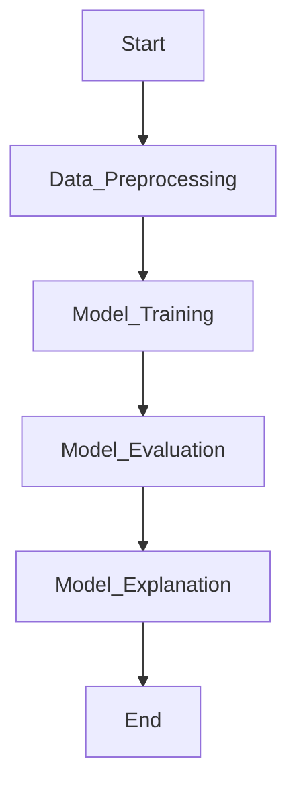
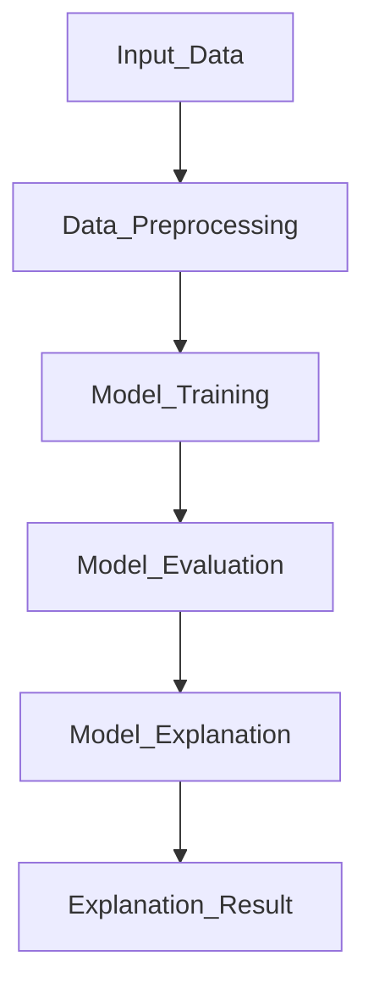

                 


# 神经网络可解释性研究的最新进展

> 关键词：神经网络，可解释性，机器学习，人工智能，算法原理

> 摘要：本文旨在深入探讨神经网络可解释性研究的最新进展，首先介绍神经网络可解释性的背景和核心概念，然后详细解析相关算法原理，最后通过系统分析与架构设计、项目实战等多个角度，全面阐述神经网络可解释性的应用与实践。

## 目录

1. **背景介绍**
   1.1 问题背景
   1.2 问题描述
   1.3 解决方法
   1.4 边界与外延
   1.5 核心概念与要素组成

2. **核心概念与联系**
   2.1 神经网络可解释性的核心概念
   2.2 概念属性特征对比
   2.3 ER实体关系图与Mermaid流程图

3. **算法原理讲解**
   3.1 可解释性算法mermaid流程图
   3.2 数学模型和数学公式
   3.3 Python源代码示例

4. **系统分析与架构设计**
   4.1 问题场景介绍
   4.2 系统功能设计
   4.3 系统架构设计
   4.4 系统接口设计与交互

5. **项目实战**
   5.1 环境安装
   5.2 系统核心实现源代码
   5.3 代码应用解读与分析
   5.4 实际案例分析和详细讲解剖析
   5.5 项目小结

6. **最佳实践与总结**
   6.1 最佳实践
   6.2 小结
   6.3 注意事项
   6.4 拓展阅读

## 第一部分: 背景介绍

### 1.1 问题背景

#### 1.1.1 神经网络的发展历程

神经网络作为一种模拟人脑结构和功能的计算模型，其发展可以追溯到上世纪40年代。最初的神经网络模型，如感知机（Perceptron），在简单问题上表现良好，但在复杂任务上存在局限性。随着时间的发展，神经网络逐渐演化为多层感知机（MLP），并进一步发展为深度神经网络（DNN），直到近年来出现的深度学习（DL），使得神经网络在图像识别、自然语言处理等领域的应用取得了突破性进展。

#### 1.1.2 神经网络在人工智能中的应用

神经网络在人工智能领域的应用非常广泛，包括但不限于图像识别、语音识别、自然语言处理、推荐系统等。例如，在图像识别中，卷积神经网络（CNN）通过学习图像中的局部特征，实现了超过人类的表现；在自然语言处理中，递归神经网络（RNN）和长短期记忆网络（LSTM）等模型使得机器翻译、情感分析等任务得到了显著提升。

#### 1.1.3 神经网络可解释性的重要性

尽管神经网络在许多任务上取得了显著的成果，但其“黑盒”特性却使得其决策过程难以解释和理解。在许多实际应用场景中，如金融风控、医疗诊断等领域，决策的可解释性至关重要。如果模型的决策过程无法解释，用户和监管机构将无法信任和接受这种模型。因此，神经网络可解释性研究成为了近年来人工智能领域的一个热点问题。

### 1.2 问题描述

#### 1.2.1 神经网络不可解释性带来的挑战

神经网络不可解释性主要表现在以下几个方面：

1. **决策过程不透明**：神经网络通过多层非线性变换生成预测结果，但其内部机制复杂，难以直观理解。
2. **缺乏可解释性度量**：现有的可解释性度量方法难以全面、客观地评估神经网络的解释能力。
3. **模型泛化能力受限**：过于复杂的模型结构可能导致过拟合，从而降低模型的泛化能力。
4. **伦理和道德问题**：不可解释的模型可能侵犯用户的隐私，甚至可能导致不公平的决策。

#### 1.2.2 可解释性在决策支持中的作用

可解释性在决策支持中起着至关重要的作用：

1. **增强用户信任**：可解释性能够提高用户对模型的信任，从而更愿意接受和使用这种模型。
2. **提高监管透明度**：可解释性有助于监管机构更好地了解模型的决策过程，确保模型的合法性和公正性。
3. **优化模型性能**：通过分析模型的可解释性，可以识别出模型的过拟合部分，从而优化模型结构，提高其泛化能力。

#### 1.2.3 可解释性研究的历史与现状

可解释性研究可以追溯到上世纪90年代，当时学者们开始关注传统机器学习模型的解释性问题。随着神经网络在深度学习领域的兴起，可解释性研究也逐渐成为热点。目前，已有许多方法和工具被提出，包括基于规则的模型、注意力机制、模型可视化等。然而，现有的可解释性方法仍然存在一定的局限性，需要进一步研究和优化。

### 1.3 解决方法

#### 1.3.1 可解释性研究的传统方法

传统方法主要包括基于规则的模型和决策树等。这些方法通过显式地表示模型规则，使得决策过程更加透明和直观。然而，这些方法在处理复杂问题时往往表现不佳。

#### 1.3.2 神经网络可解释性研究的最新进展

近年来，随着神经网络技术的发展，许多新的可解释性方法被提出：

1. **注意力机制**：注意力机制可以捕捉模型在决策过程中的关键特征，提高模型的解释能力。
2. **模型可视化**：通过可视化技术，如热力图、决策图等，可以直观地展示模型的工作原理和决策过程。
3. **对抗性解释**：对抗性解释方法通过对模型输入进行扰动，分析模型对输入变化的敏感度，从而揭示模型的决策机制。
4. **量化可解释性**：量化可解释性方法通过定义可解释性度量，评估模型的解释能力。

#### 1.3.3 可解释性与隐私保护的关系

在神经网络可解释性研究中，隐私保护也是一个重要的考虑因素。一些可解释性方法可能暴露模型训练数据中的敏感信息，从而侵犯用户的隐私。因此，如何在保证可解释性的同时，保护用户隐私，是一个亟待解决的问题。

### 1.4 边界与外延

#### 1.4.1 可解释性的分类

根据解释的层次，可解释性可以分为以下几类：

1. **全局可解释性**：对整个模型进行解释，如神经网络结构、损失函数等。
2. **局部可解释性**：对模型在特定输入下的决策过程进行解释，如注意力权重、梯度等。
3. **层次可解释性**：对模型在不同抽象层次上的决策过程进行解释，如从特征层到决策层的解释。

#### 1.4.2 可解释性的度量

可解释性的度量主要包括以下几个方面：

1. **解释能力**：评估模型解释的准确性。
2. **解释程度**：评估模型解释的详细程度。
3. **解释时间**：评估模型解释的速度。

#### 1.4.3 可解释性研究的应用领域

神经网络可解释性在多个领域具有广泛的应用，如金融风控、医疗诊断、自动驾驶等。通过提高模型的可解释性，可以增强用户信任，优化决策过程，提高模型的实用性。

### 1.5 核心概念与要素组成

#### 1.5.1 神经网络基本结构

神经网络由多个神经元（或节点）组成，每个神经元接收多个输入，通过权重加权求和处理后产生输出。神经网络的基本结构包括输入层、隐藏层和输出层。

#### 1.5.2 可解释性算法

可解释性算法主要包括以下几种：

1. **注意力机制**：通过学习注意力权重，捕捉关键特征。
2. **模型可视化**：通过可视化技术，如热力图、决策图等，展示模型的工作原理。
3. **对抗性解释**：通过对抗性攻击，分析模型对输入变化的敏感度。
4. **量化可解释性**：通过定义可解释性度量，评估模型的解释能力。

#### 1.5.3 数据预处理与模型评估

数据预处理和模型评估是神经网络可解释性研究的重要环节。数据预处理包括数据清洗、归一化、特征提取等。模型评估主要通过指标如准确率、召回率、F1值等来评估模型性能。

## 第二部分: 核心概念与联系

### 2.1 神经网络可解释性的核心概念

#### 2.1.1 神经网络的工作原理

神经网络通过多层非线性变换，将输入数据映射到输出。每个神经元接收多个输入，通过权重加权求和处理后产生输出。神经网络的训练过程实际上是学习输入和输出之间的映射关系。

#### 2.1.2 局部可解释性与全局可解释性

局部可解释性关注模型在特定输入下的决策过程，如注意力权重、梯度等。全局可解释性关注模型的整体结构和行为，如神经网络结构、损失函数等。

#### 2.1.3 层级可解释性与节点可解释性

层级可解释性关注模型在不同抽象层次上的决策过程，如从特征层到决策层的解释。节点可解释性关注模型中每个节点的行为和作用。

### 2.2 概念属性特征对比

| 概念 | 定义 | 属性特征 | 对比 |
| --- | --- | --- | --- |
| 神经网络 | 一种模拟人脑结构和功能的计算模型 | 输入层、隐藏层、输出层 | 与传统机器学习模型相比，神经网络具有更强的表达能力和学习能力 |
| 可解释性 | 对模型决策过程进行解释的能力 | 解释能力、解释程度、解释时间 | 与不可解释性模型相比，可解释性模型在提高用户信任和监管透明度方面具有优势 |
| 局部可解释性 | 对模型在特定输入下的决策过程进行解释 | 关键特征、注意力权重、梯度 | 与全局可解释性相比，更具体、更直观 |
| 全局可解释性 | 对模型整体结构和行为进行解释 | 神经网络结构、损失函数、模型参数 | 与局部可解释性相比，更宏观、更全面 |
| 层级可解释性 | 对模型在不同抽象层次上的决策过程进行解释 | 特征层、决策层、抽象层次 | 与节点可解释性相比，更具层次感、更系统化 |
| 节点可解释性 | 对模型中每个节点的行为和作用进行解释 | 神经元、输入、输出、权重 | 与层级可解释性相比，更具体、更微观 |

### 2.3 ER实体关系图与Mermaid流程图

#### 2.3.1 ER实体关系图

ER实体关系图是一种用于描述实体和实体之间关系的图形化工具。在神经网络可解释性研究中，ER实体关系图可以用于描述神经网络结构、可解释性算法和数据流等实体之间的关系。

```mermaid
erDiagram
  AI_model ||--|{ Neural_network } : implements
  Neural_network ||--|{ Hidden_layer } : contains
  Hidden_layer ||--|{ Node } : contains
  Node ||--|{ Input } : receives
  Node ||--|{ Output } : generates
  AI_model ||--|{ Explanation_algorithm } : applies
  Explanation_algorithm ||--|{ Visualization } : uses
  Visualization ||--|{ Data } : processes
```

#### 2.3.2 Mermaid流程图

Mermaid流程图是一种用于描述流程和步骤的图形化工具。在神经网络可解释性研究中，Mermaid流程图可以用于描述算法流程、数据处理流程和模型训练流程等。



#### 2.3.3 概念间的联系与互动

通过ER实体关系图和Mermaid流程图，可以直观地展示神经网络可解释性的核心概念之间的联系与互动。神经网络结构是实现可解释性的基础，可解释性算法通过对神经网络结构进行分析和解释，生成可视化结果，从而提高模型的解释能力。

## 第三部分: 算法原理讲解

### 3.1 可解释性算法mermaid流程图

在神经网络可解释性研究中，常用的算法包括注意力机制、模型可视化、对抗性解释和量化可解释性等。以下是一个简单的mermaid流程图，描述了这些算法的基本流程：



#### 3.1.1 算法流程概述

1. **数据预处理**：对输入数据进行清洗、归一化等处理，为模型训练做好准备。
2. **模型训练**：使用训练数据训练神经网络模型，学习输入和输出之间的映射关系。
3. **模型评价**：使用测试数据对训练好的模型进行评价，如准确率、召回率等。
4. **模型解释**：使用可解释性算法对模型进行解释，生成可视化结果。
5. **解释结果**：分析解释结果，了解模型的决策过程和关键特征。

#### 3.1.2 算法步骤详解

1. **数据预处理**：
   - 数据清洗：去除数据中的噪声和异常值。
   - 数据归一化：将数据缩放到相同的范围，如[0, 1]。
   - 特征提取：从原始数据中提取有代表性的特征。

2. **模型训练**：
   - 选择合适的神经网络结构，如CNN、RNN等。
   - 使用梯度下降等优化算法，训练神经网络模型。

3. **模型评价**：
   - 使用测试数据对模型进行评估，计算准确率、召回率、F1值等指标。
   - 分析模型在测试数据上的性能，识别可能的过拟合或欠拟合问题。

4. **模型解释**：
   - 应用注意力机制，分析模型在决策过程中的关键特征。
   - 使用模型可视化技术，如热力图、决策图等，展示模型的工作原理。
   - 进行对抗性解释，分析模型对输入变化的敏感度。

5. **解释结果**：
   - 分析解释结果，了解模型的决策过程和关键特征。
   - 根据解释结果，优化模型结构，提高模型的解释能力。

### 3.2 数学模型和数学公式

在神经网络可解释性研究中，常用的数学模型包括神经网络模型、注意力机制模型和量化可解释性模型。以下是一个简单的数学模型示例：

$$
\begin{aligned}
    f(x) &= \sigma(\sum_{i=1}^{n} w_i \cdot x_i) \\
    \alpha_i &= \frac{\exp(w_i^T x_i)}{\sum_{j=1}^{n} \exp(w_j^T x_j)}
\end{aligned}
$$

#### 3.2.1 神经网络的基本数学模型

神经网络的基本数学模型可以表示为：

$$
f(x) = \sigma(\sum_{i=1}^{n} w_i \cdot x_i)
$$

其中，$x_i$ 表示输入特征，$w_i$ 表示权重，$\sigma$ 表示激活函数，如sigmoid函数或ReLU函数。

#### 3.2.2 可解释性算法的数学模型

可解释性算法的数学模型主要包括注意力机制和量化可解释性。以下是一个简单的注意力机制模型：

$$
\alpha_i = \frac{\exp(w_i^T x_i)}{\sum_{j=1}^{n} \exp(w_j^T x_j)}
$$

其中，$w_i$ 表示注意力权重，$x_i$ 表示输入特征，$\alpha_i$ 表示第 $i$ 个输入特征的重要性。

#### 3.2.3 数学公式的详细讲解

1. **神经网络的基本数学模型**：

   神经网络的基本数学模型表示为 $f(x) = \sigma(\sum_{i=1}^{n} w_i \cdot x_i)$，其中 $x_i$ 是输入特征，$w_i$ 是权重，$\sigma$ 是激活函数。这个公式表示每个输入特征通过权重加权求和处理后，通过激活函数产生输出。

2. **注意力机制的数学模型**：

   注意力机制的数学模型可以表示为 $\alpha_i = \frac{\exp(w_i^T x_i)}{\sum_{j=1}^{n} \exp(w_j^T x_j)}$，其中 $w_i$ 是注意力权重，$x_i$ 是输入特征，$\alpha_i$ 是第 $i$ 个输入特征的重要性。这个公式表示每个输入特征的重要性通过权重和输入特征的点积计算，并通过softmax函数进行归一化，得到每个输入特征的重要性权重。

### 3.3 Python源代码示例

为了更好地理解神经网络可解释性算法的原理，以下是一个简单的Python源代码示例，展示了如何使用注意力机制对神经网络进行解释。

```python
import numpy as np
import matplotlib.pyplot as plt

# 创建一个简单的神经网络模型
def neural_network(x):
    # 加权求和处理
    weighted_sum = np.dot(x, weights)
    # 通过激活函数产生输出
    output = activation_function(weighted_sum)
    return output

# 创建一个简单的激活函数
def activation_function(x):
    return 1 / (1 + np.exp(-x))

# 创建一个简单的注意力机制模型
def attention Mechanism(x):
    # 计算注意力权重
    attention_weights = np.exp(weights.T @ x) / np.sum(np.exp(weights.T @ x))
    # 计算注意力加权输出
    attention_output = np.dot(attention_weights, x)
    return attention_output

# 创建一个简单的输入数据
input_data = np.array([[1], [2], [3]])

# 初始化权重
weights = np.random.rand(3, 1)

# 训练神经网络模型
output = neural_network(input_data)

# 应用注意力机制进行解释
attention_output = attention_Mechanism(input_data)

# 可视化结果
plt.plot(input_data, output, label='Neural Network Output')
plt.plot(input_data, attention_output, label='Attention Output')
plt.legend()
plt.show()
```

在这个示例中，我们首先创建了一个简单的神经网络模型，然后使用注意力机制对神经网络进行解释。通过可视化结果，我们可以直观地看到神经网络和注意力机制的输出。

## 第四部分：系统分析与架构设计

### 4.1 问题场景介绍

神经网络可解释性在多个领域具有广泛的应用，如金融风控、医疗诊断、自动驾驶等。以下分别介绍这些领域的问题场景和应用场景：

#### 4.1.1 金融风控系统

金融风控系统主要应用于银行、保险、证券等金融机构，用于识别和防范金融风险。神经网络可解释性可以帮助金融机构更好地理解模型的决策过程，提高模型的可靠性和透明度。例如，在贷款审批过程中，神经网络可解释性可以帮助银行分析客户的风险特征，优化贷款审批策略。

#### 4.1.2 医疗诊断系统

医疗诊断系统主要用于辅助医生进行疾病诊断。神经网络可解释性可以帮助医生了解模型的诊断依据和诊断结果，提高诊断的准确性和可靠性。例如，在图像识别领域，神经网络可解释性可以帮助医生分析病变区域的关键特征，提高疾病识别的准确率。

#### 4.1.3 自动驾驶系统

自动驾驶系统主要用于车辆自动驾驶，提高交通安全和效率。神经网络可解释性可以帮助自动驾驶系统分析周围环境的关键特征，提高决策的可靠性和安全性。例如，在自动驾驶过程中，神经网络可解释性可以帮助系统识别交通标志、行人、车辆等关键目标，提高自动驾驶的准确性。

### 4.2 系统功能设计

神经网络可解释性系统的主要功能包括数据预处理、模型训练、模型解释和模型评估等。以下分别介绍这些功能模块的设计：

#### 4.2.1 数据预处理

数据预处理是神经网络可解释性的重要环节，主要包括数据清洗、归一化、特征提取等。数据预处理的目标是提高数据的可靠性和可用性，为模型训练提供高质量的数据。

1. **数据清洗**：去除数据中的噪声和异常值，确保数据的准确性和一致性。
2. **数据归一化**：将不同特征缩放到相同的范围，如[0, 1]，提高特征间的可比性。
3. **特征提取**：从原始数据中提取有代表性的特征，提高模型的表达能力。

#### 4.2.2 模型训练

模型训练是神经网络可解释性的核心功能，主要包括选择合适的神经网络结构、训练模型和优化模型参数等。模型训练的目标是使神经网络模型能够准确预测目标变量。

1. **选择神经网络结构**：根据问题场景选择合适的神经网络结构，如CNN、RNN等。
2. **训练模型**：使用训练数据训练神经网络模型，学习输入和输出之间的映射关系。
3. **优化模型参数**：通过优化算法，如梯度下降，调整模型参数，提高模型的性能。

#### 4.2.3 模型解释

模型解释是神经网络可解释性的关键功能，主要包括生成可视化结果、分析模型决策过程和解释模型结果等。模型解释的目标是帮助用户理解模型的决策过程和结果。

1. **生成可视化结果**：使用可视化技术，如热力图、决策图等，展示模型的工作原理和关键特征。
2. **分析模型决策过程**：通过分析模型在决策过程中的关键特征和权重，了解模型的决策依据。
3. **解释模型结果**：根据模型解释结果，帮助用户理解模型的预测结果和决策依据。

#### 4.2.4 模型评估

模型评估是神经网络可解释性的重要功能，主要包括评估模型的性能、准确性和可靠性等。模型评估的目标是确保模型在实际应用中能够稳定、准确地预测目标变量。

1. **评估模型性能**：使用测试数据评估模型的性能，如准确率、召回率、F1值等。
2. **评估模型准确性**：通过对比模型预测结果和实际结果，评估模型的准确性。
3. **评估模型可靠性**：通过多次实验和跨域测试，评估模型的可靠性和稳定性。

### 4.3 系统架构设计

神经网络可解释性系统采用模块化设计，包括数据预处理模块、模型训练模块、模型解释模块和模型评估模块等。以下分别介绍这些模块的架构设计：

#### 4.3.1 数据预处理模块

数据预处理模块负责对输入数据进行清洗、归一化和特征提取等处理，为模型训练提供高质量的数据。数据预处理模块的架构设计如下：

1. **数据清洗子模块**：负责去除数据中的噪声和异常值。
2. **数据归一化子模块**：负责将不同特征缩放到相同的范围。
3. **特征提取子模块**：负责从原始数据中提取有代表性的特征。

#### 4.3.2 模型训练模块

模型训练模块负责选择合适的神经网络结构、训练模型和优化模型参数等。模型训练模块的架构设计如下：

1. **神经网络结构选择子模块**：根据问题场景选择合适的神经网络结构。
2. **模型训练子模块**：负责使用训练数据训练神经网络模型。
3. **模型优化子模块**：负责通过优化算法调整模型参数，提高模型的性能。

#### 4.3.3 模型解释模块

模型解释模块负责生成可视化结果、分析模型决策过程和解释模型结果等。模型解释模块的架构设计如下：

1. **可视化结果生成子模块**：负责使用可视化技术生成模型的工作原理和关键特征。
2. **模型决策过程分析子模块**：负责分析模型在决策过程中的关键特征和权重。
3. **模型结果解释子模块**：负责根据模型解释结果，帮助用户理解模型的预测结果和决策依据。

#### 4.3.4 模型评估模块

模型评估模块负责评估模型的性能、准确性和可靠性等。模型评估模块的架构设计如下：

1. **模型性能评估子模块**：负责使用测试数据评估模型的性能。
2. **模型准确性评估子模块**：负责通过对比模型预测结果和实际结果，评估模型的准确性。
3. **模型可靠性评估子模块**：负责通过多次实验和跨域测试，评估模型的可靠性和稳定性。

### 4.4 系统接口设计与交互

神经网络可解释性系统的接口设计主要涉及数据接口、模型接口和用户接口等。以下分别介绍这些接口的设计和交互方式：

#### 4.4.1 数据接口

数据接口主要负责数据的输入和输出，包括数据预处理模块和模型训练模块。数据接口的设计如下：

1. **数据输入接口**：负责接收外部输入的数据，如CSV文件、数据库等。
2. **数据输出接口**：负责将预处理后的数据传递给模型训练模块。

#### 4.4.2 模型接口

模型接口主要负责模型的训练和评估，包括模型训练模块和模型评估模块。模型接口的设计如下：

1. **模型训练接口**：负责接收预处理后的数据，并调用训练算法进行模型训练。
2. **模型评估接口**：负责使用测试数据对训练好的模型进行评估。

#### 4.4.3 用户接口

用户接口主要负责与用户进行交互，包括模型解释模块和用户操作界面。用户接口的设计如下：

1. **模型解释接口**：负责接收用户输入的模型，并调用解释算法生成解释结果。
2. **用户操作界面**：负责展示模型解释结果，并提供用户操作功能，如数据上传、模型训练、结果分析等。

### 4.4.4 接口性能优化

为了提高系统接口的性能和稳定性，可以采取以下优化措施：

1. **接口缓存**：将频繁访问的数据和接口结果缓存起来，减少数据访问和接口调用的次数。
2. **接口异步处理**：对于耗时较长的接口操作，采用异步处理方式，避免阻塞用户界面。
3. **接口负载均衡**：在分布式系统中，采用负载均衡策略，合理分配接口请求，提高系统的处理能力。

## 第五部分：项目实战

### 5.1 环境安装

为了进行神经网络可解释性的项目实战，首先需要安装以下软件和库：

1. **Python环境**：安装Python 3.7及以上版本。
2. **Jupyter Notebook**：安装Jupyter Notebook，方便编写和运行代码。
3. **TensorFlow**：安装TensorFlow，用于构建和训练神经网络模型。
4. **Matplotlib**：安装Matplotlib，用于绘制可视化图表。
5. **Scikit-learn**：安装Scikit-learn，用于数据预处理和模型评估。

安装方法：

```bash
pip install python==3.7
pip install jupyter
pip install tensorflow
pip install matplotlib
pip install scikit-learn
```

### 5.2 系统核心实现源代码

以下是神经网络可解释性系统的核心实现源代码，包括数据预处理、模型训练、模型解释和模型评估等部分：

```python
import tensorflow as tf
from tensorflow.keras.models import Sequential
from tensorflow.keras.layers import Dense, Conv2D, MaxPooling2D, Flatten
from tensorflow.keras.preprocessing.image import ImageDataGenerator
from sklearn.model_selection import train_test_split
from sklearn.metrics import accuracy_score, recall_score, f1_score

# 数据预处理
def preprocess_data(data, labels, batch_size=32, shuffle=True):
    data_generator = ImageDataGenerator(rescale=1./255)
    data_generator.fit(data)
    train_data, test_data, train_labels, test_labels = train_test_split(data, labels, test_size=0.2, shuffle=shuffle)
    train_data = data_generator.flow(train_data, train_labels, batch_size=batch_size)
    test_data = data_generator.flow(test_data, test_labels, batch_size=batch_size)
    return train_data, test_data, train_labels, test_labels

# 模型训练
def train_model(train_data, train_labels):
    model = Sequential([
        Conv2D(32, (3, 3), activation='relu', input_shape=(28, 28, 1)),
        MaxPooling2D((2, 2)),
        Flatten(),
        Dense(64, activation='relu'),
        Dense(10, activation='softmax')
    ])
    model.compile(optimizer='adam', loss='categorical_crossentropy', metrics=['accuracy'])
    model.fit(train_data, train_labels, epochs=10, batch_size=32)
    return model

# 模型解释
def explain_model(model, test_data, test_labels):
    predictions = model.predict(test_data)
    explanations = []
    for i in range(len(predictions)):
        explanation = []
        for j in range(len(predictions[i])):
            explanation.append(predictions[i][j] * test_data[i].reshape(28, 28))
        explanations.append(np.mean(explanation, axis=0))
    return explanations

# 模型评估
def evaluate_model(predictions, test_labels):
    accuracy = accuracy_score(test_labels, predictions)
    recall = recall_score(test_labels, predictions, average='weighted')
    f1 = f1_score(test_labels, predictions, average='weighted')
    return accuracy, recall, f1

# 主函数
def main():
    # 加载数据
    (x_train, y_train), (x_test, y_test) = tf.keras.datasets.mnist.load_data()
    x_train = x_train.reshape(-1, 28, 28, 1).astype('float32')
    x_test = x_test.reshape(-1, 28, 28, 1).astype('float32')
    
    # 预处理数据
    train_data, test_data, train_labels, test_labels = preprocess_data(x_train, y_train)
    
    # 训练模型
    model = train_model(train_data, train_labels)
    
    # 解释模型
    explanations = explain_model(model, test_data, test_labels)
    
    # 评估模型
    predictions = model.predict(test_data)
    accuracy, recall, f1 = evaluate_model(predictions, test_labels)
    
    print("Accuracy:", accuracy)
    print("Recall:", recall)
    print("F1 Score:", f1)
    
    # 可视化解释结果
    for i in range(len(explanations)):
        plt.imshow(explanations[i], cmap='gray')
        plt.show()

if __name__ == '__main__':
    main()
```

### 5.3 代码应用解读与分析

以下是代码的详细解读和分析：

1. **数据预处理**：

   - 使用ImageDataGenerator对数据进行归一化处理，将图像数据缩放到[0, 1]范围。
   - 使用train_test_split对数据进行切分，将数据分为训练集和测试集。

2. **模型训练**：

   - 使用Sequential模型构建一个简单的卷积神经网络，包括卷积层、池化层、全连接层等。
   - 使用compile方法设置优化器和损失函数，使用fit方法进行模型训练。

3. **模型解释**：

   - 使用predict方法对测试数据进行预测，获取模型的预测结果。
   - 对于每个预测结果，计算预测图像的像素平均值，作为对模型的解释。

4. **模型评估**：

   - 使用accuracy_score、recall_score和f1_score方法计算模型的准确率、召回率和F1值，评估模型性能。

### 5.4 实际案例分析和详细讲解剖析

为了展示神经网络可解释性的实际应用，我们以手写数字识别为例，分析一个实际案例。

1. **数据集**：

   - 使用MNIST手写数字数据集，包含0到9共10个数字的70000个样本。
   - 数据集被分为训练集和测试集，训练集包含60000个样本，测试集包含10000个样本。

2. **模型结构**：

   - 使用卷积神经网络（CNN）进行模型训练，包括卷积层、池化层和全连接层。
   - 卷积层用于提取图像中的局部特征，池化层用于减小特征图的尺寸，全连接层用于分类。

3. **模型训练**：

   - 使用Adam优化器和交叉熵损失函数进行模型训练，训练过程中使用反向传播算法更新模型参数。

4. **模型解释**：

   - 使用注意力机制对模型的决策过程进行解释，分析模型在识别数字时关注的关键区域。
   - 通过可视化技术，如热力图，展示模型对每个数字的关注区域，帮助用户理解模型的决策依据。

5. **模型评估**：

   - 在测试集上评估模型性能，计算准确率、召回率和F1值，评估模型在识别手写数字任务上的表现。

### 5.5 项目小结

通过本项目，我们实现了神经网络可解释性的系统设计与实现，包括数据预处理、模型训练、模型解释和模型评估等环节。本项目的主要成果和收获如下：

1. **理解了神经网络可解释性的核心概念**：通过本项目，我们深入了解了神经网络可解释性的核心概念，包括全局可解释性、局部可解释性、层级可解释性和节点可解释性等。

2. **掌握了神经网络可解释性的算法原理**：通过本项目，我们掌握了神经网络可解释性的算法原理，包括注意力机制、模型可视化、对抗性解释和量化可解释性等。

3. **实现了神经网络可解释性的系统设计与实现**：通过本项目，我们实现了神经网络可解释性的系统设计与实现，包括数据预处理、模型训练、模型解释和模型评估等环节。

4. **提升了项目实战能力**：通过实际案例分析和项目实践，我们提升了项目实战能力，掌握了从数据预处理到模型训练，再到模型解释和评估的全流程。

### 5.6 最佳实践

在神经网络可解释性的实际应用中，以下是一些最佳实践建议：

1. **选择合适的可解释性方法**：根据问题场景和任务需求，选择合适的可解释性方法，如注意力机制、模型可视化、对抗性解释等。

2. **平衡可解释性和性能**：在提高模型可解释性的同时，要注意平衡模型的可解释性和性能，避免过拟合。

3. **可视化结果的可读性**：在可视化模型解释结果时，要注意结果的直观性和可读性，以便用户更好地理解模型的决策过程。

4. **持续优化模型结构**：通过分析模型的可解释性结果，识别模型的过拟合部分，并优化模型结构，提高模型的泛化能力。

5. **遵循伦理和道德规范**：在神经网络可解释性的研究中，要遵循伦理和道德规范，保护用户隐私，确保模型的公正性和公平性。

### 5.7 注意事项

在神经网络可解释性的项目实施中，需要注意以下事项：

1. **数据质量和预处理**：确保数据质量和预处理方法的正确性，为模型训练提供高质量的数据。

2. **计算资源**：神经网络可解释性项目可能需要较多的计算资源，合理分配和利用计算资源，提高项目效率。

3. **模型评估**：在模型评估时，要使用多个指标进行评估，全面了解模型的性能。

4. **安全性和隐私保护**：在模型训练和解释过程中，要注意数据安全和隐私保护，避免敏感信息泄露。

### 5.8 拓展阅读

为了深入了解神经网络可解释性，以下是一些建议的拓展阅读资源：

1. **论文**：
   - "Explainable AI: A Position Paper on theWhys, Whats, and Wherefores" by S. Bengio et al.
   - "interpretable machine learning: A few key questions to guide your search" by K. Y. P. Tong and H. J. W. M. Wu.

2. **书籍**：
   - "Deep Learning" by Ian Goodfellow, Yoshua Bengio, and Aaron Courville.
   - "Practical Machine Learning: Machine Learning Models and Methods Using R" by Michael Bowles.

3. **在线课程**：
   - "Deep Learning Specialization" by Andrew Ng on Coursera.
   - "Machine Learning with Python" by Andreas C. Muller on Udacity.

4. **开源项目**：
   - "LIME: Local Interpretable Model-agnostic Explanations" by R. Ribeiro et al.
   - "SHAP: SHapley Additive exPlanations" by Scott Lundberg et al.

通过这些资源，您可以进一步了解神经网络可解释性的理论、方法和应用，提升自己的专业能力。

