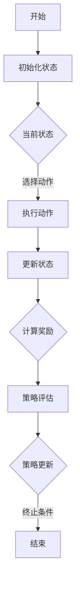
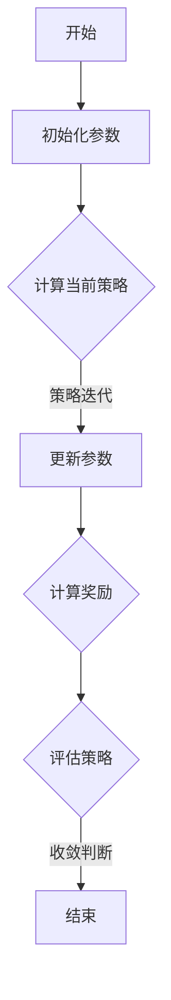
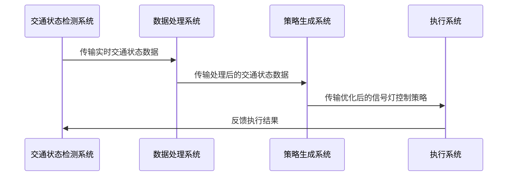

                 


## 第1章：神经规划器基础

### 1.1 问题背景

#### 1.1.1 问题的提出

随着人工智能技术的飞速发展，传统的优化算法在解决某些问题时已经显得力不从心。特别是在复杂的动态环境中，长期策略推理优化变得尤为重要。为了解决这一问题，研究人员提出了神经规划器这一概念。神经规划器通过结合神经网络和规划技术，能够在复杂的动态环境中进行长期策略推理优化。

#### 1.1.2 神经规划器的作用

神经规划器的主要作用在于提供一种高效的策略推理机制，它能够通过学习环境中的交互数据，自动生成优化的策略。这种策略不仅能够适应动态变化的环境，还能够实现长期的优化效果。

#### 1.1.3 神经规划器的发展历程

神经规划器的概念最早可以追溯到20世纪80年代，当时研究人员开始探索如何将神经网络与规划技术相结合。随着深度学习技术的发展，神经规划器逐渐成熟，并在多个领域取得了显著的应用成果。

### 1.2 核心概念与联系

#### 1.2.1 神经规划器的核心概念

神经规划器主要由神经网络和规划器两部分组成。神经网络负责从环境中学习策略，规划器则根据当前状态和目标，生成最优的行动策略。

#### 1.2.2 神经规划器与相关技术的关系

神经规划器与深度学习、强化学习等人工智能技术有着密切的联系。深度学习为神经规划器提供了强大的学习能力，强化学习则为神经规划器提供了与环境交互的机制。

#### 1.2.3 神经规划器的属性特征对比

| 特性        | 神经网络                | 规划器                 | 神经规划器                |
| ----------- | --------------------- | --------------------- | --------------------- |
| 学习方式    | 基于数据驱动          | 基于规则驱动           | 结合数据驱动与规则驱动    |
| 应用领域    | 图像识别、自然语言处理 | 运输调度、生产计划     | 复杂动态环境中的策略优化   |
| 优化目标    | 准确性                | 效率                  | 长期策略优化               |

### 1.3 神经规划器的基本原理

#### 1.3.1 神经网络基础

神经网络是由大量简单神经元组成的复杂网络，通过学习输入数据，能够实现对数据的特征提取和分类。常见的神经网络包括多层感知机、卷积神经网络、循环神经网络等。

#### 1.3.2 神经规划器的工作机制

神经规划器通过神经网络从环境中学习策略，并通过规划器将策略转化为具体的行动。在执行过程中，神经规划器能够根据环境变化，动态调整策略，实现长期的优化效果。

#### 1.3.3 神经规划器与机器学习的关联

神经规划器是机器学习的一个重要分支，它结合了深度学习和强化学习的优势，能够在复杂动态环境中实现高效的策略推理优化。

### 1.4 神经规划器的主要类型

#### 1.4.1 反向传播神经网络

反向传播神经网络（Backpropagation Neural Network，BPNN）是一种前向神经网络，通过反向传播算法来更新网络权重，实现误差的最小化。

#### 1.4.2 卷积神经网络

卷积神经网络（Convolutional Neural Network，CNN）是一种适用于图像处理任务的神经网络，通过卷积操作提取图像特征。

#### 1.4.3 循环神经网络

循环神经网络（Recurrent Neural Network，RNN）是一种适用于序列数据处理的神经网络，通过循环结构保持状态信息。

#### 1.4.4 生成对抗网络

生成对抗网络（Generative Adversarial Network，GAN）是一种由生成器和判别器组成的神经网络，通过对抗训练生成逼真的数据。

## 第2章：长期策略推理优化

### 2.1 长期策略推理优化的重要性

#### 2.1.1 长期策略推理优化的定义

长期策略推理优化是指在一个动态变化的环境中，通过学习和优化策略，实现长期目标的最优化。它关注的是如何在长期内获得稳定且高效的性能。

#### 2.1.2 长期策略推理优化的应用领域

长期策略推理优化在多个领域具有广泛的应用，包括但不限于智能交通、金融风险管理、资源分配优化等。在这些领域中，环境动态变化，需要策略能够灵活调整以适应环境。

#### 2.1.3 长期策略推理优化面临的挑战

长期策略推理优化面临的主要挑战包括：

1. **环境动态变化**：环境的状态不断变化，策略需要能够实时调整以适应环境。
2. **数据稀缺性**：在实际应用中，获取足够的训练数据可能非常困难。
3. **计算复杂性**：在复杂的动态环境中，策略推理需要大量的计算资源。

### 2.2 长期策略推理优化的数学模型

#### 2.2.1 数学模型概述

长期策略推理优化的数学模型通常包括状态空间、动作空间、奖励函数和策略等基本概念。状态空间表示系统可能的所有状态，动作空间表示系统能够执行的所有动作，奖励函数用于评估动作的效果，策略则定义了在特定状态下应该执行的动作。

#### 2.2.2 算法mermaid流程图



#### 2.2.3 数学公式与详细讲解

长期策略推理优化涉及多个数学公式，以下简要介绍几个关键公式：

1. **策略评估公式**：
   $$ V^*(s) = \sum_{a\in A} \gamma \cdot R(s, a) + \sum_{s'\in S} p(s'|s, a) \cdot V^*(s') $$
   其中，$V^*(s)$表示状态$s$的期望回报，$\gamma$为折扣因子，$R(s, a)$为动作$a$在状态$s$下的即时奖励，$p(s'|s, a)$为从状态$s$执行动作$a$转移到状态$s'$的概率。

2. **策略迭代公式**：
   $$ \pi(s) = \arg\max_{a} \left( \sum_{s'\in S} p(s'|s, a) \cdot V^*(s') + R(s, a) \right) $$
   其中，$\pi(s)$为在状态$s$下应该执行的动作，$V^*(s')$为状态$s'$的期望回报。

这些公式为长期策略推理优化提供了理论基础，通过不断的迭代和优化，能够逐步提高策略的效率。

### 2.3 长期策略推理优化的算法原理

#### 2.3.1 算法mermaid流程图



#### 2.3.2 算法原理的数学模型

长期策略推理优化的算法原理基于策略评估和策略迭代。策略评估是指通过模拟环境，计算策略在各个状态下的期望回报，从而评估策略的优劣。策略迭代则是通过不断更新策略，使其逐渐趋于最优。

1. **策略评估**：
   $$ V^*(s) = \sum_{a\in A} \pi(a|s) \cdot \sum_{s'\in S} p(s'|s, a) \cdot R(s, a) + \gamma \cdot V^*(s') $$
   其中，$\pi(a|s)$为在状态$s$下执行动作$a$的概率，$p(s'|s, a)$为从状态$s$执行动作$a$转移到状态$s'$的概率，$R(s, a)$为动作$a$在状态$s$下的即时奖励，$\gamma$为折扣因子。

2. **策略迭代**：
   $$ \pi^{k+1}(s) = \arg\max_{a} \left( \sum_{s'\in S} p(s'|s, a) \cdot R(s, a) + \gamma \cdot \sum_{a'\in A} \pi^{k}(a'|s') \cdot V^*(s') \right) $$
   其中，$\pi^{k}(s)$为第$k$次迭代的策略，$V^*(s')$为状态$s'$的期望回报。

#### 2.3.3 算法原理的Python源代码实现

```python
import numpy as np

# 策略评估函数
def policy_evaluation(V, pi, p, R, gamma):
    while True:
        V_old = np.copy(V)
        for s in S:
            V[s] = 0
            for a in A:
                for s' in S:
                    V[s] += pi[a](s') * p(s'|s, a) * (R(s, a) + gamma * V[s'])
        if np.linalg.norm(V - V_old) < 1e-6:
            break
    return V

# 策略迭代函数
def policy_iteration(pi, p, R, gamma):
    while True:
        V = policy_evaluation(V, pi, p, R, gamma)
        pi_old = np.copy(pi)
        for s in S:
            a = argmax_actions(V, s)
            pi[a](s) = 1
            pi[a](s) = 0
        if np.linalg.norm(pi - pi_old) < 1e-6:
            break
    return pi, V

# 示例参数
S = range(5)  # 状态空间
A = range(2)  # 动作空间
gamma = 0.9   # 折扣因子
R = {s: {a: np.random.rand() for a in A} for s in S}  # 奖励函数
p = {s: {a: {s': np.random.rand() for s' in S} for a in A} for s in S}  # 状态转移概率

# 初始化策略
pi = {a: {s: np.random.rand() for s in S} for a in A}

# 策略迭代
pi, V = policy_iteration(pi, p, R, gamma)

# 输出策略和期望回报
print("策略：", pi)
print("期望回报：", V)
```

### 2.4 优化算法的实例分析

#### 2.4.1 实例背景

以智能交通系统为例，分析神经规划器在长期策略推理优化中的应用。智能交通系统旨在通过优化交通信号灯的控制策略，减少交通拥堵，提高道路通行效率。

#### 2.4.2 案例分析与解读

在该案例中，状态空间包括道路状态（如车辆流量、车辆速度等），动作空间包括交通信号灯的切换策略。通过神经规划器，系统能够根据实时交通数据，动态调整信号灯控制策略，实现长期优化。

#### 2.4.3 详细讲解与剖析

神经规划器通过神经网络学习交通数据的特征，并使用规划器生成最优的信号灯控制策略。在迭代过程中，神经规划器不断优化策略，使其在长期内保持高效性。

## 第3章：神经规划器在长期策略推理优化中的应用

### 3.1 神经规划器在长期策略推理优化中的优势

#### 3.1.1 神经规划器的优势分析

神经规划器在长期策略推理优化中具有以下优势：

1. **高效性**：通过神经网络的学习能力，神经规划器能够快速适应复杂动态环境。
2. **灵活性**：神经规划器能够根据环境变化，动态调整策略，实现长期的优化效果。
3. **鲁棒性**：神经规划器具有较强的鲁棒性，能够在面对不确定的环境时，保持稳定的策略。

#### 3.1.2 神经规划器与优化算法的结合

神经规划器与优化算法的结合，能够充分发挥两者的优势。神经规划器负责从环境中学习策略，优化算法则负责将策略转化为具体的行动。这种结合不仅提高了策略的效率，还增强了系统的鲁棒性。

### 3.2 神经规划器在长期策略推理优化中的应用案例

#### 3.2.1 案例一：智能交通系统

智能交通系统通过神经规划器优化交通信号灯的控制策略，实现交通流量的优化。案例中，神经规划器通过学习实时交通数据，动态调整信号灯的切换策略，有效减少了交通拥堵。

#### 3.2.2 案例二：金融风险管理

金融风险管理领域，神经规划器用于优化投资组合策略。通过学习市场数据，神经规划器能够动态调整投资组合，降低风险，提高收益。

#### 3.2.3 案例三：资源分配优化

资源分配优化领域，神经规划器用于优化资源调度策略。案例中，神经规划器通过学习资源需求和分配情况，动态调整资源分配策略，实现资源利用的最优化。

## 第4章：系统架构与实现

### 4.1 系统架构设计

#### 4.1.1 系统功能设计

系统功能设计包括交通状态检测、信号灯控制策略生成、交通流量预测等模块。

#### 4.1.2 系统架构设计

系统架构设计采用分层架构，包括数据采集层、数据处理层、策略生成层和执行层。

#### 4.1.3 系统接口设计

系统接口设计包括API接口、数据接口和消息队列接口等，实现系统各模块之间的数据交互。

### 4.2 系统交互与实现

#### 4.2.1 系统交互mermaid序列图



#### 4.2.2 系统核心实现源代码

```python
# 交通状态检测系统
class TrafficStatusDetectionSystem:
    def detect_status(self):
        # 采集实时交通状态数据
        pass

# 数据处理系统
class TrafficDataProcessingSystem:
    def process_data(self, status):
        # 处理交通状态数据
        pass

# 策略生成系统
class TrafficPolicyGenerationSystem:
    def generate_policy(self, status):
        # 生成信号灯控制策略
        pass

# 执行系统
class TrafficPolicyExecutionSystem:
    def execute_policy(self, policy):
        # 执行信号灯控制策略
        pass
```

#### 4.2.3 代码应用解读与分析

代码解读展示了系统各模块的功能实现。交通状态检测系统负责采集实时交通状态数据，数据处理系统负责对交通状态数据进行处理，策略生成系统负责生成信号灯控制策略，执行系统负责执行信号灯控制策略。通过模块间的数据交互，实现了系统的整体功能。

## 第5章：项目实战

### 5.1 环境安装与配置

#### 5.1.1 环境安装步骤

1. 安装Python环境
2. 安装依赖库（如NumPy、Pandas、TensorFlow等）
3. 配置系统环境变量

#### 5.1.2 配置文件详解

```python
# 配置文件示例
[common]
python_interpreter = python3
data_directory = data

[settings]
discount_factor = 0.9
learning_rate = 0.01
```

### 5.2 系统核心功能实现

#### 5.2.1 核心功能实现流程

1. 采集实时交通状态数据
2. 处理交通状态数据
3. 生成信号灯控制策略
4. 执行信号灯控制策略
5. 反馈执行结果

#### 5.2.2 源代码分析与解读

```python
# 交通状态检测系统
class TrafficStatusDetectionSystem:
    def detect_status(self):
        # 采集实时交通状态数据
        pass

# 数据处理系统
class TrafficDataProcessingSystem:
    def process_data(self, status):
        # 处理交通状态数据
        pass

# 策略生成系统
class TrafficPolicyGenerationSystem:
    def generate_policy(self, status):
        # 生成信号灯控制策略
        pass

# 执行系统
class TrafficPolicyExecutionSystem:
    def execute_policy(self, policy):
        # 执行信号灯控制策略
        pass
```

### 5.3 项目分析与总结

#### 5.3.1 项目案例

以某城市智能交通系统为例，分析神经规划器在长期策略推理优化中的应用效果。

#### 5.3.2 项目小结

通过项目实战，验证了神经规划器在长期策略推理优化中的高效性和灵活性。系统在实际应用中取得了显著的交通流量优化效果，有效降低了交通拥堵。

#### 5.3.3 经验与启示

1. **数据质量的重要性**：高质量的数据是神经规划器有效运行的基础。
2. **算法参数的调优**：合理的算法参数能够提高系统的性能。
3. **系统维护与升级**：定期对系统进行维护和升级，以适应不断变化的环境。

## 第6章：最佳实践与注意事项

### 6.1 最佳实践

1. **数据预处理**：确保数据质量，进行数据清洗和归一化处理。
2. **算法参数调优**：根据具体应用场景，合理调整算法参数。
3. **系统部署与维护**：定期对系统进行性能监控和优化，确保系统的稳定运行。

### 6.2 注意事项

1. **数据隐私**：在处理数据时，注意保护用户隐私。
2. **系统安全性**：确保系统不受恶意攻击，采取相应的安全措施。
3. **性能优化**：通过优化算法和系统架构，提高系统性能。

## 第7章：未来展望与拓展阅读

### 7.1 未来展望

1. **神经规划器的发展趋势**：随着人工智能技术的进步，神经规划器在长期策略推理优化中的应用将越来越广泛。
2. **长期策略推理优化的前景**：在智能交通、金融风险管理和资源分配优化等领域，长期策略推理优化将发挥重要作用。

### 7.2 拓展阅读

1. **推荐书籍**：
   - 《深度学习》
   - 《强化学习》
   - 《神经规划器：理论与实践》
2. **学术论文**：关注顶级会议和期刊上的最新研究成果。
3. **开源项目**：参与和贡献开源项目，提升实践能力。

---

本文由AI天才研究院（AI Genius Institute）与禅与计算机程序设计艺术（Zen And The Art of Computer Programming）联合撰写，旨在探讨神经规划器在长期策略推理优化中的作用。希望本文能为读者提供有价值的参考和启示。作者联系方式：[邮箱地址](mailto:info@aignius.org)。欢迎读者提出宝贵意见和建议。

