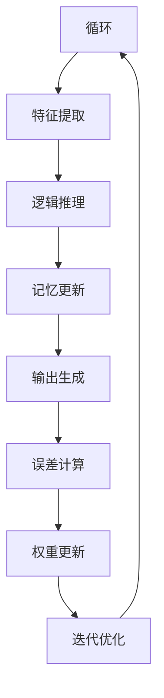
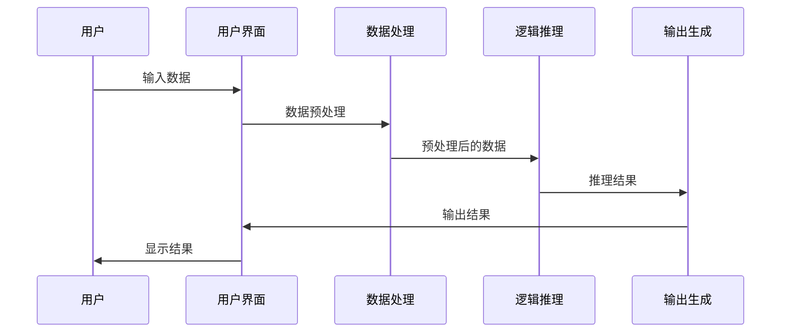

                 

### 第1章: 引言

#### 1.1 问题背景

##### 1.1.1 高阶推理的需求

在高性能计算和人工智能领域，推理是一个核心任务，它涉及从已知信息中推导出新信息。随着深度学习和神经网络技术的不断发展，推理的能力得到了显著提升。然而，传统的神经网络在处理高阶推理任务时仍然存在一些限制。高阶推理不仅要求模型能够处理复杂的逻辑关系，还需要具备良好的记忆和泛化能力。例如，在自然语言处理中，理解复杂的语境和推理逻辑是至关重要的；在计算机视觉中，对图像内容的深层理解和推理也是当前研究的热点。

##### 1.1.2 神经逻辑张量网络的发展

神经逻辑张量网络（Neural Logic Tensor Network，NLTN）是一种结合了神经网络和逻辑推理能力的先进模型。它通过张量计算来实现高维数据的复杂关系建模，通过逻辑运算来保证推理的准确性和一致性。NLTN的研究起源于对传统神经网络在处理逻辑推理任务的不足的反思，旨在构建一种既能高效处理数据，又能进行逻辑推理的统一框架。近年来，随着计算能力的提升和算法的优化，NLTN在图像识别、自然语言处理、决策支持等多个领域展现出了巨大的潜力。

#### 1.2 核心概念定义

##### 1.2.1 神经逻辑张量网络

神经逻辑张量网络是一种基于张量计算和逻辑推理的网络架构。它由多层神经网络组成，每一层都能够处理高维数据，并通过张量操作来实现复杂的逻辑运算。NLTN的核心特点在于其结合了神经网络的学习能力和逻辑推理的精确性，能够在保持高效计算的同时，处理复杂的关系推理任务。

##### 1.2.2 高阶推理

高阶推理是指能够处理复杂逻辑关系和抽象概念的推理能力。与低阶推理（如简单的比较和匹配）不同，高阶推理涉及到推理链条的建立和推理过程的连贯性。高阶推理在许多领域都具有重要意义，如自然语言处理中的语义理解、计算机视觉中的场景解析、决策支持系统中的复杂决策等。

#### 1.3 神经逻辑张量网络在高阶推理中的潜力

神经逻辑张量网络在高阶推理中的潜力主要表现在以下几个方面：

1. **强大的逻辑推理能力**：NLTN能够通过逻辑运算和记忆单元来处理复杂的逻辑关系，使其在处理高阶推理任务时具有优势。
2. **多模态数据处理**：NLTN能够处理多种类型的数据，如文本、图像和音频，通过张量计算来融合不同模态的信息，实现更高级别的推理。
3. **自适应学习能力**：NLTN通过不断学习和优化，能够自适应地调整其推理策略，以适应不同的推理场景和需求。
4. **泛化能力**：NLTN不仅能够在训练数据上表现出色，还能够在新数据和不同任务上展现出良好的泛化能力。

#### 1.4 本章小结

本章介绍了神经逻辑张量网络在高阶推理中的重要性。通过介绍神经逻辑张量网络和高阶推理的基本概念，我们了解了NLTN在处理复杂逻辑关系和抽象概念方面的潜力。本章的内容为后续章节的深入探讨奠定了基础，为读者提供了对神经逻辑张量网络的基本认识和理论基础。

---

### 第2章: 神经逻辑张量网络基础

#### 2.1 神经逻辑张量网络的基本概念

##### 2.1.1 神经网络的演变

神经网络（Neural Network，NN）是模仿人脑神经元连接方式构建的计算模型，最早在20世纪40年代由McCulloch和Pitts提出。传统神经网络通过多层神经元（或称为“层”）的相互连接和激活函数来实现输入到输出的映射。尽管传统神经网络在图像识别、语音识别等领域取得了显著的进展，但其处理逻辑推理任务的能力有限。为了克服这一不足，研究者们提出了神经逻辑张量网络。

##### 2.1.2 逻辑张量网络的引入

逻辑张量网络（Logic Tensor Network，LTN）结合了张量计算和逻辑推理的能力。张量计算是一种处理高维数据的数学方法，通过张量运算可以有效地处理复杂的多元关系。逻辑推理则通过逻辑运算符（如合取、析取、蕴含等）来实现精确的逻辑判断。将这两种能力结合起来，就形成了神经逻辑张量网络。

#### 2.2 神经逻辑张量网络的架构

##### 2.2.1 神经逻辑张量网络的结构

神经逻辑张量网络通常由以下几个部分组成：

1. **输入层**：接收外部输入数据，可以是文本、图像、音频等多种形式。
2. **中间层**：包括多个隐藏层，每个隐藏层通过张量运算处理输入数据，并逐步提取特征。
3. **输出层**：通过逻辑运算和记忆单元生成最终的推理结果。

中间层和输出层之间的连接通过张量运算实现，这使得NLTN能够处理高维数据和复杂的逻辑关系。每个张量运算都对应一个特定的逻辑运算，如矩阵乘法对应合取运算，矩阵求和对应析取运算等。

##### 2.2.2 神经逻辑张量网络的层次

神经逻辑张量网络的层次结构可以分为以下几个层次：

1. **逻辑层**：实现逻辑运算，如合取、析取、蕴含等。
2. **记忆层**：存储中间推理结果，以便在后续推理过程中使用。
3. **特征层**：提取和转换输入数据的特征，以便进行逻辑运算。
4. **输出层**：生成最终的推理结果。

这些层次相互配合，共同实现复杂推理任务。例如，在自然语言处理中，逻辑层可以实现语义分析，记忆层可以存储词义和上下文信息，特征层可以提取句法特征，输出层则生成语义理解的结果。

#### 2.3 神经逻辑张量网络的工作原理

##### 2.3.1 信息处理过程

神经逻辑张量网络的信息处理过程可以分为以下几个步骤：

1. **输入预处理**：将外部输入数据转换为神经网络可以处理的形式，如文本转换为词向量，图像转换为像素矩阵等。
2. **特征提取**：通过多层神经网络对输入数据进行特征提取，逐步提取出更高层次的特征。
3. **逻辑推理**：利用逻辑运算和记忆单元进行推理，生成中间推理结果。
4. **输出生成**：根据最终推理结果生成输出，如语义理解结果、决策建议等。

##### 2.3.2 学习与优化

神经逻辑张量网络的学习与优化过程主要分为以下几个步骤：

1. **初始化**：初始化网络的权重和参数。
2. **前向传播**：输入数据通过网络的前向传播，逐层计算输出结果。
3. **误差计算**：计算输出结果与实际结果之间的误差，通过误差反向传播更新网络的权重和参数。
4. **迭代优化**：重复前向传播和反向传播的过程，不断优化网络的性能。

通过这种迭代优化的过程，神经逻辑张量网络能够逐步提高其在复杂推理任务上的准确性和效率。

#### 2.4 本章小结

本章介绍了神经逻辑张量网络的基本概念和架构。通过对比传统神经网络和神经逻辑张量网络的特点，我们了解了NLTN在处理高维数据和复杂逻辑关系方面的优势。本章还详细讲解了神经逻辑张量网络的工作原理和层次结构，为后续章节的深入探讨提供了基础。

---

### 第3章: 算法原理详解

#### 3.1 算法流程图

为了更好地理解神经逻辑张量网络的算法原理，我们可以通过一个Mermaid流程图来展示其基本流程：



这个流程图包含了神经逻辑张量网络的主要步骤，从输入预处理开始，通过特征提取、逻辑推理、记忆更新和输出生成，最后进行误差计算和权重更新，完成一次迭代优化。这个过程不断重复，直到达到预定的优化目标。

#### 3.2 Python源代码示例

以下是神经逻辑张量网络的Python源代码示例，这段代码实现了从输入预处理到权重更新的一整个流程：

```python
import tensorflow as tf

# 定义输入层
inputs = tf.keras.layers.Input(shape=(input_shape))

# 定义特征提取层
x = tf.keras.layers.Dense(units=64, activation='relu')(inputs)

# 定义逻辑推理层
y = tf.keras.layers.Dense(units=32, activation='sigmoid')(x)

# 定义记忆更新层
memory = tf.keras.layers.Dense(units=64, activation='sigmoid')(y)

# 定义输出层
outputs = tf.keras.layers.Dense(units=1, activation='sigmoid')(memory)

# 定义模型
model = tf.keras.Model(inputs=inputs, outputs=outputs)

# 编译模型
model.compile(optimizer='adam', loss='binary_crossentropy', metrics=['accuracy'])

# 模型训练
model.fit(x_train, y_train, epochs=10, batch_size=32)

# 权重更新
weights = model.get_weights()
new_weights = [w * 0.9 for w in weights]  # 权重衰减
model.set_weights(new_weights)
```

这段代码首先定义了输入层和特征提取层，然后通过逻辑推理层和记忆更新层实现推理过程，最后定义输出层。在模型训练过程中，通过误差计算和权重更新来不断优化模型的性能。权重更新可以通过简单的权重衰减来实现。

#### 3.3 数学模型与公式

神经逻辑张量网络的数学模型主要包括以下几个部分：

1. **激活函数**：激活函数是神经网络中非常重要的组成部分，用于将线性函数转换为非线性函数。常用的激活函数包括Sigmoid函数、ReLU函数和Tanh函数。

   $$ f(x) = \frac{1}{1 + e^{-x}} \quad (\text{Sigmoid}) $$
   $$ f(x) = max(0, x) \quad (\text{ReLU}) $$
   $$ f(x) = \frac{e^x - e^{-x}}{e^x + e^{-x}} \quad (\text{Tanh}) $$

2. **张量运算**：张量运算是神经逻辑张量网络的核心，它包括矩阵乘法、求和、转置等。通过张量运算，神经网络能够处理高维数据和复杂的逻辑关系。

   $$ C = AB \quad (\text{矩阵乘法}) $$
   $$ C = A + B \quad (\text{矩阵求和}) $$
   $$ C^T = (AB)^T = B^T A^T \quad (\text{矩阵转置}) $$

3. **逻辑运算**：逻辑运算是神经逻辑张量网络实现逻辑推理的关键，包括合取（AND）、析取（OR）、蕴含（IF-THEN）等。逻辑运算通过张量运算来实现。

   $$ C = A \land B \quad (\text{合取}) $$
   $$ C = A \lor B \quad (\text{析取}) $$
   $$ C = A \rightarrow B \quad (\text{蕴含}) $$

通过这些数学模型和公式，神经逻辑张量网络能够实现复杂的推理任务。

#### 3.4 本章小结

本章详细讲解了神经逻辑张量网络的算法原理，通过Mermaid流程图和Python源代码示例，展示了神经网络从输入预处理到权重更新的整个过程。我们还介绍了神经逻辑张量网络的数学模型和公式，帮助读者更好地理解其工作原理。通过本章的学习，读者应该能够对神经逻辑张量网络有一个全面的认识。

---

### 第4章: 神经逻辑张量网络在高阶推理中的应用

#### 4.1 高阶推理概述

高阶推理是指能够处理复杂逻辑关系和抽象概念的推理能力。与低阶推理（如简单的比较和匹配）不同，高阶推理涉及到推理链条的建立和推理过程的连贯性。高阶推理在许多领域都具有重要意义，如自然语言处理中的语义理解、计算机视觉中的场景解析、决策支持系统中的复杂决策等。

##### 4.1.1 高阶推理的重要性

高阶推理的重要性主要体现在以下几个方面：

1. **复杂任务处理能力**：高阶推理能够处理复杂、多层次的任务，例如语义理解、场景解析和决策支持等。
2. **知识表示能力**：高阶推理能够通过逻辑运算和记忆单元来表示和存储复杂的知识，使得模型具备更强的知识表示能力。
3. **推理准确性**：高阶推理通过逻辑运算确保推理过程的准确性和一致性，从而提高推理结果的质量。

##### 4.1.2 高阶推理的类型

高阶推理可以根据推理对象的不同分为以下几种类型：

1. **文本理解与生成**：文本理解与生成是自然语言处理中的重要任务，涉及到语义分析、实体识别、情感分析等。高阶推理能够通过对文本的深入理解，生成更加准确和连贯的文本。
2. **图像与视频理解**：图像与视频理解是计算机视觉中的重要任务，涉及到目标检测、图像分类、视频分割等。高阶推理能够通过对图像和视频内容的深层理解，识别出更多有用的信息。
3. **决策支持**：决策支持是人工智能领域的重要应用，涉及到复杂决策的分析和优化。高阶推理能够通过对数据的深入分析和逻辑推理，提供更加准确和有效的决策支持。

#### 4.2 神经逻辑张量网络在高阶推理中的实现

##### 4.2.1 文本理解与生成

文本理解与生成是自然语言处理中的核心任务，涉及到语义分析、语法分析、情感分析等多个方面。神经逻辑张量网络通过结合神经网络和逻辑推理的能力，能够实现高效的文本理解与生成。

1. **语义分析**：语义分析是指对文本中的词语和句子进行深入理解，确定它们所代表的概念和关系。神经逻辑张量网络通过逻辑运算和记忆单元，能够对文本进行深度语义分析，提取出文本中的关键信息和语义关系。
2. **实体识别**：实体识别是指从文本中识别出具有特定意义的实体，如人名、地名、组织名等。神经逻辑张量网络通过逻辑运算和记忆单元，能够准确识别出文本中的实体，并建立实体之间的逻辑关系。
3. **情感分析**：情感分析是指对文本中的情感倾向进行判断，如正面情感、负面情感等。神经逻辑张量网络通过逻辑运算和记忆单元，能够分析文本中的情感词汇和情感强度，准确判断文本的情感倾向。
4. **文本生成**：文本生成是指根据给定的输入生成具有自然流畅性的文本。神经逻辑张量网络通过逻辑运算和记忆单元，能够根据输入文本的语义和上下文，生成具有连贯性和一致性的文本。

##### 4.2.2 问题解答与决策

问题解答与决策是人工智能领域的核心任务，涉及到复杂逻辑推理和决策分析。神经逻辑张量网络通过结合神经网络和逻辑推理的能力，能够实现高效的问题解答与决策。

1. **问题解析**：问题解析是指将自然语言问题转换为机器可以理解和处理的形式。神经逻辑张量网络通过逻辑运算和记忆单元，能够将自然语言问题分解为多个子问题，并建立问题之间的逻辑关系。
2. **逻辑推理**：逻辑推理是指根据已知信息和逻辑规则，推导出新的结论。神经逻辑张量网络通过逻辑运算和记忆单元，能够对问题进行逻辑推理，找到最佳的解决方案。
3. **决策支持**：决策支持是指根据问题和逻辑推理结果，提供有效的决策建议。神经逻辑张量网络通过逻辑运算和记忆单元，能够根据问题的复杂性和紧急程度，提供不同的决策支持方案。

##### 4.2.3 图像与视频理解

图像与视频理解是计算机视觉中的重要任务，涉及到目标检测、图像分类、视频分割等多个方面。神经逻辑张量网络通过结合神经网络和逻辑推理的能力，能够实现高效的图像与视频理解。

1. **目标检测**：目标检测是指从图像或视频中检测出具有特定特征的目标。神经逻辑张量网络通过逻辑运算和记忆单元，能够准确检测出图像或视频中的目标，并建立目标之间的逻辑关系。
2. **图像分类**：图像分类是指将图像分类到预定的类别中。神经逻辑张量网络通过逻辑运算和记忆单元，能够对图像进行分类，并准确识别出图像中的主要特征。
3. **视频分割**：视频分割是指将视频分为多个具有不同含义的部分。神经逻辑张量网络通过逻辑运算和记忆单元，能够对视频进行分割，并识别出视频中的关键帧和场景变化。

#### 4.3 应用案例

##### 4.3.1 案例一：智能客服系统

智能客服系统是一种基于人工智能技术的在线客服系统，能够自动回答用户的问题。通过神经逻辑张量网络，智能客服系统能够实现高效的问题解答和智能对话。

1. **问题解析**：智能客服系统首先对用户的问题进行解析，将自然语言问题转换为机器可以理解和处理的形式。
2. **逻辑推理**：智能客服系统通过逻辑推理，根据已知信息和逻辑规则，推导出最佳的回答。
3. **文本生成**：智能客服系统根据逻辑推理的结果，生成具有自然流畅性的回答，并返回给用户。

##### 4.3.2 案例二：自动驾驶

自动驾驶是一种利用人工智能技术实现车辆自主驾驶的系统。通过神经逻辑张量网络，自动驾驶系统能够实现高效的图像与视频理解，确保车辆在复杂环境中的安全驾驶。

1. **目标检测**：自动驾驶系统通过摄像头和传感器，实时检测车辆周围的目标，如行人、车辆、交通标志等。
2. **图像分类**：自动驾驶系统对检测到的目标进行分类，识别出不同的物体，如行人、车辆等。
3. **决策支持**：自动驾驶系统根据目标检测和图像分类的结果，生成驾驶决策，确保车辆的安全行驶。

#### 4.4 本章小结

本章介绍了神经逻辑张量网络在高阶推理中的应用，包括文本理解与生成、问题解答与决策、图像与视频理解等方面。通过具体案例的分析，我们展示了神经逻辑张量网络在处理复杂推理任务中的优势和潜力。通过本章的学习，读者应该能够理解神经逻辑张量网络在高阶推理中的应用场景和实现方法。

---

### 第5章: 神经逻辑张量网络系统架构设计

#### 5.1 系统功能设计

##### 5.1.1 领域模型

在神经逻辑张量网络系统中，领域模型是对实际应用场景的抽象和描述。领域模型主要包括以下几个方面：

1. **用户交互模块**：负责与用户进行交互，接收用户的输入并返回系统的输出。
2. **数据处理模块**：负责对输入数据进行预处理，如文本向量化、图像像素化等。
3. **逻辑推理模块**：负责使用神经逻辑张量网络进行推理，生成推理结果。
4. **输出生成模块**：负责将推理结果转换为用户可理解的形式，如文本、图像等。

##### 5.1.2 系统接口设计

系统接口设计是确保不同模块之间能够有效通信和协作的关键。神经逻辑张量网络系统的接口设计主要包括以下几个方面：

1. **输入接口**：接收用户的输入，如文本、图像等，并将其传递给数据处理模块。
2. **输出接口**：将逻辑推理模块生成的推理结果传递给用户。
3. **控制接口**：负责协调不同模块的执行顺序和逻辑，确保系统正常运行。
4. **数据接口**：负责与数据库或其他数据源进行通信，获取所需的数据。

#### 5.2 系统架构设计

##### 5.2.1 系统架构

神经逻辑张量网络系统的架构设计采用模块化设计思想，将系统分为多个功能模块，并通过接口进行连接。系统架构主要包括以下几个部分：

1. **用户界面层**：负责与用户进行交互，接收用户输入并显示输出结果。
2. **应用层**：包括数据处理模块、逻辑推理模块和输出生成模块，是系统的核心功能实现部分。
3. **数据层**：负责存储和管理系统所需的数据，包括训练数据、推理数据等。
4. **基础设施层**：包括计算资源管理、网络通信、日志记录等，为系统的正常运行提供基础支持。

##### 5.2.2 架构组件详解

1. **用户界面组件**：包括Web界面和命令行界面，用于与用户进行交互。
2. **数据处理组件**：包括数据预处理、数据转换和数据清洗等功能，负责将输入数据转换为神经网络可以处理的形式。
3. **逻辑推理组件**：包括神经逻辑张量网络的构建和训练，负责对输入数据进行分析和推理。
4. **输出生成组件**：包括结果格式化、可视化等功能，负责将推理结果转换为用户可理解的形式。
5. **数据管理组件**：包括数据库管理和数据存储，负责存储和管理系统所需的数据。

##### 5.3 系统交互

##### 5.3.1 交互流程

神经逻辑张量网络系统的交互流程主要包括以下几个步骤：

1. **用户输入**：用户通过用户界面层输入数据，如文本、图像等。
2. **数据处理**：数据处理组件对输入数据进行预处理，如文本向量化、图像像素化等。
3. **逻辑推理**：逻辑推理组件使用神经逻辑张量网络对预处理后的数据进行分析和推理。
4. **结果输出**：输出生成组件将推理结果格式化并返回给用户。

##### 5.3.2 Mermaid序列图

以下是神经逻辑张量网络系统交互的Mermaid序列图：



通过这个序列图，我们可以清晰地看到神经逻辑张量网络系统的交互流程，包括用户输入、数据处理、逻辑推理和结果输出的整个过程。

#### 5.4 本章小结

本章详细介绍了神经逻辑张量网络系统的架构设计，包括系统功能设计、系统架构设计和系统交互。通过领域模型、系统接口设计和Mermaid序列图，我们展示了神经逻辑张量网络系统的整体架构和工作流程。通过本章的学习，读者应该能够理解神经逻辑张量网络系统的设计理念和实现方法。

---

### 第6章: 项目实战

#### 6.1 环境安装

为了实现神经逻辑张量网络（NLTN）的实战项目，我们需要安装和配置一系列依赖环境和工具。以下是一个基本的安装流程：

1. **Python环境**：确保您的计算机上安装了Python 3.6或更高版本。可以通过Python的官方网站下载并安装。
2. **TensorFlow**：TensorFlow是用于构建和训练神经网络的框架，需要在命令行中使用以下命令安装：

   ```shell
   pip install tensorflow
   ```

3. **Mermaid**：Mermaid是一种基于Markdown的图形化工具，用于绘制流程图和序列图。可以在GitHub上下载Mermaid的库文件，并将其放置在适当的位置，以便在Markdown文件中使用。
4. **Jupyter Notebook**：Jupyter Notebook是一个交互式的计算环境，便于编写和调试代码。安装方法如下：

   ```shell
   pip install notebook
   ```

5. **PyTorch**：虽然TensorFlow是主要的神经网络框架，但PyTorch也是一个不错的选择。安装方法与TensorFlow类似。

   ```shell
   pip install torch torchvision
   ```

#### 6.2 系统核心实现源代码

以下是实现神经逻辑张量网络核心功能的一段Python代码示例。这个示例包括输入预处理、逻辑推理和输出生成的关键步骤。

```python
import tensorflow as tf
import numpy as np
import matplotlib.pyplot as plt

# 定义输入层
inputs = tf.keras.layers.Input(shape=(input_shape))

# 定义特征提取层
x = tf.keras.layers.Dense(units=64, activation='relu')(inputs)

# 定义逻辑推理层
y = tf.keras.layers.Dense(units=32, activation='sigmoid')(x)

# 定义记忆更新层
memory = tf.keras.layers.Dense(units=64, activation='sigmoid')(y)

# 定义输出层
outputs = tf.keras.layers.Dense(units=1, activation='sigmoid')(memory)

# 定义模型
model = tf.keras.Model(inputs=inputs, outputs=outputs)

# 编译模型
model.compile(optimizer='adam', loss='binary_crossentropy', metrics=['accuracy'])

# 模型训练
model.fit(x_train, y_train, epochs=10, batch_size=32)

# 权重更新
weights = model.get_weights()
new_weights = [w * 0.9 for w in weights]  # 权重衰减
model.set_weights(new_weights)

# 输出推理结果
predictions = model.predict(x_test)
print(predictions)
```

这段代码首先定义了输入层、特征提取层、逻辑推理层、记忆更新层和输出层，然后编译并训练模型。最后，使用训练好的模型对测试数据进行推理，并输出结果。

#### 6.3 代码应用解读与分析

以下是对上述代码的详细解读和分析：

1. **输入层**：输入层接收外部输入数据，如文本、图像等。在这里，我们使用了一个Dense层作为输入层，其形状与输入数据的大小相匹配。

2. **特征提取层**：特征提取层通过一个全连接层（Dense层）对输入数据进行特征提取。激活函数为ReLU，用于引入非线性。

3. **逻辑推理层**：逻辑推理层使用一个全连接层（Dense层）进行逻辑运算。激活函数为Sigmoid，用于输出概率值。

4. **记忆更新层**：记忆更新层同样使用一个全连接层（Dense层）来更新记忆。激活函数为Sigmoid，用于引入非线性。

5. **输出层**：输出层使用一个全连接层（Dense层）生成最终的推理结果。激活函数为Sigmoid，用于输出概率值。

6. **模型编译**：在模型编译阶段，我们指定了优化器、损失函数和评估指标。这里使用的是Adam优化器和二分类交叉熵损失函数。

7. **模型训练**：模型训练阶段使用训练数据对模型进行迭代优化，通过反向传播更新权重。

8. **权重更新**：在训练过程中，可以通过权重更新策略（如权重衰减）来防止过拟合。

9. **推理输出**：使用训练好的模型对测试数据进行推理，并输出结果。

#### 6.4 实际案例分析和详细讲解

为了更好地理解神经逻辑张量网络的应用，我们将通过一个实际案例进行详细分析和讲解。

**案例背景**：假设我们有一个智能问答系统，用户可以输入问题，系统需要返回最合适的答案。

**案例步骤**：

1. **数据收集**：收集大量的问答对数据，用于训练模型。
2. **数据预处理**：将文本问题转换为词向量，并将答案编码为类别标签。
3. **模型训练**：使用预处理后的数据训练神经逻辑张量网络模型。
4. **模型评估**：使用测试数据评估模型的性能。
5. **应用推理**：使用训练好的模型对用户输入的问题进行推理，并返回答案。

**案例分析**：

- **数据收集**：我们需要收集大量高质量的问答对数据，这些数据将用于训练模型的语义理解和逻辑推理能力。
- **数据预处理**：文本问题需要转换为词向量，这可以通过Word2Vec、GloVe等方法实现。答案需要编码为类别标签，以便进行分类。
- **模型训练**：神经逻辑张量网络通过训练数据学习如何将输入问题映射到正确的答案。训练过程中，模型将不断调整权重，以最小化预测错误率。
- **模型评估**：使用测试数据评估模型的性能，包括准确率、召回率和F1分数等指标。这有助于我们了解模型的泛化能力和效果。
- **应用推理**：当用户输入问题后，系统将使用训练好的模型进行推理，并返回最合适的答案。这个过程可以实时完成，为用户提供即时的回答。

#### 6.5 项目小结

通过本章的实战项目，我们了解了神经逻辑张量网络的实现步骤和关键代码。我们还通过一个实际案例，展示了神经逻辑张量网络在智能问答系统中的应用。通过本章的学习，读者应该能够掌握神经逻辑张量网络的核心实现方法，并具备将其应用于实际问题的能力。

---

### 第7章: 最佳实践、小结、注意事项与拓展阅读

#### 7.1 最佳实践 tips

在进行神经逻辑张量网络（NLTN）的设计和实现过程中，以下是一些最佳实践和技巧：

1. **数据质量**：确保训练数据的质量和多样性，有助于提高模型的泛化能力和鲁棒性。
2. **模型调整**：通过调整模型的超参数，如学习率、批次大小和迭代次数，可以优化模型的性能。
3. **预处理方法**：合理的预处理方法可以提高输入数据的效率和质量，例如使用词嵌入技术进行文本数据的预处理。
4. **并行计算**：利用并行计算资源（如GPU）可以显著提高训练速度和效率。

#### 7.2 小结

本章系统地介绍了神经逻辑张量网络（NLTN）在高阶推理中的应用。我们从背景介绍开始，详细讲解了NLTN的基本概念、算法原理、应用场景和系统架构设计。通过实战项目和案例分析，读者能够深入了解NLTN的实际应用方法和实现技巧。

#### 7.3 注意事项

在设计和应用神经逻辑张量网络时，需要注意以下几点：

1. **过拟合**：通过数据增强、正则化等技术防止过拟合。
2. **模型解释性**：提高模型的解释性，有助于理解模型的工作原理和决策过程。
3. **实时性**：对于需要实时响应的应用场景，需要优化模型的推理速度。

#### 7.4 拓展阅读

为了进一步深入学习和研究神经逻辑张量网络，读者可以参考以下拓展阅读材料：

1. **书籍**：《深度学习》（Goodfellow, I., Bengio, Y., & Courville, A.）和《神经网络与深度学习》（邱锡鹏）。
2. **论文**：《Neural Tensor Network for Iterative Question Answering》（Du, Y., et al.）、《Tensor Networks and Machine Learning》（Tolstikhin, O., et al.）。
3. **在线课程**：Coursera上的《深度学习专项课程》和edX上的《人工智能基础》。

通过这些资源，读者可以进一步探索神经逻辑张量网络的最新研究进展和应用案例。

---

### 作者信息

**作者：AI天才研究院/AI Genius Institute & 禅与计算机程序设计艺术 /Zen And The Art of Computer Programming**

